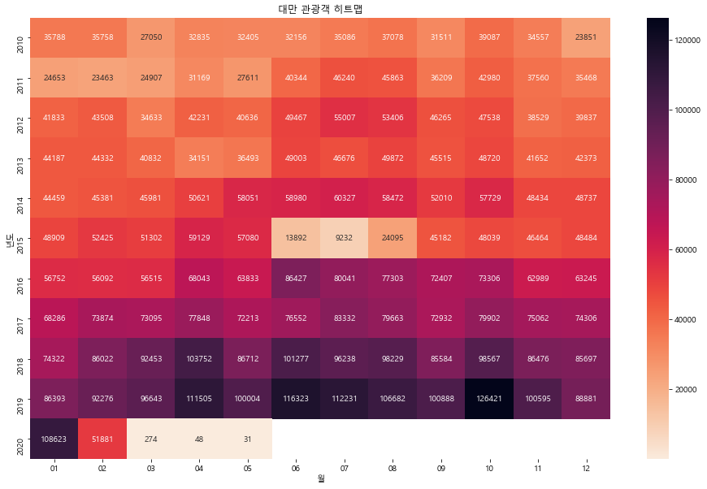

#### 1. 외국인 출입국 통계 데이터 구하기


```python
import pandas as pd
kto_201901 = pd.read_excel(r'C:\Users\hwn11\Data\datasalon-master\datasalon-master\02_개정판\4_Tourists_Event\files/kto_201901.xlsx',
                          header = 1,
                          usecols = 'A:G',
                          skipfooter = 4)
kto_201901.head()
```


<div>
<style scoped>
    .dataframe tbody tr th:only-of-type {
        vertical-align: middle;
    }

    .dataframe tbody tr th {
        vertical-align: top;
    }

    .dataframe thead th {
        text-align: right;
    }
</style>
<table border="1" class="dataframe">
  <thead>
    <tr style="text-align: right;">
      <th></th>
      <th>국적</th>
      <th>관광</th>
      <th>상용</th>
      <th>공용</th>
      <th>유학/연수</th>
      <th>기타</th>
      <th>계</th>
    </tr>
  </thead>
  <tbody>
    <tr>
      <th>0</th>
      <td>아시아주</td>
      <td>765082</td>
      <td>10837</td>
      <td>1423</td>
      <td>14087</td>
      <td>125521</td>
      <td>916950</td>
    </tr>
    <tr>
      <th>1</th>
      <td>일본</td>
      <td>198805</td>
      <td>2233</td>
      <td>127</td>
      <td>785</td>
      <td>4576</td>
      <td>206526</td>
    </tr>
    <tr>
      <th>2</th>
      <td>대만</td>
      <td>86393</td>
      <td>74</td>
      <td>22</td>
      <td>180</td>
      <td>1285</td>
      <td>87954</td>
    </tr>
    <tr>
      <th>3</th>
      <td>홍콩</td>
      <td>34653</td>
      <td>59</td>
      <td>2</td>
      <td>90</td>
      <td>1092</td>
      <td>35896</td>
    </tr>
    <tr>
      <th>4</th>
      <td>마카오</td>
      <td>2506</td>
      <td>2</td>
      <td>0</td>
      <td>17</td>
      <td>45</td>
      <td>2570</td>
    </tr>
  </tbody>
</table>
</div>


```python
kto_201901.info()
```

    <class 'pandas.core.frame.DataFrame'>
    RangeIndex: 67 entries, 0 to 66
    Data columns (total 7 columns):
     #   Column  Non-Null Count  Dtype 
    ---  ------  --------------  ----- 
     0   국적      67 non-null     object
     1   관광      67 non-null     int64 
     2   상용      67 non-null     int64 
     3   공용      67 non-null     int64 
     4   유학/연수   67 non-null     int64 
     5   기타      67 non-null     int64 
     6   계       67 non-null     int64 
    dtypes: int64(6), object(1)
    memory usage: 3.8+ KB
    


```python
kto_201901.describe()
```


<div>
<style scoped>
    .dataframe tbody tr th:only-of-type {
        vertical-align: middle;
    }

    .dataframe tbody tr th {
        vertical-align: top;
    }

    .dataframe thead th {
        text-align: right;
    }
</style>
<table border="1" class="dataframe">
  <thead>
    <tr style="text-align: right;">
      <th></th>
      <th>관광</th>
      <th>상용</th>
      <th>공용</th>
      <th>유학/연수</th>
      <th>기타</th>
      <th>계</th>
    </tr>
  </thead>
  <tbody>
    <tr>
      <th>count</th>
      <td>67.00000</td>
      <td>67.000000</td>
      <td>67.000000</td>
      <td>67.000000</td>
      <td>67.000000</td>
      <td>67.000000</td>
    </tr>
    <tr>
      <th>mean</th>
      <td>26396.80597</td>
      <td>408.208955</td>
      <td>132.507463</td>
      <td>477.462687</td>
      <td>5564.208955</td>
      <td>32979.194030</td>
    </tr>
    <tr>
      <th>std</th>
      <td>102954.04969</td>
      <td>1416.040302</td>
      <td>474.406339</td>
      <td>2009.484800</td>
      <td>17209.438418</td>
      <td>122821.369969</td>
    </tr>
    <tr>
      <th>min</th>
      <td>0.00000</td>
      <td>0.000000</td>
      <td>0.000000</td>
      <td>0.000000</td>
      <td>16.000000</td>
      <td>54.000000</td>
    </tr>
    <tr>
      <th>25%</th>
      <td>505.00000</td>
      <td>14.500000</td>
      <td>2.500000</td>
      <td>17.500000</td>
      <td>260.000000</td>
      <td>927.000000</td>
    </tr>
    <tr>
      <th>50%</th>
      <td>1304.00000</td>
      <td>45.000000</td>
      <td>14.000000</td>
      <td>43.000000</td>
      <td>912.000000</td>
      <td>2695.000000</td>
    </tr>
    <tr>
      <th>75%</th>
      <td>8365.00000</td>
      <td>176.500000</td>
      <td>38.000000</td>
      <td>182.000000</td>
      <td>2824.500000</td>
      <td>14905.500000</td>
    </tr>
    <tr>
      <th>max</th>
      <td>765082.00000</td>
      <td>10837.000000</td>
      <td>2657.000000</td>
      <td>14087.000000</td>
      <td>125521.000000</td>
      <td>916950.000000</td>
    </tr>
  </tbody>
</table>
</div>


```python
#최솟값이 0인 사람들 확인
condition = (kto_201901['관광'] == 0) \
            | (kto_201901['상용'] == 0) \
            | (kto_201901['공용'] == 0) \
            | (kto_201901['유학/연수'] == 0)
kto_201901[condition]
```


<div>
<style scoped>
    .dataframe tbody tr th:only-of-type {
        vertical-align: middle;
    }

    .dataframe tbody tr th {
        vertical-align: top;
    }

    .dataframe thead th {
        text-align: right;
    }
</style>
<table border="1" class="dataframe">
  <thead>
    <tr style="text-align: right;">
      <th></th>
      <th>국적</th>
      <th>관광</th>
      <th>상용</th>
      <th>공용</th>
      <th>유학/연수</th>
      <th>기타</th>
      <th>계</th>
    </tr>
  </thead>
  <tbody>
    <tr>
      <th>4</th>
      <td>마카오</td>
      <td>2506</td>
      <td>2</td>
      <td>0</td>
      <td>17</td>
      <td>45</td>
      <td>2570</td>
    </tr>
    <tr>
      <th>20</th>
      <td>이스라엘</td>
      <td>727</td>
      <td>12</td>
      <td>0</td>
      <td>9</td>
      <td>57</td>
      <td>805</td>
    </tr>
    <tr>
      <th>22</th>
      <td>우즈베키스탄</td>
      <td>1958</td>
      <td>561</td>
      <td>0</td>
      <td>407</td>
      <td>2828</td>
      <td>5754</td>
    </tr>
    <tr>
      <th>38</th>
      <td>스위스</td>
      <td>613</td>
      <td>18</td>
      <td>0</td>
      <td>19</td>
      <td>97</td>
      <td>747</td>
    </tr>
    <tr>
      <th>45</th>
      <td>그리스</td>
      <td>481</td>
      <td>17</td>
      <td>4</td>
      <td>0</td>
      <td>273</td>
      <td>775</td>
    </tr>
    <tr>
      <th>46</th>
      <td>포르투갈</td>
      <td>416</td>
      <td>14</td>
      <td>0</td>
      <td>13</td>
      <td>121</td>
      <td>564</td>
    </tr>
    <tr>
      <th>51</th>
      <td>크로아티아</td>
      <td>226</td>
      <td>12</td>
      <td>0</td>
      <td>3</td>
      <td>250</td>
      <td>491</td>
    </tr>
    <tr>
      <th>54</th>
      <td>폴란드</td>
      <td>713</td>
      <td>10</td>
      <td>0</td>
      <td>27</td>
      <td>574</td>
      <td>1324</td>
    </tr>
    <tr>
      <th>59</th>
      <td>대양주 기타</td>
      <td>555</td>
      <td>3</td>
      <td>4</td>
      <td>0</td>
      <td>52</td>
      <td>614</td>
    </tr>
    <tr>
      <th>63</th>
      <td>기타대륙</td>
      <td>33</td>
      <td>4</td>
      <td>0</td>
      <td>1</td>
      <td>16</td>
      <td>54</td>
    </tr>
    <tr>
      <th>64</th>
      <td>국적미상</td>
      <td>33</td>
      <td>4</td>
      <td>0</td>
      <td>1</td>
      <td>16</td>
      <td>54</td>
    </tr>
    <tr>
      <th>65</th>
      <td>교포소계</td>
      <td>0</td>
      <td>0</td>
      <td>0</td>
      <td>0</td>
      <td>15526</td>
      <td>15526</td>
    </tr>
    <tr>
      <th>66</th>
      <td>교포</td>
      <td>0</td>
      <td>0</td>
      <td>0</td>
      <td>0</td>
      <td>15526</td>
      <td>15526</td>
    </tr>
  </tbody>
</table>
</div>


교포소계랑 교포만 전부다 0. 전부다 기타로 집계되어서 문제없음. 다른애들은 그냥 ㅑ많이 안와서 0으로 나온듯 문제없음.


```python
kto_201901['기준년월'] = '2019-01'
kto_201901.head()
```


<div>
<style scoped>
    .dataframe tbody tr th:only-of-type {
        vertical-align: middle;
    }

    .dataframe tbody tr th {
        vertical-align: top;
    }

    .dataframe thead th {
        text-align: right;
    }
</style>
<table border="1" class="dataframe">
  <thead>
    <tr style="text-align: right;">
      <th></th>
      <th>국적</th>
      <th>관광</th>
      <th>상용</th>
      <th>공용</th>
      <th>유학/연수</th>
      <th>기타</th>
      <th>계</th>
      <th>기준년월</th>
    </tr>
  </thead>
  <tbody>
    <tr>
      <th>0</th>
      <td>아시아주</td>
      <td>765082</td>
      <td>10837</td>
      <td>1423</td>
      <td>14087</td>
      <td>125521</td>
      <td>916950</td>
      <td>2019-01</td>
    </tr>
    <tr>
      <th>1</th>
      <td>일본</td>
      <td>198805</td>
      <td>2233</td>
      <td>127</td>
      <td>785</td>
      <td>4576</td>
      <td>206526</td>
      <td>2019-01</td>
    </tr>
    <tr>
      <th>2</th>
      <td>대만</td>
      <td>86393</td>
      <td>74</td>
      <td>22</td>
      <td>180</td>
      <td>1285</td>
      <td>87954</td>
      <td>2019-01</td>
    </tr>
    <tr>
      <th>3</th>
      <td>홍콩</td>
      <td>34653</td>
      <td>59</td>
      <td>2</td>
      <td>90</td>
      <td>1092</td>
      <td>35896</td>
      <td>2019-01</td>
    </tr>
    <tr>
      <th>4</th>
      <td>마카오</td>
      <td>2506</td>
      <td>2</td>
      <td>0</td>
      <td>17</td>
      <td>45</td>
      <td>2570</td>
      <td>2019-01</td>
    </tr>
  </tbody>
</table>
</div>


```python
#국젝 데이터만 남기기
kto_201901['국적'].unique()
```


    array(['아시아주', '일본', '대만', '홍콩', '마카오', '태국', '말레이시아', '필리핀', '인도네시아',
           '싱가포르', '미얀마', '베트남', '인도', '스리랑카', '파키스탄', '방글라데시', '캄보디아', '몽골',
           '중국', '이란', '이스라엘', '터키', '우즈베키스탄', '카자흐스탄', 'GCC', '아시아 기타', '미주',
           '미국', '캐나다', '멕시코', '브라질', '미주 기타', '구주', '영국', '독일', '프랑스',
           '네덜란드', '스웨덴', '스위스', '이탈리아', '덴마크', '노르웨이', '벨기에', '오스트리아', '스페인',
           '그리스', '포르투갈', '핀란드', '아일랜드', '우크라이나', '러시아', '크로아티아', '루마니아',
           '불가리아', '폴란드', '구주 기타', '대양주', '오스트레일리아', '뉴질랜드', '대양주 기타',
           '아프리카주', '남아프리카공화국', '아프리카 기타', '기타대륙', '국적미상', '교포소계', '교포'],
          dtype=object)


```python
continents_list = ['아시아주', '미주', '구주', '대양주', '아프리카주', '기타대륙', '교포소계']
condition = (kto_201901.국적.isin(continents_list) == False)
kto_201901_country = kto_201901[condition]
kto_201901_country['국적'].unique()
```


    array(['일본', '대만', '홍콩', '마카오', '태국', '말레이시아', '필리핀', '인도네시아', '싱가포르',
           '미얀마', '베트남', '인도', '스리랑카', '파키스탄', '방글라데시', '캄보디아', '몽골', '중국',
           '이란', '이스라엘', '터키', '우즈베키스탄', '카자흐스탄', 'GCC', '아시아 기타', '미국',
           '캐나다', '멕시코', '브라질', '미주 기타', '영국', '독일', '프랑스', '네덜란드', '스웨덴',
           '스위스', '이탈리아', '덴마크', '노르웨이', '벨기에', '오스트리아', '스페인', '그리스', '포르투갈',
           '핀란드', '아일랜드', '우크라이나', '러시아', '크로아티아', '루마니아', '불가리아', '폴란드',
           '구주 기타', '오스트레일리아', '뉴질랜드', '대양주 기타', '남아프리카공화국', '아프리카 기타',
           '국적미상', '교포'], dtype=object)


```python
kto_201901_country.head()
```


<div>
<style scoped>
    .dataframe tbody tr th:only-of-type {
        vertical-align: middle;
    }

    .dataframe tbody tr th {
        vertical-align: top;
    }

    .dataframe thead th {
        text-align: right;
    }
</style>
<table border="1" class="dataframe">
  <thead>
    <tr style="text-align: right;">
      <th></th>
      <th>국적</th>
      <th>관광</th>
      <th>상용</th>
      <th>공용</th>
      <th>유학/연수</th>
      <th>기타</th>
      <th>계</th>
      <th>기준년월</th>
    </tr>
  </thead>
  <tbody>
    <tr>
      <th>1</th>
      <td>일본</td>
      <td>198805</td>
      <td>2233</td>
      <td>127</td>
      <td>785</td>
      <td>4576</td>
      <td>206526</td>
      <td>2019-01</td>
    </tr>
    <tr>
      <th>2</th>
      <td>대만</td>
      <td>86393</td>
      <td>74</td>
      <td>22</td>
      <td>180</td>
      <td>1285</td>
      <td>87954</td>
      <td>2019-01</td>
    </tr>
    <tr>
      <th>3</th>
      <td>홍콩</td>
      <td>34653</td>
      <td>59</td>
      <td>2</td>
      <td>90</td>
      <td>1092</td>
      <td>35896</td>
      <td>2019-01</td>
    </tr>
    <tr>
      <th>4</th>
      <td>마카오</td>
      <td>2506</td>
      <td>2</td>
      <td>0</td>
      <td>17</td>
      <td>45</td>
      <td>2570</td>
      <td>2019-01</td>
    </tr>
    <tr>
      <th>5</th>
      <td>태국</td>
      <td>34004</td>
      <td>37</td>
      <td>199</td>
      <td>96</td>
      <td>6998</td>
      <td>41334</td>
      <td>2019-01</td>
    </tr>
  </tbody>
</table>
</div>


```python
kto_201901_country_newindex = kto_201901_country.reset_index(drop = True)
kto_201901_country_newindex.head()
```


<div>
<style scoped>
    .dataframe tbody tr th:only-of-type {
        vertical-align: middle;
    }

    .dataframe tbody tr th {
        vertical-align: top;
    }

    .dataframe thead th {
        text-align: right;
    }
</style>
<table border="1" class="dataframe">
  <thead>
    <tr style="text-align: right;">
      <th></th>
      <th>국적</th>
      <th>관광</th>
      <th>상용</th>
      <th>공용</th>
      <th>유학/연수</th>
      <th>기타</th>
      <th>계</th>
      <th>기준년월</th>
    </tr>
  </thead>
  <tbody>
    <tr>
      <th>0</th>
      <td>일본</td>
      <td>198805</td>
      <td>2233</td>
      <td>127</td>
      <td>785</td>
      <td>4576</td>
      <td>206526</td>
      <td>2019-01</td>
    </tr>
    <tr>
      <th>1</th>
      <td>대만</td>
      <td>86393</td>
      <td>74</td>
      <td>22</td>
      <td>180</td>
      <td>1285</td>
      <td>87954</td>
      <td>2019-01</td>
    </tr>
    <tr>
      <th>2</th>
      <td>홍콩</td>
      <td>34653</td>
      <td>59</td>
      <td>2</td>
      <td>90</td>
      <td>1092</td>
      <td>35896</td>
      <td>2019-01</td>
    </tr>
    <tr>
      <th>3</th>
      <td>마카오</td>
      <td>2506</td>
      <td>2</td>
      <td>0</td>
      <td>17</td>
      <td>45</td>
      <td>2570</td>
      <td>2019-01</td>
    </tr>
    <tr>
      <th>4</th>
      <td>태국</td>
      <td>34004</td>
      <td>37</td>
      <td>199</td>
      <td>96</td>
      <td>6998</td>
      <td>41334</td>
      <td>2019-01</td>
    </tr>
  </tbody>
</table>
</div>


```python
#대륙 칼럼값 만들기
continents = ['아시아']*25 + ['아메리카'] * 5 + ['유럽']*23 + ['오세아니아']*3 + ['아프리카']*2 + ['기타대륙'] + ['교포']
kto_201901_country_newindex['대륙'] = continents
kto_201901_country_newindex
```


<div>
<style scoped>
    .dataframe tbody tr th:only-of-type {
        vertical-align: middle;
    }

    .dataframe tbody tr th {
        vertical-align: top;
    }

    .dataframe thead th {
        text-align: right;
    }
</style>
<table border="1" class="dataframe">
  <thead>
    <tr style="text-align: right;">
      <th></th>
      <th>국적</th>
      <th>관광</th>
      <th>상용</th>
      <th>공용</th>
      <th>유학/연수</th>
      <th>기타</th>
      <th>계</th>
      <th>기준년월</th>
      <th>대륙</th>
    </tr>
  </thead>
  <tbody>
    <tr>
      <th>0</th>
      <td>일본</td>
      <td>198805</td>
      <td>2233</td>
      <td>127</td>
      <td>785</td>
      <td>4576</td>
      <td>206526</td>
      <td>2019-01</td>
      <td>아시아</td>
    </tr>
    <tr>
      <th>1</th>
      <td>대만</td>
      <td>86393</td>
      <td>74</td>
      <td>22</td>
      <td>180</td>
      <td>1285</td>
      <td>87954</td>
      <td>2019-01</td>
      <td>아시아</td>
    </tr>
    <tr>
      <th>2</th>
      <td>홍콩</td>
      <td>34653</td>
      <td>59</td>
      <td>2</td>
      <td>90</td>
      <td>1092</td>
      <td>35896</td>
      <td>2019-01</td>
      <td>아시아</td>
    </tr>
    <tr>
      <th>3</th>
      <td>마카오</td>
      <td>2506</td>
      <td>2</td>
      <td>0</td>
      <td>17</td>
      <td>45</td>
      <td>2570</td>
      <td>2019-01</td>
      <td>아시아</td>
    </tr>
    <tr>
      <th>4</th>
      <td>태국</td>
      <td>34004</td>
      <td>37</td>
      <td>199</td>
      <td>96</td>
      <td>6998</td>
      <td>41334</td>
      <td>2019-01</td>
      <td>아시아</td>
    </tr>
    <tr>
      <th>5</th>
      <td>말레이시아</td>
      <td>19043</td>
      <td>95</td>
      <td>7</td>
      <td>99</td>
      <td>2821</td>
      <td>22065</td>
      <td>2019-01</td>
      <td>아시아</td>
    </tr>
    <tr>
      <th>6</th>
      <td>필리핀</td>
      <td>14279</td>
      <td>211</td>
      <td>161</td>
      <td>184</td>
      <td>15638</td>
      <td>30473</td>
      <td>2019-01</td>
      <td>아시아</td>
    </tr>
    <tr>
      <th>7</th>
      <td>인도네시아</td>
      <td>14183</td>
      <td>136</td>
      <td>38</td>
      <td>187</td>
      <td>4298</td>
      <td>18842</td>
      <td>2019-01</td>
      <td>아시아</td>
    </tr>
    <tr>
      <th>8</th>
      <td>싱가포르</td>
      <td>8372</td>
      <td>94</td>
      <td>8</td>
      <td>48</td>
      <td>1333</td>
      <td>9855</td>
      <td>2019-01</td>
      <td>아시아</td>
    </tr>
    <tr>
      <th>9</th>
      <td>미얀마</td>
      <td>1304</td>
      <td>10</td>
      <td>31</td>
      <td>67</td>
      <td>3877</td>
      <td>5289</td>
      <td>2019-01</td>
      <td>아시아</td>
    </tr>
    <tr>
      <th>10</th>
      <td>베트남</td>
      <td>10739</td>
      <td>763</td>
      <td>110</td>
      <td>1667</td>
      <td>6904</td>
      <td>20183</td>
      <td>2019-01</td>
      <td>아시아</td>
    </tr>
    <tr>
      <th>11</th>
      <td>인도</td>
      <td>2318</td>
      <td>2656</td>
      <td>46</td>
      <td>177</td>
      <td>3474</td>
      <td>8671</td>
      <td>2019-01</td>
      <td>아시아</td>
    </tr>
    <tr>
      <th>12</th>
      <td>스리랑카</td>
      <td>157</td>
      <td>54</td>
      <td>5</td>
      <td>28</td>
      <td>1043</td>
      <td>1287</td>
      <td>2019-01</td>
      <td>아시아</td>
    </tr>
    <tr>
      <th>13</th>
      <td>파키스탄</td>
      <td>238</td>
      <td>178</td>
      <td>10</td>
      <td>193</td>
      <td>413</td>
      <td>1032</td>
      <td>2019-01</td>
      <td>아시아</td>
    </tr>
    <tr>
      <th>14</th>
      <td>방글라데시</td>
      <td>149</td>
      <td>126</td>
      <td>27</td>
      <td>97</td>
      <td>848</td>
      <td>1247</td>
      <td>2019-01</td>
      <td>아시아</td>
    </tr>
    <tr>
      <th>15</th>
      <td>캄보디아</td>
      <td>635</td>
      <td>39</td>
      <td>55</td>
      <td>51</td>
      <td>1915</td>
      <td>2695</td>
      <td>2019-01</td>
      <td>아시아</td>
    </tr>
    <tr>
      <th>16</th>
      <td>몽골</td>
      <td>8358</td>
      <td>77</td>
      <td>304</td>
      <td>484</td>
      <td>562</td>
      <td>9785</td>
      <td>2019-01</td>
      <td>아시아</td>
    </tr>
    <tr>
      <th>17</th>
      <td>중국</td>
      <td>320113</td>
      <td>2993</td>
      <td>138</td>
      <td>8793</td>
      <td>60777</td>
      <td>392814</td>
      <td>2019-01</td>
      <td>아시아</td>
    </tr>
    <tr>
      <th>18</th>
      <td>이란</td>
      <td>60</td>
      <td>45</td>
      <td>10</td>
      <td>23</td>
      <td>46</td>
      <td>184</td>
      <td>2019-01</td>
      <td>아시아</td>
    </tr>
    <tr>
      <th>19</th>
      <td>이스라엘</td>
      <td>727</td>
      <td>12</td>
      <td>0</td>
      <td>9</td>
      <td>57</td>
      <td>805</td>
      <td>2019-01</td>
      <td>아시아</td>
    </tr>
    <tr>
      <th>20</th>
      <td>터키</td>
      <td>792</td>
      <td>13</td>
      <td>32</td>
      <td>36</td>
      <td>912</td>
      <td>1785</td>
      <td>2019-01</td>
      <td>아시아</td>
    </tr>
    <tr>
      <th>21</th>
      <td>우즈베키스탄</td>
      <td>1958</td>
      <td>561</td>
      <td>0</td>
      <td>407</td>
      <td>2828</td>
      <td>5754</td>
      <td>2019-01</td>
      <td>아시아</td>
    </tr>
    <tr>
      <th>22</th>
      <td>카자흐스탄</td>
      <td>2185</td>
      <td>24</td>
      <td>7</td>
      <td>92</td>
      <td>1266</td>
      <td>3574</td>
      <td>2019-01</td>
      <td>아시아</td>
    </tr>
    <tr>
      <th>23</th>
      <td>GCC</td>
      <td>1550</td>
      <td>37</td>
      <td>14</td>
      <td>72</td>
      <td>103</td>
      <td>1776</td>
      <td>2019-01</td>
      <td>아시아</td>
    </tr>
    <tr>
      <th>24</th>
      <td>아시아 기타</td>
      <td>1561</td>
      <td>308</td>
      <td>70</td>
      <td>205</td>
      <td>2410</td>
      <td>4554</td>
      <td>2019-01</td>
      <td>아시아</td>
    </tr>
    <tr>
      <th>25</th>
      <td>미국</td>
      <td>42989</td>
      <td>418</td>
      <td>2578</td>
      <td>229</td>
      <td>16523</td>
      <td>62737</td>
      <td>2019-01</td>
      <td>아메리카</td>
    </tr>
    <tr>
      <th>26</th>
      <td>캐나다</td>
      <td>8034</td>
      <td>57</td>
      <td>30</td>
      <td>43</td>
      <td>4296</td>
      <td>12460</td>
      <td>2019-01</td>
      <td>아메리카</td>
    </tr>
    <tr>
      <th>27</th>
      <td>멕시코</td>
      <td>1282</td>
      <td>11</td>
      <td>7</td>
      <td>38</td>
      <td>515</td>
      <td>1853</td>
      <td>2019-01</td>
      <td>아메리카</td>
    </tr>
    <tr>
      <th>28</th>
      <td>브라질</td>
      <td>1136</td>
      <td>16</td>
      <td>9</td>
      <td>41</td>
      <td>403</td>
      <td>1605</td>
      <td>2019-01</td>
      <td>아메리카</td>
    </tr>
    <tr>
      <th>29</th>
      <td>미주 기타</td>
      <td>1541</td>
      <td>24</td>
      <td>33</td>
      <td>128</td>
      <td>540</td>
      <td>2266</td>
      <td>2019-01</td>
      <td>아메리카</td>
    </tr>
    <tr>
      <th>30</th>
      <td>영국</td>
      <td>7982</td>
      <td>175</td>
      <td>17</td>
      <td>41</td>
      <td>1933</td>
      <td>10148</td>
      <td>2019-01</td>
      <td>유럽</td>
    </tr>
    <tr>
      <th>31</th>
      <td>독일</td>
      <td>4925</td>
      <td>278</td>
      <td>19</td>
      <td>177</td>
      <td>1451</td>
      <td>6850</td>
      <td>2019-01</td>
      <td>유럽</td>
    </tr>
    <tr>
      <th>32</th>
      <td>프랑스</td>
      <td>3773</td>
      <td>297</td>
      <td>48</td>
      <td>288</td>
      <td>1168</td>
      <td>5574</td>
      <td>2019-01</td>
      <td>유럽</td>
    </tr>
    <tr>
      <th>33</th>
      <td>네덜란드</td>
      <td>1592</td>
      <td>47</td>
      <td>16</td>
      <td>77</td>
      <td>537</td>
      <td>2269</td>
      <td>2019-01</td>
      <td>유럽</td>
    </tr>
    <tr>
      <th>34</th>
      <td>스웨덴</td>
      <td>844</td>
      <td>29</td>
      <td>6</td>
      <td>18</td>
      <td>85</td>
      <td>982</td>
      <td>2019-01</td>
      <td>유럽</td>
    </tr>
    <tr>
      <th>35</th>
      <td>스위스</td>
      <td>613</td>
      <td>18</td>
      <td>0</td>
      <td>19</td>
      <td>97</td>
      <td>747</td>
      <td>2019-01</td>
      <td>유럽</td>
    </tr>
    <tr>
      <th>36</th>
      <td>이탈리아</td>
      <td>1968</td>
      <td>83</td>
      <td>17</td>
      <td>40</td>
      <td>623</td>
      <td>2731</td>
      <td>2019-01</td>
      <td>유럽</td>
    </tr>
    <tr>
      <th>37</th>
      <td>덴마크</td>
      <td>520</td>
      <td>21</td>
      <td>6</td>
      <td>16</td>
      <td>188</td>
      <td>751</td>
      <td>2019-01</td>
      <td>유럽</td>
    </tr>
    <tr>
      <th>38</th>
      <td>노르웨이</td>
      <td>552</td>
      <td>66</td>
      <td>4</td>
      <td>28</td>
      <td>151</td>
      <td>801</td>
      <td>2019-01</td>
      <td>유럽</td>
    </tr>
    <tr>
      <th>39</th>
      <td>벨기에</td>
      <td>490</td>
      <td>24</td>
      <td>4</td>
      <td>22</td>
      <td>169</td>
      <td>709</td>
      <td>2019-01</td>
      <td>유럽</td>
    </tr>
    <tr>
      <th>40</th>
      <td>오스트리아</td>
      <td>544</td>
      <td>8</td>
      <td>2</td>
      <td>13</td>
      <td>209</td>
      <td>776</td>
      <td>2019-01</td>
      <td>유럽</td>
    </tr>
    <tr>
      <th>41</th>
      <td>스페인</td>
      <td>1010</td>
      <td>36</td>
      <td>15</td>
      <td>52</td>
      <td>255</td>
      <td>1368</td>
      <td>2019-01</td>
      <td>유럽</td>
    </tr>
    <tr>
      <th>42</th>
      <td>그리스</td>
      <td>481</td>
      <td>17</td>
      <td>4</td>
      <td>0</td>
      <td>273</td>
      <td>775</td>
      <td>2019-01</td>
      <td>유럽</td>
    </tr>
    <tr>
      <th>43</th>
      <td>포르투갈</td>
      <td>416</td>
      <td>14</td>
      <td>0</td>
      <td>13</td>
      <td>121</td>
      <td>564</td>
      <td>2019-01</td>
      <td>유럽</td>
    </tr>
    <tr>
      <th>44</th>
      <td>핀란드</td>
      <td>412</td>
      <td>23</td>
      <td>1</td>
      <td>18</td>
      <td>405</td>
      <td>859</td>
      <td>2019-01</td>
      <td>유럽</td>
    </tr>
    <tr>
      <th>45</th>
      <td>아일랜드</td>
      <td>392</td>
      <td>15</td>
      <td>1</td>
      <td>2</td>
      <td>185</td>
      <td>595</td>
      <td>2019-01</td>
      <td>유럽</td>
    </tr>
    <tr>
      <th>46</th>
      <td>우크라이나</td>
      <td>593</td>
      <td>58</td>
      <td>3</td>
      <td>28</td>
      <td>1580</td>
      <td>2262</td>
      <td>2019-01</td>
      <td>유럽</td>
    </tr>
    <tr>
      <th>47</th>
      <td>러시아</td>
      <td>17260</td>
      <td>181</td>
      <td>37</td>
      <td>191</td>
      <td>7525</td>
      <td>25194</td>
      <td>2019-01</td>
      <td>유럽</td>
    </tr>
    <tr>
      <th>48</th>
      <td>크로아티아</td>
      <td>226</td>
      <td>12</td>
      <td>0</td>
      <td>3</td>
      <td>250</td>
      <td>491</td>
      <td>2019-01</td>
      <td>유럽</td>
    </tr>
    <tr>
      <th>49</th>
      <td>루마니아</td>
      <td>412</td>
      <td>8</td>
      <td>4</td>
      <td>3</td>
      <td>445</td>
      <td>872</td>
      <td>2019-01</td>
      <td>유럽</td>
    </tr>
    <tr>
      <th>50</th>
      <td>불가리아</td>
      <td>154</td>
      <td>1</td>
      <td>1</td>
      <td>10</td>
      <td>265</td>
      <td>431</td>
      <td>2019-01</td>
      <td>유럽</td>
    </tr>
    <tr>
      <th>51</th>
      <td>폴란드</td>
      <td>713</td>
      <td>10</td>
      <td>0</td>
      <td>27</td>
      <td>574</td>
      <td>1324</td>
      <td>2019-01</td>
      <td>유럽</td>
    </tr>
    <tr>
      <th>52</th>
      <td>구주 기타</td>
      <td>1809</td>
      <td>44</td>
      <td>25</td>
      <td>91</td>
      <td>996</td>
      <td>2965</td>
      <td>2019-01</td>
      <td>유럽</td>
    </tr>
    <tr>
      <th>53</th>
      <td>오스트레일리아</td>
      <td>12795</td>
      <td>93</td>
      <td>17</td>
      <td>34</td>
      <td>1346</td>
      <td>14285</td>
      <td>2019-01</td>
      <td>오세아니아</td>
    </tr>
    <tr>
      <th>54</th>
      <td>뉴질랜드</td>
      <td>2029</td>
      <td>20</td>
      <td>17</td>
      <td>5</td>
      <td>654</td>
      <td>2725</td>
      <td>2019-01</td>
      <td>오세아니아</td>
    </tr>
    <tr>
      <th>55</th>
      <td>대양주 기타</td>
      <td>555</td>
      <td>3</td>
      <td>4</td>
      <td>0</td>
      <td>52</td>
      <td>614</td>
      <td>2019-01</td>
      <td>오세아니아</td>
    </tr>
    <tr>
      <th>56</th>
      <td>남아프리카공화국</td>
      <td>368</td>
      <td>9</td>
      <td>1</td>
      <td>6</td>
      <td>616</td>
      <td>1000</td>
      <td>2019-01</td>
      <td>아프리카</td>
    </tr>
    <tr>
      <th>57</th>
      <td>아프리카 기타</td>
      <td>768</td>
      <td>718</td>
      <td>90</td>
      <td>206</td>
      <td>908</td>
      <td>2690</td>
      <td>2019-01</td>
      <td>아프리카</td>
    </tr>
    <tr>
      <th>58</th>
      <td>국적미상</td>
      <td>33</td>
      <td>4</td>
      <td>0</td>
      <td>1</td>
      <td>16</td>
      <td>54</td>
      <td>2019-01</td>
      <td>기타대륙</td>
    </tr>
    <tr>
      <th>59</th>
      <td>교포</td>
      <td>0</td>
      <td>0</td>
      <td>0</td>
      <td>0</td>
      <td>15526</td>
      <td>15526</td>
      <td>2019-01</td>
      <td>교포</td>
    </tr>
  </tbody>
</table>
</div>


#### 국적별 관광객 비율


```python
kto_201901_country_newindex['관광객비율(%)'] = round(kto_201901_country_newindex['관광']/kto_201901_country_newindex['계']*100,1)
kto_201901_country_newindex.head()
```


<div>
<style scoped>
    .dataframe tbody tr th:only-of-type {
        vertical-align: middle;
    }

    .dataframe tbody tr th {
        vertical-align: top;
    }

    .dataframe thead th {
        text-align: right;
    }
</style>
<table border="1" class="dataframe">
  <thead>
    <tr style="text-align: right;">
      <th></th>
      <th>국적</th>
      <th>관광</th>
      <th>상용</th>
      <th>공용</th>
      <th>유학/연수</th>
      <th>기타</th>
      <th>계</th>
      <th>기준년월</th>
      <th>대륙</th>
      <th>관광객비율(%)</th>
    </tr>
  </thead>
  <tbody>
    <tr>
      <th>0</th>
      <td>일본</td>
      <td>198805</td>
      <td>2233</td>
      <td>127</td>
      <td>785</td>
      <td>4576</td>
      <td>206526</td>
      <td>2019-01</td>
      <td>아시아</td>
      <td>96.3</td>
    </tr>
    <tr>
      <th>1</th>
      <td>대만</td>
      <td>86393</td>
      <td>74</td>
      <td>22</td>
      <td>180</td>
      <td>1285</td>
      <td>87954</td>
      <td>2019-01</td>
      <td>아시아</td>
      <td>98.2</td>
    </tr>
    <tr>
      <th>2</th>
      <td>홍콩</td>
      <td>34653</td>
      <td>59</td>
      <td>2</td>
      <td>90</td>
      <td>1092</td>
      <td>35896</td>
      <td>2019-01</td>
      <td>아시아</td>
      <td>96.5</td>
    </tr>
    <tr>
      <th>3</th>
      <td>마카오</td>
      <td>2506</td>
      <td>2</td>
      <td>0</td>
      <td>17</td>
      <td>45</td>
      <td>2570</td>
      <td>2019-01</td>
      <td>아시아</td>
      <td>97.5</td>
    </tr>
    <tr>
      <th>4</th>
      <td>태국</td>
      <td>34004</td>
      <td>37</td>
      <td>199</td>
      <td>96</td>
      <td>6998</td>
      <td>41334</td>
      <td>2019-01</td>
      <td>아시아</td>
      <td>82.3</td>
    </tr>
  </tbody>
</table>
</div>


```python
kto_201901_country_newindex.sort_values(by = '관광객비율(%)', ascending = False).head()
```


<div>
<style scoped>
    .dataframe tbody tr th:only-of-type {
        vertical-align: middle;
    }

    .dataframe tbody tr th {
        vertical-align: top;
    }

    .dataframe thead th {
        text-align: right;
    }
</style>
<table border="1" class="dataframe">
  <thead>
    <tr style="text-align: right;">
      <th></th>
      <th>국적</th>
      <th>관광</th>
      <th>상용</th>
      <th>공용</th>
      <th>유학/연수</th>
      <th>기타</th>
      <th>계</th>
      <th>기준년월</th>
      <th>대륙</th>
      <th>관광객비율(%)</th>
    </tr>
  </thead>
  <tbody>
    <tr>
      <th>1</th>
      <td>대만</td>
      <td>86393</td>
      <td>74</td>
      <td>22</td>
      <td>180</td>
      <td>1285</td>
      <td>87954</td>
      <td>2019-01</td>
      <td>아시아</td>
      <td>98.2</td>
    </tr>
    <tr>
      <th>3</th>
      <td>마카오</td>
      <td>2506</td>
      <td>2</td>
      <td>0</td>
      <td>17</td>
      <td>45</td>
      <td>2570</td>
      <td>2019-01</td>
      <td>아시아</td>
      <td>97.5</td>
    </tr>
    <tr>
      <th>2</th>
      <td>홍콩</td>
      <td>34653</td>
      <td>59</td>
      <td>2</td>
      <td>90</td>
      <td>1092</td>
      <td>35896</td>
      <td>2019-01</td>
      <td>아시아</td>
      <td>96.5</td>
    </tr>
    <tr>
      <th>0</th>
      <td>일본</td>
      <td>198805</td>
      <td>2233</td>
      <td>127</td>
      <td>785</td>
      <td>4576</td>
      <td>206526</td>
      <td>2019-01</td>
      <td>아시아</td>
      <td>96.3</td>
    </tr>
    <tr>
      <th>55</th>
      <td>대양주 기타</td>
      <td>555</td>
      <td>3</td>
      <td>4</td>
      <td>0</td>
      <td>52</td>
      <td>614</td>
      <td>2019-01</td>
      <td>오세아니아</td>
      <td>90.4</td>
    </tr>
  </tbody>
</table>
</div>


```python
kto_201901_country_newindex.sort_values(by = '관광객비율(%)', ascending = True).head()
```


<div>
<style scoped>
    .dataframe tbody tr th:only-of-type {
        vertical-align: middle;
    }

    .dataframe tbody tr th {
        vertical-align: top;
    }

    .dataframe thead th {
        text-align: right;
    }
</style>
<table border="1" class="dataframe">
  <thead>
    <tr style="text-align: right;">
      <th></th>
      <th>국적</th>
      <th>관광</th>
      <th>상용</th>
      <th>공용</th>
      <th>유학/연수</th>
      <th>기타</th>
      <th>계</th>
      <th>기준년월</th>
      <th>대륙</th>
      <th>관광객비율(%)</th>
    </tr>
  </thead>
  <tbody>
    <tr>
      <th>59</th>
      <td>교포</td>
      <td>0</td>
      <td>0</td>
      <td>0</td>
      <td>0</td>
      <td>15526</td>
      <td>15526</td>
      <td>2019-01</td>
      <td>교포</td>
      <td>0.0</td>
    </tr>
    <tr>
      <th>14</th>
      <td>방글라데시</td>
      <td>149</td>
      <td>126</td>
      <td>27</td>
      <td>97</td>
      <td>848</td>
      <td>1247</td>
      <td>2019-01</td>
      <td>아시아</td>
      <td>11.9</td>
    </tr>
    <tr>
      <th>12</th>
      <td>스리랑카</td>
      <td>157</td>
      <td>54</td>
      <td>5</td>
      <td>28</td>
      <td>1043</td>
      <td>1287</td>
      <td>2019-01</td>
      <td>아시아</td>
      <td>12.2</td>
    </tr>
    <tr>
      <th>13</th>
      <td>파키스탄</td>
      <td>238</td>
      <td>178</td>
      <td>10</td>
      <td>193</td>
      <td>413</td>
      <td>1032</td>
      <td>2019-01</td>
      <td>아시아</td>
      <td>23.1</td>
    </tr>
    <tr>
      <th>15</th>
      <td>캄보디아</td>
      <td>635</td>
      <td>39</td>
      <td>55</td>
      <td>51</td>
      <td>1915</td>
      <td>2695</td>
      <td>2019-01</td>
      <td>아시아</td>
      <td>23.6</td>
    </tr>
  </tbody>
</table>
</div>


```python
#대륙별 관광객 평균
kto_201901_country_newindex.groupby('대륙')[['관광객비율(%)']].mean()
```


<div>
<style scoped>
    .dataframe tbody tr th:only-of-type {
        vertical-align: middle;
    }

    .dataframe tbody tr th {
        vertical-align: top;
    }

    .dataframe thead th {
        text-align: right;
    }
</style>
<table border="1" class="dataframe">
  <thead>
    <tr style="text-align: right;">
      <th></th>
      <th>관광객비율(%)</th>
    </tr>
    <tr>
      <th>대륙</th>
      <th></th>
    </tr>
  </thead>
  <tbody>
    <tr>
      <th>교포</th>
      <td>0.000000</td>
    </tr>
    <tr>
      <th>기타대륙</th>
      <td>61.100000</td>
    </tr>
    <tr>
      <th>아메리카</th>
      <td>68.200000</td>
    </tr>
    <tr>
      <th>아시아</th>
      <td>59.624000</td>
    </tr>
    <tr>
      <th>아프리카</th>
      <td>32.700000</td>
    </tr>
    <tr>
      <th>오세아니아</th>
      <td>84.833333</td>
    </tr>
    <tr>
      <th>유럽</th>
      <td>63.826087</td>
    </tr>
  </tbody>
</table>
</div>


```python
kto_201901_country_newindex[kto_201901_country_newindex['국적'] == '중국']
```


<div>
<style scoped>
    .dataframe tbody tr th:only-of-type {
        vertical-align: middle;
    }

    .dataframe tbody tr th {
        vertical-align: top;
    }

    .dataframe thead th {
        text-align: right;
    }
</style>
<table border="1" class="dataframe">
  <thead>
    <tr style="text-align: right;">
      <th></th>
      <th>국적</th>
      <th>관광</th>
      <th>상용</th>
      <th>공용</th>
      <th>유학/연수</th>
      <th>기타</th>
      <th>계</th>
      <th>기준년월</th>
      <th>대륙</th>
      <th>관광객비율(%)</th>
    </tr>
  </thead>
  <tbody>
    <tr>
      <th>17</th>
      <td>중국</td>
      <td>320113</td>
      <td>2993</td>
      <td>138</td>
      <td>8793</td>
      <td>60777</td>
      <td>392814</td>
      <td>2019-01</td>
      <td>아시아</td>
      <td>81.5</td>
    </tr>
  </tbody>
</table>
</div>


```python
tourism_sum = sum(kto_201901_country_newindex['관광'])
tourism_sum
```


    884293


```python
kto_201901_country_newindex['전체비율(%)'] = round(kto_201901_country_newindex['관광'] / tourism_sum * 100, 1)
kto_201901_country_newindex.head()
```


<div>
<style scoped>
    .dataframe tbody tr th:only-of-type {
        vertical-align: middle;
    }

    .dataframe tbody tr th {
        vertical-align: top;
    }

    .dataframe thead th {
        text-align: right;
    }
</style>
<table border="1" class="dataframe">
  <thead>
    <tr style="text-align: right;">
      <th></th>
      <th>국적</th>
      <th>관광</th>
      <th>상용</th>
      <th>공용</th>
      <th>유학/연수</th>
      <th>기타</th>
      <th>계</th>
      <th>기준년월</th>
      <th>대륙</th>
      <th>관광객비율(%)</th>
      <th>전체비율(%)</th>
    </tr>
  </thead>
  <tbody>
    <tr>
      <th>0</th>
      <td>일본</td>
      <td>198805</td>
      <td>2233</td>
      <td>127</td>
      <td>785</td>
      <td>4576</td>
      <td>206526</td>
      <td>2019-01</td>
      <td>아시아</td>
      <td>96.3</td>
      <td>22.5</td>
    </tr>
    <tr>
      <th>1</th>
      <td>대만</td>
      <td>86393</td>
      <td>74</td>
      <td>22</td>
      <td>180</td>
      <td>1285</td>
      <td>87954</td>
      <td>2019-01</td>
      <td>아시아</td>
      <td>98.2</td>
      <td>9.8</td>
    </tr>
    <tr>
      <th>2</th>
      <td>홍콩</td>
      <td>34653</td>
      <td>59</td>
      <td>2</td>
      <td>90</td>
      <td>1092</td>
      <td>35896</td>
      <td>2019-01</td>
      <td>아시아</td>
      <td>96.5</td>
      <td>3.9</td>
    </tr>
    <tr>
      <th>3</th>
      <td>마카오</td>
      <td>2506</td>
      <td>2</td>
      <td>0</td>
      <td>17</td>
      <td>45</td>
      <td>2570</td>
      <td>2019-01</td>
      <td>아시아</td>
      <td>97.5</td>
      <td>0.3</td>
    </tr>
    <tr>
      <th>4</th>
      <td>태국</td>
      <td>34004</td>
      <td>37</td>
      <td>199</td>
      <td>96</td>
      <td>6998</td>
      <td>41334</td>
      <td>2019-01</td>
      <td>아시아</td>
      <td>82.3</td>
      <td>3.8</td>
    </tr>
  </tbody>
</table>
</div>


```python
kto_201901_country_newindex.sort_values('전체비율(%)', ascending = False).head()
```


<div>
<style scoped>
    .dataframe tbody tr th:only-of-type {
        vertical-align: middle;
    }

    .dataframe tbody tr th {
        vertical-align: top;
    }

    .dataframe thead th {
        text-align: right;
    }
</style>
<table border="1" class="dataframe">
  <thead>
    <tr style="text-align: right;">
      <th></th>
      <th>국적</th>
      <th>관광</th>
      <th>상용</th>
      <th>공용</th>
      <th>유학/연수</th>
      <th>기타</th>
      <th>계</th>
      <th>기준년월</th>
      <th>대륙</th>
      <th>관광객비율(%)</th>
      <th>전체비율(%)</th>
    </tr>
  </thead>
  <tbody>
    <tr>
      <th>17</th>
      <td>중국</td>
      <td>320113</td>
      <td>2993</td>
      <td>138</td>
      <td>8793</td>
      <td>60777</td>
      <td>392814</td>
      <td>2019-01</td>
      <td>아시아</td>
      <td>81.5</td>
      <td>36.2</td>
    </tr>
    <tr>
      <th>0</th>
      <td>일본</td>
      <td>198805</td>
      <td>2233</td>
      <td>127</td>
      <td>785</td>
      <td>4576</td>
      <td>206526</td>
      <td>2019-01</td>
      <td>아시아</td>
      <td>96.3</td>
      <td>22.5</td>
    </tr>
    <tr>
      <th>1</th>
      <td>대만</td>
      <td>86393</td>
      <td>74</td>
      <td>22</td>
      <td>180</td>
      <td>1285</td>
      <td>87954</td>
      <td>2019-01</td>
      <td>아시아</td>
      <td>98.2</td>
      <td>9.8</td>
    </tr>
    <tr>
      <th>25</th>
      <td>미국</td>
      <td>42989</td>
      <td>418</td>
      <td>2578</td>
      <td>229</td>
      <td>16523</td>
      <td>62737</td>
      <td>2019-01</td>
      <td>아메리카</td>
      <td>68.5</td>
      <td>4.9</td>
    </tr>
    <tr>
      <th>2</th>
      <td>홍콩</td>
      <td>34653</td>
      <td>59</td>
      <td>2</td>
      <td>90</td>
      <td>1092</td>
      <td>35896</td>
      <td>2019-01</td>
      <td>아시아</td>
      <td>96.5</td>
      <td>3.9</td>
    </tr>
  </tbody>
</table>
</div>


```python
## 전체 과정 def 로 만들기
def create_kto_data(yy, mm):
    #1. 불러올 엑셀 파일 경로를 지정
    file_path = r'C:\Users\hwn11\Data\datasalon-master\datasalon-master\02_개정판\4_Tourists_Event\files/kto_{}{}.xlsx'.format(yy, mm)
    
    #2. 엑셀 파일 불러오기
    df = pd.read_excel(file_path, header = 1, skipfooter = 4, usecols = 'A:G')
    
    #3. '기준년월' 칼럼 추가
    df['기준년월'] = '{}-{}'.format(yy, mm)
    
    #4. '국적'칼럼에서 대륙 제거하고 국가만 남기기
    ignore_list = ['아시아주', '미주', '구주', '대양주', '아프리카주', '기타대륙', '교포소계']
    #제거할 대륙명 선정하기
    condition = (df['국적'].isin(ignore_list) == False) #대륙 미포함 조건
    df_country = df[condition].reset_index(drop = True)
    
    #5. '대륙' 칼럼 추가
    continents = ['아시아'] * 25 + ['아메리카'] * 5 + ['유럽'] * 23 + ['대양주'] * 3 + ['아프리카'] * 2 + ['기타대륙'] + ['교포']
    df_country['대륙'] = continents
    
    #6. 국가별 '관광객비율(%)' 칼럼 추가
    df_country['관광객비율(%)'] = round(df_country['관광']/df_country['계']*100, 1)
    
    #7. 전체비율(%) 칼럼 추가
    tourism_sum = sum(df_country['관광'])
    df_country['전체비율(%)'] = round(df_country['관광'] / tourism_sum * 100, 1)
    
    #8. 결과 출력 
    return(df_country)
                
```

#### 여러 엑셀 파일 불러와서 하나로 합치기


```python
df = pd.DataFrame()

#패턴 분석 결과를 이중 반복문을 통해 구현
for yy in range(2010, 2021):
    for mm in range(1, 13):
        #try 이하 구문을 실행
        try:
            #앞에서 만든 create_kto_data 함수로 엑셀 데이터를 temp에 불러오기
            temp = create_kto_data(str(yy), str(mm).zfill(2))
            #temp로 불러온 데이터를 df밑으로 추가
            df = df.append(temp, ignore_index = True)
            
        #만약 try 구문에서 에러가 발생하면 except 이후를 실행
        except:
            pass
```


```python
df.info()
```

    <class 'pandas.core.frame.DataFrame'>
    RangeIndex: 7500 entries, 0 to 7499
    Data columns (total 11 columns):
     #   Column    Non-Null Count  Dtype  
    ---  ------    --------------  -----  
     0   국적        7500 non-null   object 
     1   관광        7500 non-null   int64  
     2   상용        7500 non-null   int64  
     3   공용        7500 non-null   int64  
     4   유학/연수     7500 non-null   int64  
     5   기타        7500 non-null   int64  
     6   계         7500 non-null   int64  
     7   기준년월      7500 non-null   object 
     8   대륙        7500 non-null   object 
     9   관광객비율(%)  7500 non-null   float64
     10  전체비율(%)   7500 non-null   float64
    dtypes: float64(2), int64(6), object(3)
    memory usage: 644.7+ KB
    


```python
df.to_excel('kto_total.xlsx', index = False)
```


```python
df_filter = df[df['국적'] == '중국']
df_filter
```


<div>
<style scoped>
    .dataframe tbody tr th:only-of-type {
        vertical-align: middle;
    }

    .dataframe tbody tr th {
        vertical-align: top;
    }

    .dataframe thead th {
        text-align: right;
    }
</style>
<table border="1" class="dataframe">
  <thead>
    <tr style="text-align: right;">
      <th></th>
      <th>국적</th>
      <th>관광</th>
      <th>상용</th>
      <th>공용</th>
      <th>유학/연수</th>
      <th>기타</th>
      <th>계</th>
      <th>기준년월</th>
      <th>대륙</th>
      <th>관광객비율(%)</th>
      <th>전체비율(%)</th>
    </tr>
  </thead>
  <tbody>
    <tr>
      <th>17</th>
      <td>중국</td>
      <td>40425</td>
      <td>11930</td>
      <td>55</td>
      <td>2751</td>
      <td>36091</td>
      <td>91252</td>
      <td>2010-01</td>
      <td>아시아</td>
      <td>44.3</td>
      <td>10.1</td>
    </tr>
    <tr>
      <th>77</th>
      <td>중국</td>
      <td>60590</td>
      <td>7907</td>
      <td>68</td>
      <td>29546</td>
      <td>42460</td>
      <td>140571</td>
      <td>2010-02</td>
      <td>아시아</td>
      <td>43.1</td>
      <td>13.6</td>
    </tr>
    <tr>
      <th>137</th>
      <td>중국</td>
      <td>50330</td>
      <td>13549</td>
      <td>174</td>
      <td>14924</td>
      <td>62480</td>
      <td>141457</td>
      <td>2010-03</td>
      <td>아시아</td>
      <td>35.6</td>
      <td>9.2</td>
    </tr>
    <tr>
      <th>197</th>
      <td>중국</td>
      <td>84252</td>
      <td>13306</td>
      <td>212</td>
      <td>2199</td>
      <td>47711</td>
      <td>147680</td>
      <td>2010-04</td>
      <td>아시아</td>
      <td>57.1</td>
      <td>15.5</td>
    </tr>
    <tr>
      <th>257</th>
      <td>중국</td>
      <td>89056</td>
      <td>12325</td>
      <td>360</td>
      <td>2931</td>
      <td>49394</td>
      <td>154066</td>
      <td>2010-05</td>
      <td>아시아</td>
      <td>57.8</td>
      <td>17.0</td>
    </tr>
    <tr>
      <th>...</th>
      <td>...</td>
      <td>...</td>
      <td>...</td>
      <td>...</td>
      <td>...</td>
      <td>...</td>
      <td>...</td>
      <td>...</td>
      <td>...</td>
      <td>...</td>
      <td>...</td>
    </tr>
    <tr>
      <th>7217</th>
      <td>중국</td>
      <td>393336</td>
      <td>2813</td>
      <td>99</td>
      <td>10433</td>
      <td>75000</td>
      <td>481681</td>
      <td>2020-01</td>
      <td>아시아</td>
      <td>81.7</td>
      <td>38.2</td>
    </tr>
    <tr>
      <th>7277</th>
      <td>중국</td>
      <td>49520</td>
      <td>715</td>
      <td>11</td>
      <td>20753</td>
      <td>33087</td>
      <td>104086</td>
      <td>2020-02</td>
      <td>아시아</td>
      <td>47.6</td>
      <td>9.8</td>
    </tr>
    <tr>
      <th>7337</th>
      <td>중국</td>
      <td>5040</td>
      <td>115</td>
      <td>2</td>
      <td>7388</td>
      <td>4050</td>
      <td>16595</td>
      <td>2020-03</td>
      <td>아시아</td>
      <td>30.4</td>
      <td>16.0</td>
    </tr>
    <tr>
      <th>7397</th>
      <td>중국</td>
      <td>522</td>
      <td>71</td>
      <td>0</td>
      <td>1112</td>
      <td>2230</td>
      <td>3935</td>
      <td>2020-04</td>
      <td>아시아</td>
      <td>13.3</td>
      <td>10.2</td>
    </tr>
    <tr>
      <th>7457</th>
      <td>중국</td>
      <td>179</td>
      <td>70</td>
      <td>2</td>
      <td>1189</td>
      <td>3684</td>
      <td>5124</td>
      <td>2020-05</td>
      <td>아시아</td>
      <td>3.5</td>
      <td>2.9</td>
    </tr>
  </tbody>
</table>
<p>125 rows × 11 columns</p>
</div>


```python
cntry_list = df['국적'].unique()
len(cntry_list)
```


    60


```python
#개별 국적별 관광객 데이터 저장하기
for cntry in cntry_list:
    #국적으로 필터링
    condition = (df['국적'] == cntry)
    df_filter = df[condition]
    
    #국적명을 반영한 파일명 만들기 
    file_path = '[국적별 관광객 데이터]{}.xlsx'.format(cntry)
    
    #정해놓은 파일 명으로 저장하기
    df_filter.to_excel(file_path, index = False)
```


```python
df = pd.read_excel('kto_total.xlsx')
df.head()
```


<div>
<style scoped>
    .dataframe tbody tr th:only-of-type {
        vertical-align: middle;
    }

    .dataframe tbody tr th {
        vertical-align: top;
    }

    .dataframe thead th {
        text-align: right;
    }
</style>
<table border="1" class="dataframe">
  <thead>
    <tr style="text-align: right;">
      <th></th>
      <th>국적</th>
      <th>관광</th>
      <th>상용</th>
      <th>공용</th>
      <th>유학/연수</th>
      <th>기타</th>
      <th>계</th>
      <th>기준년월</th>
      <th>대륙</th>
      <th>관광객비율(%)</th>
      <th>전체비율(%)</th>
    </tr>
  </thead>
  <tbody>
    <tr>
      <th>0</th>
      <td>일본</td>
      <td>202825</td>
      <td>1750</td>
      <td>89</td>
      <td>549</td>
      <td>3971</td>
      <td>209184</td>
      <td>2010-01</td>
      <td>아시아</td>
      <td>97.0</td>
      <td>50.6</td>
    </tr>
    <tr>
      <th>1</th>
      <td>대만</td>
      <td>35788</td>
      <td>41</td>
      <td>17</td>
      <td>37</td>
      <td>516</td>
      <td>36399</td>
      <td>2010-01</td>
      <td>아시아</td>
      <td>98.3</td>
      <td>8.9</td>
    </tr>
    <tr>
      <th>2</th>
      <td>홍콩</td>
      <td>13874</td>
      <td>55</td>
      <td>0</td>
      <td>21</td>
      <td>595</td>
      <td>14545</td>
      <td>2010-01</td>
      <td>아시아</td>
      <td>95.4</td>
      <td>3.5</td>
    </tr>
    <tr>
      <th>3</th>
      <td>마카오</td>
      <td>554</td>
      <td>0</td>
      <td>0</td>
      <td>0</td>
      <td>0</td>
      <td>554</td>
      <td>2010-01</td>
      <td>아시아</td>
      <td>100.0</td>
      <td>0.1</td>
    </tr>
    <tr>
      <th>4</th>
      <td>태국</td>
      <td>13374</td>
      <td>39</td>
      <td>13</td>
      <td>53</td>
      <td>4335</td>
      <td>17814</td>
      <td>2010-01</td>
      <td>아시아</td>
      <td>75.1</td>
      <td>3.3</td>
    </tr>
  </tbody>
</table>
</div>


```python
from matplotlib import font_manager, rc
import platform
if platform.system() == 'Windows':
    path = r'C:\Windows\Fonts\malgun.ttf'
    font_name = font_manager.FontProperties(fname = path).get_name()
    rc('font', family = font_name)
elif platform.system() == 'Darwin':
    rc('font', family = 'AppleGothic')
else:
    print('Check your OS system')
```


```python
df_filter = df[df['국적'] == '중국']
df_filter.head()
```


<div>
<style scoped>
    .dataframe tbody tr th:only-of-type {
        vertical-align: middle;
    }

    .dataframe tbody tr th {
        vertical-align: top;
    }

    .dataframe thead th {
        text-align: right;
    }
</style>
<table border="1" class="dataframe">
  <thead>
    <tr style="text-align: right;">
      <th></th>
      <th>국적</th>
      <th>관광</th>
      <th>상용</th>
      <th>공용</th>
      <th>유학/연수</th>
      <th>기타</th>
      <th>계</th>
      <th>기준년월</th>
      <th>대륙</th>
      <th>관광객비율(%)</th>
      <th>전체비율(%)</th>
    </tr>
  </thead>
  <tbody>
    <tr>
      <th>17</th>
      <td>중국</td>
      <td>40425</td>
      <td>11930</td>
      <td>55</td>
      <td>2751</td>
      <td>36091</td>
      <td>91252</td>
      <td>2010-01</td>
      <td>아시아</td>
      <td>44.3</td>
      <td>10.1</td>
    </tr>
    <tr>
      <th>77</th>
      <td>중국</td>
      <td>60590</td>
      <td>7907</td>
      <td>68</td>
      <td>29546</td>
      <td>42460</td>
      <td>140571</td>
      <td>2010-02</td>
      <td>아시아</td>
      <td>43.1</td>
      <td>13.6</td>
    </tr>
    <tr>
      <th>137</th>
      <td>중국</td>
      <td>50330</td>
      <td>13549</td>
      <td>174</td>
      <td>14924</td>
      <td>62480</td>
      <td>141457</td>
      <td>2010-03</td>
      <td>아시아</td>
      <td>35.6</td>
      <td>9.2</td>
    </tr>
    <tr>
      <th>197</th>
      <td>중국</td>
      <td>84252</td>
      <td>13306</td>
      <td>212</td>
      <td>2199</td>
      <td>47711</td>
      <td>147680</td>
      <td>2010-04</td>
      <td>아시아</td>
      <td>57.1</td>
      <td>15.5</td>
    </tr>
    <tr>
      <th>257</th>
      <td>중국</td>
      <td>89056</td>
      <td>12325</td>
      <td>360</td>
      <td>2931</td>
      <td>49394</td>
      <td>154066</td>
      <td>2010-05</td>
      <td>아시아</td>
      <td>57.8</td>
      <td>17.0</td>
    </tr>
  </tbody>
</table>
</div>


```python
import matplotlib.pyplot as plt
#그래프 크기 조절
plt.figure(figsize = (12,4))

#그래프 내용 설정
plt.plot(df_filter['기준년월'], df_filter['관광'])

#그래프 타이틀, X축, Y축 이름 달기
plt.title('중국 국적의 관광객 추이')
plt.xlabel('기준년월')
plt.ylabel('관광객수')
#x 축 눈금 값 설정
plt.xticks(['2010-01', '2011-01', '2012-01', '2013-01', '2014-01', '2015-01', '2016-01', '2017-01', '2018-01', '2019-01', '2020-01'
           ])

#그래프로 표현하기
plt.show()
```


```python
cntry_list = ['중국', '일본', '대만', '미국', '홍콩']

for cntry in cntry_list:
    #국적 관광객만 추출
    condition = (df['국적'] == cntry)
    df_filter = df[condition]
    
    #그래프 그리기
    ##그래프 크기 조절
    plt.figure(figsize = (12, 4))
    
    ##그래프 내용 설정
    plt.plot(df_filter['기준년월'], df_filter['관광'])
    
    ##그래프 타이틀, X축, Y축 이름 달기
    plt.title('{} 국적의 관광객 추이'.format(cntry))
    plt.xlabel('기준년월')
    plt.ylabel('관광객수')
    
    ##x 축 눈금 값 설정
    plt.xticks(['2010-01', '2011-01', '2012-01', '2013-01', '2014-01', '2015-01', '2016-01', '2017-01', '2018-01', '2019-01', '2020-01'
           ])
    ##그래프 출력
    plt.show()
```


#### 3. 히트맵 그리기


```python
df.head()
```


<div>
<style scoped>
    .dataframe tbody tr th:only-of-type {
        vertical-align: middle;
    }

    .dataframe tbody tr th {
        vertical-align: top;
    }

    .dataframe thead th {
        text-align: right;
    }
</style>
<table border="1" class="dataframe">
  <thead>
    <tr style="text-align: right;">
      <th></th>
      <th>국적</th>
      <th>관광</th>
      <th>상용</th>
      <th>공용</th>
      <th>유학/연수</th>
      <th>기타</th>
      <th>계</th>
      <th>기준년월</th>
      <th>대륙</th>
      <th>관광객비율(%)</th>
      <th>전체비율(%)</th>
    </tr>
  </thead>
  <tbody>
    <tr>
      <th>0</th>
      <td>일본</td>
      <td>202825</td>
      <td>1750</td>
      <td>89</td>
      <td>549</td>
      <td>3971</td>
      <td>209184</td>
      <td>2010-01</td>
      <td>아시아</td>
      <td>97.0</td>
      <td>50.6</td>
    </tr>
    <tr>
      <th>1</th>
      <td>대만</td>
      <td>35788</td>
      <td>41</td>
      <td>17</td>
      <td>37</td>
      <td>516</td>
      <td>36399</td>
      <td>2010-01</td>
      <td>아시아</td>
      <td>98.3</td>
      <td>8.9</td>
    </tr>
    <tr>
      <th>2</th>
      <td>홍콩</td>
      <td>13874</td>
      <td>55</td>
      <td>0</td>
      <td>21</td>
      <td>595</td>
      <td>14545</td>
      <td>2010-01</td>
      <td>아시아</td>
      <td>95.4</td>
      <td>3.5</td>
    </tr>
    <tr>
      <th>3</th>
      <td>마카오</td>
      <td>554</td>
      <td>0</td>
      <td>0</td>
      <td>0</td>
      <td>0</td>
      <td>554</td>
      <td>2010-01</td>
      <td>아시아</td>
      <td>100.0</td>
      <td>0.1</td>
    </tr>
    <tr>
      <th>4</th>
      <td>태국</td>
      <td>13374</td>
      <td>39</td>
      <td>13</td>
      <td>53</td>
      <td>4335</td>
      <td>17814</td>
      <td>2010-01</td>
      <td>아시아</td>
      <td>75.1</td>
      <td>3.3</td>
    </tr>
  </tbody>
</table>
</div>


```python
df['년도'] = df['기준년월'].str.slice(0, 4)
df['월'] = df['기준년월'].str.slice(5, 7)
df.head()
```


<div>
<style scoped>
    .dataframe tbody tr th:only-of-type {
        vertical-align: middle;
    }

    .dataframe tbody tr th {
        vertical-align: top;
    }

    .dataframe thead th {
        text-align: right;
    }
</style>
<table border="1" class="dataframe">
  <thead>
    <tr style="text-align: right;">
      <th></th>
      <th>국적</th>
      <th>관광</th>
      <th>상용</th>
      <th>공용</th>
      <th>유학/연수</th>
      <th>기타</th>
      <th>계</th>
      <th>기준년월</th>
      <th>대륙</th>
      <th>관광객비율(%)</th>
      <th>전체비율(%)</th>
      <th>년도</th>
      <th>월</th>
    </tr>
  </thead>
  <tbody>
    <tr>
      <th>0</th>
      <td>일본</td>
      <td>202825</td>
      <td>1750</td>
      <td>89</td>
      <td>549</td>
      <td>3971</td>
      <td>209184</td>
      <td>2010-01</td>
      <td>아시아</td>
      <td>97.0</td>
      <td>50.6</td>
      <td>2010</td>
      <td>01</td>
    </tr>
    <tr>
      <th>1</th>
      <td>대만</td>
      <td>35788</td>
      <td>41</td>
      <td>17</td>
      <td>37</td>
      <td>516</td>
      <td>36399</td>
      <td>2010-01</td>
      <td>아시아</td>
      <td>98.3</td>
      <td>8.9</td>
      <td>2010</td>
      <td>01</td>
    </tr>
    <tr>
      <th>2</th>
      <td>홍콩</td>
      <td>13874</td>
      <td>55</td>
      <td>0</td>
      <td>21</td>
      <td>595</td>
      <td>14545</td>
      <td>2010-01</td>
      <td>아시아</td>
      <td>95.4</td>
      <td>3.5</td>
      <td>2010</td>
      <td>01</td>
    </tr>
    <tr>
      <th>3</th>
      <td>마카오</td>
      <td>554</td>
      <td>0</td>
      <td>0</td>
      <td>0</td>
      <td>0</td>
      <td>554</td>
      <td>2010-01</td>
      <td>아시아</td>
      <td>100.0</td>
      <td>0.1</td>
      <td>2010</td>
      <td>01</td>
    </tr>
    <tr>
      <th>4</th>
      <td>태국</td>
      <td>13374</td>
      <td>39</td>
      <td>13</td>
      <td>53</td>
      <td>4335</td>
      <td>17814</td>
      <td>2010-01</td>
      <td>아시아</td>
      <td>75.1</td>
      <td>3.3</td>
      <td>2010</td>
      <td>01</td>
    </tr>
  </tbody>
</table>
</div>


```python
condition = (df['국적'] == '중국')
df_filter = df[condition]
df_filter.head()
```


<div>
<style scoped>
    .dataframe tbody tr th:only-of-type {
        vertical-align: middle;
    }

    .dataframe tbody tr th {
        vertical-align: top;
    }

    .dataframe thead th {
        text-align: right;
    }
</style>
<table border="1" class="dataframe">
  <thead>
    <tr style="text-align: right;">
      <th></th>
      <th>국적</th>
      <th>관광</th>
      <th>상용</th>
      <th>공용</th>
      <th>유학/연수</th>
      <th>기타</th>
      <th>계</th>
      <th>기준년월</th>
      <th>대륙</th>
      <th>관광객비율(%)</th>
      <th>전체비율(%)</th>
      <th>년도</th>
      <th>월</th>
    </tr>
  </thead>
  <tbody>
    <tr>
      <th>17</th>
      <td>중국</td>
      <td>40425</td>
      <td>11930</td>
      <td>55</td>
      <td>2751</td>
      <td>36091</td>
      <td>91252</td>
      <td>2010-01</td>
      <td>아시아</td>
      <td>44.3</td>
      <td>10.1</td>
      <td>2010</td>
      <td>01</td>
    </tr>
    <tr>
      <th>77</th>
      <td>중국</td>
      <td>60590</td>
      <td>7907</td>
      <td>68</td>
      <td>29546</td>
      <td>42460</td>
      <td>140571</td>
      <td>2010-02</td>
      <td>아시아</td>
      <td>43.1</td>
      <td>13.6</td>
      <td>2010</td>
      <td>02</td>
    </tr>
    <tr>
      <th>137</th>
      <td>중국</td>
      <td>50330</td>
      <td>13549</td>
      <td>174</td>
      <td>14924</td>
      <td>62480</td>
      <td>141457</td>
      <td>2010-03</td>
      <td>아시아</td>
      <td>35.6</td>
      <td>9.2</td>
      <td>2010</td>
      <td>03</td>
    </tr>
    <tr>
      <th>197</th>
      <td>중국</td>
      <td>84252</td>
      <td>13306</td>
      <td>212</td>
      <td>2199</td>
      <td>47711</td>
      <td>147680</td>
      <td>2010-04</td>
      <td>아시아</td>
      <td>57.1</td>
      <td>15.5</td>
      <td>2010</td>
      <td>04</td>
    </tr>
    <tr>
      <th>257</th>
      <td>중국</td>
      <td>89056</td>
      <td>12325</td>
      <td>360</td>
      <td>2931</td>
      <td>49394</td>
      <td>154066</td>
      <td>2010-05</td>
      <td>아시아</td>
      <td>57.8</td>
      <td>17.0</td>
      <td>2010</td>
      <td>05</td>
    </tr>
  </tbody>
</table>
</div>


```python
df_pivot = df_filter.pivot_table(values = '관광',
                                index = '년도',
                                columns = '월')
df_pivot
```


<div>
<style scoped>
    .dataframe tbody tr th:only-of-type {
        vertical-align: middle;
    }

    .dataframe tbody tr th {
        vertical-align: top;
    }

    .dataframe thead th {
        text-align: right;
    }
</style>
<table border="1" class="dataframe">
  <thead>
    <tr style="text-align: right;">
      <th>월</th>
      <th>01</th>
      <th>02</th>
      <th>03</th>
      <th>04</th>
      <th>05</th>
      <th>06</th>
      <th>07</th>
      <th>08</th>
      <th>09</th>
      <th>10</th>
      <th>11</th>
      <th>12</th>
    </tr>
    <tr>
      <th>년도</th>
      <th></th>
      <th></th>
      <th></th>
      <th></th>
      <th></th>
      <th></th>
      <th></th>
      <th></th>
      <th></th>
      <th></th>
      <th></th>
      <th></th>
    </tr>
  </thead>
  <tbody>
    <tr>
      <th>2010</th>
      <td>40425.0</td>
      <td>60590.0</td>
      <td>50330.0</td>
      <td>84252.0</td>
      <td>89056.0</td>
      <td>87080.0</td>
      <td>122432.0</td>
      <td>142180.0</td>
      <td>93545.0</td>
      <td>107237.0</td>
      <td>75686.0</td>
      <td>58987.0</td>
    </tr>
    <tr>
      <th>2011</th>
      <td>55070.0</td>
      <td>53863.0</td>
      <td>72003.0</td>
      <td>86397.0</td>
      <td>85668.0</td>
      <td>108060.0</td>
      <td>170524.0</td>
      <td>178937.0</td>
      <td>144704.0</td>
      <td>141824.0</td>
      <td>113856.0</td>
      <td>101605.0</td>
    </tr>
    <tr>
      <th>2012</th>
      <td>106606.0</td>
      <td>74895.0</td>
      <td>110965.0</td>
      <td>166843.0</td>
      <td>154841.0</td>
      <td>179074.0</td>
      <td>258907.0</td>
      <td>268988.0</td>
      <td>203857.0</td>
      <td>204866.0</td>
      <td>155503.0</td>
      <td>148320.0</td>
    </tr>
    <tr>
      <th>2013</th>
      <td>148118.0</td>
      <td>169395.0</td>
      <td>182850.0</td>
      <td>250549.0</td>
      <td>196306.0</td>
      <td>280319.0</td>
      <td>417991.0</td>
      <td>472005.0</td>
      <td>353359.0</td>
      <td>249850.0</td>
      <td>208175.0</td>
      <td>210950.0</td>
    </tr>
    <tr>
      <th>2014</th>
      <td>230706.0</td>
      <td>219533.0</td>
      <td>313400.0</td>
      <td>429419.0</td>
      <td>410971.0</td>
      <td>429991.0</td>
      <td>540683.0</td>
      <td>588181.0</td>
      <td>423133.0</td>
      <td>459708.0</td>
      <td>381118.0</td>
      <td>345957.0</td>
    </tr>
    <tr>
      <th>2015</th>
      <td>327225.0</td>
      <td>413096.0</td>
      <td>386386.0</td>
      <td>536428.0</td>
      <td>517154.0</td>
      <td>223101.0</td>
      <td>172075.0</td>
      <td>372990.0</td>
      <td>453670.0</td>
      <td>518651.0</td>
      <td>409635.0</td>
      <td>381722.0</td>
    </tr>
    <tr>
      <th>2016</th>
      <td>456636.0</td>
      <td>424232.0</td>
      <td>500018.0</td>
      <td>601460.0</td>
      <td>614636.0</td>
      <td>671493.0</td>
      <td>823016.0</td>
      <td>747818.0</td>
      <td>611538.0</td>
      <td>588561.0</td>
      <td>452082.0</td>
      <td>456882.0</td>
    </tr>
    <tr>
      <th>2017</th>
      <td>489256.0</td>
      <td>458952.0</td>
      <td>263788.0</td>
      <td>158784.0</td>
      <td>172527.0</td>
      <td>181507.0</td>
      <td>207099.0</td>
      <td>226153.0</td>
      <td>229172.0</td>
      <td>244541.0</td>
      <td>223743.0</td>
      <td>260983.0</td>
    </tr>
    <tr>
      <th>2018</th>
      <td>236825.0</td>
      <td>237075.0</td>
      <td>281020.0</td>
      <td>283533.0</td>
      <td>284317.0</td>
      <td>303405.0</td>
      <td>332657.0</td>
      <td>360982.0</td>
      <td>326438.0</td>
      <td>382922.0</td>
      <td>327664.0</td>
      <td>345135.0</td>
    </tr>
    <tr>
      <th>2019</th>
      <td>320113.0</td>
      <td>324291.0</td>
      <td>369165.0</td>
      <td>410542.0</td>
      <td>413949.0</td>
      <td>395196.0</td>
      <td>439699.0</td>
      <td>451570.0</td>
      <td>432018.0</td>
      <td>476460.0</td>
      <td>426849.0</td>
      <td>433577.0</td>
    </tr>
    <tr>
      <th>2020</th>
      <td>393336.0</td>
      <td>49520.0</td>
      <td>5040.0</td>
      <td>522.0</td>
      <td>179.0</td>
      <td>NaN</td>
      <td>NaN</td>
      <td>NaN</td>
      <td>NaN</td>
      <td>NaN</td>
      <td>NaN</td>
      <td>NaN</td>
    </tr>
  </tbody>
</table>
</div>


```python
import matplotlib.pyplot as plt
import seaborn as sns

#그래프 크기 설정
plt.figure(figsize = (16, 10))

#히트맵 그래프 그리기
sns.heatmap(df_pivot, annot = True, fmt = '.0f', cmap = 'rocket_r')

#그래프 타이틀 달기
plt.title('중국 관광객 히트맵')

#그래프 표현 
plt.show()
```


```python
df
```


<div>
<style scoped>
    .dataframe tbody tr th:only-of-type {
        vertical-align: middle;
    }

    .dataframe tbody tr th {
        vertical-align: top;
    }

    .dataframe thead th {
        text-align: right;
    }
</style>
<table border="1" class="dataframe">
  <thead>
    <tr style="text-align: right;">
      <th></th>
      <th>국적</th>
      <th>관광</th>
      <th>상용</th>
      <th>공용</th>
      <th>유학/연수</th>
      <th>기타</th>
      <th>계</th>
      <th>기준년월</th>
      <th>대륙</th>
      <th>관광객비율(%)</th>
      <th>전체비율(%)</th>
      <th>년도</th>
      <th>월</th>
    </tr>
  </thead>
  <tbody>
    <tr>
      <th>0</th>
      <td>일본</td>
      <td>202825</td>
      <td>1750</td>
      <td>89</td>
      <td>549</td>
      <td>3971</td>
      <td>209184</td>
      <td>2010-01</td>
      <td>아시아</td>
      <td>97.0</td>
      <td>50.6</td>
      <td>2010</td>
      <td>01</td>
    </tr>
    <tr>
      <th>1</th>
      <td>대만</td>
      <td>35788</td>
      <td>41</td>
      <td>17</td>
      <td>37</td>
      <td>516</td>
      <td>36399</td>
      <td>2010-01</td>
      <td>아시아</td>
      <td>98.3</td>
      <td>8.9</td>
      <td>2010</td>
      <td>01</td>
    </tr>
    <tr>
      <th>2</th>
      <td>홍콩</td>
      <td>13874</td>
      <td>55</td>
      <td>0</td>
      <td>21</td>
      <td>595</td>
      <td>14545</td>
      <td>2010-01</td>
      <td>아시아</td>
      <td>95.4</td>
      <td>3.5</td>
      <td>2010</td>
      <td>01</td>
    </tr>
    <tr>
      <th>3</th>
      <td>마카오</td>
      <td>554</td>
      <td>0</td>
      <td>0</td>
      <td>0</td>
      <td>0</td>
      <td>554</td>
      <td>2010-01</td>
      <td>아시아</td>
      <td>100.0</td>
      <td>0.1</td>
      <td>2010</td>
      <td>01</td>
    </tr>
    <tr>
      <th>4</th>
      <td>태국</td>
      <td>13374</td>
      <td>39</td>
      <td>13</td>
      <td>53</td>
      <td>4335</td>
      <td>17814</td>
      <td>2010-01</td>
      <td>아시아</td>
      <td>75.1</td>
      <td>3.3</td>
      <td>2010</td>
      <td>01</td>
    </tr>
    <tr>
      <th>...</th>
      <td>...</td>
      <td>...</td>
      <td>...</td>
      <td>...</td>
      <td>...</td>
      <td>...</td>
      <td>...</td>
      <td>...</td>
      <td>...</td>
      <td>...</td>
      <td>...</td>
      <td>...</td>
      <td>...</td>
    </tr>
    <tr>
      <th>7495</th>
      <td>대양주 기타</td>
      <td>1</td>
      <td>0</td>
      <td>1</td>
      <td>0</td>
      <td>3</td>
      <td>5</td>
      <td>2020-05</td>
      <td>대양주</td>
      <td>20.0</td>
      <td>0.0</td>
      <td>2020</td>
      <td>05</td>
    </tr>
    <tr>
      <th>7496</th>
      <td>남아프리카공화국</td>
      <td>1</td>
      <td>0</td>
      <td>3</td>
      <td>0</td>
      <td>25</td>
      <td>29</td>
      <td>2020-05</td>
      <td>아프리카</td>
      <td>3.4</td>
      <td>0.0</td>
      <td>2020</td>
      <td>05</td>
    </tr>
    <tr>
      <th>7497</th>
      <td>아프리카 기타</td>
      <td>3</td>
      <td>1</td>
      <td>3</td>
      <td>6</td>
      <td>118</td>
      <td>131</td>
      <td>2020-05</td>
      <td>아프리카</td>
      <td>2.3</td>
      <td>0.0</td>
      <td>2020</td>
      <td>05</td>
    </tr>
    <tr>
      <th>7498</th>
      <td>국적미상</td>
      <td>1</td>
      <td>0</td>
      <td>0</td>
      <td>0</td>
      <td>3</td>
      <td>4</td>
      <td>2020-05</td>
      <td>기타대륙</td>
      <td>25.0</td>
      <td>0.0</td>
      <td>2020</td>
      <td>05</td>
    </tr>
    <tr>
      <th>7499</th>
      <td>교포</td>
      <td>0</td>
      <td>0</td>
      <td>0</td>
      <td>0</td>
      <td>790</td>
      <td>790</td>
      <td>2020-05</td>
      <td>교포</td>
      <td>0.0</td>
      <td>0.0</td>
      <td>2020</td>
      <td>05</td>
    </tr>
  </tbody>
</table>
<p>7500 rows × 13 columns</p>
</div>


```python
#반복무으로 상위 5개국에 대한 히트맵 그래프 그리기
for cntry in cntry_list:
    condition = (df['국적'] == cntry)
    df_filter = df[condition]
    df_pivot = df_filter.pivot_table(values = '관광',index = '년도', columns = '월')

    #그래프 크기 설정
    plt.figure(figsize = (16, 10))

    #히트맵 그래프 그리기
    sns.heatmap(df_pivot, annot = True, fmt = '.0f', cmap = 'rocket_r')

    #그래프 타이틀 달기
    plt.title(f'{cntry} 관광객 히트맵')

    #그래프 표현 
    plt.show()
```





```python

```

