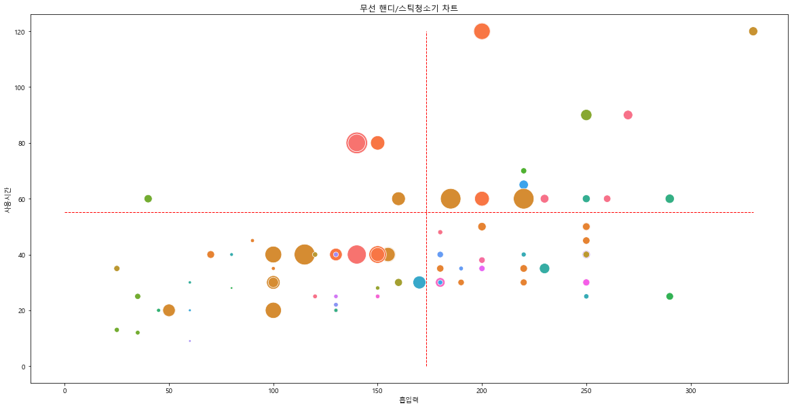
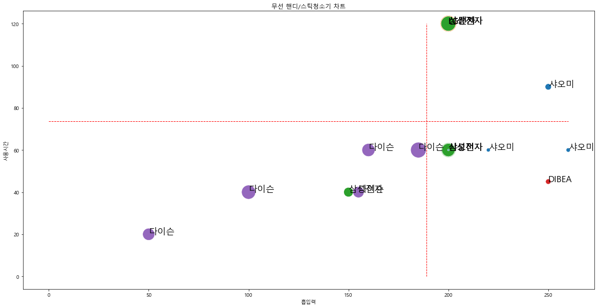

#### 1. 데이터 수집 ㅡ 한페이지 크롤링


```python
#selenium으로 다나와 검색결과 URL에 접속
from bs4 import BeautifulSoup
from selenium import webdriver
driver = webdriver.Chrome(r'C:\Users\hwn11\Data\chromedriver.exe')
url = 'http://search.danawa.com/dsearch.php?k1=%EB%AC%B4%EC%84%A0%EC%B2%AD%EC%86%8C%EA%B8%B0&module=goods&act=dispMain'
driver.get(url)
```


```python
html = driver.page_source
soup = BeautifulSoup(html, 'html.parser')
```


```python
prod_items = soup.select('div.main_prodlist > ul.product_list > li.prod_item')

len(prod_items)
```


    40


```python
title = prod_items[0].select('p.prod_name > a')[0].text.strip()
title
```


    '샤오미 드리미 V10'


```python
spec_list = prod_items[0].select('div.spec_list')[0].text.strip()
spec_list
```


    '핸디/스틱청소기 / 핸디+스틱형 / 무선형 / 흡입전용 / [성능] 멀티싸이클론 / 흡입력: 140AW / 흡입력: 22000Pa / 소비전력: 450W / [배터리] 용량: 2500mAh / 충전시간: 3시간30분 / 사용시간: 1시간 / [필터] 헤파필터 / H12급 / 5단계여과 / [기능] 배터리잔량표시 / [구성품] 바닥 / 침구 / 솔형 / 틈새 / 연장툴 / 거치대 / [부가] 먼지통용량: 0.5L / 색상: 화이트 / 무게: 1.5kg'


```python
price = prod_items[0].select('li.rank_one > p.price_sect > a > strong')[0].text.strip().replace(",","")
price
```


    '149940'


```python
import pandas as pd
#반복문으로 검색 결과의 1페이지에 대한 상품 정보 추출
prod_data = []

for prod_item in prod_items:
    try: #1)상품명 가져오기
        title = prod_item.select('p.prod_name > a')[0].text.strip()
    except:
        title = ''
    try: #2)스펙 목록 가져오기
        spec_list = prod_item.select('div.spec_list')[0].text.strip()
    except:
        spec_list = ''
    try: #3)가격 정보 가져오기
        price = prod_item.select('li.rank_one > p.price_sect > a > strong')[0].text.strip().replace(",","")
    except:
        price = ''
    prod_data.append([title, spec_list, price])

print(len(prod_data))
pd.DataFrame(prod_data)
```

    40
    


<div>
<style scoped>
    .dataframe tbody tr th:only-of-type {
        vertical-align: middle;
    }

    .dataframe tbody tr th {
        vertical-align: top;
    }

    .dataframe thead th {
        text-align: right;
    }
</style>
<table border="1" class="dataframe">
  <thead>
    <tr style="text-align: right;">
      <th></th>
      <th>0</th>
      <th>1</th>
      <th>2</th>
    </tr>
  </thead>
  <tbody>
    <tr>
      <th>0</th>
      <td>샤오미 드리미 V10</td>
      <td>핸디/스틱청소기 / 핸디+스틱형 / 무선형 / 흡입전용 / [성능] 멀티싸이클론 /...</td>
      <td>149940</td>
    </tr>
    <tr>
      <th>1</th>
      <td>LG전자 코드제로 ThinQ A9S A9700</td>
      <td>핸디/스틱청소기 / 핸디+스틱형 / 무선형 / 흡입+걸레겸용 / [성능] 2중터보싸...</td>
      <td>927140</td>
    </tr>
    <tr>
      <th>2</th>
      <td>삼성전자 제트 VS15R8500BF</td>
      <td>핸디/스틱청소기 / 핸디+스틱형 / 무선형 / 흡입+걸레겸용 / [성능] 싸이클론 ...</td>
      <td>387030</td>
    </tr>
    <tr>
      <th>3</th>
      <td>샤오미 미지아 차량용 핸디 무선 청소기 (해외구매)</td>
      <td>차량용청소기 / 무선 / 흡입력: 13,000Pa / 최대출력: 120W / 헤파필...</td>
      <td>33580</td>
    </tr>
    <tr>
      <th>4</th>
      <td>샤오미 드리미 V11</td>
      <td>핸디/스틱청소기 / 핸디+스틱형 / 무선형 / 흡입+걸레겸용 / [성능] 멀티싸이클...</td>
      <td>225990</td>
    </tr>
    <tr>
      <th>5</th>
      <td>일렉트로룩스 WELL Q6 WQ61-1OGG</td>
      <td>핸디/스틱청소기 / 핸디+스틱형 / 무선형 / 흡입전용 / [성능] 싸이클론 / [...</td>
      <td>162420</td>
    </tr>
    <tr>
      <th>6</th>
      <td>삼성전자 제트 VS20T9213QDCSB</td>
      <td>핸디/스틱청소기 / 핸디+스틱형 / 무선형 / 흡입+걸레겸용 / [성능] 싸이클론 ...</td>
      <td>779100</td>
    </tr>
    <tr>
      <th>7</th>
      <td>샤오미 CLEANFLY 차량용 무선 청소기 3세대 (해외구매)</td>
      <td>차량용청소기 / 무선 / 흡입력: 16,800Pa / 최대출력: 120W / 헤파필...</td>
      <td>49900</td>
    </tr>
    <tr>
      <th>8</th>
      <td>LG전자 코드제로 A9 A9100</td>
      <td>핸디/스틱청소기 / 핸디+스틱형 / 무선형 / 흡입+걸레겸용 / [성능] 2중터보싸...</td>
      <td>505480</td>
    </tr>
    <tr>
      <th>9</th>
      <td>DIBEA TSX-25000A</td>
      <td>핸디/스틱청소기 / 핸디+스틱형 / 무선형 / 흡입전용 / [성능] 싸이클론 / B...</td>
      <td>191200</td>
    </tr>
    <tr>
      <th>10</th>
      <td>삼성전자 제트 VS20T9258SDCS</td>
      <td>핸디/스틱청소기 / 핸디+스틱형 / 무선형 / 흡입+걸레겸용 / [성능] 싸이클론 ...</td>
      <td>899000</td>
    </tr>
    <tr>
      <th>11</th>
      <td>다이슨 V10 카본파이버</td>
      <td>핸디/스틱청소기 / 핸디+스틱형 / 무선형 / [성능] 싸이클론 / 흡입력: 160...</td>
      <td>630910</td>
    </tr>
    <tr>
      <th>12</th>
      <td>삼성전자 제트 VS20T9278S3CS</td>
      <td>핸디/스틱청소기 / 핸디+스틱형 / 무선형 / 흡입+걸레겸용 / [성능] 싸이클론 ...</td>
      <td>817600</td>
    </tr>
    <tr>
      <th>13</th>
      <td>LG전자 코드제로 ThinQ A9S A9500</td>
      <td>핸디/스틱청소기 / 핸디+스틱형 / 무선형 / 흡입+걸레겸용 / [성능] 2중터보싸...</td>
      <td>780180</td>
    </tr>
    <tr>
      <th>14</th>
      <td>다이슨 디지털 슬림 플러피+</td>
      <td>핸디/스틱청소기 / 핸디+스틱형 / 무선형 / 흡입전용 / [성능] 싸이클론 / 흡...</td>
      <td>722000</td>
    </tr>
    <tr>
      <th>15</th>
      <td>다이슨 옴니 글라이드 컴플리트+</td>
      <td>핸디/스틱청소기 / 핸디+스틱형 / 무선형 / 흡입전용 / [성능] 싸이클론 / 흡...</td>
      <td>559620</td>
    </tr>
    <tr>
      <th>16</th>
      <td>LG전자 코드제로 ThinQ A9S A9470</td>
      <td>핸디/스틱청소기 / 핸디+스틱형 / 무선형 / 흡입+걸레겸용 / [성능] 2중터보싸...</td>
      <td>825640</td>
    </tr>
    <tr>
      <th>17</th>
      <td>LG전자 코드제로 ThinQ A9S A9570</td>
      <td>핸디/스틱청소기 / 핸디+스틱형 / 무선형 / 흡입+걸레겸용 / [성능] 2중터보싸...</td>
      <td>913450</td>
    </tr>
    <tr>
      <th>18</th>
      <td>휴스톰 HS-10000</td>
      <td>물걸레청소기 / 스틱형 / 회전식 / 무선형 / 충전시간: 2시간30분 / 사용시간...</td>
      <td>138380</td>
    </tr>
    <tr>
      <th>19</th>
      <td>다이슨 V8 플러피</td>
      <td>핸디/스틱청소기 / 핸디+스틱형 / 무선형 / [성능] 싸이클론 / 흡입력: 155...</td>
      <td>489490</td>
    </tr>
    <tr>
      <th>20</th>
      <td>삼성전자 제트 VS20T9279S6CS</td>
      <td>핸디/스틱청소기 / 핸디+스틱형 / 무선형 / 흡입+걸레겸용 / [성능] 싸이클론 ...</td>
      <td>788800</td>
    </tr>
    <tr>
      <th>21</th>
      <td>한샘 HSBC-6000W</td>
      <td>욕실청소기 / 스틱형 / 무선형 / 소비전력: 30W / [배터리] 용량: 2000...</td>
      <td>54180</td>
    </tr>
    <tr>
      <th>22</th>
      <td>삼성전자 제트 VS20T9213QDCSP</td>
      <td>핸디/스틱청소기 / 핸디+스틱형 / 무선형 / 흡입+걸레겸용 / [성능] 싸이클론 ...</td>
      <td>716050</td>
    </tr>
    <tr>
      <th>23</th>
      <td>일렉트로룩스 ZB3302AK</td>
      <td>핸디/스틱청소기 / 핸디+스틱형 / 무선형 / 흡입전용 / [배터리] 리튬이온 / ...</td>
      <td>147150</td>
    </tr>
    <tr>
      <th>24</th>
      <td>샤오미 SHUNZAO Z11</td>
      <td>핸디/스틱청소기 / 핸디+스틱형 / 무선형 / 흡입전용 / [성능] 싸이클론 / 흡...</td>
      <td>159000</td>
    </tr>
    <tr>
      <th>25</th>
      <td>다이슨 V11 컴플리트</td>
      <td>핸디/스틱청소기 / 핸디+스틱형 / 무선형 / [성능] 싸이클론 / 흡입력: 185...</td>
      <td>862490</td>
    </tr>
    <tr>
      <th>26</th>
      <td>삼성전자 제트 VS20T9213QDCS</td>
      <td>핸디/스틱청소기 / 핸디+스틱형 / 무선형 / 흡입+걸레겸용 / [성능] 싸이클론 ...</td>
      <td>630890</td>
    </tr>
    <tr>
      <th>27</th>
      <td>샤오미 드리미 V9</td>
      <td>핸디/스틱청소기 / 핸디+스틱형 / 무선형 / [성능] 싸이클론 / 흡입력: 120...</td>
      <td>112500</td>
    </tr>
    <tr>
      <th>28</th>
      <td>다이슨 V11 220AW 컴플리트</td>
      <td>핸디/스틱청소기 / 핸디+스틱형 / 무선형 / 흡입전용 / [성능] 루트싸이클론 /...</td>
      <td>882060</td>
    </tr>
    <tr>
      <th>29</th>
      <td>샤오미 SWDK-D260</td>
      <td>물걸레청소기 / 스틱형 / 왕복식 / 무선형 / 충전시간: 3시간 / 사용시간: 5...</td>
      <td>60290</td>
    </tr>
    <tr>
      <th>30</th>
      <td>샤오미 SHUNZAO 차량용 무선청소기 2세대 Z1 PRO (해외구매)</td>
      <td>차량용청소기 / 무선 / 흡입력: 12,000Pa / 최대출력: 120W / 2중필...</td>
      <td>43500</td>
    </tr>
    <tr>
      <th>31</th>
      <td>샤오미 LYDSTO 핸디형 에어펌프 진공청소기 (해외구매)</td>
      <td>차량용청소기 / 무선 / 흡입력: 10,000Pa / 스테인리스 필터 / LED라이...</td>
      <td>32500</td>
    </tr>
    <tr>
      <th>32</th>
      <td>삼성전자 제트 VS20T9213QDCSW</td>
      <td>핸디/스틱청소기 / 핸디+스틱형 / 무선형 / 흡입+걸레겸용 / [성능] 싸이클론 ...</td>
      <td>631720</td>
    </tr>
    <tr>
      <th>33</th>
      <td>일렉트로룩스 WELL Q7 WQ71-2OIB</td>
      <td>핸디/스틱청소기 / 핸디+스틱형 / 무선형 / 흡입전용 / [성능] 싸이클론 / [...</td>
      <td>236860</td>
    </tr>
    <tr>
      <th>34</th>
      <td>다이슨 V8 카본파이버</td>
      <td>핸디/스틱청소기 / 핸디+스틱형 / 무선형 / [성능] 싸이클론 / 흡입력: 155...</td>
      <td>479000</td>
    </tr>
    <tr>
      <th>35</th>
      <td>일렉트로룩스 PURE Q9 PQ92-3OBF</td>
      <td>핸디/스틱청소기 / 핸디+스틱형 / 무선형 / 흡입전용 / [성능] 싸이클론 / [...</td>
      <td>313790</td>
    </tr>
    <tr>
      <th>36</th>
      <td>DIBEA D18</td>
      <td>핸디/스틱청소기 / 핸디+스틱형 / 무선형 / [성능] 싸이클론 / 흡입력: 900...</td>
      <td>67900</td>
    </tr>
    <tr>
      <th>37</th>
      <td>신일산업 LCYC913</td>
      <td>핸디/스틱청소기 / 핸디형 / 무선형 / 흡입전용 / [성능] 흡입력: 3500Pa...</td>
      <td>27800</td>
    </tr>
    <tr>
      <th>38</th>
      <td>코칸 차량용 무선 진공 핸디 청소기 CHC-UY01</td>
      <td>차량용청소기 / 무선 / 흡입력: 5,800Pa / 헤파필터 / 추가노즐: 솔브러쉬...</td>
      <td>49900</td>
    </tr>
    <tr>
      <th>39</th>
      <td>LG전자 코드제로 ThinQ A9S A9300</td>
      <td>핸디/스틱청소기 / 핸디+스틱형 / 무선형 / 흡입+걸레겸용 / [성능] 2중터보싸...</td>
      <td>699600</td>
    </tr>
  </tbody>
</table>
</div>


```python
#함수로 만들기
def get_prod_items(prod_items):
    prod_data = []
    
    for prod_item in prod_items:
        try: #1)상품명 가져오기
            title = prod_item.select('p.prod_name > a')[0].text.strip()
        except:
            title = ''
        try: #2)스펙 목록 가져오기
            spec_list = prod_item.select('div.spec_list')[0].text.strip()
        except:
            spec_list = ''
        try: #3)가격 정보 가져오기
            price = prod_item.select('li.rank_one > p.price_sect > a > strong')[0].text.strip().replace(",","")
        except:
            price = ''
        prod_data.append([title, spec_list, price])
   
    return prod_data
prod_items = soup.select('d')
prod_items = soup.select('div.main_prodlist > ul.product_list > li.prod_item')
prod_data = get_prod_items(prod_items)
print(len(prod_data))
```

    40
    

#### 2. 여러페이지에 걸친 검색 페이지 크롤링

URL 분석


```python
#1페이지 진입
def get_search_page_url(keyword, page):
    return 'http://search.danawa.com/dsearch.php?query={}&volumeType=allvs&page={}&limit=40&sort=saveDESC&list=list&boost=true&addDelivery=N&recommendedSort=Y&defaultUICategoryCode=103740&defaultPhysicsCategoryCode=72%7C80%7C81%7C0&defaultVmTab=2429&defaultVaTab=122421&tab=goods'.format(keyword, page)

```


```python
keyword = '무선청소기'
page = 1
url = get_search_page_url(keyword, page)
print(url)
```

    http://search.danawa.com/dsearch.php?query=무선청소기&volumeType=allvs&page=1&limit=40&sort=saveDESC&list=list&boost=true&addDelivery=N&recommendedSort=Y&defaultUICategoryCode=103740&defaultPhysicsCategoryCode=72%7C80%7C81%7C0&defaultVmTab=2429&defaultVaTab=122421&tab=goods
    


```python
#tqdm을 사용해 현재 진행상황 파악
import time
from tqdm import tqdm_notebook

total_page = 10
for page in tqdm_notebook(range(1, total_page + 1)):
    time.sleep(5) #페이지가 로딩 완료되기 위한 시간을 5초로 준다
```

    C:\Users\hwn11\anaconda3\lib\site-packages\ipykernel_launcher.py:6: TqdmDeprecationWarning: This function will be removed in tqdm==5.0.0
    Please use `tqdm.notebook.tqdm` instead of `tqdm.tqdm_notebook`
      
    


    HBox(children=(FloatProgress(value=0.0, max=10.0), HTML(value='')))


    
    

여러 페ㅐ이지에 걸친 상품 정보 수집
1. 한 페이지의 상품 정보를 수집하는 함수 만들기
2. URL 분석을 통해 원하는 페이지로 이동하는 함수 만들기


```python
from selenium import webdriver 
import time 
from bs4 import BeautifulSoup
from tqdm import tqdm_notebook

driver = webdriver.Chrome(r'C:\Users\hwn11\Data\chromedriver.exe')
driver.implicitly_wait(3) #웹 자원 로드를 위해 3초 기다림

keyword = '무선청소기'
total_page = 10
prod_data_total = []
#진행정도를 표현하는 tqdm을 적용
for page in tqdm_notebook(range(1, total_page +1)):
    #1)상품명 가져오기
    url = get_search_page_url(keyword, page)
    driver.get(url)
    time.sleep(3)
    
    #2) 현재 페이지의 HTML 정보 가져오기
    html = driver.page_source
    soup = BeautifulSoup(html, 'html.parser')
    
    #3) 상품 정보 추출
    prod_items = soup.select('div.main_prodlist > ul.product_list > li.prod_item')
    prod_item_list = get_prod_items(prod_items)
    
    #4) 추출 데이터 저장
    prod_data_total = prod_data_total + prod_item_list
```

    C:\Users\hwn11\anaconda3\lib\site-packages\ipykernel_launcher.py:13: TqdmDeprecationWarning: This function will be removed in tqdm==5.0.0
    Please use `tqdm.notebook.tqdm` instead of `tqdm.tqdm_notebook`
      del sys.path[0]
    


    HBox(children=(FloatProgress(value=0.0, max=10.0), HTML(value='')))


    
    


```python
#수집데이터 저장
data = pd.DataFrame(prod_data_total)
data.columns = ['상품명', '스펙 목록', '가격']
# data.to_excel('1_danawa_crawling_result.xlsx', index = False)
```

#### 3. 전처리


```python
#같이 크롤링 된 상품명중에 이상한 애가 있어서 상품명에 띄어쓰기가 없으면 짤
data = data[data['상품명'].str.contains(' ')].reset_index(drop = True)
```


```python
data
```


<div>
<style scoped>
    .dataframe tbody tr th:only-of-type {
        vertical-align: middle;
    }

    .dataframe tbody tr th {
        vertical-align: top;
    }

    .dataframe thead th {
        text-align: right;
    }
</style>
<table border="1" class="dataframe">
  <thead>
    <tr style="text-align: right;">
      <th></th>
      <th>상품명</th>
      <th>스펙 목록</th>
      <th>가격</th>
    </tr>
  </thead>
  <tbody>
    <tr>
      <th>0</th>
      <td>샤오미 드리미 V10</td>
      <td>핸디/스틱청소기 / 핸디+스틱형 / 무선형 / 흡입전용 / [성능] 멀티싸이클론 /...</td>
      <td>149940</td>
    </tr>
    <tr>
      <th>1</th>
      <td>LG전자 코드제로 ThinQ A9S A9700</td>
      <td>핸디/스틱청소기 / 핸디+스틱형 / 무선형 / 흡입+걸레겸용 / [성능] 2중터보싸...</td>
      <td>927140</td>
    </tr>
    <tr>
      <th>2</th>
      <td>삼성전자 제트 VS15R8500BF</td>
      <td>핸디/스틱청소기 / 핸디+스틱형 / 무선형 / 흡입+걸레겸용 / [성능] 싸이클론 ...</td>
      <td>387030</td>
    </tr>
    <tr>
      <th>3</th>
      <td>샤오미 미지아 차량용 핸디 무선 청소기 (해외구매)</td>
      <td>차량용청소기 / 무선 / 흡입력: 13,000Pa / 최대출력: 120W / 헤파필...</td>
      <td>33580</td>
    </tr>
    <tr>
      <th>4</th>
      <td>샤오미 드리미 V11</td>
      <td>핸디/스틱청소기 / 핸디+스틱형 / 무선형 / 흡입+걸레겸용 / [성능] 멀티싸이클...</td>
      <td>225990</td>
    </tr>
    <tr>
      <th>...</th>
      <td>...</td>
      <td>...</td>
      <td>...</td>
    </tr>
    <tr>
      <th>395</th>
      <td>테팔 에어포스360 TY7233KO</td>
      <td>핸디/스틱청소기 / 핸디+스틱형 / 무선형 / 흡입전용 / [성능] 싸이클론 / D...</td>
      <td>193220</td>
    </tr>
    <tr>
      <th>396</th>
      <td>에이스전자 ARW-C100</td>
      <td>로봇청소기 / 흡입+걸레 / 헤파필터 / BLDC모터 / 먼지통용량: 0.3L / ...</td>
      <td>262340</td>
    </tr>
    <tr>
      <th>397</th>
      <td>아이닉 i20 엘리트</td>
      <td>핸디/스틱청소기 / 핸디+스틱형 / 무선형 / 흡입전용 / [구성품] 바닥 / 솔형...</td>
      <td>139000</td>
    </tr>
    <tr>
      <th>398</th>
      <td>휴스톰 HV-1000</td>
      <td>핸디/스틱청소기 / 핸디+스틱형 / 무선형 / 흡입전용 / [성능] 싸이클론 / B...</td>
      <td>151050</td>
    </tr>
    <tr>
      <th>399</th>
      <td>보랄 BR-XL715CV</td>
      <td>핸디/스틱청소기 / 핸디+스틱형 / 무선형 / 흡입전용 / [성능] 싸이클론 / B...</td>
      <td>150000</td>
    </tr>
  </tbody>
</table>
<p>400 rows × 3 columns</p>
</div>


```python
company_list = []
product_list = []
for title in data['상품명']:
    title_info = title.split(' ', 1)
    company_name = title_info[0]
    product_name = title_info[1]
    company_list.append(company_name)
    product_list.append(product_name)
```


```python
print(company_list[:5])
product_list[:4]
```

    ['샤오미', 'LG전자', '삼성전자', '샤오미', '샤오미']
    


    ['드리미 V10',
     '코드제로 ThinQ A9S A9700',
     '제트 VS15R8500BF',
     '미지아 차량용 핸디 무선 청소기 (해외구매)']


```python
data['스펙 목록'][0]
```


    '핸디/스틱청소기 / 핸디+스틱형 / 무선형 / 흡입전용 / [성능] 멀티싸이클론 / 흡입력: 140AW / 흡입력: 22000Pa / 소비전력: 450W / [배터리] 용량: 2500mAh / 충전시간: 3시간30분 / 사용시간: 1시간 / [필터] 헤파필터 / H12급 / 5단계여과 / [기능] 배터리잔량표시 / [구성품] 바닥 / 침구 / 솔형 / 틈새 / 연장툴 / 거치대 / [부가] 먼지통용량: 0.5L / 색상: 화이트 / 무게: 1.5kg'


```python
#/로 분리된 것들 구분
spec_list = data['스펙 목록'][0].split(' / ')
spec_list
```


    ['핸디/스틱청소기',
     '핸디+스틱형',
     '무선형',
     '흡입전용',
     '[성능] 멀티싸이클론',
     '흡입력: 140AW',
     '흡입력: 22000Pa',
     '소비전력: 450W',
     '[배터리] 용량: 2500mAh',
     '충전시간: 3시간30분',
     '사용시간: 1시간',
     '[필터] 헤파필터',
     'H12급',
     '5단계여과',
     '[기능] 배터리잔량표시',
     '[구성품] 바닥',
     '침구',
     '솔형',
     '틈새',
     '연장툴',
     '거치대',
     '[부가] 먼지통용량: 0.5L',
     '색상: 화이트',
     '무게: 1.5kg']


```python
category = spec_list[0]
category
```


    '핸디/스틱청소기'


```python
#사용시간과 흡입력 포함된 원소 추출
for spec in spec_list:
    if '사용시간' in spec:
        use_time_spec = spec
    elif '흡입력' in spec:
        suction_spec = spec
print(use_time_spec)
print(suction_spec)
```

    사용시간: 1시간
    흡입력: 22000Pa
    


```python
#전체 데이터에 적용
category_list = []
use_time_list = []
suction_list = []
#카테고리 사용시간 흡입력 추출
for spec_data in data['스펙 목록']:
    #' / ' 기준으로 스펙 분리하기
    spec_list = spec_data.split(' / ')
    #카테고리 추추하기
    category = spec_list[0]
    category_list.append(category)
    
    #사용시간, 흡입력 추출
    ## 사용시간, 흡입력 정보가 없는 제품을 위해 변수를 생성
    use_time_value = None
    suction_value = None
    
    for spec in spec_list:
        if '사용시간' in spec:
            use_time_value = spec.split(' ')[1].strip()
        elif '흡입력' in spec:
            suction_value = spec.split(' ')[1].strip()
            
    use_time_list.append(use_time_value)
    suction_list.append(suction_value)
```


```python
print('카테고리', len(category_list), category_list[0:5])
print('사용시간', len(use_time_list), use_time_list[0:5])
print('흡입력', len(suction_list), suction_list[0:5])
```

    카테고리 400 ['핸디/스틱청소기', '핸디/스틱청소기', '핸디/스틱청소기', '차량용청소기', '핸디/스틱청소기']
    사용시간 400 ['1시간', '2시간', '40분', '9~30분', '1시간30분']
    흡입력 400 ['22000Pa', '200W', '150W', '13,000Pa', '25000Pa']
    

전처리 - 분 단위로 시간 통일


```python
#사용시간을 분 단위로 조정하는 함수
def convert_time_minute(time):
    try:
        if '시간' in time:
            hour = time.split('시간')[0]
            if '분' in time:
                minute = time.split('시간')[-1].split('분')[0]
            else:
                minute = 0
        else:
            hour = 0
            minute = time.split('분')[0]
        return int(hour)*60 + int(minute)
    except:
        return None
```

함수설명\
1. "시간"단어가 있으면\
1) "시간" 앞의 숫자를 추출한 뒤, 60을 곱해 사용시간에 더한다\
2) "시간" 뒤의 글자에서 "분" 글자 앞의 숫자를 추출해서 사용시간에 더한다

2. "시간 단어가 없으면\
1) "분" 글자 앞의 숫자를 추출해서 사용시간에 더한다

3. 위 방식으로 계산되지 않을 경우 예외로 처리한다.


```python
#test
times = ['40분', '1시간 10분', '3시간 30분', '1시간', '20분']
for time in times:
    t = convert_time_minute(time)
    print(time, '=', t)
```

    40분 = 40
    1시간 10분 = 70
    3시간 30분 = 210
    1시간 = 60
    20분 = 20
    


```python
new_use_time_list = []
for time in use_time_list:
    value = convert_time_minute(time)
    new_use_time_list.append(value)


```


```python
len(new_use_time_list)
new_use_time_list[0:10]
```


    [60, 120, 40, None, 90, 45, 60, 25, 40, 45]


흡입력 단위 통일
1W = 1AW = 100PA


```python
def get_suction(value):
    try:
        value = value.upper()
        if 'AW' in value or 'W' in value:
            result = value.replace('A', '').replace('W', '')
            result = int(result.replace(',', ''))
        elif 'PA' in value:
            result = value.replace('PA', '')
            result = int(result.replace(',',''))/100
        else:
            result = None
        return result
    except:
        return None
```


```python
#test
s_list = ['100W', '10AW', '10,000Pa']
for power in s_list:
    value = get_suction(power)
    print(power, '->', value)
```

    100W -> 100
    10AW -> 10
    10,000Pa -> 100.0
    


```python
#흡입력 단위 통일
new_suction_list = []
for power in suction_list:
    value = get_suction(power)
    new_suction_list.append(value)
```


```python
lennew_suction_list
```


    ---------------------------------------------------------------------------

    NameError                                 Traceback (most recent call last)

    <ipython-input-244-267e8d61498e> in <module>
    ----> 1 lennew_suction_list
    

    NameError: name 'lennew_suction_list' is not defined


```python
#마지막 전처리 결과를 엑셀로 저장
pd_data = pd.DataFrame()
pd_data['카테고리'] = category_list
pd_data['회사명'] = company_list
pd_data['제품명'] = product_list
pd_data['가격'] = data['가격']
pd_data['사용시간'] = new_use_time_list
pd_data['흡입력'] = new_suction_list
pd_data.head()
```


<div>
<style scoped>
    .dataframe tbody tr th:only-of-type {
        vertical-align: middle;
    }

    .dataframe tbody tr th {
        vertical-align: top;
    }

    .dataframe thead th {
        text-align: right;
    }
</style>
<table border="1" class="dataframe">
  <thead>
    <tr style="text-align: right;">
      <th></th>
      <th>카테고리</th>
      <th>회사명</th>
      <th>제품명</th>
      <th>가격</th>
      <th>사용시간</th>
      <th>흡입력</th>
    </tr>
  </thead>
  <tbody>
    <tr>
      <th>0</th>
      <td>핸디/스틱청소기</td>
      <td>샤오미</td>
      <td>드리미 V10</td>
      <td>149940</td>
      <td>60.0</td>
      <td>220.0</td>
    </tr>
    <tr>
      <th>1</th>
      <td>핸디/스틱청소기</td>
      <td>LG전자</td>
      <td>코드제로 ThinQ A9S A9700</td>
      <td>927140</td>
      <td>120.0</td>
      <td>200.0</td>
    </tr>
    <tr>
      <th>2</th>
      <td>핸디/스틱청소기</td>
      <td>삼성전자</td>
      <td>제트 VS15R8500BF</td>
      <td>387030</td>
      <td>40.0</td>
      <td>150.0</td>
    </tr>
    <tr>
      <th>3</th>
      <td>차량용청소기</td>
      <td>샤오미</td>
      <td>미지아 차량용 핸디 무선 청소기 (해외구매)</td>
      <td>33580</td>
      <td>NaN</td>
      <td>130.0</td>
    </tr>
    <tr>
      <th>4</th>
      <td>핸디/스틱청소기</td>
      <td>샤오미</td>
      <td>드리미 V11</td>
      <td>225990</td>
      <td>90.0</td>
      <td>250.0</td>
    </tr>
  </tbody>
</table>
</div>


```python
pd_data['카테고리'].value_counts()
```


    핸디/스틱청소기          310
    물걸레청소기             36
    차량용청소기             24
    욕실청소기              12
    업소용청소기              9
    침구청소기               4
    로봇청소기               2
    진공청소기               2
    핸디/스틱청소기+로봇청소기      1
    Name: 카테고리, dtype: int64


```python
pd_data.loc[pd_data['카테고리'] == '핸디/스틱청소기']
```


<div>
<style scoped>
    .dataframe tbody tr th:only-of-type {
        vertical-align: middle;
    }

    .dataframe tbody tr th {
        vertical-align: top;
    }

    .dataframe thead th {
        text-align: right;
    }
</style>
<table border="1" class="dataframe">
  <thead>
    <tr style="text-align: right;">
      <th></th>
      <th>카테고리</th>
      <th>회사명</th>
      <th>제품명</th>
      <th>가격</th>
      <th>사용시간</th>
      <th>흡입력</th>
    </tr>
  </thead>
  <tbody>
    <tr>
      <th>0</th>
      <td>핸디/스틱청소기</td>
      <td>샤오미</td>
      <td>드리미 V10</td>
      <td>149940</td>
      <td>60.0</td>
      <td>220.0</td>
    </tr>
    <tr>
      <th>1</th>
      <td>핸디/스틱청소기</td>
      <td>LG전자</td>
      <td>코드제로 ThinQ A9S A9700</td>
      <td>927140</td>
      <td>120.0</td>
      <td>200.0</td>
    </tr>
    <tr>
      <th>2</th>
      <td>핸디/스틱청소기</td>
      <td>삼성전자</td>
      <td>제트 VS15R8500BF</td>
      <td>387030</td>
      <td>40.0</td>
      <td>150.0</td>
    </tr>
    <tr>
      <th>4</th>
      <td>핸디/스틱청소기</td>
      <td>샤오미</td>
      <td>드리미 V11</td>
      <td>225990</td>
      <td>90.0</td>
      <td>250.0</td>
    </tr>
    <tr>
      <th>5</th>
      <td>핸디/스틱청소기</td>
      <td>일렉트로룩스</td>
      <td>WELL Q6 WQ61-1OGG</td>
      <td>162420</td>
      <td>45.0</td>
      <td>NaN</td>
    </tr>
    <tr>
      <th>...</th>
      <td>...</td>
      <td>...</td>
      <td>...</td>
      <td>...</td>
      <td>...</td>
      <td>...</td>
    </tr>
    <tr>
      <th>393</th>
      <td>핸디/스틱청소기</td>
      <td>다이슨</td>
      <td>V11 토크 드라이브 플러스</td>
      <td>1409060</td>
      <td>60.0</td>
      <td>220.0</td>
    </tr>
    <tr>
      <th>395</th>
      <td>핸디/스틱청소기</td>
      <td>테팔</td>
      <td>에어포스360 TY7233KO</td>
      <td>193220</td>
      <td>45.0</td>
      <td>NaN</td>
    </tr>
    <tr>
      <th>397</th>
      <td>핸디/스틱청소기</td>
      <td>아이닉</td>
      <td>i20 엘리트</td>
      <td>139000</td>
      <td>NaN</td>
      <td>NaN</td>
    </tr>
    <tr>
      <th>398</th>
      <td>핸디/스틱청소기</td>
      <td>휴스톰</td>
      <td>HV-1000</td>
      <td>151050</td>
      <td>23.0</td>
      <td>NaN</td>
    </tr>
    <tr>
      <th>399</th>
      <td>핸디/스틱청소기</td>
      <td>보랄</td>
      <td>BR-XL715CV</td>
      <td>150000</td>
      <td>38.0</td>
      <td>200.0</td>
    </tr>
  </tbody>
</table>
<p>310 rows × 6 columns</p>
</div>


```python
#핸디/스틱청소기 데이터만 뽑아서 저장
pd_data_final = pd_data.loc[pd_data['카테고리'] == '핸디/스틱청소기']
pd_data_final.to_excel('2_danawa_data_final.xlsx', index = False)
```


```python
danawa_data = pd.read_excel('2_danawa_data_final.xlsx')
danawa_data
```


<div>
<style scoped>
    .dataframe tbody tr th:only-of-type {
        vertical-align: middle;
    }

    .dataframe tbody tr th {
        vertical-align: top;
    }

    .dataframe thead th {
        text-align: right;
    }
</style>
<table border="1" class="dataframe">
  <thead>
    <tr style="text-align: right;">
      <th></th>
      <th>카테고리</th>
      <th>회사명</th>
      <th>제품명</th>
      <th>가격</th>
      <th>사용시간</th>
      <th>흡입력</th>
    </tr>
  </thead>
  <tbody>
    <tr>
      <th>0</th>
      <td>핸디/스틱청소기</td>
      <td>샤오미</td>
      <td>드리미 V10</td>
      <td>149940</td>
      <td>60.0</td>
      <td>220.0</td>
    </tr>
    <tr>
      <th>1</th>
      <td>핸디/스틱청소기</td>
      <td>LG전자</td>
      <td>코드제로 ThinQ A9S A9700</td>
      <td>927140</td>
      <td>120.0</td>
      <td>200.0</td>
    </tr>
    <tr>
      <th>2</th>
      <td>핸디/스틱청소기</td>
      <td>삼성전자</td>
      <td>제트 VS15R8500BF</td>
      <td>387030</td>
      <td>40.0</td>
      <td>150.0</td>
    </tr>
    <tr>
      <th>3</th>
      <td>핸디/스틱청소기</td>
      <td>샤오미</td>
      <td>드리미 V11</td>
      <td>225990</td>
      <td>90.0</td>
      <td>250.0</td>
    </tr>
    <tr>
      <th>4</th>
      <td>핸디/스틱청소기</td>
      <td>일렉트로룩스</td>
      <td>WELL Q6 WQ61-1OGG</td>
      <td>162420</td>
      <td>45.0</td>
      <td>NaN</td>
    </tr>
    <tr>
      <th>...</th>
      <td>...</td>
      <td>...</td>
      <td>...</td>
      <td>...</td>
      <td>...</td>
      <td>...</td>
    </tr>
    <tr>
      <th>305</th>
      <td>핸디/스틱청소기</td>
      <td>다이슨</td>
      <td>V11 토크 드라이브 플러스</td>
      <td>1409060</td>
      <td>60.0</td>
      <td>220.0</td>
    </tr>
    <tr>
      <th>306</th>
      <td>핸디/스틱청소기</td>
      <td>테팔</td>
      <td>에어포스360 TY7233KO</td>
      <td>193220</td>
      <td>45.0</td>
      <td>NaN</td>
    </tr>
    <tr>
      <th>307</th>
      <td>핸디/스틱청소기</td>
      <td>아이닉</td>
      <td>i20 엘리트</td>
      <td>139000</td>
      <td>NaN</td>
      <td>NaN</td>
    </tr>
    <tr>
      <th>308</th>
      <td>핸디/스틱청소기</td>
      <td>휴스톰</td>
      <td>HV-1000</td>
      <td>151050</td>
      <td>23.0</td>
      <td>NaN</td>
    </tr>
    <tr>
      <th>309</th>
      <td>핸디/스틱청소기</td>
      <td>보랄</td>
      <td>BR-XL715CV</td>
      <td>150000</td>
      <td>38.0</td>
      <td>200.0</td>
    </tr>
  </tbody>
</table>
<p>310 rows × 6 columns</p>
</div>


```python
#흡입력 기준 정렬
top_suction = danawa_data.sort_values(by = '흡입력', ascending = False).reset_index(drop = True)
top_suction
```


<div>
<style scoped>
    .dataframe tbody tr th:only-of-type {
        vertical-align: middle;
    }

    .dataframe tbody tr th {
        vertical-align: top;
    }

    .dataframe thead th {
        text-align: right;
    }
</style>
<table border="1" class="dataframe">
  <thead>
    <tr style="text-align: right;">
      <th></th>
      <th>카테고리</th>
      <th>회사명</th>
      <th>제품명</th>
      <th>가격</th>
      <th>사용시간</th>
      <th>흡입력</th>
    </tr>
  </thead>
  <tbody>
    <tr>
      <th>0</th>
      <td>핸디/스틱청소기</td>
      <td>리하스</td>
      <td>LH20</td>
      <td>284050</td>
      <td>120.0</td>
      <td>330.0</td>
    </tr>
    <tr>
      <th>1</th>
      <td>핸디/스틱청소기</td>
      <td>캐치웰</td>
      <td>NEW F8</td>
      <td>199000</td>
      <td>25.0</td>
      <td>290.0</td>
    </tr>
    <tr>
      <th>2</th>
      <td>핸디/스틱청소기</td>
      <td>퍼피유</td>
      <td>T12R</td>
      <td>293020</td>
      <td>60.0</td>
      <td>290.0</td>
    </tr>
    <tr>
      <th>3</th>
      <td>핸디/스틱청소기</td>
      <td>샤오미</td>
      <td>드리미 V12</td>
      <td>308770</td>
      <td>90.0</td>
      <td>270.0</td>
    </tr>
    <tr>
      <th>4</th>
      <td>핸디/스틱청소기</td>
      <td>샤오미</td>
      <td>SHUNZAO Z11 PRO</td>
      <td>192640</td>
      <td>60.0</td>
      <td>260.0</td>
    </tr>
    <tr>
      <th>...</th>
      <td>...</td>
      <td>...</td>
      <td>...</td>
      <td>...</td>
      <td>...</td>
      <td>...</td>
    </tr>
    <tr>
      <th>305</th>
      <td>핸디/스틱청소기</td>
      <td>라쿠진</td>
      <td>LCZ858</td>
      <td>49470</td>
      <td>30.0</td>
      <td>NaN</td>
    </tr>
    <tr>
      <th>306</th>
      <td>핸디/스틱청소기</td>
      <td>일렉트로룩스</td>
      <td>에르고라피도 파워프로 ZB3416AK</td>
      <td>199000</td>
      <td>48.0</td>
      <td>NaN</td>
    </tr>
    <tr>
      <th>307</th>
      <td>핸디/스틱청소기</td>
      <td>테팔</td>
      <td>에어포스360 TY7233KO</td>
      <td>193220</td>
      <td>45.0</td>
      <td>NaN</td>
    </tr>
    <tr>
      <th>308</th>
      <td>핸디/스틱청소기</td>
      <td>아이닉</td>
      <td>i20 엘리트</td>
      <td>139000</td>
      <td>NaN</td>
      <td>NaN</td>
    </tr>
    <tr>
      <th>309</th>
      <td>핸디/스틱청소기</td>
      <td>휴스톰</td>
      <td>HV-1000</td>
      <td>151050</td>
      <td>23.0</td>
      <td>NaN</td>
    </tr>
  </tbody>
</table>
<p>310 rows × 6 columns</p>
</div>


```python
#사용시간 기준 정렬
top_duration = danawa_data.sort_values(by = '사용시간', ascending = False).reset_index(drop = True)
top_duration
```


<div>
<style scoped>
    .dataframe tbody tr th:only-of-type {
        vertical-align: middle;
    }

    .dataframe tbody tr th {
        vertical-align: top;
    }

    .dataframe thead th {
        text-align: right;
    }
</style>
<table border="1" class="dataframe">
  <thead>
    <tr style="text-align: right;">
      <th></th>
      <th>카테고리</th>
      <th>회사명</th>
      <th>제품명</th>
      <th>가격</th>
      <th>사용시간</th>
      <th>흡입력</th>
    </tr>
  </thead>
  <tbody>
    <tr>
      <th>0</th>
      <td>핸디/스틱청소기</td>
      <td>삼성전자</td>
      <td>제트 VS20R9078S2CS</td>
      <td>764580</td>
      <td>120.0</td>
      <td>200.0</td>
    </tr>
    <tr>
      <th>1</th>
      <td>핸디/스틱청소기</td>
      <td>LG전자</td>
      <td>코드제로 ThinQ A9S A9470</td>
      <td>825640</td>
      <td>120.0</td>
      <td>NaN</td>
    </tr>
    <tr>
      <th>2</th>
      <td>핸디/스틱청소기</td>
      <td>삼성전자</td>
      <td>제트 VS20T9257SECS</td>
      <td>798990</td>
      <td>120.0</td>
      <td>200.0</td>
    </tr>
    <tr>
      <th>3</th>
      <td>핸디/스틱청소기</td>
      <td>LG전자</td>
      <td>코드제로 ThinQ A9S A9400</td>
      <td>747600</td>
      <td>120.0</td>
      <td>200.0</td>
    </tr>
    <tr>
      <th>4</th>
      <td>핸디/스틱청소기</td>
      <td>삼성전자</td>
      <td>제트 VS20R9074S3</td>
      <td>649170</td>
      <td>120.0</td>
      <td>200.0</td>
    </tr>
    <tr>
      <th>...</th>
      <td>...</td>
      <td>...</td>
      <td>...</td>
      <td>...</td>
      <td>...</td>
      <td>...</td>
    </tr>
    <tr>
      <th>305</th>
      <td>핸디/스틱청소기</td>
      <td>블랙앤데커</td>
      <td>HFVB320J27</td>
      <td>132300</td>
      <td>NaN</td>
      <td>NaN</td>
    </tr>
    <tr>
      <th>306</th>
      <td>핸디/스틱청소기</td>
      <td>블랙앤데커</td>
      <td>NSVA315J</td>
      <td>46510</td>
      <td>NaN</td>
      <td>NaN</td>
    </tr>
    <tr>
      <th>307</th>
      <td>핸디/스틱청소기</td>
      <td>마끼다</td>
      <td>CL107FDSYW</td>
      <td>115150</td>
      <td>NaN</td>
      <td>NaN</td>
    </tr>
    <tr>
      <th>308</th>
      <td>핸디/스틱청소기</td>
      <td>루베크</td>
      <td>RU-700K</td>
      <td>120910</td>
      <td>NaN</td>
      <td>NaN</td>
    </tr>
    <tr>
      <th>309</th>
      <td>핸디/스틱청소기</td>
      <td>아이닉</td>
      <td>i20 엘리트</td>
      <td>139000</td>
      <td>NaN</td>
      <td>NaN</td>
    </tr>
  </tbody>
</table>
<p>310 rows × 6 columns</p>
</div>


```python
#사용시간 -> 흡입력을 기준으로 정렬
top_suct_dur = danawa_data.sort_values(['사용시간', '흡입력'], ascending = False).reset_index(drop = True)
top_suct_dur
```


<div>
<style scoped>
    .dataframe tbody tr th:only-of-type {
        vertical-align: middle;
    }

    .dataframe tbody tr th {
        vertical-align: top;
    }

    .dataframe thead th {
        text-align: right;
    }
</style>
<table border="1" class="dataframe">
  <thead>
    <tr style="text-align: right;">
      <th></th>
      <th>카테고리</th>
      <th>회사명</th>
      <th>제품명</th>
      <th>가격</th>
      <th>사용시간</th>
      <th>흡입력</th>
    </tr>
  </thead>
  <tbody>
    <tr>
      <th>0</th>
      <td>핸디/스틱청소기</td>
      <td>리하스</td>
      <td>LH20</td>
      <td>284050</td>
      <td>120.0</td>
      <td>330.0</td>
    </tr>
    <tr>
      <th>1</th>
      <td>핸디/스틱청소기</td>
      <td>LG전자</td>
      <td>코드제로 ThinQ A9S A9700</td>
      <td>927140</td>
      <td>120.0</td>
      <td>200.0</td>
    </tr>
    <tr>
      <th>2</th>
      <td>핸디/스틱청소기</td>
      <td>삼성전자</td>
      <td>제트 VS20T9258SDCS</td>
      <td>899000</td>
      <td>120.0</td>
      <td>200.0</td>
    </tr>
    <tr>
      <th>3</th>
      <td>핸디/스틱청소기</td>
      <td>삼성전자</td>
      <td>제트 VS20T9278S3CS</td>
      <td>817540</td>
      <td>120.0</td>
      <td>200.0</td>
    </tr>
    <tr>
      <th>4</th>
      <td>핸디/스틱청소기</td>
      <td>LG전자</td>
      <td>코드제로 ThinQ A9S A9500</td>
      <td>780180</td>
      <td>120.0</td>
      <td>200.0</td>
    </tr>
    <tr>
      <th>...</th>
      <td>...</td>
      <td>...</td>
      <td>...</td>
      <td>...</td>
      <td>...</td>
      <td>...</td>
    </tr>
    <tr>
      <th>305</th>
      <td>핸디/스틱청소기</td>
      <td>블랙앤데커</td>
      <td>HFVB320J27</td>
      <td>132300</td>
      <td>NaN</td>
      <td>NaN</td>
    </tr>
    <tr>
      <th>306</th>
      <td>핸디/스틱청소기</td>
      <td>블랙앤데커</td>
      <td>NSVA315J</td>
      <td>46510</td>
      <td>NaN</td>
      <td>NaN</td>
    </tr>
    <tr>
      <th>307</th>
      <td>핸디/스틱청소기</td>
      <td>마끼다</td>
      <td>CL107FDSYW</td>
      <td>115150</td>
      <td>NaN</td>
      <td>NaN</td>
    </tr>
    <tr>
      <th>308</th>
      <td>핸디/스틱청소기</td>
      <td>루베크</td>
      <td>RU-700K</td>
      <td>120910</td>
      <td>NaN</td>
      <td>NaN</td>
    </tr>
    <tr>
      <th>309</th>
      <td>핸디/스틱청소기</td>
      <td>아이닉</td>
      <td>i20 엘리트</td>
      <td>139000</td>
      <td>NaN</td>
      <td>NaN</td>
    </tr>
  </tbody>
</table>
<p>310 rows × 6 columns</p>
</div>


```python
#가성비 좋은 제품 탐색 - 평균값보다 싼데 성능이 좋은 제품들
price_mean_value = danawa_data['가격'].mean()
suction_mean_value = danawa_data['흡입력'].mean()
duration_mean_value = danawa_data['사용시간'].mean()

condition_data = danawa_data[
    (danawa_data['가격'] <= price_mean_value) &
    (danawa_data['흡입력'] >= suction_mean_value) &
    (danawa_data['사용시간'] >= duration_mean_value)]
condition_data.sort_values(['가격']).reset_index(drop = True)
```


<div>
<style scoped>
    .dataframe tbody tr th:only-of-type {
        vertical-align: middle;
    }

    .dataframe tbody tr th {
        vertical-align: top;
    }

    .dataframe thead th {
        text-align: right;
    }
</style>
<table border="1" class="dataframe">
  <thead>
    <tr style="text-align: right;">
      <th></th>
      <th>카테고리</th>
      <th>회사명</th>
      <th>제품명</th>
      <th>가격</th>
      <th>사용시간</th>
      <th>흡입력</th>
    </tr>
  </thead>
  <tbody>
    <tr>
      <th>0</th>
      <td>핸디/스틱청소기</td>
      <td>샤오미</td>
      <td>드리미 V9</td>
      <td>112500</td>
      <td>60.0</td>
      <td>200.0</td>
    </tr>
    <tr>
      <th>1</th>
      <td>핸디/스틱청소기</td>
      <td>캐치웰</td>
      <td>G20</td>
      <td>129000</td>
      <td>60.0</td>
      <td>200.0</td>
    </tr>
    <tr>
      <th>2</th>
      <td>핸디/스틱청소기</td>
      <td>캐치웰</td>
      <td>Z20</td>
      <td>129000</td>
      <td>60.0</td>
      <td>200.0</td>
    </tr>
    <tr>
      <th>3</th>
      <td>핸디/스틱청소기</td>
      <td>델로라</td>
      <td>V11 파워 300W</td>
      <td>134720</td>
      <td>70.0</td>
      <td>220.0</td>
    </tr>
    <tr>
      <th>4</th>
      <td>핸디/스틱청소기</td>
      <td>샤오미</td>
      <td>드리미 V10</td>
      <td>149940</td>
      <td>60.0</td>
      <td>220.0</td>
    </tr>
    <tr>
      <th>5</th>
      <td>핸디/스틱청소기</td>
      <td>샤오미</td>
      <td>드리미 V9P</td>
      <td>157600</td>
      <td>60.0</td>
      <td>200.0</td>
    </tr>
    <tr>
      <th>6</th>
      <td>핸디/스틱청소기</td>
      <td>샤오미</td>
      <td>SHUNZAO Z11</td>
      <td>159000</td>
      <td>60.0</td>
      <td>260.0</td>
    </tr>
    <tr>
      <th>7</th>
      <td>핸디/스틱청소기</td>
      <td>DIBEA</td>
      <td>X20</td>
      <td>176200</td>
      <td>50.0</td>
      <td>200.0</td>
    </tr>
    <tr>
      <th>8</th>
      <td>핸디/스틱청소기</td>
      <td>샤오미</td>
      <td>SHUNZAO Z11 PRO</td>
      <td>192640</td>
      <td>60.0</td>
      <td>260.0</td>
    </tr>
    <tr>
      <th>9</th>
      <td>핸디/스틱청소기</td>
      <td>캐치웰</td>
      <td>코드엑스</td>
      <td>199000</td>
      <td>60.0</td>
      <td>220.0</td>
    </tr>
    <tr>
      <th>10</th>
      <td>핸디/스틱청소기</td>
      <td>DIBEA</td>
      <td>F20 맥스</td>
      <td>199000</td>
      <td>50.0</td>
      <td>250.0</td>
    </tr>
    <tr>
      <th>11</th>
      <td>핸디/스틱청소기</td>
      <td>DIBEA</td>
      <td>PLA25</td>
      <td>199000</td>
      <td>50.0</td>
      <td>250.0</td>
    </tr>
    <tr>
      <th>12</th>
      <td>핸디/스틱청소기</td>
      <td>샤오미</td>
      <td>드리미 V10 ARES</td>
      <td>199880</td>
      <td>60.0</td>
      <td>220.0</td>
    </tr>
    <tr>
      <th>13</th>
      <td>핸디/스틱청소기</td>
      <td>보아르</td>
      <td>포스 B25</td>
      <td>219000</td>
      <td>60.0</td>
      <td>250.0</td>
    </tr>
    <tr>
      <th>14</th>
      <td>핸디/스틱청소기</td>
      <td>로이드미</td>
      <td>제로</td>
      <td>221040</td>
      <td>60.0</td>
      <td>220.0</td>
    </tr>
    <tr>
      <th>15</th>
      <td>핸디/스틱청소기</td>
      <td>샤오미</td>
      <td>드리미 V11</td>
      <td>225990</td>
      <td>90.0</td>
      <td>250.0</td>
    </tr>
    <tr>
      <th>16</th>
      <td>핸디/스틱청소기</td>
      <td>DIBEA</td>
      <td>X30</td>
      <td>229000</td>
      <td>50.0</td>
      <td>250.0</td>
    </tr>
    <tr>
      <th>17</th>
      <td>핸디/스틱청소기</td>
      <td>샤오미</td>
      <td>드리미 V10P</td>
      <td>232950</td>
      <td>60.0</td>
      <td>220.0</td>
    </tr>
    <tr>
      <th>18</th>
      <td>핸디/스틱청소기</td>
      <td>DIBEA</td>
      <td>M500 퀀텀</td>
      <td>238000</td>
      <td>50.0</td>
      <td>250.0</td>
    </tr>
    <tr>
      <th>19</th>
      <td>핸디/스틱청소기</td>
      <td>DIBEA</td>
      <td>M500 클래스</td>
      <td>243460</td>
      <td>50.0</td>
      <td>200.0</td>
    </tr>
    <tr>
      <th>20</th>
      <td>핸디/스틱청소기</td>
      <td>샤오미</td>
      <td>드리미 V10 프로</td>
      <td>255890</td>
      <td>60.0</td>
      <td>220.0</td>
    </tr>
    <tr>
      <th>21</th>
      <td>핸디/스틱청소기</td>
      <td>샤오미</td>
      <td>VIOMI A9 V-HWVC12A</td>
      <td>260130</td>
      <td>60.0</td>
      <td>230.0</td>
    </tr>
    <tr>
      <th>22</th>
      <td>핸디/스틱청소기</td>
      <td>리하스</td>
      <td>LH20</td>
      <td>284050</td>
      <td>120.0</td>
      <td>330.0</td>
    </tr>
    <tr>
      <th>23</th>
      <td>핸디/스틱청소기</td>
      <td>퍼피유</td>
      <td>T12R</td>
      <td>293020</td>
      <td>60.0</td>
      <td>290.0</td>
    </tr>
    <tr>
      <th>24</th>
      <td>핸디/스틱청소기</td>
      <td>원더스리빙</td>
      <td>원더스 다이나킹 Z9</td>
      <td>299000</td>
      <td>65.0</td>
      <td>220.0</td>
    </tr>
    <tr>
      <th>25</th>
      <td>핸디/스틱청소기</td>
      <td>샤오미</td>
      <td>드리미 V12</td>
      <td>308770</td>
      <td>90.0</td>
      <td>270.0</td>
    </tr>
  </tbody>
</table>
</div>


#### 데이터 시각화


```python
from matplotlib import font_manager, rc
import matplotlib.pyplot as plt
import seaborn as sns
import platform

#그래프에서 한글 표기를 위한 글꼴 변경
font_path = ''
if platform.system() == 'Windows':
    font_path = r'C:\Windows\Fonts\malgun.ttf'
    font_name = font_manager.FontProperties(fname = font_path).get_name()
    rc('font', family = font_name)
elif platform.system() == 'Darwin':
    rc('font', family = 'AppleGothic')
else:
    print('Check your OS system')
%matplotlib inline
```


```python
#결측값 없애기
chart_data = danawa_data.dropna(axis = 0)

#흡입력, 사용시간의 최댓값/평균값 정리
suction_max_value = chart_data['흡입력'].max()
suction_mean_value = chart_data['흡입력'].mean()
duration_max_value = chart_data['사용시간'].max()
duration_mean_value = chart_data['사용시간'].mean()
```


```python
chart_data
```


<div>
<style scoped>
    .dataframe tbody tr th:only-of-type {
        vertical-align: middle;
    }

    .dataframe tbody tr th {
        vertical-align: top;
    }

    .dataframe thead th {
        text-align: right;
    }
</style>
<table border="1" class="dataframe">
  <thead>
    <tr style="text-align: right;">
      <th></th>
      <th>카테고리</th>
      <th>회사명</th>
      <th>제품명</th>
      <th>가격</th>
      <th>사용시간</th>
      <th>흡입력</th>
    </tr>
  </thead>
  <tbody>
    <tr>
      <th>0</th>
      <td>핸디/스틱청소기</td>
      <td>샤오미</td>
      <td>드리미 V10</td>
      <td>149940</td>
      <td>60.0</td>
      <td>220.0</td>
    </tr>
    <tr>
      <th>1</th>
      <td>핸디/스틱청소기</td>
      <td>LG전자</td>
      <td>코드제로 ThinQ A9S A9700</td>
      <td>927140</td>
      <td>120.0</td>
      <td>200.0</td>
    </tr>
    <tr>
      <th>2</th>
      <td>핸디/스틱청소기</td>
      <td>삼성전자</td>
      <td>제트 VS15R8500BF</td>
      <td>387030</td>
      <td>40.0</td>
      <td>150.0</td>
    </tr>
    <tr>
      <th>3</th>
      <td>핸디/스틱청소기</td>
      <td>샤오미</td>
      <td>드리미 V11</td>
      <td>225990</td>
      <td>90.0</td>
      <td>250.0</td>
    </tr>
    <tr>
      <th>5</th>
      <td>핸디/스틱청소기</td>
      <td>삼성전자</td>
      <td>제트 VS20T9213QDCSB</td>
      <td>779100</td>
      <td>60.0</td>
      <td>200.0</td>
    </tr>
    <tr>
      <th>...</th>
      <td>...</td>
      <td>...</td>
      <td>...</td>
      <td>...</td>
      <td>...</td>
      <td>...</td>
    </tr>
    <tr>
      <th>300</th>
      <td>핸디/스틱청소기</td>
      <td>DIBEA</td>
      <td>NEW S9</td>
      <td>169000</td>
      <td>30.0</td>
      <td>220.0</td>
    </tr>
    <tr>
      <th>301</th>
      <td>핸디/스틱청소기</td>
      <td>삼성전자</td>
      <td>제트 VS20T9277Q3</td>
      <td>902110</td>
      <td>120.0</td>
      <td>200.0</td>
    </tr>
    <tr>
      <th>302</th>
      <td>핸디/스틱청소기</td>
      <td>삼성전자</td>
      <td>제트 VS15T7037P1</td>
      <td>650910</td>
      <td>40.0</td>
      <td>150.0</td>
    </tr>
    <tr>
      <th>305</th>
      <td>핸디/스틱청소기</td>
      <td>다이슨</td>
      <td>V11 토크 드라이브 플러스</td>
      <td>1409060</td>
      <td>60.0</td>
      <td>220.0</td>
    </tr>
    <tr>
      <th>309</th>
      <td>핸디/스틱청소기</td>
      <td>보랄</td>
      <td>BR-XL715CV</td>
      <td>150000</td>
      <td>38.0</td>
      <td>200.0</td>
    </tr>
  </tbody>
</table>
<p>172 rows × 6 columns</p>
</div>


```python
suction_mean_value
```


    173.37209302325581


```python
#청소기 성능 시각화
plt.figure(figsize = (20, 10))
plt.title('무선 핸디/스틱청소기 차트')
sns.scatterplot(x = '흡입력', y = '사용시간', size = '가격', hue = chart_data['회사명'], data = chart_data, sizes = (10, 1000), legend = False)

plt.plot([0, suction_max_value], 
        [duration_mean_value, duration_mean_value],
        'r--', lw = 1)
plt.plot([suction_mean_value, suction_mean_value],
         [0, duration_max_value], 
        'r--', lw = 1)
plt.show()
```





```python
chart_data
```


<div>
<style scoped>
    .dataframe tbody tr th:only-of-type {
        vertical-align: middle;
    }

    .dataframe tbody tr th {
        vertical-align: top;
    }

    .dataframe thead th {
        text-align: right;
    }
</style>
<table border="1" class="dataframe">
  <thead>
    <tr style="text-align: right;">
      <th></th>
      <th>카테고리</th>
      <th>회사명</th>
      <th>제품명</th>
      <th>가격</th>
      <th>사용시간</th>
      <th>흡입력</th>
    </tr>
  </thead>
  <tbody>
    <tr>
      <th>0</th>
      <td>핸디/스틱청소기</td>
      <td>샤오미</td>
      <td>드리미 V10</td>
      <td>149940</td>
      <td>60.0</td>
      <td>220.0</td>
    </tr>
    <tr>
      <th>1</th>
      <td>핸디/스틱청소기</td>
      <td>LG전자</td>
      <td>코드제로 ThinQ A9S A9700</td>
      <td>927140</td>
      <td>120.0</td>
      <td>200.0</td>
    </tr>
    <tr>
      <th>2</th>
      <td>핸디/스틱청소기</td>
      <td>삼성전자</td>
      <td>제트 VS15R8500BF</td>
      <td>387030</td>
      <td>40.0</td>
      <td>150.0</td>
    </tr>
    <tr>
      <th>3</th>
      <td>핸디/스틱청소기</td>
      <td>샤오미</td>
      <td>드리미 V11</td>
      <td>225990</td>
      <td>90.0</td>
      <td>250.0</td>
    </tr>
    <tr>
      <th>5</th>
      <td>핸디/스틱청소기</td>
      <td>삼성전자</td>
      <td>제트 VS20T9213QDCSB</td>
      <td>779100</td>
      <td>60.0</td>
      <td>200.0</td>
    </tr>
    <tr>
      <th>...</th>
      <td>...</td>
      <td>...</td>
      <td>...</td>
      <td>...</td>
      <td>...</td>
      <td>...</td>
    </tr>
    <tr>
      <th>300</th>
      <td>핸디/스틱청소기</td>
      <td>DIBEA</td>
      <td>NEW S9</td>
      <td>169000</td>
      <td>30.0</td>
      <td>220.0</td>
    </tr>
    <tr>
      <th>301</th>
      <td>핸디/스틱청소기</td>
      <td>삼성전자</td>
      <td>제트 VS20T9277Q3</td>
      <td>902110</td>
      <td>120.0</td>
      <td>200.0</td>
    </tr>
    <tr>
      <th>302</th>
      <td>핸디/스틱청소기</td>
      <td>삼성전자</td>
      <td>제트 VS15T7037P1</td>
      <td>650910</td>
      <td>40.0</td>
      <td>150.0</td>
    </tr>
    <tr>
      <th>305</th>
      <td>핸디/스틱청소기</td>
      <td>다이슨</td>
      <td>V11 토크 드라이브 플러스</td>
      <td>1409060</td>
      <td>60.0</td>
      <td>220.0</td>
    </tr>
    <tr>
      <th>309</th>
      <td>핸디/스틱청소기</td>
      <td>보랄</td>
      <td>BR-XL715CV</td>
      <td>150000</td>
      <td>38.0</td>
      <td>200.0</td>
    </tr>
  </tbody>
</table>
<p>172 rows × 6 columns</p>
</div>


```python
#상위 20 인기제품의 데이터 시각화
chart_data_selected = chart_data[:20]

#흡입력, 사용시간의 최댓값/평균값 정리
suction_max_value = chart_data_selected['흡입력'].max()
suction_mean_value = chart_data_selected['흡입력'].mean()
duration_max_value = chart_data_selected['사용시간'].max()
duration_mean_value = chart_data_selected['사용시간'].mean()

#시각화
plt.figure(figsize = (20, 10))
plt.title('무선 핸디/스틱청소기 차트')
sns.scatterplot(x = '흡입력', y = '사용시간', size = '가격', hue = chart_data_selected['회사명'], data = chart_data_selected, sizes = (10, 1000), legend = False)

plt.plot([0, suction_max_value], 
        [duration_mean_value, duration_mean_value],
        'r--', lw = 1)
plt.plot([suction_mean_value, suction_mean_value],
         [0, duration_max_value], 
        'r--', lw = 1)
for index, row in chart_data_selected.iterrows():
    x = row['흡입력']
    y = row['사용시간']
    s = row['회사명'].split(' ')[0]
    plt.text(x, y, s, size = 17)
plt.show()
```





```python

```
