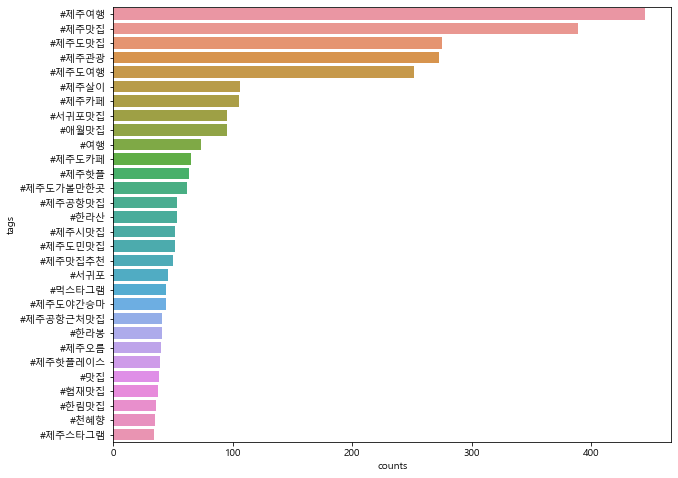

#### 1장. 인스타그램 크롤링


```python
from selenium import webdriver
import time

driver = webdriver.Chrome(r'C:\Users\hwn11\data\chromedriver.exe')

#인스트그램 접속하기
driver.get('https://instagram.com')
time.sleep(2)
```


```python
#인스타그램 검색 결과 URL 만들어 접속하기
def insta_searching(word):
    url = 'https://www.instagram.com/explore/tags/'+word
    return url
```


```python
word = '제주도맛집'
url = insta_searching(word)
driver.get(url)
```


```python
#html에서 첫 번째 게시글 찾아 클릭하기
def select_first(driver):
    first = driver.find_element_by_css_selector('div._9AhH0')
    first.click()
    time.sleep(3)

select_first(driver)
```


```python
content = soup.select('div.C4VMK > span')[0].text.strip()
content.replace('\xa0', ' ')
```


    '✨해월정 서귀포추운 겨울 몸과 마음을 따뜻하게 해월정 보말칼국수♥️그 진한 국물의 구수함을 느껴보세요보말 향토전문점 해월정 (연중무휴)매일 오전 9시 - 오후 7시🎈해월정 서귀포점제주 서귀포시 안덕면 일주서로 1355064) 792-5664🎈해월정 성산본점제주 제주시 구좌읍 해맞이해안로 2340064) 782-5664#제주도맛집#제주맛집#중문맛집#제주중문맛집#서귀포맛집#제주보말칼국수맛집#제주도보말칼국수맛집#제주중문맛집#서귀포맛집#천제연폭포맛집#카멜리아힐근처맛집#제주서귀포맛집#보말칼국수'


```python
#게시글 정보 가져오기
import re
from bs4 import BeautifulSoup
import unicodedata

def get_content(driver):
    #1) 현재 페이지의 HTML 정보 가져오기
    html = driver.page_source
    soup = BeautifulSoup(html, 'lxml')
    
    #2) 본문 내용 가져오기
    try:
        content = soup.select('div.C4VMK > span')[0].text
        content = unicodedata.normalize('NFC', content)
        content = content.replace('\xa0', ' ')
    except:
        content = ' '
        
    #3) 본문 내용에서 해시태그 가져오기(정규식 활용)
    tags = re.findall(r'#[^\s#,\\]+', content)
    
    #4) 작성일자 정보 가져오기
    date = soup.select('time._1o9PC.Nzb55')[0]['datetime'][:10]
    
    #5) 좋아요 수 가져오기
    try:
        like = soup.select('div.Nm9Fw > button')[0].text[4:-1]
    except:
        like = 0
        
    #6) 위치 정보 가져오기
    try : 
        place = soup.select('div.M30cS')[0].text
        place = unicodedata.normalize('NFC', place)
    except:
        place = ' '
        
    #7) 수집한 정보 저장하기
    data = [content, date, like, place, tags]
    return data

get_content(driver)
```


    ['✨해월정 서귀포추운 겨울 몸과 마음을 따뜻하게 해월정 보말칼국수♥️그 진한 국물의 구수함을 느껴보세요보말 향토전문점 해월정 (연중무휴)매일 오전 9시 - 오후 7시🎈해월정 서귀포점제주 서귀포시 안덕면 일주서로 1355064) 792-5664🎈해월정 성산본점제주 제주시 구좌읍 해맞이해안로 2340064) 782-5664#제주도맛집#제주맛집#중문맛집#제주중문맛집#서귀포맛집#제주보말칼국수맛집#제주도보말칼국수맛집#제주중문맛집#서귀포맛집#천제연폭포맛집#카멜리아힐근처맛집#제주서귀포맛집#보말칼국수',
     '2021-01-29',
     '1,676',
     '',
     ['#제주도맛집',
      '#제주맛집',
      '#중문맛집',
      '#제주중문맛집',
      '#서귀포맛집',
      '#제주보말칼국수맛집',
      '#제주도보말칼국수맛집',
      '#제주중문맛집',
      '#서귀포맛집',
      '#천제연폭포맛집',
      '#카멜리아힐근처맛집',
      '#제주서귀포맛집',
      '#보말칼국수']]


```python
def move_next(driver):
    right = driver.find_element_by_css_selector('a.coreSpriteRightPaginationArrow')
    right.click()
    time.sleep(3)
move_next(driver)
```

#### 모든 단계 획일화


```python
from selenium import webdriver
from bs4 import BeautifulSoup
import time
import re


# 1) 인스트그램 접속 및 로그인 하기
driver = webdriver.Chrome(r'C:\Users\hwn11\data\chromedriver.exe')
driver.get('https://instagram.com')
time.sleep(2)

#로그인 진행과정
email = 'skagksdnjs@naver.com'
input_id = driver.find_elements_by_css_selector('input._2hvTZ.pexuQ.zyHYP')[0]
input_id.clear()
input_id.send_keys(email)

password = 'dmgjd134!'
input_pw = driver.find_elements_by_css_selector('input._2hvTZ.pexuQ.zyHYP')[1]
input_pw.clear()
input_pw.send_keys(password)
input_pw.submit()
time.sleep(3)

#2) 인스타그램 검색 페이지 URL 만들기
word = '제주도맛집' #검색어
url = insta_searching(word)

#3) 검색 페이지 접속하기
driver.get(url)
time.sleep(3)

#4) 첫번째 게시글 열기
select_first(driver)

#5) 비어있는 변수 (results)만들기
results = []

#6->7->8 여러 게시물 수집하기
for i in range(500):
    #게시글 수집에 오류 발생시(네트워크 문제 등의 이유로) 2초 대기후 다음 게시글로 넘어가도록, try, except 문 사용
    try:
        data = get_content(driver)
        results.append(data)
        move_next(driver)
    except:
        time.sleep(2)
        move_next(driver)
print(results[:2])
```

    [['.[🌈신선한 해산물+투명한 한라산+제주도오션뷰🌈]이 조합은 더 이상 설명이 필요없지(●ˇ∀ˇ●)제주도에서 즐길수있는 특별함 언제 꼭 해보고싶은걸코xx 물러가면 도전해보고파!!회덕후 소환@@@@@by. @hyo_daeng._.2 님의 꿀팁!🌊위치_제주특별자치도 제주시 한림읍 협재리 2497-1🌊음식정보_동문수산시장 명품해운대 1팩 1만원by. @hyo_daeng._.2 님의 지난 여행이야기"지금 내가 제일 먹고 싶은 것🐟제철인 방어회와 딱새우를 입에 탁!넣고 한라산으로 마무리🛌💤"========================♥소중한 여행의 추억들을 공유해주세요.여행사진 및 영상제보는 "오늘의여행"페이스북 그룹 또는 "오늘의여행" 인스타 DM메세지로 제보해주세요!그럼 오늘도 즐거운여행 되세요 :)========================#오늘의여행 #오여_제주도 #제주도가볼만한곳 #제주도여행 #제주도데이트 #제주도여행코스추천 #제주도회 #제주도회포장 #제주도회포장전문 #겨울여행 #겨울여행추천 #겨울여행추천지 #여행에미치다 #겨울여행추천장소 #제주도맛집 #제주도맛집추천 #제주도오션뷰 #제주오션뷰 #국내여행 #국내여행추천 #커플여행 #가족여행 #가을여행 #여행스타그램 #여행다녀왔습니다 #travel #koreatravel', '2021-01-28', '1,476', '제주도', ['#오늘의여행', '#오여_제주도', '#제주도가볼만한곳', '#제주도여행', '#제주도데이트', '#제주도여행코스추천', '#제주도회', '#제주도회포장', '#제주도회포장전문', '#겨울여행', '#겨울여행추천', '#겨울여행추천지', '#여행에미치다', '#겨울여행추천장소', '#제주도맛집', '#제주도맛집추천', '#제주도오션뷰', '#제주오션뷰', '#국내여행', '#국내여행추천', '#커플여행', '#가족여행', '#가을여행', '#여행스타그램', '#여행다녀왔습니다', '#travel', '#koreatravel']], ['✨해월정 서귀포추운 겨울 몸과 마음을 따뜻하게 해월정 보말칼국수♥️그 진한 국물의 구수함을 느껴보세요보말 향토전문점 해월정 (연중무휴)매일 오전 9시 - 오후 7시🎈해월정 서귀포점제주 서귀포시 안덕면 일주서로 1355064) 792-5664🎈해월정 성산본점제주 제주시 구좌읍 해맞이해안로 2340064) 782-5664#제주도맛집#제주맛집#중문맛집#제주중문맛집#서귀포맛집#제주보말칼국수맛집#제주도보말칼국수맛집#제주중문맛집#서귀포맛집#천제연폭포맛집#카멜리아힐근처맛집#제주서귀포맛집#보말칼국수', '2021-01-29', '1,679', '', ['#제주도맛집', '#제주맛집', '#중문맛집', '#제주중문맛집', '#서귀포맛집', '#제주보말칼국수맛집', '#제주도보말칼국수맛집', '#제주중문맛집', '#서귀포맛집', '#천제연폭포맛집', '#카멜리아힐근처맛집', '#제주서귀포맛집', '#보말칼국수']]]
    


```python
import pandas as pd

results_df = pd.DataFrame(results)
results_df.columns = ['content', 'data', 'like', 'place', 'tags']
results_df.to_excel('1_crawling_jejudoMatJip.xlsx', index = False)
```


```python
#'제주 맛집'으로 검색
from selenium import webdriver
from bs4 import BeautifulSoup
import time
import re


# 1) 인스트그램 접속 및 로그인 하기
driver = webdriver.Chrome(r'C:\Users\hwn11\data\chromedriver.exe')
driver.get('https://instagram.com')
time.sleep(2)

#로그인 진행과정
email = 'skagksdnjs@naver.com'
input_id = driver.find_elements_by_css_selector('input._2hvTZ.pexuQ.zyHYP')[0]
input_id.clear()
input_id.send_keys(email)

password = 'dmgjd134!'
input_pw = driver.find_elements_by_css_selector('input._2hvTZ.pexuQ.zyHYP')[1]
input_pw.clear()
input_pw.send_keys(password)
input_pw.submit()
time.sleep(3)

#2) 인스타그램 검색 페이지 URL 만들기
word = '제주맛집' #검색어
url = insta_searching(word)

#3) 검색 페이지 접속하기
driver.get(url)
time.sleep(3)

#4) 첫번째 게시글 열기
select_first(driver)

#5) 비어있는 변수 (results)만들기
results = []

#6->7->8 여러 게시물 수집하기
for i in range(500):
    #게시글 수집에 오류 발생시(네트워크 문제 등의 이유로) 2초 대기후 다음 게시글로 넘어가도록, try, except 문 사용
    try:
        data = get_content(driver)
        results.append(data)
        move_next(driver)
    except:
        time.sleep(2)
        move_next(driver)
print(results[:2])
```

    [['오픈했습니다!돌풍조심해서 오셔야합니다~오늘도 많이찾아주세요^^!--#가치 #제주가치 #제주술집 #제주이자카야 #제주도술집 #제주맛집 #제주도맛집 #제주도 #제주 #제주여행 #제주도여행 #제주살이 #제주도살이 #제주혼술 #제주도혼술 #제주공항근처맛집 #제주탑동맛집 #제주용담맛집 #제주해안도로 #제주라마다프라자호텔맛집 #제주오션스위츠호텔맛집 #여행에미치다 #제주혼자여행 #제주도혼자여행 #제주도이자카야 #제주이자카야', '2021-01-28', '165', '가치 Kachi', ['#가치', '#제주가치', '#제주술집', '#제주이자카야', '#제주도술집', '#제주맛집', '#제주도맛집', '#제주도', '#제주', '#제주여행', '#제주도여행', '#제주살이', '#제주도살이', '#제주혼술', '#제주도혼술', '#제주공항근처맛집', '#제주탑동맛집', '#제주용담맛집', '#제주해안도로', '#제주라마다프라자호텔맛집', '#제주오션스위츠호텔맛집', '#여행에미치다', '#제주혼자여행', '#제주도혼자여행', '#제주도이자카야', '#제주이자카야']], ['애써 혼자 노력해야 할 관계는 이제 그만', '2021-01-28', '516', '모알보알', []]]
    


```python
import pandas as pd

results_df = pd.DataFrame(results)
results_df.columns = ['content', 'data', 'like', 'place', 'tags']
results_df.to_excel('1_crawling_jejuMatJip.xlsx', index = False)
```


```python
#'제주 맛집'으로 검색
from selenium import webdriver
from bs4 import BeautifulSoup
import time
import re


# 1) 인스트그램 접속 및 로그인 하기
driver = webdriver.Chrome(r'C:\Users\hwn11\data\chromedriver.exe')
driver.get('https://instagram.com')
time.sleep(2)

#로그인 진행과정
email = 'skagksdnjs@naver.com'
input_id = driver.find_elements_by_css_selector('input._2hvTZ.pexuQ.zyHYP')[0]
input_id.clear()
input_id.send_keys(email)

password = 'dmgjd134!'
input_pw = driver.find_elements_by_css_selector('input._2hvTZ.pexuQ.zyHYP')[1]
input_pw.clear()
input_pw.send_keys(password)
input_pw.submit()
time.sleep(3)

#2) 인스타그램 검색 페이지 URL 만들기
word = '제주여행' #검색어
url = insta_searching(word)

#3) 검색 페이지 접속하기
driver.get(url)
time.sleep(3)

#4) 첫번째 게시글 열기
select_first(driver)

#5) 비어있는 변수 (results)만들기
results = []

#6->7->8 여러 게시물 수집하기
for i in range(500):
    #게시글 수집에 오류 발생시(네트워크 문제 등의 이유로) 2초 대기후 다음 게시글로 넘어가도록, try, except 문 사용
    try:
        data = get_content(driver)
        results.append(data)
        move_next(driver)
    except:
        time.sleep(2)
        move_next(driver)
print(results[:2])
```

    [['.처음 생겼을 때 부터 가보고싶었던 곳인다. 매번 차일피일 미루다 유채꽃 구경하곤 시간이 남아 마감 전에 호다닥 가서 맛난 매실에이드 마시고 왔다. 밖에서 식빵 굽고있는 겁만은 고영희 친구들도 보고, 들어서고 나갈 때 까지 너무나 상냥했던 사장님 덕에 좋은 오후 마무리였다.#1월의제주요정 #소보리당로222', '2021-01-28', '1,978', '소보리당로 222', ['#1월의제주요정', '#소보리당로222']], ['카페말로 소소한 이벤트 진행해볼게요\U0001f90d어제 카페말로에 새로온 하얀 포니친구 이름을 지어주세요\U0001f90d우리 새로운 포니는 여자아이에요☺️이름 선정되시는 분께는 카페말로 원하시는 음료 2잔 쏩니다🥳(혹시 제주도에 안 계셔도 유효기간 없이 언제든 사용하러 오셔도 됩니다)1인당 예쁜 이름 하나만 달아주세요 많은 참여 부탁드려요🥺이벤트 기간은 30일 오후 6시까지입니다😌', '2021-01-29', '333', '카페말로in사려니목장', []]]
    


```python
results_df = pd.DataFrame(results)
results_df.columns = ['content', 'data', 'like', 'place', 'tags']
results_df.to_excel('1_crawling_jejuYeoHaeng.xlsx', index = False)
```


```python
#'제주 맛집'으로 검색
from selenium import webdriver
from bs4 import BeautifulSoup
import time
import re


# 1) 인스트그램 접속 및 로그인 하기
driver = webdriver.Chrome(r'C:\Users\hwn11\data\chromedriver.exe')
driver.get('https://instagram.com')
time.sleep(2)

#로그인 진행과정
email = 'skagksdnjs@naver.com'
input_id = driver.find_elements_by_css_selector('input._2hvTZ.pexuQ.zyHYP')[0]
input_id.clear()
input_id.send_keys(email)

password = 'dmgjd134!'
input_pw = driver.find_elements_by_css_selector('input._2hvTZ.pexuQ.zyHYP')[1]
input_pw.clear()
input_pw.send_keys(password)
input_pw.submit()
time.sleep(3)

#2) 인스타그램 검색 페이지 URL 만들기
word = '제주관광' #검색어
url = insta_searching(word)

#3) 검색 페이지 접속하기
driver.get(url)
time.sleep(3)

#4) 첫번째 게시글 열기
select_first(driver)

#5) 비어있는 변수 (results)만들기
results = []

#6->7->8 여러 게시물 수집하기
for i in range(500):
    #게시글 수집에 오류 발생시(네트워크 문제 등의 이유로) 2초 대기후 다음 게시글로 넘어가도록, try, except 문 사용
    try:
        data = get_content(driver)
        results.append(data)
        move_next(driver)
    except:
        time.sleep(2)
        move_next(driver)
print(results[:2])
```

    [['#그날의기억방법제주의 깨끗하고 아름다운 자연,물론 풍경들만 있어도 아름답지만제주에 사는 동물들도 한 몫합니다.최근에 본 기사 중에서 코로나로 인하여많은 사람들이 제주여행을 다니면서 마스크를 착용하는데,그 마스크들이 버려져 몇 십개씩 주은 기사를 보고너무 안타깝다고 생각했습니다. 제주에 살고 있는 이 동물들도 여기 주인이라고 생각이 듭니다.언젠가는 이 아름다운 장면들,소중한 생명체들이 사라지는 날들이 오지않을까걱정하면서 심각성을 인지하며 이 글을 적어봅니다. 제주를 지켜주세요🙏🏻1.용눈이오름:제주 제주시 구좌읍 종달리 산28-일출,일몰 명소-오르는데 15-20분 소요-곡선들이 아름다운 오름-분화구의 말들,   오름 정상에 방목된 말들의 풍경-주차장,화장실 O2.영주산:제주 서귀포시 표선면 성읍리 산18-1-일출 명소-여름 시즌에 계단에 산수국이 포인트-소들이 가끔 나타나는 장소-근처에 성읍민속마을 추천-주차장 O3.물영아리오름:제주 서귀포시 남원읍 수망리 산 188-비 올때 안개가 자욱할때 추천-넓은 들판에 소들과 가끔 노루의 포인트-오를때 계단으로 되어있어서 편리함-주차장,화장실 O4.섭지코지:제주 서귀포시 성산읍 섭지코지로 261-다양한 사진 포인트(올인 촬영지,그네 등)-일출,일몰 명소-주차장에서 도보 10-20분-1-3월 유채꽃, 6-7월 금계국5.가파도:제주 서귀포 대정읍 가파리-가끔 길에 다니는 고양이들-2월 유채꽃, 4월 청보리 -산방산 보이는 포인트6.금오름 앞-일몰 명소-오르는데 20분 정도 소요 / 길이 포장 되어있음-분화구의 가득 찬 물이 포인트-주차장 O7.서광 곶자왈 생태탐방공원:제주 서귀포시 안덕면 서광리 산 6-1-5,6월 반딧불이 시즌 포인트-낮에는 걷기 좋은 숲길-후레쉬, 향수는 반딧불이가 싫어함-주차장 O8.신양섭지해수욕장:제주 서귀포시 성산읍 섭지코지로 107-윈드서핑 유명-반대편 성산일출봉 뷰-일몰 명소-주차장, 화장실 O9. 물영아리오름:제주 서귀포시 남원읍 수망리 산 188-3번 물영아리오름 참조*글자수 제한이 있어서 간략하게 작성합니다 :)#제주여행소셜콘텐츠공모전 #제주도 #제주 #제주여행 #제주관광 #제주특별자치도관광협회 #제주할때가왔다 #제주여행의시작탐나오', '2020-09-29', '4,331', 'Jeju-do', ['#그날의기억방법제주의', '#제주여행소셜콘텐츠공모전', '#제주도', '#제주', '#제주여행', '#제주관광', '#제주특별자치도관광협회', '#제주할때가왔다', '#제주여행의시작탐나오']], ['소싯적에 점프 잘 했었는데 나이드니 몸이 무겁고 무릎이,,\U0001f972 다행히 돌아오는 날이라도 맑아져서 예쁜 날씨에 건진 지난 제주도 여행사진🌈', '2021-01-04', '190', '도두봉 Dodu-Dong Rainbow Coastal Road', []]]
    


```python
results_df = pd.DataFrame(results)
results_df.columns = ['content', 'data', 'like', 'place', 'tags']
results_df.to_excel('1_crawling_jejuGwanGwang.xlsx', index = False)
```


```python
import pandas as pd
#크롤링한 여러개의 저장 파링 통합
jeju_insta_df = pd.DataFrame( [ ] )

f_list = ['1_crawling_jejudoMatJip.xlsx',
         '1_crawling_jejuMatJip.xlsx',
         '1_crawling_jejuGwanGwang.xlsx',
         '1_crawling_jejuYeoHaeng.xlsx']

for fname in f_list:
    temp = pd.read_excel(fname)
    jeju_insta_df = jeju_insta_df.append(temp)
    
jeju_insta_df.columns = ['content', 'data', 'like', 'place', 'tags']
jeju_insta_df.drop_duplicates(subset= ['content'], inplace = True)
jeju_insta_df.to_excel('1_crawling_raw.xlsx', index = False)
```

## 5.2 워드 클라우드

인스타그램을 크롤링한 데이터 중 해시태그 데이터를 불러온 후, 해시태그 종류별로 빈도수를 집계. 해시태그별 빈도수를 그래프를 통해 살펴본 후 분석에 불필요한 해시태그들은 제거하고 의미 있는 해시태그들로 워드 클라우드를 만들어 주요 키워드를 살펴보겠다.


```python
import pandas as pd
raw_total = pd.read_excel('1_crawling_raw.xlsx')
raw_total['tags'][:3]
```


    0    ['#오늘의여행', '#오여_제주도', '#제주도가볼만한곳', '#제주도여행', '...
    1    ['#제주도맛집', '#제주맛집', '#중문맛집', '#제주중문맛집', '#서귀포맛...
    2    ['#제주도맛집', '#제주맛집', '#제주도고기국수', '#성산일출봉맛집', '#...
    Name: tags, dtype: object


```python
tags_total = []

for tags in raw_total['tags']:
    #시작과 끝 부분에 있는 [] 기호를 없앤 뒤, 콤마를 기준으로 해시태그들을 나눠서 tags_list변수에 저장.
    tags_list = tags[2:-2].split("', '")
    for tag in tags_list:
        tags_total.append(tag)
```


```python
#빈도수 집계(Counter)
from collections import Counter
tag_counts = Counter(tags_total)
tag_counts.most_common(50)
```


    [('#제주여행', 445),
     ('#제주맛집', 389),
     ('#제주도', 323),
     ('', 307),
     ('#제주도맛집', 275),
     ('#제주관광', 273),
     ('#제주', 258),
     ('#제주도여행', 252),
     ('#jeju', 124),
     ('#제주살이', 106),
     ('#제주카페', 105),
     ('#제주가볼만한곳', 100),
     ('#서귀포맛집', 95),
     ('#애월맛집', 95),
     ('#일상', 91),
     ('#여행', 73),
     ('#jejuisland', 73),
     ('#제주도카페', 65),
     ('#제주일상', 65),
     ('#제주핫플', 63),
     ('#제주도가볼만한곳', 62),
     ('#데일리', 60),
     ('#맞팔', 57),
     ('#jejudo', 54),
     ('#제주공항맛집', 53),
     ('#한라산', 53),
     ('#제주시맛집', 52),
     ('#제주도민맛집', 52),
     ('#제주맛집추천', 50),
     ('#소통', 47),
     ('#서귀포', 46),
     ('#먹스타그램', 44),
     ('#제주도야간승마', 44),
     ('#제주공항근처맛집', 41),
     ('#한라봉', 41),
     ('#제주오름', 40),
     ('#제주핫플레이스', 39),
     ('#맛집', 38),
     ('#협재맛집', 37),
     ('#한림맛집', 36),
     ('#좋아요', 36),
     ('#천혜향', 35),
     ('#제주스타그램', 34),
     ('#중문맛집', 33),
     ('#맛스타그램', 33),
     ('#제주여행코스', 33),
     ('#좋아요반사', 32),
     ('#제주공항', 31),
     ('#제주시', 31),
     ('#제주명소', 31)]


```python
STOPWORDS = ['#제주도', '#제주', '#jeju', '#제주가볼만한곳', '#일상', '#jejuisland', '#제주일상', '#데일리', '#맞팔', '#jejudo',
'#소통', '#좋아요', '#좋아요반사', '#제주시', '#제주여행코스', '#제주명소', '#제주공항', '', ]

tag_total_selected = []
for tag in tags_total:
    if tag not in STOPWORDS:
        tag_total_selected.append(tag)
        
tag_counts_selected = Counter(tag_total_selected)
tag_counts_selected.most_common(50)
```


    [('#제주여행', 445),
     ('#제주맛집', 389),
     ('#제주도맛집', 275),
     ('#제주관광', 273),
     ('#제주도여행', 252),
     ('#제주살이', 106),
     ('#제주카페', 105),
     ('#서귀포맛집', 95),
     ('#애월맛집', 95),
     ('#여행', 73),
     ('#제주도카페', 65),
     ('#제주핫플', 63),
     ('#제주도가볼만한곳', 62),
     ('#제주공항맛집', 53),
     ('#한라산', 53),
     ('#제주시맛집', 52),
     ('#제주도민맛집', 52),
     ('#제주맛집추천', 50),
     ('#서귀포', 46),
     ('#먹스타그램', 44),
     ('#제주도야간승마', 44),
     ('#제주공항근처맛집', 41),
     ('#한라봉', 41),
     ('#제주오름', 40),
     ('#제주핫플레이스', 39),
     ('#맛집', 38),
     ('#협재맛집', 37),
     ('#한림맛집', 36),
     ('#천혜향', 35),
     ('#제주스타그램', 34),
     ('#중문맛집', 33),
     ('#맛스타그램', 33),
     ('#여행스타그램', 29),
     ('#월정리', 29),
     ('#월정리맛집', 29),
     ('#제주맘', 29),
     ('#서귀포시', 28),
     ('#제주시카페', 28),
     ('#제주도민', 28),
     ('#카페', 28),
     ('#함덕해수욕장', 27),
     ('#선팔', 27),
     ('#성산일출봉', 27),
     ('#제주도한달살기', 26),
     ('#daily', 26),
     ('#가족여행', 25),
     ('#애월카페', 25),
     ('#애월', 25),
     ('#월정리카페', 25),
     ('#좋반', 25)]


```python
#막대차트로 해시태그 살펴보기
import matplotlib.pyplot as plt
import seaborn as sns
from matplotlib import font_manager, rc
import sys

if sys.platform in ['win32', 'win64']:
    font_name = 'malgun gothic'
elif sys.platform == 'darwin':
    font_name = 'AppleGothic'

rc('font', family = font_name)
```


```python
tag_counts_df = pd.DataFrame(tag_counts_selected.most_common(30))
tag_counts_df.columns = ['tags', 'counts']

plt.figure(figsize = (10, 8))
sns.barplot(x = 'counts', y = 'tags', data = tag_counts_df)
```


    <matplotlib.axes._subplots.AxesSubplot at 0x162e336c348>





```python
#워드 클리우드 그리기
from wordcloud import WordCloud
import platform

if platform.system() == 'Windows': # 윈도우의 경우
    font_path = 'c:Windows/Fonts/malgun.ttf'
    
```


```python
wordcloud = WordCloud(font_path = font_path,
                     background_color = 'white', 
                     max_words = 100, 
                     relative_scaling = 0.3,
                     width = 800,
                     height = 400).generate_from_frequencies(tag_counts_selected)
plt.figure(figsize = (15, 10))
plt.imshow(wordcloud)
plt.axis('off')
plt.savefig('2_tag-wordcloud.png')
```


## 5.3 지도 시각화


```python
import pandas as pd
raw_total = pd.read_excel('1_crawling_raw.xlsx')
raw_total.head(3)
```


<div>
<style scoped>
    .dataframe tbody tr th:only-of-type {
        vertical-align: middle;
    }

    .dataframe tbody tr th {
        vertical-align: top;
    }

    .dataframe thead th {
        text-align: right;
    }
</style>
<table border="1" class="dataframe">
  <thead>
    <tr style="text-align: right;">
      <th></th>
      <th>content</th>
      <th>data</th>
      <th>like</th>
      <th>place</th>
      <th>tags</th>
    </tr>
  </thead>
  <tbody>
    <tr>
      <th>0</th>
      <td>.[🌈신선한 해산물+투명한 한라산+제주도오션뷰🌈]이 조합은 더 이상 설명이 필요없지...</td>
      <td>2021-01-28</td>
      <td>1,476</td>
      <td>제주도</td>
      <td>['#오늘의여행', '#오여_제주도', '#제주도가볼만한곳', '#제주도여행', '...</td>
    </tr>
    <tr>
      <th>1</th>
      <td>✨해월정 서귀포추운 겨울 몸과 마음을 따뜻하게 해월정 보말칼국수♥️그 진한 국물의 ...</td>
      <td>2021-01-29</td>
      <td>1,679</td>
      <td>NaN</td>
      <td>['#제주도맛집', '#제주맛집', '#중문맛집', '#제주중문맛집', '#서귀포맛...</td>
    </tr>
    <tr>
      <th>2</th>
      <td>산도롱맨도롱----------🍜제주 유일무이 고기국수 맛집🍜불향 가득한 갈비와100...</td>
      <td>2021-01-29</td>
      <td>1,750</td>
      <td>NaN</td>
      <td>['#제주도맛집', '#제주맛집', '#제주도고기국수', '#성산일출봉맛집', '#...</td>
    </tr>
  </tbody>
</table>
</div>


```python
location_counts = raw_total['place'].value_counts()
location_counts_df = pd.DataFrame(location_counts)
location_counts_df.head()
```


<div>
<style scoped>
    .dataframe tbody tr th:only-of-type {
        vertical-align: middle;
    }

    .dataframe tbody tr th {
        vertical-align: top;
    }

    .dataframe thead th {
        text-align: right;
    }
</style>
<table border="1" class="dataframe">
  <thead>
    <tr style="text-align: right;">
      <th></th>
      <th>place</th>
    </tr>
  </thead>
  <tbody>
    <tr>
      <th>Jeju</th>
      <td>69</td>
    </tr>
    <tr>
      <th>환상의 섬 Jeju Island</th>
      <td>42</td>
    </tr>
    <tr>
      <th>Jeju-do</th>
      <td>39</td>
    </tr>
    <tr>
      <th>제주도</th>
      <td>27</td>
    </tr>
    <tr>
      <th>제주고산리유적</th>
      <td>14</td>
    </tr>
  </tbody>
</table>
</div>


```python
location_counts_df.to_excel('3_location_counts.xlsx')

locations = list(location_counts.index)
locations
```


    ['Jeju',
     '환상의 섬 Jeju Island',
     'Jeju-do',
     '제주도',
     '제주고산리유적',
     'Seogwipo',
     '제주도 애월읍',
     'Jeju Island',
     'The Shilla Jeju',
     '고래배꼽',
     '푸른섬 제주도',
     'D&department JEJU by Arario',
     '1100고지',
     '제주도 Jeju Island',
     '신창풍차해안도로',
     '제주 협재 해수욕장',
     'Jeju Island, South Korea - 제주도',
     'Seogwipo, Jeju Island, South Korea',
     '제주신화월드 Jeju Shinhwa World',
     '빛의 벙커 Bunker de Lumières',
     '카페 노티드 제주 애월 - Cafe Knotted Jeju Aewol',
     '오늘무지개',
     '사려니숲길',
     '도구리 3083',
     'Jeju Korea',
     '제주 구좌읍 세화리',
     '이호테우해변',
     'Grand Hyatt Jeju',
     '온새미로펜션',
     '월정리해변',
     '아르떼뮤지엄 Arte Museum',
     '제주 남원리',
     '제주 나홀로나무',
     '드림타워',
     '제주도 표선',
     '조천읍 북촌리',
     '제주또시랑',
     '카페 더 콘테나',
     'JIVAL',
     '동백포레스트',
     '오늘은 녹차한잔',
     '눈을맞추다 노형점',
     'Umu Pudding , 우무',
     '한담해안산책로',
     '금악오름',
     '한라진칼국수',
     'Osulloc Jeju Tea Garden',
     '색달해변',
     '드리넘넘',
     '섭지코지 (Seopjikoji)',
     'le chinois 르쉬느아',
     '제주 애월',
     '애월해안도로',
     '미카의달콤한작업실',
     '아구에반하다',
     '송훈파크',
     '스시 호시카이             Sushi Hoshikai',
     '제주도 곽지해수욕장',
     '칠돈가 본점',
     '참좋은해물라면',
     '제주시 한림읍 협재리',
     '인스밀',
     '미쁜제과',
     'Indigoterie',
     '제주시 조천읍 선흘리',
     '위미2리 동백군락지',
     '제주귀더크',
     '다운타우너 제주 애월 - Downtowner Jeju Aewol',
     '구좌읍 평대리 풍림다방',
     '모알보알',
     '표선 해비치해수욕장',
     '알뜨르비행장 및 일본군 비행기 격납고',
     '카페한라산',
     '송악산',
     '용두암',
     '비자림',
     '한림해안도로',
     '미영이네식당',
     'One and only - 원앤온리 제주',
     '위미리 동백군락지',
     '사쿠라미치 - 벚꽃길',
     '더바당민박',
     '도두봉',
     'Gyeongju, Korea',
     '제주시청어딘가',
     '우도근고기',
     '제주시 구좌읍',
     '여유화실',
     '김녕미로공원 Jeju Kimnyoung Maze Park',
     '클랭블루제주',
     '서귀포시',
     '그리다앤쿡',
     '문도지오름',
     '도두봉 Dodu-Dong Rainbow Coastal Road',
     '아라동 빨간집',
     '스퀘어베이',
     '애월해안가',
     '제주동백수목원',
     '환상의섬 제주Island',
     '천왕사 (天王寺)',
     '스누피가든',
     '폴바셋',
     'Seoul, Korea',
     '훈남횟집',
     '명랑스낵',
     'Hidden Cliff / 히든 클리프',
     'Home Sweet Home♥',
     '느루,온穩',
     '코하쿠',
     '대릉원사진관애월점',
     '마농치킨 2호점',
     '도두봉 정상',
     '세화해수욕장',
     '무우수 커피 로스터스',
     '제주도 성산일출봉',
     '아리아 제주 - Aria Jeju',
     '미친부엌',
     '오름의 여왕 따라비',
     '월정리인카페',
     '생일의끝',
     '제주신라호텔 더 파크뷰',
     '마농',
     '대우정식당',
     'Villadeato-빌라드아토',
     'Dorrell',
     '큰엉해안경승지',
     '제주도 가시리',
     '돈이랑 본점',
     '아줄레주',
     '반투명',
     '옥돔식당',
     '피규어뮤지엄제주',
     '제제댁',
     '한라궁호텔',
     '롯데호텔제주',
     '모노클제주',
     '고집돌우럭-gozipfish',
     '더 하우스 아다지오',
     '성산유채꽃밭',
     '제주탑동',
     '천연불맛 불쇼 미온당',
     '마가리따은혜씨',
     '하와이안비치카페',
     'Gongbech.공백',
     '오랜제주',
     '제주오누이',
     '버거의여왕',
     '다려도횟집',
     'Playce Camp',
     '한라산 정상(백록담)',
     '해송횟집',
     '송당리',
     '제주도맛집',
     '금능해수욕장',
     '볼수록 제주',
     '책방무사',
     '전남대 후문',
     '제주도 남또리',
     '하얏트리젠시제주',
     '오지하우스 신제주분점',
     '성산일출봉',
     '바나나우유옆',
     '너와의첫여행',
     'LOTTE HOTEL JEJU 롯데호텔제주',
     '콜로세움',
     '사계바다',
     'the cliff jeju - 더클리프 제주',
     '우도 牛岛 Udo Island, South Korea',
     '카페그라나다',
     '가시아방',
     '남원 큰엉해안',
     '제주시청에서',
     '제주칼국수 제주해물탕',
     '귤한가',
     '시스터필드',
     'Jeju Island, Korea',
     '엘마리노',
     '똥꼬치킨',
     '제주올레7코스쉼터',
     '순창갈비',
     '제주 어딘가',
     '성산읍 수산리',
     '제주 까만돌멩이',
     '추워 추워 진짜 너무 추워',
     '한남시험림(사려니오름)',
     '체인지오필라테스',
     '신양마을',
     '수목원길 야시장',
     '제주도 서귀포 위미항',
     '둥지식당',
     '모레기동 타잔',
     '백약이 오름',
     '중문관광단지 (Jungmun Tourism Complex)',
     '성이시돌목장',
     'Cafe1950',
     '이름없음',
     '경기도  파주시 운정신도시',
     '글라스월평',
     'Seongsan Ilchulbong, Jeju Island - South Korea',
     'Jeju, Korea',
     '제주어린왕자감귤밭',
     '성산일출봉 Seongsan Sunrise Peak',
     '더 클라우드 힐링 호텔                    The Cloud Healing Hotel',
     '제주도 한경면 조수리',
     '한라산',
     '아날로그감귤밭',
     '카페만감교차',
     '휴애리 자연생활공원',
     '서귀포',
     '종종 캐주얼 다이닝',
     '금오름',
     '제주도 서귀포시 성산읍',
     '제주흑돼지와전복',
     'Grand Josun Jeju - 그랜드 조선 제주',
     '더로맨틱 _ 내생에 가장 아름다운 날들',
     '루스트플레이스 함덕해수욕장점',
     '해성도뚜리가든',
     '바리메오름',
     'About Coffee',
     '미스틱 3도',
     '하이엔드 제주',
     'Halla Mountain, 한라산',
     '형돈',
     '난드르바당',
     '용머리해안',
     '동문시장 Dongmoon Market 東門水産市場',
     '앙뚜아네트용담점',
     '수두리보말칼국수',
     'Busan 釜山, South Korea',
     '두더지식당',
     '귤꽃다락',
     '춘분',
     '버터넛 Butternut',
     '고집돌우럭중문점',
     '제주담은 손맛, 재암식당',
     '수눌음',
     '제주시 애월읍 버거리',
     'World Natural Heritage,Sungsan Sunrise Peak',
     '명진전복',
     'Yeosu',
     '오설록티뮤지엄',
     '루스트 베라체점',
     '제주 함덕 서우봉 해변',
     'Busan, South Korea',
     '구룸',
     '덕인당',
     '에코랜드',
     '제주시 아라동',
     '향나무집',
     '목스키친-Mokskitchen',
     '모니카옛날통닭',
     "'남경미락'",
     '제주 카페더콘테나',
     'Cafe MANI',
     '제주 밀집',
     'JejuGukdam 제주국담',
     'Far & East',
     '수원북문 산적',
     '모이소',
     '가치 Kachi',
     'ทุ่งคอสมอสสระบุรี',
     '렌소이스',
     '제주도 세화해변',
     '무거버거-Moogerburger',
     '탐라스테이',
     '루스트 외도점',
     '레이지펌프',
     'Incheon, Korea',
     '손방둥이 공방',
     '산방식당',
     '마담조 Pub & Dining',
     '리치망고애월본점',
     '용두암바닷가',
     'Seongsan Ilchulbong',
     '제주도제주시 삼화지구',
     '제주시 새우리',
     '제주도 오설록 녹차밭',
     '두산위브지웰시티',
     '뽈살집',
     '한림읍 귀덕리',
     '제주시연동',
     '판포포구',
     'Dongmun Market Place',
     '영덕대게마을',
     '삼양검은모래해변',
     '양꼬치집',
     '구엄리돌염전',
     '칠돈가 중문점',
     'Starbucks - Jeju Jungmun DT',
     '성수미술관 제주특별점',
     '소보리당로 222',
     '하나의식탁',
     '정방폭포',
     '더스푼_Cafe & Kitchen',
     '우연국수',
     '순천미향',
     '김재훈고사리육개장',
     '제이홀스클럽',
     '거린사슴전망대',
     '소금바치 순이네',
     '세화갈비',
     'Hallasan',
     '턴어라운드',
     '일월선셋비치',
     '사이카레',
     '정물오름',
     'playce',
     '마녀상회',
     '김녕오라이',
     '오드랑베이커리',
     '애월읍 봉성리',
     '내 사진첩',
     '단정한까-페',
     '제주도 송당리',
     'Linger in mood Showroom',
     '도두해안도로',
     '오지하우스 시청본점',
     '케렌시아',
     '테디스오',
     '카페말로in사려니목장',
     '퍼플모스 Purple Moss',
     '혹시제주',
     '포도호텔',
     '유채꽃프라자',
     'Plymood',
     'Illwol jeju - 일월 제주',
     '새별오름',
     '장유 율하 카페거리',
     '돈사돈 본점',
     '논짓물 담수풀장',
     '신제주어딘가',
     '돈사돈중문점',
     '해피누들',
     '제주 가파도',
     '협재식물원',
     '미스터피자 경기광주점',
     '모립 ː몰입',
     '로치아 커피로스터스',
     'Jeju Aqua Planet',
     '세화 투접시족발',
     'Gapyeong',
     '당당 / Dang Dang',
     '지호네민박 2호점',
     '싱싱잇',
     '제주신라호텔',
     'Eunnam3st._jeju',
     '와락 게스트하우스',
     '월정리바닷가',
     '제주 섭지코지',
     '29cuisine',
     '카페 달력',
     '연돈',
     '제주 지미봉',
     '서귀포 짱구분식',
     '제주도 한담해변',
     '뵤뵤카페',
     '이스트포레스트 - Eastforest',
     '비니스',
     '정대, 鼎大',
     'Daegu, South Korea',
     '송당리 풍림다방',
     '인손',
     '비밀의숲',
     '라미엔느스튜디오',
     '제주애퐁당']


```python
#카카오 로컬 api사용
import requests

searching = '합정 스타벅스'
url = 'https://dapi.kakao.com/v2/local/search/keyword.json?query={}'.format(searching)
headers = {'Authorization': 'KakaoAK 4d6d4473a6b8dcc7bc924d3db2aef841'}

places = requests.get(url, headers = headers).json()['documents']
places
```


    [{'address_name': '서울 마포구 서교동 395-166',
      'category_group_code': 'CE7',
      'category_group_name': '카페',
      'category_name': '음식점 > 카페 > 커피전문점 > 스타벅스',
      'distance': '',
      'id': '26572121',
      'phone': '',
      'place_name': '스타벅스 서교점',
      'place_url': 'http://place.map.kakao.com/26572121',
      'road_address_name': '서울 마포구 양화로 78',
      'x': '126.916980454434',
      'y': '37.5514601750423'},
     {'address_name': '서울 마포구 합정동 472',
      'category_group_code': 'CE7',
      'category_group_name': '카페',
      'category_name': '음식점 > 카페 > 커피전문점 > 스타벅스',
      'distance': '',
      'id': '2057327896',
      'phone': '1522-3232',
      'place_name': '스타벅스 합정점',
      'place_url': 'http://place.map.kakao.com/2057327896',
      'road_address_name': '서울 마포구 월드컵로1길 14',
      'x': '126.91253700818196',
      'y': '37.54994959743763'},
     {'address_name': '서울 마포구 서교동 490',
      'category_group_code': 'CE7',
      'category_group_name': '카페',
      'category_name': '음식점 > 카페 > 커피전문점 > 스타벅스',
      'distance': '',
      'id': '288597324',
      'phone': '',
      'place_name': '스타벅스 합정폴리스R점',
      'place_url': 'http://place.map.kakao.com/288597324',
      'road_address_name': '서울 마포구 양화로 45',
      'x': '126.91340049045',
      'y': '37.5508989849269'},
     {'address_name': '서울 마포구 서교동 490',
      'category_group_code': 'CE7',
      'category_group_name': '카페',
      'category_name': '음식점 > 카페 > 커피전문점 > 스타벅스',
      'distance': '',
      'id': '27076117',
      'phone': '1522-3232',
      'place_name': '스타벅스 합정메세나몰점',
      'place_url': 'http://place.map.kakao.com/27076117',
      'road_address_name': '서울 마포구 양화로 45',
      'x': '126.913541853312',
      'y': '37.5500016943689'},
     {'address_name': '서울 마포구 서교동 475-13',
      'category_group_code': 'CE7',
      'category_group_name': '카페',
      'category_name': '음식점 > 카페 > 커피전문점 > 스타벅스',
      'distance': '',
      'id': '12776689',
      'phone': '1522-3232',
      'place_name': '스타벅스 망원역점',
      'place_url': 'http://place.map.kakao.com/12776689',
      'road_address_name': '서울 마포구 월드컵로 74',
      'x': '126.91071941264',
      'y': '37.5557803955969'},
     {'address_name': '서울 마포구 서교동 374-20',
      'category_group_code': 'CE7',
      'category_group_name': '카페',
      'category_name': '음식점 > 카페 > 커피전문점 > 스타벅스',
      'distance': '',
      'id': '27416913',
      'phone': '',
      'place_name': '스타벅스 서교동사거리',
      'place_url': 'http://place.map.kakao.com/27416913',
      'road_address_name': '서울 마포구 양화로 105',
      'x': '126.918607875358',
      'y': '37.5534723352988'},
     {'address_name': '서울 마포구 서교동 353-5',
      'category_group_code': 'CE7',
      'category_group_name': '카페',
      'category_name': '음식점 > 카페 > 커피전문점 > 스타벅스',
      'distance': '',
      'id': '1436512690',
      'phone': '1522-3232',
      'place_name': '스타벅스 홍대입구역사거리R점',
      'place_url': 'http://place.map.kakao.com/1436512690',
      'road_address_name': '서울 마포구 양화로 125',
      'x': '126.920317785646',
      'y': '37.5546231745866'},
     {'address_name': '서울 마포구 동교동 205-6',
      'category_group_code': 'CE7',
      'category_group_name': '카페',
      'category_name': '음식점 > 카페 > 커피전문점 > 스타벅스',
      'distance': '',
      'id': '20705154',
      'phone': '1522-3232',
      'place_name': '스타벅스 동교점',
      'place_url': 'http://place.map.kakao.com/20705154',
      'road_address_name': '서울 마포구 월드컵북로 22',
      'x': '126.919993980608',
      'y': '37.5568646370831'},
     {'address_name': '서울 마포구 상수동 86-22',
      'category_group_code': 'CE7',
      'category_group_name': '카페',
      'category_name': '음식점 > 카페 > 커피전문점 > 스타벅스',
      'distance': '',
      'id': '17127074',
      'phone': '1522-3232',
      'place_name': '스타벅스 홍대삼거리점',
      'place_url': 'http://place.map.kakao.com/17127074',
      'road_address_name': '서울 마포구 와우산로 64',
      'x': '126.92328058235611',
      'y': '37.55025439607592'},
     {'address_name': '서울 마포구 동교동 159-1',
      'category_group_code': 'CE7',
      'category_group_name': '카페',
      'category_name': '음식점 > 카페 > 커피전문점 > 스타벅스',
      'distance': '',
      'id': '22105109',
      'phone': '',
      'place_name': '스타벅스 홍대역점',
      'place_url': 'http://place.map.kakao.com/22105109',
      'road_address_name': '서울 마포구 양화로 165',
      'x': '126.923637798148',
      'y': '37.5572887166274'},
     {'address_name': '서울 마포구 상수동 329-1',
      'category_group_code': 'CE7',
      'category_group_name': '카페',
      'category_name': '음식점 > 카페 > 커피전문점 > 스타벅스',
      'distance': '',
      'id': '26848996',
      'phone': '1522-3232',
      'place_name': '스타벅스 상수역점',
      'place_url': 'http://place.map.kakao.com/26848996',
      'road_address_name': '서울 마포구 독막로 88',
      'x': '126.923272022704',
      'y': '37.5475649101839'},
     {'address_name': '서울 마포구 서교동 343-10',
      'category_group_code': 'CE7',
      'category_group_name': '카페',
      'category_name': '음식점 > 카페 > 커피전문점 > 스타벅스',
      'distance': '',
      'id': '7962302',
      'phone': '1522-3232',
      'place_name': '스타벅스 홍대갤러리점',
      'place_url': 'http://place.map.kakao.com/7962302',
      'road_address_name': '서울 마포구 와우산로 101',
      'x': '126.92490942468388',
      'y': '37.553248558544716'},
     {'address_name': '서울 마포구 동교동 166-1',
      'category_group_code': 'CE7',
      'category_group_name': '카페',
      'category_name': '음식점 > 카페 > 커피전문점 > 스타벅스',
      'distance': '',
      'id': '231272664',
      'phone': '1522-3232',
      'place_name': '스타벅스 홍대공항철도역점',
      'place_url': 'http://place.map.kakao.com/231272664',
      'road_address_name': '서울 마포구 양화로 178',
      'x': '126.92518582665798',
      'y': '37.557509550972256'},
     {'address_name': '서울 마포구 동교동 165-1',
      'category_group_code': 'CE7',
      'category_group_name': '카페',
      'category_name': '음식점 > 카페 > 커피전문점 > 스타벅스',
      'distance': '',
      'id': '1485627824',
      'phone': '1522-3232',
      'place_name': '스타벅스 홍대역8번출구점',
      'place_url': 'http://place.map.kakao.com/1485627824',
      'road_address_name': '서울 마포구 양화로 166',
      'x': '126.924168013515',
      'y': '37.5567448560452'},
     {'address_name': '서울 마포구 창전동 130',
      'category_group_code': 'CE7',
      'category_group_name': '카페',
      'category_name': '음식점 > 카페 > 커피전문점 > 스타벅스',
      'distance': '',
      'id': '1572099327',
      'phone': '',
      'place_name': '스타벅스 서강광흥창역점',
      'place_url': 'http://place.map.kakao.com/1572099327',
      'road_address_name': '서울 마포구 서강로 69',
      'x': '126.931657893743',
      'y': '37.5493756625598'}]


```python
#카카오 api를 이용한 장소 검색 함수 만들기

def find_places(searching):
    #1. 접속 URL 만들기
    url = 'https://dapi.kakao.com/v2/local/search/keyword.json?query={}'.format(searching)
    
    #2. header 입력하기
    headers = {'Authorization' : 'KakaoAK 4d6d4473a6b8dcc7bc924d3db2aef841'}
    
    #3. API 요청 및 정보 받기
    places = requests.get(url, headers = headers).json()['documents']
    
    #4. 필요한 정보 선택하기
    place = places[0]
    name = place['place_name']
    x = place['x']
    y = place['y']
    data = [name, x, y, searching]
    
    return data
```


```python
#제주공항 검색 예시
find_places('제주공항')
```


    ['제주국제공항', '126.492769004244', '33.5070789578184', '제주공항']


```python
#인스타그램 위치명에 대한 위치 정보 검색
import time
locations_inform = []
for location in locations:
    try:
        data = find_places(location)
        locations_inform.append(data)
        time.sleep(0.5)
    except:
        pass
    
locations_inform
```


    [['Jeju in aA', '126.83650369902168', '33.53833652360498', 'Jeju'],
     ['제주도', '126.54587355630036', '33.379777816446165', '제주도'],
     ['제주고산리유적', '126.1666521275124', '33.30508436596465', '제주고산리유적'],
     ['서귀포잠수함', '126.558616052674', '33.2393033784206', 'Seogwipo'],
     ['올레길 17코스(광령-제주원도심 올레)', '126.439341083568', '33.4608856490895', '제주도 애월읍'],
     ['제주도', '126.54587355630036', '33.379777816446165', 'Jeju Island'],
     ['고래배꼽', '126.403430604615', '33.4804484298816', '고래배꼽'],
     ['푸른섬게스트하우스', '126.812424476454', '33.3079427982969', '푸른섬 제주도'],
     ['D', '126.923721083602', '37.5510826987805', 'D&department JEJU by Arario'],
     ['한라산1100고지', '126.462219691112', '33.3580781709788', '1100고지'],
     ['제주도', '126.54587355630036', '33.379777816446165', '제주도 Jeju Island'],
     ['신창풍차해안도로', '126.17420604655737', '33.343081026740045', '신창풍차해안도로'],
     ['협재해수욕장', '126.239157539085', '33.3938660776221', '제주 협재 해수욕장'],
     ['제주신화월드',
      '126.31725882345',
      '33.3060022512072',
      '제주신화월드 Jeju Shinhwa World'],
     ['빛의 벙커',
      '126.89981825080305',
      '33.43964477102691',
      '빛의 벙커 Bunker de Lumières'],
     ['카페노티드 제주애월',
      '126.309727173646',
      '33.4632646584656',
      '카페 노티드 제주 애월 - Cafe Knotted Jeju Aewol'],
     ['사려니숲길', '126.62649730394567', '33.422032834994496', '사려니숲길'],
     ['도구리3083', '126.172616982991', '33.2749062917198', '도구리 3083'],
     ['성이시돌목장', '126.327321076199', '33.3477698762559', 'Jeju Korea'],
     ['세화해변', '126.86025618946', '33.5251436596119', '제주 구좌읍 세화리'],
     ['이호테우해수욕장', '126.452690819027', '33.4973768007144', '이호테우해변'],
     ['온새미로펜션', '128.125613774855', '37.6703318139334', '온새미로펜션'],
     ['월정리해수욕장', '126.795805057888', '33.556469394054', '월정리해변'],
     ['올레길 5코스(남원-쇠소깍 올레)', '126.66743988738492', '33.27078076230098', '제주 남원리'],
     ['새별오름 나홀로나무', '126.3498885723', '33.350735531562', '제주 나홀로나무'],
     ['드림타워', '126.888456764186', '37.5824993936594', '드림타워'],
     ['올레길 4코스(표선-남원 올레)', '126.78791509734609', '33.304819808349805', '제주도 표선'],
     ['서우봉', '126.677893828794', '33.5458432546933', '조천읍 북촌리'],
     ['제주또시랑', '126.54743984095984', '33.48037633607271', '제주또시랑'],
     ['카페더콘테나', '126.67895539907079', '33.49808308071445', '카페 더 콘테나'],
     ['지발', '126.334790490206', '33.4660884059819', 'JIVAL'],
     ['동백포레스트', '126.63621623625866', '33.30034607599768', '동백포레스트'],
     ['오늘은녹차한잔', '126.790995424509', '33.3818346071996', '오늘은 녹차한잔'],
     ['눈을맞추다 노형점', '126.477662673395', '33.4841897259137', '눈을맞추다 노형점'],
     ['한담해안산책로', '126.310468326159', '33.4593234504188', '한담해안산책로'],
     ['금오름', '126.305717639727', '33.3545500138779', '금악오름'],
     ['한라진칼국수', '126.438262100061', '33.4954080745064', '한라진칼국수'],
     ['중문색달해수욕장', '126.411498674889', '33.2450381505136', '색달해변'],
     ['드리넘넘', '126.801029384987', '33.5557953937919', '드리넘넘'],
     ['섭지코지', '126.930609241011', '33.4239380655993', '섭지코지 (Seopjikoji)'],
     ['제주신화월드 르쉬느아', '126.317683251182', '33.3074805130955', 'le chinois 르쉬느아'],
     ['올레길 17코스(광령-제주원도심 올레)', '126.439341083568', '33.4608856490895', '제주 애월'],
     ['애월해안도로', '126.36867872098', '33.4781232943703', '애월해안도로'],
     ['미카의달콤한작업실', '126.29892794220129', '33.22673960787681', '미카의달콤한작업실'],
     ['아구에반하다', '126.494502700126', '33.4835833626552', '아구에반하다'],
     ['송훈파크', '126.383175943981', '33.3931796687461', '송훈파크'],
     ['곽지해수욕장', '126.304673157235', '33.4506575078278', '제주도 곽지해수욕장'],
     ['칠돈가 본점', '126.51071724442507', '33.50232582709983', '칠돈가 본점'],
     ['참좋은해물라면 애월', '126.37813983266977', '33.48385652794381', '참좋은해물라면'],
     ['협재해수욕장', '126.239157539085', '33.3938660776221', '제주시 한림읍 협재리'],
     ['인스밀', '126.22923429032335', '33.23848104809581', '인스밀'],
     ['미쁜제과', '126.180059640842', '33.2691601160601', '미쁜제과'],
     ['인디고트리', '126.6348243522451', '33.26382963467241', 'Indigoterie'],
     ['선녀와나무꾼 테마공원', '126.703778647835', '33.4787929391846', '제주시 조천읍 선흘리'],
     ['귀더크', '126.282366800118', '33.4423007490057', '제주귀더크'],
     ['풍림다방 송당점', '126.785708132282', '33.471878655079', '구좌읍 평대리 풍림다방'],
     ['모알보알 제주', '126.727953094591', '33.5595665887276', '모알보알'],
     ['표선해수욕장', '126.837424825392', '33.3275109235413', '표선 해비치해수욕장'],
     ['카페한라산', '126.86302545302301', '33.52478250671836', '카페한라산'],
     ['송악산', '126.290117450498', '33.1992155342686', '송악산'],
     ['용두암', '126.511957109074', '33.5161106216721', '용두암'],
     ['비자림', '126.80998754971', '33.4904083697986', '비자림'],
     ['귀덕해안도로', '126.287459086914', '33.4439890305215', '한림해안도로'],
     ['미영이네식당', '126.249828956914', '33.217732821842', '미영이네식당'],
     ['원앤온리', '126.319192490757', '33.2392223486155', 'One and only - 원앤온리 제주'],
     ['위미동백나무군락', '126.67473058287', '33.2729387205764', '위미리 동백군락지'],
     ['도두봉', '126.468115685304', '33.5083099200904', '도두봉'],
     ['어디가코', '126.527949409191', '33.499875433506', '제주시청어딘가'],
     ['운산식당', '126.521912106387', '33.5159438800081', '우도근고기'],
     ['올레길 20코스(김녕-하도 올레)', '126.745210877984', '33.557569317545', '제주시 구좌읍'],
     ['클랭블루', '126.177301119874', '33.3448722920323', '클랭블루제주'],
     ['올레길 7코스(서귀포-월평 올레)', '126.51531780746991', '33.237465168471545', '서귀포시'],
     ['그리다앤쿡', '126.530652571894', '33.4975054978261', '그리다앤쿡'],
     ['문도지오름', '126.294558202587', '33.3262057139983', '문도지오름'],
     ['빨간집 아라점', '126.545350492565', '33.4739781730828', '아라동 빨간집'],
     ['스퀘어베이', '126.172695789961', '33.2747445282982', '스퀘어베이'],
     ['제주동백수목원', '126.67802482042438', '33.27496334384195', '제주동백수목원'],
     ['스누피가든', '126.77844424339503', '33.443962924091636', '스누피가든'],
     ['폴바셋 한남커피스테이션', '127.008195858679', '37.533350151365', '폴바셋'],
     ['페이스뮤직', '126.915848984951', '37.5512791744838', 'Seoul, Korea'],
     ['훈남횟집', '126.66785804080043', '33.54208595338686', '훈남횟집'],
     ['명랑스낵', '126.258817154541', '33.4091714181718', '명랑스낵'],
     ['히든클리프호텔&네이쳐',
      '126.402595131766',
      '33.2547764885257',
      'Hidden Cliff / 히든 클리프'],
     ['홈스위트홈 잠실점', '127.108038042481', '37.5134465345775', 'Home Sweet Home♥'],
     ['코하쿠', '126.487563278466', '33.4670629106925', '코하쿠'],
     ['대릉원사진관 애월점', '126.32146199880944', '33.464202178295636', '대릉원사진관애월점'],
     ['마농치킨 2호점', '126.562844071267', '33.2503903379929', '마농치킨 2호점'],
     ['도두봉', '126.468115685304', '33.5083099200904', '도두봉 정상'],
     ['세화해변', '126.86025618946', '33.5251436596119', '세화해수욕장'],
     ['무우수커피로스터스', '126.638359880905', '33.5377856728773', '무우수 커피 로스터스'],
     ['성산일출봉', '126.940537521366', '33.4591349705437', '제주도 성산일출봉'],
     ['미친부엌', '126.52313770399789', '33.51699084178409', '미친부엌'],
     ['월정리인카페', '126.79328046831104', '33.5561956278273', '월정리인카페'],
     ['신라호텔제주 더파크뷰', '126.40796178403716', '33.24714558611552', '제주신라호텔 더 파크뷰'],
     ['마농치킨 본점', '126.563275283204', '33.2491295705844', '마농'],
     ['대우정', '126.519586532616', '33.4989236665696', '대우정식당'],
     ['빌라드아토', '126.564574977419', '33.2449758067437', 'Villadeato-빌라드아토'],
     ['도렐 제주본점', '126.91822065369526', '33.44990635496953', 'Dorrell'],
     ['큰엉해안경승지', '126.703714399015', '33.2733321532168', '큰엉해안경승지'],
     ['따라비오름', '126.752858386101', '33.3887069884228', '제주도 가시리'],
     ['정직한돈 본점', '126.338881485019', '33.4673580858876', '돈이랑 본점'],
     ['아줄레주', '126.83929768676283', '33.366833237583926', '아줄레주'],
     ['카페반투명', '126.486321153066', '33.4755724262521', '반투명'],
     ['옥돔식당', '126.249007485159', '33.2199710821565', '옥돔식당'],
     ['피규어뮤지엄제주', '126.35535652107916', '33.28190640701935', '피규어뮤지엄제주'],
     ['제제댁게스트하우스', '126.64486253973615', '33.52992457189592', '제제댁'],
     ['제주한옥호텔 한라궁', '126.578245651542', '33.2484599337481', '한라궁호텔'],
     ['롯데호텔 제주', '126.410600157083', '33.2484564531332', '롯데호텔제주'],
     ['모노클제주', '126.68451546433884', '33.272913444179565', '모노클제주'],
     ['더하우스아다지오', '126.435306898468', '33.2431532312705', '더 하우스 아다지오'],
     ['중앙체육공원', '128.674733170736', '35.21654592736', '성산유채꽃밭'],
     ['제주탑동', '126.524089641872', '33.5184839287134', '제주탑동'],
     ['마가리따은혜씨', '126.93431882095089', '33.46097472289318', '마가리따은혜씨'],
     ['하와이안비치카페', '126.917472263396', '33.4351677419377', '하와이안비치카페'],
     ['공백', '126.715093661443', '33.5533924123546', 'Gongbech.공백'],
     ['오랜제주선화집', '126.696321275177', '33.5512849485224', '오랜제주'],
     ['제주오누이 전기차충전소', '126.828151356189', '33.5425798506076', '제주오누이'],
     ['버거의여왕', '126.30875247709479', '33.23109529952681', '버거의여왕'],
     ['다려도횟집', '126.667726113557', '33.5411100764799', '다려도횟집'],
     ['플레이스캠프제주', '126.91820900260372', '33.4499438543169', 'Playce Camp'],
     ['해송횟집', '127.123562697636', '35.8694809838755', '해송횟집'],
     ['스누피가든', '126.77844424339503', '33.443962924091636', '송당리'],
     ['연돈', '126.40715814631936', '33.258895288625645', '제주도맛집'],
     ['금능해수욕장', '126.235889902253', '33.3904488156321', '금능해수욕장'],
     ['볼수록제주', '126.39337656254352', '33.46821736765415', '볼수록 제주'],
     ['책방무사', '126.88672097741352', '33.44607191099333', '책방무사'],
     ['전남대학교 광주캠퍼스', '126.90804215794094', '35.177462180745934', '전남대 후문'],
     ['남또리횟집', '126.349344217841', '33.4728085344377', '제주도 남또리'],
     ['성산일출봉', '126.940537521366', '33.4591349705437', '성산일출봉'],
     ['너와의첫여행', '126.384541975515', '33.4506360949443', '너와의첫여행'],
     ['롯데시티호텔 제주',
      '126.486477218467',
      '33.4906945837847',
      'LOTTE HOTEL JEJU 롯데호텔제주'],
     ['보문콜로세움', '129.268198148918', '35.8525806680576', '콜로세움'],
     ['사계바다', '126.303797931935', '33.2278741425682', '사계바다'],
     ['카페그라나다', '126.46405483116209', '33.49943160927088', '카페그라나다'],
     ['가시아방국수', '126.91806478438669', '33.43860508447686', '가시아방'],
     ['큰엉해안경승지', '126.703714399015', '33.2733321532168', '남원 큰엉해안'],
     ['제주시청', '126.531171087129', '33.4995342412698', '제주시청에서'],
     ['제주칼국수제주해물탕', '126.91280268970911', '33.47205124629999', '제주칼국수 제주해물탕'],
     ['귤한가', '126.263068588116', '33.3884421528171', '귤한가'],
     ['시스터필드베이커리', '126.507352413664', '33.2489458673872', '시스터필드'],
     ['퍼시픽리솜 엘마리노뷔페', '126.416369707611', '33.2431640889973', '엘마리노'],
     ['똥꼬치킨 제주본점', '126.545133368498', '33.4984349499744', '똥꼬치킨'],
     ['순창갈비', '126.488671102515', '33.4887057284053', '순창갈비'],
     ['어디가맨 성산점', '126.913247914755', '33.4441341031852', '제주 어딘가'],
     ['짱구네 유채꽃밭', '126.87875730165688', '33.43960974055575', '성산읍 수산리'],
     ['까만돌멩이', '126.835480056645', '33.5387778521969', '제주 까만돌멩이'],
     ['체인지오필라테스', '126.50386060675756', '33.252375300488694', '체인지오필라테스'],
     ['신양마을', '126.320918487144', '33.9414077855035', '신양마을'],
     ['수목원길야시장', '126.48774280716137', '33.471654572633724', '수목원길 야시장'],
     ['위미항', '126.661445396967', '33.269920656371', '제주도 서귀포 위미항'],
     ['둥지식당', '126.77005172497032', '34.641180801824284', '둥지식당'],
     ['모레기동타잔', '126.59173261193092', '33.291664100154456', '모레기동 타잔'],
     ['백약이오름', '126.789758231167', '33.436809406991', '백약이 오름'],
     ['성이시돌목장', '126.327321076199', '33.3477698762559', '성이시돌목장'],
     ['카페써카1950', '126.998818012333', '37.5844225505375', 'Cafe1950'],
     ['학사주점이름없음', '127.445139697414', '36.3332864684347', '이름없음'],
     ['파주운정신도시', '126.736425515524', '37.7269155799301', '경기도  파주시 운정신도시'],
     ['글라스월평', '126.460242820066', '33.2458200523854', '글라스월평'],
     ['성이시돌목장', '126.327321076199', '33.3477698762559', 'Jeju, Korea'],
     ['어린왕자감귤밭', '126.281527492081', '33.2535048155685', '제주어린왕자감귤밭'],
     ['올레길 13코스(용수-저지 올레)',
      '126.21230336658091',
      '33.328625315540165',
      '제주도 한경면 조수리'],
     ['한라산국립공원', '126.54222094512', '33.3766655632143', '한라산'],
     ['아날로그감귤밭', '126.45087914932209', '33.455684604257456', '아날로그감귤밭'],
     ['카페만감교차', '126.91679861117971', '33.43566498247641', '카페만감교차'],
     ['휴애리자연생활공원', '126.635409752107', '33.309410458656', '휴애리 자연생활공원'],
     ['올레길 7코스(서귀포-월평 올레)', '126.51531780746991', '33.237465168471545', '서귀포'],
     ['종종캐주얼다이닝앤카페', '126.489383981387', '33.4787082019624', '종종 캐주얼 다이닝'],
     ['금오름', '126.305717639727', '33.3545500138779', '금오름'],
     ['올레길 1코스(시흥-광치기 올레)',
      '126.895884668397',
      '33.4771917795597',
      '제주도 서귀포시 성산읍'],
     ['제주흑돼지와전복', '126.47456346333844', '33.238269844423826', '제주흑돼지와전복'],
     ['더로맨틱 내생에가장아름다운날들',
      '126.674636340747',
      '33.4380538847355',
      '더로맨틱 _ 내생에 가장 아름다운 날들'],
     ['루스트플레이스', '126.668961183252', '33.542487411203', '루스트플레이스 함덕해수욕장점'],
     ['해성도뚜리가든', '126.375089455144', '33.481920806657', '해성도뚜리가든'],
     ['큰바리메오름', '126.387910263515', '33.3771149476619', '바리메오름'],
     ['어바웃커피 노동동점', '129.212411291757', '35.8423402487886', 'About Coffee'],
     ['미스틱3도', '126.487556300468', '33.4499469794883', '미스틱 3도'],
     ['하이엔드제주', '126.30917383944714', '33.46359065428745', '하이엔드 제주'],
     ['형돈', '126.53293045003', '33.489338454704', '형돈'],
     ['난드르바당', '126.37101372709705', '33.23461201631795', '난드르바당'],
     ['용머리해안', '126.314736627312', '33.2316567556941', '용머리해안'],
     ['앙뚜아네트 용담점', '126.508835277337', '33.5161848354525', '앙뚜아네트용담점'],
     ['수두리보말칼국수', '126.42499942161753', '33.25156773781329', '수두리보말칼국수'],
     ['두더지식당', '129.075332435575', '35.1925581926374', '두더지식당'],
     ['귤꽃다락', '126.52253931312656', '33.24640840841653', '귤꽃다락'],
     ['고집돌우럭 중문점', '126.416704762779', '33.2579811121134', '고집돌우럭중문점'],
     ['수눌음', '126.250031235676', '33.2181632096704', '수눌음'],
     ['애월읍버거리', '126.304420489917', '33.4483570476497', '제주시 애월읍 버거리'],
     ['명진전복', '126.850184971014', '33.5324709034017', '명진전복'],
     ['여수공항', '127.61393642994196', '34.83997744642193', 'Yeosu'],
     ['오설록티뮤지엄', '126.289443017025', '33.3059265460649', '오설록티뮤지엄'],
     ['루스트플레이스 베라체점', '126.54301149811594', '33.49244506765837', '루스트 베라체점'],
     ['함덕해수욕장', '126.669238934013', '33.5430615661113', '제주 함덕 서우봉 해변'],
     ['더구룸', '126.997162405012', '37.5345325148959', '구룸'],
     ['덕인당보리빵', '126.618600262138', '33.5322230780969', '덕인당'],
     ['에코랜드테마파크', '126.670278657345', '33.4483387252476', '에코랜드'],
     ['한라산국립공원', '126.54222094512', '33.3766655632143', '제주시 아라동'],
     ['향나무집', '126.695180705635', '37.482789280901', '향나무집'],
     ['모니카옛날통닭', '126.49314817001', '33.4907725375505', '모니카옛날통닭'],
     ['남경미락', '126.308946076122', '33.2302145935427', "'남경미락'"],
     ['카페더콘테나', '126.67895539907079', '33.49808308071445', '제주 카페더콘테나'],
     ['카페마니', '126.837480927755', '33.5373776086332', 'Cafe MANI'],
     ['밀집', '126.477040099996', '33.4839436705744', '제주 밀집'],
     ['파앤이스트', '126.784622572532', '33.4714692477417', 'Far & East'],
     ['산적', '127.013875400347', '37.2879262506319', '수원북문 산적'],
     ['모이소', '126.4885256161', '33.4870966878762', '모이소'],
     ['렌소이스 게스트하우스', '126.865132855281', '33.520832204426', '렌소이스'],
     ['세화해변', '126.86025618946', '33.5251436596119', '제주도 세화해변'],
     ['탐라스테이호텔제주', '126.391192905682', '33.4869668968917', '탐라스테이'],
     ['루스트플레이스 외도점', '126.430715764486', '33.4856653320122', '루스트 외도점'],
     ['레이지펌프', '126.309539831628', '33.4662712983402', '레이지펌프'],
     ['한국은행 인천본부', '126.631718679465', '37.4573767426098', 'Incheon, Korea'],
     ['손방둥이', '126.477743146902', '33.4757998447953', '손방둥이 공방'],
     ['산방식당', '126.254212586146', '33.2234609831434', '산방식당'],
     ['리치망고 애월본점', '126.34013083227588', '33.46858007990694', '리치망고애월본점'],
     ['제주바닷가의나루터', '126.504807026117', '33.5166592621568', '용두암바닷가'],
     ['성산일출봉', '126.940537521366', '33.4591349705437', 'Seongsan Ilchulbong'],
     ['제주삼화지구', '126.580152276482', '33.5157258049573', '제주도제주시 삼화지구'],
     ['제주시새우리 제주점', '126.52073761952214', '33.514612201433756', '제주시 새우리'],
     ['오설록티뮤지엄 서광차밭', '126.287970763415', '33.3068702130151', '제주도 오설록 녹차밭'],
     ['두산위브지웰시티2차아파트', '127.42919147864897', '36.643032202042185', '두산위브지웰시티'],
     ['뽈살집 제주본점', '126.56306155848', '33.2506760174196', '뽈살집'],
     ['귀덕해안도로', '126.287459086914', '33.4439890305215', '한림읍 귀덕리'],
     ['한라수목원', '126.493266082832', '33.4697839260314', '제주시연동'],
     ['판포포구', '126.200023263531', '33.365021627537', '판포포구'],
     ['영덕 대게마을', '129.38672643804', '36.3596779909354', '영덕대게마을'],
     ['삼양해수욕장', '126.585537319057', '33.5258670153237', '삼양검은모래해변'],
     ['만성찬팅', '126.93043165074168', '37.48308451713054', '양꼬치집'],
     ['돌염전', '126.37652048642', '33.4834138275298', '구엄리돌염전'],
     ['칠돈가 중문점', '126.414441603689', '33.2574763874152', '칠돈가 중문점'],
     ['성수미술관 제주특별점', '126.886511290634', '33.5268943577944', '성수미술관 제주특별점'],
     ['소보리당로222', '126.383277472119', '33.2629193727823', '소보리당로 222'],
     ['하나의식탁', '126.528960340612', '33.4976108738619', '하나의식탁'],
     ['정방폭포', '126.571605283591', '33.2449966137286', '정방폭포'],
     ['카페더스푼', '126.894861118934', '37.4721938501875', '더스푼_Cafe & Kitchen'],
     ['우연국수 1호점', '126.489574495525', '33.4880494872934', '우연국수'],
     ['순천미향', '126.3124867027795', '33.23565653706234', '순천미향'],
     ['김재훈고사리육개장', '126.53392346271185', '33.487960950923195', '김재훈고사리육개장'],
     ['제이홀스클럽', '126.47195147936', '33.4499599452844', '제이홀스클럽'],
     ['거린사슴 전망대', '126.454563230661', '33.3074571021592', '거린사슴전망대'],
     ['소금바치순이네', '126.91263326000902', '33.50365240929026', '소금바치 순이네'],
     ['세화갈비', '126.85584106038', '33.523501294497', '세화갈비'],
     ['한라산', '126.534306719271', '33.3590402683649', 'Hallasan'],
     ['턴어라운드', '126.488988470082', '33.4775381068016', '턴어라운드'],
     ['사이카레', '126.381106668339', '33.4842446359284', '사이카레'],
     ['정물오름', '126.329463365847', '33.3384913490549', '정물오름'],
     ['VR플레이스 부산서면점', '129.060363966136', '35.1555383080617', 'playce'],
     ['마녀상회', '126.19098189638305', '33.25746034468198', '마녀상회'],
     ['김녕오라이', '126.75521426777755', '33.55784374996693', '김녕오라이'],
     ['오드랑베이커리', '126.671581017399', '33.5421337502958', '오드랑베이커리'],
     ['새별오름', '126.357711941768', '33.3661936453469', '애월읍 봉성리'],
     ['스누피가든', '126.77844424339503', '33.443962924091636', '제주도 송당리'],
     ['용담해안도로', '126.471571926708', '33.5091289269459', '도두해안도로'],
     ['케렌시아', '127.1992032435855', '37.280828661344025', '케렌시아'],
     ['테디스오', '126.505351350787', '33.2544342430529', '테디스오'],
     ['혹시', '126.486814335832', '33.4926470240539', '혹시제주'],
     ['핀크스포도호텔', '126.387456776353', '33.3178988308951', '포도호텔'],
     ['유채꽃프라자', '126.731674016969', '33.3937048344241', '유채꽃프라자'],
     ['새별오름', '126.357711941768', '33.3661936453469', '새별오름'],
     ['장유율하카페거리', '128.810900918648', '35.1767887794065', '장유 율하 카페거리'],
     ['돈사돈 본관', '126.464026561351', '33.4788680122235', '돈사돈 본점'],
     ['논짓물해변', '126.38929895793', '33.2372096403723', '논짓물 담수풀장'],
     ['돈사돈 중문점', '126.433049252477', '33.2509771670023', '돈사돈중문점'],
     ['해피누들', '126.618687485656', '33.5334441019546', '해피누들'],
     ['가파도', '126.27141034691293', '33.170012123095724', '제주 가파도'],
     ['한림공원 아열대식물원', '126.238376210303', '33.3892992466763', '협재식물원'],
     ['미스터피자 경기광주점', '127.259658603798', '37.4099260108276', '미스터피자 경기광주점'],
     ['로치아', '126.46660115626521', '33.501858855490475', '로치아 커피로스터스'],
     ['한화아쿠아플라넷 제주', '126.927879232127', '33.4330536347133', 'Jeju Aqua Planet'],
     ['투접시족발 세화점', '126.856506626752', '33.5220054113511', '세화 투접시족발'],
     ['짚라인가평', '127.46751337425826', '37.8342753600673', 'Gapyeong'],
     ['지호네민박 마을', '126.30303455731259', '33.254588333623204', '지호네민박 2호점'],
     ['싱싱잇', '126.227275495378', '33.3864501267467', '싱싱잇'],
     ['제주신라호텔', '126.40804141124566', '33.24743087763671', '제주신라호텔'],
     ['와락게스트하우스', '126.854779361791', '33.5275536458884', '와락 게스트하우스'],
     ['월정리해수욕장', '126.795805057888', '33.556469394054', '월정리바닷가'],
     ['섭지코지', '126.930609241011', '33.4239380655993', '제주 섭지코지'],
     ['이구', '126.475818549731', '33.4857876746267', '29cuisine'],
     ['카페달력', '126.920591886316', '37.6119697719081', '카페 달력'],
     ['연돈', '126.40715814631936', '33.258895288625645', '연돈'],
     ['지미봉', '126.903016455302', '33.4996078736776', '제주 지미봉'],
     ['짱구분식', '126.567090217045', '33.2501815866952', '서귀포 짱구분식'],
     ['한담해변', '126.310182891852', '33.462224964007', '제주도 한담해변'],
     ['카페뵤뵤', '126.26310508792923', '33.39252296915945', '뵤뵤카페'],
     ['비니스하우스', '129.324303511648', '35.5447936940484', '비니스'],
     ['풍림다방 송당점', '126.785708132282', '33.471878655079', '송당리 풍림다방'],
     ['인손', '126.85568114083337', '33.522568853942126', '인손'],
     ['비밀의숲', '126.755874215783', '33.4532594088582', '비밀의숲'],
     ['라미엔느스튜디오', '126.587649681757', '33.5199019211445', '라미엔느스튜디오'],
     ['제주애퐁당 본점', '126.5262540221743', '33.515562058476924', '제주애퐁당']]


```python
# locations_inform_df = pd.DataFrame(locations_inform)
# locations_inform_df.columns = ['네이버위치명', '경도', '위도', '인스타위치명']
# locations_inform_df.to_excel('3_locations.xlsx', index = False)

location_counts_df = pd.read_excel('3_location_counts.xlsx', index_col = 0)
locations_inform_df = pd.read_excel('3_locations.xlsx')
```


```python
location_data = pd.merge(locations_inform_df, location_counts_df, how = 'inner', left_on = '네이버위치명', right_index = True)
location_data.head(10)
```


<div>
<style scoped>
    .dataframe tbody tr th:only-of-type {
        vertical-align: middle;
    }

    .dataframe tbody tr th {
        vertical-align: top;
    }

    .dataframe thead th {
        text-align: right;
    }
</style>
<table border="1" class="dataframe">
  <thead>
    <tr style="text-align: right;">
      <th></th>
      <th>네이버위치명</th>
      <th>경도</th>
      <th>위도</th>
      <th>인스타위치명</th>
      <th>place</th>
    </tr>
  </thead>
  <tbody>
    <tr>
      <th>1</th>
      <td>제주도</td>
      <td>126.545874</td>
      <td>33.379778</td>
      <td>제주도</td>
      <td>27</td>
    </tr>
    <tr>
      <th>5</th>
      <td>제주도</td>
      <td>126.545874</td>
      <td>33.379778</td>
      <td>Jeju Island</td>
      <td>27</td>
    </tr>
    <tr>
      <th>10</th>
      <td>제주도</td>
      <td>126.545874</td>
      <td>33.379778</td>
      <td>제주도 Jeju Island</td>
      <td>27</td>
    </tr>
    <tr>
      <th>2</th>
      <td>제주고산리유적</td>
      <td>126.166652</td>
      <td>33.305084</td>
      <td>제주고산리유적</td>
      <td>14</td>
    </tr>
    <tr>
      <th>6</th>
      <td>고래배꼽</td>
      <td>126.403431</td>
      <td>33.480448</td>
      <td>고래배꼽</td>
      <td>8</td>
    </tr>
    <tr>
      <th>11</th>
      <td>신창풍차해안도로</td>
      <td>126.174206</td>
      <td>33.343081</td>
      <td>신창풍차해안도로</td>
      <td>5</td>
    </tr>
    <tr>
      <th>16</th>
      <td>사려니숲길</td>
      <td>126.626497</td>
      <td>33.422033</td>
      <td>사려니숲길</td>
      <td>4</td>
    </tr>
    <tr>
      <th>18</th>
      <td>성이시돌목장</td>
      <td>126.327321</td>
      <td>33.347770</td>
      <td>Jeju Korea</td>
      <td>1</td>
    </tr>
    <tr>
      <th>153</th>
      <td>성이시돌목장</td>
      <td>126.327321</td>
      <td>33.347770</td>
      <td>성이시돌목장</td>
      <td>1</td>
    </tr>
    <tr>
      <th>158</th>
      <td>성이시돌목장</td>
      <td>126.327321</td>
      <td>33.347770</td>
      <td>Jeju, Korea</td>
      <td>1</td>
    </tr>
  </tbody>
</table>
</div>


```python
#장소 이름 기준 병합하기
location_data = location_data.pivot_table(index = ['네이버위치명', '경도', '위도'],
                                         values = 'place', aggfunc = 'sum')
location_data.reset_index(inplace = True)
location_data.head(10)
```


<div>
<style scoped>
    .dataframe tbody tr th:only-of-type {
        vertical-align: middle;
    }

    .dataframe tbody tr th {
        vertical-align: top;
    }

    .dataframe thead th {
        text-align: right;
    }
</style>
<table border="1" class="dataframe">
  <thead>
    <tr style="text-align: right;">
      <th></th>
      <th>네이버위치명</th>
      <th>경도</th>
      <th>위도</th>
      <th>place</th>
    </tr>
  </thead>
  <tbody>
    <tr>
      <th>0</th>
      <td>고래배꼽</td>
      <td>126.403431</td>
      <td>33.480448</td>
      <td>8</td>
    </tr>
    <tr>
      <th>1</th>
      <td>귤꽃다락</td>
      <td>126.522539</td>
      <td>33.246408</td>
      <td>1</td>
    </tr>
    <tr>
      <th>2</th>
      <td>귤한가</td>
      <td>126.263069</td>
      <td>33.388442</td>
      <td>1</td>
    </tr>
    <tr>
      <th>3</th>
      <td>그리다앤쿡</td>
      <td>126.530653</td>
      <td>33.497505</td>
      <td>1</td>
    </tr>
    <tr>
      <th>4</th>
      <td>글라스월평</td>
      <td>126.460243</td>
      <td>33.245820</td>
      <td>1</td>
    </tr>
    <tr>
      <th>5</th>
      <td>금능해수욕장</td>
      <td>126.235890</td>
      <td>33.390449</td>
      <td>1</td>
    </tr>
    <tr>
      <th>6</th>
      <td>금오름</td>
      <td>126.305718</td>
      <td>33.354550</td>
      <td>2</td>
    </tr>
    <tr>
      <th>7</th>
      <td>김녕오라이</td>
      <td>126.755214</td>
      <td>33.557844</td>
      <td>1</td>
    </tr>
    <tr>
      <th>8</th>
      <td>김재훈고사리육개장</td>
      <td>126.533923</td>
      <td>33.487961</td>
      <td>1</td>
    </tr>
    <tr>
      <th>9</th>
      <td>난드르바당</td>
      <td>126.371014</td>
      <td>33.234612</td>
      <td>1</td>
    </tr>
  </tbody>
</table>
</div>


```python
location_data.to_excel('3_location_inform.xlsx', index = False)
```

#### folium을 이용한 지도 시각화 1) - 개별 표시


```python
import pandas as pd
location_data = pd.read_excel('3_location_inform.xlsx')
location_data.info()
```

    <class 'pandas.core.frame.DataFrame'>
    RangeIndex: 108 entries, 0 to 107
    Data columns (total 4 columns):
     #   Column  Non-Null Count  Dtype  
    ---  ------  --------------  -----  
     0   네이버위치명  108 non-null    object 
     1   경도      108 non-null    float64
     2   위도      108 non-null    float64
     3   place   108 non-null    int64  
    dtypes: float64(2), int64(1), object(1)
    memory usage: 3.5+ KB
    


```python
import folium

#folium.Map() 명령어로 지도를 생성, location = Mt.Hanla 옵션을 통해 Mt_Hanla에 저장된 한라산 좌표를 중심으로 지도를 표시
Mt_Hanla = [33.362500, 126.533694]
map_jeju = folium.Map(location = Mt_Hanla, zoom_start = 11)

#location_data에서 데이터 개수만큼 인덱스 번호를 순서대로 가져와 순서대로 공식 명칭, 게시글 횟수, 경도 위도 정보를 저장해 
#folium.CircleMarker().add_to()명령을 통해 지도에 원을 추가
for i in range(len(location_data)):
    name = location_data['네이버위치명'][i]
    count = location_data['place'][i]
    size = int(count*2)
    long = float(location_data['위도'][i])
    lat = float(location_data['경도'][i])
    folium.CircleMarker((long,lat), radius = size, color = 'red', popup = name).add_to(map_jeju)
    
map_jeju
```


<div style="width:100%;"><div style="position:relative;width:100%;height:0;padding-bottom:60%;"><span style="color:#565656">Make this Notebook Trusted to load map: File -> Trust Notebook</span><iframe src="about:blank" style="position:absolute;width:100%;height:100%;left:0;top:0;border:none !important;" data-html=%3C%21DOCTYPE%20html%3E%0A%3Chead%3E%20%20%20%20%0A%20%20%20%20%3Cmeta%20http-equiv%3D%22content-type%22%20content%3D%22text/html%3B%20charset%3DUTF-8%22%20/%3E%0A%20%20%20%20%0A%20%20%20%20%20%20%20%20%3Cscript%3E%0A%20%20%20%20%20%20%20%20%20%20%20%20L_NO_TOUCH%20%3D%20false%3B%0A%20%20%20%20%20%20%20%20%20%20%20%20L_DISABLE_3D%20%3D%20false%3B%0A%20%20%20%20%20%20%20%20%3C/script%3E%0A%20%20%20%20%0A%20%20%20%20%3Cstyle%3Ehtml%2C%20body%20%7Bwidth%3A%20100%25%3Bheight%3A%20100%25%3Bmargin%3A%200%3Bpadding%3A%200%3B%7D%3C/style%3E%0A%20%20%20%20%3Cstyle%3E%23map%20%7Bposition%3Aabsolute%3Btop%3A0%3Bbottom%3A0%3Bright%3A0%3Bleft%3A0%3B%7D%3C/style%3E%0A%20%20%20%20%3Cscript%20src%3D%22https%3A//cdn.jsdelivr.net/npm/leaflet%401.6.0/dist/leaflet.js%22%3E%3C/script%3E%0A%20%20%20%20%3Cscript%20src%3D%22https%3A//code.jquery.com/jquery-1.12.4.min.js%22%3E%3C/script%3E%0A%20%20%20%20%3Cscript%20src%3D%22https%3A//maxcdn.bootstrapcdn.com/bootstrap/3.2.0/js/bootstrap.min.js%22%3E%3C/script%3E%0A%20%20%20%20%3Cscript%20src%3D%22https%3A//cdnjs.cloudflare.com/ajax/libs/Leaflet.awesome-markers/2.0.2/leaflet.awesome-markers.js%22%3E%3C/script%3E%0A%20%20%20%20%3Clink%20rel%3D%22stylesheet%22%20href%3D%22https%3A//cdn.jsdelivr.net/npm/leaflet%401.6.0/dist/leaflet.css%22/%3E%0A%20%20%20%20%3Clink%20rel%3D%22stylesheet%22%20href%3D%22https%3A//maxcdn.bootstrapcdn.com/bootstrap/3.2.0/css/bootstrap.min.css%22/%3E%0A%20%20%20%20%3Clink%20rel%3D%22stylesheet%22%20href%3D%22https%3A//maxcdn.bootstrapcdn.com/bootstrap/3.2.0/css/bootstrap-theme.min.css%22/%3E%0A%20%20%20%20%3Clink%20rel%3D%22stylesheet%22%20href%3D%22https%3A//maxcdn.bootstrapcdn.com/font-awesome/4.6.3/css/font-awesome.min.css%22/%3E%0A%20%20%20%20%3Clink%20rel%3D%22stylesheet%22%20href%3D%22https%3A//cdnjs.cloudflare.com/ajax/libs/Leaflet.awesome-markers/2.0.2/leaflet.awesome-markers.css%22/%3E%0A%20%20%20%20%3Clink%20rel%3D%22stylesheet%22%20href%3D%22https%3A//cdn.jsdelivr.net/gh/python-visualization/folium/folium/templates/leaflet.awesome.rotate.min.css%22/%3E%0A%20%20%20%20%0A%20%20%20%20%20%20%20%20%20%20%20%20%3Cmeta%20name%3D%22viewport%22%20content%3D%22width%3Ddevice-width%2C%0A%20%20%20%20%20%20%20%20%20%20%20%20%20%20%20%20initial-scale%3D1.0%2C%20maximum-scale%3D1.0%2C%20user-scalable%3Dno%22%20/%3E%0A%20%20%20%20%20%20%20%20%20%20%20%20%3Cstyle%3E%0A%20%20%20%20%20%20%20%20%20%20%20%20%20%20%20%20%23map_b0102a6a880d4c88b609d75ba3edd740%20%7B%0A%20%20%20%20%20%20%20%20%20%20%20%20%20%20%20%20%20%20%20%20position%3A%20relative%3B%0A%20%20%20%20%20%20%20%20%20%20%20%20%20%20%20%20%20%20%20%20width%3A%20100.0%25%3B%0A%20%20%20%20%20%20%20%20%20%20%20%20%20%20%20%20%20%20%20%20height%3A%20100.0%25%3B%0A%20%20%20%20%20%20%20%20%20%20%20%20%20%20%20%20%20%20%20%20left%3A%200.0%25%3B%0A%20%20%20%20%20%20%20%20%20%20%20%20%20%20%20%20%20%20%20%20top%3A%200.0%25%3B%0A%20%20%20%20%20%20%20%20%20%20%20%20%20%20%20%20%7D%0A%20%20%20%20%20%20%20%20%20%20%20%20%3C/style%3E%0A%20%20%20%20%20%20%20%20%0A%3C/head%3E%0A%3Cbody%3E%20%20%20%20%0A%20%20%20%20%0A%20%20%20%20%20%20%20%20%20%20%20%20%3Cdiv%20class%3D%22folium-map%22%20id%3D%22map_b0102a6a880d4c88b609d75ba3edd740%22%20%3E%3C/div%3E%0A%20%20%20%20%20%20%20%20%0A%3C/body%3E%0A%3Cscript%3E%20%20%20%20%0A%20%20%20%20%0A%20%20%20%20%20%20%20%20%20%20%20%20var%20map_b0102a6a880d4c88b609d75ba3edd740%20%3D%20L.map%28%0A%20%20%20%20%20%20%20%20%20%20%20%20%20%20%20%20%22map_b0102a6a880d4c88b609d75ba3edd740%22%2C%0A%20%20%20%20%20%20%20%20%20%20%20%20%20%20%20%20%7B%0A%20%20%20%20%20%20%20%20%20%20%20%20%20%20%20%20%20%20%20%20center%3A%20%5B33.3625%2C%20126.533694%5D%2C%0A%20%20%20%20%20%20%20%20%20%20%20%20%20%20%20%20%20%20%20%20crs%3A%20L.CRS.EPSG3857%2C%0A%20%20%20%20%20%20%20%20%20%20%20%20%20%20%20%20%20%20%20%20zoom%3A%2011%2C%0A%20%20%20%20%20%20%20%20%20%20%20%20%20%20%20%20%20%20%20%20zoomControl%3A%20true%2C%0A%20%20%20%20%20%20%20%20%20%20%20%20%20%20%20%20%20%20%20%20preferCanvas%3A%20false%2C%0A%20%20%20%20%20%20%20%20%20%20%20%20%20%20%20%20%7D%0A%20%20%20%20%20%20%20%20%20%20%20%20%29%3B%0A%0A%20%20%20%20%20%20%20%20%20%20%20%20%0A%0A%20%20%20%20%20%20%20%20%0A%20%20%20%20%0A%20%20%20%20%20%20%20%20%20%20%20%20var%20tile_layer_396533c0e740486fa534a4093861ceb3%20%3D%20L.tileLayer%28%0A%20%20%20%20%20%20%20%20%20%20%20%20%20%20%20%20%22https%3A//%7Bs%7D.tile.openstreetmap.org/%7Bz%7D/%7Bx%7D/%7By%7D.png%22%2C%0A%20%20%20%20%20%20%20%20%20%20%20%20%20%20%20%20%7B%22attribution%22%3A%20%22Data%20by%20%5Cu0026copy%3B%20%5Cu003ca%20href%3D%5C%22http%3A//openstreetmap.org%5C%22%5Cu003eOpenStreetMap%5Cu003c/a%5Cu003e%2C%20under%20%5Cu003ca%20href%3D%5C%22http%3A//www.openstreetmap.org/copyright%5C%22%5Cu003eODbL%5Cu003c/a%5Cu003e.%22%2C%20%22detectRetina%22%3A%20false%2C%20%22maxNativeZoom%22%3A%2018%2C%20%22maxZoom%22%3A%2018%2C%20%22minZoom%22%3A%200%2C%20%22noWrap%22%3A%20false%2C%20%22opacity%22%3A%201%2C%20%22subdomains%22%3A%20%22abc%22%2C%20%22tms%22%3A%20false%7D%0A%20%20%20%20%20%20%20%20%20%20%20%20%29.addTo%28map_b0102a6a880d4c88b609d75ba3edd740%29%3B%0A%20%20%20%20%20%20%20%20%0A%20%20%20%20%0A%20%20%20%20%20%20%20%20%20%20%20%20var%20circle_marker_3d2a8b75b08847acb4c87bcc4afb516d%20%3D%20L.circleMarker%28%0A%20%20%20%20%20%20%20%20%20%20%20%20%20%20%20%20%5B33.4804484298816%2C%20126.403430604615%5D%2C%0A%20%20%20%20%20%20%20%20%20%20%20%20%20%20%20%20%7B%22bubblingMouseEvents%22%3A%20true%2C%20%22color%22%3A%20%22red%22%2C%20%22dashArray%22%3A%20null%2C%20%22dashOffset%22%3A%20null%2C%20%22fill%22%3A%20false%2C%20%22fillColor%22%3A%20%22red%22%2C%20%22fillOpacity%22%3A%200.2%2C%20%22fillRule%22%3A%20%22evenodd%22%2C%20%22lineCap%22%3A%20%22round%22%2C%20%22lineJoin%22%3A%20%22round%22%2C%20%22opacity%22%3A%201.0%2C%20%22radius%22%3A%2016%2C%20%22stroke%22%3A%20true%2C%20%22weight%22%3A%203%7D%0A%20%20%20%20%20%20%20%20%20%20%20%20%29.addTo%28map_b0102a6a880d4c88b609d75ba3edd740%29%3B%0A%20%20%20%20%20%20%20%20%0A%20%20%20%20%0A%20%20%20%20%20%20%20%20var%20popup_f5c8eadac88a4dc5949131a52256831d%20%3D%20L.popup%28%7B%22maxWidth%22%3A%20%22100%25%22%7D%29%3B%0A%0A%20%20%20%20%20%20%20%20%0A%20%20%20%20%20%20%20%20%20%20%20%20var%20html_5dc7b7c18d7c4714b57a67126492caed%20%3D%20%24%28%60%3Cdiv%20id%3D%22html_5dc7b7c18d7c4714b57a67126492caed%22%20style%3D%22width%3A%20100.0%25%3B%20height%3A%20100.0%25%3B%22%3E%EA%B3%A0%EB%9E%98%EB%B0%B0%EA%BC%BD%3C/div%3E%60%29%5B0%5D%3B%0A%20%20%20%20%20%20%20%20%20%20%20%20popup_f5c8eadac88a4dc5949131a52256831d.setContent%28html_5dc7b7c18d7c4714b57a67126492caed%29%3B%0A%20%20%20%20%20%20%20%20%0A%0A%20%20%20%20%20%20%20%20circle_marker_3d2a8b75b08847acb4c87bcc4afb516d.bindPopup%28popup_f5c8eadac88a4dc5949131a52256831d%29%0A%20%20%20%20%20%20%20%20%3B%0A%0A%20%20%20%20%20%20%20%20%0A%20%20%20%20%0A%20%20%20%20%0A%20%20%20%20%20%20%20%20%20%20%20%20var%20circle_marker_58e717f35717440c9f20a9de3bad6788%20%3D%20L.circleMarker%28%0A%20%20%20%20%20%20%20%20%20%20%20%20%20%20%20%20%5B33.24640840841653%2C%20126.5225393131266%5D%2C%0A%20%20%20%20%20%20%20%20%20%20%20%20%20%20%20%20%7B%22bubblingMouseEvents%22%3A%20true%2C%20%22color%22%3A%20%22red%22%2C%20%22dashArray%22%3A%20null%2C%20%22dashOffset%22%3A%20null%2C%20%22fill%22%3A%20false%2C%20%22fillColor%22%3A%20%22red%22%2C%20%22fillOpacity%22%3A%200.2%2C%20%22fillRule%22%3A%20%22evenodd%22%2C%20%22lineCap%22%3A%20%22round%22%2C%20%22lineJoin%22%3A%20%22round%22%2C%20%22opacity%22%3A%201.0%2C%20%22radius%22%3A%202%2C%20%22stroke%22%3A%20true%2C%20%22weight%22%3A%203%7D%0A%20%20%20%20%20%20%20%20%20%20%20%20%29.addTo%28map_b0102a6a880d4c88b609d75ba3edd740%29%3B%0A%20%20%20%20%20%20%20%20%0A%20%20%20%20%0A%20%20%20%20%20%20%20%20var%20popup_0cec436e47f148d8b5849c2dae7c0b66%20%3D%20L.popup%28%7B%22maxWidth%22%3A%20%22100%25%22%7D%29%3B%0A%0A%20%20%20%20%20%20%20%20%0A%20%20%20%20%20%20%20%20%20%20%20%20var%20html_60a61e55de0445b4893581f55db407b5%20%3D%20%24%28%60%3Cdiv%20id%3D%22html_60a61e55de0445b4893581f55db407b5%22%20style%3D%22width%3A%20100.0%25%3B%20height%3A%20100.0%25%3B%22%3E%EA%B7%A4%EA%BD%83%EB%8B%A4%EB%9D%BD%3C/div%3E%60%29%5B0%5D%3B%0A%20%20%20%20%20%20%20%20%20%20%20%20popup_0cec436e47f148d8b5849c2dae7c0b66.setContent%28html_60a61e55de0445b4893581f55db407b5%29%3B%0A%20%20%20%20%20%20%20%20%0A%0A%20%20%20%20%20%20%20%20circle_marker_58e717f35717440c9f20a9de3bad6788.bindPopup%28popup_0cec436e47f148d8b5849c2dae7c0b66%29%0A%20%20%20%20%20%20%20%20%3B%0A%0A%20%20%20%20%20%20%20%20%0A%20%20%20%20%0A%20%20%20%20%0A%20%20%20%20%20%20%20%20%20%20%20%20var%20circle_marker_0a5a1f989b854631b4d1ab649eed6abc%20%3D%20L.circleMarker%28%0A%20%20%20%20%20%20%20%20%20%20%20%20%20%20%20%20%5B33.3884421528171%2C%20126.263068588116%5D%2C%0A%20%20%20%20%20%20%20%20%20%20%20%20%20%20%20%20%7B%22bubblingMouseEvents%22%3A%20true%2C%20%22color%22%3A%20%22red%22%2C%20%22dashArray%22%3A%20null%2C%20%22dashOffset%22%3A%20null%2C%20%22fill%22%3A%20false%2C%20%22fillColor%22%3A%20%22red%22%2C%20%22fillOpacity%22%3A%200.2%2C%20%22fillRule%22%3A%20%22evenodd%22%2C%20%22lineCap%22%3A%20%22round%22%2C%20%22lineJoin%22%3A%20%22round%22%2C%20%22opacity%22%3A%201.0%2C%20%22radius%22%3A%202%2C%20%22stroke%22%3A%20true%2C%20%22weight%22%3A%203%7D%0A%20%20%20%20%20%20%20%20%20%20%20%20%29.addTo%28map_b0102a6a880d4c88b609d75ba3edd740%29%3B%0A%20%20%20%20%20%20%20%20%0A%20%20%20%20%0A%20%20%20%20%20%20%20%20var%20popup_48aabfc26d8c44bb8880c640af38f0ef%20%3D%20L.popup%28%7B%22maxWidth%22%3A%20%22100%25%22%7D%29%3B%0A%0A%20%20%20%20%20%20%20%20%0A%20%20%20%20%20%20%20%20%20%20%20%20var%20html_408c264c15a24c56a65d2d5cdaa820c7%20%3D%20%24%28%60%3Cdiv%20id%3D%22html_408c264c15a24c56a65d2d5cdaa820c7%22%20style%3D%22width%3A%20100.0%25%3B%20height%3A%20100.0%25%3B%22%3E%EA%B7%A4%ED%95%9C%EA%B0%80%3C/div%3E%60%29%5B0%5D%3B%0A%20%20%20%20%20%20%20%20%20%20%20%20popup_48aabfc26d8c44bb8880c640af38f0ef.setContent%28html_408c264c15a24c56a65d2d5cdaa820c7%29%3B%0A%20%20%20%20%20%20%20%20%0A%0A%20%20%20%20%20%20%20%20circle_marker_0a5a1f989b854631b4d1ab649eed6abc.bindPopup%28popup_48aabfc26d8c44bb8880c640af38f0ef%29%0A%20%20%20%20%20%20%20%20%3B%0A%0A%20%20%20%20%20%20%20%20%0A%20%20%20%20%0A%20%20%20%20%0A%20%20%20%20%20%20%20%20%20%20%20%20var%20circle_marker_50e8221eeb84402dbc37effb8bcdea91%20%3D%20L.circleMarker%28%0A%20%20%20%20%20%20%20%20%20%20%20%20%20%20%20%20%5B33.4975054978261%2C%20126.530652571894%5D%2C%0A%20%20%20%20%20%20%20%20%20%20%20%20%20%20%20%20%7B%22bubblingMouseEvents%22%3A%20true%2C%20%22color%22%3A%20%22red%22%2C%20%22dashArray%22%3A%20null%2C%20%22dashOffset%22%3A%20null%2C%20%22fill%22%3A%20false%2C%20%22fillColor%22%3A%20%22red%22%2C%20%22fillOpacity%22%3A%200.2%2C%20%22fillRule%22%3A%20%22evenodd%22%2C%20%22lineCap%22%3A%20%22round%22%2C%20%22lineJoin%22%3A%20%22round%22%2C%20%22opacity%22%3A%201.0%2C%20%22radius%22%3A%202%2C%20%22stroke%22%3A%20true%2C%20%22weight%22%3A%203%7D%0A%20%20%20%20%20%20%20%20%20%20%20%20%29.addTo%28map_b0102a6a880d4c88b609d75ba3edd740%29%3B%0A%20%20%20%20%20%20%20%20%0A%20%20%20%20%0A%20%20%20%20%20%20%20%20var%20popup_0f77b64ca3664d92992d2e00890910e1%20%3D%20L.popup%28%7B%22maxWidth%22%3A%20%22100%25%22%7D%29%3B%0A%0A%20%20%20%20%20%20%20%20%0A%20%20%20%20%20%20%20%20%20%20%20%20var%20html_071403c00335491fb1a9317a4b0a969f%20%3D%20%24%28%60%3Cdiv%20id%3D%22html_071403c00335491fb1a9317a4b0a969f%22%20style%3D%22width%3A%20100.0%25%3B%20height%3A%20100.0%25%3B%22%3E%EA%B7%B8%EB%A6%AC%EB%8B%A4%EC%95%A4%EC%BF%A1%3C/div%3E%60%29%5B0%5D%3B%0A%20%20%20%20%20%20%20%20%20%20%20%20popup_0f77b64ca3664d92992d2e00890910e1.setContent%28html_071403c00335491fb1a9317a4b0a969f%29%3B%0A%20%20%20%20%20%20%20%20%0A%0A%20%20%20%20%20%20%20%20circle_marker_50e8221eeb84402dbc37effb8bcdea91.bindPopup%28popup_0f77b64ca3664d92992d2e00890910e1%29%0A%20%20%20%20%20%20%20%20%3B%0A%0A%20%20%20%20%20%20%20%20%0A%20%20%20%20%0A%20%20%20%20%0A%20%20%20%20%20%20%20%20%20%20%20%20var%20circle_marker_f25389827d80432291229e3c2c1acb64%20%3D%20L.circleMarker%28%0A%20%20%20%20%20%20%20%20%20%20%20%20%20%20%20%20%5B33.2458200523854%2C%20126.460242820066%5D%2C%0A%20%20%20%20%20%20%20%20%20%20%20%20%20%20%20%20%7B%22bubblingMouseEvents%22%3A%20true%2C%20%22color%22%3A%20%22red%22%2C%20%22dashArray%22%3A%20null%2C%20%22dashOffset%22%3A%20null%2C%20%22fill%22%3A%20false%2C%20%22fillColor%22%3A%20%22red%22%2C%20%22fillOpacity%22%3A%200.2%2C%20%22fillRule%22%3A%20%22evenodd%22%2C%20%22lineCap%22%3A%20%22round%22%2C%20%22lineJoin%22%3A%20%22round%22%2C%20%22opacity%22%3A%201.0%2C%20%22radius%22%3A%202%2C%20%22stroke%22%3A%20true%2C%20%22weight%22%3A%203%7D%0A%20%20%20%20%20%20%20%20%20%20%20%20%29.addTo%28map_b0102a6a880d4c88b609d75ba3edd740%29%3B%0A%20%20%20%20%20%20%20%20%0A%20%20%20%20%0A%20%20%20%20%20%20%20%20var%20popup_f9091f91dbde40d1bfe7c17c026aeedd%20%3D%20L.popup%28%7B%22maxWidth%22%3A%20%22100%25%22%7D%29%3B%0A%0A%20%20%20%20%20%20%20%20%0A%20%20%20%20%20%20%20%20%20%20%20%20var%20html_918e443c56cf4a56a5c496725355b493%20%3D%20%24%28%60%3Cdiv%20id%3D%22html_918e443c56cf4a56a5c496725355b493%22%20style%3D%22width%3A%20100.0%25%3B%20height%3A%20100.0%25%3B%22%3E%EA%B8%80%EB%9D%BC%EC%8A%A4%EC%9B%94%ED%8F%89%3C/div%3E%60%29%5B0%5D%3B%0A%20%20%20%20%20%20%20%20%20%20%20%20popup_f9091f91dbde40d1bfe7c17c026aeedd.setContent%28html_918e443c56cf4a56a5c496725355b493%29%3B%0A%20%20%20%20%20%20%20%20%0A%0A%20%20%20%20%20%20%20%20circle_marker_f25389827d80432291229e3c2c1acb64.bindPopup%28popup_f9091f91dbde40d1bfe7c17c026aeedd%29%0A%20%20%20%20%20%20%20%20%3B%0A%0A%20%20%20%20%20%20%20%20%0A%20%20%20%20%0A%20%20%20%20%0A%20%20%20%20%20%20%20%20%20%20%20%20var%20circle_marker_aa3ce426727446209794d8bf879f76b8%20%3D%20L.circleMarker%28%0A%20%20%20%20%20%20%20%20%20%20%20%20%20%20%20%20%5B33.3904488156321%2C%20126.235889902253%5D%2C%0A%20%20%20%20%20%20%20%20%20%20%20%20%20%20%20%20%7B%22bubblingMouseEvents%22%3A%20true%2C%20%22color%22%3A%20%22red%22%2C%20%22dashArray%22%3A%20null%2C%20%22dashOffset%22%3A%20null%2C%20%22fill%22%3A%20false%2C%20%22fillColor%22%3A%20%22red%22%2C%20%22fillOpacity%22%3A%200.2%2C%20%22fillRule%22%3A%20%22evenodd%22%2C%20%22lineCap%22%3A%20%22round%22%2C%20%22lineJoin%22%3A%20%22round%22%2C%20%22opacity%22%3A%201.0%2C%20%22radius%22%3A%202%2C%20%22stroke%22%3A%20true%2C%20%22weight%22%3A%203%7D%0A%20%20%20%20%20%20%20%20%20%20%20%20%29.addTo%28map_b0102a6a880d4c88b609d75ba3edd740%29%3B%0A%20%20%20%20%20%20%20%20%0A%20%20%20%20%0A%20%20%20%20%20%20%20%20var%20popup_e6498678e1ac4b35bc0b0ef0469da5c4%20%3D%20L.popup%28%7B%22maxWidth%22%3A%20%22100%25%22%7D%29%3B%0A%0A%20%20%20%20%20%20%20%20%0A%20%20%20%20%20%20%20%20%20%20%20%20var%20html_84140a2956cb481a87f3a20c630e9e19%20%3D%20%24%28%60%3Cdiv%20id%3D%22html_84140a2956cb481a87f3a20c630e9e19%22%20style%3D%22width%3A%20100.0%25%3B%20height%3A%20100.0%25%3B%22%3E%EA%B8%88%EB%8A%A5%ED%95%B4%EC%88%98%EC%9A%95%EC%9E%A5%3C/div%3E%60%29%5B0%5D%3B%0A%20%20%20%20%20%20%20%20%20%20%20%20popup_e6498678e1ac4b35bc0b0ef0469da5c4.setContent%28html_84140a2956cb481a87f3a20c630e9e19%29%3B%0A%20%20%20%20%20%20%20%20%0A%0A%20%20%20%20%20%20%20%20circle_marker_aa3ce426727446209794d8bf879f76b8.bindPopup%28popup_e6498678e1ac4b35bc0b0ef0469da5c4%29%0A%20%20%20%20%20%20%20%20%3B%0A%0A%20%20%20%20%20%20%20%20%0A%20%20%20%20%0A%20%20%20%20%0A%20%20%20%20%20%20%20%20%20%20%20%20var%20circle_marker_2e7db4ae730b4c68a168455c2f9c65fd%20%3D%20L.circleMarker%28%0A%20%20%20%20%20%20%20%20%20%20%20%20%20%20%20%20%5B33.3545500138779%2C%20126.305717639727%5D%2C%0A%20%20%20%20%20%20%20%20%20%20%20%20%20%20%20%20%7B%22bubblingMouseEvents%22%3A%20true%2C%20%22color%22%3A%20%22red%22%2C%20%22dashArray%22%3A%20null%2C%20%22dashOffset%22%3A%20null%2C%20%22fill%22%3A%20false%2C%20%22fillColor%22%3A%20%22red%22%2C%20%22fillOpacity%22%3A%200.2%2C%20%22fillRule%22%3A%20%22evenodd%22%2C%20%22lineCap%22%3A%20%22round%22%2C%20%22lineJoin%22%3A%20%22round%22%2C%20%22opacity%22%3A%201.0%2C%20%22radius%22%3A%204%2C%20%22stroke%22%3A%20true%2C%20%22weight%22%3A%203%7D%0A%20%20%20%20%20%20%20%20%20%20%20%20%29.addTo%28map_b0102a6a880d4c88b609d75ba3edd740%29%3B%0A%20%20%20%20%20%20%20%20%0A%20%20%20%20%0A%20%20%20%20%20%20%20%20var%20popup_1523616786f745df99041dc60c9145fd%20%3D%20L.popup%28%7B%22maxWidth%22%3A%20%22100%25%22%7D%29%3B%0A%0A%20%20%20%20%20%20%20%20%0A%20%20%20%20%20%20%20%20%20%20%20%20var%20html_3c39ffbf5d314b608c74ca62a460d412%20%3D%20%24%28%60%3Cdiv%20id%3D%22html_3c39ffbf5d314b608c74ca62a460d412%22%20style%3D%22width%3A%20100.0%25%3B%20height%3A%20100.0%25%3B%22%3E%EA%B8%88%EC%98%A4%EB%A6%84%3C/div%3E%60%29%5B0%5D%3B%0A%20%20%20%20%20%20%20%20%20%20%20%20popup_1523616786f745df99041dc60c9145fd.setContent%28html_3c39ffbf5d314b608c74ca62a460d412%29%3B%0A%20%20%20%20%20%20%20%20%0A%0A%20%20%20%20%20%20%20%20circle_marker_2e7db4ae730b4c68a168455c2f9c65fd.bindPopup%28popup_1523616786f745df99041dc60c9145fd%29%0A%20%20%20%20%20%20%20%20%3B%0A%0A%20%20%20%20%20%20%20%20%0A%20%20%20%20%0A%20%20%20%20%0A%20%20%20%20%20%20%20%20%20%20%20%20var%20circle_marker_be9950e9f1d64ac68fe1ab094c67a44e%20%3D%20L.circleMarker%28%0A%20%20%20%20%20%20%20%20%20%20%20%20%20%20%20%20%5B33.55784374996693%2C%20126.7552142677776%5D%2C%0A%20%20%20%20%20%20%20%20%20%20%20%20%20%20%20%20%7B%22bubblingMouseEvents%22%3A%20true%2C%20%22color%22%3A%20%22red%22%2C%20%22dashArray%22%3A%20null%2C%20%22dashOffset%22%3A%20null%2C%20%22fill%22%3A%20false%2C%20%22fillColor%22%3A%20%22red%22%2C%20%22fillOpacity%22%3A%200.2%2C%20%22fillRule%22%3A%20%22evenodd%22%2C%20%22lineCap%22%3A%20%22round%22%2C%20%22lineJoin%22%3A%20%22round%22%2C%20%22opacity%22%3A%201.0%2C%20%22radius%22%3A%202%2C%20%22stroke%22%3A%20true%2C%20%22weight%22%3A%203%7D%0A%20%20%20%20%20%20%20%20%20%20%20%20%29.addTo%28map_b0102a6a880d4c88b609d75ba3edd740%29%3B%0A%20%20%20%20%20%20%20%20%0A%20%20%20%20%0A%20%20%20%20%20%20%20%20var%20popup_41944a6f586d462fb2469fc599b24f03%20%3D%20L.popup%28%7B%22maxWidth%22%3A%20%22100%25%22%7D%29%3B%0A%0A%20%20%20%20%20%20%20%20%0A%20%20%20%20%20%20%20%20%20%20%20%20var%20html_82db6310dc6445f79ea7429c3b48f74a%20%3D%20%24%28%60%3Cdiv%20id%3D%22html_82db6310dc6445f79ea7429c3b48f74a%22%20style%3D%22width%3A%20100.0%25%3B%20height%3A%20100.0%25%3B%22%3E%EA%B9%80%EB%85%95%EC%98%A4%EB%9D%BC%EC%9D%B4%3C/div%3E%60%29%5B0%5D%3B%0A%20%20%20%20%20%20%20%20%20%20%20%20popup_41944a6f586d462fb2469fc599b24f03.setContent%28html_82db6310dc6445f79ea7429c3b48f74a%29%3B%0A%20%20%20%20%20%20%20%20%0A%0A%20%20%20%20%20%20%20%20circle_marker_be9950e9f1d64ac68fe1ab094c67a44e.bindPopup%28popup_41944a6f586d462fb2469fc599b24f03%29%0A%20%20%20%20%20%20%20%20%3B%0A%0A%20%20%20%20%20%20%20%20%0A%20%20%20%20%0A%20%20%20%20%0A%20%20%20%20%20%20%20%20%20%20%20%20var%20circle_marker_ab8429e4e66a487e9f9fc97182fa9b18%20%3D%20L.circleMarker%28%0A%20%20%20%20%20%20%20%20%20%20%20%20%20%20%20%20%5B33.4879609509232%2C%20126.5339234627119%5D%2C%0A%20%20%20%20%20%20%20%20%20%20%20%20%20%20%20%20%7B%22bubblingMouseEvents%22%3A%20true%2C%20%22color%22%3A%20%22red%22%2C%20%22dashArray%22%3A%20null%2C%20%22dashOffset%22%3A%20null%2C%20%22fill%22%3A%20false%2C%20%22fillColor%22%3A%20%22red%22%2C%20%22fillOpacity%22%3A%200.2%2C%20%22fillRule%22%3A%20%22evenodd%22%2C%20%22lineCap%22%3A%20%22round%22%2C%20%22lineJoin%22%3A%20%22round%22%2C%20%22opacity%22%3A%201.0%2C%20%22radius%22%3A%202%2C%20%22stroke%22%3A%20true%2C%20%22weight%22%3A%203%7D%0A%20%20%20%20%20%20%20%20%20%20%20%20%29.addTo%28map_b0102a6a880d4c88b609d75ba3edd740%29%3B%0A%20%20%20%20%20%20%20%20%0A%20%20%20%20%0A%20%20%20%20%20%20%20%20var%20popup_ec303514af9b4fe0ab9c10470a213854%20%3D%20L.popup%28%7B%22maxWidth%22%3A%20%22100%25%22%7D%29%3B%0A%0A%20%20%20%20%20%20%20%20%0A%20%20%20%20%20%20%20%20%20%20%20%20var%20html_f0b0da764b8c437aaddce245490f8c40%20%3D%20%24%28%60%3Cdiv%20id%3D%22html_f0b0da764b8c437aaddce245490f8c40%22%20style%3D%22width%3A%20100.0%25%3B%20height%3A%20100.0%25%3B%22%3E%EA%B9%80%EC%9E%AC%ED%9B%88%EA%B3%A0%EC%82%AC%EB%A6%AC%EC%9C%A1%EA%B0%9C%EC%9E%A5%3C/div%3E%60%29%5B0%5D%3B%0A%20%20%20%20%20%20%20%20%20%20%20%20popup_ec303514af9b4fe0ab9c10470a213854.setContent%28html_f0b0da764b8c437aaddce245490f8c40%29%3B%0A%20%20%20%20%20%20%20%20%0A%0A%20%20%20%20%20%20%20%20circle_marker_ab8429e4e66a487e9f9fc97182fa9b18.bindPopup%28popup_ec303514af9b4fe0ab9c10470a213854%29%0A%20%20%20%20%20%20%20%20%3B%0A%0A%20%20%20%20%20%20%20%20%0A%20%20%20%20%0A%20%20%20%20%0A%20%20%20%20%20%20%20%20%20%20%20%20var%20circle_marker_44565309edec4c3986b334036bbecdac%20%3D%20L.circleMarker%28%0A%20%20%20%20%20%20%20%20%20%20%20%20%20%20%20%20%5B33.23461201631795%2C%20126.3710137270971%5D%2C%0A%20%20%20%20%20%20%20%20%20%20%20%20%20%20%20%20%7B%22bubblingMouseEvents%22%3A%20true%2C%20%22color%22%3A%20%22red%22%2C%20%22dashArray%22%3A%20null%2C%20%22dashOffset%22%3A%20null%2C%20%22fill%22%3A%20false%2C%20%22fillColor%22%3A%20%22red%22%2C%20%22fillOpacity%22%3A%200.2%2C%20%22fillRule%22%3A%20%22evenodd%22%2C%20%22lineCap%22%3A%20%22round%22%2C%20%22lineJoin%22%3A%20%22round%22%2C%20%22opacity%22%3A%201.0%2C%20%22radius%22%3A%202%2C%20%22stroke%22%3A%20true%2C%20%22weight%22%3A%203%7D%0A%20%20%20%20%20%20%20%20%20%20%20%20%29.addTo%28map_b0102a6a880d4c88b609d75ba3edd740%29%3B%0A%20%20%20%20%20%20%20%20%0A%20%20%20%20%0A%20%20%20%20%20%20%20%20var%20popup_59529f497f1e40a8b66c7c540d717e88%20%3D%20L.popup%28%7B%22maxWidth%22%3A%20%22100%25%22%7D%29%3B%0A%0A%20%20%20%20%20%20%20%20%0A%20%20%20%20%20%20%20%20%20%20%20%20var%20html_5d04bbca3ae84e9295be92f458b24fc0%20%3D%20%24%28%60%3Cdiv%20id%3D%22html_5d04bbca3ae84e9295be92f458b24fc0%22%20style%3D%22width%3A%20100.0%25%3B%20height%3A%20100.0%25%3B%22%3E%EB%82%9C%EB%93%9C%EB%A5%B4%EB%B0%94%EB%8B%B9%3C/div%3E%60%29%5B0%5D%3B%0A%20%20%20%20%20%20%20%20%20%20%20%20popup_59529f497f1e40a8b66c7c540d717e88.setContent%28html_5d04bbca3ae84e9295be92f458b24fc0%29%3B%0A%20%20%20%20%20%20%20%20%0A%0A%20%20%20%20%20%20%20%20circle_marker_44565309edec4c3986b334036bbecdac.bindPopup%28popup_59529f497f1e40a8b66c7c540d717e88%29%0A%20%20%20%20%20%20%20%20%3B%0A%0A%20%20%20%20%20%20%20%20%0A%20%20%20%20%0A%20%20%20%20%0A%20%20%20%20%20%20%20%20%20%20%20%20var%20circle_marker_61d30e14d82543f2878814cd9bba9fa3%20%3D%20L.circleMarker%28%0A%20%20%20%20%20%20%20%20%20%20%20%20%20%20%20%20%5B33.4506360949443%2C%20126.384541975515%5D%2C%0A%20%20%20%20%20%20%20%20%20%20%20%20%20%20%20%20%7B%22bubblingMouseEvents%22%3A%20true%2C%20%22color%22%3A%20%22red%22%2C%20%22dashArray%22%3A%20null%2C%20%22dashOffset%22%3A%20null%2C%20%22fill%22%3A%20false%2C%20%22fillColor%22%3A%20%22red%22%2C%20%22fillOpacity%22%3A%200.2%2C%20%22fillRule%22%3A%20%22evenodd%22%2C%20%22lineCap%22%3A%20%22round%22%2C%20%22lineJoin%22%3A%20%22round%22%2C%20%22opacity%22%3A%201.0%2C%20%22radius%22%3A%202%2C%20%22stroke%22%3A%20true%2C%20%22weight%22%3A%203%7D%0A%20%20%20%20%20%20%20%20%20%20%20%20%29.addTo%28map_b0102a6a880d4c88b609d75ba3edd740%29%3B%0A%20%20%20%20%20%20%20%20%0A%20%20%20%20%0A%20%20%20%20%20%20%20%20var%20popup_7ea1e6cd7bf143b9addf984148e3ac18%20%3D%20L.popup%28%7B%22maxWidth%22%3A%20%22100%25%22%7D%29%3B%0A%0A%20%20%20%20%20%20%20%20%0A%20%20%20%20%20%20%20%20%20%20%20%20var%20html_34f0dbb91ee14d3482494bf74888208c%20%3D%20%24%28%60%3Cdiv%20id%3D%22html_34f0dbb91ee14d3482494bf74888208c%22%20style%3D%22width%3A%20100.0%25%3B%20height%3A%20100.0%25%3B%22%3E%EB%84%88%EC%99%80%EC%9D%98%EC%B2%AB%EC%97%AC%ED%96%89%3C/div%3E%60%29%5B0%5D%3B%0A%20%20%20%20%20%20%20%20%20%20%20%20popup_7ea1e6cd7bf143b9addf984148e3ac18.setContent%28html_34f0dbb91ee14d3482494bf74888208c%29%3B%0A%20%20%20%20%20%20%20%20%0A%0A%20%20%20%20%20%20%20%20circle_marker_61d30e14d82543f2878814cd9bba9fa3.bindPopup%28popup_7ea1e6cd7bf143b9addf984148e3ac18%29%0A%20%20%20%20%20%20%20%20%3B%0A%0A%20%20%20%20%20%20%20%20%0A%20%20%20%20%0A%20%20%20%20%0A%20%20%20%20%20%20%20%20%20%20%20%20var%20circle_marker_7eb3885ac3c7461dba2d6e803c46c77d%20%3D%20L.circleMarker%28%0A%20%20%20%20%20%20%20%20%20%20%20%20%20%20%20%20%5B33.4841897259137%2C%20126.477662673395%5D%2C%0A%20%20%20%20%20%20%20%20%20%20%20%20%20%20%20%20%7B%22bubblingMouseEvents%22%3A%20true%2C%20%22color%22%3A%20%22red%22%2C%20%22dashArray%22%3A%20null%2C%20%22dashOffset%22%3A%20null%2C%20%22fill%22%3A%20false%2C%20%22fillColor%22%3A%20%22red%22%2C%20%22fillOpacity%22%3A%200.2%2C%20%22fillRule%22%3A%20%22evenodd%22%2C%20%22lineCap%22%3A%20%22round%22%2C%20%22lineJoin%22%3A%20%22round%22%2C%20%22opacity%22%3A%201.0%2C%20%22radius%22%3A%204%2C%20%22stroke%22%3A%20true%2C%20%22weight%22%3A%203%7D%0A%20%20%20%20%20%20%20%20%20%20%20%20%29.addTo%28map_b0102a6a880d4c88b609d75ba3edd740%29%3B%0A%20%20%20%20%20%20%20%20%0A%20%20%20%20%0A%20%20%20%20%20%20%20%20var%20popup_0464370b78e64a2295561cb02e68817c%20%3D%20L.popup%28%7B%22maxWidth%22%3A%20%22100%25%22%7D%29%3B%0A%0A%20%20%20%20%20%20%20%20%0A%20%20%20%20%20%20%20%20%20%20%20%20var%20html_4587c7e7606544f587e600fdd3b29507%20%3D%20%24%28%60%3Cdiv%20id%3D%22html_4587c7e7606544f587e600fdd3b29507%22%20style%3D%22width%3A%20100.0%25%3B%20height%3A%20100.0%25%3B%22%3E%EB%88%88%EC%9D%84%EB%A7%9E%EC%B6%94%EB%8B%A4%20%EB%85%B8%ED%98%95%EC%A0%90%3C/div%3E%60%29%5B0%5D%3B%0A%20%20%20%20%20%20%20%20%20%20%20%20popup_0464370b78e64a2295561cb02e68817c.setContent%28html_4587c7e7606544f587e600fdd3b29507%29%3B%0A%20%20%20%20%20%20%20%20%0A%0A%20%20%20%20%20%20%20%20circle_marker_7eb3885ac3c7461dba2d6e803c46c77d.bindPopup%28popup_0464370b78e64a2295561cb02e68817c%29%0A%20%20%20%20%20%20%20%20%3B%0A%0A%20%20%20%20%20%20%20%20%0A%20%20%20%20%0A%20%20%20%20%0A%20%20%20%20%20%20%20%20%20%20%20%20var%20circle_marker_8759f702d37c4b9a8ecd86bfdec16485%20%3D%20L.circleMarker%28%0A%20%20%20%20%20%20%20%20%20%20%20%20%20%20%20%20%5B33.5411100764799%2C%20126.667726113557%5D%2C%0A%20%20%20%20%20%20%20%20%20%20%20%20%20%20%20%20%7B%22bubblingMouseEvents%22%3A%20true%2C%20%22color%22%3A%20%22red%22%2C%20%22dashArray%22%3A%20null%2C%20%22dashOffset%22%3A%20null%2C%20%22fill%22%3A%20false%2C%20%22fillColor%22%3A%20%22red%22%2C%20%22fillOpacity%22%3A%200.2%2C%20%22fillRule%22%3A%20%22evenodd%22%2C%20%22lineCap%22%3A%20%22round%22%2C%20%22lineJoin%22%3A%20%22round%22%2C%20%22opacity%22%3A%201.0%2C%20%22radius%22%3A%202%2C%20%22stroke%22%3A%20true%2C%20%22weight%22%3A%203%7D%0A%20%20%20%20%20%20%20%20%20%20%20%20%29.addTo%28map_b0102a6a880d4c88b609d75ba3edd740%29%3B%0A%20%20%20%20%20%20%20%20%0A%20%20%20%20%0A%20%20%20%20%20%20%20%20var%20popup_c70c82d17f4f4cb49f2d524acdcabc68%20%3D%20L.popup%28%7B%22maxWidth%22%3A%20%22100%25%22%7D%29%3B%0A%0A%20%20%20%20%20%20%20%20%0A%20%20%20%20%20%20%20%20%20%20%20%20var%20html_27f78bdea527432e87277b84f3e50cb6%20%3D%20%24%28%60%3Cdiv%20id%3D%22html_27f78bdea527432e87277b84f3e50cb6%22%20style%3D%22width%3A%20100.0%25%3B%20height%3A%20100.0%25%3B%22%3E%EB%8B%A4%EB%A0%A4%EB%8F%84%ED%9A%9F%EC%A7%91%3C/div%3E%60%29%5B0%5D%3B%0A%20%20%20%20%20%20%20%20%20%20%20%20popup_c70c82d17f4f4cb49f2d524acdcabc68.setContent%28html_27f78bdea527432e87277b84f3e50cb6%29%3B%0A%20%20%20%20%20%20%20%20%0A%0A%20%20%20%20%20%20%20%20circle_marker_8759f702d37c4b9a8ecd86bfdec16485.bindPopup%28popup_c70c82d17f4f4cb49f2d524acdcabc68%29%0A%20%20%20%20%20%20%20%20%3B%0A%0A%20%20%20%20%20%20%20%20%0A%20%20%20%20%0A%20%20%20%20%0A%20%20%20%20%20%20%20%20%20%20%20%20var%20circle_marker_1b8abdc98d66443fb80528eaaa7c34b5%20%3D%20L.circleMarker%28%0A%20%20%20%20%20%20%20%20%20%20%20%20%20%20%20%20%5B33.5083099200904%2C%20126.468115685304%5D%2C%0A%20%20%20%20%20%20%20%20%20%20%20%20%20%20%20%20%7B%22bubblingMouseEvents%22%3A%20true%2C%20%22color%22%3A%20%22red%22%2C%20%22dashArray%22%3A%20null%2C%20%22dashOffset%22%3A%20null%2C%20%22fill%22%3A%20false%2C%20%22fillColor%22%3A%20%22red%22%2C%20%22fillOpacity%22%3A%200.2%2C%20%22fillRule%22%3A%20%22evenodd%22%2C%20%22lineCap%22%3A%20%22round%22%2C%20%22lineJoin%22%3A%20%22round%22%2C%20%22opacity%22%3A%201.0%2C%20%22radius%22%3A%204%2C%20%22stroke%22%3A%20true%2C%20%22weight%22%3A%203%7D%0A%20%20%20%20%20%20%20%20%20%20%20%20%29.addTo%28map_b0102a6a880d4c88b609d75ba3edd740%29%3B%0A%20%20%20%20%20%20%20%20%0A%20%20%20%20%0A%20%20%20%20%20%20%20%20var%20popup_e09322b68dcc4020b2ede3b8b8c80dec%20%3D%20L.popup%28%7B%22maxWidth%22%3A%20%22100%25%22%7D%29%3B%0A%0A%20%20%20%20%20%20%20%20%0A%20%20%20%20%20%20%20%20%20%20%20%20var%20html_4de0e843686e401d9b623155a1a86309%20%3D%20%24%28%60%3Cdiv%20id%3D%22html_4de0e843686e401d9b623155a1a86309%22%20style%3D%22width%3A%20100.0%25%3B%20height%3A%20100.0%25%3B%22%3E%EB%8F%84%EB%91%90%EB%B4%89%3C/div%3E%60%29%5B0%5D%3B%0A%20%20%20%20%20%20%20%20%20%20%20%20popup_e09322b68dcc4020b2ede3b8b8c80dec.setContent%28html_4de0e843686e401d9b623155a1a86309%29%3B%0A%20%20%20%20%20%20%20%20%0A%0A%20%20%20%20%20%20%20%20circle_marker_1b8abdc98d66443fb80528eaaa7c34b5.bindPopup%28popup_e09322b68dcc4020b2ede3b8b8c80dec%29%0A%20%20%20%20%20%20%20%20%3B%0A%0A%20%20%20%20%20%20%20%20%0A%20%20%20%20%0A%20%20%20%20%0A%20%20%20%20%20%20%20%20%20%20%20%20var%20circle_marker_07d56cfb79df400abdd667a93020fbf6%20%3D%20L.circleMarker%28%0A%20%20%20%20%20%20%20%20%20%20%20%20%20%20%20%20%5B33.30034607599768%2C%20126.6362162362587%5D%2C%0A%20%20%20%20%20%20%20%20%20%20%20%20%20%20%20%20%7B%22bubblingMouseEvents%22%3A%20true%2C%20%22color%22%3A%20%22red%22%2C%20%22dashArray%22%3A%20null%2C%20%22dashOffset%22%3A%20null%2C%20%22fill%22%3A%20false%2C%20%22fillColor%22%3A%20%22red%22%2C%20%22fillOpacity%22%3A%200.2%2C%20%22fillRule%22%3A%20%22evenodd%22%2C%20%22lineCap%22%3A%20%22round%22%2C%20%22lineJoin%22%3A%20%22round%22%2C%20%22opacity%22%3A%201.0%2C%20%22radius%22%3A%204%2C%20%22stroke%22%3A%20true%2C%20%22weight%22%3A%203%7D%0A%20%20%20%20%20%20%20%20%20%20%20%20%29.addTo%28map_b0102a6a880d4c88b609d75ba3edd740%29%3B%0A%20%20%20%20%20%20%20%20%0A%20%20%20%20%0A%20%20%20%20%20%20%20%20var%20popup_27b7c72f7790432ea558267b21561581%20%3D%20L.popup%28%7B%22maxWidth%22%3A%20%22100%25%22%7D%29%3B%0A%0A%20%20%20%20%20%20%20%20%0A%20%20%20%20%20%20%20%20%20%20%20%20var%20html_46830ef0c80249efaa80c341e59f0b9d%20%3D%20%24%28%60%3Cdiv%20id%3D%22html_46830ef0c80249efaa80c341e59f0b9d%22%20style%3D%22width%3A%20100.0%25%3B%20height%3A%20100.0%25%3B%22%3E%EB%8F%99%EB%B0%B1%ED%8F%AC%EB%A0%88%EC%8A%A4%ED%8A%B8%3C/div%3E%60%29%5B0%5D%3B%0A%20%20%20%20%20%20%20%20%20%20%20%20popup_27b7c72f7790432ea558267b21561581.setContent%28html_46830ef0c80249efaa80c341e59f0b9d%29%3B%0A%20%20%20%20%20%20%20%20%0A%0A%20%20%20%20%20%20%20%20circle_marker_07d56cfb79df400abdd667a93020fbf6.bindPopup%28popup_27b7c72f7790432ea558267b21561581%29%0A%20%20%20%20%20%20%20%20%3B%0A%0A%20%20%20%20%20%20%20%20%0A%20%20%20%20%0A%20%20%20%20%0A%20%20%20%20%20%20%20%20%20%20%20%20var%20circle_marker_2126fa9c41d6457499aa3815f1729d3a%20%3D%20L.circleMarker%28%0A%20%20%20%20%20%20%20%20%20%20%20%20%20%20%20%20%5B35.1925581926374%2C%20129.075332435575%5D%2C%0A%20%20%20%20%20%20%20%20%20%20%20%20%20%20%20%20%7B%22bubblingMouseEvents%22%3A%20true%2C%20%22color%22%3A%20%22red%22%2C%20%22dashArray%22%3A%20null%2C%20%22dashOffset%22%3A%20null%2C%20%22fill%22%3A%20false%2C%20%22fillColor%22%3A%20%22red%22%2C%20%22fillOpacity%22%3A%200.2%2C%20%22fillRule%22%3A%20%22evenodd%22%2C%20%22lineCap%22%3A%20%22round%22%2C%20%22lineJoin%22%3A%20%22round%22%2C%20%22opacity%22%3A%201.0%2C%20%22radius%22%3A%202%2C%20%22stroke%22%3A%20true%2C%20%22weight%22%3A%203%7D%0A%20%20%20%20%20%20%20%20%20%20%20%20%29.addTo%28map_b0102a6a880d4c88b609d75ba3edd740%29%3B%0A%20%20%20%20%20%20%20%20%0A%20%20%20%20%0A%20%20%20%20%20%20%20%20var%20popup_26e5bc141e28498a97c5320fabb89079%20%3D%20L.popup%28%7B%22maxWidth%22%3A%20%22100%25%22%7D%29%3B%0A%0A%20%20%20%20%20%20%20%20%0A%20%20%20%20%20%20%20%20%20%20%20%20var%20html_e07b78efae9a4e33966fa05d51576bd2%20%3D%20%24%28%60%3Cdiv%20id%3D%22html_e07b78efae9a4e33966fa05d51576bd2%22%20style%3D%22width%3A%20100.0%25%3B%20height%3A%20100.0%25%3B%22%3E%EB%91%90%EB%8D%94%EC%A7%80%EC%8B%9D%EB%8B%B9%3C/div%3E%60%29%5B0%5D%3B%0A%20%20%20%20%20%20%20%20%20%20%20%20popup_26e5bc141e28498a97c5320fabb89079.setContent%28html_e07b78efae9a4e33966fa05d51576bd2%29%3B%0A%20%20%20%20%20%20%20%20%0A%0A%20%20%20%20%20%20%20%20circle_marker_2126fa9c41d6457499aa3815f1729d3a.bindPopup%28popup_26e5bc141e28498a97c5320fabb89079%29%0A%20%20%20%20%20%20%20%20%3B%0A%0A%20%20%20%20%20%20%20%20%0A%20%20%20%20%0A%20%20%20%20%0A%20%20%20%20%20%20%20%20%20%20%20%20var%20circle_marker_2947ed2d93a44771aa8a868ac05464ec%20%3D%20L.circleMarker%28%0A%20%20%20%20%20%20%20%20%20%20%20%20%20%20%20%20%5B34.64118080182428%2C%20126.7700517249703%5D%2C%0A%20%20%20%20%20%20%20%20%20%20%20%20%20%20%20%20%7B%22bubblingMouseEvents%22%3A%20true%2C%20%22color%22%3A%20%22red%22%2C%20%22dashArray%22%3A%20null%2C%20%22dashOffset%22%3A%20null%2C%20%22fill%22%3A%20false%2C%20%22fillColor%22%3A%20%22red%22%2C%20%22fillOpacity%22%3A%200.2%2C%20%22fillRule%22%3A%20%22evenodd%22%2C%20%22lineCap%22%3A%20%22round%22%2C%20%22lineJoin%22%3A%20%22round%22%2C%20%22opacity%22%3A%201.0%2C%20%22radius%22%3A%202%2C%20%22stroke%22%3A%20true%2C%20%22weight%22%3A%203%7D%0A%20%20%20%20%20%20%20%20%20%20%20%20%29.addTo%28map_b0102a6a880d4c88b609d75ba3edd740%29%3B%0A%20%20%20%20%20%20%20%20%0A%20%20%20%20%0A%20%20%20%20%20%20%20%20var%20popup_d5f75671cbed4eb799587d91f1a64fb3%20%3D%20L.popup%28%7B%22maxWidth%22%3A%20%22100%25%22%7D%29%3B%0A%0A%20%20%20%20%20%20%20%20%0A%20%20%20%20%20%20%20%20%20%20%20%20var%20html_5ea2c3dfd3ab4ccd86556c849df31010%20%3D%20%24%28%60%3Cdiv%20id%3D%22html_5ea2c3dfd3ab4ccd86556c849df31010%22%20style%3D%22width%3A%20100.0%25%3B%20height%3A%20100.0%25%3B%22%3E%EB%91%A5%EC%A7%80%EC%8B%9D%EB%8B%B9%3C/div%3E%60%29%5B0%5D%3B%0A%20%20%20%20%20%20%20%20%20%20%20%20popup_d5f75671cbed4eb799587d91f1a64fb3.setContent%28html_5ea2c3dfd3ab4ccd86556c849df31010%29%3B%0A%20%20%20%20%20%20%20%20%0A%0A%20%20%20%20%20%20%20%20circle_marker_2947ed2d93a44771aa8a868ac05464ec.bindPopup%28popup_d5f75671cbed4eb799587d91f1a64fb3%29%0A%20%20%20%20%20%20%20%20%3B%0A%0A%20%20%20%20%20%20%20%20%0A%20%20%20%20%0A%20%20%20%20%0A%20%20%20%20%20%20%20%20%20%20%20%20var%20circle_marker_0ba5f90957bb4cebbe5cfc6c8280849e%20%3D%20L.circleMarker%28%0A%20%20%20%20%20%20%20%20%20%20%20%20%20%20%20%20%5B33.5557953937919%2C%20126.801029384987%5D%2C%0A%20%20%20%20%20%20%20%20%20%20%20%20%20%20%20%20%7B%22bubblingMouseEvents%22%3A%20true%2C%20%22color%22%3A%20%22red%22%2C%20%22dashArray%22%3A%20null%2C%20%22dashOffset%22%3A%20null%2C%20%22fill%22%3A%20false%2C%20%22fillColor%22%3A%20%22red%22%2C%20%22fillOpacity%22%3A%200.2%2C%20%22fillRule%22%3A%20%22evenodd%22%2C%20%22lineCap%22%3A%20%22round%22%2C%20%22lineJoin%22%3A%20%22round%22%2C%20%22opacity%22%3A%201.0%2C%20%22radius%22%3A%204%2C%20%22stroke%22%3A%20true%2C%20%22weight%22%3A%203%7D%0A%20%20%20%20%20%20%20%20%20%20%20%20%29.addTo%28map_b0102a6a880d4c88b609d75ba3edd740%29%3B%0A%20%20%20%20%20%20%20%20%0A%20%20%20%20%0A%20%20%20%20%20%20%20%20var%20popup_89d7937573df4c858e5e0d6bca3c8bd5%20%3D%20L.popup%28%7B%22maxWidth%22%3A%20%22100%25%22%7D%29%3B%0A%0A%20%20%20%20%20%20%20%20%0A%20%20%20%20%20%20%20%20%20%20%20%20var%20html_763e6e8e291b44bb9c8fdfec3205203d%20%3D%20%24%28%60%3Cdiv%20id%3D%22html_763e6e8e291b44bb9c8fdfec3205203d%22%20style%3D%22width%3A%20100.0%25%3B%20height%3A%20100.0%25%3B%22%3E%EB%93%9C%EB%A6%AC%EB%84%98%EB%84%98%3C/div%3E%60%29%5B0%5D%3B%0A%20%20%20%20%20%20%20%20%20%20%20%20popup_89d7937573df4c858e5e0d6bca3c8bd5.setContent%28html_763e6e8e291b44bb9c8fdfec3205203d%29%3B%0A%20%20%20%20%20%20%20%20%0A%0A%20%20%20%20%20%20%20%20circle_marker_0ba5f90957bb4cebbe5cfc6c8280849e.bindPopup%28popup_89d7937573df4c858e5e0d6bca3c8bd5%29%0A%20%20%20%20%20%20%20%20%3B%0A%0A%20%20%20%20%20%20%20%20%0A%20%20%20%20%0A%20%20%20%20%0A%20%20%20%20%20%20%20%20%20%20%20%20var%20circle_marker_525d51ed7cab42168cdc9909297f6d41%20%3D%20L.circleMarker%28%0A%20%20%20%20%20%20%20%20%20%20%20%20%20%20%20%20%5B37.5824993936594%2C%20126.888456764186%5D%2C%0A%20%20%20%20%20%20%20%20%20%20%20%20%20%20%20%20%7B%22bubblingMouseEvents%22%3A%20true%2C%20%22color%22%3A%20%22red%22%2C%20%22dashArray%22%3A%20null%2C%20%22dashOffset%22%3A%20null%2C%20%22fill%22%3A%20false%2C%20%22fillColor%22%3A%20%22red%22%2C%20%22fillOpacity%22%3A%200.2%2C%20%22fillRule%22%3A%20%22evenodd%22%2C%20%22lineCap%22%3A%20%22round%22%2C%20%22lineJoin%22%3A%20%22round%22%2C%20%22opacity%22%3A%201.0%2C%20%22radius%22%3A%206%2C%20%22stroke%22%3A%20true%2C%20%22weight%22%3A%203%7D%0A%20%20%20%20%20%20%20%20%20%20%20%20%29.addTo%28map_b0102a6a880d4c88b609d75ba3edd740%29%3B%0A%20%20%20%20%20%20%20%20%0A%20%20%20%20%0A%20%20%20%20%20%20%20%20var%20popup_a55a6c1a6bf340eb8a75c69aaf66e984%20%3D%20L.popup%28%7B%22maxWidth%22%3A%20%22100%25%22%7D%29%3B%0A%0A%20%20%20%20%20%20%20%20%0A%20%20%20%20%20%20%20%20%20%20%20%20var%20html_3bb04a6a4ca240718cd1f7e2b9037d57%20%3D%20%24%28%60%3Cdiv%20id%3D%22html_3bb04a6a4ca240718cd1f7e2b9037d57%22%20style%3D%22width%3A%20100.0%25%3B%20height%3A%20100.0%25%3B%22%3E%EB%93%9C%EB%A6%BC%ED%83%80%EC%9B%8C%3C/div%3E%60%29%5B0%5D%3B%0A%20%20%20%20%20%20%20%20%20%20%20%20popup_a55a6c1a6bf340eb8a75c69aaf66e984.setContent%28html_3bb04a6a4ca240718cd1f7e2b9037d57%29%3B%0A%20%20%20%20%20%20%20%20%0A%0A%20%20%20%20%20%20%20%20circle_marker_525d51ed7cab42168cdc9909297f6d41.bindPopup%28popup_a55a6c1a6bf340eb8a75c69aaf66e984%29%0A%20%20%20%20%20%20%20%20%3B%0A%0A%20%20%20%20%20%20%20%20%0A%20%20%20%20%0A%20%20%20%20%0A%20%20%20%20%20%20%20%20%20%20%20%20var%20circle_marker_b043d43e5e4a4dfe824aa72eb74278a1%20%3D%20L.circleMarker%28%0A%20%20%20%20%20%20%20%20%20%20%20%20%20%20%20%20%5B33.5199019211445%2C%20126.587649681757%5D%2C%0A%20%20%20%20%20%20%20%20%20%20%20%20%20%20%20%20%7B%22bubblingMouseEvents%22%3A%20true%2C%20%22color%22%3A%20%22red%22%2C%20%22dashArray%22%3A%20null%2C%20%22dashOffset%22%3A%20null%2C%20%22fill%22%3A%20false%2C%20%22fillColor%22%3A%20%22red%22%2C%20%22fillOpacity%22%3A%200.2%2C%20%22fillRule%22%3A%20%22evenodd%22%2C%20%22lineCap%22%3A%20%22round%22%2C%20%22lineJoin%22%3A%20%22round%22%2C%20%22opacity%22%3A%201.0%2C%20%22radius%22%3A%202%2C%20%22stroke%22%3A%20true%2C%20%22weight%22%3A%203%7D%0A%20%20%20%20%20%20%20%20%20%20%20%20%29.addTo%28map_b0102a6a880d4c88b609d75ba3edd740%29%3B%0A%20%20%20%20%20%20%20%20%0A%20%20%20%20%0A%20%20%20%20%20%20%20%20var%20popup_2d1a7445645a4276af82a0178414c125%20%3D%20L.popup%28%7B%22maxWidth%22%3A%20%22100%25%22%7D%29%3B%0A%0A%20%20%20%20%20%20%20%20%0A%20%20%20%20%20%20%20%20%20%20%20%20var%20html_6d24b610011949f9888107474f4e7ebf%20%3D%20%24%28%60%3Cdiv%20id%3D%22html_6d24b610011949f9888107474f4e7ebf%22%20style%3D%22width%3A%20100.0%25%3B%20height%3A%20100.0%25%3B%22%3E%EB%9D%BC%EB%AF%B8%EC%97%94%EB%8A%90%EC%8A%A4%ED%8A%9C%EB%94%94%EC%98%A4%3C/div%3E%60%29%5B0%5D%3B%0A%20%20%20%20%20%20%20%20%20%20%20%20popup_2d1a7445645a4276af82a0178414c125.setContent%28html_6d24b610011949f9888107474f4e7ebf%29%3B%0A%20%20%20%20%20%20%20%20%0A%0A%20%20%20%20%20%20%20%20circle_marker_b043d43e5e4a4dfe824aa72eb74278a1.bindPopup%28popup_2d1a7445645a4276af82a0178414c125%29%0A%20%20%20%20%20%20%20%20%3B%0A%0A%20%20%20%20%20%20%20%20%0A%20%20%20%20%0A%20%20%20%20%0A%20%20%20%20%20%20%20%20%20%20%20%20var%20circle_marker_847349c6f3964445a7900c754f21cf05%20%3D%20L.circleMarker%28%0A%20%20%20%20%20%20%20%20%20%20%20%20%20%20%20%20%5B33.4662712983402%2C%20126.309539831628%5D%2C%0A%20%20%20%20%20%20%20%20%20%20%20%20%20%20%20%20%7B%22bubblingMouseEvents%22%3A%20true%2C%20%22color%22%3A%20%22red%22%2C%20%22dashArray%22%3A%20null%2C%20%22dashOffset%22%3A%20null%2C%20%22fill%22%3A%20false%2C%20%22fillColor%22%3A%20%22red%22%2C%20%22fillOpacity%22%3A%200.2%2C%20%22fillRule%22%3A%20%22evenodd%22%2C%20%22lineCap%22%3A%20%22round%22%2C%20%22lineJoin%22%3A%20%22round%22%2C%20%22opacity%22%3A%201.0%2C%20%22radius%22%3A%202%2C%20%22stroke%22%3A%20true%2C%20%22weight%22%3A%203%7D%0A%20%20%20%20%20%20%20%20%20%20%20%20%29.addTo%28map_b0102a6a880d4c88b609d75ba3edd740%29%3B%0A%20%20%20%20%20%20%20%20%0A%20%20%20%20%0A%20%20%20%20%20%20%20%20var%20popup_14e91381c008463a81780f59ba29afe3%20%3D%20L.popup%28%7B%22maxWidth%22%3A%20%22100%25%22%7D%29%3B%0A%0A%20%20%20%20%20%20%20%20%0A%20%20%20%20%20%20%20%20%20%20%20%20var%20html_774f6d9935064a2ea3342114ad326352%20%3D%20%24%28%60%3Cdiv%20id%3D%22html_774f6d9935064a2ea3342114ad326352%22%20style%3D%22width%3A%20100.0%25%3B%20height%3A%20100.0%25%3B%22%3E%EB%A0%88%EC%9D%B4%EC%A7%80%ED%8E%8C%ED%94%84%3C/div%3E%60%29%5B0%5D%3B%0A%20%20%20%20%20%20%20%20%20%20%20%20popup_14e91381c008463a81780f59ba29afe3.setContent%28html_774f6d9935064a2ea3342114ad326352%29%3B%0A%20%20%20%20%20%20%20%20%0A%0A%20%20%20%20%20%20%20%20circle_marker_847349c6f3964445a7900c754f21cf05.bindPopup%28popup_14e91381c008463a81780f59ba29afe3%29%0A%20%20%20%20%20%20%20%20%3B%0A%0A%20%20%20%20%20%20%20%20%0A%20%20%20%20%0A%20%20%20%20%0A%20%20%20%20%20%20%20%20%20%20%20%20var%20circle_marker_f6007295549b4b00b056ab3ff03b3c88%20%3D%20L.circleMarker%28%0A%20%20%20%20%20%20%20%20%20%20%20%20%20%20%20%20%5B33.46097472289318%2C%20126.9343188209509%5D%2C%0A%20%20%20%20%20%20%20%20%20%20%20%20%20%20%20%20%7B%22bubblingMouseEvents%22%3A%20true%2C%20%22color%22%3A%20%22red%22%2C%20%22dashArray%22%3A%20null%2C%20%22dashOffset%22%3A%20null%2C%20%22fill%22%3A%20false%2C%20%22fillColor%22%3A%20%22red%22%2C%20%22fillOpacity%22%3A%200.2%2C%20%22fillRule%22%3A%20%22evenodd%22%2C%20%22lineCap%22%3A%20%22round%22%2C%20%22lineJoin%22%3A%20%22round%22%2C%20%22opacity%22%3A%201.0%2C%20%22radius%22%3A%202%2C%20%22stroke%22%3A%20true%2C%20%22weight%22%3A%203%7D%0A%20%20%20%20%20%20%20%20%20%20%20%20%29.addTo%28map_b0102a6a880d4c88b609d75ba3edd740%29%3B%0A%20%20%20%20%20%20%20%20%0A%20%20%20%20%0A%20%20%20%20%20%20%20%20var%20popup_aa707b7a3f124a85b93634ca2475bca5%20%3D%20L.popup%28%7B%22maxWidth%22%3A%20%22100%25%22%7D%29%3B%0A%0A%20%20%20%20%20%20%20%20%0A%20%20%20%20%20%20%20%20%20%20%20%20var%20html_729eca8086de44019a5a2d4bcefb63aa%20%3D%20%24%28%60%3Cdiv%20id%3D%22html_729eca8086de44019a5a2d4bcefb63aa%22%20style%3D%22width%3A%20100.0%25%3B%20height%3A%20100.0%25%3B%22%3E%EB%A7%88%EA%B0%80%EB%A6%AC%EB%94%B0%EC%9D%80%ED%98%9C%EC%94%A8%3C/div%3E%60%29%5B0%5D%3B%0A%20%20%20%20%20%20%20%20%20%20%20%20popup_aa707b7a3f124a85b93634ca2475bca5.setContent%28html_729eca8086de44019a5a2d4bcefb63aa%29%3B%0A%20%20%20%20%20%20%20%20%0A%0A%20%20%20%20%20%20%20%20circle_marker_f6007295549b4b00b056ab3ff03b3c88.bindPopup%28popup_aa707b7a3f124a85b93634ca2475bca5%29%0A%20%20%20%20%20%20%20%20%3B%0A%0A%20%20%20%20%20%20%20%20%0A%20%20%20%20%0A%20%20%20%20%0A%20%20%20%20%20%20%20%20%20%20%20%20var%20circle_marker_d227098c868344e4a21b2dd305b8a6ed%20%3D%20L.circleMarker%28%0A%20%20%20%20%20%20%20%20%20%20%20%20%20%20%20%20%5B33.25746034468198%2C%20126.190981896383%5D%2C%0A%20%20%20%20%20%20%20%20%20%20%20%20%20%20%20%20%7B%22bubblingMouseEvents%22%3A%20true%2C%20%22color%22%3A%20%22red%22%2C%20%22dashArray%22%3A%20null%2C%20%22dashOffset%22%3A%20null%2C%20%22fill%22%3A%20false%2C%20%22fillColor%22%3A%20%22red%22%2C%20%22fillOpacity%22%3A%200.2%2C%20%22fillRule%22%3A%20%22evenodd%22%2C%20%22lineCap%22%3A%20%22round%22%2C%20%22lineJoin%22%3A%20%22round%22%2C%20%22opacity%22%3A%201.0%2C%20%22radius%22%3A%202%2C%20%22stroke%22%3A%20true%2C%20%22weight%22%3A%203%7D%0A%20%20%20%20%20%20%20%20%20%20%20%20%29.addTo%28map_b0102a6a880d4c88b609d75ba3edd740%29%3B%0A%20%20%20%20%20%20%20%20%0A%20%20%20%20%0A%20%20%20%20%20%20%20%20var%20popup_7a2afddb35c24edfaf7bccf8e324cced%20%3D%20L.popup%28%7B%22maxWidth%22%3A%20%22100%25%22%7D%29%3B%0A%0A%20%20%20%20%20%20%20%20%0A%20%20%20%20%20%20%20%20%20%20%20%20var%20html_630bf58fe7e34e7f99a6dcc637d14488%20%3D%20%24%28%60%3Cdiv%20id%3D%22html_630bf58fe7e34e7f99a6dcc637d14488%22%20style%3D%22width%3A%20100.0%25%3B%20height%3A%20100.0%25%3B%22%3E%EB%A7%88%EB%85%80%EC%83%81%ED%9A%8C%3C/div%3E%60%29%5B0%5D%3B%0A%20%20%20%20%20%20%20%20%20%20%20%20popup_7a2afddb35c24edfaf7bccf8e324cced.setContent%28html_630bf58fe7e34e7f99a6dcc637d14488%29%3B%0A%20%20%20%20%20%20%20%20%0A%0A%20%20%20%20%20%20%20%20circle_marker_d227098c868344e4a21b2dd305b8a6ed.bindPopup%28popup_7a2afddb35c24edfaf7bccf8e324cced%29%0A%20%20%20%20%20%20%20%20%3B%0A%0A%20%20%20%20%20%20%20%20%0A%20%20%20%20%0A%20%20%20%20%0A%20%20%20%20%20%20%20%20%20%20%20%20var%20circle_marker_701e67578946440581790699139639c9%20%3D%20L.circleMarker%28%0A%20%20%20%20%20%20%20%20%20%20%20%20%20%20%20%20%5B33.2503903379929%2C%20126.562844071267%5D%2C%0A%20%20%20%20%20%20%20%20%20%20%20%20%20%20%20%20%7B%22bubblingMouseEvents%22%3A%20true%2C%20%22color%22%3A%20%22red%22%2C%20%22dashArray%22%3A%20null%2C%20%22dashOffset%22%3A%20null%2C%20%22fill%22%3A%20false%2C%20%22fillColor%22%3A%20%22red%22%2C%20%22fillOpacity%22%3A%200.2%2C%20%22fillRule%22%3A%20%22evenodd%22%2C%20%22lineCap%22%3A%20%22round%22%2C%20%22lineJoin%22%3A%20%22round%22%2C%20%22opacity%22%3A%201.0%2C%20%22radius%22%3A%202%2C%20%22stroke%22%3A%20true%2C%20%22weight%22%3A%203%7D%0A%20%20%20%20%20%20%20%20%20%20%20%20%29.addTo%28map_b0102a6a880d4c88b609d75ba3edd740%29%3B%0A%20%20%20%20%20%20%20%20%0A%20%20%20%20%0A%20%20%20%20%20%20%20%20var%20popup_60d3e0df1c9f49d4b1a644e55a38d03b%20%3D%20L.popup%28%7B%22maxWidth%22%3A%20%22100%25%22%7D%29%3B%0A%0A%20%20%20%20%20%20%20%20%0A%20%20%20%20%20%20%20%20%20%20%20%20var%20html_ee156c42e5fb4fcb8b4ec3028f981707%20%3D%20%24%28%60%3Cdiv%20id%3D%22html_ee156c42e5fb4fcb8b4ec3028f981707%22%20style%3D%22width%3A%20100.0%25%3B%20height%3A%20100.0%25%3B%22%3E%EB%A7%88%EB%86%8D%EC%B9%98%ED%82%A8%202%ED%98%B8%EC%A0%90%3C/div%3E%60%29%5B0%5D%3B%0A%20%20%20%20%20%20%20%20%20%20%20%20popup_60d3e0df1c9f49d4b1a644e55a38d03b.setContent%28html_ee156c42e5fb4fcb8b4ec3028f981707%29%3B%0A%20%20%20%20%20%20%20%20%0A%0A%20%20%20%20%20%20%20%20circle_marker_701e67578946440581790699139639c9.bindPopup%28popup_60d3e0df1c9f49d4b1a644e55a38d03b%29%0A%20%20%20%20%20%20%20%20%3B%0A%0A%20%20%20%20%20%20%20%20%0A%20%20%20%20%0A%20%20%20%20%0A%20%20%20%20%20%20%20%20%20%20%20%20var%20circle_marker_089faa60f92e43b7a562a03440ffd3fb%20%3D%20L.circleMarker%28%0A%20%20%20%20%20%20%20%20%20%20%20%20%20%20%20%20%5B33.4091714181718%2C%20126.258817154541%5D%2C%0A%20%20%20%20%20%20%20%20%20%20%20%20%20%20%20%20%7B%22bubblingMouseEvents%22%3A%20true%2C%20%22color%22%3A%20%22red%22%2C%20%22dashArray%22%3A%20null%2C%20%22dashOffset%22%3A%20null%2C%20%22fill%22%3A%20false%2C%20%22fillColor%22%3A%20%22red%22%2C%20%22fillOpacity%22%3A%200.2%2C%20%22fillRule%22%3A%20%22evenodd%22%2C%20%22lineCap%22%3A%20%22round%22%2C%20%22lineJoin%22%3A%20%22round%22%2C%20%22opacity%22%3A%201.0%2C%20%22radius%22%3A%202%2C%20%22stroke%22%3A%20true%2C%20%22weight%22%3A%203%7D%0A%20%20%20%20%20%20%20%20%20%20%20%20%29.addTo%28map_b0102a6a880d4c88b609d75ba3edd740%29%3B%0A%20%20%20%20%20%20%20%20%0A%20%20%20%20%0A%20%20%20%20%20%20%20%20var%20popup_7853cf9b14e14617beada3d31fa0b6d0%20%3D%20L.popup%28%7B%22maxWidth%22%3A%20%22100%25%22%7D%29%3B%0A%0A%20%20%20%20%20%20%20%20%0A%20%20%20%20%20%20%20%20%20%20%20%20var%20html_1821676d5f1f405982213af53ac173e0%20%3D%20%24%28%60%3Cdiv%20id%3D%22html_1821676d5f1f405982213af53ac173e0%22%20style%3D%22width%3A%20100.0%25%3B%20height%3A%20100.0%25%3B%22%3E%EB%AA%85%EB%9E%91%EC%8A%A4%EB%82%B5%3C/div%3E%60%29%5B0%5D%3B%0A%20%20%20%20%20%20%20%20%20%20%20%20popup_7853cf9b14e14617beada3d31fa0b6d0.setContent%28html_1821676d5f1f405982213af53ac173e0%29%3B%0A%20%20%20%20%20%20%20%20%0A%0A%20%20%20%20%20%20%20%20circle_marker_089faa60f92e43b7a562a03440ffd3fb.bindPopup%28popup_7853cf9b14e14617beada3d31fa0b6d0%29%0A%20%20%20%20%20%20%20%20%3B%0A%0A%20%20%20%20%20%20%20%20%0A%20%20%20%20%0A%20%20%20%20%0A%20%20%20%20%20%20%20%20%20%20%20%20var%20circle_marker_350186c888ff4897abf1cfdb19f10423%20%3D%20L.circleMarker%28%0A%20%20%20%20%20%20%20%20%20%20%20%20%20%20%20%20%5B33.5324709034017%2C%20126.850184971014%5D%2C%0A%20%20%20%20%20%20%20%20%20%20%20%20%20%20%20%20%7B%22bubblingMouseEvents%22%3A%20true%2C%20%22color%22%3A%20%22red%22%2C%20%22dashArray%22%3A%20null%2C%20%22dashOffset%22%3A%20null%2C%20%22fill%22%3A%20false%2C%20%22fillColor%22%3A%20%22red%22%2C%20%22fillOpacity%22%3A%200.2%2C%20%22fillRule%22%3A%20%22evenodd%22%2C%20%22lineCap%22%3A%20%22round%22%2C%20%22lineJoin%22%3A%20%22round%22%2C%20%22opacity%22%3A%201.0%2C%20%22radius%22%3A%202%2C%20%22stroke%22%3A%20true%2C%20%22weight%22%3A%203%7D%0A%20%20%20%20%20%20%20%20%20%20%20%20%29.addTo%28map_b0102a6a880d4c88b609d75ba3edd740%29%3B%0A%20%20%20%20%20%20%20%20%0A%20%20%20%20%0A%20%20%20%20%20%20%20%20var%20popup_1cc92194bc3e4bb0bdfb5c5edff198cb%20%3D%20L.popup%28%7B%22maxWidth%22%3A%20%22100%25%22%7D%29%3B%0A%0A%20%20%20%20%20%20%20%20%0A%20%20%20%20%20%20%20%20%20%20%20%20var%20html_bb105bf6a67a43e0ab7d6ab506e2af20%20%3D%20%24%28%60%3Cdiv%20id%3D%22html_bb105bf6a67a43e0ab7d6ab506e2af20%22%20style%3D%22width%3A%20100.0%25%3B%20height%3A%20100.0%25%3B%22%3E%EB%AA%85%EC%A7%84%EC%A0%84%EB%B3%B5%3C/div%3E%60%29%5B0%5D%3B%0A%20%20%20%20%20%20%20%20%20%20%20%20popup_1cc92194bc3e4bb0bdfb5c5edff198cb.setContent%28html_bb105bf6a67a43e0ab7d6ab506e2af20%29%3B%0A%20%20%20%20%20%20%20%20%0A%0A%20%20%20%20%20%20%20%20circle_marker_350186c888ff4897abf1cfdb19f10423.bindPopup%28popup_1cc92194bc3e4bb0bdfb5c5edff198cb%29%0A%20%20%20%20%20%20%20%20%3B%0A%0A%20%20%20%20%20%20%20%20%0A%20%20%20%20%0A%20%20%20%20%0A%20%20%20%20%20%20%20%20%20%20%20%20var%20circle_marker_a1b2f2c41e9649fbabd215d193eac06a%20%3D%20L.circleMarker%28%0A%20%20%20%20%20%20%20%20%20%20%20%20%20%20%20%20%5B33.27291344417957%2C%20126.6845154643388%5D%2C%0A%20%20%20%20%20%20%20%20%20%20%20%20%20%20%20%20%7B%22bubblingMouseEvents%22%3A%20true%2C%20%22color%22%3A%20%22red%22%2C%20%22dashArray%22%3A%20null%2C%20%22dashOffset%22%3A%20null%2C%20%22fill%22%3A%20false%2C%20%22fillColor%22%3A%20%22red%22%2C%20%22fillOpacity%22%3A%200.2%2C%20%22fillRule%22%3A%20%22evenodd%22%2C%20%22lineCap%22%3A%20%22round%22%2C%20%22lineJoin%22%3A%20%22round%22%2C%20%22opacity%22%3A%201.0%2C%20%22radius%22%3A%202%2C%20%22stroke%22%3A%20true%2C%20%22weight%22%3A%203%7D%0A%20%20%20%20%20%20%20%20%20%20%20%20%29.addTo%28map_b0102a6a880d4c88b609d75ba3edd740%29%3B%0A%20%20%20%20%20%20%20%20%0A%20%20%20%20%0A%20%20%20%20%20%20%20%20var%20popup_68b23c8bf2aa4b019f841dec0360751d%20%3D%20L.popup%28%7B%22maxWidth%22%3A%20%22100%25%22%7D%29%3B%0A%0A%20%20%20%20%20%20%20%20%0A%20%20%20%20%20%20%20%20%20%20%20%20var%20html_89f23e15a72c452db0fdaf1330e6c63c%20%3D%20%24%28%60%3Cdiv%20id%3D%22html_89f23e15a72c452db0fdaf1330e6c63c%22%20style%3D%22width%3A%20100.0%25%3B%20height%3A%20100.0%25%3B%22%3E%EB%AA%A8%EB%85%B8%ED%81%B4%EC%A0%9C%EC%A3%BC%3C/div%3E%60%29%5B0%5D%3B%0A%20%20%20%20%20%20%20%20%20%20%20%20popup_68b23c8bf2aa4b019f841dec0360751d.setContent%28html_89f23e15a72c452db0fdaf1330e6c63c%29%3B%0A%20%20%20%20%20%20%20%20%0A%0A%20%20%20%20%20%20%20%20circle_marker_a1b2f2c41e9649fbabd215d193eac06a.bindPopup%28popup_68b23c8bf2aa4b019f841dec0360751d%29%0A%20%20%20%20%20%20%20%20%3B%0A%0A%20%20%20%20%20%20%20%20%0A%20%20%20%20%0A%20%20%20%20%0A%20%20%20%20%20%20%20%20%20%20%20%20var%20circle_marker_8dc1840d517a435a9df802625ee5e34f%20%3D%20L.circleMarker%28%0A%20%20%20%20%20%20%20%20%20%20%20%20%20%20%20%20%5B33.49077253755051%2C%20126.49314817001%5D%2C%0A%20%20%20%20%20%20%20%20%20%20%20%20%20%20%20%20%7B%22bubblingMouseEvents%22%3A%20true%2C%20%22color%22%3A%20%22red%22%2C%20%22dashArray%22%3A%20null%2C%20%22dashOffset%22%3A%20null%2C%20%22fill%22%3A%20false%2C%20%22fillColor%22%3A%20%22red%22%2C%20%22fillOpacity%22%3A%200.2%2C%20%22fillRule%22%3A%20%22evenodd%22%2C%20%22lineCap%22%3A%20%22round%22%2C%20%22lineJoin%22%3A%20%22round%22%2C%20%22opacity%22%3A%201.0%2C%20%22radius%22%3A%202%2C%20%22stroke%22%3A%20true%2C%20%22weight%22%3A%203%7D%0A%20%20%20%20%20%20%20%20%20%20%20%20%29.addTo%28map_b0102a6a880d4c88b609d75ba3edd740%29%3B%0A%20%20%20%20%20%20%20%20%0A%20%20%20%20%0A%20%20%20%20%20%20%20%20var%20popup_3975a9d5722e4a02b70d8a36538d088c%20%3D%20L.popup%28%7B%22maxWidth%22%3A%20%22100%25%22%7D%29%3B%0A%0A%20%20%20%20%20%20%20%20%0A%20%20%20%20%20%20%20%20%20%20%20%20var%20html_1ca08d65451e46de90fd07e8787eea17%20%3D%20%24%28%60%3Cdiv%20id%3D%22html_1ca08d65451e46de90fd07e8787eea17%22%20style%3D%22width%3A%20100.0%25%3B%20height%3A%20100.0%25%3B%22%3E%EB%AA%A8%EB%8B%88%EC%B9%B4%EC%98%9B%EB%82%A0%ED%86%B5%EB%8B%AD%3C/div%3E%60%29%5B0%5D%3B%0A%20%20%20%20%20%20%20%20%20%20%20%20popup_3975a9d5722e4a02b70d8a36538d088c.setContent%28html_1ca08d65451e46de90fd07e8787eea17%29%3B%0A%20%20%20%20%20%20%20%20%0A%0A%20%20%20%20%20%20%20%20circle_marker_8dc1840d517a435a9df802625ee5e34f.bindPopup%28popup_3975a9d5722e4a02b70d8a36538d088c%29%0A%20%20%20%20%20%20%20%20%3B%0A%0A%20%20%20%20%20%20%20%20%0A%20%20%20%20%0A%20%20%20%20%0A%20%20%20%20%20%20%20%20%20%20%20%20var%20circle_marker_76a3925f098c47bfbfd323ef427b68bd%20%3D%20L.circleMarker%28%0A%20%20%20%20%20%20%20%20%20%20%20%20%20%20%20%20%5B33.4870966878762%2C%20126.4885256161%5D%2C%0A%20%20%20%20%20%20%20%20%20%20%20%20%20%20%20%20%7B%22bubblingMouseEvents%22%3A%20true%2C%20%22color%22%3A%20%22red%22%2C%20%22dashArray%22%3A%20null%2C%20%22dashOffset%22%3A%20null%2C%20%22fill%22%3A%20false%2C%20%22fillColor%22%3A%20%22red%22%2C%20%22fillOpacity%22%3A%200.2%2C%20%22fillRule%22%3A%20%22evenodd%22%2C%20%22lineCap%22%3A%20%22round%22%2C%20%22lineJoin%22%3A%20%22round%22%2C%20%22opacity%22%3A%201.0%2C%20%22radius%22%3A%202%2C%20%22stroke%22%3A%20true%2C%20%22weight%22%3A%203%7D%0A%20%20%20%20%20%20%20%20%20%20%20%20%29.addTo%28map_b0102a6a880d4c88b609d75ba3edd740%29%3B%0A%20%20%20%20%20%20%20%20%0A%20%20%20%20%0A%20%20%20%20%20%20%20%20var%20popup_7b00937ebec044eba1b38ed4b34368c4%20%3D%20L.popup%28%7B%22maxWidth%22%3A%20%22100%25%22%7D%29%3B%0A%0A%20%20%20%20%20%20%20%20%0A%20%20%20%20%20%20%20%20%20%20%20%20var%20html_431dbee0c469454d91da565ba1ac8acc%20%3D%20%24%28%60%3Cdiv%20id%3D%22html_431dbee0c469454d91da565ba1ac8acc%22%20style%3D%22width%3A%20100.0%25%3B%20height%3A%20100.0%25%3B%22%3E%EB%AA%A8%EC%9D%B4%EC%86%8C%3C/div%3E%60%29%5B0%5D%3B%0A%20%20%20%20%20%20%20%20%20%20%20%20popup_7b00937ebec044eba1b38ed4b34368c4.setContent%28html_431dbee0c469454d91da565ba1ac8acc%29%3B%0A%20%20%20%20%20%20%20%20%0A%0A%20%20%20%20%20%20%20%20circle_marker_76a3925f098c47bfbfd323ef427b68bd.bindPopup%28popup_7b00937ebec044eba1b38ed4b34368c4%29%0A%20%20%20%20%20%20%20%20%3B%0A%0A%20%20%20%20%20%20%20%20%0A%20%20%20%20%0A%20%20%20%20%0A%20%20%20%20%20%20%20%20%20%20%20%20var%20circle_marker_448b1b28fbd6467181cefe9c7ad0e725%20%3D%20L.circleMarker%28%0A%20%20%20%20%20%20%20%20%20%20%20%20%20%20%20%20%5B33.3262057139983%2C%20126.294558202587%5D%2C%0A%20%20%20%20%20%20%20%20%20%20%20%20%20%20%20%20%7B%22bubblingMouseEvents%22%3A%20true%2C%20%22color%22%3A%20%22red%22%2C%20%22dashArray%22%3A%20null%2C%20%22dashOffset%22%3A%20null%2C%20%22fill%22%3A%20false%2C%20%22fillColor%22%3A%20%22red%22%2C%20%22fillOpacity%22%3A%200.2%2C%20%22fillRule%22%3A%20%22evenodd%22%2C%20%22lineCap%22%3A%20%22round%22%2C%20%22lineJoin%22%3A%20%22round%22%2C%20%22opacity%22%3A%201.0%2C%20%22radius%22%3A%202%2C%20%22stroke%22%3A%20true%2C%20%22weight%22%3A%203%7D%0A%20%20%20%20%20%20%20%20%20%20%20%20%29.addTo%28map_b0102a6a880d4c88b609d75ba3edd740%29%3B%0A%20%20%20%20%20%20%20%20%0A%20%20%20%20%0A%20%20%20%20%20%20%20%20var%20popup_bb90716dc7c243e18032de0eec7873f7%20%3D%20L.popup%28%7B%22maxWidth%22%3A%20%22100%25%22%7D%29%3B%0A%0A%20%20%20%20%20%20%20%20%0A%20%20%20%20%20%20%20%20%20%20%20%20var%20html_e830f6bd217b4185976fda58585c947a%20%3D%20%24%28%60%3Cdiv%20id%3D%22html_e830f6bd217b4185976fda58585c947a%22%20style%3D%22width%3A%20100.0%25%3B%20height%3A%20100.0%25%3B%22%3E%EB%AC%B8%EB%8F%84%EC%A7%80%EC%98%A4%EB%A6%84%3C/div%3E%60%29%5B0%5D%3B%0A%20%20%20%20%20%20%20%20%20%20%20%20popup_bb90716dc7c243e18032de0eec7873f7.setContent%28html_e830f6bd217b4185976fda58585c947a%29%3B%0A%20%20%20%20%20%20%20%20%0A%0A%20%20%20%20%20%20%20%20circle_marker_448b1b28fbd6467181cefe9c7ad0e725.bindPopup%28popup_bb90716dc7c243e18032de0eec7873f7%29%0A%20%20%20%20%20%20%20%20%3B%0A%0A%20%20%20%20%20%20%20%20%0A%20%20%20%20%0A%20%20%20%20%0A%20%20%20%20%20%20%20%20%20%20%20%20var%20circle_marker_0c4a9e09e7084312a260e9b15edc43aa%20%3D%20L.circleMarker%28%0A%20%20%20%20%20%20%20%20%20%20%20%20%20%20%20%20%5B33.2691601160601%2C%20126.180059640842%5D%2C%0A%20%20%20%20%20%20%20%20%20%20%20%20%20%20%20%20%7B%22bubblingMouseEvents%22%3A%20true%2C%20%22color%22%3A%20%22red%22%2C%20%22dashArray%22%3A%20null%2C%20%22dashOffset%22%3A%20null%2C%20%22fill%22%3A%20false%2C%20%22fillColor%22%3A%20%22red%22%2C%20%22fillOpacity%22%3A%200.2%2C%20%22fillRule%22%3A%20%22evenodd%22%2C%20%22lineCap%22%3A%20%22round%22%2C%20%22lineJoin%22%3A%20%22round%22%2C%20%22opacity%22%3A%201.0%2C%20%22radius%22%3A%204%2C%20%22stroke%22%3A%20true%2C%20%22weight%22%3A%203%7D%0A%20%20%20%20%20%20%20%20%20%20%20%20%29.addTo%28map_b0102a6a880d4c88b609d75ba3edd740%29%3B%0A%20%20%20%20%20%20%20%20%0A%20%20%20%20%0A%20%20%20%20%20%20%20%20var%20popup_26bcd54f1fcd41789b8d788483829604%20%3D%20L.popup%28%7B%22maxWidth%22%3A%20%22100%25%22%7D%29%3B%0A%0A%20%20%20%20%20%20%20%20%0A%20%20%20%20%20%20%20%20%20%20%20%20var%20html_d52a4d4a614646ecb286e2a8348e8b22%20%3D%20%24%28%60%3Cdiv%20id%3D%22html_d52a4d4a614646ecb286e2a8348e8b22%22%20style%3D%22width%3A%20100.0%25%3B%20height%3A%20100.0%25%3B%22%3E%EB%AF%B8%EC%81%9C%EC%A0%9C%EA%B3%BC%3C/div%3E%60%29%5B0%5D%3B%0A%20%20%20%20%20%20%20%20%20%20%20%20popup_26bcd54f1fcd41789b8d788483829604.setContent%28html_d52a4d4a614646ecb286e2a8348e8b22%29%3B%0A%20%20%20%20%20%20%20%20%0A%0A%20%20%20%20%20%20%20%20circle_marker_0c4a9e09e7084312a260e9b15edc43aa.bindPopup%28popup_26bcd54f1fcd41789b8d788483829604%29%0A%20%20%20%20%20%20%20%20%3B%0A%0A%20%20%20%20%20%20%20%20%0A%20%20%20%20%0A%20%20%20%20%0A%20%20%20%20%20%20%20%20%20%20%20%20var%20circle_marker_caa0d6b2245e4f8cbbaa3bd84494fbc6%20%3D%20L.circleMarker%28%0A%20%20%20%20%20%20%20%20%20%20%20%20%20%20%20%20%5B37.4099260108276%2C%20127.259658603798%5D%2C%0A%20%20%20%20%20%20%20%20%20%20%20%20%20%20%20%20%7B%22bubblingMouseEvents%22%3A%20true%2C%20%22color%22%3A%20%22red%22%2C%20%22dashArray%22%3A%20null%2C%20%22dashOffset%22%3A%20null%2C%20%22fill%22%3A%20false%2C%20%22fillColor%22%3A%20%22red%22%2C%20%22fillOpacity%22%3A%200.2%2C%20%22fillRule%22%3A%20%22evenodd%22%2C%20%22lineCap%22%3A%20%22round%22%2C%20%22lineJoin%22%3A%20%22round%22%2C%20%22opacity%22%3A%201.0%2C%20%22radius%22%3A%202%2C%20%22stroke%22%3A%20true%2C%20%22weight%22%3A%203%7D%0A%20%20%20%20%20%20%20%20%20%20%20%20%29.addTo%28map_b0102a6a880d4c88b609d75ba3edd740%29%3B%0A%20%20%20%20%20%20%20%20%0A%20%20%20%20%0A%20%20%20%20%20%20%20%20var%20popup_fd57d4f4cbe244a2825917fc520d9b07%20%3D%20L.popup%28%7B%22maxWidth%22%3A%20%22100%25%22%7D%29%3B%0A%0A%20%20%20%20%20%20%20%20%0A%20%20%20%20%20%20%20%20%20%20%20%20var%20html_fc6add8a54444a70b8158ff0b853de8b%20%3D%20%24%28%60%3Cdiv%20id%3D%22html_fc6add8a54444a70b8158ff0b853de8b%22%20style%3D%22width%3A%20100.0%25%3B%20height%3A%20100.0%25%3B%22%3E%EB%AF%B8%EC%8A%A4%ED%84%B0%ED%94%BC%EC%9E%90%20%EA%B2%BD%EA%B8%B0%EA%B4%91%EC%A3%BC%EC%A0%90%3C/div%3E%60%29%5B0%5D%3B%0A%20%20%20%20%20%20%20%20%20%20%20%20popup_fd57d4f4cbe244a2825917fc520d9b07.setContent%28html_fc6add8a54444a70b8158ff0b853de8b%29%3B%0A%20%20%20%20%20%20%20%20%0A%0A%20%20%20%20%20%20%20%20circle_marker_caa0d6b2245e4f8cbbaa3bd84494fbc6.bindPopup%28popup_fd57d4f4cbe244a2825917fc520d9b07%29%0A%20%20%20%20%20%20%20%20%3B%0A%0A%20%20%20%20%20%20%20%20%0A%20%20%20%20%0A%20%20%20%20%0A%20%20%20%20%20%20%20%20%20%20%20%20var%20circle_marker_8bb4041384cf409d84e197208a935197%20%3D%20L.circleMarker%28%0A%20%20%20%20%20%20%20%20%20%20%20%20%20%20%20%20%5B33.217732821842%2C%20126.249828956914%5D%2C%0A%20%20%20%20%20%20%20%20%20%20%20%20%20%20%20%20%7B%22bubblingMouseEvents%22%3A%20true%2C%20%22color%22%3A%20%22red%22%2C%20%22dashArray%22%3A%20null%2C%20%22dashOffset%22%3A%20null%2C%20%22fill%22%3A%20false%2C%20%22fillColor%22%3A%20%22red%22%2C%20%22fillOpacity%22%3A%200.2%2C%20%22fillRule%22%3A%20%22evenodd%22%2C%20%22lineCap%22%3A%20%22round%22%2C%20%22lineJoin%22%3A%20%22round%22%2C%20%22opacity%22%3A%201.0%2C%20%22radius%22%3A%204%2C%20%22stroke%22%3A%20true%2C%20%22weight%22%3A%203%7D%0A%20%20%20%20%20%20%20%20%20%20%20%20%29.addTo%28map_b0102a6a880d4c88b609d75ba3edd740%29%3B%0A%20%20%20%20%20%20%20%20%0A%20%20%20%20%0A%20%20%20%20%20%20%20%20var%20popup_19b4ea449e8e4f46b7d2bdfaec8a10ab%20%3D%20L.popup%28%7B%22maxWidth%22%3A%20%22100%25%22%7D%29%3B%0A%0A%20%20%20%20%20%20%20%20%0A%20%20%20%20%20%20%20%20%20%20%20%20var%20html_fbda0d78d762446ca79ac0e99ff21892%20%3D%20%24%28%60%3Cdiv%20id%3D%22html_fbda0d78d762446ca79ac0e99ff21892%22%20style%3D%22width%3A%20100.0%25%3B%20height%3A%20100.0%25%3B%22%3E%EB%AF%B8%EC%98%81%EC%9D%B4%EB%84%A4%EC%8B%9D%EB%8B%B9%3C/div%3E%60%29%5B0%5D%3B%0A%20%20%20%20%20%20%20%20%20%20%20%20popup_19b4ea449e8e4f46b7d2bdfaec8a10ab.setContent%28html_fbda0d78d762446ca79ac0e99ff21892%29%3B%0A%20%20%20%20%20%20%20%20%0A%0A%20%20%20%20%20%20%20%20circle_marker_8bb4041384cf409d84e197208a935197.bindPopup%28popup_19b4ea449e8e4f46b7d2bdfaec8a10ab%29%0A%20%20%20%20%20%20%20%20%3B%0A%0A%20%20%20%20%20%20%20%20%0A%20%20%20%20%0A%20%20%20%20%0A%20%20%20%20%20%20%20%20%20%20%20%20var%20circle_marker_bd23b6d332ff4862bef5aee538d6ed31%20%3D%20L.circleMarker%28%0A%20%20%20%20%20%20%20%20%20%20%20%20%20%20%20%20%5B33.51699084178409%2C%20126.5231377039979%5D%2C%0A%20%20%20%20%20%20%20%20%20%20%20%20%20%20%20%20%7B%22bubblingMouseEvents%22%3A%20true%2C%20%22color%22%3A%20%22red%22%2C%20%22dashArray%22%3A%20null%2C%20%22dashOffset%22%3A%20null%2C%20%22fill%22%3A%20false%2C%20%22fillColor%22%3A%20%22red%22%2C%20%22fillOpacity%22%3A%200.2%2C%20%22fillRule%22%3A%20%22evenodd%22%2C%20%22lineCap%22%3A%20%22round%22%2C%20%22lineJoin%22%3A%20%22round%22%2C%20%22opacity%22%3A%201.0%2C%20%22radius%22%3A%202%2C%20%22stroke%22%3A%20true%2C%20%22weight%22%3A%203%7D%0A%20%20%20%20%20%20%20%20%20%20%20%20%29.addTo%28map_b0102a6a880d4c88b609d75ba3edd740%29%3B%0A%20%20%20%20%20%20%20%20%0A%20%20%20%20%0A%20%20%20%20%20%20%20%20var%20popup_0fa093d69d4d42afb7e171fdec5064d4%20%3D%20L.popup%28%7B%22maxWidth%22%3A%20%22100%25%22%7D%29%3B%0A%0A%20%20%20%20%20%20%20%20%0A%20%20%20%20%20%20%20%20%20%20%20%20var%20html_267fc80419204e55a0a8174f6d456085%20%3D%20%24%28%60%3Cdiv%20id%3D%22html_267fc80419204e55a0a8174f6d456085%22%20style%3D%22width%3A%20100.0%25%3B%20height%3A%20100.0%25%3B%22%3E%EB%AF%B8%EC%B9%9C%EB%B6%80%EC%97%8C%3C/div%3E%60%29%5B0%5D%3B%0A%20%20%20%20%20%20%20%20%20%20%20%20popup_0fa093d69d4d42afb7e171fdec5064d4.setContent%28html_267fc80419204e55a0a8174f6d456085%29%3B%0A%20%20%20%20%20%20%20%20%0A%0A%20%20%20%20%20%20%20%20circle_marker_bd23b6d332ff4862bef5aee538d6ed31.bindPopup%28popup_0fa093d69d4d42afb7e171fdec5064d4%29%0A%20%20%20%20%20%20%20%20%3B%0A%0A%20%20%20%20%20%20%20%20%0A%20%20%20%20%0A%20%20%20%20%0A%20%20%20%20%20%20%20%20%20%20%20%20var%20circle_marker_24893543c33f4fd3a9e868735297f55f%20%3D%20L.circleMarker%28%0A%20%20%20%20%20%20%20%20%20%20%20%20%20%20%20%20%5B33.22673960787681%2C%20126.2989279422013%5D%2C%0A%20%20%20%20%20%20%20%20%20%20%20%20%20%20%20%20%7B%22bubblingMouseEvents%22%3A%20true%2C%20%22color%22%3A%20%22red%22%2C%20%22dashArray%22%3A%20null%2C%20%22dashOffset%22%3A%20null%2C%20%22fill%22%3A%20false%2C%20%22fillColor%22%3A%20%22red%22%2C%20%22fillOpacity%22%3A%200.2%2C%20%22fillRule%22%3A%20%22evenodd%22%2C%20%22lineCap%22%3A%20%22round%22%2C%20%22lineJoin%22%3A%20%22round%22%2C%20%22opacity%22%3A%201.0%2C%20%22radius%22%3A%204%2C%20%22stroke%22%3A%20true%2C%20%22weight%22%3A%203%7D%0A%20%20%20%20%20%20%20%20%20%20%20%20%29.addTo%28map_b0102a6a880d4c88b609d75ba3edd740%29%3B%0A%20%20%20%20%20%20%20%20%0A%20%20%20%20%0A%20%20%20%20%20%20%20%20var%20popup_48784f0ade84455f9835d06880c87ec6%20%3D%20L.popup%28%7B%22maxWidth%22%3A%20%22100%25%22%7D%29%3B%0A%0A%20%20%20%20%20%20%20%20%0A%20%20%20%20%20%20%20%20%20%20%20%20var%20html_b5b7f59808f04a37acdd8af0dc765a91%20%3D%20%24%28%60%3Cdiv%20id%3D%22html_b5b7f59808f04a37acdd8af0dc765a91%22%20style%3D%22width%3A%20100.0%25%3B%20height%3A%20100.0%25%3B%22%3E%EB%AF%B8%EC%B9%B4%EC%9D%98%EB%8B%AC%EC%BD%A4%ED%95%9C%EC%9E%91%EC%97%85%EC%8B%A4%3C/div%3E%60%29%5B0%5D%3B%0A%20%20%20%20%20%20%20%20%20%20%20%20popup_48784f0ade84455f9835d06880c87ec6.setContent%28html_b5b7f59808f04a37acdd8af0dc765a91%29%3B%0A%20%20%20%20%20%20%20%20%0A%0A%20%20%20%20%20%20%20%20circle_marker_24893543c33f4fd3a9e868735297f55f.bindPopup%28popup_48784f0ade84455f9835d06880c87ec6%29%0A%20%20%20%20%20%20%20%20%3B%0A%0A%20%20%20%20%20%20%20%20%0A%20%20%20%20%0A%20%20%20%20%0A%20%20%20%20%20%20%20%20%20%20%20%20var%20circle_marker_da8d971fc843497c8f555c46472eb21f%20%3D%20L.circleMarker%28%0A%20%20%20%20%20%20%20%20%20%20%20%20%20%20%20%20%5B33.23109529952681%2C%20126.3087524770948%5D%2C%0A%20%20%20%20%20%20%20%20%20%20%20%20%20%20%20%20%7B%22bubblingMouseEvents%22%3A%20true%2C%20%22color%22%3A%20%22red%22%2C%20%22dashArray%22%3A%20null%2C%20%22dashOffset%22%3A%20null%2C%20%22fill%22%3A%20false%2C%20%22fillColor%22%3A%20%22red%22%2C%20%22fillOpacity%22%3A%200.2%2C%20%22fillRule%22%3A%20%22evenodd%22%2C%20%22lineCap%22%3A%20%22round%22%2C%20%22lineJoin%22%3A%20%22round%22%2C%20%22opacity%22%3A%201.0%2C%20%22radius%22%3A%202%2C%20%22stroke%22%3A%20true%2C%20%22weight%22%3A%203%7D%0A%20%20%20%20%20%20%20%20%20%20%20%20%29.addTo%28map_b0102a6a880d4c88b609d75ba3edd740%29%3B%0A%20%20%20%20%20%20%20%20%0A%20%20%20%20%0A%20%20%20%20%20%20%20%20var%20popup_c20bfb8c86ab450d99996ec338174a4c%20%3D%20L.popup%28%7B%22maxWidth%22%3A%20%22100%25%22%7D%29%3B%0A%0A%20%20%20%20%20%20%20%20%0A%20%20%20%20%20%20%20%20%20%20%20%20var%20html_65c2a72f4a904581a916dda3968426f8%20%3D%20%24%28%60%3Cdiv%20id%3D%22html_65c2a72f4a904581a916dda3968426f8%22%20style%3D%22width%3A%20100.0%25%3B%20height%3A%20100.0%25%3B%22%3E%EB%B2%84%EA%B1%B0%EC%9D%98%EC%97%AC%EC%99%95%3C/div%3E%60%29%5B0%5D%3B%0A%20%20%20%20%20%20%20%20%20%20%20%20popup_c20bfb8c86ab450d99996ec338174a4c.setContent%28html_65c2a72f4a904581a916dda3968426f8%29%3B%0A%20%20%20%20%20%20%20%20%0A%0A%20%20%20%20%20%20%20%20circle_marker_da8d971fc843497c8f555c46472eb21f.bindPopup%28popup_c20bfb8c86ab450d99996ec338174a4c%29%0A%20%20%20%20%20%20%20%20%3B%0A%0A%20%20%20%20%20%20%20%20%0A%20%20%20%20%0A%20%20%20%20%0A%20%20%20%20%20%20%20%20%20%20%20%20var%20circle_marker_38361bdf0bc84d769d6c893c7dc35c0f%20%3D%20L.circleMarker%28%0A%20%20%20%20%20%20%20%20%20%20%20%20%20%20%20%20%5B33.4532594088582%2C%20126.755874215783%5D%2C%0A%20%20%20%20%20%20%20%20%20%20%20%20%20%20%20%20%7B%22bubblingMouseEvents%22%3A%20true%2C%20%22color%22%3A%20%22red%22%2C%20%22dashArray%22%3A%20null%2C%20%22dashOffset%22%3A%20null%2C%20%22fill%22%3A%20false%2C%20%22fillColor%22%3A%20%22red%22%2C%20%22fillOpacity%22%3A%200.2%2C%20%22fillRule%22%3A%20%22evenodd%22%2C%20%22lineCap%22%3A%20%22round%22%2C%20%22lineJoin%22%3A%20%22round%22%2C%20%22opacity%22%3A%201.0%2C%20%22radius%22%3A%202%2C%20%22stroke%22%3A%20true%2C%20%22weight%22%3A%203%7D%0A%20%20%20%20%20%20%20%20%20%20%20%20%29.addTo%28map_b0102a6a880d4c88b609d75ba3edd740%29%3B%0A%20%20%20%20%20%20%20%20%0A%20%20%20%20%0A%20%20%20%20%20%20%20%20var%20popup_b1adeb47587749e884360eafbb2873f0%20%3D%20L.popup%28%7B%22maxWidth%22%3A%20%22100%25%22%7D%29%3B%0A%0A%20%20%20%20%20%20%20%20%0A%20%20%20%20%20%20%20%20%20%20%20%20var%20html_64c7136cb27343eb9c9cac904419f17c%20%3D%20%24%28%60%3Cdiv%20id%3D%22html_64c7136cb27343eb9c9cac904419f17c%22%20style%3D%22width%3A%20100.0%25%3B%20height%3A%20100.0%25%3B%22%3E%EB%B9%84%EB%B0%80%EC%9D%98%EC%88%B2%3C/div%3E%60%29%5B0%5D%3B%0A%20%20%20%20%20%20%20%20%20%20%20%20popup_b1adeb47587749e884360eafbb2873f0.setContent%28html_64c7136cb27343eb9c9cac904419f17c%29%3B%0A%20%20%20%20%20%20%20%20%0A%0A%20%20%20%20%20%20%20%20circle_marker_38361bdf0bc84d769d6c893c7dc35c0f.bindPopup%28popup_b1adeb47587749e884360eafbb2873f0%29%0A%20%20%20%20%20%20%20%20%3B%0A%0A%20%20%20%20%20%20%20%20%0A%20%20%20%20%0A%20%20%20%20%0A%20%20%20%20%20%20%20%20%20%20%20%20var%20circle_marker_2aad518df9e54fd59817f84a8af33aa8%20%3D%20L.circleMarker%28%0A%20%20%20%20%20%20%20%20%20%20%20%20%20%20%20%20%5B33.4904083697986%2C%20126.80998754971%5D%2C%0A%20%20%20%20%20%20%20%20%20%20%20%20%20%20%20%20%7B%22bubblingMouseEvents%22%3A%20true%2C%20%22color%22%3A%20%22red%22%2C%20%22dashArray%22%3A%20null%2C%20%22dashOffset%22%3A%20null%2C%20%22fill%22%3A%20false%2C%20%22fillColor%22%3A%20%22red%22%2C%20%22fillOpacity%22%3A%200.2%2C%20%22fillRule%22%3A%20%22evenodd%22%2C%20%22lineCap%22%3A%20%22round%22%2C%20%22lineJoin%22%3A%20%22round%22%2C%20%22opacity%22%3A%201.0%2C%20%22radius%22%3A%204%2C%20%22stroke%22%3A%20true%2C%20%22weight%22%3A%203%7D%0A%20%20%20%20%20%20%20%20%20%20%20%20%29.addTo%28map_b0102a6a880d4c88b609d75ba3edd740%29%3B%0A%20%20%20%20%20%20%20%20%0A%20%20%20%20%0A%20%20%20%20%20%20%20%20var%20popup_ae85633c98ed4534b1e2dfcc48307f22%20%3D%20L.popup%28%7B%22maxWidth%22%3A%20%22100%25%22%7D%29%3B%0A%0A%20%20%20%20%20%20%20%20%0A%20%20%20%20%20%20%20%20%20%20%20%20var%20html_54fa993f6df9405f9cc2184acc1d2eef%20%3D%20%24%28%60%3Cdiv%20id%3D%22html_54fa993f6df9405f9cc2184acc1d2eef%22%20style%3D%22width%3A%20100.0%25%3B%20height%3A%20100.0%25%3B%22%3E%EB%B9%84%EC%9E%90%EB%A6%BC%3C/div%3E%60%29%5B0%5D%3B%0A%20%20%20%20%20%20%20%20%20%20%20%20popup_ae85633c98ed4534b1e2dfcc48307f22.setContent%28html_54fa993f6df9405f9cc2184acc1d2eef%29%3B%0A%20%20%20%20%20%20%20%20%0A%0A%20%20%20%20%20%20%20%20circle_marker_2aad518df9e54fd59817f84a8af33aa8.bindPopup%28popup_ae85633c98ed4534b1e2dfcc48307f22%29%0A%20%20%20%20%20%20%20%20%3B%0A%0A%20%20%20%20%20%20%20%20%0A%20%20%20%20%0A%20%20%20%20%0A%20%20%20%20%20%20%20%20%20%20%20%20var%20circle_marker_e89c6a0eae144d4aa70d5a3daa95e70c%20%3D%20L.circleMarker%28%0A%20%20%20%20%20%20%20%20%20%20%20%20%20%20%20%20%5B33.2278741425682%2C%20126.303797931935%5D%2C%0A%20%20%20%20%20%20%20%20%20%20%20%20%20%20%20%20%7B%22bubblingMouseEvents%22%3A%20true%2C%20%22color%22%3A%20%22red%22%2C%20%22dashArray%22%3A%20null%2C%20%22dashOffset%22%3A%20null%2C%20%22fill%22%3A%20false%2C%20%22fillColor%22%3A%20%22red%22%2C%20%22fillOpacity%22%3A%200.2%2C%20%22fillRule%22%3A%20%22evenodd%22%2C%20%22lineCap%22%3A%20%22round%22%2C%20%22lineJoin%22%3A%20%22round%22%2C%20%22opacity%22%3A%201.0%2C%20%22radius%22%3A%202%2C%20%22stroke%22%3A%20true%2C%20%22weight%22%3A%203%7D%0A%20%20%20%20%20%20%20%20%20%20%20%20%29.addTo%28map_b0102a6a880d4c88b609d75ba3edd740%29%3B%0A%20%20%20%20%20%20%20%20%0A%20%20%20%20%0A%20%20%20%20%20%20%20%20var%20popup_74278fbb28624b48a103484453fd0898%20%3D%20L.popup%28%7B%22maxWidth%22%3A%20%22100%25%22%7D%29%3B%0A%0A%20%20%20%20%20%20%20%20%0A%20%20%20%20%20%20%20%20%20%20%20%20var%20html_f5859fee785948839eedad10faf71e32%20%3D%20%24%28%60%3Cdiv%20id%3D%22html_f5859fee785948839eedad10faf71e32%22%20style%3D%22width%3A%20100.0%25%3B%20height%3A%20100.0%25%3B%22%3E%EC%82%AC%EA%B3%84%EB%B0%94%EB%8B%A4%3C/div%3E%60%29%5B0%5D%3B%0A%20%20%20%20%20%20%20%20%20%20%20%20popup_74278fbb28624b48a103484453fd0898.setContent%28html_f5859fee785948839eedad10faf71e32%29%3B%0A%20%20%20%20%20%20%20%20%0A%0A%20%20%20%20%20%20%20%20circle_marker_e89c6a0eae144d4aa70d5a3daa95e70c.bindPopup%28popup_74278fbb28624b48a103484453fd0898%29%0A%20%20%20%20%20%20%20%20%3B%0A%0A%20%20%20%20%20%20%20%20%0A%20%20%20%20%0A%20%20%20%20%0A%20%20%20%20%20%20%20%20%20%20%20%20var%20circle_marker_66e50c510cf9434c8f0984b72ae8770c%20%3D%20L.circleMarker%28%0A%20%20%20%20%20%20%20%20%20%20%20%20%20%20%20%20%5B33.4220328349945%2C%20126.6264973039457%5D%2C%0A%20%20%20%20%20%20%20%20%20%20%20%20%20%20%20%20%7B%22bubblingMouseEvents%22%3A%20true%2C%20%22color%22%3A%20%22red%22%2C%20%22dashArray%22%3A%20null%2C%20%22dashOffset%22%3A%20null%2C%20%22fill%22%3A%20false%2C%20%22fillColor%22%3A%20%22red%22%2C%20%22fillOpacity%22%3A%200.2%2C%20%22fillRule%22%3A%20%22evenodd%22%2C%20%22lineCap%22%3A%20%22round%22%2C%20%22lineJoin%22%3A%20%22round%22%2C%20%22opacity%22%3A%201.0%2C%20%22radius%22%3A%208%2C%20%22stroke%22%3A%20true%2C%20%22weight%22%3A%203%7D%0A%20%20%20%20%20%20%20%20%20%20%20%20%29.addTo%28map_b0102a6a880d4c88b609d75ba3edd740%29%3B%0A%20%20%20%20%20%20%20%20%0A%20%20%20%20%0A%20%20%20%20%20%20%20%20var%20popup_03f3780d13f24f508eb03ccf94acad44%20%3D%20L.popup%28%7B%22maxWidth%22%3A%20%22100%25%22%7D%29%3B%0A%0A%20%20%20%20%20%20%20%20%0A%20%20%20%20%20%20%20%20%20%20%20%20var%20html_24b4369376b04a39ade60188ff5a35ad%20%3D%20%24%28%60%3Cdiv%20id%3D%22html_24b4369376b04a39ade60188ff5a35ad%22%20style%3D%22width%3A%20100.0%25%3B%20height%3A%20100.0%25%3B%22%3E%EC%82%AC%EB%A0%A4%EB%8B%88%EC%88%B2%EA%B8%B8%3C/div%3E%60%29%5B0%5D%3B%0A%20%20%20%20%20%20%20%20%20%20%20%20popup_03f3780d13f24f508eb03ccf94acad44.setContent%28html_24b4369376b04a39ade60188ff5a35ad%29%3B%0A%20%20%20%20%20%20%20%20%0A%0A%20%20%20%20%20%20%20%20circle_marker_66e50c510cf9434c8f0984b72ae8770c.bindPopup%28popup_03f3780d13f24f508eb03ccf94acad44%29%0A%20%20%20%20%20%20%20%20%3B%0A%0A%20%20%20%20%20%20%20%20%0A%20%20%20%20%0A%20%20%20%20%0A%20%20%20%20%20%20%20%20%20%20%20%20var%20circle_marker_74987e2f69c94dbfaa2c97b4e888be17%20%3D%20L.circleMarker%28%0A%20%20%20%20%20%20%20%20%20%20%20%20%20%20%20%20%5B33.4842446359284%2C%20126.381106668339%5D%2C%0A%20%20%20%20%20%20%20%20%20%20%20%20%20%20%20%20%7B%22bubblingMouseEvents%22%3A%20true%2C%20%22color%22%3A%20%22red%22%2C%20%22dashArray%22%3A%20null%2C%20%22dashOffset%22%3A%20null%2C%20%22fill%22%3A%20false%2C%20%22fillColor%22%3A%20%22red%22%2C%20%22fillOpacity%22%3A%200.2%2C%20%22fillRule%22%3A%20%22evenodd%22%2C%20%22lineCap%22%3A%20%22round%22%2C%20%22lineJoin%22%3A%20%22round%22%2C%20%22opacity%22%3A%201.0%2C%20%22radius%22%3A%202%2C%20%22stroke%22%3A%20true%2C%20%22weight%22%3A%203%7D%0A%20%20%20%20%20%20%20%20%20%20%20%20%29.addTo%28map_b0102a6a880d4c88b609d75ba3edd740%29%3B%0A%20%20%20%20%20%20%20%20%0A%20%20%20%20%0A%20%20%20%20%20%20%20%20var%20popup_147b96a5ea6b4075b46ac4391ef19e72%20%3D%20L.popup%28%7B%22maxWidth%22%3A%20%22100%25%22%7D%29%3B%0A%0A%20%20%20%20%20%20%20%20%0A%20%20%20%20%20%20%20%20%20%20%20%20var%20html_483c42a0777141b6b3959f3f96260842%20%3D%20%24%28%60%3Cdiv%20id%3D%22html_483c42a0777141b6b3959f3f96260842%22%20style%3D%22width%3A%20100.0%25%3B%20height%3A%20100.0%25%3B%22%3E%EC%82%AC%EC%9D%B4%EC%B9%B4%EB%A0%88%3C/div%3E%60%29%5B0%5D%3B%0A%20%20%20%20%20%20%20%20%20%20%20%20popup_147b96a5ea6b4075b46ac4391ef19e72.setContent%28html_483c42a0777141b6b3959f3f96260842%29%3B%0A%20%20%20%20%20%20%20%20%0A%0A%20%20%20%20%20%20%20%20circle_marker_74987e2f69c94dbfaa2c97b4e888be17.bindPopup%28popup_147b96a5ea6b4075b46ac4391ef19e72%29%0A%20%20%20%20%20%20%20%20%3B%0A%0A%20%20%20%20%20%20%20%20%0A%20%20%20%20%0A%20%20%20%20%0A%20%20%20%20%20%20%20%20%20%20%20%20var%20circle_marker_85d163592fa54162b6f689d5d603c458%20%3D%20L.circleMarker%28%0A%20%20%20%20%20%20%20%20%20%20%20%20%20%20%20%20%5B33.2234609831434%2C%20126.254212586146%5D%2C%0A%20%20%20%20%20%20%20%20%20%20%20%20%20%20%20%20%7B%22bubblingMouseEvents%22%3A%20true%2C%20%22color%22%3A%20%22red%22%2C%20%22dashArray%22%3A%20null%2C%20%22dashOffset%22%3A%20null%2C%20%22fill%22%3A%20false%2C%20%22fillColor%22%3A%20%22red%22%2C%20%22fillOpacity%22%3A%200.2%2C%20%22fillRule%22%3A%20%22evenodd%22%2C%20%22lineCap%22%3A%20%22round%22%2C%20%22lineJoin%22%3A%20%22round%22%2C%20%22opacity%22%3A%201.0%2C%20%22radius%22%3A%202%2C%20%22stroke%22%3A%20true%2C%20%22weight%22%3A%203%7D%0A%20%20%20%20%20%20%20%20%20%20%20%20%29.addTo%28map_b0102a6a880d4c88b609d75ba3edd740%29%3B%0A%20%20%20%20%20%20%20%20%0A%20%20%20%20%0A%20%20%20%20%20%20%20%20var%20popup_53b3e1c45fd54728933d17226f2d17ca%20%3D%20L.popup%28%7B%22maxWidth%22%3A%20%22100%25%22%7D%29%3B%0A%0A%20%20%20%20%20%20%20%20%0A%20%20%20%20%20%20%20%20%20%20%20%20var%20html_ccf8065f99944edf8e6a6f9b5701b5d7%20%3D%20%24%28%60%3Cdiv%20id%3D%22html_ccf8065f99944edf8e6a6f9b5701b5d7%22%20style%3D%22width%3A%20100.0%25%3B%20height%3A%20100.0%25%3B%22%3E%EC%82%B0%EB%B0%A9%EC%8B%9D%EB%8B%B9%3C/div%3E%60%29%5B0%5D%3B%0A%20%20%20%20%20%20%20%20%20%20%20%20popup_53b3e1c45fd54728933d17226f2d17ca.setContent%28html_ccf8065f99944edf8e6a6f9b5701b5d7%29%3B%0A%20%20%20%20%20%20%20%20%0A%0A%20%20%20%20%20%20%20%20circle_marker_85d163592fa54162b6f689d5d603c458.bindPopup%28popup_53b3e1c45fd54728933d17226f2d17ca%29%0A%20%20%20%20%20%20%20%20%3B%0A%0A%20%20%20%20%20%20%20%20%0A%20%20%20%20%0A%20%20%20%20%0A%20%20%20%20%20%20%20%20%20%20%20%20var%20circle_marker_fb0dd54352f2444287e1bc479c89a261%20%3D%20L.circleMarker%28%0A%20%20%20%20%20%20%20%20%20%20%20%20%20%20%20%20%5B33.3661936453469%2C%20126.357711941768%5D%2C%0A%20%20%20%20%20%20%20%20%20%20%20%20%20%20%20%20%7B%22bubblingMouseEvents%22%3A%20true%2C%20%22color%22%3A%20%22red%22%2C%20%22dashArray%22%3A%20null%2C%20%22dashOffset%22%3A%20null%2C%20%22fill%22%3A%20false%2C%20%22fillColor%22%3A%20%22red%22%2C%20%22fillOpacity%22%3A%200.2%2C%20%22fillRule%22%3A%20%22evenodd%22%2C%20%22lineCap%22%3A%20%22round%22%2C%20%22lineJoin%22%3A%20%22round%22%2C%20%22opacity%22%3A%201.0%2C%20%22radius%22%3A%204%2C%20%22stroke%22%3A%20true%2C%20%22weight%22%3A%203%7D%0A%20%20%20%20%20%20%20%20%20%20%20%20%29.addTo%28map_b0102a6a880d4c88b609d75ba3edd740%29%3B%0A%20%20%20%20%20%20%20%20%0A%20%20%20%20%0A%20%20%20%20%20%20%20%20var%20popup_379561c837de48a8874cb19f69e8eaf8%20%3D%20L.popup%28%7B%22maxWidth%22%3A%20%22100%25%22%7D%29%3B%0A%0A%20%20%20%20%20%20%20%20%0A%20%20%20%20%20%20%20%20%20%20%20%20var%20html_2fd4b825962c4d91b231bdb433029078%20%3D%20%24%28%60%3Cdiv%20id%3D%22html_2fd4b825962c4d91b231bdb433029078%22%20style%3D%22width%3A%20100.0%25%3B%20height%3A%20100.0%25%3B%22%3E%EC%83%88%EB%B3%84%EC%98%A4%EB%A6%84%3C/div%3E%60%29%5B0%5D%3B%0A%20%20%20%20%20%20%20%20%20%20%20%20popup_379561c837de48a8874cb19f69e8eaf8.setContent%28html_2fd4b825962c4d91b231bdb433029078%29%3B%0A%20%20%20%20%20%20%20%20%0A%0A%20%20%20%20%20%20%20%20circle_marker_fb0dd54352f2444287e1bc479c89a261.bindPopup%28popup_379561c837de48a8874cb19f69e8eaf8%29%0A%20%20%20%20%20%20%20%20%3B%0A%0A%20%20%20%20%20%20%20%20%0A%20%20%20%20%0A%20%20%20%20%0A%20%20%20%20%20%20%20%20%20%20%20%20var%20circle_marker_8c943222251148b8a08f746ba7a1a5d9%20%3D%20L.circleMarker%28%0A%20%20%20%20%20%20%20%20%20%20%20%20%20%20%20%20%5B33.4591349705437%2C%20126.940537521366%5D%2C%0A%20%20%20%20%20%20%20%20%20%20%20%20%20%20%20%20%7B%22bubblingMouseEvents%22%3A%20true%2C%20%22color%22%3A%20%22red%22%2C%20%22dashArray%22%3A%20null%2C%20%22dashOffset%22%3A%20null%2C%20%22fill%22%3A%20false%2C%20%22fillColor%22%3A%20%22red%22%2C%20%22fillOpacity%22%3A%200.2%2C%20%22fillRule%22%3A%20%22evenodd%22%2C%20%22lineCap%22%3A%20%22round%22%2C%20%22lineJoin%22%3A%20%22round%22%2C%20%22opacity%22%3A%201.0%2C%20%22radius%22%3A%206%2C%20%22stroke%22%3A%20true%2C%20%22weight%22%3A%203%7D%0A%20%20%20%20%20%20%20%20%20%20%20%20%29.addTo%28map_b0102a6a880d4c88b609d75ba3edd740%29%3B%0A%20%20%20%20%20%20%20%20%0A%20%20%20%20%0A%20%20%20%20%20%20%20%20var%20popup_6913969fb4294555b1ecfeb4fa4ff339%20%3D%20L.popup%28%7B%22maxWidth%22%3A%20%22100%25%22%7D%29%3B%0A%0A%20%20%20%20%20%20%20%20%0A%20%20%20%20%20%20%20%20%20%20%20%20var%20html_f2ad713fbdee42b78a3de16941faef8f%20%3D%20%24%28%60%3Cdiv%20id%3D%22html_f2ad713fbdee42b78a3de16941faef8f%22%20style%3D%22width%3A%20100.0%25%3B%20height%3A%20100.0%25%3B%22%3E%EC%84%B1%EC%82%B0%EC%9D%BC%EC%B6%9C%EB%B4%89%3C/div%3E%60%29%5B0%5D%3B%0A%20%20%20%20%20%20%20%20%20%20%20%20popup_6913969fb4294555b1ecfeb4fa4ff339.setContent%28html_f2ad713fbdee42b78a3de16941faef8f%29%3B%0A%20%20%20%20%20%20%20%20%0A%0A%20%20%20%20%20%20%20%20circle_marker_8c943222251148b8a08f746ba7a1a5d9.bindPopup%28popup_6913969fb4294555b1ecfeb4fa4ff339%29%0A%20%20%20%20%20%20%20%20%3B%0A%0A%20%20%20%20%20%20%20%20%0A%20%20%20%20%0A%20%20%20%20%0A%20%20%20%20%20%20%20%20%20%20%20%20var%20circle_marker_8cb3f2f2b9f949a487c38c29095825b2%20%3D%20L.circleMarker%28%0A%20%20%20%20%20%20%20%20%20%20%20%20%20%20%20%20%5B33.5268943577944%2C%20126.886511290634%5D%2C%0A%20%20%20%20%20%20%20%20%20%20%20%20%20%20%20%20%7B%22bubblingMouseEvents%22%3A%20true%2C%20%22color%22%3A%20%22red%22%2C%20%22dashArray%22%3A%20null%2C%20%22dashOffset%22%3A%20null%2C%20%22fill%22%3A%20false%2C%20%22fillColor%22%3A%20%22red%22%2C%20%22fillOpacity%22%3A%200.2%2C%20%22fillRule%22%3A%20%22evenodd%22%2C%20%22lineCap%22%3A%20%22round%22%2C%20%22lineJoin%22%3A%20%22round%22%2C%20%22opacity%22%3A%201.0%2C%20%22radius%22%3A%202%2C%20%22stroke%22%3A%20true%2C%20%22weight%22%3A%203%7D%0A%20%20%20%20%20%20%20%20%20%20%20%20%29.addTo%28map_b0102a6a880d4c88b609d75ba3edd740%29%3B%0A%20%20%20%20%20%20%20%20%0A%20%20%20%20%0A%20%20%20%20%20%20%20%20var%20popup_fdfb3e40b5834185b0b7db9e520ee2c8%20%3D%20L.popup%28%7B%22maxWidth%22%3A%20%22100%25%22%7D%29%3B%0A%0A%20%20%20%20%20%20%20%20%0A%20%20%20%20%20%20%20%20%20%20%20%20var%20html_59f055ac2adb4c188a0ff8cf774ba0aa%20%3D%20%24%28%60%3Cdiv%20id%3D%22html_59f055ac2adb4c188a0ff8cf774ba0aa%22%20style%3D%22width%3A%20100.0%25%3B%20height%3A%20100.0%25%3B%22%3E%EC%84%B1%EC%88%98%EB%AF%B8%EC%88%A0%EA%B4%80%20%EC%A0%9C%EC%A3%BC%ED%8A%B9%EB%B3%84%EC%A0%90%3C/div%3E%60%29%5B0%5D%3B%0A%20%20%20%20%20%20%20%20%20%20%20%20popup_fdfb3e40b5834185b0b7db9e520ee2c8.setContent%28html_59f055ac2adb4c188a0ff8cf774ba0aa%29%3B%0A%20%20%20%20%20%20%20%20%0A%0A%20%20%20%20%20%20%20%20circle_marker_8cb3f2f2b9f949a487c38c29095825b2.bindPopup%28popup_fdfb3e40b5834185b0b7db9e520ee2c8%29%0A%20%20%20%20%20%20%20%20%3B%0A%0A%20%20%20%20%20%20%20%20%0A%20%20%20%20%0A%20%20%20%20%0A%20%20%20%20%20%20%20%20%20%20%20%20var%20circle_marker_f48670b49ed542ef8078d119b46a793d%20%3D%20L.circleMarker%28%0A%20%20%20%20%20%20%20%20%20%20%20%20%20%20%20%20%5B33.3477698762559%2C%20126.327321076199%5D%2C%0A%20%20%20%20%20%20%20%20%20%20%20%20%20%20%20%20%7B%22bubblingMouseEvents%22%3A%20true%2C%20%22color%22%3A%20%22red%22%2C%20%22dashArray%22%3A%20null%2C%20%22dashOffset%22%3A%20null%2C%20%22fill%22%3A%20false%2C%20%22fillColor%22%3A%20%22red%22%2C%20%22fillOpacity%22%3A%200.2%2C%20%22fillRule%22%3A%20%22evenodd%22%2C%20%22lineCap%22%3A%20%22round%22%2C%20%22lineJoin%22%3A%20%22round%22%2C%20%22opacity%22%3A%201.0%2C%20%22radius%22%3A%206%2C%20%22stroke%22%3A%20true%2C%20%22weight%22%3A%203%7D%0A%20%20%20%20%20%20%20%20%20%20%20%20%29.addTo%28map_b0102a6a880d4c88b609d75ba3edd740%29%3B%0A%20%20%20%20%20%20%20%20%0A%20%20%20%20%0A%20%20%20%20%20%20%20%20var%20popup_a4e07c35eb6b4107b26f13fc870d2ade%20%3D%20L.popup%28%7B%22maxWidth%22%3A%20%22100%25%22%7D%29%3B%0A%0A%20%20%20%20%20%20%20%20%0A%20%20%20%20%20%20%20%20%20%20%20%20var%20html_04ac33e87f454b6eace382e4f301edbe%20%3D%20%24%28%60%3Cdiv%20id%3D%22html_04ac33e87f454b6eace382e4f301edbe%22%20style%3D%22width%3A%20100.0%25%3B%20height%3A%20100.0%25%3B%22%3E%EC%84%B1%EC%9D%B4%EC%8B%9C%EB%8F%8C%EB%AA%A9%EC%9E%A5%3C/div%3E%60%29%5B0%5D%3B%0A%20%20%20%20%20%20%20%20%20%20%20%20popup_a4e07c35eb6b4107b26f13fc870d2ade.setContent%28html_04ac33e87f454b6eace382e4f301edbe%29%3B%0A%20%20%20%20%20%20%20%20%0A%0A%20%20%20%20%20%20%20%20circle_marker_f48670b49ed542ef8078d119b46a793d.bindPopup%28popup_a4e07c35eb6b4107b26f13fc870d2ade%29%0A%20%20%20%20%20%20%20%20%3B%0A%0A%20%20%20%20%20%20%20%20%0A%20%20%20%20%0A%20%20%20%20%0A%20%20%20%20%20%20%20%20%20%20%20%20var%20circle_marker_e4559fb2f8a941a998aa43a31214f700%20%3D%20L.circleMarker%28%0A%20%20%20%20%20%20%20%20%20%20%20%20%20%20%20%20%5B33.523501294497%2C%20126.85584106038%5D%2C%0A%20%20%20%20%20%20%20%20%20%20%20%20%20%20%20%20%7B%22bubblingMouseEvents%22%3A%20true%2C%20%22color%22%3A%20%22red%22%2C%20%22dashArray%22%3A%20null%2C%20%22dashOffset%22%3A%20null%2C%20%22fill%22%3A%20false%2C%20%22fillColor%22%3A%20%22red%22%2C%20%22fillOpacity%22%3A%200.2%2C%20%22fillRule%22%3A%20%22evenodd%22%2C%20%22lineCap%22%3A%20%22round%22%2C%20%22lineJoin%22%3A%20%22round%22%2C%20%22opacity%22%3A%201.0%2C%20%22radius%22%3A%202%2C%20%22stroke%22%3A%20true%2C%20%22weight%22%3A%203%7D%0A%20%20%20%20%20%20%20%20%20%20%20%20%29.addTo%28map_b0102a6a880d4c88b609d75ba3edd740%29%3B%0A%20%20%20%20%20%20%20%20%0A%20%20%20%20%0A%20%20%20%20%20%20%20%20var%20popup_7f31bf54a48141379bb15c1f2ebeca1a%20%3D%20L.popup%28%7B%22maxWidth%22%3A%20%22100%25%22%7D%29%3B%0A%0A%20%20%20%20%20%20%20%20%0A%20%20%20%20%20%20%20%20%20%20%20%20var%20html_254a131ccd24485997e212859645940e%20%3D%20%24%28%60%3Cdiv%20id%3D%22html_254a131ccd24485997e212859645940e%22%20style%3D%22width%3A%20100.0%25%3B%20height%3A%20100.0%25%3B%22%3E%EC%84%B8%ED%99%94%EA%B0%88%EB%B9%84%3C/div%3E%60%29%5B0%5D%3B%0A%20%20%20%20%20%20%20%20%20%20%20%20popup_7f31bf54a48141379bb15c1f2ebeca1a.setContent%28html_254a131ccd24485997e212859645940e%29%3B%0A%20%20%20%20%20%20%20%20%0A%0A%20%20%20%20%20%20%20%20circle_marker_e4559fb2f8a941a998aa43a31214f700.bindPopup%28popup_7f31bf54a48141379bb15c1f2ebeca1a%29%0A%20%20%20%20%20%20%20%20%3B%0A%0A%20%20%20%20%20%20%20%20%0A%20%20%20%20%0A%20%20%20%20%0A%20%20%20%20%20%20%20%20%20%20%20%20var%20circle_marker_dc90db3059f44b28bef79e1221f94dd9%20%3D%20L.circleMarker%28%0A%20%20%20%20%20%20%20%20%20%20%20%20%20%20%20%20%5B33.1992155342686%2C%20126.290117450498%5D%2C%0A%20%20%20%20%20%20%20%20%20%20%20%20%20%20%20%20%7B%22bubblingMouseEvents%22%3A%20true%2C%20%22color%22%3A%20%22red%22%2C%20%22dashArray%22%3A%20null%2C%20%22dashOffset%22%3A%20null%2C%20%22fill%22%3A%20false%2C%20%22fillColor%22%3A%20%22red%22%2C%20%22fillOpacity%22%3A%200.2%2C%20%22fillRule%22%3A%20%22evenodd%22%2C%20%22lineCap%22%3A%20%22round%22%2C%20%22lineJoin%22%3A%20%22round%22%2C%20%22opacity%22%3A%201.0%2C%20%22radius%22%3A%204%2C%20%22stroke%22%3A%20true%2C%20%22weight%22%3A%203%7D%0A%20%20%20%20%20%20%20%20%20%20%20%20%29.addTo%28map_b0102a6a880d4c88b609d75ba3edd740%29%3B%0A%20%20%20%20%20%20%20%20%0A%20%20%20%20%0A%20%20%20%20%20%20%20%20var%20popup_e0d98c08be4345449d7d7d5ac71026f9%20%3D%20L.popup%28%7B%22maxWidth%22%3A%20%22100%25%22%7D%29%3B%0A%0A%20%20%20%20%20%20%20%20%0A%20%20%20%20%20%20%20%20%20%20%20%20var%20html_54e545ca1285460eb320a89550f5275d%20%3D%20%24%28%60%3Cdiv%20id%3D%22html_54e545ca1285460eb320a89550f5275d%22%20style%3D%22width%3A%20100.0%25%3B%20height%3A%20100.0%25%3B%22%3E%EC%86%A1%EC%95%85%EC%82%B0%3C/div%3E%60%29%5B0%5D%3B%0A%20%20%20%20%20%20%20%20%20%20%20%20popup_e0d98c08be4345449d7d7d5ac71026f9.setContent%28html_54e545ca1285460eb320a89550f5275d%29%3B%0A%20%20%20%20%20%20%20%20%0A%0A%20%20%20%20%20%20%20%20circle_marker_dc90db3059f44b28bef79e1221f94dd9.bindPopup%28popup_e0d98c08be4345449d7d7d5ac71026f9%29%0A%20%20%20%20%20%20%20%20%3B%0A%0A%20%20%20%20%20%20%20%20%0A%20%20%20%20%0A%20%20%20%20%0A%20%20%20%20%20%20%20%20%20%20%20%20var%20circle_marker_d952b5fd654a44b4b86de5a0b21e708f%20%3D%20L.circleMarker%28%0A%20%20%20%20%20%20%20%20%20%20%20%20%20%20%20%20%5B33.3931796687461%2C%20126.383175943981%5D%2C%0A%20%20%20%20%20%20%20%20%20%20%20%20%20%20%20%20%7B%22bubblingMouseEvents%22%3A%20true%2C%20%22color%22%3A%20%22red%22%2C%20%22dashArray%22%3A%20null%2C%20%22dashOffset%22%3A%20null%2C%20%22fill%22%3A%20false%2C%20%22fillColor%22%3A%20%22red%22%2C%20%22fillOpacity%22%3A%200.2%2C%20%22fillRule%22%3A%20%22evenodd%22%2C%20%22lineCap%22%3A%20%22round%22%2C%20%22lineJoin%22%3A%20%22round%22%2C%20%22opacity%22%3A%201.0%2C%20%22radius%22%3A%204%2C%20%22stroke%22%3A%20true%2C%20%22weight%22%3A%203%7D%0A%20%20%20%20%20%20%20%20%20%20%20%20%29.addTo%28map_b0102a6a880d4c88b609d75ba3edd740%29%3B%0A%20%20%20%20%20%20%20%20%0A%20%20%20%20%0A%20%20%20%20%20%20%20%20var%20popup_e50520ac13be436fa0be2afae788643d%20%3D%20L.popup%28%7B%22maxWidth%22%3A%20%22100%25%22%7D%29%3B%0A%0A%20%20%20%20%20%20%20%20%0A%20%20%20%20%20%20%20%20%20%20%20%20var%20html_0fc58735756545399ab2256add012c0c%20%3D%20%24%28%60%3Cdiv%20id%3D%22html_0fc58735756545399ab2256add012c0c%22%20style%3D%22width%3A%20100.0%25%3B%20height%3A%20100.0%25%3B%22%3E%EC%86%A1%ED%9B%88%ED%8C%8C%ED%81%AC%3C/div%3E%60%29%5B0%5D%3B%0A%20%20%20%20%20%20%20%20%20%20%20%20popup_e50520ac13be436fa0be2afae788643d.setContent%28html_0fc58735756545399ab2256add012c0c%29%3B%0A%20%20%20%20%20%20%20%20%0A%0A%20%20%20%20%20%20%20%20circle_marker_d952b5fd654a44b4b86de5a0b21e708f.bindPopup%28popup_e50520ac13be436fa0be2afae788643d%29%0A%20%20%20%20%20%20%20%20%3B%0A%0A%20%20%20%20%20%20%20%20%0A%20%20%20%20%0A%20%20%20%20%0A%20%20%20%20%20%20%20%20%20%20%20%20var%20circle_marker_76b022d022d34249a1ba2901fcb923e2%20%3D%20L.circleMarker%28%0A%20%20%20%20%20%20%20%20%20%20%20%20%20%20%20%20%5B33.2181632096704%2C%20126.250031235676%5D%2C%0A%20%20%20%20%20%20%20%20%20%20%20%20%20%20%20%20%7B%22bubblingMouseEvents%22%3A%20true%2C%20%22color%22%3A%20%22red%22%2C%20%22dashArray%22%3A%20null%2C%20%22dashOffset%22%3A%20null%2C%20%22fill%22%3A%20false%2C%20%22fillColor%22%3A%20%22red%22%2C%20%22fillOpacity%22%3A%200.2%2C%20%22fillRule%22%3A%20%22evenodd%22%2C%20%22lineCap%22%3A%20%22round%22%2C%20%22lineJoin%22%3A%20%22round%22%2C%20%22opacity%22%3A%201.0%2C%20%22radius%22%3A%202%2C%20%22stroke%22%3A%20true%2C%20%22weight%22%3A%203%7D%0A%20%20%20%20%20%20%20%20%20%20%20%20%29.addTo%28map_b0102a6a880d4c88b609d75ba3edd740%29%3B%0A%20%20%20%20%20%20%20%20%0A%20%20%20%20%0A%20%20%20%20%20%20%20%20var%20popup_2d2dcdcd4ccb4c1199e183216dbddf89%20%3D%20L.popup%28%7B%22maxWidth%22%3A%20%22100%25%22%7D%29%3B%0A%0A%20%20%20%20%20%20%20%20%0A%20%20%20%20%20%20%20%20%20%20%20%20var%20html_90b9c9c8e0c94f429c3630d3f6e77b83%20%3D%20%24%28%60%3Cdiv%20id%3D%22html_90b9c9c8e0c94f429c3630d3f6e77b83%22%20style%3D%22width%3A%20100.0%25%3B%20height%3A%20100.0%25%3B%22%3E%EC%88%98%EB%88%8C%EC%9D%8C%3C/div%3E%60%29%5B0%5D%3B%0A%20%20%20%20%20%20%20%20%20%20%20%20popup_2d2dcdcd4ccb4c1199e183216dbddf89.setContent%28html_90b9c9c8e0c94f429c3630d3f6e77b83%29%3B%0A%20%20%20%20%20%20%20%20%0A%0A%20%20%20%20%20%20%20%20circle_marker_76b022d022d34249a1ba2901fcb923e2.bindPopup%28popup_2d2dcdcd4ccb4c1199e183216dbddf89%29%0A%20%20%20%20%20%20%20%20%3B%0A%0A%20%20%20%20%20%20%20%20%0A%20%20%20%20%0A%20%20%20%20%0A%20%20%20%20%20%20%20%20%20%20%20%20var%20circle_marker_3758c6aedf1f406db0349125ecae2233%20%3D%20L.circleMarker%28%0A%20%20%20%20%20%20%20%20%20%20%20%20%20%20%20%20%5B33.25156773781329%2C%20126.4249994216175%5D%2C%0A%20%20%20%20%20%20%20%20%20%20%20%20%20%20%20%20%7B%22bubblingMouseEvents%22%3A%20true%2C%20%22color%22%3A%20%22red%22%2C%20%22dashArray%22%3A%20null%2C%20%22dashOffset%22%3A%20null%2C%20%22fill%22%3A%20false%2C%20%22fillColor%22%3A%20%22red%22%2C%20%22fillOpacity%22%3A%200.2%2C%20%22fillRule%22%3A%20%22evenodd%22%2C%20%22lineCap%22%3A%20%22round%22%2C%20%22lineJoin%22%3A%20%22round%22%2C%20%22opacity%22%3A%201.0%2C%20%22radius%22%3A%202%2C%20%22stroke%22%3A%20true%2C%20%22weight%22%3A%203%7D%0A%20%20%20%20%20%20%20%20%20%20%20%20%29.addTo%28map_b0102a6a880d4c88b609d75ba3edd740%29%3B%0A%20%20%20%20%20%20%20%20%0A%20%20%20%20%0A%20%20%20%20%20%20%20%20var%20popup_09279da1e1f244f48639f99c09a52b89%20%3D%20L.popup%28%7B%22maxWidth%22%3A%20%22100%25%22%7D%29%3B%0A%0A%20%20%20%20%20%20%20%20%0A%20%20%20%20%20%20%20%20%20%20%20%20var%20html_f810354816b147319fb0db61724b34ee%20%3D%20%24%28%60%3Cdiv%20id%3D%22html_f810354816b147319fb0db61724b34ee%22%20style%3D%22width%3A%20100.0%25%3B%20height%3A%20100.0%25%3B%22%3E%EC%88%98%EB%91%90%EB%A6%AC%EB%B3%B4%EB%A7%90%EC%B9%BC%EA%B5%AD%EC%88%98%3C/div%3E%60%29%5B0%5D%3B%0A%20%20%20%20%20%20%20%20%20%20%20%20popup_09279da1e1f244f48639f99c09a52b89.setContent%28html_f810354816b147319fb0db61724b34ee%29%3B%0A%20%20%20%20%20%20%20%20%0A%0A%20%20%20%20%20%20%20%20circle_marker_3758c6aedf1f406db0349125ecae2233.bindPopup%28popup_09279da1e1f244f48639f99c09a52b89%29%0A%20%20%20%20%20%20%20%20%3B%0A%0A%20%20%20%20%20%20%20%20%0A%20%20%20%20%0A%20%20%20%20%0A%20%20%20%20%20%20%20%20%20%20%20%20var%20circle_marker_f5c14483822f4643897266d6aa14097f%20%3D%20L.circleMarker%28%0A%20%20%20%20%20%20%20%20%20%20%20%20%20%20%20%20%5B33.4887057284053%2C%20126.488671102515%5D%2C%0A%20%20%20%20%20%20%20%20%20%20%20%20%20%20%20%20%7B%22bubblingMouseEvents%22%3A%20true%2C%20%22color%22%3A%20%22red%22%2C%20%22dashArray%22%3A%20null%2C%20%22dashOffset%22%3A%20null%2C%20%22fill%22%3A%20false%2C%20%22fillColor%22%3A%20%22red%22%2C%20%22fillOpacity%22%3A%200.2%2C%20%22fillRule%22%3A%20%22evenodd%22%2C%20%22lineCap%22%3A%20%22round%22%2C%20%22lineJoin%22%3A%20%22round%22%2C%20%22opacity%22%3A%201.0%2C%20%22radius%22%3A%202%2C%20%22stroke%22%3A%20true%2C%20%22weight%22%3A%203%7D%0A%20%20%20%20%20%20%20%20%20%20%20%20%29.addTo%28map_b0102a6a880d4c88b609d75ba3edd740%29%3B%0A%20%20%20%20%20%20%20%20%0A%20%20%20%20%0A%20%20%20%20%20%20%20%20var%20popup_cf8990a4ccda4abebbbbb2b9fc6aaf01%20%3D%20L.popup%28%7B%22maxWidth%22%3A%20%22100%25%22%7D%29%3B%0A%0A%20%20%20%20%20%20%20%20%0A%20%20%20%20%20%20%20%20%20%20%20%20var%20html_c3923123d9684264ac073a13bcb64ac7%20%3D%20%24%28%60%3Cdiv%20id%3D%22html_c3923123d9684264ac073a13bcb64ac7%22%20style%3D%22width%3A%20100.0%25%3B%20height%3A%20100.0%25%3B%22%3E%EC%88%9C%EC%B0%BD%EA%B0%88%EB%B9%84%3C/div%3E%60%29%5B0%5D%3B%0A%20%20%20%20%20%20%20%20%20%20%20%20popup_cf8990a4ccda4abebbbbb2b9fc6aaf01.setContent%28html_c3923123d9684264ac073a13bcb64ac7%29%3B%0A%20%20%20%20%20%20%20%20%0A%0A%20%20%20%20%20%20%20%20circle_marker_f5c14483822f4643897266d6aa14097f.bindPopup%28popup_cf8990a4ccda4abebbbbb2b9fc6aaf01%29%0A%20%20%20%20%20%20%20%20%3B%0A%0A%20%20%20%20%20%20%20%20%0A%20%20%20%20%0A%20%20%20%20%0A%20%20%20%20%20%20%20%20%20%20%20%20var%20circle_marker_32e587ea514a4c828afd985bf396f3e4%20%3D%20L.circleMarker%28%0A%20%20%20%20%20%20%20%20%20%20%20%20%20%20%20%20%5B33.23565653706234%2C%20126.3124867027795%5D%2C%0A%20%20%20%20%20%20%20%20%20%20%20%20%20%20%20%20%7B%22bubblingMouseEvents%22%3A%20true%2C%20%22color%22%3A%20%22red%22%2C%20%22dashArray%22%3A%20null%2C%20%22dashOffset%22%3A%20null%2C%20%22fill%22%3A%20false%2C%20%22fillColor%22%3A%20%22red%22%2C%20%22fillOpacity%22%3A%200.2%2C%20%22fillRule%22%3A%20%22evenodd%22%2C%20%22lineCap%22%3A%20%22round%22%2C%20%22lineJoin%22%3A%20%22round%22%2C%20%22opacity%22%3A%201.0%2C%20%22radius%22%3A%202%2C%20%22stroke%22%3A%20true%2C%20%22weight%22%3A%203%7D%0A%20%20%20%20%20%20%20%20%20%20%20%20%29.addTo%28map_b0102a6a880d4c88b609d75ba3edd740%29%3B%0A%20%20%20%20%20%20%20%20%0A%20%20%20%20%0A%20%20%20%20%20%20%20%20var%20popup_3bf32e3e4a644b1ea295fe335d148b8d%20%3D%20L.popup%28%7B%22maxWidth%22%3A%20%22100%25%22%7D%29%3B%0A%0A%20%20%20%20%20%20%20%20%0A%20%20%20%20%20%20%20%20%20%20%20%20var%20html_87ab05d8e4a442cd9e404e21ad0ec292%20%3D%20%24%28%60%3Cdiv%20id%3D%22html_87ab05d8e4a442cd9e404e21ad0ec292%22%20style%3D%22width%3A%20100.0%25%3B%20height%3A%20100.0%25%3B%22%3E%EC%88%9C%EC%B2%9C%EB%AF%B8%ED%96%A5%3C/div%3E%60%29%5B0%5D%3B%0A%20%20%20%20%20%20%20%20%20%20%20%20popup_3bf32e3e4a644b1ea295fe335d148b8d.setContent%28html_87ab05d8e4a442cd9e404e21ad0ec292%29%3B%0A%20%20%20%20%20%20%20%20%0A%0A%20%20%20%20%20%20%20%20circle_marker_32e587ea514a4c828afd985bf396f3e4.bindPopup%28popup_3bf32e3e4a644b1ea295fe335d148b8d%29%0A%20%20%20%20%20%20%20%20%3B%0A%0A%20%20%20%20%20%20%20%20%0A%20%20%20%20%0A%20%20%20%20%0A%20%20%20%20%20%20%20%20%20%20%20%20var%20circle_marker_b0e3d6a0e3bd46d6a2aa3f44a5d8ded1%20%3D%20L.circleMarker%28%0A%20%20%20%20%20%20%20%20%20%20%20%20%20%20%20%20%5B33.44396292409164%2C%20126.778444243395%5D%2C%0A%20%20%20%20%20%20%20%20%20%20%20%20%20%20%20%20%7B%22bubblingMouseEvents%22%3A%20true%2C%20%22color%22%3A%20%22red%22%2C%20%22dashArray%22%3A%20null%2C%20%22dashOffset%22%3A%20null%2C%20%22fill%22%3A%20false%2C%20%22fillColor%22%3A%20%22red%22%2C%20%22fillOpacity%22%3A%200.2%2C%20%22fillRule%22%3A%20%22evenodd%22%2C%20%22lineCap%22%3A%20%22round%22%2C%20%22lineJoin%22%3A%20%22round%22%2C%20%22opacity%22%3A%201.0%2C%20%22radius%22%3A%206%2C%20%22stroke%22%3A%20true%2C%20%22weight%22%3A%203%7D%0A%20%20%20%20%20%20%20%20%20%20%20%20%29.addTo%28map_b0102a6a880d4c88b609d75ba3edd740%29%3B%0A%20%20%20%20%20%20%20%20%0A%20%20%20%20%0A%20%20%20%20%20%20%20%20var%20popup_7c9ac547a8384f0d868e0a87eda553cd%20%3D%20L.popup%28%7B%22maxWidth%22%3A%20%22100%25%22%7D%29%3B%0A%0A%20%20%20%20%20%20%20%20%0A%20%20%20%20%20%20%20%20%20%20%20%20var%20html_863517b367e740b28413e43041f9857f%20%3D%20%24%28%60%3Cdiv%20id%3D%22html_863517b367e740b28413e43041f9857f%22%20style%3D%22width%3A%20100.0%25%3B%20height%3A%20100.0%25%3B%22%3E%EC%8A%A4%EB%88%84%ED%94%BC%EA%B0%80%EB%93%A0%3C/div%3E%60%29%5B0%5D%3B%0A%20%20%20%20%20%20%20%20%20%20%20%20popup_7c9ac547a8384f0d868e0a87eda553cd.setContent%28html_863517b367e740b28413e43041f9857f%29%3B%0A%20%20%20%20%20%20%20%20%0A%0A%20%20%20%20%20%20%20%20circle_marker_b0e3d6a0e3bd46d6a2aa3f44a5d8ded1.bindPopup%28popup_7c9ac547a8384f0d868e0a87eda553cd%29%0A%20%20%20%20%20%20%20%20%3B%0A%0A%20%20%20%20%20%20%20%20%0A%20%20%20%20%0A%20%20%20%20%0A%20%20%20%20%20%20%20%20%20%20%20%20var%20circle_marker_d7c3031c0ac54198998d6ec46ce421fc%20%3D%20L.circleMarker%28%0A%20%20%20%20%20%20%20%20%20%20%20%20%20%20%20%20%5B33.2747445282982%2C%20126.172695789961%5D%2C%0A%20%20%20%20%20%20%20%20%20%20%20%20%20%20%20%20%7B%22bubblingMouseEvents%22%3A%20true%2C%20%22color%22%3A%20%22red%22%2C%20%22dashArray%22%3A%20null%2C%20%22dashOffset%22%3A%20null%2C%20%22fill%22%3A%20false%2C%20%22fillColor%22%3A%20%22red%22%2C%20%22fillOpacity%22%3A%200.2%2C%20%22fillRule%22%3A%20%22evenodd%22%2C%20%22lineCap%22%3A%20%22round%22%2C%20%22lineJoin%22%3A%20%22round%22%2C%20%22opacity%22%3A%201.0%2C%20%22radius%22%3A%202%2C%20%22stroke%22%3A%20true%2C%20%22weight%22%3A%203%7D%0A%20%20%20%20%20%20%20%20%20%20%20%20%29.addTo%28map_b0102a6a880d4c88b609d75ba3edd740%29%3B%0A%20%20%20%20%20%20%20%20%0A%20%20%20%20%0A%20%20%20%20%20%20%20%20var%20popup_dac56303d6e64069b7869e4f2c90bce4%20%3D%20L.popup%28%7B%22maxWidth%22%3A%20%22100%25%22%7D%29%3B%0A%0A%20%20%20%20%20%20%20%20%0A%20%20%20%20%20%20%20%20%20%20%20%20var%20html_ceebd92940564457af97ed63d0bc790a%20%3D%20%24%28%60%3Cdiv%20id%3D%22html_ceebd92940564457af97ed63d0bc790a%22%20style%3D%22width%3A%20100.0%25%3B%20height%3A%20100.0%25%3B%22%3E%EC%8A%A4%ED%80%98%EC%96%B4%EB%B2%A0%EC%9D%B4%3C/div%3E%60%29%5B0%5D%3B%0A%20%20%20%20%20%20%20%20%20%20%20%20popup_dac56303d6e64069b7869e4f2c90bce4.setContent%28html_ceebd92940564457af97ed63d0bc790a%29%3B%0A%20%20%20%20%20%20%20%20%0A%0A%20%20%20%20%20%20%20%20circle_marker_d7c3031c0ac54198998d6ec46ce421fc.bindPopup%28popup_dac56303d6e64069b7869e4f2c90bce4%29%0A%20%20%20%20%20%20%20%20%3B%0A%0A%20%20%20%20%20%20%20%20%0A%20%20%20%20%0A%20%20%20%20%0A%20%20%20%20%20%20%20%20%20%20%20%20var%20circle_marker_db6d206f1b2e459d9506ee77d8b2804c%20%3D%20L.circleMarker%28%0A%20%20%20%20%20%20%20%20%20%20%20%20%20%20%20%20%5B33.9414077855035%2C%20126.320918487144%5D%2C%0A%20%20%20%20%20%20%20%20%20%20%20%20%20%20%20%20%7B%22bubblingMouseEvents%22%3A%20true%2C%20%22color%22%3A%20%22red%22%2C%20%22dashArray%22%3A%20null%2C%20%22dashOffset%22%3A%20null%2C%20%22fill%22%3A%20false%2C%20%22fillColor%22%3A%20%22red%22%2C%20%22fillOpacity%22%3A%200.2%2C%20%22fillRule%22%3A%20%22evenodd%22%2C%20%22lineCap%22%3A%20%22round%22%2C%20%22lineJoin%22%3A%20%22round%22%2C%20%22opacity%22%3A%201.0%2C%20%22radius%22%3A%202%2C%20%22stroke%22%3A%20true%2C%20%22weight%22%3A%203%7D%0A%20%20%20%20%20%20%20%20%20%20%20%20%29.addTo%28map_b0102a6a880d4c88b609d75ba3edd740%29%3B%0A%20%20%20%20%20%20%20%20%0A%20%20%20%20%0A%20%20%20%20%20%20%20%20var%20popup_f0b2f48a366e4e7993b9cf90c655f92b%20%3D%20L.popup%28%7B%22maxWidth%22%3A%20%22100%25%22%7D%29%3B%0A%0A%20%20%20%20%20%20%20%20%0A%20%20%20%20%20%20%20%20%20%20%20%20var%20html_e0924b9137e54ea69ee4946e5aaf456b%20%3D%20%24%28%60%3Cdiv%20id%3D%22html_e0924b9137e54ea69ee4946e5aaf456b%22%20style%3D%22width%3A%20100.0%25%3B%20height%3A%20100.0%25%3B%22%3E%EC%8B%A0%EC%96%91%EB%A7%88%EC%9D%84%3C/div%3E%60%29%5B0%5D%3B%0A%20%20%20%20%20%20%20%20%20%20%20%20popup_f0b2f48a366e4e7993b9cf90c655f92b.setContent%28html_e0924b9137e54ea69ee4946e5aaf456b%29%3B%0A%20%20%20%20%20%20%20%20%0A%0A%20%20%20%20%20%20%20%20circle_marker_db6d206f1b2e459d9506ee77d8b2804c.bindPopup%28popup_f0b2f48a366e4e7993b9cf90c655f92b%29%0A%20%20%20%20%20%20%20%20%3B%0A%0A%20%20%20%20%20%20%20%20%0A%20%20%20%20%0A%20%20%20%20%0A%20%20%20%20%20%20%20%20%20%20%20%20var%20circle_marker_dc5613af2a2b4cf783a4b20ee176975c%20%3D%20L.circleMarker%28%0A%20%20%20%20%20%20%20%20%20%20%20%20%20%20%20%20%5B33.34308102674004%2C%20126.1742060465573%5D%2C%0A%20%20%20%20%20%20%20%20%20%20%20%20%20%20%20%20%7B%22bubblingMouseEvents%22%3A%20true%2C%20%22color%22%3A%20%22red%22%2C%20%22dashArray%22%3A%20null%2C%20%22dashOffset%22%3A%20null%2C%20%22fill%22%3A%20false%2C%20%22fillColor%22%3A%20%22red%22%2C%20%22fillOpacity%22%3A%200.2%2C%20%22fillRule%22%3A%20%22evenodd%22%2C%20%22lineCap%22%3A%20%22round%22%2C%20%22lineJoin%22%3A%20%22round%22%2C%20%22opacity%22%3A%201.0%2C%20%22radius%22%3A%2010%2C%20%22stroke%22%3A%20true%2C%20%22weight%22%3A%203%7D%0A%20%20%20%20%20%20%20%20%20%20%20%20%29.addTo%28map_b0102a6a880d4c88b609d75ba3edd740%29%3B%0A%20%20%20%20%20%20%20%20%0A%20%20%20%20%0A%20%20%20%20%20%20%20%20var%20popup_0f26e662142d4c359605f492977b0e28%20%3D%20L.popup%28%7B%22maxWidth%22%3A%20%22100%25%22%7D%29%3B%0A%0A%20%20%20%20%20%20%20%20%0A%20%20%20%20%20%20%20%20%20%20%20%20var%20html_37038451191844fcbb3e523df76b7e15%20%3D%20%24%28%60%3Cdiv%20id%3D%22html_37038451191844fcbb3e523df76b7e15%22%20style%3D%22width%3A%20100.0%25%3B%20height%3A%20100.0%25%3B%22%3E%EC%8B%A0%EC%B0%BD%ED%92%8D%EC%B0%A8%ED%95%B4%EC%95%88%EB%8F%84%EB%A1%9C%3C/div%3E%60%29%5B0%5D%3B%0A%20%20%20%20%20%20%20%20%20%20%20%20popup_0f26e662142d4c359605f492977b0e28.setContent%28html_37038451191844fcbb3e523df76b7e15%29%3B%0A%20%20%20%20%20%20%20%20%0A%0A%20%20%20%20%20%20%20%20circle_marker_dc5613af2a2b4cf783a4b20ee176975c.bindPopup%28popup_0f26e662142d4c359605f492977b0e28%29%0A%20%20%20%20%20%20%20%20%3B%0A%0A%20%20%20%20%20%20%20%20%0A%20%20%20%20%0A%20%20%20%20%0A%20%20%20%20%20%20%20%20%20%20%20%20var%20circle_marker_0444ede1ad88479e835f070098008164%20%3D%20L.circleMarker%28%0A%20%20%20%20%20%20%20%20%20%20%20%20%20%20%20%20%5B33.38645012674669%2C%20126.227275495378%5D%2C%0A%20%20%20%20%20%20%20%20%20%20%20%20%20%20%20%20%7B%22bubblingMouseEvents%22%3A%20true%2C%20%22color%22%3A%20%22red%22%2C%20%22dashArray%22%3A%20null%2C%20%22dashOffset%22%3A%20null%2C%20%22fill%22%3A%20false%2C%20%22fillColor%22%3A%20%22red%22%2C%20%22fillOpacity%22%3A%200.2%2C%20%22fillRule%22%3A%20%22evenodd%22%2C%20%22lineCap%22%3A%20%22round%22%2C%20%22lineJoin%22%3A%20%22round%22%2C%20%22opacity%22%3A%201.0%2C%20%22radius%22%3A%202%2C%20%22stroke%22%3A%20true%2C%20%22weight%22%3A%203%7D%0A%20%20%20%20%20%20%20%20%20%20%20%20%29.addTo%28map_b0102a6a880d4c88b609d75ba3edd740%29%3B%0A%20%20%20%20%20%20%20%20%0A%20%20%20%20%0A%20%20%20%20%20%20%20%20var%20popup_7e130651d1094325818e85c5679c5cf7%20%3D%20L.popup%28%7B%22maxWidth%22%3A%20%22100%25%22%7D%29%3B%0A%0A%20%20%20%20%20%20%20%20%0A%20%20%20%20%20%20%20%20%20%20%20%20var%20html_2fbbacaec55745ba9201c040434ca27e%20%3D%20%24%28%60%3Cdiv%20id%3D%22html_2fbbacaec55745ba9201c040434ca27e%22%20style%3D%22width%3A%20100.0%25%3B%20height%3A%20100.0%25%3B%22%3E%EC%8B%B1%EC%8B%B1%EC%9E%87%3C/div%3E%60%29%5B0%5D%3B%0A%20%20%20%20%20%20%20%20%20%20%20%20popup_7e130651d1094325818e85c5679c5cf7.setContent%28html_2fbbacaec55745ba9201c040434ca27e%29%3B%0A%20%20%20%20%20%20%20%20%0A%0A%20%20%20%20%20%20%20%20circle_marker_0444ede1ad88479e835f070098008164.bindPopup%28popup_7e130651d1094325818e85c5679c5cf7%29%0A%20%20%20%20%20%20%20%20%3B%0A%0A%20%20%20%20%20%20%20%20%0A%20%20%20%20%0A%20%20%20%20%0A%20%20%20%20%20%20%20%20%20%20%20%20var%20circle_marker_f1ca26ec86af40c2a980adedc547de4e%20%3D%20L.circleMarker%28%0A%20%20%20%20%20%20%20%20%20%20%20%20%20%20%20%20%5B33.4835833626552%2C%20126.494502700126%5D%2C%0A%20%20%20%20%20%20%20%20%20%20%20%20%20%20%20%20%7B%22bubblingMouseEvents%22%3A%20true%2C%20%22color%22%3A%20%22red%22%2C%20%22dashArray%22%3A%20null%2C%20%22dashOffset%22%3A%20null%2C%20%22fill%22%3A%20false%2C%20%22fillColor%22%3A%20%22red%22%2C%20%22fillOpacity%22%3A%200.2%2C%20%22fillRule%22%3A%20%22evenodd%22%2C%20%22lineCap%22%3A%20%22round%22%2C%20%22lineJoin%22%3A%20%22round%22%2C%20%22opacity%22%3A%201.0%2C%20%22radius%22%3A%204%2C%20%22stroke%22%3A%20true%2C%20%22weight%22%3A%203%7D%0A%20%20%20%20%20%20%20%20%20%20%20%20%29.addTo%28map_b0102a6a880d4c88b609d75ba3edd740%29%3B%0A%20%20%20%20%20%20%20%20%0A%20%20%20%20%0A%20%20%20%20%20%20%20%20var%20popup_430b86fafa294d2bb32e4b7e5ea810b7%20%3D%20L.popup%28%7B%22maxWidth%22%3A%20%22100%25%22%7D%29%3B%0A%0A%20%20%20%20%20%20%20%20%0A%20%20%20%20%20%20%20%20%20%20%20%20var%20html_5e5a993d72474e80923a8da01a2ba25c%20%3D%20%24%28%60%3Cdiv%20id%3D%22html_5e5a993d72474e80923a8da01a2ba25c%22%20style%3D%22width%3A%20100.0%25%3B%20height%3A%20100.0%25%3B%22%3E%EC%95%84%EA%B5%AC%EC%97%90%EB%B0%98%ED%95%98%EB%8B%A4%3C/div%3E%60%29%5B0%5D%3B%0A%20%20%20%20%20%20%20%20%20%20%20%20popup_430b86fafa294d2bb32e4b7e5ea810b7.setContent%28html_5e5a993d72474e80923a8da01a2ba25c%29%3B%0A%20%20%20%20%20%20%20%20%0A%0A%20%20%20%20%20%20%20%20circle_marker_f1ca26ec86af40c2a980adedc547de4e.bindPopup%28popup_430b86fafa294d2bb32e4b7e5ea810b7%29%0A%20%20%20%20%20%20%20%20%3B%0A%0A%20%20%20%20%20%20%20%20%0A%20%20%20%20%0A%20%20%20%20%0A%20%20%20%20%20%20%20%20%20%20%20%20var%20circle_marker_cec86f9f2ae643f695fde24f02e607c6%20%3D%20L.circleMarker%28%0A%20%20%20%20%20%20%20%20%20%20%20%20%20%20%20%20%5B33.45568460425746%2C%20126.4508791493221%5D%2C%0A%20%20%20%20%20%20%20%20%20%20%20%20%20%20%20%20%7B%22bubblingMouseEvents%22%3A%20true%2C%20%22color%22%3A%20%22red%22%2C%20%22dashArray%22%3A%20null%2C%20%22dashOffset%22%3A%20null%2C%20%22fill%22%3A%20false%2C%20%22fillColor%22%3A%20%22red%22%2C%20%22fillOpacity%22%3A%200.2%2C%20%22fillRule%22%3A%20%22evenodd%22%2C%20%22lineCap%22%3A%20%22round%22%2C%20%22lineJoin%22%3A%20%22round%22%2C%20%22opacity%22%3A%201.0%2C%20%22radius%22%3A%202%2C%20%22stroke%22%3A%20true%2C%20%22weight%22%3A%203%7D%0A%20%20%20%20%20%20%20%20%20%20%20%20%29.addTo%28map_b0102a6a880d4c88b609d75ba3edd740%29%3B%0A%20%20%20%20%20%20%20%20%0A%20%20%20%20%0A%20%20%20%20%20%20%20%20var%20popup_c97624c7555144a4befc65fa792ad64f%20%3D%20L.popup%28%7B%22maxWidth%22%3A%20%22100%25%22%7D%29%3B%0A%0A%20%20%20%20%20%20%20%20%0A%20%20%20%20%20%20%20%20%20%20%20%20var%20html_f1099f2f3f9b4180a0bc95c79b230696%20%3D%20%24%28%60%3Cdiv%20id%3D%22html_f1099f2f3f9b4180a0bc95c79b230696%22%20style%3D%22width%3A%20100.0%25%3B%20height%3A%20100.0%25%3B%22%3E%EC%95%84%EB%82%A0%EB%A1%9C%EA%B7%B8%EA%B0%90%EA%B7%A4%EB%B0%AD%3C/div%3E%60%29%5B0%5D%3B%0A%20%20%20%20%20%20%20%20%20%20%20%20popup_c97624c7555144a4befc65fa792ad64f.setContent%28html_f1099f2f3f9b4180a0bc95c79b230696%29%3B%0A%20%20%20%20%20%20%20%20%0A%0A%20%20%20%20%20%20%20%20circle_marker_cec86f9f2ae643f695fde24f02e607c6.bindPopup%28popup_c97624c7555144a4befc65fa792ad64f%29%0A%20%20%20%20%20%20%20%20%3B%0A%0A%20%20%20%20%20%20%20%20%0A%20%20%20%20%0A%20%20%20%20%0A%20%20%20%20%20%20%20%20%20%20%20%20var%20circle_marker_fe070736858046ac8487b076b708f5cb%20%3D%20L.circleMarker%28%0A%20%20%20%20%20%20%20%20%20%20%20%20%20%20%20%20%5B33.36683323758393%2C%20126.8392976867628%5D%2C%0A%20%20%20%20%20%20%20%20%20%20%20%20%20%20%20%20%7B%22bubblingMouseEvents%22%3A%20true%2C%20%22color%22%3A%20%22red%22%2C%20%22dashArray%22%3A%20null%2C%20%22dashOffset%22%3A%20null%2C%20%22fill%22%3A%20false%2C%20%22fillColor%22%3A%20%22red%22%2C%20%22fillOpacity%22%3A%200.2%2C%20%22fillRule%22%3A%20%22evenodd%22%2C%20%22lineCap%22%3A%20%22round%22%2C%20%22lineJoin%22%3A%20%22round%22%2C%20%22opacity%22%3A%201.0%2C%20%22radius%22%3A%202%2C%20%22stroke%22%3A%20true%2C%20%22weight%22%3A%203%7D%0A%20%20%20%20%20%20%20%20%20%20%20%20%29.addTo%28map_b0102a6a880d4c88b609d75ba3edd740%29%3B%0A%20%20%20%20%20%20%20%20%0A%20%20%20%20%0A%20%20%20%20%20%20%20%20var%20popup_e1d2049daeaa4d8d942eb29e8c495332%20%3D%20L.popup%28%7B%22maxWidth%22%3A%20%22100%25%22%7D%29%3B%0A%0A%20%20%20%20%20%20%20%20%0A%20%20%20%20%20%20%20%20%20%20%20%20var%20html_23f320c4e8644691a63ea5f7ca39bf43%20%3D%20%24%28%60%3Cdiv%20id%3D%22html_23f320c4e8644691a63ea5f7ca39bf43%22%20style%3D%22width%3A%20100.0%25%3B%20height%3A%20100.0%25%3B%22%3E%EC%95%84%EC%A4%84%EB%A0%88%EC%A3%BC%3C/div%3E%60%29%5B0%5D%3B%0A%20%20%20%20%20%20%20%20%20%20%20%20popup_e1d2049daeaa4d8d942eb29e8c495332.setContent%28html_23f320c4e8644691a63ea5f7ca39bf43%29%3B%0A%20%20%20%20%20%20%20%20%0A%0A%20%20%20%20%20%20%20%20circle_marker_fe070736858046ac8487b076b708f5cb.bindPopup%28popup_e1d2049daeaa4d8d942eb29e8c495332%29%0A%20%20%20%20%20%20%20%20%3B%0A%0A%20%20%20%20%20%20%20%20%0A%20%20%20%20%0A%20%20%20%20%0A%20%20%20%20%20%20%20%20%20%20%20%20var%20circle_marker_5c401f22207c4b45b17b9d16c0b1851c%20%3D%20L.circleMarker%28%0A%20%20%20%20%20%20%20%20%20%20%20%20%20%20%20%20%5B33.47812329437031%2C%20126.36867872098%5D%2C%0A%20%20%20%20%20%20%20%20%20%20%20%20%20%20%20%20%7B%22bubblingMouseEvents%22%3A%20true%2C%20%22color%22%3A%20%22red%22%2C%20%22dashArray%22%3A%20null%2C%20%22dashOffset%22%3A%20null%2C%20%22fill%22%3A%20false%2C%20%22fillColor%22%3A%20%22red%22%2C%20%22fillOpacity%22%3A%200.2%2C%20%22fillRule%22%3A%20%22evenodd%22%2C%20%22lineCap%22%3A%20%22round%22%2C%20%22lineJoin%22%3A%20%22round%22%2C%20%22opacity%22%3A%201.0%2C%20%22radius%22%3A%204%2C%20%22stroke%22%3A%20true%2C%20%22weight%22%3A%203%7D%0A%20%20%20%20%20%20%20%20%20%20%20%20%29.addTo%28map_b0102a6a880d4c88b609d75ba3edd740%29%3B%0A%20%20%20%20%20%20%20%20%0A%20%20%20%20%0A%20%20%20%20%20%20%20%20var%20popup_f09b940a1eb348188e4ff4f2c46c41f8%20%3D%20L.popup%28%7B%22maxWidth%22%3A%20%22100%25%22%7D%29%3B%0A%0A%20%20%20%20%20%20%20%20%0A%20%20%20%20%20%20%20%20%20%20%20%20var%20html_bb2cf153925b4981acd694638a1d5918%20%3D%20%24%28%60%3Cdiv%20id%3D%22html_bb2cf153925b4981acd694638a1d5918%22%20style%3D%22width%3A%20100.0%25%3B%20height%3A%20100.0%25%3B%22%3E%EC%95%A0%EC%9B%94%ED%95%B4%EC%95%88%EB%8F%84%EB%A1%9C%3C/div%3E%60%29%5B0%5D%3B%0A%20%20%20%20%20%20%20%20%20%20%20%20popup_f09b940a1eb348188e4ff4f2c46c41f8.setContent%28html_bb2cf153925b4981acd694638a1d5918%29%3B%0A%20%20%20%20%20%20%20%20%0A%0A%20%20%20%20%20%20%20%20circle_marker_5c401f22207c4b45b17b9d16c0b1851c.bindPopup%28popup_f09b940a1eb348188e4ff4f2c46c41f8%29%0A%20%20%20%20%20%20%20%20%3B%0A%0A%20%20%20%20%20%20%20%20%0A%20%20%20%20%0A%20%20%20%20%0A%20%20%20%20%20%20%20%20%20%20%20%20var%20circle_marker_460c18891c1e49c18e7010d0ef269b60%20%3D%20L.circleMarker%28%0A%20%20%20%20%20%20%20%20%20%20%20%20%20%20%20%20%5B33.25889528862565%2C%20126.4071581463193%5D%2C%0A%20%20%20%20%20%20%20%20%20%20%20%20%20%20%20%20%7B%22bubblingMouseEvents%22%3A%20true%2C%20%22color%22%3A%20%22red%22%2C%20%22dashArray%22%3A%20null%2C%20%22dashOffset%22%3A%20null%2C%20%22fill%22%3A%20false%2C%20%22fillColor%22%3A%20%22red%22%2C%20%22fillOpacity%22%3A%200.2%2C%20%22fillRule%22%3A%20%22evenodd%22%2C%20%22lineCap%22%3A%20%22round%22%2C%20%22lineJoin%22%3A%20%22round%22%2C%20%22opacity%22%3A%201.0%2C%20%22radius%22%3A%204%2C%20%22stroke%22%3A%20true%2C%20%22weight%22%3A%203%7D%0A%20%20%20%20%20%20%20%20%20%20%20%20%29.addTo%28map_b0102a6a880d4c88b609d75ba3edd740%29%3B%0A%20%20%20%20%20%20%20%20%0A%20%20%20%20%0A%20%20%20%20%20%20%20%20var%20popup_23f2c15ba7da43b1b7dca9a61b013d3e%20%3D%20L.popup%28%7B%22maxWidth%22%3A%20%22100%25%22%7D%29%3B%0A%0A%20%20%20%20%20%20%20%20%0A%20%20%20%20%20%20%20%20%20%20%20%20var%20html_c45479f807f64bd8a756f098a587486b%20%3D%20%24%28%60%3Cdiv%20id%3D%22html_c45479f807f64bd8a756f098a587486b%22%20style%3D%22width%3A%20100.0%25%3B%20height%3A%20100.0%25%3B%22%3E%EC%97%B0%EB%8F%88%3C/div%3E%60%29%5B0%5D%3B%0A%20%20%20%20%20%20%20%20%20%20%20%20popup_23f2c15ba7da43b1b7dca9a61b013d3e.setContent%28html_c45479f807f64bd8a756f098a587486b%29%3B%0A%20%20%20%20%20%20%20%20%0A%0A%20%20%20%20%20%20%20%20circle_marker_460c18891c1e49c18e7010d0ef269b60.bindPopup%28popup_23f2c15ba7da43b1b7dca9a61b013d3e%29%0A%20%20%20%20%20%20%20%20%3B%0A%0A%20%20%20%20%20%20%20%20%0A%20%20%20%20%0A%20%20%20%20%0A%20%20%20%20%20%20%20%20%20%20%20%20var%20circle_marker_7c693bf19a5d4593bb3ae1f4ca794107%20%3D%20L.circleMarker%28%0A%20%20%20%20%20%20%20%20%20%20%20%20%20%20%20%20%5B33.5421337502958%2C%20126.671581017399%5D%2C%0A%20%20%20%20%20%20%20%20%20%20%20%20%20%20%20%20%7B%22bubblingMouseEvents%22%3A%20true%2C%20%22color%22%3A%20%22red%22%2C%20%22dashArray%22%3A%20null%2C%20%22dashOffset%22%3A%20null%2C%20%22fill%22%3A%20false%2C%20%22fillColor%22%3A%20%22red%22%2C%20%22fillOpacity%22%3A%200.2%2C%20%22fillRule%22%3A%20%22evenodd%22%2C%20%22lineCap%22%3A%20%22round%22%2C%20%22lineJoin%22%3A%20%22round%22%2C%20%22opacity%22%3A%201.0%2C%20%22radius%22%3A%202%2C%20%22stroke%22%3A%20true%2C%20%22weight%22%3A%203%7D%0A%20%20%20%20%20%20%20%20%20%20%20%20%29.addTo%28map_b0102a6a880d4c88b609d75ba3edd740%29%3B%0A%20%20%20%20%20%20%20%20%0A%20%20%20%20%0A%20%20%20%20%20%20%20%20var%20popup_b24894049b2d4bf08437c54cb1b6a419%20%3D%20L.popup%28%7B%22maxWidth%22%3A%20%22100%25%22%7D%29%3B%0A%0A%20%20%20%20%20%20%20%20%0A%20%20%20%20%20%20%20%20%20%20%20%20var%20html_34cbddf83ef945559fa1701cb786d84e%20%3D%20%24%28%60%3Cdiv%20id%3D%22html_34cbddf83ef945559fa1701cb786d84e%22%20style%3D%22width%3A%20100.0%25%3B%20height%3A%20100.0%25%3B%22%3E%EC%98%A4%EB%93%9C%EB%9E%91%EB%B2%A0%EC%9D%B4%EC%BB%A4%EB%A6%AC%3C/div%3E%60%29%5B0%5D%3B%0A%20%20%20%20%20%20%20%20%20%20%20%20popup_b24894049b2d4bf08437c54cb1b6a419.setContent%28html_34cbddf83ef945559fa1701cb786d84e%29%3B%0A%20%20%20%20%20%20%20%20%0A%0A%20%20%20%20%20%20%20%20circle_marker_7c693bf19a5d4593bb3ae1f4ca794107.bindPopup%28popup_b24894049b2d4bf08437c54cb1b6a419%29%0A%20%20%20%20%20%20%20%20%3B%0A%0A%20%20%20%20%20%20%20%20%0A%20%20%20%20%0A%20%20%20%20%0A%20%20%20%20%20%20%20%20%20%20%20%20var%20circle_marker_5c317db3f775462a9a75bfeb7151cf23%20%3D%20L.circleMarker%28%0A%20%20%20%20%20%20%20%20%20%20%20%20%20%20%20%20%5B33.3059265460649%2C%20126.289443017025%5D%2C%0A%20%20%20%20%20%20%20%20%20%20%20%20%20%20%20%20%7B%22bubblingMouseEvents%22%3A%20true%2C%20%22color%22%3A%20%22red%22%2C%20%22dashArray%22%3A%20null%2C%20%22dashOffset%22%3A%20null%2C%20%22fill%22%3A%20false%2C%20%22fillColor%22%3A%20%22red%22%2C%20%22fillOpacity%22%3A%200.2%2C%20%22fillRule%22%3A%20%22evenodd%22%2C%20%22lineCap%22%3A%20%22round%22%2C%20%22lineJoin%22%3A%20%22round%22%2C%20%22opacity%22%3A%201.0%2C%20%22radius%22%3A%202%2C%20%22stroke%22%3A%20true%2C%20%22weight%22%3A%203%7D%0A%20%20%20%20%20%20%20%20%20%20%20%20%29.addTo%28map_b0102a6a880d4c88b609d75ba3edd740%29%3B%0A%20%20%20%20%20%20%20%20%0A%20%20%20%20%0A%20%20%20%20%20%20%20%20var%20popup_afeb2e8fdd944988a480fda5a90d6b92%20%3D%20L.popup%28%7B%22maxWidth%22%3A%20%22100%25%22%7D%29%3B%0A%0A%20%20%20%20%20%20%20%20%0A%20%20%20%20%20%20%20%20%20%20%20%20var%20html_442d8a37c6fe4a6ea56064d61166eb41%20%3D%20%24%28%60%3Cdiv%20id%3D%22html_442d8a37c6fe4a6ea56064d61166eb41%22%20style%3D%22width%3A%20100.0%25%3B%20height%3A%20100.0%25%3B%22%3E%EC%98%A4%EC%84%A4%EB%A1%9D%ED%8B%B0%EB%AE%A4%EC%A7%80%EC%97%84%3C/div%3E%60%29%5B0%5D%3B%0A%20%20%20%20%20%20%20%20%20%20%20%20popup_afeb2e8fdd944988a480fda5a90d6b92.setContent%28html_442d8a37c6fe4a6ea56064d61166eb41%29%3B%0A%20%20%20%20%20%20%20%20%0A%0A%20%20%20%20%20%20%20%20circle_marker_5c317db3f775462a9a75bfeb7151cf23.bindPopup%28popup_afeb2e8fdd944988a480fda5a90d6b92%29%0A%20%20%20%20%20%20%20%20%3B%0A%0A%20%20%20%20%20%20%20%20%0A%20%20%20%20%0A%20%20%20%20%0A%20%20%20%20%20%20%20%20%20%20%20%20var%20circle_marker_f6610a1d8e1442fabe4f0531ddc169e0%20%3D%20L.circleMarker%28%0A%20%20%20%20%20%20%20%20%20%20%20%20%20%20%20%20%5B33.2199710821565%2C%20126.249007485159%5D%2C%0A%20%20%20%20%20%20%20%20%20%20%20%20%20%20%20%20%7B%22bubblingMouseEvents%22%3A%20true%2C%20%22color%22%3A%20%22red%22%2C%20%22dashArray%22%3A%20null%2C%20%22dashOffset%22%3A%20null%2C%20%22fill%22%3A%20false%2C%20%22fillColor%22%3A%20%22red%22%2C%20%22fillOpacity%22%3A%200.2%2C%20%22fillRule%22%3A%20%22evenodd%22%2C%20%22lineCap%22%3A%20%22round%22%2C%20%22lineJoin%22%3A%20%22round%22%2C%20%22opacity%22%3A%201.0%2C%20%22radius%22%3A%202%2C%20%22stroke%22%3A%20true%2C%20%22weight%22%3A%203%7D%0A%20%20%20%20%20%20%20%20%20%20%20%20%29.addTo%28map_b0102a6a880d4c88b609d75ba3edd740%29%3B%0A%20%20%20%20%20%20%20%20%0A%20%20%20%20%0A%20%20%20%20%20%20%20%20var%20popup_b264a8587d7744bda8937a938c8c7a99%20%3D%20L.popup%28%7B%22maxWidth%22%3A%20%22100%25%22%7D%29%3B%0A%0A%20%20%20%20%20%20%20%20%0A%20%20%20%20%20%20%20%20%20%20%20%20var%20html_8520b521a6214f9f8719baa44d22bf70%20%3D%20%24%28%60%3Cdiv%20id%3D%22html_8520b521a6214f9f8719baa44d22bf70%22%20style%3D%22width%3A%20100.0%25%3B%20height%3A%20100.0%25%3B%22%3E%EC%98%A5%EB%8F%94%EC%8B%9D%EB%8B%B9%3C/div%3E%60%29%5B0%5D%3B%0A%20%20%20%20%20%20%20%20%20%20%20%20popup_b264a8587d7744bda8937a938c8c7a99.setContent%28html_8520b521a6214f9f8719baa44d22bf70%29%3B%0A%20%20%20%20%20%20%20%20%0A%0A%20%20%20%20%20%20%20%20circle_marker_f6610a1d8e1442fabe4f0531ddc169e0.bindPopup%28popup_b264a8587d7744bda8937a938c8c7a99%29%0A%20%20%20%20%20%20%20%20%3B%0A%0A%20%20%20%20%20%20%20%20%0A%20%20%20%20%0A%20%20%20%20%0A%20%20%20%20%20%20%20%20%20%20%20%20var%20circle_marker_ee4bfd57c3df4a95a67f88686fed15a7%20%3D%20L.circleMarker%28%0A%20%20%20%20%20%20%20%20%20%20%20%20%20%20%20%20%5B37.67033181393339%2C%20128.125613774855%5D%2C%0A%20%20%20%20%20%20%20%20%20%20%20%20%20%20%20%20%7B%22bubblingMouseEvents%22%3A%20true%2C%20%22color%22%3A%20%22red%22%2C%20%22dashArray%22%3A%20null%2C%20%22dashOffset%22%3A%20null%2C%20%22fill%22%3A%20false%2C%20%22fillColor%22%3A%20%22red%22%2C%20%22fillOpacity%22%3A%200.2%2C%20%22fillRule%22%3A%20%22evenodd%22%2C%20%22lineCap%22%3A%20%22round%22%2C%20%22lineJoin%22%3A%20%22round%22%2C%20%22opacity%22%3A%201.0%2C%20%22radius%22%3A%206%2C%20%22stroke%22%3A%20true%2C%20%22weight%22%3A%203%7D%0A%20%20%20%20%20%20%20%20%20%20%20%20%29.addTo%28map_b0102a6a880d4c88b609d75ba3edd740%29%3B%0A%20%20%20%20%20%20%20%20%0A%20%20%20%20%0A%20%20%20%20%20%20%20%20var%20popup_8c99a70e60e9439da0f09addbbcc680c%20%3D%20L.popup%28%7B%22maxWidth%22%3A%20%22100%25%22%7D%29%3B%0A%0A%20%20%20%20%20%20%20%20%0A%20%20%20%20%20%20%20%20%20%20%20%20var%20html_56508fcaf5ea477d894fcdc959f4a588%20%3D%20%24%28%60%3Cdiv%20id%3D%22html_56508fcaf5ea477d894fcdc959f4a588%22%20style%3D%22width%3A%20100.0%25%3B%20height%3A%20100.0%25%3B%22%3E%EC%98%A8%EC%83%88%EB%AF%B8%EB%A1%9C%ED%8E%9C%EC%85%98%3C/div%3E%60%29%5B0%5D%3B%0A%20%20%20%20%20%20%20%20%20%20%20%20popup_8c99a70e60e9439da0f09addbbcc680c.setContent%28html_56508fcaf5ea477d894fcdc959f4a588%29%3B%0A%20%20%20%20%20%20%20%20%0A%0A%20%20%20%20%20%20%20%20circle_marker_ee4bfd57c3df4a95a67f88686fed15a7.bindPopup%28popup_8c99a70e60e9439da0f09addbbcc680c%29%0A%20%20%20%20%20%20%20%20%3B%0A%0A%20%20%20%20%20%20%20%20%0A%20%20%20%20%0A%20%20%20%20%0A%20%20%20%20%20%20%20%20%20%20%20%20var%20circle_marker_4f1c24ab3c8845b6ae4bbe0d8b7b7e51%20%3D%20L.circleMarker%28%0A%20%20%20%20%20%20%20%20%20%20%20%20%20%20%20%20%5B33.5161106216721%2C%20126.511957109074%5D%2C%0A%20%20%20%20%20%20%20%20%20%20%20%20%20%20%20%20%7B%22bubblingMouseEvents%22%3A%20true%2C%20%22color%22%3A%20%22red%22%2C%20%22dashArray%22%3A%20null%2C%20%22dashOffset%22%3A%20null%2C%20%22fill%22%3A%20false%2C%20%22fillColor%22%3A%20%22red%22%2C%20%22fillOpacity%22%3A%200.2%2C%20%22fillRule%22%3A%20%22evenodd%22%2C%20%22lineCap%22%3A%20%22round%22%2C%20%22lineJoin%22%3A%20%22round%22%2C%20%22opacity%22%3A%201.0%2C%20%22radius%22%3A%204%2C%20%22stroke%22%3A%20true%2C%20%22weight%22%3A%203%7D%0A%20%20%20%20%20%20%20%20%20%20%20%20%29.addTo%28map_b0102a6a880d4c88b609d75ba3edd740%29%3B%0A%20%20%20%20%20%20%20%20%0A%20%20%20%20%0A%20%20%20%20%20%20%20%20var%20popup_50ac8f213405459ea0f75bad723f0243%20%3D%20L.popup%28%7B%22maxWidth%22%3A%20%22100%25%22%7D%29%3B%0A%0A%20%20%20%20%20%20%20%20%0A%20%20%20%20%20%20%20%20%20%20%20%20var%20html_27dbba1cc2b743d69a8b77b6e561ff71%20%3D%20%24%28%60%3Cdiv%20id%3D%22html_27dbba1cc2b743d69a8b77b6e561ff71%22%20style%3D%22width%3A%20100.0%25%3B%20height%3A%20100.0%25%3B%22%3E%EC%9A%A9%EB%91%90%EC%95%94%3C/div%3E%60%29%5B0%5D%3B%0A%20%20%20%20%20%20%20%20%20%20%20%20popup_50ac8f213405459ea0f75bad723f0243.setContent%28html_27dbba1cc2b743d69a8b77b6e561ff71%29%3B%0A%20%20%20%20%20%20%20%20%0A%0A%20%20%20%20%20%20%20%20circle_marker_4f1c24ab3c8845b6ae4bbe0d8b7b7e51.bindPopup%28popup_50ac8f213405459ea0f75bad723f0243%29%0A%20%20%20%20%20%20%20%20%3B%0A%0A%20%20%20%20%20%20%20%20%0A%20%20%20%20%0A%20%20%20%20%0A%20%20%20%20%20%20%20%20%20%20%20%20var%20circle_marker_d9f912c33dad4a5e935b2895d67cbb97%20%3D%20L.circleMarker%28%0A%20%20%20%20%20%20%20%20%20%20%20%20%20%20%20%20%5B33.2316567556941%2C%20126.314736627312%5D%2C%0A%20%20%20%20%20%20%20%20%20%20%20%20%20%20%20%20%7B%22bubblingMouseEvents%22%3A%20true%2C%20%22color%22%3A%20%22red%22%2C%20%22dashArray%22%3A%20null%2C%20%22dashOffset%22%3A%20null%2C%20%22fill%22%3A%20false%2C%20%22fillColor%22%3A%20%22red%22%2C%20%22fillOpacity%22%3A%200.2%2C%20%22fillRule%22%3A%20%22evenodd%22%2C%20%22lineCap%22%3A%20%22round%22%2C%20%22lineJoin%22%3A%20%22round%22%2C%20%22opacity%22%3A%201.0%2C%20%22radius%22%3A%202%2C%20%22stroke%22%3A%20true%2C%20%22weight%22%3A%203%7D%0A%20%20%20%20%20%20%20%20%20%20%20%20%29.addTo%28map_b0102a6a880d4c88b609d75ba3edd740%29%3B%0A%20%20%20%20%20%20%20%20%0A%20%20%20%20%0A%20%20%20%20%20%20%20%20var%20popup_ec85d36a3ee849e98d5cf27f9deb93d1%20%3D%20L.popup%28%7B%22maxWidth%22%3A%20%22100%25%22%7D%29%3B%0A%0A%20%20%20%20%20%20%20%20%0A%20%20%20%20%20%20%20%20%20%20%20%20var%20html_efc1d1042130436b83b61024c065acf3%20%3D%20%24%28%60%3Cdiv%20id%3D%22html_efc1d1042130436b83b61024c065acf3%22%20style%3D%22width%3A%20100.0%25%3B%20height%3A%20100.0%25%3B%22%3E%EC%9A%A9%EB%A8%B8%EB%A6%AC%ED%95%B4%EC%95%88%3C/div%3E%60%29%5B0%5D%3B%0A%20%20%20%20%20%20%20%20%20%20%20%20popup_ec85d36a3ee849e98d5cf27f9deb93d1.setContent%28html_efc1d1042130436b83b61024c065acf3%29%3B%0A%20%20%20%20%20%20%20%20%0A%0A%20%20%20%20%20%20%20%20circle_marker_d9f912c33dad4a5e935b2895d67cbb97.bindPopup%28popup_ec85d36a3ee849e98d5cf27f9deb93d1%29%0A%20%20%20%20%20%20%20%20%3B%0A%0A%20%20%20%20%20%20%20%20%0A%20%20%20%20%0A%20%20%20%20%0A%20%20%20%20%20%20%20%20%20%20%20%20var%20circle_marker_4e0ee1a5ae764fa5a197c6adb8fbf1ce%20%3D%20L.circleMarker%28%0A%20%20%20%20%20%20%20%20%20%20%20%20%20%20%20%20%5B33.5561956278273%2C%20126.793280468311%5D%2C%0A%20%20%20%20%20%20%20%20%20%20%20%20%20%20%20%20%7B%22bubblingMouseEvents%22%3A%20true%2C%20%22color%22%3A%20%22red%22%2C%20%22dashArray%22%3A%20null%2C%20%22dashOffset%22%3A%20null%2C%20%22fill%22%3A%20false%2C%20%22fillColor%22%3A%20%22red%22%2C%20%22fillOpacity%22%3A%200.2%2C%20%22fillRule%22%3A%20%22evenodd%22%2C%20%22lineCap%22%3A%20%22round%22%2C%20%22lineJoin%22%3A%20%22round%22%2C%20%22opacity%22%3A%201.0%2C%20%22radius%22%3A%202%2C%20%22stroke%22%3A%20true%2C%20%22weight%22%3A%203%7D%0A%20%20%20%20%20%20%20%20%20%20%20%20%29.addTo%28map_b0102a6a880d4c88b609d75ba3edd740%29%3B%0A%20%20%20%20%20%20%20%20%0A%20%20%20%20%0A%20%20%20%20%20%20%20%20var%20popup_3bfb0f6558d94810830a2ec08f78fe88%20%3D%20L.popup%28%7B%22maxWidth%22%3A%20%22100%25%22%7D%29%3B%0A%0A%20%20%20%20%20%20%20%20%0A%20%20%20%20%20%20%20%20%20%20%20%20var%20html_be930838ef194b45a35a56244f5f8810%20%3D%20%24%28%60%3Cdiv%20id%3D%22html_be930838ef194b45a35a56244f5f8810%22%20style%3D%22width%3A%20100.0%25%3B%20height%3A%20100.0%25%3B%22%3E%EC%9B%94%EC%A0%95%EB%A6%AC%EC%9D%B8%EC%B9%B4%ED%8E%98%3C/div%3E%60%29%5B0%5D%3B%0A%20%20%20%20%20%20%20%20%20%20%20%20popup_3bfb0f6558d94810830a2ec08f78fe88.setContent%28html_be930838ef194b45a35a56244f5f8810%29%3B%0A%20%20%20%20%20%20%20%20%0A%0A%20%20%20%20%20%20%20%20circle_marker_4e0ee1a5ae764fa5a197c6adb8fbf1ce.bindPopup%28popup_3bfb0f6558d94810830a2ec08f78fe88%29%0A%20%20%20%20%20%20%20%20%3B%0A%0A%20%20%20%20%20%20%20%20%0A%20%20%20%20%0A%20%20%20%20%0A%20%20%20%20%20%20%20%20%20%20%20%20var%20circle_marker_887334b1c491424ab99daf20604f716d%20%3D%20L.circleMarker%28%0A%20%20%20%20%20%20%20%20%20%20%20%20%20%20%20%20%5B33.3937048344241%2C%20126.731674016969%5D%2C%0A%20%20%20%20%20%20%20%20%20%20%20%20%20%20%20%20%7B%22bubblingMouseEvents%22%3A%20true%2C%20%22color%22%3A%20%22red%22%2C%20%22dashArray%22%3A%20null%2C%20%22dashOffset%22%3A%20null%2C%20%22fill%22%3A%20false%2C%20%22fillColor%22%3A%20%22red%22%2C%20%22fillOpacity%22%3A%200.2%2C%20%22fillRule%22%3A%20%22evenodd%22%2C%20%22lineCap%22%3A%20%22round%22%2C%20%22lineJoin%22%3A%20%22round%22%2C%20%22opacity%22%3A%201.0%2C%20%22radius%22%3A%202%2C%20%22stroke%22%3A%20true%2C%20%22weight%22%3A%203%7D%0A%20%20%20%20%20%20%20%20%20%20%20%20%29.addTo%28map_b0102a6a880d4c88b609d75ba3edd740%29%3B%0A%20%20%20%20%20%20%20%20%0A%20%20%20%20%0A%20%20%20%20%20%20%20%20var%20popup_19929ad533f4462dbc6d29be42972dab%20%3D%20L.popup%28%7B%22maxWidth%22%3A%20%22100%25%22%7D%29%3B%0A%0A%20%20%20%20%20%20%20%20%0A%20%20%20%20%20%20%20%20%20%20%20%20var%20html_5eb0b09372ca4af6b9fd3e1b359c4abc%20%3D%20%24%28%60%3Cdiv%20id%3D%22html_5eb0b09372ca4af6b9fd3e1b359c4abc%22%20style%3D%22width%3A%20100.0%25%3B%20height%3A%20100.0%25%3B%22%3E%EC%9C%A0%EC%B1%84%EA%BD%83%ED%94%84%EB%9D%BC%EC%9E%90%3C/div%3E%60%29%5B0%5D%3B%0A%20%20%20%20%20%20%20%20%20%20%20%20popup_19929ad533f4462dbc6d29be42972dab.setContent%28html_5eb0b09372ca4af6b9fd3e1b359c4abc%29%3B%0A%20%20%20%20%20%20%20%20%0A%0A%20%20%20%20%20%20%20%20circle_marker_887334b1c491424ab99daf20604f716d.bindPopup%28popup_19929ad533f4462dbc6d29be42972dab%29%0A%20%20%20%20%20%20%20%20%3B%0A%0A%20%20%20%20%20%20%20%20%0A%20%20%20%20%0A%20%20%20%20%0A%20%20%20%20%20%20%20%20%20%20%20%20var%20circle_marker_903e007312bd4b468cd43c47a9d8cf7e%20%3D%20L.circleMarker%28%0A%20%20%20%20%20%20%20%20%20%20%20%20%20%20%20%20%5B33.52256885394213%2C%20126.8556811408334%5D%2C%0A%20%20%20%20%20%20%20%20%20%20%20%20%20%20%20%20%7B%22bubblingMouseEvents%22%3A%20true%2C%20%22color%22%3A%20%22red%22%2C%20%22dashArray%22%3A%20null%2C%20%22dashOffset%22%3A%20null%2C%20%22fill%22%3A%20false%2C%20%22fillColor%22%3A%20%22red%22%2C%20%22fillOpacity%22%3A%200.2%2C%20%22fillRule%22%3A%20%22evenodd%22%2C%20%22lineCap%22%3A%20%22round%22%2C%20%22lineJoin%22%3A%20%22round%22%2C%20%22opacity%22%3A%201.0%2C%20%22radius%22%3A%202%2C%20%22stroke%22%3A%20true%2C%20%22weight%22%3A%203%7D%0A%20%20%20%20%20%20%20%20%20%20%20%20%29.addTo%28map_b0102a6a880d4c88b609d75ba3edd740%29%3B%0A%20%20%20%20%20%20%20%20%0A%20%20%20%20%0A%20%20%20%20%20%20%20%20var%20popup_35bb6d2d40af4415a3ca4f0dbd3fbe01%20%3D%20L.popup%28%7B%22maxWidth%22%3A%20%22100%25%22%7D%29%3B%0A%0A%20%20%20%20%20%20%20%20%0A%20%20%20%20%20%20%20%20%20%20%20%20var%20html_c7f618a7184041aeb05af55c30a60898%20%3D%20%24%28%60%3Cdiv%20id%3D%22html_c7f618a7184041aeb05af55c30a60898%22%20style%3D%22width%3A%20100.0%25%3B%20height%3A%20100.0%25%3B%22%3E%EC%9D%B8%EC%86%90%3C/div%3E%60%29%5B0%5D%3B%0A%20%20%20%20%20%20%20%20%20%20%20%20popup_35bb6d2d40af4415a3ca4f0dbd3fbe01.setContent%28html_c7f618a7184041aeb05af55c30a60898%29%3B%0A%20%20%20%20%20%20%20%20%0A%0A%20%20%20%20%20%20%20%20circle_marker_903e007312bd4b468cd43c47a9d8cf7e.bindPopup%28popup_35bb6d2d40af4415a3ca4f0dbd3fbe01%29%0A%20%20%20%20%20%20%20%20%3B%0A%0A%20%20%20%20%20%20%20%20%0A%20%20%20%20%0A%20%20%20%20%0A%20%20%20%20%20%20%20%20%20%20%20%20var%20circle_marker_57fcdb4abd624b659d4a10a56f240534%20%3D%20L.circleMarker%28%0A%20%20%20%20%20%20%20%20%20%20%20%20%20%20%20%20%5B33.23848104809581%2C%20126.2292342903233%5D%2C%0A%20%20%20%20%20%20%20%20%20%20%20%20%20%20%20%20%7B%22bubblingMouseEvents%22%3A%20true%2C%20%22color%22%3A%20%22red%22%2C%20%22dashArray%22%3A%20null%2C%20%22dashOffset%22%3A%20null%2C%20%22fill%22%3A%20false%2C%20%22fillColor%22%3A%20%22red%22%2C%20%22fillOpacity%22%3A%200.2%2C%20%22fillRule%22%3A%20%22evenodd%22%2C%20%22lineCap%22%3A%20%22round%22%2C%20%22lineJoin%22%3A%20%22round%22%2C%20%22opacity%22%3A%201.0%2C%20%22radius%22%3A%204%2C%20%22stroke%22%3A%20true%2C%20%22weight%22%3A%203%7D%0A%20%20%20%20%20%20%20%20%20%20%20%20%29.addTo%28map_b0102a6a880d4c88b609d75ba3edd740%29%3B%0A%20%20%20%20%20%20%20%20%0A%20%20%20%20%0A%20%20%20%20%20%20%20%20var%20popup_b615428c1de14541b50d0d6c37f91d88%20%3D%20L.popup%28%7B%22maxWidth%22%3A%20%22100%25%22%7D%29%3B%0A%0A%20%20%20%20%20%20%20%20%0A%20%20%20%20%20%20%20%20%20%20%20%20var%20html_bf437d92bac64e0c9413dfc38a23fd9a%20%3D%20%24%28%60%3Cdiv%20id%3D%22html_bf437d92bac64e0c9413dfc38a23fd9a%22%20style%3D%22width%3A%20100.0%25%3B%20height%3A%20100.0%25%3B%22%3E%EC%9D%B8%EC%8A%A4%EB%B0%80%3C/div%3E%60%29%5B0%5D%3B%0A%20%20%20%20%20%20%20%20%20%20%20%20popup_b615428c1de14541b50d0d6c37f91d88.setContent%28html_bf437d92bac64e0c9413dfc38a23fd9a%29%3B%0A%20%20%20%20%20%20%20%20%0A%0A%20%20%20%20%20%20%20%20circle_marker_57fcdb4abd624b659d4a10a56f240534.bindPopup%28popup_b615428c1de14541b50d0d6c37f91d88%29%0A%20%20%20%20%20%20%20%20%3B%0A%0A%20%20%20%20%20%20%20%20%0A%20%20%20%20%0A%20%20%20%20%0A%20%20%20%20%20%20%20%20%20%20%20%20var%20circle_marker_485faa01ba08446aaff34a0acbe40421%20%3D%20L.circleMarker%28%0A%20%20%20%20%20%20%20%20%20%20%20%20%20%20%20%20%5B33.3384913490549%2C%20126.329463365847%5D%2C%0A%20%20%20%20%20%20%20%20%20%20%20%20%20%20%20%20%7B%22bubblingMouseEvents%22%3A%20true%2C%20%22color%22%3A%20%22red%22%2C%20%22dashArray%22%3A%20null%2C%20%22dashOffset%22%3A%20null%2C%20%22fill%22%3A%20false%2C%20%22fillColor%22%3A%20%22red%22%2C%20%22fillOpacity%22%3A%200.2%2C%20%22fillRule%22%3A%20%22evenodd%22%2C%20%22lineCap%22%3A%20%22round%22%2C%20%22lineJoin%22%3A%20%22round%22%2C%20%22opacity%22%3A%201.0%2C%20%22radius%22%3A%202%2C%20%22stroke%22%3A%20true%2C%20%22weight%22%3A%203%7D%0A%20%20%20%20%20%20%20%20%20%20%20%20%29.addTo%28map_b0102a6a880d4c88b609d75ba3edd740%29%3B%0A%20%20%20%20%20%20%20%20%0A%20%20%20%20%0A%20%20%20%20%20%20%20%20var%20popup_36ec488146d44e4bba1aef046a85bb73%20%3D%20L.popup%28%7B%22maxWidth%22%3A%20%22100%25%22%7D%29%3B%0A%0A%20%20%20%20%20%20%20%20%0A%20%20%20%20%20%20%20%20%20%20%20%20var%20html_2d7dae5496894ce99457e615d4f2db2e%20%3D%20%24%28%60%3Cdiv%20id%3D%22html_2d7dae5496894ce99457e615d4f2db2e%22%20style%3D%22width%3A%20100.0%25%3B%20height%3A%20100.0%25%3B%22%3E%EC%A0%95%EB%AC%BC%EC%98%A4%EB%A6%84%3C/div%3E%60%29%5B0%5D%3B%0A%20%20%20%20%20%20%20%20%20%20%20%20popup_36ec488146d44e4bba1aef046a85bb73.setContent%28html_2d7dae5496894ce99457e615d4f2db2e%29%3B%0A%20%20%20%20%20%20%20%20%0A%0A%20%20%20%20%20%20%20%20circle_marker_485faa01ba08446aaff34a0acbe40421.bindPopup%28popup_36ec488146d44e4bba1aef046a85bb73%29%0A%20%20%20%20%20%20%20%20%3B%0A%0A%20%20%20%20%20%20%20%20%0A%20%20%20%20%0A%20%20%20%20%0A%20%20%20%20%20%20%20%20%20%20%20%20var%20circle_marker_786119ae2a664e37a574dbace01bd9e1%20%3D%20L.circleMarker%28%0A%20%20%20%20%20%20%20%20%20%20%20%20%20%20%20%20%5B33.2449966137286%2C%20126.571605283591%5D%2C%0A%20%20%20%20%20%20%20%20%20%20%20%20%20%20%20%20%7B%22bubblingMouseEvents%22%3A%20true%2C%20%22color%22%3A%20%22red%22%2C%20%22dashArray%22%3A%20null%2C%20%22dashOffset%22%3A%20null%2C%20%22fill%22%3A%20false%2C%20%22fillColor%22%3A%20%22red%22%2C%20%22fillOpacity%22%3A%200.2%2C%20%22fillRule%22%3A%20%22evenodd%22%2C%20%22lineCap%22%3A%20%22round%22%2C%20%22lineJoin%22%3A%20%22round%22%2C%20%22opacity%22%3A%201.0%2C%20%22radius%22%3A%202%2C%20%22stroke%22%3A%20true%2C%20%22weight%22%3A%203%7D%0A%20%20%20%20%20%20%20%20%20%20%20%20%29.addTo%28map_b0102a6a880d4c88b609d75ba3edd740%29%3B%0A%20%20%20%20%20%20%20%20%0A%20%20%20%20%0A%20%20%20%20%20%20%20%20var%20popup_6cde6897782749d78a3d04ac45e25c3d%20%3D%20L.popup%28%7B%22maxWidth%22%3A%20%22100%25%22%7D%29%3B%0A%0A%20%20%20%20%20%20%20%20%0A%20%20%20%20%20%20%20%20%20%20%20%20var%20html_8097ee99e61a45b586ca3c8415952da9%20%3D%20%24%28%60%3Cdiv%20id%3D%22html_8097ee99e61a45b586ca3c8415952da9%22%20style%3D%22width%3A%20100.0%25%3B%20height%3A%20100.0%25%3B%22%3E%EC%A0%95%EB%B0%A9%ED%8F%AD%ED%8F%AC%3C/div%3E%60%29%5B0%5D%3B%0A%20%20%20%20%20%20%20%20%20%20%20%20popup_6cde6897782749d78a3d04ac45e25c3d.setContent%28html_8097ee99e61a45b586ca3c8415952da9%29%3B%0A%20%20%20%20%20%20%20%20%0A%0A%20%20%20%20%20%20%20%20circle_marker_786119ae2a664e37a574dbace01bd9e1.bindPopup%28popup_6cde6897782749d78a3d04ac45e25c3d%29%0A%20%20%20%20%20%20%20%20%3B%0A%0A%20%20%20%20%20%20%20%20%0A%20%20%20%20%0A%20%20%20%20%0A%20%20%20%20%20%20%20%20%20%20%20%20var%20circle_marker_318cedd1f2274c428ddb519244337f7e%20%3D%20L.circleMarker%28%0A%20%20%20%20%20%20%20%20%20%20%20%20%20%20%20%20%5B33.4499599452844%2C%20126.47195147936%5D%2C%0A%20%20%20%20%20%20%20%20%20%20%20%20%20%20%20%20%7B%22bubblingMouseEvents%22%3A%20true%2C%20%22color%22%3A%20%22red%22%2C%20%22dashArray%22%3A%20null%2C%20%22dashOffset%22%3A%20null%2C%20%22fill%22%3A%20false%2C%20%22fillColor%22%3A%20%22red%22%2C%20%22fillOpacity%22%3A%200.2%2C%20%22fillRule%22%3A%20%22evenodd%22%2C%20%22lineCap%22%3A%20%22round%22%2C%20%22lineJoin%22%3A%20%22round%22%2C%20%22opacity%22%3A%201.0%2C%20%22radius%22%3A%202%2C%20%22stroke%22%3A%20true%2C%20%22weight%22%3A%203%7D%0A%20%20%20%20%20%20%20%20%20%20%20%20%29.addTo%28map_b0102a6a880d4c88b609d75ba3edd740%29%3B%0A%20%20%20%20%20%20%20%20%0A%20%20%20%20%0A%20%20%20%20%20%20%20%20var%20popup_6f1a49cd466944f795dbdd0986e11d5e%20%3D%20L.popup%28%7B%22maxWidth%22%3A%20%22100%25%22%7D%29%3B%0A%0A%20%20%20%20%20%20%20%20%0A%20%20%20%20%20%20%20%20%20%20%20%20var%20html_c2cf480301224fde94c8856347aeb31b%20%3D%20%24%28%60%3Cdiv%20id%3D%22html_c2cf480301224fde94c8856347aeb31b%22%20style%3D%22width%3A%20100.0%25%3B%20height%3A%20100.0%25%3B%22%3E%EC%A0%9C%EC%9D%B4%ED%99%80%EC%8A%A4%ED%81%B4%EB%9F%BD%3C/div%3E%60%29%5B0%5D%3B%0A%20%20%20%20%20%20%20%20%20%20%20%20popup_6f1a49cd466944f795dbdd0986e11d5e.setContent%28html_c2cf480301224fde94c8856347aeb31b%29%3B%0A%20%20%20%20%20%20%20%20%0A%0A%20%20%20%20%20%20%20%20circle_marker_318cedd1f2274c428ddb519244337f7e.bindPopup%28popup_6f1a49cd466944f795dbdd0986e11d5e%29%0A%20%20%20%20%20%20%20%20%3B%0A%0A%20%20%20%20%20%20%20%20%0A%20%20%20%20%0A%20%20%20%20%0A%20%20%20%20%20%20%20%20%20%20%20%20var%20circle_marker_78134faae8c14451b95ab748cbf3298d%20%3D%20L.circleMarker%28%0A%20%20%20%20%20%20%20%20%20%20%20%20%20%20%20%20%5B33.30508436596465%2C%20126.1666521275124%5D%2C%0A%20%20%20%20%20%20%20%20%20%20%20%20%20%20%20%20%7B%22bubblingMouseEvents%22%3A%20true%2C%20%22color%22%3A%20%22red%22%2C%20%22dashArray%22%3A%20null%2C%20%22dashOffset%22%3A%20null%2C%20%22fill%22%3A%20false%2C%20%22fillColor%22%3A%20%22red%22%2C%20%22fillOpacity%22%3A%200.2%2C%20%22fillRule%22%3A%20%22evenodd%22%2C%20%22lineCap%22%3A%20%22round%22%2C%20%22lineJoin%22%3A%20%22round%22%2C%20%22opacity%22%3A%201.0%2C%20%22radius%22%3A%2028%2C%20%22stroke%22%3A%20true%2C%20%22weight%22%3A%203%7D%0A%20%20%20%20%20%20%20%20%20%20%20%20%29.addTo%28map_b0102a6a880d4c88b609d75ba3edd740%29%3B%0A%20%20%20%20%20%20%20%20%0A%20%20%20%20%0A%20%20%20%20%20%20%20%20var%20popup_eb8c8b56fca649b8a282d2ee13b693b6%20%3D%20L.popup%28%7B%22maxWidth%22%3A%20%22100%25%22%7D%29%3B%0A%0A%20%20%20%20%20%20%20%20%0A%20%20%20%20%20%20%20%20%20%20%20%20var%20html_e38b37ed50854c1ca7518adc70d0c60e%20%3D%20%24%28%60%3Cdiv%20id%3D%22html_e38b37ed50854c1ca7518adc70d0c60e%22%20style%3D%22width%3A%20100.0%25%3B%20height%3A%20100.0%25%3B%22%3E%EC%A0%9C%EC%A3%BC%EA%B3%A0%EC%82%B0%EB%A6%AC%EC%9C%A0%EC%A0%81%3C/div%3E%60%29%5B0%5D%3B%0A%20%20%20%20%20%20%20%20%20%20%20%20popup_eb8c8b56fca649b8a282d2ee13b693b6.setContent%28html_e38b37ed50854c1ca7518adc70d0c60e%29%3B%0A%20%20%20%20%20%20%20%20%0A%0A%20%20%20%20%20%20%20%20circle_marker_78134faae8c14451b95ab748cbf3298d.bindPopup%28popup_eb8c8b56fca649b8a282d2ee13b693b6%29%0A%20%20%20%20%20%20%20%20%3B%0A%0A%20%20%20%20%20%20%20%20%0A%20%20%20%20%0A%20%20%20%20%0A%20%20%20%20%20%20%20%20%20%20%20%20var%20circle_marker_7f692da5731348a9859ff92535a676f1%20%3D%20L.circleMarker%28%0A%20%20%20%20%20%20%20%20%20%20%20%20%20%20%20%20%5B33.37977781644616%2C%20126.5458735563004%5D%2C%0A%20%20%20%20%20%20%20%20%20%20%20%20%20%20%20%20%7B%22bubblingMouseEvents%22%3A%20true%2C%20%22color%22%3A%20%22red%22%2C%20%22dashArray%22%3A%20null%2C%20%22dashOffset%22%3A%20null%2C%20%22fill%22%3A%20false%2C%20%22fillColor%22%3A%20%22red%22%2C%20%22fillOpacity%22%3A%200.2%2C%20%22fillRule%22%3A%20%22evenodd%22%2C%20%22lineCap%22%3A%20%22round%22%2C%20%22lineJoin%22%3A%20%22round%22%2C%20%22opacity%22%3A%201.0%2C%20%22radius%22%3A%20162%2C%20%22stroke%22%3A%20true%2C%20%22weight%22%3A%203%7D%0A%20%20%20%20%20%20%20%20%20%20%20%20%29.addTo%28map_b0102a6a880d4c88b609d75ba3edd740%29%3B%0A%20%20%20%20%20%20%20%20%0A%20%20%20%20%0A%20%20%20%20%20%20%20%20var%20popup_6e2cd62f961d44c8a9a02c911f5228bf%20%3D%20L.popup%28%7B%22maxWidth%22%3A%20%22100%25%22%7D%29%3B%0A%0A%20%20%20%20%20%20%20%20%0A%20%20%20%20%20%20%20%20%20%20%20%20var%20html_eb20cf10a4e5493a8c83cd8e3b6e96c8%20%3D%20%24%28%60%3Cdiv%20id%3D%22html_eb20cf10a4e5493a8c83cd8e3b6e96c8%22%20style%3D%22width%3A%20100.0%25%3B%20height%3A%20100.0%25%3B%22%3E%EC%A0%9C%EC%A3%BC%EB%8F%84%3C/div%3E%60%29%5B0%5D%3B%0A%20%20%20%20%20%20%20%20%20%20%20%20popup_6e2cd62f961d44c8a9a02c911f5228bf.setContent%28html_eb20cf10a4e5493a8c83cd8e3b6e96c8%29%3B%0A%20%20%20%20%20%20%20%20%0A%0A%20%20%20%20%20%20%20%20circle_marker_7f692da5731348a9859ff92535a676f1.bindPopup%28popup_6e2cd62f961d44c8a9a02c911f5228bf%29%0A%20%20%20%20%20%20%20%20%3B%0A%0A%20%20%20%20%20%20%20%20%0A%20%20%20%20%0A%20%20%20%20%0A%20%20%20%20%20%20%20%20%20%20%20%20var%20circle_marker_1475497d8af64caabaecdd16a2c2ebaf%20%3D%20L.circleMarker%28%0A%20%20%20%20%20%20%20%20%20%20%20%20%20%20%20%20%5B33.27496334384195%2C%20126.6780248204244%5D%2C%0A%20%20%20%20%20%20%20%20%20%20%20%20%20%20%20%20%7B%22bubblingMouseEvents%22%3A%20true%2C%20%22color%22%3A%20%22red%22%2C%20%22dashArray%22%3A%20null%2C%20%22dashOffset%22%3A%20null%2C%20%22fill%22%3A%20false%2C%20%22fillColor%22%3A%20%22red%22%2C%20%22fillOpacity%22%3A%200.2%2C%20%22fillRule%22%3A%20%22evenodd%22%2C%20%22lineCap%22%3A%20%22round%22%2C%20%22lineJoin%22%3A%20%22round%22%2C%20%22opacity%22%3A%201.0%2C%20%22radius%22%3A%202%2C%20%22stroke%22%3A%20true%2C%20%22weight%22%3A%203%7D%0A%20%20%20%20%20%20%20%20%20%20%20%20%29.addTo%28map_b0102a6a880d4c88b609d75ba3edd740%29%3B%0A%20%20%20%20%20%20%20%20%0A%20%20%20%20%0A%20%20%20%20%20%20%20%20var%20popup_4ae170488d234f6ca1bf1cd8b9ff1d30%20%3D%20L.popup%28%7B%22maxWidth%22%3A%20%22100%25%22%7D%29%3B%0A%0A%20%20%20%20%20%20%20%20%0A%20%20%20%20%20%20%20%20%20%20%20%20var%20html_444b80ed7405494893a0f695ee3354c9%20%3D%20%24%28%60%3Cdiv%20id%3D%22html_444b80ed7405494893a0f695ee3354c9%22%20style%3D%22width%3A%20100.0%25%3B%20height%3A%20100.0%25%3B%22%3E%EC%A0%9C%EC%A3%BC%EB%8F%99%EB%B0%B1%EC%88%98%EB%AA%A9%EC%9B%90%3C/div%3E%60%29%5B0%5D%3B%0A%20%20%20%20%20%20%20%20%20%20%20%20popup_4ae170488d234f6ca1bf1cd8b9ff1d30.setContent%28html_444b80ed7405494893a0f695ee3354c9%29%3B%0A%20%20%20%20%20%20%20%20%0A%0A%20%20%20%20%20%20%20%20circle_marker_1475497d8af64caabaecdd16a2c2ebaf.bindPopup%28popup_4ae170488d234f6ca1bf1cd8b9ff1d30%29%0A%20%20%20%20%20%20%20%20%3B%0A%0A%20%20%20%20%20%20%20%20%0A%20%20%20%20%0A%20%20%20%20%0A%20%20%20%20%20%20%20%20%20%20%20%20var%20circle_marker_a2985aa6d82c47c2a118a028c9751023%20%3D%20L.circleMarker%28%0A%20%20%20%20%20%20%20%20%20%20%20%20%20%20%20%20%5B33.48037633607271%2C%20126.5474398409598%5D%2C%0A%20%20%20%20%20%20%20%20%20%20%20%20%20%20%20%20%7B%22bubblingMouseEvents%22%3A%20true%2C%20%22color%22%3A%20%22red%22%2C%20%22dashArray%22%3A%20null%2C%20%22dashOffset%22%3A%20null%2C%20%22fill%22%3A%20false%2C%20%22fillColor%22%3A%20%22red%22%2C%20%22fillOpacity%22%3A%200.2%2C%20%22fillRule%22%3A%20%22evenodd%22%2C%20%22lineCap%22%3A%20%22round%22%2C%20%22lineJoin%22%3A%20%22round%22%2C%20%22opacity%22%3A%201.0%2C%20%22radius%22%3A%204%2C%20%22stroke%22%3A%20true%2C%20%22weight%22%3A%203%7D%0A%20%20%20%20%20%20%20%20%20%20%20%20%29.addTo%28map_b0102a6a880d4c88b609d75ba3edd740%29%3B%0A%20%20%20%20%20%20%20%20%0A%20%20%20%20%0A%20%20%20%20%20%20%20%20var%20popup_b6c2571a8e3e4d13ace19753eb361202%20%3D%20L.popup%28%7B%22maxWidth%22%3A%20%22100%25%22%7D%29%3B%0A%0A%20%20%20%20%20%20%20%20%0A%20%20%20%20%20%20%20%20%20%20%20%20var%20html_4aabb17df2ae424c96098ab074aef8ad%20%3D%20%24%28%60%3Cdiv%20id%3D%22html_4aabb17df2ae424c96098ab074aef8ad%22%20style%3D%22width%3A%20100.0%25%3B%20height%3A%20100.0%25%3B%22%3E%EC%A0%9C%EC%A3%BC%EB%98%90%EC%8B%9C%EB%9E%91%3C/div%3E%60%29%5B0%5D%3B%0A%20%20%20%20%20%20%20%20%20%20%20%20popup_b6c2571a8e3e4d13ace19753eb361202.setContent%28html_4aabb17df2ae424c96098ab074aef8ad%29%3B%0A%20%20%20%20%20%20%20%20%0A%0A%20%20%20%20%20%20%20%20circle_marker_a2985aa6d82c47c2a118a028c9751023.bindPopup%28popup_b6c2571a8e3e4d13ace19753eb361202%29%0A%20%20%20%20%20%20%20%20%3B%0A%0A%20%20%20%20%20%20%20%20%0A%20%20%20%20%0A%20%20%20%20%0A%20%20%20%20%20%20%20%20%20%20%20%20var%20circle_marker_6a7d8cefc1234191a7b1765d3961f31c%20%3D%20L.circleMarker%28%0A%20%20%20%20%20%20%20%20%20%20%20%20%20%20%20%20%5B33.24743087763671%2C%20126.4080414112456%5D%2C%0A%20%20%20%20%20%20%20%20%20%20%20%20%20%20%20%20%7B%22bubblingMouseEvents%22%3A%20true%2C%20%22color%22%3A%20%22red%22%2C%20%22dashArray%22%3A%20null%2C%20%22dashOffset%22%3A%20null%2C%20%22fill%22%3A%20false%2C%20%22fillColor%22%3A%20%22red%22%2C%20%22fillOpacity%22%3A%200.2%2C%20%22fillRule%22%3A%20%22evenodd%22%2C%20%22lineCap%22%3A%20%22round%22%2C%20%22lineJoin%22%3A%20%22round%22%2C%20%22opacity%22%3A%201.0%2C%20%22radius%22%3A%202%2C%20%22stroke%22%3A%20true%2C%20%22weight%22%3A%203%7D%0A%20%20%20%20%20%20%20%20%20%20%20%20%29.addTo%28map_b0102a6a880d4c88b609d75ba3edd740%29%3B%0A%20%20%20%20%20%20%20%20%0A%20%20%20%20%0A%20%20%20%20%20%20%20%20var%20popup_5f41ce24daad4dab88755b3e4fa46b0c%20%3D%20L.popup%28%7B%22maxWidth%22%3A%20%22100%25%22%7D%29%3B%0A%0A%20%20%20%20%20%20%20%20%0A%20%20%20%20%20%20%20%20%20%20%20%20var%20html_d99edb9ce9f94e3bb1cfde9e015a6891%20%3D%20%24%28%60%3Cdiv%20id%3D%22html_d99edb9ce9f94e3bb1cfde9e015a6891%22%20style%3D%22width%3A%20100.0%25%3B%20height%3A%20100.0%25%3B%22%3E%EC%A0%9C%EC%A3%BC%EC%8B%A0%EB%9D%BC%ED%98%B8%ED%85%94%3C/div%3E%60%29%5B0%5D%3B%0A%20%20%20%20%20%20%20%20%20%20%20%20popup_5f41ce24daad4dab88755b3e4fa46b0c.setContent%28html_d99edb9ce9f94e3bb1cfde9e015a6891%29%3B%0A%20%20%20%20%20%20%20%20%0A%0A%20%20%20%20%20%20%20%20circle_marker_6a7d8cefc1234191a7b1765d3961f31c.bindPopup%28popup_5f41ce24daad4dab88755b3e4fa46b0c%29%0A%20%20%20%20%20%20%20%20%3B%0A%0A%20%20%20%20%20%20%20%20%0A%20%20%20%20%0A%20%20%20%20%0A%20%20%20%20%20%20%20%20%20%20%20%20var%20circle_marker_495e7b12dd074d8f861572aa5062a2ad%20%3D%20L.circleMarker%28%0A%20%20%20%20%20%20%20%20%20%20%20%20%20%20%20%20%5B33.5184839287134%2C%20126.524089641872%5D%2C%0A%20%20%20%20%20%20%20%20%20%20%20%20%20%20%20%20%7B%22bubblingMouseEvents%22%3A%20true%2C%20%22color%22%3A%20%22red%22%2C%20%22dashArray%22%3A%20null%2C%20%22dashOffset%22%3A%20null%2C%20%22fill%22%3A%20false%2C%20%22fillColor%22%3A%20%22red%22%2C%20%22fillOpacity%22%3A%200.2%2C%20%22fillRule%22%3A%20%22evenodd%22%2C%20%22lineCap%22%3A%20%22round%22%2C%20%22lineJoin%22%3A%20%22round%22%2C%20%22opacity%22%3A%201.0%2C%20%22radius%22%3A%202%2C%20%22stroke%22%3A%20true%2C%20%22weight%22%3A%203%7D%0A%20%20%20%20%20%20%20%20%20%20%20%20%29.addTo%28map_b0102a6a880d4c88b609d75ba3edd740%29%3B%0A%20%20%20%20%20%20%20%20%0A%20%20%20%20%0A%20%20%20%20%20%20%20%20var%20popup_455f1a9035cc4c04aafdbd2eb1cffddf%20%3D%20L.popup%28%7B%22maxWidth%22%3A%20%22100%25%22%7D%29%3B%0A%0A%20%20%20%20%20%20%20%20%0A%20%20%20%20%20%20%20%20%20%20%20%20var%20html_4934d7b55e7f4105b87e7dd10c236540%20%3D%20%24%28%60%3Cdiv%20id%3D%22html_4934d7b55e7f4105b87e7dd10c236540%22%20style%3D%22width%3A%20100.0%25%3B%20height%3A%20100.0%25%3B%22%3E%EC%A0%9C%EC%A3%BC%ED%83%91%EB%8F%99%3C/div%3E%60%29%5B0%5D%3B%0A%20%20%20%20%20%20%20%20%20%20%20%20popup_455f1a9035cc4c04aafdbd2eb1cffddf.setContent%28html_4934d7b55e7f4105b87e7dd10c236540%29%3B%0A%20%20%20%20%20%20%20%20%0A%0A%20%20%20%20%20%20%20%20circle_marker_495e7b12dd074d8f861572aa5062a2ad.bindPopup%28popup_455f1a9035cc4c04aafdbd2eb1cffddf%29%0A%20%20%20%20%20%20%20%20%3B%0A%0A%20%20%20%20%20%20%20%20%0A%20%20%20%20%0A%20%20%20%20%0A%20%20%20%20%20%20%20%20%20%20%20%20var%20circle_marker_2dfd70bb04d94086b1c066a816d1c06b%20%3D%20L.circleMarker%28%0A%20%20%20%20%20%20%20%20%20%20%20%20%20%20%20%20%5B33.23826984442383%2C%20126.4745634633384%5D%2C%0A%20%20%20%20%20%20%20%20%20%20%20%20%20%20%20%20%7B%22bubblingMouseEvents%22%3A%20true%2C%20%22color%22%3A%20%22red%22%2C%20%22dashArray%22%3A%20null%2C%20%22dashOffset%22%3A%20null%2C%20%22fill%22%3A%20false%2C%20%22fillColor%22%3A%20%22red%22%2C%20%22fillOpacity%22%3A%200.2%2C%20%22fillRule%22%3A%20%22evenodd%22%2C%20%22lineCap%22%3A%20%22round%22%2C%20%22lineJoin%22%3A%20%22round%22%2C%20%22opacity%22%3A%201.0%2C%20%22radius%22%3A%202%2C%20%22stroke%22%3A%20true%2C%20%22weight%22%3A%203%7D%0A%20%20%20%20%20%20%20%20%20%20%20%20%29.addTo%28map_b0102a6a880d4c88b609d75ba3edd740%29%3B%0A%20%20%20%20%20%20%20%20%0A%20%20%20%20%0A%20%20%20%20%20%20%20%20var%20popup_4a451ecc843349968467d21d7f813858%20%3D%20L.popup%28%7B%22maxWidth%22%3A%20%22100%25%22%7D%29%3B%0A%0A%20%20%20%20%20%20%20%20%0A%20%20%20%20%20%20%20%20%20%20%20%20var%20html_753696626b6c439b94de1f96035fa244%20%3D%20%24%28%60%3Cdiv%20id%3D%22html_753696626b6c439b94de1f96035fa244%22%20style%3D%22width%3A%20100.0%25%3B%20height%3A%20100.0%25%3B%22%3E%EC%A0%9C%EC%A3%BC%ED%9D%91%EB%8F%BC%EC%A7%80%EC%99%80%EC%A0%84%EB%B3%B5%3C/div%3E%60%29%5B0%5D%3B%0A%20%20%20%20%20%20%20%20%20%20%20%20popup_4a451ecc843349968467d21d7f813858.setContent%28html_753696626b6c439b94de1f96035fa244%29%3B%0A%20%20%20%20%20%20%20%20%0A%0A%20%20%20%20%20%20%20%20circle_marker_2dfd70bb04d94086b1c066a816d1c06b.bindPopup%28popup_4a451ecc843349968467d21d7f813858%29%0A%20%20%20%20%20%20%20%20%3B%0A%0A%20%20%20%20%20%20%20%20%0A%20%20%20%20%0A%20%20%20%20%0A%20%20%20%20%20%20%20%20%20%20%20%20var%20circle_marker_fd214b5bda6f4e15bab2a9e4ae8c6390%20%3D%20L.circleMarker%28%0A%20%20%20%20%20%20%20%20%20%20%20%20%20%20%20%20%5B33.44607191099333%2C%20126.8867209774135%5D%2C%0A%20%20%20%20%20%20%20%20%20%20%20%20%20%20%20%20%7B%22bubblingMouseEvents%22%3A%20true%2C%20%22color%22%3A%20%22red%22%2C%20%22dashArray%22%3A%20null%2C%20%22dashOffset%22%3A%20null%2C%20%22fill%22%3A%20false%2C%20%22fillColor%22%3A%20%22red%22%2C%20%22fillOpacity%22%3A%200.2%2C%20%22fillRule%22%3A%20%22evenodd%22%2C%20%22lineCap%22%3A%20%22round%22%2C%20%22lineJoin%22%3A%20%22round%22%2C%20%22opacity%22%3A%201.0%2C%20%22radius%22%3A%202%2C%20%22stroke%22%3A%20true%2C%20%22weight%22%3A%203%7D%0A%20%20%20%20%20%20%20%20%20%20%20%20%29.addTo%28map_b0102a6a880d4c88b609d75ba3edd740%29%3B%0A%20%20%20%20%20%20%20%20%0A%20%20%20%20%0A%20%20%20%20%20%20%20%20var%20popup_e17095f6df3943fe94b4f55dd4362b97%20%3D%20L.popup%28%7B%22maxWidth%22%3A%20%22100%25%22%7D%29%3B%0A%0A%20%20%20%20%20%20%20%20%0A%20%20%20%20%20%20%20%20%20%20%20%20var%20html_a7a848cf1c97406ba0f1c3b25b337e6e%20%3D%20%24%28%60%3Cdiv%20id%3D%22html_a7a848cf1c97406ba0f1c3b25b337e6e%22%20style%3D%22width%3A%20100.0%25%3B%20height%3A%20100.0%25%3B%22%3E%EC%B1%85%EB%B0%A9%EB%AC%B4%EC%82%AC%3C/div%3E%60%29%5B0%5D%3B%0A%20%20%20%20%20%20%20%20%20%20%20%20popup_e17095f6df3943fe94b4f55dd4362b97.setContent%28html_a7a848cf1c97406ba0f1c3b25b337e6e%29%3B%0A%20%20%20%20%20%20%20%20%0A%0A%20%20%20%20%20%20%20%20circle_marker_fd214b5bda6f4e15bab2a9e4ae8c6390.bindPopup%28popup_e17095f6df3943fe94b4f55dd4362b97%29%0A%20%20%20%20%20%20%20%20%3B%0A%0A%20%20%20%20%20%20%20%20%0A%20%20%20%20%0A%20%20%20%20%0A%20%20%20%20%20%20%20%20%20%20%20%20var%20circle_marker_912b729af61649acb26d2a68fef9d2ba%20%3D%20L.circleMarker%28%0A%20%20%20%20%20%20%20%20%20%20%20%20%20%20%20%20%5B33.25237530048869%2C%20126.5038606067576%5D%2C%0A%20%20%20%20%20%20%20%20%20%20%20%20%20%20%20%20%7B%22bubblingMouseEvents%22%3A%20true%2C%20%22color%22%3A%20%22red%22%2C%20%22dashArray%22%3A%20null%2C%20%22dashOffset%22%3A%20null%2C%20%22fill%22%3A%20false%2C%20%22fillColor%22%3A%20%22red%22%2C%20%22fillOpacity%22%3A%200.2%2C%20%22fillRule%22%3A%20%22evenodd%22%2C%20%22lineCap%22%3A%20%22round%22%2C%20%22lineJoin%22%3A%20%22round%22%2C%20%22opacity%22%3A%201.0%2C%20%22radius%22%3A%202%2C%20%22stroke%22%3A%20true%2C%20%22weight%22%3A%203%7D%0A%20%20%20%20%20%20%20%20%20%20%20%20%29.addTo%28map_b0102a6a880d4c88b609d75ba3edd740%29%3B%0A%20%20%20%20%20%20%20%20%0A%20%20%20%20%0A%20%20%20%20%20%20%20%20var%20popup_5b3287e4f81e4e7893df4544dfe1ad99%20%3D%20L.popup%28%7B%22maxWidth%22%3A%20%22100%25%22%7D%29%3B%0A%0A%20%20%20%20%20%20%20%20%0A%20%20%20%20%20%20%20%20%20%20%20%20var%20html_17ba6f779a44406a8636f7a9c31a8527%20%3D%20%24%28%60%3Cdiv%20id%3D%22html_17ba6f779a44406a8636f7a9c31a8527%22%20style%3D%22width%3A%20100.0%25%3B%20height%3A%20100.0%25%3B%22%3E%EC%B2%B4%EC%9D%B8%EC%A7%80%EC%98%A4%ED%95%84%EB%9D%BC%ED%85%8C%EC%8A%A4%3C/div%3E%60%29%5B0%5D%3B%0A%20%20%20%20%20%20%20%20%20%20%20%20popup_5b3287e4f81e4e7893df4544dfe1ad99.setContent%28html_17ba6f779a44406a8636f7a9c31a8527%29%3B%0A%20%20%20%20%20%20%20%20%0A%0A%20%20%20%20%20%20%20%20circle_marker_912b729af61649acb26d2a68fef9d2ba.bindPopup%28popup_5b3287e4f81e4e7893df4544dfe1ad99%29%0A%20%20%20%20%20%20%20%20%3B%0A%0A%20%20%20%20%20%20%20%20%0A%20%20%20%20%0A%20%20%20%20%0A%20%20%20%20%20%20%20%20%20%20%20%20var%20circle_marker_dce710cd827844dea0e60c330ad0e5d7%20%3D%20L.circleMarker%28%0A%20%20%20%20%20%20%20%20%20%20%20%20%20%20%20%20%5B33.50232582709983%2C%20126.5107172444251%5D%2C%0A%20%20%20%20%20%20%20%20%20%20%20%20%20%20%20%20%7B%22bubblingMouseEvents%22%3A%20true%2C%20%22color%22%3A%20%22red%22%2C%20%22dashArray%22%3A%20null%2C%20%22dashOffset%22%3A%20null%2C%20%22fill%22%3A%20false%2C%20%22fillColor%22%3A%20%22red%22%2C%20%22fillOpacity%22%3A%200.2%2C%20%22fillRule%22%3A%20%22evenodd%22%2C%20%22lineCap%22%3A%20%22round%22%2C%20%22lineJoin%22%3A%20%22round%22%2C%20%22opacity%22%3A%201.0%2C%20%22radius%22%3A%204%2C%20%22stroke%22%3A%20true%2C%20%22weight%22%3A%203%7D%0A%20%20%20%20%20%20%20%20%20%20%20%20%29.addTo%28map_b0102a6a880d4c88b609d75ba3edd740%29%3B%0A%20%20%20%20%20%20%20%20%0A%20%20%20%20%0A%20%20%20%20%20%20%20%20var%20popup_cf019ecae0784ec1a1a26421593d30c1%20%3D%20L.popup%28%7B%22maxWidth%22%3A%20%22100%25%22%7D%29%3B%0A%0A%20%20%20%20%20%20%20%20%0A%20%20%20%20%20%20%20%20%20%20%20%20var%20html_757176fbca694d36bed3c09654b1d081%20%3D%20%24%28%60%3Cdiv%20id%3D%22html_757176fbca694d36bed3c09654b1d081%22%20style%3D%22width%3A%20100.0%25%3B%20height%3A%20100.0%25%3B%22%3E%EC%B9%A0%EB%8F%88%EA%B0%80%20%EB%B3%B8%EC%A0%90%3C/div%3E%60%29%5B0%5D%3B%0A%20%20%20%20%20%20%20%20%20%20%20%20popup_cf019ecae0784ec1a1a26421593d30c1.setContent%28html_757176fbca694d36bed3c09654b1d081%29%3B%0A%20%20%20%20%20%20%20%20%0A%0A%20%20%20%20%20%20%20%20circle_marker_dce710cd827844dea0e60c330ad0e5d7.bindPopup%28popup_cf019ecae0784ec1a1a26421593d30c1%29%0A%20%20%20%20%20%20%20%20%3B%0A%0A%20%20%20%20%20%20%20%20%0A%20%20%20%20%0A%20%20%20%20%0A%20%20%20%20%20%20%20%20%20%20%20%20var%20circle_marker_8eb2e6b7713b4f71b420a6fad58fdef7%20%3D%20L.circleMarker%28%0A%20%20%20%20%20%20%20%20%20%20%20%20%20%20%20%20%5B33.2574763874152%2C%20126.414441603689%5D%2C%0A%20%20%20%20%20%20%20%20%20%20%20%20%20%20%20%20%7B%22bubblingMouseEvents%22%3A%20true%2C%20%22color%22%3A%20%22red%22%2C%20%22dashArray%22%3A%20null%2C%20%22dashOffset%22%3A%20null%2C%20%22fill%22%3A%20false%2C%20%22fillColor%22%3A%20%22red%22%2C%20%22fillOpacity%22%3A%200.2%2C%20%22fillRule%22%3A%20%22evenodd%22%2C%20%22lineCap%22%3A%20%22round%22%2C%20%22lineJoin%22%3A%20%22round%22%2C%20%22opacity%22%3A%201.0%2C%20%22radius%22%3A%202%2C%20%22stroke%22%3A%20true%2C%20%22weight%22%3A%203%7D%0A%20%20%20%20%20%20%20%20%20%20%20%20%29.addTo%28map_b0102a6a880d4c88b609d75ba3edd740%29%3B%0A%20%20%20%20%20%20%20%20%0A%20%20%20%20%0A%20%20%20%20%20%20%20%20var%20popup_a9d48f3762ba41bc96c2e48a2748940b%20%3D%20L.popup%28%7B%22maxWidth%22%3A%20%22100%25%22%7D%29%3B%0A%0A%20%20%20%20%20%20%20%20%0A%20%20%20%20%20%20%20%20%20%20%20%20var%20html_773f84d8ba304139915dc5f4354c3787%20%3D%20%24%28%60%3Cdiv%20id%3D%22html_773f84d8ba304139915dc5f4354c3787%22%20style%3D%22width%3A%20100.0%25%3B%20height%3A%20100.0%25%3B%22%3E%EC%B9%A0%EB%8F%88%EA%B0%80%20%EC%A4%91%EB%AC%B8%EC%A0%90%3C/div%3E%60%29%5B0%5D%3B%0A%20%20%20%20%20%20%20%20%20%20%20%20popup_a9d48f3762ba41bc96c2e48a2748940b.setContent%28html_773f84d8ba304139915dc5f4354c3787%29%3B%0A%20%20%20%20%20%20%20%20%0A%0A%20%20%20%20%20%20%20%20circle_marker_8eb2e6b7713b4f71b420a6fad58fdef7.bindPopup%28popup_a9d48f3762ba41bc96c2e48a2748940b%29%0A%20%20%20%20%20%20%20%20%3B%0A%0A%20%20%20%20%20%20%20%20%0A%20%20%20%20%0A%20%20%20%20%0A%20%20%20%20%20%20%20%20%20%20%20%20var%20circle_marker_30a0ffc4240441058baae2a65712e0ad%20%3D%20L.circleMarker%28%0A%20%20%20%20%20%20%20%20%20%20%20%20%20%20%20%20%5B33.49943160927088%2C%20126.4640548311621%5D%2C%0A%20%20%20%20%20%20%20%20%20%20%20%20%20%20%20%20%7B%22bubblingMouseEvents%22%3A%20true%2C%20%22color%22%3A%20%22red%22%2C%20%22dashArray%22%3A%20null%2C%20%22dashOffset%22%3A%20null%2C%20%22fill%22%3A%20false%2C%20%22fillColor%22%3A%20%22red%22%2C%20%22fillOpacity%22%3A%200.2%2C%20%22fillRule%22%3A%20%22evenodd%22%2C%20%22lineCap%22%3A%20%22round%22%2C%20%22lineJoin%22%3A%20%22round%22%2C%20%22opacity%22%3A%201.0%2C%20%22radius%22%3A%202%2C%20%22stroke%22%3A%20true%2C%20%22weight%22%3A%203%7D%0A%20%20%20%20%20%20%20%20%20%20%20%20%29.addTo%28map_b0102a6a880d4c88b609d75ba3edd740%29%3B%0A%20%20%20%20%20%20%20%20%0A%20%20%20%20%0A%20%20%20%20%20%20%20%20var%20popup_fc0cc64a00844ba68dfe87a08914483a%20%3D%20L.popup%28%7B%22maxWidth%22%3A%20%22100%25%22%7D%29%3B%0A%0A%20%20%20%20%20%20%20%20%0A%20%20%20%20%20%20%20%20%20%20%20%20var%20html_ce0e2a3e3c574ec7b1f91fcba80f926c%20%3D%20%24%28%60%3Cdiv%20id%3D%22html_ce0e2a3e3c574ec7b1f91fcba80f926c%22%20style%3D%22width%3A%20100.0%25%3B%20height%3A%20100.0%25%3B%22%3E%EC%B9%B4%ED%8E%98%EA%B7%B8%EB%9D%BC%EB%82%98%EB%8B%A4%3C/div%3E%60%29%5B0%5D%3B%0A%20%20%20%20%20%20%20%20%20%20%20%20popup_fc0cc64a00844ba68dfe87a08914483a.setContent%28html_ce0e2a3e3c574ec7b1f91fcba80f926c%29%3B%0A%20%20%20%20%20%20%20%20%0A%0A%20%20%20%20%20%20%20%20circle_marker_30a0ffc4240441058baae2a65712e0ad.bindPopup%28popup_fc0cc64a00844ba68dfe87a08914483a%29%0A%20%20%20%20%20%20%20%20%3B%0A%0A%20%20%20%20%20%20%20%20%0A%20%20%20%20%0A%20%20%20%20%0A%20%20%20%20%20%20%20%20%20%20%20%20var%20circle_marker_62cfc8c37d244d43a9908b5947fb2897%20%3D%20L.circleMarker%28%0A%20%20%20%20%20%20%20%20%20%20%20%20%20%20%20%20%5B33.43566498247641%2C%20126.9167986111797%5D%2C%0A%20%20%20%20%20%20%20%20%20%20%20%20%20%20%20%20%7B%22bubblingMouseEvents%22%3A%20true%2C%20%22color%22%3A%20%22red%22%2C%20%22dashArray%22%3A%20null%2C%20%22dashOffset%22%3A%20null%2C%20%22fill%22%3A%20false%2C%20%22fillColor%22%3A%20%22red%22%2C%20%22fillOpacity%22%3A%200.2%2C%20%22fillRule%22%3A%20%22evenodd%22%2C%20%22lineCap%22%3A%20%22round%22%2C%20%22lineJoin%22%3A%20%22round%22%2C%20%22opacity%22%3A%201.0%2C%20%22radius%22%3A%202%2C%20%22stroke%22%3A%20true%2C%20%22weight%22%3A%203%7D%0A%20%20%20%20%20%20%20%20%20%20%20%20%29.addTo%28map_b0102a6a880d4c88b609d75ba3edd740%29%3B%0A%20%20%20%20%20%20%20%20%0A%20%20%20%20%0A%20%20%20%20%20%20%20%20var%20popup_b2260cbcf641452db905b370b25c41e9%20%3D%20L.popup%28%7B%22maxWidth%22%3A%20%22100%25%22%7D%29%3B%0A%0A%20%20%20%20%20%20%20%20%0A%20%20%20%20%20%20%20%20%20%20%20%20var%20html_3b520d9270864cba90a5891125d6ed66%20%3D%20%24%28%60%3Cdiv%20id%3D%22html_3b520d9270864cba90a5891125d6ed66%22%20style%3D%22width%3A%20100.0%25%3B%20height%3A%20100.0%25%3B%22%3E%EC%B9%B4%ED%8E%98%EB%A7%8C%EA%B0%90%EA%B5%90%EC%B0%A8%3C/div%3E%60%29%5B0%5D%3B%0A%20%20%20%20%20%20%20%20%20%20%20%20popup_b2260cbcf641452db905b370b25c41e9.setContent%28html_3b520d9270864cba90a5891125d6ed66%29%3B%0A%20%20%20%20%20%20%20%20%0A%0A%20%20%20%20%20%20%20%20circle_marker_62cfc8c37d244d43a9908b5947fb2897.bindPopup%28popup_b2260cbcf641452db905b370b25c41e9%29%0A%20%20%20%20%20%20%20%20%3B%0A%0A%20%20%20%20%20%20%20%20%0A%20%20%20%20%0A%20%20%20%20%0A%20%20%20%20%20%20%20%20%20%20%20%20var%20circle_marker_023ca82e2e1e4e6da1de0fb6d88bc1e1%20%3D%20L.circleMarker%28%0A%20%20%20%20%20%20%20%20%20%20%20%20%20%20%20%20%5B33.52478250671836%2C%20126.863025453023%5D%2C%0A%20%20%20%20%20%20%20%20%20%20%20%20%20%20%20%20%7B%22bubblingMouseEvents%22%3A%20true%2C%20%22color%22%3A%20%22red%22%2C%20%22dashArray%22%3A%20null%2C%20%22dashOffset%22%3A%20null%2C%20%22fill%22%3A%20false%2C%20%22fillColor%22%3A%20%22red%22%2C%20%22fillOpacity%22%3A%200.2%2C%20%22fillRule%22%3A%20%22evenodd%22%2C%20%22lineCap%22%3A%20%22round%22%2C%20%22lineJoin%22%3A%20%22round%22%2C%20%22opacity%22%3A%201.0%2C%20%22radius%22%3A%204%2C%20%22stroke%22%3A%20true%2C%20%22weight%22%3A%203%7D%0A%20%20%20%20%20%20%20%20%20%20%20%20%29.addTo%28map_b0102a6a880d4c88b609d75ba3edd740%29%3B%0A%20%20%20%20%20%20%20%20%0A%20%20%20%20%0A%20%20%20%20%20%20%20%20var%20popup_006f3dd4614649f8ad9d224aab61831f%20%3D%20L.popup%28%7B%22maxWidth%22%3A%20%22100%25%22%7D%29%3B%0A%0A%20%20%20%20%20%20%20%20%0A%20%20%20%20%20%20%20%20%20%20%20%20var%20html_cacd6542f1bb49e0a59d16b720fa13af%20%3D%20%24%28%60%3Cdiv%20id%3D%22html_cacd6542f1bb49e0a59d16b720fa13af%22%20style%3D%22width%3A%20100.0%25%3B%20height%3A%20100.0%25%3B%22%3E%EC%B9%B4%ED%8E%98%ED%95%9C%EB%9D%BC%EC%82%B0%3C/div%3E%60%29%5B0%5D%3B%0A%20%20%20%20%20%20%20%20%20%20%20%20popup_006f3dd4614649f8ad9d224aab61831f.setContent%28html_cacd6542f1bb49e0a59d16b720fa13af%29%3B%0A%20%20%20%20%20%20%20%20%0A%0A%20%20%20%20%20%20%20%20circle_marker_023ca82e2e1e4e6da1de0fb6d88bc1e1.bindPopup%28popup_006f3dd4614649f8ad9d224aab61831f%29%0A%20%20%20%20%20%20%20%20%3B%0A%0A%20%20%20%20%20%20%20%20%0A%20%20%20%20%0A%20%20%20%20%0A%20%20%20%20%20%20%20%20%20%20%20%20var%20circle_marker_4bfada8623c9409ba30273bffbcea201%20%3D%20L.circleMarker%28%0A%20%20%20%20%20%20%20%20%20%20%20%20%20%20%20%20%5B37.28082866134402%2C%20127.1992032435855%5D%2C%0A%20%20%20%20%20%20%20%20%20%20%20%20%20%20%20%20%7B%22bubblingMouseEvents%22%3A%20true%2C%20%22color%22%3A%20%22red%22%2C%20%22dashArray%22%3A%20null%2C%20%22dashOffset%22%3A%20null%2C%20%22fill%22%3A%20false%2C%20%22fillColor%22%3A%20%22red%22%2C%20%22fillOpacity%22%3A%200.2%2C%20%22fillRule%22%3A%20%22evenodd%22%2C%20%22lineCap%22%3A%20%22round%22%2C%20%22lineJoin%22%3A%20%22round%22%2C%20%22opacity%22%3A%201.0%2C%20%22radius%22%3A%202%2C%20%22stroke%22%3A%20true%2C%20%22weight%22%3A%203%7D%0A%20%20%20%20%20%20%20%20%20%20%20%20%29.addTo%28map_b0102a6a880d4c88b609d75ba3edd740%29%3B%0A%20%20%20%20%20%20%20%20%0A%20%20%20%20%0A%20%20%20%20%20%20%20%20var%20popup_314d306a3478446685daf27cfffb4e9e%20%3D%20L.popup%28%7B%22maxWidth%22%3A%20%22100%25%22%7D%29%3B%0A%0A%20%20%20%20%20%20%20%20%0A%20%20%20%20%20%20%20%20%20%20%20%20var%20html_3041f1bd84234af786529af3b8e06ce1%20%3D%20%24%28%60%3Cdiv%20id%3D%22html_3041f1bd84234af786529af3b8e06ce1%22%20style%3D%22width%3A%20100.0%25%3B%20height%3A%20100.0%25%3B%22%3E%EC%BC%80%EB%A0%8C%EC%8B%9C%EC%95%84%3C/div%3E%60%29%5B0%5D%3B%0A%20%20%20%20%20%20%20%20%20%20%20%20popup_314d306a3478446685daf27cfffb4e9e.setContent%28html_3041f1bd84234af786529af3b8e06ce1%29%3B%0A%20%20%20%20%20%20%20%20%0A%0A%20%20%20%20%20%20%20%20circle_marker_4bfada8623c9409ba30273bffbcea201.bindPopup%28popup_314d306a3478446685daf27cfffb4e9e%29%0A%20%20%20%20%20%20%20%20%3B%0A%0A%20%20%20%20%20%20%20%20%0A%20%20%20%20%0A%20%20%20%20%0A%20%20%20%20%20%20%20%20%20%20%20%20var%20circle_marker_179a65d16b57486fb0ec110acccb32ab%20%3D%20L.circleMarker%28%0A%20%20%20%20%20%20%20%20%20%20%20%20%20%20%20%20%5B33.4670629106925%2C%20126.487563278466%5D%2C%0A%20%20%20%20%20%20%20%20%20%20%20%20%20%20%20%20%7B%22bubblingMouseEvents%22%3A%20true%2C%20%22color%22%3A%20%22red%22%2C%20%22dashArray%22%3A%20null%2C%20%22dashOffset%22%3A%20null%2C%20%22fill%22%3A%20false%2C%20%22fillColor%22%3A%20%22red%22%2C%20%22fillOpacity%22%3A%200.2%2C%20%22fillRule%22%3A%20%22evenodd%22%2C%20%22lineCap%22%3A%20%22round%22%2C%20%22lineJoin%22%3A%20%22round%22%2C%20%22opacity%22%3A%201.0%2C%20%22radius%22%3A%202%2C%20%22stroke%22%3A%20true%2C%20%22weight%22%3A%203%7D%0A%20%20%20%20%20%20%20%20%20%20%20%20%29.addTo%28map_b0102a6a880d4c88b609d75ba3edd740%29%3B%0A%20%20%20%20%20%20%20%20%0A%20%20%20%20%0A%20%20%20%20%20%20%20%20var%20popup_d80e575e2a6e4b3cb56f81096d3cf647%20%3D%20L.popup%28%7B%22maxWidth%22%3A%20%22100%25%22%7D%29%3B%0A%0A%20%20%20%20%20%20%20%20%0A%20%20%20%20%20%20%20%20%20%20%20%20var%20html_c69868afdd854bb4848b339c35d60ec2%20%3D%20%24%28%60%3Cdiv%20id%3D%22html_c69868afdd854bb4848b339c35d60ec2%22%20style%3D%22width%3A%20100.0%25%3B%20height%3A%20100.0%25%3B%22%3E%EC%BD%94%ED%95%98%EC%BF%A0%3C/div%3E%60%29%5B0%5D%3B%0A%20%20%20%20%20%20%20%20%20%20%20%20popup_d80e575e2a6e4b3cb56f81096d3cf647.setContent%28html_c69868afdd854bb4848b339c35d60ec2%29%3B%0A%20%20%20%20%20%20%20%20%0A%0A%20%20%20%20%20%20%20%20circle_marker_179a65d16b57486fb0ec110acccb32ab.bindPopup%28popup_d80e575e2a6e4b3cb56f81096d3cf647%29%0A%20%20%20%20%20%20%20%20%3B%0A%0A%20%20%20%20%20%20%20%20%0A%20%20%20%20%0A%20%20%20%20%0A%20%20%20%20%20%20%20%20%20%20%20%20var%20circle_marker_266f6fa0d38849b699266423bb09ef7b%20%3D%20L.circleMarker%28%0A%20%20%20%20%20%20%20%20%20%20%20%20%20%20%20%20%5B33.2733321532168%2C%20126.703714399015%5D%2C%0A%20%20%20%20%20%20%20%20%20%20%20%20%20%20%20%20%7B%22bubblingMouseEvents%22%3A%20true%2C%20%22color%22%3A%20%22red%22%2C%20%22dashArray%22%3A%20null%2C%20%22dashOffset%22%3A%20null%2C%20%22fill%22%3A%20false%2C%20%22fillColor%22%3A%20%22red%22%2C%20%22fillOpacity%22%3A%200.2%2C%20%22fillRule%22%3A%20%22evenodd%22%2C%20%22lineCap%22%3A%20%22round%22%2C%20%22lineJoin%22%3A%20%22round%22%2C%20%22opacity%22%3A%201.0%2C%20%22radius%22%3A%204%2C%20%22stroke%22%3A%20true%2C%20%22weight%22%3A%203%7D%0A%20%20%20%20%20%20%20%20%20%20%20%20%29.addTo%28map_b0102a6a880d4c88b609d75ba3edd740%29%3B%0A%20%20%20%20%20%20%20%20%0A%20%20%20%20%0A%20%20%20%20%20%20%20%20var%20popup_3d39d875ebb047cc84872d5bfbd1a6b1%20%3D%20L.popup%28%7B%22maxWidth%22%3A%20%22100%25%22%7D%29%3B%0A%0A%20%20%20%20%20%20%20%20%0A%20%20%20%20%20%20%20%20%20%20%20%20var%20html_18a8502263864958b071229154aa6b59%20%3D%20%24%28%60%3Cdiv%20id%3D%22html_18a8502263864958b071229154aa6b59%22%20style%3D%22width%3A%20100.0%25%3B%20height%3A%20100.0%25%3B%22%3E%ED%81%B0%EC%97%89%ED%95%B4%EC%95%88%EA%B2%BD%EC%8A%B9%EC%A7%80%3C/div%3E%60%29%5B0%5D%3B%0A%20%20%20%20%20%20%20%20%20%20%20%20popup_3d39d875ebb047cc84872d5bfbd1a6b1.setContent%28html_18a8502263864958b071229154aa6b59%29%3B%0A%20%20%20%20%20%20%20%20%0A%0A%20%20%20%20%20%20%20%20circle_marker_266f6fa0d38849b699266423bb09ef7b.bindPopup%28popup_3d39d875ebb047cc84872d5bfbd1a6b1%29%0A%20%20%20%20%20%20%20%20%3B%0A%0A%20%20%20%20%20%20%20%20%0A%20%20%20%20%0A%20%20%20%20%0A%20%20%20%20%20%20%20%20%20%20%20%20var%20circle_marker_ef88496440d049c2870cb361eae94c4c%20%3D%20L.circleMarker%28%0A%20%20%20%20%20%20%20%20%20%20%20%20%20%20%20%20%5B33.4775381068016%2C%20126.488988470082%5D%2C%0A%20%20%20%20%20%20%20%20%20%20%20%20%20%20%20%20%7B%22bubblingMouseEvents%22%3A%20true%2C%20%22color%22%3A%20%22red%22%2C%20%22dashArray%22%3A%20null%2C%20%22dashOffset%22%3A%20null%2C%20%22fill%22%3A%20false%2C%20%22fillColor%22%3A%20%22red%22%2C%20%22fillOpacity%22%3A%200.2%2C%20%22fillRule%22%3A%20%22evenodd%22%2C%20%22lineCap%22%3A%20%22round%22%2C%20%22lineJoin%22%3A%20%22round%22%2C%20%22opacity%22%3A%201.0%2C%20%22radius%22%3A%202%2C%20%22stroke%22%3A%20true%2C%20%22weight%22%3A%203%7D%0A%20%20%20%20%20%20%20%20%20%20%20%20%29.addTo%28map_b0102a6a880d4c88b609d75ba3edd740%29%3B%0A%20%20%20%20%20%20%20%20%0A%20%20%20%20%0A%20%20%20%20%20%20%20%20var%20popup_a816040ceb4346b78999f911bdfae2f1%20%3D%20L.popup%28%7B%22maxWidth%22%3A%20%22100%25%22%7D%29%3B%0A%0A%20%20%20%20%20%20%20%20%0A%20%20%20%20%20%20%20%20%20%20%20%20var%20html_45aaba1f9de546c09babf74273884aac%20%3D%20%24%28%60%3Cdiv%20id%3D%22html_45aaba1f9de546c09babf74273884aac%22%20style%3D%22width%3A%20100.0%25%3B%20height%3A%20100.0%25%3B%22%3E%ED%84%B4%EC%96%B4%EB%9D%BC%EC%9A%B4%EB%93%9C%3C/div%3E%60%29%5B0%5D%3B%0A%20%20%20%20%20%20%20%20%20%20%20%20popup_a816040ceb4346b78999f911bdfae2f1.setContent%28html_45aaba1f9de546c09babf74273884aac%29%3B%0A%20%20%20%20%20%20%20%20%0A%0A%20%20%20%20%20%20%20%20circle_marker_ef88496440d049c2870cb361eae94c4c.bindPopup%28popup_a816040ceb4346b78999f911bdfae2f1%29%0A%20%20%20%20%20%20%20%20%3B%0A%0A%20%20%20%20%20%20%20%20%0A%20%20%20%20%0A%20%20%20%20%0A%20%20%20%20%20%20%20%20%20%20%20%20var%20circle_marker_cef5f86e2c0d40c48ccf29aaff6f6bad%20%3D%20L.circleMarker%28%0A%20%20%20%20%20%20%20%20%20%20%20%20%20%20%20%20%5B33.2544342430529%2C%20126.505351350787%5D%2C%0A%20%20%20%20%20%20%20%20%20%20%20%20%20%20%20%20%7B%22bubblingMouseEvents%22%3A%20true%2C%20%22color%22%3A%20%22red%22%2C%20%22dashArray%22%3A%20null%2C%20%22dashOffset%22%3A%20null%2C%20%22fill%22%3A%20false%2C%20%22fillColor%22%3A%20%22red%22%2C%20%22fillOpacity%22%3A%200.2%2C%20%22fillRule%22%3A%20%22evenodd%22%2C%20%22lineCap%22%3A%20%22round%22%2C%20%22lineJoin%22%3A%20%22round%22%2C%20%22opacity%22%3A%201.0%2C%20%22radius%22%3A%202%2C%20%22stroke%22%3A%20true%2C%20%22weight%22%3A%203%7D%0A%20%20%20%20%20%20%20%20%20%20%20%20%29.addTo%28map_b0102a6a880d4c88b609d75ba3edd740%29%3B%0A%20%20%20%20%20%20%20%20%0A%20%20%20%20%0A%20%20%20%20%20%20%20%20var%20popup_bcacb1a51ba1490ca16ef31f93d2b952%20%3D%20L.popup%28%7B%22maxWidth%22%3A%20%22100%25%22%7D%29%3B%0A%0A%20%20%20%20%20%20%20%20%0A%20%20%20%20%20%20%20%20%20%20%20%20var%20html_0fb538d2f1dd414585096ebc1d9f64ae%20%3D%20%24%28%60%3Cdiv%20id%3D%22html_0fb538d2f1dd414585096ebc1d9f64ae%22%20style%3D%22width%3A%20100.0%25%3B%20height%3A%20100.0%25%3B%22%3E%ED%85%8C%EB%94%94%EC%8A%A4%EC%98%A4%3C/div%3E%60%29%5B0%5D%3B%0A%20%20%20%20%20%20%20%20%20%20%20%20popup_bcacb1a51ba1490ca16ef31f93d2b952.setContent%28html_0fb538d2f1dd414585096ebc1d9f64ae%29%3B%0A%20%20%20%20%20%20%20%20%0A%0A%20%20%20%20%20%20%20%20circle_marker_cef5f86e2c0d40c48ccf29aaff6f6bad.bindPopup%28popup_bcacb1a51ba1490ca16ef31f93d2b952%29%0A%20%20%20%20%20%20%20%20%3B%0A%0A%20%20%20%20%20%20%20%20%0A%20%20%20%20%0A%20%20%20%20%0A%20%20%20%20%20%20%20%20%20%20%20%20var%20circle_marker_529c798f3c884e1690f16220b63ba3db%20%3D%20L.circleMarker%28%0A%20%20%20%20%20%20%20%20%20%20%20%20%20%20%20%20%5B33.365021627537%2C%20126.200023263531%5D%2C%0A%20%20%20%20%20%20%20%20%20%20%20%20%20%20%20%20%7B%22bubblingMouseEvents%22%3A%20true%2C%20%22color%22%3A%20%22red%22%2C%20%22dashArray%22%3A%20null%2C%20%22dashOffset%22%3A%20null%2C%20%22fill%22%3A%20false%2C%20%22fillColor%22%3A%20%22red%22%2C%20%22fillOpacity%22%3A%200.2%2C%20%22fillRule%22%3A%20%22evenodd%22%2C%20%22lineCap%22%3A%20%22round%22%2C%20%22lineJoin%22%3A%20%22round%22%2C%20%22opacity%22%3A%201.0%2C%20%22radius%22%3A%202%2C%20%22stroke%22%3A%20true%2C%20%22weight%22%3A%203%7D%0A%20%20%20%20%20%20%20%20%20%20%20%20%29.addTo%28map_b0102a6a880d4c88b609d75ba3edd740%29%3B%0A%20%20%20%20%20%20%20%20%0A%20%20%20%20%0A%20%20%20%20%20%20%20%20var%20popup_7d7f52c399d8460ab8077bca53649e40%20%3D%20L.popup%28%7B%22maxWidth%22%3A%20%22100%25%22%7D%29%3B%0A%0A%20%20%20%20%20%20%20%20%0A%20%20%20%20%20%20%20%20%20%20%20%20var%20html_27b50ef9b25a414ba85b294a62859143%20%3D%20%24%28%60%3Cdiv%20id%3D%22html_27b50ef9b25a414ba85b294a62859143%22%20style%3D%22width%3A%20100.0%25%3B%20height%3A%20100.0%25%3B%22%3E%ED%8C%90%ED%8F%AC%ED%8F%AC%EA%B5%AC%3C/div%3E%60%29%5B0%5D%3B%0A%20%20%20%20%20%20%20%20%20%20%20%20popup_7d7f52c399d8460ab8077bca53649e40.setContent%28html_27b50ef9b25a414ba85b294a62859143%29%3B%0A%20%20%20%20%20%20%20%20%0A%0A%20%20%20%20%20%20%20%20circle_marker_529c798f3c884e1690f16220b63ba3db.bindPopup%28popup_7d7f52c399d8460ab8077bca53649e40%29%0A%20%20%20%20%20%20%20%20%3B%0A%0A%20%20%20%20%20%20%20%20%0A%20%20%20%20%0A%20%20%20%20%0A%20%20%20%20%20%20%20%20%20%20%20%20var%20circle_marker_c01f5a971a92430990071df9e9e3f264%20%3D%20L.circleMarker%28%0A%20%20%20%20%20%20%20%20%20%20%20%20%20%20%20%20%5B33.28190640701936%2C%20126.3553565210792%5D%2C%0A%20%20%20%20%20%20%20%20%20%20%20%20%20%20%20%20%7B%22bubblingMouseEvents%22%3A%20true%2C%20%22color%22%3A%20%22red%22%2C%20%22dashArray%22%3A%20null%2C%20%22dashOffset%22%3A%20null%2C%20%22fill%22%3A%20false%2C%20%22fillColor%22%3A%20%22red%22%2C%20%22fillOpacity%22%3A%200.2%2C%20%22fillRule%22%3A%20%22evenodd%22%2C%20%22lineCap%22%3A%20%22round%22%2C%20%22lineJoin%22%3A%20%22round%22%2C%20%22opacity%22%3A%201.0%2C%20%22radius%22%3A%202%2C%20%22stroke%22%3A%20true%2C%20%22weight%22%3A%203%7D%0A%20%20%20%20%20%20%20%20%20%20%20%20%29.addTo%28map_b0102a6a880d4c88b609d75ba3edd740%29%3B%0A%20%20%20%20%20%20%20%20%0A%20%20%20%20%0A%20%20%20%20%20%20%20%20var%20popup_36b3073bc5e14a8ea9ab9a704d1c786a%20%3D%20L.popup%28%7B%22maxWidth%22%3A%20%22100%25%22%7D%29%3B%0A%0A%20%20%20%20%20%20%20%20%0A%20%20%20%20%20%20%20%20%20%20%20%20var%20html_3167e07c8d6347258b102183fe0bf314%20%3D%20%24%28%60%3Cdiv%20id%3D%22html_3167e07c8d6347258b102183fe0bf314%22%20style%3D%22width%3A%20100.0%25%3B%20height%3A%20100.0%25%3B%22%3E%ED%94%BC%EA%B7%9C%EC%96%B4%EB%AE%A4%EC%A7%80%EC%97%84%EC%A0%9C%EC%A3%BC%3C/div%3E%60%29%5B0%5D%3B%0A%20%20%20%20%20%20%20%20%20%20%20%20popup_36b3073bc5e14a8ea9ab9a704d1c786a.setContent%28html_3167e07c8d6347258b102183fe0bf314%29%3B%0A%20%20%20%20%20%20%20%20%0A%0A%20%20%20%20%20%20%20%20circle_marker_c01f5a971a92430990071df9e9e3f264.bindPopup%28popup_36b3073bc5e14a8ea9ab9a704d1c786a%29%0A%20%20%20%20%20%20%20%20%3B%0A%0A%20%20%20%20%20%20%20%20%0A%20%20%20%20%0A%20%20%20%20%0A%20%20%20%20%20%20%20%20%20%20%20%20var%20circle_marker_299e520478e942ec958792083a022e90%20%3D%20L.circleMarker%28%0A%20%20%20%20%20%20%20%20%20%20%20%20%20%20%20%20%5B33.4976108738619%2C%20126.528960340612%5D%2C%0A%20%20%20%20%20%20%20%20%20%20%20%20%20%20%20%20%7B%22bubblingMouseEvents%22%3A%20true%2C%20%22color%22%3A%20%22red%22%2C%20%22dashArray%22%3A%20null%2C%20%22dashOffset%22%3A%20null%2C%20%22fill%22%3A%20false%2C%20%22fillColor%22%3A%20%22red%22%2C%20%22fillOpacity%22%3A%200.2%2C%20%22fillRule%22%3A%20%22evenodd%22%2C%20%22lineCap%22%3A%20%22round%22%2C%20%22lineJoin%22%3A%20%22round%22%2C%20%22opacity%22%3A%201.0%2C%20%22radius%22%3A%202%2C%20%22stroke%22%3A%20true%2C%20%22weight%22%3A%203%7D%0A%20%20%20%20%20%20%20%20%20%20%20%20%29.addTo%28map_b0102a6a880d4c88b609d75ba3edd740%29%3B%0A%20%20%20%20%20%20%20%20%0A%20%20%20%20%0A%20%20%20%20%20%20%20%20var%20popup_aeb3cde060b64c17b7a7855ce7f92406%20%3D%20L.popup%28%7B%22maxWidth%22%3A%20%22100%25%22%7D%29%3B%0A%0A%20%20%20%20%20%20%20%20%0A%20%20%20%20%20%20%20%20%20%20%20%20var%20html_81794c9de5de46b990286b004e4baf12%20%3D%20%24%28%60%3Cdiv%20id%3D%22html_81794c9de5de46b990286b004e4baf12%22%20style%3D%22width%3A%20100.0%25%3B%20height%3A%20100.0%25%3B%22%3E%ED%95%98%EB%82%98%EC%9D%98%EC%8B%9D%ED%83%81%3C/div%3E%60%29%5B0%5D%3B%0A%20%20%20%20%20%20%20%20%20%20%20%20popup_aeb3cde060b64c17b7a7855ce7f92406.setContent%28html_81794c9de5de46b990286b004e4baf12%29%3B%0A%20%20%20%20%20%20%20%20%0A%0A%20%20%20%20%20%20%20%20circle_marker_299e520478e942ec958792083a022e90.bindPopup%28popup_aeb3cde060b64c17b7a7855ce7f92406%29%0A%20%20%20%20%20%20%20%20%3B%0A%0A%20%20%20%20%20%20%20%20%0A%20%20%20%20%0A%20%20%20%20%0A%20%20%20%20%20%20%20%20%20%20%20%20var%20circle_marker_e2c17d7d1ba44cea97a1de0259893466%20%3D%20L.circleMarker%28%0A%20%20%20%20%20%20%20%20%20%20%20%20%20%20%20%20%5B33.4351677419377%2C%20126.917472263396%5D%2C%0A%20%20%20%20%20%20%20%20%20%20%20%20%20%20%20%20%7B%22bubblingMouseEvents%22%3A%20true%2C%20%22color%22%3A%20%22red%22%2C%20%22dashArray%22%3A%20null%2C%20%22dashOffset%22%3A%20null%2C%20%22fill%22%3A%20false%2C%20%22fillColor%22%3A%20%22red%22%2C%20%22fillOpacity%22%3A%200.2%2C%20%22fillRule%22%3A%20%22evenodd%22%2C%20%22lineCap%22%3A%20%22round%22%2C%20%22lineJoin%22%3A%20%22round%22%2C%20%22opacity%22%3A%201.0%2C%20%22radius%22%3A%202%2C%20%22stroke%22%3A%20true%2C%20%22weight%22%3A%203%7D%0A%20%20%20%20%20%20%20%20%20%20%20%20%29.addTo%28map_b0102a6a880d4c88b609d75ba3edd740%29%3B%0A%20%20%20%20%20%20%20%20%0A%20%20%20%20%0A%20%20%20%20%20%20%20%20var%20popup_929024d329d54cb7a76a646707c921b1%20%3D%20L.popup%28%7B%22maxWidth%22%3A%20%22100%25%22%7D%29%3B%0A%0A%20%20%20%20%20%20%20%20%0A%20%20%20%20%20%20%20%20%20%20%20%20var%20html_53138e9605c548c2addc798a9c5f7e41%20%3D%20%24%28%60%3Cdiv%20id%3D%22html_53138e9605c548c2addc798a9c5f7e41%22%20style%3D%22width%3A%20100.0%25%3B%20height%3A%20100.0%25%3B%22%3E%ED%95%98%EC%99%80%EC%9D%B4%EC%95%88%EB%B9%84%EC%B9%98%EC%B9%B4%ED%8E%98%3C/div%3E%60%29%5B0%5D%3B%0A%20%20%20%20%20%20%20%20%20%20%20%20popup_929024d329d54cb7a76a646707c921b1.setContent%28html_53138e9605c548c2addc798a9c5f7e41%29%3B%0A%20%20%20%20%20%20%20%20%0A%0A%20%20%20%20%20%20%20%20circle_marker_e2c17d7d1ba44cea97a1de0259893466.bindPopup%28popup_929024d329d54cb7a76a646707c921b1%29%0A%20%20%20%20%20%20%20%20%3B%0A%0A%20%20%20%20%20%20%20%20%0A%20%20%20%20%0A%20%20%20%20%0A%20%20%20%20%20%20%20%20%20%20%20%20var%20circle_marker_6797196b4e1544bb9ebca514db7a0c53%20%3D%20L.circleMarker%28%0A%20%20%20%20%20%20%20%20%20%20%20%20%20%20%20%20%5B33.4593234504188%2C%20126.310468326159%5D%2C%0A%20%20%20%20%20%20%20%20%20%20%20%20%20%20%20%20%7B%22bubblingMouseEvents%22%3A%20true%2C%20%22color%22%3A%20%22red%22%2C%20%22dashArray%22%3A%20null%2C%20%22dashOffset%22%3A%20null%2C%20%22fill%22%3A%20false%2C%20%22fillColor%22%3A%20%22red%22%2C%20%22fillOpacity%22%3A%200.2%2C%20%22fillRule%22%3A%20%22evenodd%22%2C%20%22lineCap%22%3A%20%22round%22%2C%20%22lineJoin%22%3A%20%22round%22%2C%20%22opacity%22%3A%201.0%2C%20%22radius%22%3A%204%2C%20%22stroke%22%3A%20true%2C%20%22weight%22%3A%203%7D%0A%20%20%20%20%20%20%20%20%20%20%20%20%29.addTo%28map_b0102a6a880d4c88b609d75ba3edd740%29%3B%0A%20%20%20%20%20%20%20%20%0A%20%20%20%20%0A%20%20%20%20%20%20%20%20var%20popup_222da70c4fc240e0920a7cce1880cf24%20%3D%20L.popup%28%7B%22maxWidth%22%3A%20%22100%25%22%7D%29%3B%0A%0A%20%20%20%20%20%20%20%20%0A%20%20%20%20%20%20%20%20%20%20%20%20var%20html_d54bb0707af44ebcbf85d422f473320a%20%3D%20%24%28%60%3Cdiv%20id%3D%22html_d54bb0707af44ebcbf85d422f473320a%22%20style%3D%22width%3A%20100.0%25%3B%20height%3A%20100.0%25%3B%22%3E%ED%95%9C%EB%8B%B4%ED%95%B4%EC%95%88%EC%82%B0%EC%B1%85%EB%A1%9C%3C/div%3E%60%29%5B0%5D%3B%0A%20%20%20%20%20%20%20%20%20%20%20%20popup_222da70c4fc240e0920a7cce1880cf24.setContent%28html_d54bb0707af44ebcbf85d422f473320a%29%3B%0A%20%20%20%20%20%20%20%20%0A%0A%20%20%20%20%20%20%20%20circle_marker_6797196b4e1544bb9ebca514db7a0c53.bindPopup%28popup_222da70c4fc240e0920a7cce1880cf24%29%0A%20%20%20%20%20%20%20%20%3B%0A%0A%20%20%20%20%20%20%20%20%0A%20%20%20%20%0A%20%20%20%20%0A%20%20%20%20%20%20%20%20%20%20%20%20var%20circle_marker_fd53b40a27ba47e09cec3198edd55d43%20%3D%20L.circleMarker%28%0A%20%20%20%20%20%20%20%20%20%20%20%20%20%20%20%20%5B33.35904026836489%2C%20126.534306719271%5D%2C%0A%20%20%20%20%20%20%20%20%20%20%20%20%20%20%20%20%7B%22bubblingMouseEvents%22%3A%20true%2C%20%22color%22%3A%20%22red%22%2C%20%22dashArray%22%3A%20null%2C%20%22dashOffset%22%3A%20null%2C%20%22fill%22%3A%20false%2C%20%22fillColor%22%3A%20%22red%22%2C%20%22fillOpacity%22%3A%200.2%2C%20%22fillRule%22%3A%20%22evenodd%22%2C%20%22lineCap%22%3A%20%22round%22%2C%20%22lineJoin%22%3A%20%22round%22%2C%20%22opacity%22%3A%201.0%2C%20%22radius%22%3A%202%2C%20%22stroke%22%3A%20true%2C%20%22weight%22%3A%203%7D%0A%20%20%20%20%20%20%20%20%20%20%20%20%29.addTo%28map_b0102a6a880d4c88b609d75ba3edd740%29%3B%0A%20%20%20%20%20%20%20%20%0A%20%20%20%20%0A%20%20%20%20%20%20%20%20var%20popup_0d3fbbf8012f4b9185a80d39b614e779%20%3D%20L.popup%28%7B%22maxWidth%22%3A%20%22100%25%22%7D%29%3B%0A%0A%20%20%20%20%20%20%20%20%0A%20%20%20%20%20%20%20%20%20%20%20%20var%20html_a305da094d53488590a2d8a34ff78009%20%3D%20%24%28%60%3Cdiv%20id%3D%22html_a305da094d53488590a2d8a34ff78009%22%20style%3D%22width%3A%20100.0%25%3B%20height%3A%20100.0%25%3B%22%3E%ED%95%9C%EB%9D%BC%EC%82%B0%3C/div%3E%60%29%5B0%5D%3B%0A%20%20%20%20%20%20%20%20%20%20%20%20popup_0d3fbbf8012f4b9185a80d39b614e779.setContent%28html_a305da094d53488590a2d8a34ff78009%29%3B%0A%20%20%20%20%20%20%20%20%0A%0A%20%20%20%20%20%20%20%20circle_marker_fd53b40a27ba47e09cec3198edd55d43.bindPopup%28popup_0d3fbbf8012f4b9185a80d39b614e779%29%0A%20%20%20%20%20%20%20%20%3B%0A%0A%20%20%20%20%20%20%20%20%0A%20%20%20%20%0A%20%20%20%20%0A%20%20%20%20%20%20%20%20%20%20%20%20var%20circle_marker_aebb975d8fbc437294119b72b13a6b35%20%3D%20L.circleMarker%28%0A%20%20%20%20%20%20%20%20%20%20%20%20%20%20%20%20%5B33.4954080745064%2C%20126.438262100061%5D%2C%0A%20%20%20%20%20%20%20%20%20%20%20%20%20%20%20%20%7B%22bubblingMouseEvents%22%3A%20true%2C%20%22color%22%3A%20%22red%22%2C%20%22dashArray%22%3A%20null%2C%20%22dashOffset%22%3A%20null%2C%20%22fill%22%3A%20false%2C%20%22fillColor%22%3A%20%22red%22%2C%20%22fillOpacity%22%3A%200.2%2C%20%22fillRule%22%3A%20%22evenodd%22%2C%20%22lineCap%22%3A%20%22round%22%2C%20%22lineJoin%22%3A%20%22round%22%2C%20%22opacity%22%3A%201.0%2C%20%22radius%22%3A%204%2C%20%22stroke%22%3A%20true%2C%20%22weight%22%3A%203%7D%0A%20%20%20%20%20%20%20%20%20%20%20%20%29.addTo%28map_b0102a6a880d4c88b609d75ba3edd740%29%3B%0A%20%20%20%20%20%20%20%20%0A%20%20%20%20%0A%20%20%20%20%20%20%20%20var%20popup_1d7ef56afb2548ca8521538039e31364%20%3D%20L.popup%28%7B%22maxWidth%22%3A%20%22100%25%22%7D%29%3B%0A%0A%20%20%20%20%20%20%20%20%0A%20%20%20%20%20%20%20%20%20%20%20%20var%20html_8275c322a0b14158aef4daeeeba9079f%20%3D%20%24%28%60%3Cdiv%20id%3D%22html_8275c322a0b14158aef4daeeeba9079f%22%20style%3D%22width%3A%20100.0%25%3B%20height%3A%20100.0%25%3B%22%3E%ED%95%9C%EB%9D%BC%EC%A7%84%EC%B9%BC%EA%B5%AD%EC%88%98%3C/div%3E%60%29%5B0%5D%3B%0A%20%20%20%20%20%20%20%20%20%20%20%20popup_1d7ef56afb2548ca8521538039e31364.setContent%28html_8275c322a0b14158aef4daeeeba9079f%29%3B%0A%20%20%20%20%20%20%20%20%0A%0A%20%20%20%20%20%20%20%20circle_marker_aebb975d8fbc437294119b72b13a6b35.bindPopup%28popup_1d7ef56afb2548ca8521538039e31364%29%0A%20%20%20%20%20%20%20%20%3B%0A%0A%20%20%20%20%20%20%20%20%0A%20%20%20%20%0A%20%20%20%20%0A%20%20%20%20%20%20%20%20%20%20%20%20var%20circle_marker_95e4d3e9e8614d0fa8f8fa94be525e41%20%3D%20L.circleMarker%28%0A%20%20%20%20%20%20%20%20%20%20%20%20%20%20%20%20%5B33.481920806657%2C%20126.375089455144%5D%2C%0A%20%20%20%20%20%20%20%20%20%20%20%20%20%20%20%20%7B%22bubblingMouseEvents%22%3A%20true%2C%20%22color%22%3A%20%22red%22%2C%20%22dashArray%22%3A%20null%2C%20%22dashOffset%22%3A%20null%2C%20%22fill%22%3A%20false%2C%20%22fillColor%22%3A%20%22red%22%2C%20%22fillOpacity%22%3A%200.2%2C%20%22fillRule%22%3A%20%22evenodd%22%2C%20%22lineCap%22%3A%20%22round%22%2C%20%22lineJoin%22%3A%20%22round%22%2C%20%22opacity%22%3A%201.0%2C%20%22radius%22%3A%202%2C%20%22stroke%22%3A%20true%2C%20%22weight%22%3A%203%7D%0A%20%20%20%20%20%20%20%20%20%20%20%20%29.addTo%28map_b0102a6a880d4c88b609d75ba3edd740%29%3B%0A%20%20%20%20%20%20%20%20%0A%20%20%20%20%0A%20%20%20%20%20%20%20%20var%20popup_75e6149eeb554e658a16cd226c6bfe50%20%3D%20L.popup%28%7B%22maxWidth%22%3A%20%22100%25%22%7D%29%3B%0A%0A%20%20%20%20%20%20%20%20%0A%20%20%20%20%20%20%20%20%20%20%20%20var%20html_795f2d37bcdb4762946509b481d0a63f%20%3D%20%24%28%60%3Cdiv%20id%3D%22html_795f2d37bcdb4762946509b481d0a63f%22%20style%3D%22width%3A%20100.0%25%3B%20height%3A%20100.0%25%3B%22%3E%ED%95%B4%EC%84%B1%EB%8F%84%EB%9A%9C%EB%A6%AC%EA%B0%80%EB%93%A0%3C/div%3E%60%29%5B0%5D%3B%0A%20%20%20%20%20%20%20%20%20%20%20%20popup_75e6149eeb554e658a16cd226c6bfe50.setContent%28html_795f2d37bcdb4762946509b481d0a63f%29%3B%0A%20%20%20%20%20%20%20%20%0A%0A%20%20%20%20%20%20%20%20circle_marker_95e4d3e9e8614d0fa8f8fa94be525e41.bindPopup%28popup_75e6149eeb554e658a16cd226c6bfe50%29%0A%20%20%20%20%20%20%20%20%3B%0A%0A%20%20%20%20%20%20%20%20%0A%20%20%20%20%0A%20%20%20%20%0A%20%20%20%20%20%20%20%20%20%20%20%20var%20circle_marker_d85ce68bd7774d4da26ff0287de5b2e0%20%3D%20L.circleMarker%28%0A%20%20%20%20%20%20%20%20%20%20%20%20%20%20%20%20%5B35.8694809838755%2C%20127.123562697636%5D%2C%0A%20%20%20%20%20%20%20%20%20%20%20%20%20%20%20%20%7B%22bubblingMouseEvents%22%3A%20true%2C%20%22color%22%3A%20%22red%22%2C%20%22dashArray%22%3A%20null%2C%20%22dashOffset%22%3A%20null%2C%20%22fill%22%3A%20false%2C%20%22fillColor%22%3A%20%22red%22%2C%20%22fillOpacity%22%3A%200.2%2C%20%22fillRule%22%3A%20%22evenodd%22%2C%20%22lineCap%22%3A%20%22round%22%2C%20%22lineJoin%22%3A%20%22round%22%2C%20%22opacity%22%3A%201.0%2C%20%22radius%22%3A%202%2C%20%22stroke%22%3A%20true%2C%20%22weight%22%3A%203%7D%0A%20%20%20%20%20%20%20%20%20%20%20%20%29.addTo%28map_b0102a6a880d4c88b609d75ba3edd740%29%3B%0A%20%20%20%20%20%20%20%20%0A%20%20%20%20%0A%20%20%20%20%20%20%20%20var%20popup_aa9e7bafe2b94857a5cee2be960c203c%20%3D%20L.popup%28%7B%22maxWidth%22%3A%20%22100%25%22%7D%29%3B%0A%0A%20%20%20%20%20%20%20%20%0A%20%20%20%20%20%20%20%20%20%20%20%20var%20html_a234362cc9484535ac6d920862813b98%20%3D%20%24%28%60%3Cdiv%20id%3D%22html_a234362cc9484535ac6d920862813b98%22%20style%3D%22width%3A%20100.0%25%3B%20height%3A%20100.0%25%3B%22%3E%ED%95%B4%EC%86%A1%ED%9A%9F%EC%A7%91%3C/div%3E%60%29%5B0%5D%3B%0A%20%20%20%20%20%20%20%20%20%20%20%20popup_aa9e7bafe2b94857a5cee2be960c203c.setContent%28html_a234362cc9484535ac6d920862813b98%29%3B%0A%20%20%20%20%20%20%20%20%0A%0A%20%20%20%20%20%20%20%20circle_marker_d85ce68bd7774d4da26ff0287de5b2e0.bindPopup%28popup_aa9e7bafe2b94857a5cee2be960c203c%29%0A%20%20%20%20%20%20%20%20%3B%0A%0A%20%20%20%20%20%20%20%20%0A%20%20%20%20%0A%20%20%20%20%0A%20%20%20%20%20%20%20%20%20%20%20%20var%20circle_marker_4bea63e2cfce407c8a06bc875b4fbc87%20%3D%20L.circleMarker%28%0A%20%20%20%20%20%20%20%20%20%20%20%20%20%20%20%20%5B33.5334441019546%2C%20126.618687485656%5D%2C%0A%20%20%20%20%20%20%20%20%20%20%20%20%20%20%20%20%7B%22bubblingMouseEvents%22%3A%20true%2C%20%22color%22%3A%20%22red%22%2C%20%22dashArray%22%3A%20null%2C%20%22dashOffset%22%3A%20null%2C%20%22fill%22%3A%20false%2C%20%22fillColor%22%3A%20%22red%22%2C%20%22fillOpacity%22%3A%200.2%2C%20%22fillRule%22%3A%20%22evenodd%22%2C%20%22lineCap%22%3A%20%22round%22%2C%20%22lineJoin%22%3A%20%22round%22%2C%20%22opacity%22%3A%201.0%2C%20%22radius%22%3A%202%2C%20%22stroke%22%3A%20true%2C%20%22weight%22%3A%203%7D%0A%20%20%20%20%20%20%20%20%20%20%20%20%29.addTo%28map_b0102a6a880d4c88b609d75ba3edd740%29%3B%0A%20%20%20%20%20%20%20%20%0A%20%20%20%20%0A%20%20%20%20%20%20%20%20var%20popup_97a1985cb0bd408080d429a8fda4c54b%20%3D%20L.popup%28%7B%22maxWidth%22%3A%20%22100%25%22%7D%29%3B%0A%0A%20%20%20%20%20%20%20%20%0A%20%20%20%20%20%20%20%20%20%20%20%20var%20html_1d2cf77d208b44779ad1cb4379cec776%20%3D%20%24%28%60%3Cdiv%20id%3D%22html_1d2cf77d208b44779ad1cb4379cec776%22%20style%3D%22width%3A%20100.0%25%3B%20height%3A%20100.0%25%3B%22%3E%ED%95%B4%ED%94%BC%EB%88%84%EB%93%A4%3C/div%3E%60%29%5B0%5D%3B%0A%20%20%20%20%20%20%20%20%20%20%20%20popup_97a1985cb0bd408080d429a8fda4c54b.setContent%28html_1d2cf77d208b44779ad1cb4379cec776%29%3B%0A%20%20%20%20%20%20%20%20%0A%0A%20%20%20%20%20%20%20%20circle_marker_4bea63e2cfce407c8a06bc875b4fbc87.bindPopup%28popup_97a1985cb0bd408080d429a8fda4c54b%29%0A%20%20%20%20%20%20%20%20%3B%0A%0A%20%20%20%20%20%20%20%20%0A%20%20%20%20%0A%20%20%20%20%0A%20%20%20%20%20%20%20%20%20%20%20%20var%20circle_marker_5d1ff0b344734217bc4a64cb37016520%20%3D%20L.circleMarker%28%0A%20%20%20%20%20%20%20%20%20%20%20%20%20%20%20%20%5B37.482789280901%2C%20126.695180705635%5D%2C%0A%20%20%20%20%20%20%20%20%20%20%20%20%20%20%20%20%7B%22bubblingMouseEvents%22%3A%20true%2C%20%22color%22%3A%20%22red%22%2C%20%22dashArray%22%3A%20null%2C%20%22dashOffset%22%3A%20null%2C%20%22fill%22%3A%20false%2C%20%22fillColor%22%3A%20%22red%22%2C%20%22fillOpacity%22%3A%200.2%2C%20%22fillRule%22%3A%20%22evenodd%22%2C%20%22lineCap%22%3A%20%22round%22%2C%20%22lineJoin%22%3A%20%22round%22%2C%20%22opacity%22%3A%201.0%2C%20%22radius%22%3A%202%2C%20%22stroke%22%3A%20true%2C%20%22weight%22%3A%203%7D%0A%20%20%20%20%20%20%20%20%20%20%20%20%29.addTo%28map_b0102a6a880d4c88b609d75ba3edd740%29%3B%0A%20%20%20%20%20%20%20%20%0A%20%20%20%20%0A%20%20%20%20%20%20%20%20var%20popup_512e854ab28e40c9af81ab1138345ef3%20%3D%20L.popup%28%7B%22maxWidth%22%3A%20%22100%25%22%7D%29%3B%0A%0A%20%20%20%20%20%20%20%20%0A%20%20%20%20%20%20%20%20%20%20%20%20var%20html_4df96b168ac247569360b525f2e9d766%20%3D%20%24%28%60%3Cdiv%20id%3D%22html_4df96b168ac247569360b525f2e9d766%22%20style%3D%22width%3A%20100.0%25%3B%20height%3A%20100.0%25%3B%22%3E%ED%96%A5%EB%82%98%EB%AC%B4%EC%A7%91%3C/div%3E%60%29%5B0%5D%3B%0A%20%20%20%20%20%20%20%20%20%20%20%20popup_512e854ab28e40c9af81ab1138345ef3.setContent%28html_4df96b168ac247569360b525f2e9d766%29%3B%0A%20%20%20%20%20%20%20%20%0A%0A%20%20%20%20%20%20%20%20circle_marker_5d1ff0b344734217bc4a64cb37016520.bindPopup%28popup_512e854ab28e40c9af81ab1138345ef3%29%0A%20%20%20%20%20%20%20%20%3B%0A%0A%20%20%20%20%20%20%20%20%0A%20%20%20%20%0A%20%20%20%20%0A%20%20%20%20%20%20%20%20%20%20%20%20var%20circle_marker_4a620475d72e4edc87cbc2587db559a4%20%3D%20L.circleMarker%28%0A%20%20%20%20%20%20%20%20%20%20%20%20%20%20%20%20%5B33.489338454704%2C%20126.53293045003%5D%2C%0A%20%20%20%20%20%20%20%20%20%20%20%20%20%20%20%20%7B%22bubblingMouseEvents%22%3A%20true%2C%20%22color%22%3A%20%22red%22%2C%20%22dashArray%22%3A%20null%2C%20%22dashOffset%22%3A%20null%2C%20%22fill%22%3A%20false%2C%20%22fillColor%22%3A%20%22red%22%2C%20%22fillOpacity%22%3A%200.2%2C%20%22fillRule%22%3A%20%22evenodd%22%2C%20%22lineCap%22%3A%20%22round%22%2C%20%22lineJoin%22%3A%20%22round%22%2C%20%22opacity%22%3A%201.0%2C%20%22radius%22%3A%202%2C%20%22stroke%22%3A%20true%2C%20%22weight%22%3A%203%7D%0A%20%20%20%20%20%20%20%20%20%20%20%20%29.addTo%28map_b0102a6a880d4c88b609d75ba3edd740%29%3B%0A%20%20%20%20%20%20%20%20%0A%20%20%20%20%0A%20%20%20%20%20%20%20%20var%20popup_a7863415dfc94e649e23a98cb68d9fc1%20%3D%20L.popup%28%7B%22maxWidth%22%3A%20%22100%25%22%7D%29%3B%0A%0A%20%20%20%20%20%20%20%20%0A%20%20%20%20%20%20%20%20%20%20%20%20var%20html_f777c573fbf744d287c181dc92a2946a%20%3D%20%24%28%60%3Cdiv%20id%3D%22html_f777c573fbf744d287c181dc92a2946a%22%20style%3D%22width%3A%20100.0%25%3B%20height%3A%20100.0%25%3B%22%3E%ED%98%95%EB%8F%88%3C/div%3E%60%29%5B0%5D%3B%0A%20%20%20%20%20%20%20%20%20%20%20%20popup_a7863415dfc94e649e23a98cb68d9fc1.setContent%28html_f777c573fbf744d287c181dc92a2946a%29%3B%0A%20%20%20%20%20%20%20%20%0A%0A%20%20%20%20%20%20%20%20circle_marker_4a620475d72e4edc87cbc2587db559a4.bindPopup%28popup_a7863415dfc94e649e23a98cb68d9fc1%29%0A%20%20%20%20%20%20%20%20%3B%0A%0A%20%20%20%20%20%20%20%20%0A%20%20%20%20%0A%20%20%20%20%0A%20%20%20%20%20%20%20%20%20%20%20%20var%20circle_marker_404e9b06f99941ba9a8d77516921dffd%20%3D%20L.circleMarker%28%0A%20%20%20%20%20%20%20%20%20%20%20%20%20%20%20%20%5B33.54208595338686%2C%20126.6678580408004%5D%2C%0A%20%20%20%20%20%20%20%20%20%20%20%20%20%20%20%20%7B%22bubblingMouseEvents%22%3A%20true%2C%20%22color%22%3A%20%22red%22%2C%20%22dashArray%22%3A%20null%2C%20%22dashOffset%22%3A%20null%2C%20%22fill%22%3A%20false%2C%20%22fillColor%22%3A%20%22red%22%2C%20%22fillOpacity%22%3A%200.2%2C%20%22fillRule%22%3A%20%22evenodd%22%2C%20%22lineCap%22%3A%20%22round%22%2C%20%22lineJoin%22%3A%20%22round%22%2C%20%22opacity%22%3A%201.0%2C%20%22radius%22%3A%202%2C%20%22stroke%22%3A%20true%2C%20%22weight%22%3A%203%7D%0A%20%20%20%20%20%20%20%20%20%20%20%20%29.addTo%28map_b0102a6a880d4c88b609d75ba3edd740%29%3B%0A%20%20%20%20%20%20%20%20%0A%20%20%20%20%0A%20%20%20%20%20%20%20%20var%20popup_73cdebfb0eb7435fbc68742eb478d5b4%20%3D%20L.popup%28%7B%22maxWidth%22%3A%20%22100%25%22%7D%29%3B%0A%0A%20%20%20%20%20%20%20%20%0A%20%20%20%20%20%20%20%20%20%20%20%20var%20html_8ad84e2e414748e4a69b9bd3b5f08811%20%3D%20%24%28%60%3Cdiv%20id%3D%22html_8ad84e2e414748e4a69b9bd3b5f08811%22%20style%3D%22width%3A%20100.0%25%3B%20height%3A%20100.0%25%3B%22%3E%ED%9B%88%EB%82%A8%ED%9A%9F%EC%A7%91%3C/div%3E%60%29%5B0%5D%3B%0A%20%20%20%20%20%20%20%20%20%20%20%20popup_73cdebfb0eb7435fbc68742eb478d5b4.setContent%28html_8ad84e2e414748e4a69b9bd3b5f08811%29%3B%0A%20%20%20%20%20%20%20%20%0A%0A%20%20%20%20%20%20%20%20circle_marker_404e9b06f99941ba9a8d77516921dffd.bindPopup%28popup_73cdebfb0eb7435fbc68742eb478d5b4%29%0A%20%20%20%20%20%20%20%20%3B%0A%0A%20%20%20%20%20%20%20%20%0A%20%20%20%20%0A%3C/script%3E onload="this.contentDocument.open();this.contentDocument.write(    decodeURIComponent(this.getAttribute('data-html')));this.contentDocument.close();" allowfullscreen webkitallowfullscreen mozallowfullscreen></iframe></div></div>


제주도 단어가 너무 크게 잡혀서 빼고 다시 잡는게 좋을듯.


```python
map_jeju.save('3_jeju.html')
```

#### folium을 이용한 지도 시각화 2) - 그룹으로 표시
서클 마커는 분포를 한눈에 살펴볼 수 있다는 장점이 있지만 서클 마커가 특정 지역에 너무 몰려있을 경우 개별 위치를 확인하기가 어렵다. 이러한 점을 보완하기 위해 인접한 서클 마커들 끼리 그룹으로 묶어서 표시


```python
from folium.plugins import MarkerCluster

locations = []
names = []
for i in range(len(location_data)):
    data = location_data.iloc[i]
    locations.append((float(data['위도']), float(data['경도']))) #위도, 경도 순으로
    names.append(data['네이버위치명'])

Mt_Hanla = [33.362500, 126.533694]
map_jeju2 = folium.Map(location = Mt_Hanla, zoom_start = 11)

marker_cluster = MarkerCluster(locations = locations, popups = names,
                              name = 'Jeju', overlay = True, control = True)
marker_cluster.add_to(map_jeju2)
folium.LayerControl().add_to(map_jeju2)

map_jeju2
```


<div style="width:100%;"><div style="position:relative;width:100%;height:0;padding-bottom:60%;"><span style="color:#565656">Make this Notebook Trusted to load map: File -> Trust Notebook</span><iframe src="about:blank" style="position:absolute;width:100%;height:100%;left:0;top:0;border:none !important;" data-html=%3C%21DOCTYPE%20html%3E%0A%3Chead%3E%20%20%20%20%0A%20%20%20%20%3Cmeta%20http-equiv%3D%22content-type%22%20content%3D%22text/html%3B%20charset%3DUTF-8%22%20/%3E%0A%20%20%20%20%0A%20%20%20%20%20%20%20%20%3Cscript%3E%0A%20%20%20%20%20%20%20%20%20%20%20%20L_NO_TOUCH%20%3D%20false%3B%0A%20%20%20%20%20%20%20%20%20%20%20%20L_DISABLE_3D%20%3D%20false%3B%0A%20%20%20%20%20%20%20%20%3C/script%3E%0A%20%20%20%20%0A%20%20%20%20%3Cstyle%3Ehtml%2C%20body%20%7Bwidth%3A%20100%25%3Bheight%3A%20100%25%3Bmargin%3A%200%3Bpadding%3A%200%3B%7D%3C/style%3E%0A%20%20%20%20%3Cstyle%3E%23map%20%7Bposition%3Aabsolute%3Btop%3A0%3Bbottom%3A0%3Bright%3A0%3Bleft%3A0%3B%7D%3C/style%3E%0A%20%20%20%20%3Cscript%20src%3D%22https%3A//cdn.jsdelivr.net/npm/leaflet%401.6.0/dist/leaflet.js%22%3E%3C/script%3E%0A%20%20%20%20%3Cscript%20src%3D%22https%3A//code.jquery.com/jquery-1.12.4.min.js%22%3E%3C/script%3E%0A%20%20%20%20%3Cscript%20src%3D%22https%3A//maxcdn.bootstrapcdn.com/bootstrap/3.2.0/js/bootstrap.min.js%22%3E%3C/script%3E%0A%20%20%20%20%3Cscript%20src%3D%22https%3A//cdnjs.cloudflare.com/ajax/libs/Leaflet.awesome-markers/2.0.2/leaflet.awesome-markers.js%22%3E%3C/script%3E%0A%20%20%20%20%3Clink%20rel%3D%22stylesheet%22%20href%3D%22https%3A//cdn.jsdelivr.net/npm/leaflet%401.6.0/dist/leaflet.css%22/%3E%0A%20%20%20%20%3Clink%20rel%3D%22stylesheet%22%20href%3D%22https%3A//maxcdn.bootstrapcdn.com/bootstrap/3.2.0/css/bootstrap.min.css%22/%3E%0A%20%20%20%20%3Clink%20rel%3D%22stylesheet%22%20href%3D%22https%3A//maxcdn.bootstrapcdn.com/bootstrap/3.2.0/css/bootstrap-theme.min.css%22/%3E%0A%20%20%20%20%3Clink%20rel%3D%22stylesheet%22%20href%3D%22https%3A//maxcdn.bootstrapcdn.com/font-awesome/4.6.3/css/font-awesome.min.css%22/%3E%0A%20%20%20%20%3Clink%20rel%3D%22stylesheet%22%20href%3D%22https%3A//cdnjs.cloudflare.com/ajax/libs/Leaflet.awesome-markers/2.0.2/leaflet.awesome-markers.css%22/%3E%0A%20%20%20%20%3Clink%20rel%3D%22stylesheet%22%20href%3D%22https%3A//cdn.jsdelivr.net/gh/python-visualization/folium/folium/templates/leaflet.awesome.rotate.min.css%22/%3E%0A%20%20%20%20%0A%20%20%20%20%20%20%20%20%20%20%20%20%3Cmeta%20name%3D%22viewport%22%20content%3D%22width%3Ddevice-width%2C%0A%20%20%20%20%20%20%20%20%20%20%20%20%20%20%20%20initial-scale%3D1.0%2C%20maximum-scale%3D1.0%2C%20user-scalable%3Dno%22%20/%3E%0A%20%20%20%20%20%20%20%20%20%20%20%20%3Cstyle%3E%0A%20%20%20%20%20%20%20%20%20%20%20%20%20%20%20%20%23map_3517c9ff92094703955cde55966ad8fc%20%7B%0A%20%20%20%20%20%20%20%20%20%20%20%20%20%20%20%20%20%20%20%20position%3A%20relative%3B%0A%20%20%20%20%20%20%20%20%20%20%20%20%20%20%20%20%20%20%20%20width%3A%20100.0%25%3B%0A%20%20%20%20%20%20%20%20%20%20%20%20%20%20%20%20%20%20%20%20height%3A%20100.0%25%3B%0A%20%20%20%20%20%20%20%20%20%20%20%20%20%20%20%20%20%20%20%20left%3A%200.0%25%3B%0A%20%20%20%20%20%20%20%20%20%20%20%20%20%20%20%20%20%20%20%20top%3A%200.0%25%3B%0A%20%20%20%20%20%20%20%20%20%20%20%20%20%20%20%20%7D%0A%20%20%20%20%20%20%20%20%20%20%20%20%3C/style%3E%0A%20%20%20%20%20%20%20%20%0A%20%20%20%20%3Cscript%20src%3D%22https%3A//cdnjs.cloudflare.com/ajax/libs/leaflet.markercluster/1.1.0/leaflet.markercluster.js%22%3E%3C/script%3E%0A%20%20%20%20%3Clink%20rel%3D%22stylesheet%22%20href%3D%22https%3A//cdnjs.cloudflare.com/ajax/libs/leaflet.markercluster/1.1.0/MarkerCluster.css%22/%3E%0A%20%20%20%20%3Clink%20rel%3D%22stylesheet%22%20href%3D%22https%3A//cdnjs.cloudflare.com/ajax/libs/leaflet.markercluster/1.1.0/MarkerCluster.Default.css%22/%3E%0A%3C/head%3E%0A%3Cbody%3E%20%20%20%20%0A%20%20%20%20%0A%20%20%20%20%20%20%20%20%20%20%20%20%3Cdiv%20class%3D%22folium-map%22%20id%3D%22map_3517c9ff92094703955cde55966ad8fc%22%20%3E%3C/div%3E%0A%20%20%20%20%20%20%20%20%0A%3C/body%3E%0A%3Cscript%3E%20%20%20%20%0A%20%20%20%20%0A%20%20%20%20%20%20%20%20%20%20%20%20var%20map_3517c9ff92094703955cde55966ad8fc%20%3D%20L.map%28%0A%20%20%20%20%20%20%20%20%20%20%20%20%20%20%20%20%22map_3517c9ff92094703955cde55966ad8fc%22%2C%0A%20%20%20%20%20%20%20%20%20%20%20%20%20%20%20%20%7B%0A%20%20%20%20%20%20%20%20%20%20%20%20%20%20%20%20%20%20%20%20center%3A%20%5B33.3625%2C%20126.533694%5D%2C%0A%20%20%20%20%20%20%20%20%20%20%20%20%20%20%20%20%20%20%20%20crs%3A%20L.CRS.EPSG3857%2C%0A%20%20%20%20%20%20%20%20%20%20%20%20%20%20%20%20%20%20%20%20zoom%3A%2011%2C%0A%20%20%20%20%20%20%20%20%20%20%20%20%20%20%20%20%20%20%20%20zoomControl%3A%20true%2C%0A%20%20%20%20%20%20%20%20%20%20%20%20%20%20%20%20%20%20%20%20preferCanvas%3A%20false%2C%0A%20%20%20%20%20%20%20%20%20%20%20%20%20%20%20%20%7D%0A%20%20%20%20%20%20%20%20%20%20%20%20%29%3B%0A%0A%20%20%20%20%20%20%20%20%20%20%20%20%0A%0A%20%20%20%20%20%20%20%20%0A%20%20%20%20%0A%20%20%20%20%20%20%20%20%20%20%20%20var%20tile_layer_5eb9cfc47f4f4d1ebf60d45445d661fc%20%3D%20L.tileLayer%28%0A%20%20%20%20%20%20%20%20%20%20%20%20%20%20%20%20%22https%3A//%7Bs%7D.tile.openstreetmap.org/%7Bz%7D/%7Bx%7D/%7By%7D.png%22%2C%0A%20%20%20%20%20%20%20%20%20%20%20%20%20%20%20%20%7B%22attribution%22%3A%20%22Data%20by%20%5Cu0026copy%3B%20%5Cu003ca%20href%3D%5C%22http%3A//openstreetmap.org%5C%22%5Cu003eOpenStreetMap%5Cu003c/a%5Cu003e%2C%20under%20%5Cu003ca%20href%3D%5C%22http%3A//www.openstreetmap.org/copyright%5C%22%5Cu003eODbL%5Cu003c/a%5Cu003e.%22%2C%20%22detectRetina%22%3A%20false%2C%20%22maxNativeZoom%22%3A%2018%2C%20%22maxZoom%22%3A%2018%2C%20%22minZoom%22%3A%200%2C%20%22noWrap%22%3A%20false%2C%20%22opacity%22%3A%201%2C%20%22subdomains%22%3A%20%22abc%22%2C%20%22tms%22%3A%20false%7D%0A%20%20%20%20%20%20%20%20%20%20%20%20%29.addTo%28map_3517c9ff92094703955cde55966ad8fc%29%3B%0A%20%20%20%20%20%20%20%20%0A%20%20%20%20%0A%20%20%20%20%20%20%20%20%20%20%20%20var%20marker_cluster_c6c29ab0ed12464da8ce2b5eecdadf78%20%3D%20L.markerClusterGroup%28%0A%20%20%20%20%20%20%20%20%20%20%20%20%20%20%20%20%7B%7D%0A%20%20%20%20%20%20%20%20%20%20%20%20%29%3B%0A%20%20%20%20%20%20%20%20%20%20%20%20map_3517c9ff92094703955cde55966ad8fc.addLayer%28marker_cluster_c6c29ab0ed12464da8ce2b5eecdadf78%29%3B%0A%20%20%20%20%20%20%20%20%0A%20%20%20%20%0A%20%20%20%20%20%20%20%20%20%20%20%20var%20marker_d8e3d274de7946b2815c798c62f7fe6d%20%3D%20L.marker%28%0A%20%20%20%20%20%20%20%20%20%20%20%20%20%20%20%20%5B33.4804484298816%2C%20126.403430604615%5D%2C%0A%20%20%20%20%20%20%20%20%20%20%20%20%20%20%20%20%7B%7D%0A%20%20%20%20%20%20%20%20%20%20%20%20%29.addTo%28marker_cluster_c6c29ab0ed12464da8ce2b5eecdadf78%29%3B%0A%20%20%20%20%20%20%20%20%0A%20%20%20%20%0A%20%20%20%20%20%20%20%20var%20popup_054440fd2d88464dbfc41d9945b9b5da%20%3D%20L.popup%28%7B%22maxWidth%22%3A%20%22100%25%22%7D%29%3B%0A%0A%20%20%20%20%20%20%20%20%0A%20%20%20%20%20%20%20%20%20%20%20%20var%20html_575e79a20ff24e36aab976a9fdbdabe0%20%3D%20%24%28%60%3Cdiv%20id%3D%22html_575e79a20ff24e36aab976a9fdbdabe0%22%20style%3D%22width%3A%20100.0%25%3B%20height%3A%20100.0%25%3B%22%3E%EA%B3%A0%EB%9E%98%EB%B0%B0%EA%BC%BD%3C/div%3E%60%29%5B0%5D%3B%0A%20%20%20%20%20%20%20%20%20%20%20%20popup_054440fd2d88464dbfc41d9945b9b5da.setContent%28html_575e79a20ff24e36aab976a9fdbdabe0%29%3B%0A%20%20%20%20%20%20%20%20%0A%0A%20%20%20%20%20%20%20%20marker_d8e3d274de7946b2815c798c62f7fe6d.bindPopup%28popup_054440fd2d88464dbfc41d9945b9b5da%29%0A%20%20%20%20%20%20%20%20%3B%0A%0A%20%20%20%20%20%20%20%20%0A%20%20%20%20%0A%20%20%20%20%0A%20%20%20%20%20%20%20%20%20%20%20%20var%20marker_900c5b4a7fff405ea8ef6d22ffda7bce%20%3D%20L.marker%28%0A%20%20%20%20%20%20%20%20%20%20%20%20%20%20%20%20%5B33.24640840841653%2C%20126.5225393131266%5D%2C%0A%20%20%20%20%20%20%20%20%20%20%20%20%20%20%20%20%7B%7D%0A%20%20%20%20%20%20%20%20%20%20%20%20%29.addTo%28marker_cluster_c6c29ab0ed12464da8ce2b5eecdadf78%29%3B%0A%20%20%20%20%20%20%20%20%0A%20%20%20%20%0A%20%20%20%20%20%20%20%20var%20popup_5f8c8806b19a4fc6be3bf1bdc960f312%20%3D%20L.popup%28%7B%22maxWidth%22%3A%20%22100%25%22%7D%29%3B%0A%0A%20%20%20%20%20%20%20%20%0A%20%20%20%20%20%20%20%20%20%20%20%20var%20html_fa3adc9708534863b45da769fe702d89%20%3D%20%24%28%60%3Cdiv%20id%3D%22html_fa3adc9708534863b45da769fe702d89%22%20style%3D%22width%3A%20100.0%25%3B%20height%3A%20100.0%25%3B%22%3E%EA%B7%A4%EA%BD%83%EB%8B%A4%EB%9D%BD%3C/div%3E%60%29%5B0%5D%3B%0A%20%20%20%20%20%20%20%20%20%20%20%20popup_5f8c8806b19a4fc6be3bf1bdc960f312.setContent%28html_fa3adc9708534863b45da769fe702d89%29%3B%0A%20%20%20%20%20%20%20%20%0A%0A%20%20%20%20%20%20%20%20marker_900c5b4a7fff405ea8ef6d22ffda7bce.bindPopup%28popup_5f8c8806b19a4fc6be3bf1bdc960f312%29%0A%20%20%20%20%20%20%20%20%3B%0A%0A%20%20%20%20%20%20%20%20%0A%20%20%20%20%0A%20%20%20%20%0A%20%20%20%20%20%20%20%20%20%20%20%20var%20marker_b9c8dd1b4a114a40b888c93c266de789%20%3D%20L.marker%28%0A%20%20%20%20%20%20%20%20%20%20%20%20%20%20%20%20%5B33.3884421528171%2C%20126.263068588116%5D%2C%0A%20%20%20%20%20%20%20%20%20%20%20%20%20%20%20%20%7B%7D%0A%20%20%20%20%20%20%20%20%20%20%20%20%29.addTo%28marker_cluster_c6c29ab0ed12464da8ce2b5eecdadf78%29%3B%0A%20%20%20%20%20%20%20%20%0A%20%20%20%20%0A%20%20%20%20%20%20%20%20var%20popup_b2e31450a6e444f5bc7b6b22b6d6b3d1%20%3D%20L.popup%28%7B%22maxWidth%22%3A%20%22100%25%22%7D%29%3B%0A%0A%20%20%20%20%20%20%20%20%0A%20%20%20%20%20%20%20%20%20%20%20%20var%20html_fd2f85fe37b641dfb2894afe02005c43%20%3D%20%24%28%60%3Cdiv%20id%3D%22html_fd2f85fe37b641dfb2894afe02005c43%22%20style%3D%22width%3A%20100.0%25%3B%20height%3A%20100.0%25%3B%22%3E%EA%B7%A4%ED%95%9C%EA%B0%80%3C/div%3E%60%29%5B0%5D%3B%0A%20%20%20%20%20%20%20%20%20%20%20%20popup_b2e31450a6e444f5bc7b6b22b6d6b3d1.setContent%28html_fd2f85fe37b641dfb2894afe02005c43%29%3B%0A%20%20%20%20%20%20%20%20%0A%0A%20%20%20%20%20%20%20%20marker_b9c8dd1b4a114a40b888c93c266de789.bindPopup%28popup_b2e31450a6e444f5bc7b6b22b6d6b3d1%29%0A%20%20%20%20%20%20%20%20%3B%0A%0A%20%20%20%20%20%20%20%20%0A%20%20%20%20%0A%20%20%20%20%0A%20%20%20%20%20%20%20%20%20%20%20%20var%20marker_2ddb61e64bbe42e389a08146e385e57c%20%3D%20L.marker%28%0A%20%20%20%20%20%20%20%20%20%20%20%20%20%20%20%20%5B33.4975054978261%2C%20126.530652571894%5D%2C%0A%20%20%20%20%20%20%20%20%20%20%20%20%20%20%20%20%7B%7D%0A%20%20%20%20%20%20%20%20%20%20%20%20%29.addTo%28marker_cluster_c6c29ab0ed12464da8ce2b5eecdadf78%29%3B%0A%20%20%20%20%20%20%20%20%0A%20%20%20%20%0A%20%20%20%20%20%20%20%20var%20popup_c09a9e3f439f476284f89309bf70ec6d%20%3D%20L.popup%28%7B%22maxWidth%22%3A%20%22100%25%22%7D%29%3B%0A%0A%20%20%20%20%20%20%20%20%0A%20%20%20%20%20%20%20%20%20%20%20%20var%20html_d38c3918f5e94e0e93d61b0c106e867c%20%3D%20%24%28%60%3Cdiv%20id%3D%22html_d38c3918f5e94e0e93d61b0c106e867c%22%20style%3D%22width%3A%20100.0%25%3B%20height%3A%20100.0%25%3B%22%3E%EA%B7%B8%EB%A6%AC%EB%8B%A4%EC%95%A4%EC%BF%A1%3C/div%3E%60%29%5B0%5D%3B%0A%20%20%20%20%20%20%20%20%20%20%20%20popup_c09a9e3f439f476284f89309bf70ec6d.setContent%28html_d38c3918f5e94e0e93d61b0c106e867c%29%3B%0A%20%20%20%20%20%20%20%20%0A%0A%20%20%20%20%20%20%20%20marker_2ddb61e64bbe42e389a08146e385e57c.bindPopup%28popup_c09a9e3f439f476284f89309bf70ec6d%29%0A%20%20%20%20%20%20%20%20%3B%0A%0A%20%20%20%20%20%20%20%20%0A%20%20%20%20%0A%20%20%20%20%0A%20%20%20%20%20%20%20%20%20%20%20%20var%20marker_a42d7406497247249b2c7f0c64d6c533%20%3D%20L.marker%28%0A%20%20%20%20%20%20%20%20%20%20%20%20%20%20%20%20%5B33.2458200523854%2C%20126.460242820066%5D%2C%0A%20%20%20%20%20%20%20%20%20%20%20%20%20%20%20%20%7B%7D%0A%20%20%20%20%20%20%20%20%20%20%20%20%29.addTo%28marker_cluster_c6c29ab0ed12464da8ce2b5eecdadf78%29%3B%0A%20%20%20%20%20%20%20%20%0A%20%20%20%20%0A%20%20%20%20%20%20%20%20var%20popup_6e30b1880a964904b2e883178a92dc8f%20%3D%20L.popup%28%7B%22maxWidth%22%3A%20%22100%25%22%7D%29%3B%0A%0A%20%20%20%20%20%20%20%20%0A%20%20%20%20%20%20%20%20%20%20%20%20var%20html_977e36abe02b457290e3913d0b75d1e3%20%3D%20%24%28%60%3Cdiv%20id%3D%22html_977e36abe02b457290e3913d0b75d1e3%22%20style%3D%22width%3A%20100.0%25%3B%20height%3A%20100.0%25%3B%22%3E%EA%B8%80%EB%9D%BC%EC%8A%A4%EC%9B%94%ED%8F%89%3C/div%3E%60%29%5B0%5D%3B%0A%20%20%20%20%20%20%20%20%20%20%20%20popup_6e30b1880a964904b2e883178a92dc8f.setContent%28html_977e36abe02b457290e3913d0b75d1e3%29%3B%0A%20%20%20%20%20%20%20%20%0A%0A%20%20%20%20%20%20%20%20marker_a42d7406497247249b2c7f0c64d6c533.bindPopup%28popup_6e30b1880a964904b2e883178a92dc8f%29%0A%20%20%20%20%20%20%20%20%3B%0A%0A%20%20%20%20%20%20%20%20%0A%20%20%20%20%0A%20%20%20%20%0A%20%20%20%20%20%20%20%20%20%20%20%20var%20marker_438d9c7a4af7451a8acb9600b134a4f0%20%3D%20L.marker%28%0A%20%20%20%20%20%20%20%20%20%20%20%20%20%20%20%20%5B33.3904488156321%2C%20126.235889902253%5D%2C%0A%20%20%20%20%20%20%20%20%20%20%20%20%20%20%20%20%7B%7D%0A%20%20%20%20%20%20%20%20%20%20%20%20%29.addTo%28marker_cluster_c6c29ab0ed12464da8ce2b5eecdadf78%29%3B%0A%20%20%20%20%20%20%20%20%0A%20%20%20%20%0A%20%20%20%20%20%20%20%20var%20popup_9d778a460d1a42f091b7ad814695689c%20%3D%20L.popup%28%7B%22maxWidth%22%3A%20%22100%25%22%7D%29%3B%0A%0A%20%20%20%20%20%20%20%20%0A%20%20%20%20%20%20%20%20%20%20%20%20var%20html_9f2dc4ab38fd49cab259aaab111e653b%20%3D%20%24%28%60%3Cdiv%20id%3D%22html_9f2dc4ab38fd49cab259aaab111e653b%22%20style%3D%22width%3A%20100.0%25%3B%20height%3A%20100.0%25%3B%22%3E%EA%B8%88%EB%8A%A5%ED%95%B4%EC%88%98%EC%9A%95%EC%9E%A5%3C/div%3E%60%29%5B0%5D%3B%0A%20%20%20%20%20%20%20%20%20%20%20%20popup_9d778a460d1a42f091b7ad814695689c.setContent%28html_9f2dc4ab38fd49cab259aaab111e653b%29%3B%0A%20%20%20%20%20%20%20%20%0A%0A%20%20%20%20%20%20%20%20marker_438d9c7a4af7451a8acb9600b134a4f0.bindPopup%28popup_9d778a460d1a42f091b7ad814695689c%29%0A%20%20%20%20%20%20%20%20%3B%0A%0A%20%20%20%20%20%20%20%20%0A%20%20%20%20%0A%20%20%20%20%0A%20%20%20%20%20%20%20%20%20%20%20%20var%20marker_2f2ff4374fd24451a62a112505e4214b%20%3D%20L.marker%28%0A%20%20%20%20%20%20%20%20%20%20%20%20%20%20%20%20%5B33.3545500138779%2C%20126.305717639727%5D%2C%0A%20%20%20%20%20%20%20%20%20%20%20%20%20%20%20%20%7B%7D%0A%20%20%20%20%20%20%20%20%20%20%20%20%29.addTo%28marker_cluster_c6c29ab0ed12464da8ce2b5eecdadf78%29%3B%0A%20%20%20%20%20%20%20%20%0A%20%20%20%20%0A%20%20%20%20%20%20%20%20var%20popup_228b7019d9a74f4aae037ed69e452cda%20%3D%20L.popup%28%7B%22maxWidth%22%3A%20%22100%25%22%7D%29%3B%0A%0A%20%20%20%20%20%20%20%20%0A%20%20%20%20%20%20%20%20%20%20%20%20var%20html_9168dcd92e454b3eb75377737c76a927%20%3D%20%24%28%60%3Cdiv%20id%3D%22html_9168dcd92e454b3eb75377737c76a927%22%20style%3D%22width%3A%20100.0%25%3B%20height%3A%20100.0%25%3B%22%3E%EA%B8%88%EC%98%A4%EB%A6%84%3C/div%3E%60%29%5B0%5D%3B%0A%20%20%20%20%20%20%20%20%20%20%20%20popup_228b7019d9a74f4aae037ed69e452cda.setContent%28html_9168dcd92e454b3eb75377737c76a927%29%3B%0A%20%20%20%20%20%20%20%20%0A%0A%20%20%20%20%20%20%20%20marker_2f2ff4374fd24451a62a112505e4214b.bindPopup%28popup_228b7019d9a74f4aae037ed69e452cda%29%0A%20%20%20%20%20%20%20%20%3B%0A%0A%20%20%20%20%20%20%20%20%0A%20%20%20%20%0A%20%20%20%20%0A%20%20%20%20%20%20%20%20%20%20%20%20var%20marker_3c977a8b0a9d4aae9b968d4a59aa9853%20%3D%20L.marker%28%0A%20%20%20%20%20%20%20%20%20%20%20%20%20%20%20%20%5B33.55784374996693%2C%20126.7552142677776%5D%2C%0A%20%20%20%20%20%20%20%20%20%20%20%20%20%20%20%20%7B%7D%0A%20%20%20%20%20%20%20%20%20%20%20%20%29.addTo%28marker_cluster_c6c29ab0ed12464da8ce2b5eecdadf78%29%3B%0A%20%20%20%20%20%20%20%20%0A%20%20%20%20%0A%20%20%20%20%20%20%20%20var%20popup_b6f7ab93f8de4ec3832a82be8b139f93%20%3D%20L.popup%28%7B%22maxWidth%22%3A%20%22100%25%22%7D%29%3B%0A%0A%20%20%20%20%20%20%20%20%0A%20%20%20%20%20%20%20%20%20%20%20%20var%20html_d49745cfad694b9dbd484e0b16edf642%20%3D%20%24%28%60%3Cdiv%20id%3D%22html_d49745cfad694b9dbd484e0b16edf642%22%20style%3D%22width%3A%20100.0%25%3B%20height%3A%20100.0%25%3B%22%3E%EA%B9%80%EB%85%95%EC%98%A4%EB%9D%BC%EC%9D%B4%3C/div%3E%60%29%5B0%5D%3B%0A%20%20%20%20%20%20%20%20%20%20%20%20popup_b6f7ab93f8de4ec3832a82be8b139f93.setContent%28html_d49745cfad694b9dbd484e0b16edf642%29%3B%0A%20%20%20%20%20%20%20%20%0A%0A%20%20%20%20%20%20%20%20marker_3c977a8b0a9d4aae9b968d4a59aa9853.bindPopup%28popup_b6f7ab93f8de4ec3832a82be8b139f93%29%0A%20%20%20%20%20%20%20%20%3B%0A%0A%20%20%20%20%20%20%20%20%0A%20%20%20%20%0A%20%20%20%20%0A%20%20%20%20%20%20%20%20%20%20%20%20var%20marker_9991551a273c4aa8bc2fbbd656a2a4c9%20%3D%20L.marker%28%0A%20%20%20%20%20%20%20%20%20%20%20%20%20%20%20%20%5B33.4879609509232%2C%20126.5339234627119%5D%2C%0A%20%20%20%20%20%20%20%20%20%20%20%20%20%20%20%20%7B%7D%0A%20%20%20%20%20%20%20%20%20%20%20%20%29.addTo%28marker_cluster_c6c29ab0ed12464da8ce2b5eecdadf78%29%3B%0A%20%20%20%20%20%20%20%20%0A%20%20%20%20%0A%20%20%20%20%20%20%20%20var%20popup_cb1c94d1e1ec4dbaabcd20d261e0e3b3%20%3D%20L.popup%28%7B%22maxWidth%22%3A%20%22100%25%22%7D%29%3B%0A%0A%20%20%20%20%20%20%20%20%0A%20%20%20%20%20%20%20%20%20%20%20%20var%20html_88f2359fe6a64d469b1a1dd9cb4fe0ee%20%3D%20%24%28%60%3Cdiv%20id%3D%22html_88f2359fe6a64d469b1a1dd9cb4fe0ee%22%20style%3D%22width%3A%20100.0%25%3B%20height%3A%20100.0%25%3B%22%3E%EA%B9%80%EC%9E%AC%ED%9B%88%EA%B3%A0%EC%82%AC%EB%A6%AC%EC%9C%A1%EA%B0%9C%EC%9E%A5%3C/div%3E%60%29%5B0%5D%3B%0A%20%20%20%20%20%20%20%20%20%20%20%20popup_cb1c94d1e1ec4dbaabcd20d261e0e3b3.setContent%28html_88f2359fe6a64d469b1a1dd9cb4fe0ee%29%3B%0A%20%20%20%20%20%20%20%20%0A%0A%20%20%20%20%20%20%20%20marker_9991551a273c4aa8bc2fbbd656a2a4c9.bindPopup%28popup_cb1c94d1e1ec4dbaabcd20d261e0e3b3%29%0A%20%20%20%20%20%20%20%20%3B%0A%0A%20%20%20%20%20%20%20%20%0A%20%20%20%20%0A%20%20%20%20%0A%20%20%20%20%20%20%20%20%20%20%20%20var%20marker_48b0902a71e742a5a3bd57ae2ceb0bf8%20%3D%20L.marker%28%0A%20%20%20%20%20%20%20%20%20%20%20%20%20%20%20%20%5B33.23461201631795%2C%20126.3710137270971%5D%2C%0A%20%20%20%20%20%20%20%20%20%20%20%20%20%20%20%20%7B%7D%0A%20%20%20%20%20%20%20%20%20%20%20%20%29.addTo%28marker_cluster_c6c29ab0ed12464da8ce2b5eecdadf78%29%3B%0A%20%20%20%20%20%20%20%20%0A%20%20%20%20%0A%20%20%20%20%20%20%20%20var%20popup_0bbee10f06f242ba8adc53c2341c2943%20%3D%20L.popup%28%7B%22maxWidth%22%3A%20%22100%25%22%7D%29%3B%0A%0A%20%20%20%20%20%20%20%20%0A%20%20%20%20%20%20%20%20%20%20%20%20var%20html_1765f38422c04f6fb04fa2126b7f2d49%20%3D%20%24%28%60%3Cdiv%20id%3D%22html_1765f38422c04f6fb04fa2126b7f2d49%22%20style%3D%22width%3A%20100.0%25%3B%20height%3A%20100.0%25%3B%22%3E%EB%82%9C%EB%93%9C%EB%A5%B4%EB%B0%94%EB%8B%B9%3C/div%3E%60%29%5B0%5D%3B%0A%20%20%20%20%20%20%20%20%20%20%20%20popup_0bbee10f06f242ba8adc53c2341c2943.setContent%28html_1765f38422c04f6fb04fa2126b7f2d49%29%3B%0A%20%20%20%20%20%20%20%20%0A%0A%20%20%20%20%20%20%20%20marker_48b0902a71e742a5a3bd57ae2ceb0bf8.bindPopup%28popup_0bbee10f06f242ba8adc53c2341c2943%29%0A%20%20%20%20%20%20%20%20%3B%0A%0A%20%20%20%20%20%20%20%20%0A%20%20%20%20%0A%20%20%20%20%0A%20%20%20%20%20%20%20%20%20%20%20%20var%20marker_7ac5e585cd794d34ab086766de192736%20%3D%20L.marker%28%0A%20%20%20%20%20%20%20%20%20%20%20%20%20%20%20%20%5B33.4506360949443%2C%20126.384541975515%5D%2C%0A%20%20%20%20%20%20%20%20%20%20%20%20%20%20%20%20%7B%7D%0A%20%20%20%20%20%20%20%20%20%20%20%20%29.addTo%28marker_cluster_c6c29ab0ed12464da8ce2b5eecdadf78%29%3B%0A%20%20%20%20%20%20%20%20%0A%20%20%20%20%0A%20%20%20%20%20%20%20%20var%20popup_4637b3543f2a441aa8ee2a0bc4096816%20%3D%20L.popup%28%7B%22maxWidth%22%3A%20%22100%25%22%7D%29%3B%0A%0A%20%20%20%20%20%20%20%20%0A%20%20%20%20%20%20%20%20%20%20%20%20var%20html_c6eda2d4bc144585a22eca6b90de3f69%20%3D%20%24%28%60%3Cdiv%20id%3D%22html_c6eda2d4bc144585a22eca6b90de3f69%22%20style%3D%22width%3A%20100.0%25%3B%20height%3A%20100.0%25%3B%22%3E%EB%84%88%EC%99%80%EC%9D%98%EC%B2%AB%EC%97%AC%ED%96%89%3C/div%3E%60%29%5B0%5D%3B%0A%20%20%20%20%20%20%20%20%20%20%20%20popup_4637b3543f2a441aa8ee2a0bc4096816.setContent%28html_c6eda2d4bc144585a22eca6b90de3f69%29%3B%0A%20%20%20%20%20%20%20%20%0A%0A%20%20%20%20%20%20%20%20marker_7ac5e585cd794d34ab086766de192736.bindPopup%28popup_4637b3543f2a441aa8ee2a0bc4096816%29%0A%20%20%20%20%20%20%20%20%3B%0A%0A%20%20%20%20%20%20%20%20%0A%20%20%20%20%0A%20%20%20%20%0A%20%20%20%20%20%20%20%20%20%20%20%20var%20marker_9effe7e61a8e4b0cb6f33d214125424c%20%3D%20L.marker%28%0A%20%20%20%20%20%20%20%20%20%20%20%20%20%20%20%20%5B33.4841897259137%2C%20126.477662673395%5D%2C%0A%20%20%20%20%20%20%20%20%20%20%20%20%20%20%20%20%7B%7D%0A%20%20%20%20%20%20%20%20%20%20%20%20%29.addTo%28marker_cluster_c6c29ab0ed12464da8ce2b5eecdadf78%29%3B%0A%20%20%20%20%20%20%20%20%0A%20%20%20%20%0A%20%20%20%20%20%20%20%20var%20popup_879a53fb9be4490583220bd809a66e4b%20%3D%20L.popup%28%7B%22maxWidth%22%3A%20%22100%25%22%7D%29%3B%0A%0A%20%20%20%20%20%20%20%20%0A%20%20%20%20%20%20%20%20%20%20%20%20var%20html_d02fa142f483483693744764e9b10f1b%20%3D%20%24%28%60%3Cdiv%20id%3D%22html_d02fa142f483483693744764e9b10f1b%22%20style%3D%22width%3A%20100.0%25%3B%20height%3A%20100.0%25%3B%22%3E%EB%88%88%EC%9D%84%EB%A7%9E%EC%B6%94%EB%8B%A4%20%EB%85%B8%ED%98%95%EC%A0%90%3C/div%3E%60%29%5B0%5D%3B%0A%20%20%20%20%20%20%20%20%20%20%20%20popup_879a53fb9be4490583220bd809a66e4b.setContent%28html_d02fa142f483483693744764e9b10f1b%29%3B%0A%20%20%20%20%20%20%20%20%0A%0A%20%20%20%20%20%20%20%20marker_9effe7e61a8e4b0cb6f33d214125424c.bindPopup%28popup_879a53fb9be4490583220bd809a66e4b%29%0A%20%20%20%20%20%20%20%20%3B%0A%0A%20%20%20%20%20%20%20%20%0A%20%20%20%20%0A%20%20%20%20%0A%20%20%20%20%20%20%20%20%20%20%20%20var%20marker_18e229e7369b441aa79c8592f631fb26%20%3D%20L.marker%28%0A%20%20%20%20%20%20%20%20%20%20%20%20%20%20%20%20%5B33.5411100764799%2C%20126.667726113557%5D%2C%0A%20%20%20%20%20%20%20%20%20%20%20%20%20%20%20%20%7B%7D%0A%20%20%20%20%20%20%20%20%20%20%20%20%29.addTo%28marker_cluster_c6c29ab0ed12464da8ce2b5eecdadf78%29%3B%0A%20%20%20%20%20%20%20%20%0A%20%20%20%20%0A%20%20%20%20%20%20%20%20var%20popup_3a1db03d3aeb4021bb8d275225970935%20%3D%20L.popup%28%7B%22maxWidth%22%3A%20%22100%25%22%7D%29%3B%0A%0A%20%20%20%20%20%20%20%20%0A%20%20%20%20%20%20%20%20%20%20%20%20var%20html_419e9d82f43d4029835e0aa4b0666eba%20%3D%20%24%28%60%3Cdiv%20id%3D%22html_419e9d82f43d4029835e0aa4b0666eba%22%20style%3D%22width%3A%20100.0%25%3B%20height%3A%20100.0%25%3B%22%3E%EB%8B%A4%EB%A0%A4%EB%8F%84%ED%9A%9F%EC%A7%91%3C/div%3E%60%29%5B0%5D%3B%0A%20%20%20%20%20%20%20%20%20%20%20%20popup_3a1db03d3aeb4021bb8d275225970935.setContent%28html_419e9d82f43d4029835e0aa4b0666eba%29%3B%0A%20%20%20%20%20%20%20%20%0A%0A%20%20%20%20%20%20%20%20marker_18e229e7369b441aa79c8592f631fb26.bindPopup%28popup_3a1db03d3aeb4021bb8d275225970935%29%0A%20%20%20%20%20%20%20%20%3B%0A%0A%20%20%20%20%20%20%20%20%0A%20%20%20%20%0A%20%20%20%20%0A%20%20%20%20%20%20%20%20%20%20%20%20var%20marker_721ca9bfe7c4460fa79def4b3fba81f5%20%3D%20L.marker%28%0A%20%20%20%20%20%20%20%20%20%20%20%20%20%20%20%20%5B33.5083099200904%2C%20126.468115685304%5D%2C%0A%20%20%20%20%20%20%20%20%20%20%20%20%20%20%20%20%7B%7D%0A%20%20%20%20%20%20%20%20%20%20%20%20%29.addTo%28marker_cluster_c6c29ab0ed12464da8ce2b5eecdadf78%29%3B%0A%20%20%20%20%20%20%20%20%0A%20%20%20%20%0A%20%20%20%20%20%20%20%20var%20popup_e4b43a68f98d4da9aa6054cd44da1335%20%3D%20L.popup%28%7B%22maxWidth%22%3A%20%22100%25%22%7D%29%3B%0A%0A%20%20%20%20%20%20%20%20%0A%20%20%20%20%20%20%20%20%20%20%20%20var%20html_5c4c0d06fbe54e6c96a8df9560a81a00%20%3D%20%24%28%60%3Cdiv%20id%3D%22html_5c4c0d06fbe54e6c96a8df9560a81a00%22%20style%3D%22width%3A%20100.0%25%3B%20height%3A%20100.0%25%3B%22%3E%EB%8F%84%EB%91%90%EB%B4%89%3C/div%3E%60%29%5B0%5D%3B%0A%20%20%20%20%20%20%20%20%20%20%20%20popup_e4b43a68f98d4da9aa6054cd44da1335.setContent%28html_5c4c0d06fbe54e6c96a8df9560a81a00%29%3B%0A%20%20%20%20%20%20%20%20%0A%0A%20%20%20%20%20%20%20%20marker_721ca9bfe7c4460fa79def4b3fba81f5.bindPopup%28popup_e4b43a68f98d4da9aa6054cd44da1335%29%0A%20%20%20%20%20%20%20%20%3B%0A%0A%20%20%20%20%20%20%20%20%0A%20%20%20%20%0A%20%20%20%20%0A%20%20%20%20%20%20%20%20%20%20%20%20var%20marker_79f522fa784441bda52b5c026706968f%20%3D%20L.marker%28%0A%20%20%20%20%20%20%20%20%20%20%20%20%20%20%20%20%5B33.30034607599768%2C%20126.6362162362587%5D%2C%0A%20%20%20%20%20%20%20%20%20%20%20%20%20%20%20%20%7B%7D%0A%20%20%20%20%20%20%20%20%20%20%20%20%29.addTo%28marker_cluster_c6c29ab0ed12464da8ce2b5eecdadf78%29%3B%0A%20%20%20%20%20%20%20%20%0A%20%20%20%20%0A%20%20%20%20%20%20%20%20var%20popup_3510ab34740a43d986af3475251cb760%20%3D%20L.popup%28%7B%22maxWidth%22%3A%20%22100%25%22%7D%29%3B%0A%0A%20%20%20%20%20%20%20%20%0A%20%20%20%20%20%20%20%20%20%20%20%20var%20html_f98aa262324144e69e74fdcde15a4674%20%3D%20%24%28%60%3Cdiv%20id%3D%22html_f98aa262324144e69e74fdcde15a4674%22%20style%3D%22width%3A%20100.0%25%3B%20height%3A%20100.0%25%3B%22%3E%EB%8F%99%EB%B0%B1%ED%8F%AC%EB%A0%88%EC%8A%A4%ED%8A%B8%3C/div%3E%60%29%5B0%5D%3B%0A%20%20%20%20%20%20%20%20%20%20%20%20popup_3510ab34740a43d986af3475251cb760.setContent%28html_f98aa262324144e69e74fdcde15a4674%29%3B%0A%20%20%20%20%20%20%20%20%0A%0A%20%20%20%20%20%20%20%20marker_79f522fa784441bda52b5c026706968f.bindPopup%28popup_3510ab34740a43d986af3475251cb760%29%0A%20%20%20%20%20%20%20%20%3B%0A%0A%20%20%20%20%20%20%20%20%0A%20%20%20%20%0A%20%20%20%20%0A%20%20%20%20%20%20%20%20%20%20%20%20var%20marker_5f32a7e0e91948929f078b9cf0f2b22b%20%3D%20L.marker%28%0A%20%20%20%20%20%20%20%20%20%20%20%20%20%20%20%20%5B35.1925581926374%2C%20129.075332435575%5D%2C%0A%20%20%20%20%20%20%20%20%20%20%20%20%20%20%20%20%7B%7D%0A%20%20%20%20%20%20%20%20%20%20%20%20%29.addTo%28marker_cluster_c6c29ab0ed12464da8ce2b5eecdadf78%29%3B%0A%20%20%20%20%20%20%20%20%0A%20%20%20%20%0A%20%20%20%20%20%20%20%20var%20popup_e9668e338edd4d7294ca4a6690f3a799%20%3D%20L.popup%28%7B%22maxWidth%22%3A%20%22100%25%22%7D%29%3B%0A%0A%20%20%20%20%20%20%20%20%0A%20%20%20%20%20%20%20%20%20%20%20%20var%20html_389804777cac454db64b15b804450086%20%3D%20%24%28%60%3Cdiv%20id%3D%22html_389804777cac454db64b15b804450086%22%20style%3D%22width%3A%20100.0%25%3B%20height%3A%20100.0%25%3B%22%3E%EB%91%90%EB%8D%94%EC%A7%80%EC%8B%9D%EB%8B%B9%3C/div%3E%60%29%5B0%5D%3B%0A%20%20%20%20%20%20%20%20%20%20%20%20popup_e9668e338edd4d7294ca4a6690f3a799.setContent%28html_389804777cac454db64b15b804450086%29%3B%0A%20%20%20%20%20%20%20%20%0A%0A%20%20%20%20%20%20%20%20marker_5f32a7e0e91948929f078b9cf0f2b22b.bindPopup%28popup_e9668e338edd4d7294ca4a6690f3a799%29%0A%20%20%20%20%20%20%20%20%3B%0A%0A%20%20%20%20%20%20%20%20%0A%20%20%20%20%0A%20%20%20%20%0A%20%20%20%20%20%20%20%20%20%20%20%20var%20marker_66c7313416294a16bc225e88b335a8f6%20%3D%20L.marker%28%0A%20%20%20%20%20%20%20%20%20%20%20%20%20%20%20%20%5B34.64118080182428%2C%20126.7700517249703%5D%2C%0A%20%20%20%20%20%20%20%20%20%20%20%20%20%20%20%20%7B%7D%0A%20%20%20%20%20%20%20%20%20%20%20%20%29.addTo%28marker_cluster_c6c29ab0ed12464da8ce2b5eecdadf78%29%3B%0A%20%20%20%20%20%20%20%20%0A%20%20%20%20%0A%20%20%20%20%20%20%20%20var%20popup_18917a32a3894e7d8cb185e77b2d2be0%20%3D%20L.popup%28%7B%22maxWidth%22%3A%20%22100%25%22%7D%29%3B%0A%0A%20%20%20%20%20%20%20%20%0A%20%20%20%20%20%20%20%20%20%20%20%20var%20html_0f639f9f19fb4097aaec80104a4efadd%20%3D%20%24%28%60%3Cdiv%20id%3D%22html_0f639f9f19fb4097aaec80104a4efadd%22%20style%3D%22width%3A%20100.0%25%3B%20height%3A%20100.0%25%3B%22%3E%EB%91%A5%EC%A7%80%EC%8B%9D%EB%8B%B9%3C/div%3E%60%29%5B0%5D%3B%0A%20%20%20%20%20%20%20%20%20%20%20%20popup_18917a32a3894e7d8cb185e77b2d2be0.setContent%28html_0f639f9f19fb4097aaec80104a4efadd%29%3B%0A%20%20%20%20%20%20%20%20%0A%0A%20%20%20%20%20%20%20%20marker_66c7313416294a16bc225e88b335a8f6.bindPopup%28popup_18917a32a3894e7d8cb185e77b2d2be0%29%0A%20%20%20%20%20%20%20%20%3B%0A%0A%20%20%20%20%20%20%20%20%0A%20%20%20%20%0A%20%20%20%20%0A%20%20%20%20%20%20%20%20%20%20%20%20var%20marker_3db5ee1057524335aed63d7d348c81f0%20%3D%20L.marker%28%0A%20%20%20%20%20%20%20%20%20%20%20%20%20%20%20%20%5B33.5557953937919%2C%20126.801029384987%5D%2C%0A%20%20%20%20%20%20%20%20%20%20%20%20%20%20%20%20%7B%7D%0A%20%20%20%20%20%20%20%20%20%20%20%20%29.addTo%28marker_cluster_c6c29ab0ed12464da8ce2b5eecdadf78%29%3B%0A%20%20%20%20%20%20%20%20%0A%20%20%20%20%0A%20%20%20%20%20%20%20%20var%20popup_35aaae4e88d04698b093fb789aee8675%20%3D%20L.popup%28%7B%22maxWidth%22%3A%20%22100%25%22%7D%29%3B%0A%0A%20%20%20%20%20%20%20%20%0A%20%20%20%20%20%20%20%20%20%20%20%20var%20html_274c29614fb54d95b739b5a20489380f%20%3D%20%24%28%60%3Cdiv%20id%3D%22html_274c29614fb54d95b739b5a20489380f%22%20style%3D%22width%3A%20100.0%25%3B%20height%3A%20100.0%25%3B%22%3E%EB%93%9C%EB%A6%AC%EB%84%98%EB%84%98%3C/div%3E%60%29%5B0%5D%3B%0A%20%20%20%20%20%20%20%20%20%20%20%20popup_35aaae4e88d04698b093fb789aee8675.setContent%28html_274c29614fb54d95b739b5a20489380f%29%3B%0A%20%20%20%20%20%20%20%20%0A%0A%20%20%20%20%20%20%20%20marker_3db5ee1057524335aed63d7d348c81f0.bindPopup%28popup_35aaae4e88d04698b093fb789aee8675%29%0A%20%20%20%20%20%20%20%20%3B%0A%0A%20%20%20%20%20%20%20%20%0A%20%20%20%20%0A%20%20%20%20%0A%20%20%20%20%20%20%20%20%20%20%20%20var%20marker_e9403241431343a1aabb5d6a387f7118%20%3D%20L.marker%28%0A%20%20%20%20%20%20%20%20%20%20%20%20%20%20%20%20%5B37.5824993936594%2C%20126.888456764186%5D%2C%0A%20%20%20%20%20%20%20%20%20%20%20%20%20%20%20%20%7B%7D%0A%20%20%20%20%20%20%20%20%20%20%20%20%29.addTo%28marker_cluster_c6c29ab0ed12464da8ce2b5eecdadf78%29%3B%0A%20%20%20%20%20%20%20%20%0A%20%20%20%20%0A%20%20%20%20%20%20%20%20var%20popup_ad3ea0a85c8b4e8c88968e3a24fa8edb%20%3D%20L.popup%28%7B%22maxWidth%22%3A%20%22100%25%22%7D%29%3B%0A%0A%20%20%20%20%20%20%20%20%0A%20%20%20%20%20%20%20%20%20%20%20%20var%20html_0855b28acb0e4162ba41279912609622%20%3D%20%24%28%60%3Cdiv%20id%3D%22html_0855b28acb0e4162ba41279912609622%22%20style%3D%22width%3A%20100.0%25%3B%20height%3A%20100.0%25%3B%22%3E%EB%93%9C%EB%A6%BC%ED%83%80%EC%9B%8C%3C/div%3E%60%29%5B0%5D%3B%0A%20%20%20%20%20%20%20%20%20%20%20%20popup_ad3ea0a85c8b4e8c88968e3a24fa8edb.setContent%28html_0855b28acb0e4162ba41279912609622%29%3B%0A%20%20%20%20%20%20%20%20%0A%0A%20%20%20%20%20%20%20%20marker_e9403241431343a1aabb5d6a387f7118.bindPopup%28popup_ad3ea0a85c8b4e8c88968e3a24fa8edb%29%0A%20%20%20%20%20%20%20%20%3B%0A%0A%20%20%20%20%20%20%20%20%0A%20%20%20%20%0A%20%20%20%20%0A%20%20%20%20%20%20%20%20%20%20%20%20var%20marker_7edba11e50874bd0b0193cfbc703cc09%20%3D%20L.marker%28%0A%20%20%20%20%20%20%20%20%20%20%20%20%20%20%20%20%5B33.5199019211445%2C%20126.587649681757%5D%2C%0A%20%20%20%20%20%20%20%20%20%20%20%20%20%20%20%20%7B%7D%0A%20%20%20%20%20%20%20%20%20%20%20%20%29.addTo%28marker_cluster_c6c29ab0ed12464da8ce2b5eecdadf78%29%3B%0A%20%20%20%20%20%20%20%20%0A%20%20%20%20%0A%20%20%20%20%20%20%20%20var%20popup_882c49124b374efd8f1f6887af8f6e4f%20%3D%20L.popup%28%7B%22maxWidth%22%3A%20%22100%25%22%7D%29%3B%0A%0A%20%20%20%20%20%20%20%20%0A%20%20%20%20%20%20%20%20%20%20%20%20var%20html_7c82a975ff174886a6b5984cd81ace85%20%3D%20%24%28%60%3Cdiv%20id%3D%22html_7c82a975ff174886a6b5984cd81ace85%22%20style%3D%22width%3A%20100.0%25%3B%20height%3A%20100.0%25%3B%22%3E%EB%9D%BC%EB%AF%B8%EC%97%94%EB%8A%90%EC%8A%A4%ED%8A%9C%EB%94%94%EC%98%A4%3C/div%3E%60%29%5B0%5D%3B%0A%20%20%20%20%20%20%20%20%20%20%20%20popup_882c49124b374efd8f1f6887af8f6e4f.setContent%28html_7c82a975ff174886a6b5984cd81ace85%29%3B%0A%20%20%20%20%20%20%20%20%0A%0A%20%20%20%20%20%20%20%20marker_7edba11e50874bd0b0193cfbc703cc09.bindPopup%28popup_882c49124b374efd8f1f6887af8f6e4f%29%0A%20%20%20%20%20%20%20%20%3B%0A%0A%20%20%20%20%20%20%20%20%0A%20%20%20%20%0A%20%20%20%20%0A%20%20%20%20%20%20%20%20%20%20%20%20var%20marker_b822f3bea144400691df4f9182f1f11b%20%3D%20L.marker%28%0A%20%20%20%20%20%20%20%20%20%20%20%20%20%20%20%20%5B33.4662712983402%2C%20126.309539831628%5D%2C%0A%20%20%20%20%20%20%20%20%20%20%20%20%20%20%20%20%7B%7D%0A%20%20%20%20%20%20%20%20%20%20%20%20%29.addTo%28marker_cluster_c6c29ab0ed12464da8ce2b5eecdadf78%29%3B%0A%20%20%20%20%20%20%20%20%0A%20%20%20%20%0A%20%20%20%20%20%20%20%20var%20popup_aaaa57b48e72441da60b545dcad530ee%20%3D%20L.popup%28%7B%22maxWidth%22%3A%20%22100%25%22%7D%29%3B%0A%0A%20%20%20%20%20%20%20%20%0A%20%20%20%20%20%20%20%20%20%20%20%20var%20html_6c4de8fe138e41f18860e675ba02ebb7%20%3D%20%24%28%60%3Cdiv%20id%3D%22html_6c4de8fe138e41f18860e675ba02ebb7%22%20style%3D%22width%3A%20100.0%25%3B%20height%3A%20100.0%25%3B%22%3E%EB%A0%88%EC%9D%B4%EC%A7%80%ED%8E%8C%ED%94%84%3C/div%3E%60%29%5B0%5D%3B%0A%20%20%20%20%20%20%20%20%20%20%20%20popup_aaaa57b48e72441da60b545dcad530ee.setContent%28html_6c4de8fe138e41f18860e675ba02ebb7%29%3B%0A%20%20%20%20%20%20%20%20%0A%0A%20%20%20%20%20%20%20%20marker_b822f3bea144400691df4f9182f1f11b.bindPopup%28popup_aaaa57b48e72441da60b545dcad530ee%29%0A%20%20%20%20%20%20%20%20%3B%0A%0A%20%20%20%20%20%20%20%20%0A%20%20%20%20%0A%20%20%20%20%0A%20%20%20%20%20%20%20%20%20%20%20%20var%20marker_cdb1c3e573ba4a87bd4c2a532fc6524f%20%3D%20L.marker%28%0A%20%20%20%20%20%20%20%20%20%20%20%20%20%20%20%20%5B33.46097472289318%2C%20126.9343188209509%5D%2C%0A%20%20%20%20%20%20%20%20%20%20%20%20%20%20%20%20%7B%7D%0A%20%20%20%20%20%20%20%20%20%20%20%20%29.addTo%28marker_cluster_c6c29ab0ed12464da8ce2b5eecdadf78%29%3B%0A%20%20%20%20%20%20%20%20%0A%20%20%20%20%0A%20%20%20%20%20%20%20%20var%20popup_cd7e0857362144d6be93c61155164e67%20%3D%20L.popup%28%7B%22maxWidth%22%3A%20%22100%25%22%7D%29%3B%0A%0A%20%20%20%20%20%20%20%20%0A%20%20%20%20%20%20%20%20%20%20%20%20var%20html_10803b13ea164ae8bec9301e598f4420%20%3D%20%24%28%60%3Cdiv%20id%3D%22html_10803b13ea164ae8bec9301e598f4420%22%20style%3D%22width%3A%20100.0%25%3B%20height%3A%20100.0%25%3B%22%3E%EB%A7%88%EA%B0%80%EB%A6%AC%EB%94%B0%EC%9D%80%ED%98%9C%EC%94%A8%3C/div%3E%60%29%5B0%5D%3B%0A%20%20%20%20%20%20%20%20%20%20%20%20popup_cd7e0857362144d6be93c61155164e67.setContent%28html_10803b13ea164ae8bec9301e598f4420%29%3B%0A%20%20%20%20%20%20%20%20%0A%0A%20%20%20%20%20%20%20%20marker_cdb1c3e573ba4a87bd4c2a532fc6524f.bindPopup%28popup_cd7e0857362144d6be93c61155164e67%29%0A%20%20%20%20%20%20%20%20%3B%0A%0A%20%20%20%20%20%20%20%20%0A%20%20%20%20%0A%20%20%20%20%0A%20%20%20%20%20%20%20%20%20%20%20%20var%20marker_6178dc5af5f94ceeb7f520ea3d0f30be%20%3D%20L.marker%28%0A%20%20%20%20%20%20%20%20%20%20%20%20%20%20%20%20%5B33.25746034468198%2C%20126.190981896383%5D%2C%0A%20%20%20%20%20%20%20%20%20%20%20%20%20%20%20%20%7B%7D%0A%20%20%20%20%20%20%20%20%20%20%20%20%29.addTo%28marker_cluster_c6c29ab0ed12464da8ce2b5eecdadf78%29%3B%0A%20%20%20%20%20%20%20%20%0A%20%20%20%20%0A%20%20%20%20%20%20%20%20var%20popup_2221daf6d9e14bda8ea80c52094e818c%20%3D%20L.popup%28%7B%22maxWidth%22%3A%20%22100%25%22%7D%29%3B%0A%0A%20%20%20%20%20%20%20%20%0A%20%20%20%20%20%20%20%20%20%20%20%20var%20html_cdb10b9719be4d688ac6a1ade8171dec%20%3D%20%24%28%60%3Cdiv%20id%3D%22html_cdb10b9719be4d688ac6a1ade8171dec%22%20style%3D%22width%3A%20100.0%25%3B%20height%3A%20100.0%25%3B%22%3E%EB%A7%88%EB%85%80%EC%83%81%ED%9A%8C%3C/div%3E%60%29%5B0%5D%3B%0A%20%20%20%20%20%20%20%20%20%20%20%20popup_2221daf6d9e14bda8ea80c52094e818c.setContent%28html_cdb10b9719be4d688ac6a1ade8171dec%29%3B%0A%20%20%20%20%20%20%20%20%0A%0A%20%20%20%20%20%20%20%20marker_6178dc5af5f94ceeb7f520ea3d0f30be.bindPopup%28popup_2221daf6d9e14bda8ea80c52094e818c%29%0A%20%20%20%20%20%20%20%20%3B%0A%0A%20%20%20%20%20%20%20%20%0A%20%20%20%20%0A%20%20%20%20%0A%20%20%20%20%20%20%20%20%20%20%20%20var%20marker_6371503a164d4132ac205867c1e65f22%20%3D%20L.marker%28%0A%20%20%20%20%20%20%20%20%20%20%20%20%20%20%20%20%5B33.2503903379929%2C%20126.562844071267%5D%2C%0A%20%20%20%20%20%20%20%20%20%20%20%20%20%20%20%20%7B%7D%0A%20%20%20%20%20%20%20%20%20%20%20%20%29.addTo%28marker_cluster_c6c29ab0ed12464da8ce2b5eecdadf78%29%3B%0A%20%20%20%20%20%20%20%20%0A%20%20%20%20%0A%20%20%20%20%20%20%20%20var%20popup_c1f5a1ab35a44ee5a76d97b288c4be56%20%3D%20L.popup%28%7B%22maxWidth%22%3A%20%22100%25%22%7D%29%3B%0A%0A%20%20%20%20%20%20%20%20%0A%20%20%20%20%20%20%20%20%20%20%20%20var%20html_f2ca9ba53f0649a0bf885939d4a3f482%20%3D%20%24%28%60%3Cdiv%20id%3D%22html_f2ca9ba53f0649a0bf885939d4a3f482%22%20style%3D%22width%3A%20100.0%25%3B%20height%3A%20100.0%25%3B%22%3E%EB%A7%88%EB%86%8D%EC%B9%98%ED%82%A8%202%ED%98%B8%EC%A0%90%3C/div%3E%60%29%5B0%5D%3B%0A%20%20%20%20%20%20%20%20%20%20%20%20popup_c1f5a1ab35a44ee5a76d97b288c4be56.setContent%28html_f2ca9ba53f0649a0bf885939d4a3f482%29%3B%0A%20%20%20%20%20%20%20%20%0A%0A%20%20%20%20%20%20%20%20marker_6371503a164d4132ac205867c1e65f22.bindPopup%28popup_c1f5a1ab35a44ee5a76d97b288c4be56%29%0A%20%20%20%20%20%20%20%20%3B%0A%0A%20%20%20%20%20%20%20%20%0A%20%20%20%20%0A%20%20%20%20%0A%20%20%20%20%20%20%20%20%20%20%20%20var%20marker_420f41512dd1477b8ed40670b52aea0e%20%3D%20L.marker%28%0A%20%20%20%20%20%20%20%20%20%20%20%20%20%20%20%20%5B33.4091714181718%2C%20126.258817154541%5D%2C%0A%20%20%20%20%20%20%20%20%20%20%20%20%20%20%20%20%7B%7D%0A%20%20%20%20%20%20%20%20%20%20%20%20%29.addTo%28marker_cluster_c6c29ab0ed12464da8ce2b5eecdadf78%29%3B%0A%20%20%20%20%20%20%20%20%0A%20%20%20%20%0A%20%20%20%20%20%20%20%20var%20popup_946fc622c1d541858f8b25422c419171%20%3D%20L.popup%28%7B%22maxWidth%22%3A%20%22100%25%22%7D%29%3B%0A%0A%20%20%20%20%20%20%20%20%0A%20%20%20%20%20%20%20%20%20%20%20%20var%20html_6d8aa0e90e9f4b02a3a56f406bbe3926%20%3D%20%24%28%60%3Cdiv%20id%3D%22html_6d8aa0e90e9f4b02a3a56f406bbe3926%22%20style%3D%22width%3A%20100.0%25%3B%20height%3A%20100.0%25%3B%22%3E%EB%AA%85%EB%9E%91%EC%8A%A4%EB%82%B5%3C/div%3E%60%29%5B0%5D%3B%0A%20%20%20%20%20%20%20%20%20%20%20%20popup_946fc622c1d541858f8b25422c419171.setContent%28html_6d8aa0e90e9f4b02a3a56f406bbe3926%29%3B%0A%20%20%20%20%20%20%20%20%0A%0A%20%20%20%20%20%20%20%20marker_420f41512dd1477b8ed40670b52aea0e.bindPopup%28popup_946fc622c1d541858f8b25422c419171%29%0A%20%20%20%20%20%20%20%20%3B%0A%0A%20%20%20%20%20%20%20%20%0A%20%20%20%20%0A%20%20%20%20%0A%20%20%20%20%20%20%20%20%20%20%20%20var%20marker_51da8c87427c48838935e93cd741caf4%20%3D%20L.marker%28%0A%20%20%20%20%20%20%20%20%20%20%20%20%20%20%20%20%5B33.5324709034017%2C%20126.850184971014%5D%2C%0A%20%20%20%20%20%20%20%20%20%20%20%20%20%20%20%20%7B%7D%0A%20%20%20%20%20%20%20%20%20%20%20%20%29.addTo%28marker_cluster_c6c29ab0ed12464da8ce2b5eecdadf78%29%3B%0A%20%20%20%20%20%20%20%20%0A%20%20%20%20%0A%20%20%20%20%20%20%20%20var%20popup_90adfe17de92438591fd35bc9fd2c990%20%3D%20L.popup%28%7B%22maxWidth%22%3A%20%22100%25%22%7D%29%3B%0A%0A%20%20%20%20%20%20%20%20%0A%20%20%20%20%20%20%20%20%20%20%20%20var%20html_03c128d432024360bbeb43aa62a2655a%20%3D%20%24%28%60%3Cdiv%20id%3D%22html_03c128d432024360bbeb43aa62a2655a%22%20style%3D%22width%3A%20100.0%25%3B%20height%3A%20100.0%25%3B%22%3E%EB%AA%85%EC%A7%84%EC%A0%84%EB%B3%B5%3C/div%3E%60%29%5B0%5D%3B%0A%20%20%20%20%20%20%20%20%20%20%20%20popup_90adfe17de92438591fd35bc9fd2c990.setContent%28html_03c128d432024360bbeb43aa62a2655a%29%3B%0A%20%20%20%20%20%20%20%20%0A%0A%20%20%20%20%20%20%20%20marker_51da8c87427c48838935e93cd741caf4.bindPopup%28popup_90adfe17de92438591fd35bc9fd2c990%29%0A%20%20%20%20%20%20%20%20%3B%0A%0A%20%20%20%20%20%20%20%20%0A%20%20%20%20%0A%20%20%20%20%0A%20%20%20%20%20%20%20%20%20%20%20%20var%20marker_e2baf3772e1649eeb69a06cfa27a7a7b%20%3D%20L.marker%28%0A%20%20%20%20%20%20%20%20%20%20%20%20%20%20%20%20%5B33.27291344417957%2C%20126.6845154643388%5D%2C%0A%20%20%20%20%20%20%20%20%20%20%20%20%20%20%20%20%7B%7D%0A%20%20%20%20%20%20%20%20%20%20%20%20%29.addTo%28marker_cluster_c6c29ab0ed12464da8ce2b5eecdadf78%29%3B%0A%20%20%20%20%20%20%20%20%0A%20%20%20%20%0A%20%20%20%20%20%20%20%20var%20popup_67ed2ddc9cd546ccbe190a3d3d224d2e%20%3D%20L.popup%28%7B%22maxWidth%22%3A%20%22100%25%22%7D%29%3B%0A%0A%20%20%20%20%20%20%20%20%0A%20%20%20%20%20%20%20%20%20%20%20%20var%20html_6536b94b33a44bfc959e063ca6d5776b%20%3D%20%24%28%60%3Cdiv%20id%3D%22html_6536b94b33a44bfc959e063ca6d5776b%22%20style%3D%22width%3A%20100.0%25%3B%20height%3A%20100.0%25%3B%22%3E%EB%AA%A8%EB%85%B8%ED%81%B4%EC%A0%9C%EC%A3%BC%3C/div%3E%60%29%5B0%5D%3B%0A%20%20%20%20%20%20%20%20%20%20%20%20popup_67ed2ddc9cd546ccbe190a3d3d224d2e.setContent%28html_6536b94b33a44bfc959e063ca6d5776b%29%3B%0A%20%20%20%20%20%20%20%20%0A%0A%20%20%20%20%20%20%20%20marker_e2baf3772e1649eeb69a06cfa27a7a7b.bindPopup%28popup_67ed2ddc9cd546ccbe190a3d3d224d2e%29%0A%20%20%20%20%20%20%20%20%3B%0A%0A%20%20%20%20%20%20%20%20%0A%20%20%20%20%0A%20%20%20%20%0A%20%20%20%20%20%20%20%20%20%20%20%20var%20marker_c0b3872f1b61462d8f70336e6fc743ca%20%3D%20L.marker%28%0A%20%20%20%20%20%20%20%20%20%20%20%20%20%20%20%20%5B33.49077253755051%2C%20126.49314817001%5D%2C%0A%20%20%20%20%20%20%20%20%20%20%20%20%20%20%20%20%7B%7D%0A%20%20%20%20%20%20%20%20%20%20%20%20%29.addTo%28marker_cluster_c6c29ab0ed12464da8ce2b5eecdadf78%29%3B%0A%20%20%20%20%20%20%20%20%0A%20%20%20%20%0A%20%20%20%20%20%20%20%20var%20popup_6996b04dab6e4d06b1da0e2f149850c3%20%3D%20L.popup%28%7B%22maxWidth%22%3A%20%22100%25%22%7D%29%3B%0A%0A%20%20%20%20%20%20%20%20%0A%20%20%20%20%20%20%20%20%20%20%20%20var%20html_cb4966d634d14912aea774988573335e%20%3D%20%24%28%60%3Cdiv%20id%3D%22html_cb4966d634d14912aea774988573335e%22%20style%3D%22width%3A%20100.0%25%3B%20height%3A%20100.0%25%3B%22%3E%EB%AA%A8%EB%8B%88%EC%B9%B4%EC%98%9B%EB%82%A0%ED%86%B5%EB%8B%AD%3C/div%3E%60%29%5B0%5D%3B%0A%20%20%20%20%20%20%20%20%20%20%20%20popup_6996b04dab6e4d06b1da0e2f149850c3.setContent%28html_cb4966d634d14912aea774988573335e%29%3B%0A%20%20%20%20%20%20%20%20%0A%0A%20%20%20%20%20%20%20%20marker_c0b3872f1b61462d8f70336e6fc743ca.bindPopup%28popup_6996b04dab6e4d06b1da0e2f149850c3%29%0A%20%20%20%20%20%20%20%20%3B%0A%0A%20%20%20%20%20%20%20%20%0A%20%20%20%20%0A%20%20%20%20%0A%20%20%20%20%20%20%20%20%20%20%20%20var%20marker_0ff6888b45c34a0287adfd1a6dcafe36%20%3D%20L.marker%28%0A%20%20%20%20%20%20%20%20%20%20%20%20%20%20%20%20%5B33.4870966878762%2C%20126.4885256161%5D%2C%0A%20%20%20%20%20%20%20%20%20%20%20%20%20%20%20%20%7B%7D%0A%20%20%20%20%20%20%20%20%20%20%20%20%29.addTo%28marker_cluster_c6c29ab0ed12464da8ce2b5eecdadf78%29%3B%0A%20%20%20%20%20%20%20%20%0A%20%20%20%20%0A%20%20%20%20%20%20%20%20var%20popup_7702f7fc03da4677bcfb460c3ef44c77%20%3D%20L.popup%28%7B%22maxWidth%22%3A%20%22100%25%22%7D%29%3B%0A%0A%20%20%20%20%20%20%20%20%0A%20%20%20%20%20%20%20%20%20%20%20%20var%20html_60a282a667ea4679b3e38116ae0437cb%20%3D%20%24%28%60%3Cdiv%20id%3D%22html_60a282a667ea4679b3e38116ae0437cb%22%20style%3D%22width%3A%20100.0%25%3B%20height%3A%20100.0%25%3B%22%3E%EB%AA%A8%EC%9D%B4%EC%86%8C%3C/div%3E%60%29%5B0%5D%3B%0A%20%20%20%20%20%20%20%20%20%20%20%20popup_7702f7fc03da4677bcfb460c3ef44c77.setContent%28html_60a282a667ea4679b3e38116ae0437cb%29%3B%0A%20%20%20%20%20%20%20%20%0A%0A%20%20%20%20%20%20%20%20marker_0ff6888b45c34a0287adfd1a6dcafe36.bindPopup%28popup_7702f7fc03da4677bcfb460c3ef44c77%29%0A%20%20%20%20%20%20%20%20%3B%0A%0A%20%20%20%20%20%20%20%20%0A%20%20%20%20%0A%20%20%20%20%0A%20%20%20%20%20%20%20%20%20%20%20%20var%20marker_35e515847b9443faa1ddf6f9975dd447%20%3D%20L.marker%28%0A%20%20%20%20%20%20%20%20%20%20%20%20%20%20%20%20%5B33.3262057139983%2C%20126.294558202587%5D%2C%0A%20%20%20%20%20%20%20%20%20%20%20%20%20%20%20%20%7B%7D%0A%20%20%20%20%20%20%20%20%20%20%20%20%29.addTo%28marker_cluster_c6c29ab0ed12464da8ce2b5eecdadf78%29%3B%0A%20%20%20%20%20%20%20%20%0A%20%20%20%20%0A%20%20%20%20%20%20%20%20var%20popup_3ef9a5273a084eb7ae77fe9988372b63%20%3D%20L.popup%28%7B%22maxWidth%22%3A%20%22100%25%22%7D%29%3B%0A%0A%20%20%20%20%20%20%20%20%0A%20%20%20%20%20%20%20%20%20%20%20%20var%20html_fc9255810aae4fe6aeeea3e7234826cb%20%3D%20%24%28%60%3Cdiv%20id%3D%22html_fc9255810aae4fe6aeeea3e7234826cb%22%20style%3D%22width%3A%20100.0%25%3B%20height%3A%20100.0%25%3B%22%3E%EB%AC%B8%EB%8F%84%EC%A7%80%EC%98%A4%EB%A6%84%3C/div%3E%60%29%5B0%5D%3B%0A%20%20%20%20%20%20%20%20%20%20%20%20popup_3ef9a5273a084eb7ae77fe9988372b63.setContent%28html_fc9255810aae4fe6aeeea3e7234826cb%29%3B%0A%20%20%20%20%20%20%20%20%0A%0A%20%20%20%20%20%20%20%20marker_35e515847b9443faa1ddf6f9975dd447.bindPopup%28popup_3ef9a5273a084eb7ae77fe9988372b63%29%0A%20%20%20%20%20%20%20%20%3B%0A%0A%20%20%20%20%20%20%20%20%0A%20%20%20%20%0A%20%20%20%20%0A%20%20%20%20%20%20%20%20%20%20%20%20var%20marker_ca48f46399da4173ac830b4c8a1e739a%20%3D%20L.marker%28%0A%20%20%20%20%20%20%20%20%20%20%20%20%20%20%20%20%5B33.2691601160601%2C%20126.180059640842%5D%2C%0A%20%20%20%20%20%20%20%20%20%20%20%20%20%20%20%20%7B%7D%0A%20%20%20%20%20%20%20%20%20%20%20%20%29.addTo%28marker_cluster_c6c29ab0ed12464da8ce2b5eecdadf78%29%3B%0A%20%20%20%20%20%20%20%20%0A%20%20%20%20%0A%20%20%20%20%20%20%20%20var%20popup_ad2b80e92ea6470aa6d93e6e4ebd0086%20%3D%20L.popup%28%7B%22maxWidth%22%3A%20%22100%25%22%7D%29%3B%0A%0A%20%20%20%20%20%20%20%20%0A%20%20%20%20%20%20%20%20%20%20%20%20var%20html_80d43faa4ada43d1be644b8d691e55b6%20%3D%20%24%28%60%3Cdiv%20id%3D%22html_80d43faa4ada43d1be644b8d691e55b6%22%20style%3D%22width%3A%20100.0%25%3B%20height%3A%20100.0%25%3B%22%3E%EB%AF%B8%EC%81%9C%EC%A0%9C%EA%B3%BC%3C/div%3E%60%29%5B0%5D%3B%0A%20%20%20%20%20%20%20%20%20%20%20%20popup_ad2b80e92ea6470aa6d93e6e4ebd0086.setContent%28html_80d43faa4ada43d1be644b8d691e55b6%29%3B%0A%20%20%20%20%20%20%20%20%0A%0A%20%20%20%20%20%20%20%20marker_ca48f46399da4173ac830b4c8a1e739a.bindPopup%28popup_ad2b80e92ea6470aa6d93e6e4ebd0086%29%0A%20%20%20%20%20%20%20%20%3B%0A%0A%20%20%20%20%20%20%20%20%0A%20%20%20%20%0A%20%20%20%20%0A%20%20%20%20%20%20%20%20%20%20%20%20var%20marker_e5f76d4acc444b34bc1a78ffbca6baad%20%3D%20L.marker%28%0A%20%20%20%20%20%20%20%20%20%20%20%20%20%20%20%20%5B37.4099260108276%2C%20127.259658603798%5D%2C%0A%20%20%20%20%20%20%20%20%20%20%20%20%20%20%20%20%7B%7D%0A%20%20%20%20%20%20%20%20%20%20%20%20%29.addTo%28marker_cluster_c6c29ab0ed12464da8ce2b5eecdadf78%29%3B%0A%20%20%20%20%20%20%20%20%0A%20%20%20%20%0A%20%20%20%20%20%20%20%20var%20popup_057237535aa242d387d3c4890a45d016%20%3D%20L.popup%28%7B%22maxWidth%22%3A%20%22100%25%22%7D%29%3B%0A%0A%20%20%20%20%20%20%20%20%0A%20%20%20%20%20%20%20%20%20%20%20%20var%20html_81ad902f597d4f4d8c1d01d2e43f3c4f%20%3D%20%24%28%60%3Cdiv%20id%3D%22html_81ad902f597d4f4d8c1d01d2e43f3c4f%22%20style%3D%22width%3A%20100.0%25%3B%20height%3A%20100.0%25%3B%22%3E%EB%AF%B8%EC%8A%A4%ED%84%B0%ED%94%BC%EC%9E%90%20%EA%B2%BD%EA%B8%B0%EA%B4%91%EC%A3%BC%EC%A0%90%3C/div%3E%60%29%5B0%5D%3B%0A%20%20%20%20%20%20%20%20%20%20%20%20popup_057237535aa242d387d3c4890a45d016.setContent%28html_81ad902f597d4f4d8c1d01d2e43f3c4f%29%3B%0A%20%20%20%20%20%20%20%20%0A%0A%20%20%20%20%20%20%20%20marker_e5f76d4acc444b34bc1a78ffbca6baad.bindPopup%28popup_057237535aa242d387d3c4890a45d016%29%0A%20%20%20%20%20%20%20%20%3B%0A%0A%20%20%20%20%20%20%20%20%0A%20%20%20%20%0A%20%20%20%20%0A%20%20%20%20%20%20%20%20%20%20%20%20var%20marker_339d362e73664bbfbb43e269d1a9a225%20%3D%20L.marker%28%0A%20%20%20%20%20%20%20%20%20%20%20%20%20%20%20%20%5B33.217732821842%2C%20126.249828956914%5D%2C%0A%20%20%20%20%20%20%20%20%20%20%20%20%20%20%20%20%7B%7D%0A%20%20%20%20%20%20%20%20%20%20%20%20%29.addTo%28marker_cluster_c6c29ab0ed12464da8ce2b5eecdadf78%29%3B%0A%20%20%20%20%20%20%20%20%0A%20%20%20%20%0A%20%20%20%20%20%20%20%20var%20popup_50927035f4a743ebbfb2bbc73cfb9317%20%3D%20L.popup%28%7B%22maxWidth%22%3A%20%22100%25%22%7D%29%3B%0A%0A%20%20%20%20%20%20%20%20%0A%20%20%20%20%20%20%20%20%20%20%20%20var%20html_5a24983a55cb413aa9aeb3139b4f9d5a%20%3D%20%24%28%60%3Cdiv%20id%3D%22html_5a24983a55cb413aa9aeb3139b4f9d5a%22%20style%3D%22width%3A%20100.0%25%3B%20height%3A%20100.0%25%3B%22%3E%EB%AF%B8%EC%98%81%EC%9D%B4%EB%84%A4%EC%8B%9D%EB%8B%B9%3C/div%3E%60%29%5B0%5D%3B%0A%20%20%20%20%20%20%20%20%20%20%20%20popup_50927035f4a743ebbfb2bbc73cfb9317.setContent%28html_5a24983a55cb413aa9aeb3139b4f9d5a%29%3B%0A%20%20%20%20%20%20%20%20%0A%0A%20%20%20%20%20%20%20%20marker_339d362e73664bbfbb43e269d1a9a225.bindPopup%28popup_50927035f4a743ebbfb2bbc73cfb9317%29%0A%20%20%20%20%20%20%20%20%3B%0A%0A%20%20%20%20%20%20%20%20%0A%20%20%20%20%0A%20%20%20%20%0A%20%20%20%20%20%20%20%20%20%20%20%20var%20marker_3c33eddb1696484dbdd5e4d838e86e19%20%3D%20L.marker%28%0A%20%20%20%20%20%20%20%20%20%20%20%20%20%20%20%20%5B33.51699084178409%2C%20126.5231377039979%5D%2C%0A%20%20%20%20%20%20%20%20%20%20%20%20%20%20%20%20%7B%7D%0A%20%20%20%20%20%20%20%20%20%20%20%20%29.addTo%28marker_cluster_c6c29ab0ed12464da8ce2b5eecdadf78%29%3B%0A%20%20%20%20%20%20%20%20%0A%20%20%20%20%0A%20%20%20%20%20%20%20%20var%20popup_a7c44de37874402d855d1913b1113644%20%3D%20L.popup%28%7B%22maxWidth%22%3A%20%22100%25%22%7D%29%3B%0A%0A%20%20%20%20%20%20%20%20%0A%20%20%20%20%20%20%20%20%20%20%20%20var%20html_34ccb2241fcb47e5982809146662763a%20%3D%20%24%28%60%3Cdiv%20id%3D%22html_34ccb2241fcb47e5982809146662763a%22%20style%3D%22width%3A%20100.0%25%3B%20height%3A%20100.0%25%3B%22%3E%EB%AF%B8%EC%B9%9C%EB%B6%80%EC%97%8C%3C/div%3E%60%29%5B0%5D%3B%0A%20%20%20%20%20%20%20%20%20%20%20%20popup_a7c44de37874402d855d1913b1113644.setContent%28html_34ccb2241fcb47e5982809146662763a%29%3B%0A%20%20%20%20%20%20%20%20%0A%0A%20%20%20%20%20%20%20%20marker_3c33eddb1696484dbdd5e4d838e86e19.bindPopup%28popup_a7c44de37874402d855d1913b1113644%29%0A%20%20%20%20%20%20%20%20%3B%0A%0A%20%20%20%20%20%20%20%20%0A%20%20%20%20%0A%20%20%20%20%0A%20%20%20%20%20%20%20%20%20%20%20%20var%20marker_675caea604904c9e898fc9dba9290d3e%20%3D%20L.marker%28%0A%20%20%20%20%20%20%20%20%20%20%20%20%20%20%20%20%5B33.22673960787681%2C%20126.2989279422013%5D%2C%0A%20%20%20%20%20%20%20%20%20%20%20%20%20%20%20%20%7B%7D%0A%20%20%20%20%20%20%20%20%20%20%20%20%29.addTo%28marker_cluster_c6c29ab0ed12464da8ce2b5eecdadf78%29%3B%0A%20%20%20%20%20%20%20%20%0A%20%20%20%20%0A%20%20%20%20%20%20%20%20var%20popup_e8f17311a4774d28bfee43d5fd9072dc%20%3D%20L.popup%28%7B%22maxWidth%22%3A%20%22100%25%22%7D%29%3B%0A%0A%20%20%20%20%20%20%20%20%0A%20%20%20%20%20%20%20%20%20%20%20%20var%20html_36a52eb7c4c645f59e806e52fb10f9c5%20%3D%20%24%28%60%3Cdiv%20id%3D%22html_36a52eb7c4c645f59e806e52fb10f9c5%22%20style%3D%22width%3A%20100.0%25%3B%20height%3A%20100.0%25%3B%22%3E%EB%AF%B8%EC%B9%B4%EC%9D%98%EB%8B%AC%EC%BD%A4%ED%95%9C%EC%9E%91%EC%97%85%EC%8B%A4%3C/div%3E%60%29%5B0%5D%3B%0A%20%20%20%20%20%20%20%20%20%20%20%20popup_e8f17311a4774d28bfee43d5fd9072dc.setContent%28html_36a52eb7c4c645f59e806e52fb10f9c5%29%3B%0A%20%20%20%20%20%20%20%20%0A%0A%20%20%20%20%20%20%20%20marker_675caea604904c9e898fc9dba9290d3e.bindPopup%28popup_e8f17311a4774d28bfee43d5fd9072dc%29%0A%20%20%20%20%20%20%20%20%3B%0A%0A%20%20%20%20%20%20%20%20%0A%20%20%20%20%0A%20%20%20%20%0A%20%20%20%20%20%20%20%20%20%20%20%20var%20marker_ac30805d0b3641d4ae181adb0273f217%20%3D%20L.marker%28%0A%20%20%20%20%20%20%20%20%20%20%20%20%20%20%20%20%5B33.23109529952681%2C%20126.3087524770948%5D%2C%0A%20%20%20%20%20%20%20%20%20%20%20%20%20%20%20%20%7B%7D%0A%20%20%20%20%20%20%20%20%20%20%20%20%29.addTo%28marker_cluster_c6c29ab0ed12464da8ce2b5eecdadf78%29%3B%0A%20%20%20%20%20%20%20%20%0A%20%20%20%20%0A%20%20%20%20%20%20%20%20var%20popup_68d1638fbfb149ec9ead98a302ef0f5b%20%3D%20L.popup%28%7B%22maxWidth%22%3A%20%22100%25%22%7D%29%3B%0A%0A%20%20%20%20%20%20%20%20%0A%20%20%20%20%20%20%20%20%20%20%20%20var%20html_28396a659b1c49df8fbf51989190e2bf%20%3D%20%24%28%60%3Cdiv%20id%3D%22html_28396a659b1c49df8fbf51989190e2bf%22%20style%3D%22width%3A%20100.0%25%3B%20height%3A%20100.0%25%3B%22%3E%EB%B2%84%EA%B1%B0%EC%9D%98%EC%97%AC%EC%99%95%3C/div%3E%60%29%5B0%5D%3B%0A%20%20%20%20%20%20%20%20%20%20%20%20popup_68d1638fbfb149ec9ead98a302ef0f5b.setContent%28html_28396a659b1c49df8fbf51989190e2bf%29%3B%0A%20%20%20%20%20%20%20%20%0A%0A%20%20%20%20%20%20%20%20marker_ac30805d0b3641d4ae181adb0273f217.bindPopup%28popup_68d1638fbfb149ec9ead98a302ef0f5b%29%0A%20%20%20%20%20%20%20%20%3B%0A%0A%20%20%20%20%20%20%20%20%0A%20%20%20%20%0A%20%20%20%20%0A%20%20%20%20%20%20%20%20%20%20%20%20var%20marker_858607d523eb43f6b3cd810dce3516dc%20%3D%20L.marker%28%0A%20%20%20%20%20%20%20%20%20%20%20%20%20%20%20%20%5B33.4532594088582%2C%20126.755874215783%5D%2C%0A%20%20%20%20%20%20%20%20%20%20%20%20%20%20%20%20%7B%7D%0A%20%20%20%20%20%20%20%20%20%20%20%20%29.addTo%28marker_cluster_c6c29ab0ed12464da8ce2b5eecdadf78%29%3B%0A%20%20%20%20%20%20%20%20%0A%20%20%20%20%0A%20%20%20%20%20%20%20%20var%20popup_c90e78518f704e2493e47f2561ce2bd7%20%3D%20L.popup%28%7B%22maxWidth%22%3A%20%22100%25%22%7D%29%3B%0A%0A%20%20%20%20%20%20%20%20%0A%20%20%20%20%20%20%20%20%20%20%20%20var%20html_01bbdc660fa843b4996c6ea6fc459b88%20%3D%20%24%28%60%3Cdiv%20id%3D%22html_01bbdc660fa843b4996c6ea6fc459b88%22%20style%3D%22width%3A%20100.0%25%3B%20height%3A%20100.0%25%3B%22%3E%EB%B9%84%EB%B0%80%EC%9D%98%EC%88%B2%3C/div%3E%60%29%5B0%5D%3B%0A%20%20%20%20%20%20%20%20%20%20%20%20popup_c90e78518f704e2493e47f2561ce2bd7.setContent%28html_01bbdc660fa843b4996c6ea6fc459b88%29%3B%0A%20%20%20%20%20%20%20%20%0A%0A%20%20%20%20%20%20%20%20marker_858607d523eb43f6b3cd810dce3516dc.bindPopup%28popup_c90e78518f704e2493e47f2561ce2bd7%29%0A%20%20%20%20%20%20%20%20%3B%0A%0A%20%20%20%20%20%20%20%20%0A%20%20%20%20%0A%20%20%20%20%0A%20%20%20%20%20%20%20%20%20%20%20%20var%20marker_7dd8c5b4fcdd473b89611d9f730e3ee4%20%3D%20L.marker%28%0A%20%20%20%20%20%20%20%20%20%20%20%20%20%20%20%20%5B33.4904083697986%2C%20126.80998754971%5D%2C%0A%20%20%20%20%20%20%20%20%20%20%20%20%20%20%20%20%7B%7D%0A%20%20%20%20%20%20%20%20%20%20%20%20%29.addTo%28marker_cluster_c6c29ab0ed12464da8ce2b5eecdadf78%29%3B%0A%20%20%20%20%20%20%20%20%0A%20%20%20%20%0A%20%20%20%20%20%20%20%20var%20popup_e4c85b338cb744bd837fa312a1590a73%20%3D%20L.popup%28%7B%22maxWidth%22%3A%20%22100%25%22%7D%29%3B%0A%0A%20%20%20%20%20%20%20%20%0A%20%20%20%20%20%20%20%20%20%20%20%20var%20html_8454cf80220c46dd93630432a07cdc47%20%3D%20%24%28%60%3Cdiv%20id%3D%22html_8454cf80220c46dd93630432a07cdc47%22%20style%3D%22width%3A%20100.0%25%3B%20height%3A%20100.0%25%3B%22%3E%EB%B9%84%EC%9E%90%EB%A6%BC%3C/div%3E%60%29%5B0%5D%3B%0A%20%20%20%20%20%20%20%20%20%20%20%20popup_e4c85b338cb744bd837fa312a1590a73.setContent%28html_8454cf80220c46dd93630432a07cdc47%29%3B%0A%20%20%20%20%20%20%20%20%0A%0A%20%20%20%20%20%20%20%20marker_7dd8c5b4fcdd473b89611d9f730e3ee4.bindPopup%28popup_e4c85b338cb744bd837fa312a1590a73%29%0A%20%20%20%20%20%20%20%20%3B%0A%0A%20%20%20%20%20%20%20%20%0A%20%20%20%20%0A%20%20%20%20%0A%20%20%20%20%20%20%20%20%20%20%20%20var%20marker_797e2181e4294f73a559d24c1b6d1264%20%3D%20L.marker%28%0A%20%20%20%20%20%20%20%20%20%20%20%20%20%20%20%20%5B33.2278741425682%2C%20126.303797931935%5D%2C%0A%20%20%20%20%20%20%20%20%20%20%20%20%20%20%20%20%7B%7D%0A%20%20%20%20%20%20%20%20%20%20%20%20%29.addTo%28marker_cluster_c6c29ab0ed12464da8ce2b5eecdadf78%29%3B%0A%20%20%20%20%20%20%20%20%0A%20%20%20%20%0A%20%20%20%20%20%20%20%20var%20popup_ebbc81d3e1c14e879873d9e49e21885d%20%3D%20L.popup%28%7B%22maxWidth%22%3A%20%22100%25%22%7D%29%3B%0A%0A%20%20%20%20%20%20%20%20%0A%20%20%20%20%20%20%20%20%20%20%20%20var%20html_a86b835b4e9b44fbbc4090e2cbe0b9a9%20%3D%20%24%28%60%3Cdiv%20id%3D%22html_a86b835b4e9b44fbbc4090e2cbe0b9a9%22%20style%3D%22width%3A%20100.0%25%3B%20height%3A%20100.0%25%3B%22%3E%EC%82%AC%EA%B3%84%EB%B0%94%EB%8B%A4%3C/div%3E%60%29%5B0%5D%3B%0A%20%20%20%20%20%20%20%20%20%20%20%20popup_ebbc81d3e1c14e879873d9e49e21885d.setContent%28html_a86b835b4e9b44fbbc4090e2cbe0b9a9%29%3B%0A%20%20%20%20%20%20%20%20%0A%0A%20%20%20%20%20%20%20%20marker_797e2181e4294f73a559d24c1b6d1264.bindPopup%28popup_ebbc81d3e1c14e879873d9e49e21885d%29%0A%20%20%20%20%20%20%20%20%3B%0A%0A%20%20%20%20%20%20%20%20%0A%20%20%20%20%0A%20%20%20%20%0A%20%20%20%20%20%20%20%20%20%20%20%20var%20marker_faae88261500499aa228ca87f189befe%20%3D%20L.marker%28%0A%20%20%20%20%20%20%20%20%20%20%20%20%20%20%20%20%5B33.4220328349945%2C%20126.6264973039457%5D%2C%0A%20%20%20%20%20%20%20%20%20%20%20%20%20%20%20%20%7B%7D%0A%20%20%20%20%20%20%20%20%20%20%20%20%29.addTo%28marker_cluster_c6c29ab0ed12464da8ce2b5eecdadf78%29%3B%0A%20%20%20%20%20%20%20%20%0A%20%20%20%20%0A%20%20%20%20%20%20%20%20var%20popup_80f5559e6081427c9861cb820cb48e99%20%3D%20L.popup%28%7B%22maxWidth%22%3A%20%22100%25%22%7D%29%3B%0A%0A%20%20%20%20%20%20%20%20%0A%20%20%20%20%20%20%20%20%20%20%20%20var%20html_6ed62026025b4b838fb3c78ce4745792%20%3D%20%24%28%60%3Cdiv%20id%3D%22html_6ed62026025b4b838fb3c78ce4745792%22%20style%3D%22width%3A%20100.0%25%3B%20height%3A%20100.0%25%3B%22%3E%EC%82%AC%EB%A0%A4%EB%8B%88%EC%88%B2%EA%B8%B8%3C/div%3E%60%29%5B0%5D%3B%0A%20%20%20%20%20%20%20%20%20%20%20%20popup_80f5559e6081427c9861cb820cb48e99.setContent%28html_6ed62026025b4b838fb3c78ce4745792%29%3B%0A%20%20%20%20%20%20%20%20%0A%0A%20%20%20%20%20%20%20%20marker_faae88261500499aa228ca87f189befe.bindPopup%28popup_80f5559e6081427c9861cb820cb48e99%29%0A%20%20%20%20%20%20%20%20%3B%0A%0A%20%20%20%20%20%20%20%20%0A%20%20%20%20%0A%20%20%20%20%0A%20%20%20%20%20%20%20%20%20%20%20%20var%20marker_6db2ff4df61a488c91e1840465a0f237%20%3D%20L.marker%28%0A%20%20%20%20%20%20%20%20%20%20%20%20%20%20%20%20%5B33.4842446359284%2C%20126.381106668339%5D%2C%0A%20%20%20%20%20%20%20%20%20%20%20%20%20%20%20%20%7B%7D%0A%20%20%20%20%20%20%20%20%20%20%20%20%29.addTo%28marker_cluster_c6c29ab0ed12464da8ce2b5eecdadf78%29%3B%0A%20%20%20%20%20%20%20%20%0A%20%20%20%20%0A%20%20%20%20%20%20%20%20var%20popup_0b2a7172f46f445b9266089f364eca66%20%3D%20L.popup%28%7B%22maxWidth%22%3A%20%22100%25%22%7D%29%3B%0A%0A%20%20%20%20%20%20%20%20%0A%20%20%20%20%20%20%20%20%20%20%20%20var%20html_61c602c85ac243e2afb59411f0e2ed5d%20%3D%20%24%28%60%3Cdiv%20id%3D%22html_61c602c85ac243e2afb59411f0e2ed5d%22%20style%3D%22width%3A%20100.0%25%3B%20height%3A%20100.0%25%3B%22%3E%EC%82%AC%EC%9D%B4%EC%B9%B4%EB%A0%88%3C/div%3E%60%29%5B0%5D%3B%0A%20%20%20%20%20%20%20%20%20%20%20%20popup_0b2a7172f46f445b9266089f364eca66.setContent%28html_61c602c85ac243e2afb59411f0e2ed5d%29%3B%0A%20%20%20%20%20%20%20%20%0A%0A%20%20%20%20%20%20%20%20marker_6db2ff4df61a488c91e1840465a0f237.bindPopup%28popup_0b2a7172f46f445b9266089f364eca66%29%0A%20%20%20%20%20%20%20%20%3B%0A%0A%20%20%20%20%20%20%20%20%0A%20%20%20%20%0A%20%20%20%20%0A%20%20%20%20%20%20%20%20%20%20%20%20var%20marker_1e7f83b6bac6499c91ba93af1c6ef493%20%3D%20L.marker%28%0A%20%20%20%20%20%20%20%20%20%20%20%20%20%20%20%20%5B33.2234609831434%2C%20126.254212586146%5D%2C%0A%20%20%20%20%20%20%20%20%20%20%20%20%20%20%20%20%7B%7D%0A%20%20%20%20%20%20%20%20%20%20%20%20%29.addTo%28marker_cluster_c6c29ab0ed12464da8ce2b5eecdadf78%29%3B%0A%20%20%20%20%20%20%20%20%0A%20%20%20%20%0A%20%20%20%20%20%20%20%20var%20popup_f439f529428345fdb3537248a6a7d2ca%20%3D%20L.popup%28%7B%22maxWidth%22%3A%20%22100%25%22%7D%29%3B%0A%0A%20%20%20%20%20%20%20%20%0A%20%20%20%20%20%20%20%20%20%20%20%20var%20html_07936a5e5dc44edeb6f7682177c5471f%20%3D%20%24%28%60%3Cdiv%20id%3D%22html_07936a5e5dc44edeb6f7682177c5471f%22%20style%3D%22width%3A%20100.0%25%3B%20height%3A%20100.0%25%3B%22%3E%EC%82%B0%EB%B0%A9%EC%8B%9D%EB%8B%B9%3C/div%3E%60%29%5B0%5D%3B%0A%20%20%20%20%20%20%20%20%20%20%20%20popup_f439f529428345fdb3537248a6a7d2ca.setContent%28html_07936a5e5dc44edeb6f7682177c5471f%29%3B%0A%20%20%20%20%20%20%20%20%0A%0A%20%20%20%20%20%20%20%20marker_1e7f83b6bac6499c91ba93af1c6ef493.bindPopup%28popup_f439f529428345fdb3537248a6a7d2ca%29%0A%20%20%20%20%20%20%20%20%3B%0A%0A%20%20%20%20%20%20%20%20%0A%20%20%20%20%0A%20%20%20%20%0A%20%20%20%20%20%20%20%20%20%20%20%20var%20marker_c965b1982f5b47e29095dcbac402dc6b%20%3D%20L.marker%28%0A%20%20%20%20%20%20%20%20%20%20%20%20%20%20%20%20%5B33.3661936453469%2C%20126.357711941768%5D%2C%0A%20%20%20%20%20%20%20%20%20%20%20%20%20%20%20%20%7B%7D%0A%20%20%20%20%20%20%20%20%20%20%20%20%29.addTo%28marker_cluster_c6c29ab0ed12464da8ce2b5eecdadf78%29%3B%0A%20%20%20%20%20%20%20%20%0A%20%20%20%20%0A%20%20%20%20%20%20%20%20var%20popup_6ead91b654e94c3ca6e8b14a89c1cd57%20%3D%20L.popup%28%7B%22maxWidth%22%3A%20%22100%25%22%7D%29%3B%0A%0A%20%20%20%20%20%20%20%20%0A%20%20%20%20%20%20%20%20%20%20%20%20var%20html_23b935d0ee124a6a8c6ce7e0923b8b55%20%3D%20%24%28%60%3Cdiv%20id%3D%22html_23b935d0ee124a6a8c6ce7e0923b8b55%22%20style%3D%22width%3A%20100.0%25%3B%20height%3A%20100.0%25%3B%22%3E%EC%83%88%EB%B3%84%EC%98%A4%EB%A6%84%3C/div%3E%60%29%5B0%5D%3B%0A%20%20%20%20%20%20%20%20%20%20%20%20popup_6ead91b654e94c3ca6e8b14a89c1cd57.setContent%28html_23b935d0ee124a6a8c6ce7e0923b8b55%29%3B%0A%20%20%20%20%20%20%20%20%0A%0A%20%20%20%20%20%20%20%20marker_c965b1982f5b47e29095dcbac402dc6b.bindPopup%28popup_6ead91b654e94c3ca6e8b14a89c1cd57%29%0A%20%20%20%20%20%20%20%20%3B%0A%0A%20%20%20%20%20%20%20%20%0A%20%20%20%20%0A%20%20%20%20%0A%20%20%20%20%20%20%20%20%20%20%20%20var%20marker_245e01fae56d4e26b58e3b4f0b3ae32b%20%3D%20L.marker%28%0A%20%20%20%20%20%20%20%20%20%20%20%20%20%20%20%20%5B33.4591349705437%2C%20126.940537521366%5D%2C%0A%20%20%20%20%20%20%20%20%20%20%20%20%20%20%20%20%7B%7D%0A%20%20%20%20%20%20%20%20%20%20%20%20%29.addTo%28marker_cluster_c6c29ab0ed12464da8ce2b5eecdadf78%29%3B%0A%20%20%20%20%20%20%20%20%0A%20%20%20%20%0A%20%20%20%20%20%20%20%20var%20popup_7a445df130a84da8940a8a5fc50fe121%20%3D%20L.popup%28%7B%22maxWidth%22%3A%20%22100%25%22%7D%29%3B%0A%0A%20%20%20%20%20%20%20%20%0A%20%20%20%20%20%20%20%20%20%20%20%20var%20html_fc61aa795c994eb9b9af92c5b5b29975%20%3D%20%24%28%60%3Cdiv%20id%3D%22html_fc61aa795c994eb9b9af92c5b5b29975%22%20style%3D%22width%3A%20100.0%25%3B%20height%3A%20100.0%25%3B%22%3E%EC%84%B1%EC%82%B0%EC%9D%BC%EC%B6%9C%EB%B4%89%3C/div%3E%60%29%5B0%5D%3B%0A%20%20%20%20%20%20%20%20%20%20%20%20popup_7a445df130a84da8940a8a5fc50fe121.setContent%28html_fc61aa795c994eb9b9af92c5b5b29975%29%3B%0A%20%20%20%20%20%20%20%20%0A%0A%20%20%20%20%20%20%20%20marker_245e01fae56d4e26b58e3b4f0b3ae32b.bindPopup%28popup_7a445df130a84da8940a8a5fc50fe121%29%0A%20%20%20%20%20%20%20%20%3B%0A%0A%20%20%20%20%20%20%20%20%0A%20%20%20%20%0A%20%20%20%20%0A%20%20%20%20%20%20%20%20%20%20%20%20var%20marker_ea320b1eccc84ded914722d2286e690e%20%3D%20L.marker%28%0A%20%20%20%20%20%20%20%20%20%20%20%20%20%20%20%20%5B33.5268943577944%2C%20126.886511290634%5D%2C%0A%20%20%20%20%20%20%20%20%20%20%20%20%20%20%20%20%7B%7D%0A%20%20%20%20%20%20%20%20%20%20%20%20%29.addTo%28marker_cluster_c6c29ab0ed12464da8ce2b5eecdadf78%29%3B%0A%20%20%20%20%20%20%20%20%0A%20%20%20%20%0A%20%20%20%20%20%20%20%20var%20popup_3fc31f971eb34d489bccad986d3658bf%20%3D%20L.popup%28%7B%22maxWidth%22%3A%20%22100%25%22%7D%29%3B%0A%0A%20%20%20%20%20%20%20%20%0A%20%20%20%20%20%20%20%20%20%20%20%20var%20html_05ac867707874b8698ad4e5e4b45bc99%20%3D%20%24%28%60%3Cdiv%20id%3D%22html_05ac867707874b8698ad4e5e4b45bc99%22%20style%3D%22width%3A%20100.0%25%3B%20height%3A%20100.0%25%3B%22%3E%EC%84%B1%EC%88%98%EB%AF%B8%EC%88%A0%EA%B4%80%20%EC%A0%9C%EC%A3%BC%ED%8A%B9%EB%B3%84%EC%A0%90%3C/div%3E%60%29%5B0%5D%3B%0A%20%20%20%20%20%20%20%20%20%20%20%20popup_3fc31f971eb34d489bccad986d3658bf.setContent%28html_05ac867707874b8698ad4e5e4b45bc99%29%3B%0A%20%20%20%20%20%20%20%20%0A%0A%20%20%20%20%20%20%20%20marker_ea320b1eccc84ded914722d2286e690e.bindPopup%28popup_3fc31f971eb34d489bccad986d3658bf%29%0A%20%20%20%20%20%20%20%20%3B%0A%0A%20%20%20%20%20%20%20%20%0A%20%20%20%20%0A%20%20%20%20%0A%20%20%20%20%20%20%20%20%20%20%20%20var%20marker_d3757ba9e9c84a6c93fe2b3018fb9c02%20%3D%20L.marker%28%0A%20%20%20%20%20%20%20%20%20%20%20%20%20%20%20%20%5B33.3477698762559%2C%20126.327321076199%5D%2C%0A%20%20%20%20%20%20%20%20%20%20%20%20%20%20%20%20%7B%7D%0A%20%20%20%20%20%20%20%20%20%20%20%20%29.addTo%28marker_cluster_c6c29ab0ed12464da8ce2b5eecdadf78%29%3B%0A%20%20%20%20%20%20%20%20%0A%20%20%20%20%0A%20%20%20%20%20%20%20%20var%20popup_cd55899d122c47d391fa26a26e26240a%20%3D%20L.popup%28%7B%22maxWidth%22%3A%20%22100%25%22%7D%29%3B%0A%0A%20%20%20%20%20%20%20%20%0A%20%20%20%20%20%20%20%20%20%20%20%20var%20html_96aa59932b8d4fdfb28787e908675920%20%3D%20%24%28%60%3Cdiv%20id%3D%22html_96aa59932b8d4fdfb28787e908675920%22%20style%3D%22width%3A%20100.0%25%3B%20height%3A%20100.0%25%3B%22%3E%EC%84%B1%EC%9D%B4%EC%8B%9C%EB%8F%8C%EB%AA%A9%EC%9E%A5%3C/div%3E%60%29%5B0%5D%3B%0A%20%20%20%20%20%20%20%20%20%20%20%20popup_cd55899d122c47d391fa26a26e26240a.setContent%28html_96aa59932b8d4fdfb28787e908675920%29%3B%0A%20%20%20%20%20%20%20%20%0A%0A%20%20%20%20%20%20%20%20marker_d3757ba9e9c84a6c93fe2b3018fb9c02.bindPopup%28popup_cd55899d122c47d391fa26a26e26240a%29%0A%20%20%20%20%20%20%20%20%3B%0A%0A%20%20%20%20%20%20%20%20%0A%20%20%20%20%0A%20%20%20%20%0A%20%20%20%20%20%20%20%20%20%20%20%20var%20marker_efcc3ae248784390af2eb1afd6b8e511%20%3D%20L.marker%28%0A%20%20%20%20%20%20%20%20%20%20%20%20%20%20%20%20%5B33.523501294497%2C%20126.85584106038%5D%2C%0A%20%20%20%20%20%20%20%20%20%20%20%20%20%20%20%20%7B%7D%0A%20%20%20%20%20%20%20%20%20%20%20%20%29.addTo%28marker_cluster_c6c29ab0ed12464da8ce2b5eecdadf78%29%3B%0A%20%20%20%20%20%20%20%20%0A%20%20%20%20%0A%20%20%20%20%20%20%20%20var%20popup_c9d3636603e848a1b8cce3f3ff876732%20%3D%20L.popup%28%7B%22maxWidth%22%3A%20%22100%25%22%7D%29%3B%0A%0A%20%20%20%20%20%20%20%20%0A%20%20%20%20%20%20%20%20%20%20%20%20var%20html_cea10eaa821d48d188c2a049564d5a93%20%3D%20%24%28%60%3Cdiv%20id%3D%22html_cea10eaa821d48d188c2a049564d5a93%22%20style%3D%22width%3A%20100.0%25%3B%20height%3A%20100.0%25%3B%22%3E%EC%84%B8%ED%99%94%EA%B0%88%EB%B9%84%3C/div%3E%60%29%5B0%5D%3B%0A%20%20%20%20%20%20%20%20%20%20%20%20popup_c9d3636603e848a1b8cce3f3ff876732.setContent%28html_cea10eaa821d48d188c2a049564d5a93%29%3B%0A%20%20%20%20%20%20%20%20%0A%0A%20%20%20%20%20%20%20%20marker_efcc3ae248784390af2eb1afd6b8e511.bindPopup%28popup_c9d3636603e848a1b8cce3f3ff876732%29%0A%20%20%20%20%20%20%20%20%3B%0A%0A%20%20%20%20%20%20%20%20%0A%20%20%20%20%0A%20%20%20%20%0A%20%20%20%20%20%20%20%20%20%20%20%20var%20marker_fb7fcc7ea3614792bc9dd8f60203d41d%20%3D%20L.marker%28%0A%20%20%20%20%20%20%20%20%20%20%20%20%20%20%20%20%5B33.1992155342686%2C%20126.290117450498%5D%2C%0A%20%20%20%20%20%20%20%20%20%20%20%20%20%20%20%20%7B%7D%0A%20%20%20%20%20%20%20%20%20%20%20%20%29.addTo%28marker_cluster_c6c29ab0ed12464da8ce2b5eecdadf78%29%3B%0A%20%20%20%20%20%20%20%20%0A%20%20%20%20%0A%20%20%20%20%20%20%20%20var%20popup_127e414e2526477eaab13f98bb086055%20%3D%20L.popup%28%7B%22maxWidth%22%3A%20%22100%25%22%7D%29%3B%0A%0A%20%20%20%20%20%20%20%20%0A%20%20%20%20%20%20%20%20%20%20%20%20var%20html_8dfd1038006845aaa0f565784151fb9e%20%3D%20%24%28%60%3Cdiv%20id%3D%22html_8dfd1038006845aaa0f565784151fb9e%22%20style%3D%22width%3A%20100.0%25%3B%20height%3A%20100.0%25%3B%22%3E%EC%86%A1%EC%95%85%EC%82%B0%3C/div%3E%60%29%5B0%5D%3B%0A%20%20%20%20%20%20%20%20%20%20%20%20popup_127e414e2526477eaab13f98bb086055.setContent%28html_8dfd1038006845aaa0f565784151fb9e%29%3B%0A%20%20%20%20%20%20%20%20%0A%0A%20%20%20%20%20%20%20%20marker_fb7fcc7ea3614792bc9dd8f60203d41d.bindPopup%28popup_127e414e2526477eaab13f98bb086055%29%0A%20%20%20%20%20%20%20%20%3B%0A%0A%20%20%20%20%20%20%20%20%0A%20%20%20%20%0A%20%20%20%20%0A%20%20%20%20%20%20%20%20%20%20%20%20var%20marker_2f4a1b1c4a42462989e211f212ca5f98%20%3D%20L.marker%28%0A%20%20%20%20%20%20%20%20%20%20%20%20%20%20%20%20%5B33.3931796687461%2C%20126.383175943981%5D%2C%0A%20%20%20%20%20%20%20%20%20%20%20%20%20%20%20%20%7B%7D%0A%20%20%20%20%20%20%20%20%20%20%20%20%29.addTo%28marker_cluster_c6c29ab0ed12464da8ce2b5eecdadf78%29%3B%0A%20%20%20%20%20%20%20%20%0A%20%20%20%20%0A%20%20%20%20%20%20%20%20var%20popup_37d02e1b89e94db783b6c715b42b0d2c%20%3D%20L.popup%28%7B%22maxWidth%22%3A%20%22100%25%22%7D%29%3B%0A%0A%20%20%20%20%20%20%20%20%0A%20%20%20%20%20%20%20%20%20%20%20%20var%20html_c1046ac0b49d411f88a140ba8f8c8dff%20%3D%20%24%28%60%3Cdiv%20id%3D%22html_c1046ac0b49d411f88a140ba8f8c8dff%22%20style%3D%22width%3A%20100.0%25%3B%20height%3A%20100.0%25%3B%22%3E%EC%86%A1%ED%9B%88%ED%8C%8C%ED%81%AC%3C/div%3E%60%29%5B0%5D%3B%0A%20%20%20%20%20%20%20%20%20%20%20%20popup_37d02e1b89e94db783b6c715b42b0d2c.setContent%28html_c1046ac0b49d411f88a140ba8f8c8dff%29%3B%0A%20%20%20%20%20%20%20%20%0A%0A%20%20%20%20%20%20%20%20marker_2f4a1b1c4a42462989e211f212ca5f98.bindPopup%28popup_37d02e1b89e94db783b6c715b42b0d2c%29%0A%20%20%20%20%20%20%20%20%3B%0A%0A%20%20%20%20%20%20%20%20%0A%20%20%20%20%0A%20%20%20%20%0A%20%20%20%20%20%20%20%20%20%20%20%20var%20marker_dbf06dfff75342909057193750973fec%20%3D%20L.marker%28%0A%20%20%20%20%20%20%20%20%20%20%20%20%20%20%20%20%5B33.2181632096704%2C%20126.250031235676%5D%2C%0A%20%20%20%20%20%20%20%20%20%20%20%20%20%20%20%20%7B%7D%0A%20%20%20%20%20%20%20%20%20%20%20%20%29.addTo%28marker_cluster_c6c29ab0ed12464da8ce2b5eecdadf78%29%3B%0A%20%20%20%20%20%20%20%20%0A%20%20%20%20%0A%20%20%20%20%20%20%20%20var%20popup_02a584fc13e04195910eb4aed475955b%20%3D%20L.popup%28%7B%22maxWidth%22%3A%20%22100%25%22%7D%29%3B%0A%0A%20%20%20%20%20%20%20%20%0A%20%20%20%20%20%20%20%20%20%20%20%20var%20html_7d4f6c4f51ed4eb6b3918e2377fba97d%20%3D%20%24%28%60%3Cdiv%20id%3D%22html_7d4f6c4f51ed4eb6b3918e2377fba97d%22%20style%3D%22width%3A%20100.0%25%3B%20height%3A%20100.0%25%3B%22%3E%EC%88%98%EB%88%8C%EC%9D%8C%3C/div%3E%60%29%5B0%5D%3B%0A%20%20%20%20%20%20%20%20%20%20%20%20popup_02a584fc13e04195910eb4aed475955b.setContent%28html_7d4f6c4f51ed4eb6b3918e2377fba97d%29%3B%0A%20%20%20%20%20%20%20%20%0A%0A%20%20%20%20%20%20%20%20marker_dbf06dfff75342909057193750973fec.bindPopup%28popup_02a584fc13e04195910eb4aed475955b%29%0A%20%20%20%20%20%20%20%20%3B%0A%0A%20%20%20%20%20%20%20%20%0A%20%20%20%20%0A%20%20%20%20%0A%20%20%20%20%20%20%20%20%20%20%20%20var%20marker_f9c835dfe6d04aa9bd44d3d1de3545a2%20%3D%20L.marker%28%0A%20%20%20%20%20%20%20%20%20%20%20%20%20%20%20%20%5B33.25156773781329%2C%20126.4249994216175%5D%2C%0A%20%20%20%20%20%20%20%20%20%20%20%20%20%20%20%20%7B%7D%0A%20%20%20%20%20%20%20%20%20%20%20%20%29.addTo%28marker_cluster_c6c29ab0ed12464da8ce2b5eecdadf78%29%3B%0A%20%20%20%20%20%20%20%20%0A%20%20%20%20%0A%20%20%20%20%20%20%20%20var%20popup_ff142d04aaef45838546879d35ec6ade%20%3D%20L.popup%28%7B%22maxWidth%22%3A%20%22100%25%22%7D%29%3B%0A%0A%20%20%20%20%20%20%20%20%0A%20%20%20%20%20%20%20%20%20%20%20%20var%20html_35b552dc198a4a83921e364061b3ee74%20%3D%20%24%28%60%3Cdiv%20id%3D%22html_35b552dc198a4a83921e364061b3ee74%22%20style%3D%22width%3A%20100.0%25%3B%20height%3A%20100.0%25%3B%22%3E%EC%88%98%EB%91%90%EB%A6%AC%EB%B3%B4%EB%A7%90%EC%B9%BC%EA%B5%AD%EC%88%98%3C/div%3E%60%29%5B0%5D%3B%0A%20%20%20%20%20%20%20%20%20%20%20%20popup_ff142d04aaef45838546879d35ec6ade.setContent%28html_35b552dc198a4a83921e364061b3ee74%29%3B%0A%20%20%20%20%20%20%20%20%0A%0A%20%20%20%20%20%20%20%20marker_f9c835dfe6d04aa9bd44d3d1de3545a2.bindPopup%28popup_ff142d04aaef45838546879d35ec6ade%29%0A%20%20%20%20%20%20%20%20%3B%0A%0A%20%20%20%20%20%20%20%20%0A%20%20%20%20%0A%20%20%20%20%0A%20%20%20%20%20%20%20%20%20%20%20%20var%20marker_45ad32a1d9b24859b19c765bc256114a%20%3D%20L.marker%28%0A%20%20%20%20%20%20%20%20%20%20%20%20%20%20%20%20%5B33.4887057284053%2C%20126.488671102515%5D%2C%0A%20%20%20%20%20%20%20%20%20%20%20%20%20%20%20%20%7B%7D%0A%20%20%20%20%20%20%20%20%20%20%20%20%29.addTo%28marker_cluster_c6c29ab0ed12464da8ce2b5eecdadf78%29%3B%0A%20%20%20%20%20%20%20%20%0A%20%20%20%20%0A%20%20%20%20%20%20%20%20var%20popup_d168eb2f5b654d3182e328aff969d996%20%3D%20L.popup%28%7B%22maxWidth%22%3A%20%22100%25%22%7D%29%3B%0A%0A%20%20%20%20%20%20%20%20%0A%20%20%20%20%20%20%20%20%20%20%20%20var%20html_b640075a286e4e75bab234d799549ad1%20%3D%20%24%28%60%3Cdiv%20id%3D%22html_b640075a286e4e75bab234d799549ad1%22%20style%3D%22width%3A%20100.0%25%3B%20height%3A%20100.0%25%3B%22%3E%EC%88%9C%EC%B0%BD%EA%B0%88%EB%B9%84%3C/div%3E%60%29%5B0%5D%3B%0A%20%20%20%20%20%20%20%20%20%20%20%20popup_d168eb2f5b654d3182e328aff969d996.setContent%28html_b640075a286e4e75bab234d799549ad1%29%3B%0A%20%20%20%20%20%20%20%20%0A%0A%20%20%20%20%20%20%20%20marker_45ad32a1d9b24859b19c765bc256114a.bindPopup%28popup_d168eb2f5b654d3182e328aff969d996%29%0A%20%20%20%20%20%20%20%20%3B%0A%0A%20%20%20%20%20%20%20%20%0A%20%20%20%20%0A%20%20%20%20%0A%20%20%20%20%20%20%20%20%20%20%20%20var%20marker_340fbe12815641c0bf63c9189869d3e4%20%3D%20L.marker%28%0A%20%20%20%20%20%20%20%20%20%20%20%20%20%20%20%20%5B33.23565653706234%2C%20126.3124867027795%5D%2C%0A%20%20%20%20%20%20%20%20%20%20%20%20%20%20%20%20%7B%7D%0A%20%20%20%20%20%20%20%20%20%20%20%20%29.addTo%28marker_cluster_c6c29ab0ed12464da8ce2b5eecdadf78%29%3B%0A%20%20%20%20%20%20%20%20%0A%20%20%20%20%0A%20%20%20%20%20%20%20%20var%20popup_89f70e8f98ce4381b6eb6c510c0af3a0%20%3D%20L.popup%28%7B%22maxWidth%22%3A%20%22100%25%22%7D%29%3B%0A%0A%20%20%20%20%20%20%20%20%0A%20%20%20%20%20%20%20%20%20%20%20%20var%20html_17238cf3edb8411fa15a85e4c4258c34%20%3D%20%24%28%60%3Cdiv%20id%3D%22html_17238cf3edb8411fa15a85e4c4258c34%22%20style%3D%22width%3A%20100.0%25%3B%20height%3A%20100.0%25%3B%22%3E%EC%88%9C%EC%B2%9C%EB%AF%B8%ED%96%A5%3C/div%3E%60%29%5B0%5D%3B%0A%20%20%20%20%20%20%20%20%20%20%20%20popup_89f70e8f98ce4381b6eb6c510c0af3a0.setContent%28html_17238cf3edb8411fa15a85e4c4258c34%29%3B%0A%20%20%20%20%20%20%20%20%0A%0A%20%20%20%20%20%20%20%20marker_340fbe12815641c0bf63c9189869d3e4.bindPopup%28popup_89f70e8f98ce4381b6eb6c510c0af3a0%29%0A%20%20%20%20%20%20%20%20%3B%0A%0A%20%20%20%20%20%20%20%20%0A%20%20%20%20%0A%20%20%20%20%0A%20%20%20%20%20%20%20%20%20%20%20%20var%20marker_dfa1d8ae3eb444bd9290d43305462a04%20%3D%20L.marker%28%0A%20%20%20%20%20%20%20%20%20%20%20%20%20%20%20%20%5B33.44396292409164%2C%20126.778444243395%5D%2C%0A%20%20%20%20%20%20%20%20%20%20%20%20%20%20%20%20%7B%7D%0A%20%20%20%20%20%20%20%20%20%20%20%20%29.addTo%28marker_cluster_c6c29ab0ed12464da8ce2b5eecdadf78%29%3B%0A%20%20%20%20%20%20%20%20%0A%20%20%20%20%0A%20%20%20%20%20%20%20%20var%20popup_36856dcd659748e1bd53030ec8dcfda0%20%3D%20L.popup%28%7B%22maxWidth%22%3A%20%22100%25%22%7D%29%3B%0A%0A%20%20%20%20%20%20%20%20%0A%20%20%20%20%20%20%20%20%20%20%20%20var%20html_abfdd1bf0f4441baad2c2ab052493faf%20%3D%20%24%28%60%3Cdiv%20id%3D%22html_abfdd1bf0f4441baad2c2ab052493faf%22%20style%3D%22width%3A%20100.0%25%3B%20height%3A%20100.0%25%3B%22%3E%EC%8A%A4%EB%88%84%ED%94%BC%EA%B0%80%EB%93%A0%3C/div%3E%60%29%5B0%5D%3B%0A%20%20%20%20%20%20%20%20%20%20%20%20popup_36856dcd659748e1bd53030ec8dcfda0.setContent%28html_abfdd1bf0f4441baad2c2ab052493faf%29%3B%0A%20%20%20%20%20%20%20%20%0A%0A%20%20%20%20%20%20%20%20marker_dfa1d8ae3eb444bd9290d43305462a04.bindPopup%28popup_36856dcd659748e1bd53030ec8dcfda0%29%0A%20%20%20%20%20%20%20%20%3B%0A%0A%20%20%20%20%20%20%20%20%0A%20%20%20%20%0A%20%20%20%20%0A%20%20%20%20%20%20%20%20%20%20%20%20var%20marker_2b4062775267456ea53c89d66ae3e3e1%20%3D%20L.marker%28%0A%20%20%20%20%20%20%20%20%20%20%20%20%20%20%20%20%5B33.2747445282982%2C%20126.172695789961%5D%2C%0A%20%20%20%20%20%20%20%20%20%20%20%20%20%20%20%20%7B%7D%0A%20%20%20%20%20%20%20%20%20%20%20%20%29.addTo%28marker_cluster_c6c29ab0ed12464da8ce2b5eecdadf78%29%3B%0A%20%20%20%20%20%20%20%20%0A%20%20%20%20%0A%20%20%20%20%20%20%20%20var%20popup_8afa72c954a54db7bea2ae2148f4b813%20%3D%20L.popup%28%7B%22maxWidth%22%3A%20%22100%25%22%7D%29%3B%0A%0A%20%20%20%20%20%20%20%20%0A%20%20%20%20%20%20%20%20%20%20%20%20var%20html_11db2ba08e0248d3b4ca8f97dfbb0d10%20%3D%20%24%28%60%3Cdiv%20id%3D%22html_11db2ba08e0248d3b4ca8f97dfbb0d10%22%20style%3D%22width%3A%20100.0%25%3B%20height%3A%20100.0%25%3B%22%3E%EC%8A%A4%ED%80%98%EC%96%B4%EB%B2%A0%EC%9D%B4%3C/div%3E%60%29%5B0%5D%3B%0A%20%20%20%20%20%20%20%20%20%20%20%20popup_8afa72c954a54db7bea2ae2148f4b813.setContent%28html_11db2ba08e0248d3b4ca8f97dfbb0d10%29%3B%0A%20%20%20%20%20%20%20%20%0A%0A%20%20%20%20%20%20%20%20marker_2b4062775267456ea53c89d66ae3e3e1.bindPopup%28popup_8afa72c954a54db7bea2ae2148f4b813%29%0A%20%20%20%20%20%20%20%20%3B%0A%0A%20%20%20%20%20%20%20%20%0A%20%20%20%20%0A%20%20%20%20%0A%20%20%20%20%20%20%20%20%20%20%20%20var%20marker_d1cba7800ab344018c0870baf9641843%20%3D%20L.marker%28%0A%20%20%20%20%20%20%20%20%20%20%20%20%20%20%20%20%5B33.9414077855035%2C%20126.320918487144%5D%2C%0A%20%20%20%20%20%20%20%20%20%20%20%20%20%20%20%20%7B%7D%0A%20%20%20%20%20%20%20%20%20%20%20%20%29.addTo%28marker_cluster_c6c29ab0ed12464da8ce2b5eecdadf78%29%3B%0A%20%20%20%20%20%20%20%20%0A%20%20%20%20%0A%20%20%20%20%20%20%20%20var%20popup_d87ee02907274d75b1a36044518f2acd%20%3D%20L.popup%28%7B%22maxWidth%22%3A%20%22100%25%22%7D%29%3B%0A%0A%20%20%20%20%20%20%20%20%0A%20%20%20%20%20%20%20%20%20%20%20%20var%20html_922acf0a03054ae7af3cac58fb480534%20%3D%20%24%28%60%3Cdiv%20id%3D%22html_922acf0a03054ae7af3cac58fb480534%22%20style%3D%22width%3A%20100.0%25%3B%20height%3A%20100.0%25%3B%22%3E%EC%8B%A0%EC%96%91%EB%A7%88%EC%9D%84%3C/div%3E%60%29%5B0%5D%3B%0A%20%20%20%20%20%20%20%20%20%20%20%20popup_d87ee02907274d75b1a36044518f2acd.setContent%28html_922acf0a03054ae7af3cac58fb480534%29%3B%0A%20%20%20%20%20%20%20%20%0A%0A%20%20%20%20%20%20%20%20marker_d1cba7800ab344018c0870baf9641843.bindPopup%28popup_d87ee02907274d75b1a36044518f2acd%29%0A%20%20%20%20%20%20%20%20%3B%0A%0A%20%20%20%20%20%20%20%20%0A%20%20%20%20%0A%20%20%20%20%0A%20%20%20%20%20%20%20%20%20%20%20%20var%20marker_efc50f9275b143c2ba95ca462794cbe9%20%3D%20L.marker%28%0A%20%20%20%20%20%20%20%20%20%20%20%20%20%20%20%20%5B33.34308102674004%2C%20126.1742060465573%5D%2C%0A%20%20%20%20%20%20%20%20%20%20%20%20%20%20%20%20%7B%7D%0A%20%20%20%20%20%20%20%20%20%20%20%20%29.addTo%28marker_cluster_c6c29ab0ed12464da8ce2b5eecdadf78%29%3B%0A%20%20%20%20%20%20%20%20%0A%20%20%20%20%0A%20%20%20%20%20%20%20%20var%20popup_8b9098be656440a2b314c5fbd57f25d2%20%3D%20L.popup%28%7B%22maxWidth%22%3A%20%22100%25%22%7D%29%3B%0A%0A%20%20%20%20%20%20%20%20%0A%20%20%20%20%20%20%20%20%20%20%20%20var%20html_9a2d3c2c08b64f64a089a5c50e2c6018%20%3D%20%24%28%60%3Cdiv%20id%3D%22html_9a2d3c2c08b64f64a089a5c50e2c6018%22%20style%3D%22width%3A%20100.0%25%3B%20height%3A%20100.0%25%3B%22%3E%EC%8B%A0%EC%B0%BD%ED%92%8D%EC%B0%A8%ED%95%B4%EC%95%88%EB%8F%84%EB%A1%9C%3C/div%3E%60%29%5B0%5D%3B%0A%20%20%20%20%20%20%20%20%20%20%20%20popup_8b9098be656440a2b314c5fbd57f25d2.setContent%28html_9a2d3c2c08b64f64a089a5c50e2c6018%29%3B%0A%20%20%20%20%20%20%20%20%0A%0A%20%20%20%20%20%20%20%20marker_efc50f9275b143c2ba95ca462794cbe9.bindPopup%28popup_8b9098be656440a2b314c5fbd57f25d2%29%0A%20%20%20%20%20%20%20%20%3B%0A%0A%20%20%20%20%20%20%20%20%0A%20%20%20%20%0A%20%20%20%20%0A%20%20%20%20%20%20%20%20%20%20%20%20var%20marker_03583e523ebd448b9bd6afc98e5620e1%20%3D%20L.marker%28%0A%20%20%20%20%20%20%20%20%20%20%20%20%20%20%20%20%5B33.38645012674669%2C%20126.227275495378%5D%2C%0A%20%20%20%20%20%20%20%20%20%20%20%20%20%20%20%20%7B%7D%0A%20%20%20%20%20%20%20%20%20%20%20%20%29.addTo%28marker_cluster_c6c29ab0ed12464da8ce2b5eecdadf78%29%3B%0A%20%20%20%20%20%20%20%20%0A%20%20%20%20%0A%20%20%20%20%20%20%20%20var%20popup_4a1c03ca7f4245979a5dd8226c5c073d%20%3D%20L.popup%28%7B%22maxWidth%22%3A%20%22100%25%22%7D%29%3B%0A%0A%20%20%20%20%20%20%20%20%0A%20%20%20%20%20%20%20%20%20%20%20%20var%20html_8f49e63864474dd8909b4e0db98048b8%20%3D%20%24%28%60%3Cdiv%20id%3D%22html_8f49e63864474dd8909b4e0db98048b8%22%20style%3D%22width%3A%20100.0%25%3B%20height%3A%20100.0%25%3B%22%3E%EC%8B%B1%EC%8B%B1%EC%9E%87%3C/div%3E%60%29%5B0%5D%3B%0A%20%20%20%20%20%20%20%20%20%20%20%20popup_4a1c03ca7f4245979a5dd8226c5c073d.setContent%28html_8f49e63864474dd8909b4e0db98048b8%29%3B%0A%20%20%20%20%20%20%20%20%0A%0A%20%20%20%20%20%20%20%20marker_03583e523ebd448b9bd6afc98e5620e1.bindPopup%28popup_4a1c03ca7f4245979a5dd8226c5c073d%29%0A%20%20%20%20%20%20%20%20%3B%0A%0A%20%20%20%20%20%20%20%20%0A%20%20%20%20%0A%20%20%20%20%0A%20%20%20%20%20%20%20%20%20%20%20%20var%20marker_7336b4cb03b84b8aaacf043a5f78dc0d%20%3D%20L.marker%28%0A%20%20%20%20%20%20%20%20%20%20%20%20%20%20%20%20%5B33.4835833626552%2C%20126.494502700126%5D%2C%0A%20%20%20%20%20%20%20%20%20%20%20%20%20%20%20%20%7B%7D%0A%20%20%20%20%20%20%20%20%20%20%20%20%29.addTo%28marker_cluster_c6c29ab0ed12464da8ce2b5eecdadf78%29%3B%0A%20%20%20%20%20%20%20%20%0A%20%20%20%20%0A%20%20%20%20%20%20%20%20var%20popup_f684cc25ac9943a3985c6a7d910cc34f%20%3D%20L.popup%28%7B%22maxWidth%22%3A%20%22100%25%22%7D%29%3B%0A%0A%20%20%20%20%20%20%20%20%0A%20%20%20%20%20%20%20%20%20%20%20%20var%20html_98d6afe550e04d9cb0fe5c2d1c027f21%20%3D%20%24%28%60%3Cdiv%20id%3D%22html_98d6afe550e04d9cb0fe5c2d1c027f21%22%20style%3D%22width%3A%20100.0%25%3B%20height%3A%20100.0%25%3B%22%3E%EC%95%84%EA%B5%AC%EC%97%90%EB%B0%98%ED%95%98%EB%8B%A4%3C/div%3E%60%29%5B0%5D%3B%0A%20%20%20%20%20%20%20%20%20%20%20%20popup_f684cc25ac9943a3985c6a7d910cc34f.setContent%28html_98d6afe550e04d9cb0fe5c2d1c027f21%29%3B%0A%20%20%20%20%20%20%20%20%0A%0A%20%20%20%20%20%20%20%20marker_7336b4cb03b84b8aaacf043a5f78dc0d.bindPopup%28popup_f684cc25ac9943a3985c6a7d910cc34f%29%0A%20%20%20%20%20%20%20%20%3B%0A%0A%20%20%20%20%20%20%20%20%0A%20%20%20%20%0A%20%20%20%20%0A%20%20%20%20%20%20%20%20%20%20%20%20var%20marker_63676613fb2b4a719f89753b93234034%20%3D%20L.marker%28%0A%20%20%20%20%20%20%20%20%20%20%20%20%20%20%20%20%5B33.45568460425746%2C%20126.4508791493221%5D%2C%0A%20%20%20%20%20%20%20%20%20%20%20%20%20%20%20%20%7B%7D%0A%20%20%20%20%20%20%20%20%20%20%20%20%29.addTo%28marker_cluster_c6c29ab0ed12464da8ce2b5eecdadf78%29%3B%0A%20%20%20%20%20%20%20%20%0A%20%20%20%20%0A%20%20%20%20%20%20%20%20var%20popup_019ca4f2bced43bd896701459856653f%20%3D%20L.popup%28%7B%22maxWidth%22%3A%20%22100%25%22%7D%29%3B%0A%0A%20%20%20%20%20%20%20%20%0A%20%20%20%20%20%20%20%20%20%20%20%20var%20html_4dd08ef912dd4d49b0158445ea9d12b7%20%3D%20%24%28%60%3Cdiv%20id%3D%22html_4dd08ef912dd4d49b0158445ea9d12b7%22%20style%3D%22width%3A%20100.0%25%3B%20height%3A%20100.0%25%3B%22%3E%EC%95%84%EB%82%A0%EB%A1%9C%EA%B7%B8%EA%B0%90%EA%B7%A4%EB%B0%AD%3C/div%3E%60%29%5B0%5D%3B%0A%20%20%20%20%20%20%20%20%20%20%20%20popup_019ca4f2bced43bd896701459856653f.setContent%28html_4dd08ef912dd4d49b0158445ea9d12b7%29%3B%0A%20%20%20%20%20%20%20%20%0A%0A%20%20%20%20%20%20%20%20marker_63676613fb2b4a719f89753b93234034.bindPopup%28popup_019ca4f2bced43bd896701459856653f%29%0A%20%20%20%20%20%20%20%20%3B%0A%0A%20%20%20%20%20%20%20%20%0A%20%20%20%20%0A%20%20%20%20%0A%20%20%20%20%20%20%20%20%20%20%20%20var%20marker_6fbf0dcd25c647e699d75e8386582276%20%3D%20L.marker%28%0A%20%20%20%20%20%20%20%20%20%20%20%20%20%20%20%20%5B33.36683323758393%2C%20126.8392976867628%5D%2C%0A%20%20%20%20%20%20%20%20%20%20%20%20%20%20%20%20%7B%7D%0A%20%20%20%20%20%20%20%20%20%20%20%20%29.addTo%28marker_cluster_c6c29ab0ed12464da8ce2b5eecdadf78%29%3B%0A%20%20%20%20%20%20%20%20%0A%20%20%20%20%0A%20%20%20%20%20%20%20%20var%20popup_437baafd89bf4e83b0fed6f43e71136c%20%3D%20L.popup%28%7B%22maxWidth%22%3A%20%22100%25%22%7D%29%3B%0A%0A%20%20%20%20%20%20%20%20%0A%20%20%20%20%20%20%20%20%20%20%20%20var%20html_2d3df30e520c48cebe7ff566eba92d0e%20%3D%20%24%28%60%3Cdiv%20id%3D%22html_2d3df30e520c48cebe7ff566eba92d0e%22%20style%3D%22width%3A%20100.0%25%3B%20height%3A%20100.0%25%3B%22%3E%EC%95%84%EC%A4%84%EB%A0%88%EC%A3%BC%3C/div%3E%60%29%5B0%5D%3B%0A%20%20%20%20%20%20%20%20%20%20%20%20popup_437baafd89bf4e83b0fed6f43e71136c.setContent%28html_2d3df30e520c48cebe7ff566eba92d0e%29%3B%0A%20%20%20%20%20%20%20%20%0A%0A%20%20%20%20%20%20%20%20marker_6fbf0dcd25c647e699d75e8386582276.bindPopup%28popup_437baafd89bf4e83b0fed6f43e71136c%29%0A%20%20%20%20%20%20%20%20%3B%0A%0A%20%20%20%20%20%20%20%20%0A%20%20%20%20%0A%20%20%20%20%0A%20%20%20%20%20%20%20%20%20%20%20%20var%20marker_31c2b7bd3c62479da8335b78aefd80b2%20%3D%20L.marker%28%0A%20%20%20%20%20%20%20%20%20%20%20%20%20%20%20%20%5B33.47812329437031%2C%20126.36867872098%5D%2C%0A%20%20%20%20%20%20%20%20%20%20%20%20%20%20%20%20%7B%7D%0A%20%20%20%20%20%20%20%20%20%20%20%20%29.addTo%28marker_cluster_c6c29ab0ed12464da8ce2b5eecdadf78%29%3B%0A%20%20%20%20%20%20%20%20%0A%20%20%20%20%0A%20%20%20%20%20%20%20%20var%20popup_390e9f176d44439ba3c8f31765521b06%20%3D%20L.popup%28%7B%22maxWidth%22%3A%20%22100%25%22%7D%29%3B%0A%0A%20%20%20%20%20%20%20%20%0A%20%20%20%20%20%20%20%20%20%20%20%20var%20html_cc74229195754447a828e9cd5d1283d5%20%3D%20%24%28%60%3Cdiv%20id%3D%22html_cc74229195754447a828e9cd5d1283d5%22%20style%3D%22width%3A%20100.0%25%3B%20height%3A%20100.0%25%3B%22%3E%EC%95%A0%EC%9B%94%ED%95%B4%EC%95%88%EB%8F%84%EB%A1%9C%3C/div%3E%60%29%5B0%5D%3B%0A%20%20%20%20%20%20%20%20%20%20%20%20popup_390e9f176d44439ba3c8f31765521b06.setContent%28html_cc74229195754447a828e9cd5d1283d5%29%3B%0A%20%20%20%20%20%20%20%20%0A%0A%20%20%20%20%20%20%20%20marker_31c2b7bd3c62479da8335b78aefd80b2.bindPopup%28popup_390e9f176d44439ba3c8f31765521b06%29%0A%20%20%20%20%20%20%20%20%3B%0A%0A%20%20%20%20%20%20%20%20%0A%20%20%20%20%0A%20%20%20%20%0A%20%20%20%20%20%20%20%20%20%20%20%20var%20marker_906e026fe3844e01920bd7971a738afe%20%3D%20L.marker%28%0A%20%20%20%20%20%20%20%20%20%20%20%20%20%20%20%20%5B33.25889528862565%2C%20126.4071581463193%5D%2C%0A%20%20%20%20%20%20%20%20%20%20%20%20%20%20%20%20%7B%7D%0A%20%20%20%20%20%20%20%20%20%20%20%20%29.addTo%28marker_cluster_c6c29ab0ed12464da8ce2b5eecdadf78%29%3B%0A%20%20%20%20%20%20%20%20%0A%20%20%20%20%0A%20%20%20%20%20%20%20%20var%20popup_5938385e1a154f618b34c12cb15addb4%20%3D%20L.popup%28%7B%22maxWidth%22%3A%20%22100%25%22%7D%29%3B%0A%0A%20%20%20%20%20%20%20%20%0A%20%20%20%20%20%20%20%20%20%20%20%20var%20html_0d8b84d7d16b4c289ebdf5ed3babd5db%20%3D%20%24%28%60%3Cdiv%20id%3D%22html_0d8b84d7d16b4c289ebdf5ed3babd5db%22%20style%3D%22width%3A%20100.0%25%3B%20height%3A%20100.0%25%3B%22%3E%EC%97%B0%EB%8F%88%3C/div%3E%60%29%5B0%5D%3B%0A%20%20%20%20%20%20%20%20%20%20%20%20popup_5938385e1a154f618b34c12cb15addb4.setContent%28html_0d8b84d7d16b4c289ebdf5ed3babd5db%29%3B%0A%20%20%20%20%20%20%20%20%0A%0A%20%20%20%20%20%20%20%20marker_906e026fe3844e01920bd7971a738afe.bindPopup%28popup_5938385e1a154f618b34c12cb15addb4%29%0A%20%20%20%20%20%20%20%20%3B%0A%0A%20%20%20%20%20%20%20%20%0A%20%20%20%20%0A%20%20%20%20%0A%20%20%20%20%20%20%20%20%20%20%20%20var%20marker_67c824d35eb84fea8dba66a5af1d5d2d%20%3D%20L.marker%28%0A%20%20%20%20%20%20%20%20%20%20%20%20%20%20%20%20%5B33.5421337502958%2C%20126.671581017399%5D%2C%0A%20%20%20%20%20%20%20%20%20%20%20%20%20%20%20%20%7B%7D%0A%20%20%20%20%20%20%20%20%20%20%20%20%29.addTo%28marker_cluster_c6c29ab0ed12464da8ce2b5eecdadf78%29%3B%0A%20%20%20%20%20%20%20%20%0A%20%20%20%20%0A%20%20%20%20%20%20%20%20var%20popup_f59249f185d74dcbb3e15164cc1491f2%20%3D%20L.popup%28%7B%22maxWidth%22%3A%20%22100%25%22%7D%29%3B%0A%0A%20%20%20%20%20%20%20%20%0A%20%20%20%20%20%20%20%20%20%20%20%20var%20html_b01322652969400898fc7b257edcb8cb%20%3D%20%24%28%60%3Cdiv%20id%3D%22html_b01322652969400898fc7b257edcb8cb%22%20style%3D%22width%3A%20100.0%25%3B%20height%3A%20100.0%25%3B%22%3E%EC%98%A4%EB%93%9C%EB%9E%91%EB%B2%A0%EC%9D%B4%EC%BB%A4%EB%A6%AC%3C/div%3E%60%29%5B0%5D%3B%0A%20%20%20%20%20%20%20%20%20%20%20%20popup_f59249f185d74dcbb3e15164cc1491f2.setContent%28html_b01322652969400898fc7b257edcb8cb%29%3B%0A%20%20%20%20%20%20%20%20%0A%0A%20%20%20%20%20%20%20%20marker_67c824d35eb84fea8dba66a5af1d5d2d.bindPopup%28popup_f59249f185d74dcbb3e15164cc1491f2%29%0A%20%20%20%20%20%20%20%20%3B%0A%0A%20%20%20%20%20%20%20%20%0A%20%20%20%20%0A%20%20%20%20%0A%20%20%20%20%20%20%20%20%20%20%20%20var%20marker_aa3458747e1046bba6a79476bf95909f%20%3D%20L.marker%28%0A%20%20%20%20%20%20%20%20%20%20%20%20%20%20%20%20%5B33.3059265460649%2C%20126.289443017025%5D%2C%0A%20%20%20%20%20%20%20%20%20%20%20%20%20%20%20%20%7B%7D%0A%20%20%20%20%20%20%20%20%20%20%20%20%29.addTo%28marker_cluster_c6c29ab0ed12464da8ce2b5eecdadf78%29%3B%0A%20%20%20%20%20%20%20%20%0A%20%20%20%20%0A%20%20%20%20%20%20%20%20var%20popup_27aa74b25243432797199b9eaa61ed62%20%3D%20L.popup%28%7B%22maxWidth%22%3A%20%22100%25%22%7D%29%3B%0A%0A%20%20%20%20%20%20%20%20%0A%20%20%20%20%20%20%20%20%20%20%20%20var%20html_6862fcba8fd9417d9f565f6984763993%20%3D%20%24%28%60%3Cdiv%20id%3D%22html_6862fcba8fd9417d9f565f6984763993%22%20style%3D%22width%3A%20100.0%25%3B%20height%3A%20100.0%25%3B%22%3E%EC%98%A4%EC%84%A4%EB%A1%9D%ED%8B%B0%EB%AE%A4%EC%A7%80%EC%97%84%3C/div%3E%60%29%5B0%5D%3B%0A%20%20%20%20%20%20%20%20%20%20%20%20popup_27aa74b25243432797199b9eaa61ed62.setContent%28html_6862fcba8fd9417d9f565f6984763993%29%3B%0A%20%20%20%20%20%20%20%20%0A%0A%20%20%20%20%20%20%20%20marker_aa3458747e1046bba6a79476bf95909f.bindPopup%28popup_27aa74b25243432797199b9eaa61ed62%29%0A%20%20%20%20%20%20%20%20%3B%0A%0A%20%20%20%20%20%20%20%20%0A%20%20%20%20%0A%20%20%20%20%0A%20%20%20%20%20%20%20%20%20%20%20%20var%20marker_a1dfe6ff8798477db2e08ea70897c273%20%3D%20L.marker%28%0A%20%20%20%20%20%20%20%20%20%20%20%20%20%20%20%20%5B33.2199710821565%2C%20126.249007485159%5D%2C%0A%20%20%20%20%20%20%20%20%20%20%20%20%20%20%20%20%7B%7D%0A%20%20%20%20%20%20%20%20%20%20%20%20%29.addTo%28marker_cluster_c6c29ab0ed12464da8ce2b5eecdadf78%29%3B%0A%20%20%20%20%20%20%20%20%0A%20%20%20%20%0A%20%20%20%20%20%20%20%20var%20popup_7fe5c14d63ac4abf83f425f1d4635932%20%3D%20L.popup%28%7B%22maxWidth%22%3A%20%22100%25%22%7D%29%3B%0A%0A%20%20%20%20%20%20%20%20%0A%20%20%20%20%20%20%20%20%20%20%20%20var%20html_f705558076dd4b2eb3f99aeb713f3b5f%20%3D%20%24%28%60%3Cdiv%20id%3D%22html_f705558076dd4b2eb3f99aeb713f3b5f%22%20style%3D%22width%3A%20100.0%25%3B%20height%3A%20100.0%25%3B%22%3E%EC%98%A5%EB%8F%94%EC%8B%9D%EB%8B%B9%3C/div%3E%60%29%5B0%5D%3B%0A%20%20%20%20%20%20%20%20%20%20%20%20popup_7fe5c14d63ac4abf83f425f1d4635932.setContent%28html_f705558076dd4b2eb3f99aeb713f3b5f%29%3B%0A%20%20%20%20%20%20%20%20%0A%0A%20%20%20%20%20%20%20%20marker_a1dfe6ff8798477db2e08ea70897c273.bindPopup%28popup_7fe5c14d63ac4abf83f425f1d4635932%29%0A%20%20%20%20%20%20%20%20%3B%0A%0A%20%20%20%20%20%20%20%20%0A%20%20%20%20%0A%20%20%20%20%0A%20%20%20%20%20%20%20%20%20%20%20%20var%20marker_f8743a0a45264e97aff4a51bac6d5f74%20%3D%20L.marker%28%0A%20%20%20%20%20%20%20%20%20%20%20%20%20%20%20%20%5B37.67033181393339%2C%20128.125613774855%5D%2C%0A%20%20%20%20%20%20%20%20%20%20%20%20%20%20%20%20%7B%7D%0A%20%20%20%20%20%20%20%20%20%20%20%20%29.addTo%28marker_cluster_c6c29ab0ed12464da8ce2b5eecdadf78%29%3B%0A%20%20%20%20%20%20%20%20%0A%20%20%20%20%0A%20%20%20%20%20%20%20%20var%20popup_41d2fa53cb424ac8a0893a95b2bdc9ae%20%3D%20L.popup%28%7B%22maxWidth%22%3A%20%22100%25%22%7D%29%3B%0A%0A%20%20%20%20%20%20%20%20%0A%20%20%20%20%20%20%20%20%20%20%20%20var%20html_6d0551824749481bb186e4ea83bc0b5b%20%3D%20%24%28%60%3Cdiv%20id%3D%22html_6d0551824749481bb186e4ea83bc0b5b%22%20style%3D%22width%3A%20100.0%25%3B%20height%3A%20100.0%25%3B%22%3E%EC%98%A8%EC%83%88%EB%AF%B8%EB%A1%9C%ED%8E%9C%EC%85%98%3C/div%3E%60%29%5B0%5D%3B%0A%20%20%20%20%20%20%20%20%20%20%20%20popup_41d2fa53cb424ac8a0893a95b2bdc9ae.setContent%28html_6d0551824749481bb186e4ea83bc0b5b%29%3B%0A%20%20%20%20%20%20%20%20%0A%0A%20%20%20%20%20%20%20%20marker_f8743a0a45264e97aff4a51bac6d5f74.bindPopup%28popup_41d2fa53cb424ac8a0893a95b2bdc9ae%29%0A%20%20%20%20%20%20%20%20%3B%0A%0A%20%20%20%20%20%20%20%20%0A%20%20%20%20%0A%20%20%20%20%0A%20%20%20%20%20%20%20%20%20%20%20%20var%20marker_eae77dd004f9450fb19b667bba69001a%20%3D%20L.marker%28%0A%20%20%20%20%20%20%20%20%20%20%20%20%20%20%20%20%5B33.5161106216721%2C%20126.511957109074%5D%2C%0A%20%20%20%20%20%20%20%20%20%20%20%20%20%20%20%20%7B%7D%0A%20%20%20%20%20%20%20%20%20%20%20%20%29.addTo%28marker_cluster_c6c29ab0ed12464da8ce2b5eecdadf78%29%3B%0A%20%20%20%20%20%20%20%20%0A%20%20%20%20%0A%20%20%20%20%20%20%20%20var%20popup_998cefa5ac8442a09d7e35d460954732%20%3D%20L.popup%28%7B%22maxWidth%22%3A%20%22100%25%22%7D%29%3B%0A%0A%20%20%20%20%20%20%20%20%0A%20%20%20%20%20%20%20%20%20%20%20%20var%20html_a6c242369dbb4dbc9224f11bf7b9fc0c%20%3D%20%24%28%60%3Cdiv%20id%3D%22html_a6c242369dbb4dbc9224f11bf7b9fc0c%22%20style%3D%22width%3A%20100.0%25%3B%20height%3A%20100.0%25%3B%22%3E%EC%9A%A9%EB%91%90%EC%95%94%3C/div%3E%60%29%5B0%5D%3B%0A%20%20%20%20%20%20%20%20%20%20%20%20popup_998cefa5ac8442a09d7e35d460954732.setContent%28html_a6c242369dbb4dbc9224f11bf7b9fc0c%29%3B%0A%20%20%20%20%20%20%20%20%0A%0A%20%20%20%20%20%20%20%20marker_eae77dd004f9450fb19b667bba69001a.bindPopup%28popup_998cefa5ac8442a09d7e35d460954732%29%0A%20%20%20%20%20%20%20%20%3B%0A%0A%20%20%20%20%20%20%20%20%0A%20%20%20%20%0A%20%20%20%20%0A%20%20%20%20%20%20%20%20%20%20%20%20var%20marker_d9464a07c40048dba8d65422d8a33801%20%3D%20L.marker%28%0A%20%20%20%20%20%20%20%20%20%20%20%20%20%20%20%20%5B33.2316567556941%2C%20126.314736627312%5D%2C%0A%20%20%20%20%20%20%20%20%20%20%20%20%20%20%20%20%7B%7D%0A%20%20%20%20%20%20%20%20%20%20%20%20%29.addTo%28marker_cluster_c6c29ab0ed12464da8ce2b5eecdadf78%29%3B%0A%20%20%20%20%20%20%20%20%0A%20%20%20%20%0A%20%20%20%20%20%20%20%20var%20popup_2497371da9b94d64ac86d5e0569a2659%20%3D%20L.popup%28%7B%22maxWidth%22%3A%20%22100%25%22%7D%29%3B%0A%0A%20%20%20%20%20%20%20%20%0A%20%20%20%20%20%20%20%20%20%20%20%20var%20html_429e2fa1c6bc4756a72fb8cd01a8322d%20%3D%20%24%28%60%3Cdiv%20id%3D%22html_429e2fa1c6bc4756a72fb8cd01a8322d%22%20style%3D%22width%3A%20100.0%25%3B%20height%3A%20100.0%25%3B%22%3E%EC%9A%A9%EB%A8%B8%EB%A6%AC%ED%95%B4%EC%95%88%3C/div%3E%60%29%5B0%5D%3B%0A%20%20%20%20%20%20%20%20%20%20%20%20popup_2497371da9b94d64ac86d5e0569a2659.setContent%28html_429e2fa1c6bc4756a72fb8cd01a8322d%29%3B%0A%20%20%20%20%20%20%20%20%0A%0A%20%20%20%20%20%20%20%20marker_d9464a07c40048dba8d65422d8a33801.bindPopup%28popup_2497371da9b94d64ac86d5e0569a2659%29%0A%20%20%20%20%20%20%20%20%3B%0A%0A%20%20%20%20%20%20%20%20%0A%20%20%20%20%0A%20%20%20%20%0A%20%20%20%20%20%20%20%20%20%20%20%20var%20marker_223ffaac63b745168c29d75dc7d88876%20%3D%20L.marker%28%0A%20%20%20%20%20%20%20%20%20%20%20%20%20%20%20%20%5B33.5561956278273%2C%20126.793280468311%5D%2C%0A%20%20%20%20%20%20%20%20%20%20%20%20%20%20%20%20%7B%7D%0A%20%20%20%20%20%20%20%20%20%20%20%20%29.addTo%28marker_cluster_c6c29ab0ed12464da8ce2b5eecdadf78%29%3B%0A%20%20%20%20%20%20%20%20%0A%20%20%20%20%0A%20%20%20%20%20%20%20%20var%20popup_c7cb3a7905aa423289a477550ec06da6%20%3D%20L.popup%28%7B%22maxWidth%22%3A%20%22100%25%22%7D%29%3B%0A%0A%20%20%20%20%20%20%20%20%0A%20%20%20%20%20%20%20%20%20%20%20%20var%20html_ac58626096824eac9876a1764b584903%20%3D%20%24%28%60%3Cdiv%20id%3D%22html_ac58626096824eac9876a1764b584903%22%20style%3D%22width%3A%20100.0%25%3B%20height%3A%20100.0%25%3B%22%3E%EC%9B%94%EC%A0%95%EB%A6%AC%EC%9D%B8%EC%B9%B4%ED%8E%98%3C/div%3E%60%29%5B0%5D%3B%0A%20%20%20%20%20%20%20%20%20%20%20%20popup_c7cb3a7905aa423289a477550ec06da6.setContent%28html_ac58626096824eac9876a1764b584903%29%3B%0A%20%20%20%20%20%20%20%20%0A%0A%20%20%20%20%20%20%20%20marker_223ffaac63b745168c29d75dc7d88876.bindPopup%28popup_c7cb3a7905aa423289a477550ec06da6%29%0A%20%20%20%20%20%20%20%20%3B%0A%0A%20%20%20%20%20%20%20%20%0A%20%20%20%20%0A%20%20%20%20%0A%20%20%20%20%20%20%20%20%20%20%20%20var%20marker_08dead8f9e7844338cbdb0aac6277b89%20%3D%20L.marker%28%0A%20%20%20%20%20%20%20%20%20%20%20%20%20%20%20%20%5B33.3937048344241%2C%20126.731674016969%5D%2C%0A%20%20%20%20%20%20%20%20%20%20%20%20%20%20%20%20%7B%7D%0A%20%20%20%20%20%20%20%20%20%20%20%20%29.addTo%28marker_cluster_c6c29ab0ed12464da8ce2b5eecdadf78%29%3B%0A%20%20%20%20%20%20%20%20%0A%20%20%20%20%0A%20%20%20%20%20%20%20%20var%20popup_f8f7d759a51349c7a6d75cb4a38c926d%20%3D%20L.popup%28%7B%22maxWidth%22%3A%20%22100%25%22%7D%29%3B%0A%0A%20%20%20%20%20%20%20%20%0A%20%20%20%20%20%20%20%20%20%20%20%20var%20html_d2e05efe41e2476daee83a747a423385%20%3D%20%24%28%60%3Cdiv%20id%3D%22html_d2e05efe41e2476daee83a747a423385%22%20style%3D%22width%3A%20100.0%25%3B%20height%3A%20100.0%25%3B%22%3E%EC%9C%A0%EC%B1%84%EA%BD%83%ED%94%84%EB%9D%BC%EC%9E%90%3C/div%3E%60%29%5B0%5D%3B%0A%20%20%20%20%20%20%20%20%20%20%20%20popup_f8f7d759a51349c7a6d75cb4a38c926d.setContent%28html_d2e05efe41e2476daee83a747a423385%29%3B%0A%20%20%20%20%20%20%20%20%0A%0A%20%20%20%20%20%20%20%20marker_08dead8f9e7844338cbdb0aac6277b89.bindPopup%28popup_f8f7d759a51349c7a6d75cb4a38c926d%29%0A%20%20%20%20%20%20%20%20%3B%0A%0A%20%20%20%20%20%20%20%20%0A%20%20%20%20%0A%20%20%20%20%0A%20%20%20%20%20%20%20%20%20%20%20%20var%20marker_04ae6ee6bdfc4f00b4b81a3376319155%20%3D%20L.marker%28%0A%20%20%20%20%20%20%20%20%20%20%20%20%20%20%20%20%5B33.52256885394213%2C%20126.8556811408334%5D%2C%0A%20%20%20%20%20%20%20%20%20%20%20%20%20%20%20%20%7B%7D%0A%20%20%20%20%20%20%20%20%20%20%20%20%29.addTo%28marker_cluster_c6c29ab0ed12464da8ce2b5eecdadf78%29%3B%0A%20%20%20%20%20%20%20%20%0A%20%20%20%20%0A%20%20%20%20%20%20%20%20var%20popup_a405bdcbfbab409f8a19e9d4e6c046c5%20%3D%20L.popup%28%7B%22maxWidth%22%3A%20%22100%25%22%7D%29%3B%0A%0A%20%20%20%20%20%20%20%20%0A%20%20%20%20%20%20%20%20%20%20%20%20var%20html_0a03c340ea574ec99d8687b220799c8c%20%3D%20%24%28%60%3Cdiv%20id%3D%22html_0a03c340ea574ec99d8687b220799c8c%22%20style%3D%22width%3A%20100.0%25%3B%20height%3A%20100.0%25%3B%22%3E%EC%9D%B8%EC%86%90%3C/div%3E%60%29%5B0%5D%3B%0A%20%20%20%20%20%20%20%20%20%20%20%20popup_a405bdcbfbab409f8a19e9d4e6c046c5.setContent%28html_0a03c340ea574ec99d8687b220799c8c%29%3B%0A%20%20%20%20%20%20%20%20%0A%0A%20%20%20%20%20%20%20%20marker_04ae6ee6bdfc4f00b4b81a3376319155.bindPopup%28popup_a405bdcbfbab409f8a19e9d4e6c046c5%29%0A%20%20%20%20%20%20%20%20%3B%0A%0A%20%20%20%20%20%20%20%20%0A%20%20%20%20%0A%20%20%20%20%0A%20%20%20%20%20%20%20%20%20%20%20%20var%20marker_4f0f82fad80e4e4dac65fb19eda3d40c%20%3D%20L.marker%28%0A%20%20%20%20%20%20%20%20%20%20%20%20%20%20%20%20%5B33.23848104809581%2C%20126.2292342903233%5D%2C%0A%20%20%20%20%20%20%20%20%20%20%20%20%20%20%20%20%7B%7D%0A%20%20%20%20%20%20%20%20%20%20%20%20%29.addTo%28marker_cluster_c6c29ab0ed12464da8ce2b5eecdadf78%29%3B%0A%20%20%20%20%20%20%20%20%0A%20%20%20%20%0A%20%20%20%20%20%20%20%20var%20popup_36306d6f26384ba5be30e02996f05bdc%20%3D%20L.popup%28%7B%22maxWidth%22%3A%20%22100%25%22%7D%29%3B%0A%0A%20%20%20%20%20%20%20%20%0A%20%20%20%20%20%20%20%20%20%20%20%20var%20html_bef894b621a34056b4ed4dfc902ba196%20%3D%20%24%28%60%3Cdiv%20id%3D%22html_bef894b621a34056b4ed4dfc902ba196%22%20style%3D%22width%3A%20100.0%25%3B%20height%3A%20100.0%25%3B%22%3E%EC%9D%B8%EC%8A%A4%EB%B0%80%3C/div%3E%60%29%5B0%5D%3B%0A%20%20%20%20%20%20%20%20%20%20%20%20popup_36306d6f26384ba5be30e02996f05bdc.setContent%28html_bef894b621a34056b4ed4dfc902ba196%29%3B%0A%20%20%20%20%20%20%20%20%0A%0A%20%20%20%20%20%20%20%20marker_4f0f82fad80e4e4dac65fb19eda3d40c.bindPopup%28popup_36306d6f26384ba5be30e02996f05bdc%29%0A%20%20%20%20%20%20%20%20%3B%0A%0A%20%20%20%20%20%20%20%20%0A%20%20%20%20%0A%20%20%20%20%0A%20%20%20%20%20%20%20%20%20%20%20%20var%20marker_ef73d09e52d545d7917abb1b3838eb12%20%3D%20L.marker%28%0A%20%20%20%20%20%20%20%20%20%20%20%20%20%20%20%20%5B33.3384913490549%2C%20126.329463365847%5D%2C%0A%20%20%20%20%20%20%20%20%20%20%20%20%20%20%20%20%7B%7D%0A%20%20%20%20%20%20%20%20%20%20%20%20%29.addTo%28marker_cluster_c6c29ab0ed12464da8ce2b5eecdadf78%29%3B%0A%20%20%20%20%20%20%20%20%0A%20%20%20%20%0A%20%20%20%20%20%20%20%20var%20popup_5f8264cb067444df9847ef7b27ada6e8%20%3D%20L.popup%28%7B%22maxWidth%22%3A%20%22100%25%22%7D%29%3B%0A%0A%20%20%20%20%20%20%20%20%0A%20%20%20%20%20%20%20%20%20%20%20%20var%20html_615c9220ebf44ec3b983459e7a1d2c14%20%3D%20%24%28%60%3Cdiv%20id%3D%22html_615c9220ebf44ec3b983459e7a1d2c14%22%20style%3D%22width%3A%20100.0%25%3B%20height%3A%20100.0%25%3B%22%3E%EC%A0%95%EB%AC%BC%EC%98%A4%EB%A6%84%3C/div%3E%60%29%5B0%5D%3B%0A%20%20%20%20%20%20%20%20%20%20%20%20popup_5f8264cb067444df9847ef7b27ada6e8.setContent%28html_615c9220ebf44ec3b983459e7a1d2c14%29%3B%0A%20%20%20%20%20%20%20%20%0A%0A%20%20%20%20%20%20%20%20marker_ef73d09e52d545d7917abb1b3838eb12.bindPopup%28popup_5f8264cb067444df9847ef7b27ada6e8%29%0A%20%20%20%20%20%20%20%20%3B%0A%0A%20%20%20%20%20%20%20%20%0A%20%20%20%20%0A%20%20%20%20%0A%20%20%20%20%20%20%20%20%20%20%20%20var%20marker_734f0610154c4ce6aa9bf58a84481bd6%20%3D%20L.marker%28%0A%20%20%20%20%20%20%20%20%20%20%20%20%20%20%20%20%5B33.2449966137286%2C%20126.571605283591%5D%2C%0A%20%20%20%20%20%20%20%20%20%20%20%20%20%20%20%20%7B%7D%0A%20%20%20%20%20%20%20%20%20%20%20%20%29.addTo%28marker_cluster_c6c29ab0ed12464da8ce2b5eecdadf78%29%3B%0A%20%20%20%20%20%20%20%20%0A%20%20%20%20%0A%20%20%20%20%20%20%20%20var%20popup_571cb27fe80c4e21bf91cecab34a2e70%20%3D%20L.popup%28%7B%22maxWidth%22%3A%20%22100%25%22%7D%29%3B%0A%0A%20%20%20%20%20%20%20%20%0A%20%20%20%20%20%20%20%20%20%20%20%20var%20html_19c941939b5f4d5e865ed93777c6cf40%20%3D%20%24%28%60%3Cdiv%20id%3D%22html_19c941939b5f4d5e865ed93777c6cf40%22%20style%3D%22width%3A%20100.0%25%3B%20height%3A%20100.0%25%3B%22%3E%EC%A0%95%EB%B0%A9%ED%8F%AD%ED%8F%AC%3C/div%3E%60%29%5B0%5D%3B%0A%20%20%20%20%20%20%20%20%20%20%20%20popup_571cb27fe80c4e21bf91cecab34a2e70.setContent%28html_19c941939b5f4d5e865ed93777c6cf40%29%3B%0A%20%20%20%20%20%20%20%20%0A%0A%20%20%20%20%20%20%20%20marker_734f0610154c4ce6aa9bf58a84481bd6.bindPopup%28popup_571cb27fe80c4e21bf91cecab34a2e70%29%0A%20%20%20%20%20%20%20%20%3B%0A%0A%20%20%20%20%20%20%20%20%0A%20%20%20%20%0A%20%20%20%20%0A%20%20%20%20%20%20%20%20%20%20%20%20var%20marker_a5cd5c9e6bc54e829d4009a06e0bd2a0%20%3D%20L.marker%28%0A%20%20%20%20%20%20%20%20%20%20%20%20%20%20%20%20%5B33.4499599452844%2C%20126.47195147936%5D%2C%0A%20%20%20%20%20%20%20%20%20%20%20%20%20%20%20%20%7B%7D%0A%20%20%20%20%20%20%20%20%20%20%20%20%29.addTo%28marker_cluster_c6c29ab0ed12464da8ce2b5eecdadf78%29%3B%0A%20%20%20%20%20%20%20%20%0A%20%20%20%20%0A%20%20%20%20%20%20%20%20var%20popup_368e6deb9ca74b599f57116826fe0618%20%3D%20L.popup%28%7B%22maxWidth%22%3A%20%22100%25%22%7D%29%3B%0A%0A%20%20%20%20%20%20%20%20%0A%20%20%20%20%20%20%20%20%20%20%20%20var%20html_f4039b6d9b3b4dd6885cfa50329107aa%20%3D%20%24%28%60%3Cdiv%20id%3D%22html_f4039b6d9b3b4dd6885cfa50329107aa%22%20style%3D%22width%3A%20100.0%25%3B%20height%3A%20100.0%25%3B%22%3E%EC%A0%9C%EC%9D%B4%ED%99%80%EC%8A%A4%ED%81%B4%EB%9F%BD%3C/div%3E%60%29%5B0%5D%3B%0A%20%20%20%20%20%20%20%20%20%20%20%20popup_368e6deb9ca74b599f57116826fe0618.setContent%28html_f4039b6d9b3b4dd6885cfa50329107aa%29%3B%0A%20%20%20%20%20%20%20%20%0A%0A%20%20%20%20%20%20%20%20marker_a5cd5c9e6bc54e829d4009a06e0bd2a0.bindPopup%28popup_368e6deb9ca74b599f57116826fe0618%29%0A%20%20%20%20%20%20%20%20%3B%0A%0A%20%20%20%20%20%20%20%20%0A%20%20%20%20%0A%20%20%20%20%0A%20%20%20%20%20%20%20%20%20%20%20%20var%20marker_f1fd83c59cb84277a94e1737d1145dc9%20%3D%20L.marker%28%0A%20%20%20%20%20%20%20%20%20%20%20%20%20%20%20%20%5B33.30508436596465%2C%20126.1666521275124%5D%2C%0A%20%20%20%20%20%20%20%20%20%20%20%20%20%20%20%20%7B%7D%0A%20%20%20%20%20%20%20%20%20%20%20%20%29.addTo%28marker_cluster_c6c29ab0ed12464da8ce2b5eecdadf78%29%3B%0A%20%20%20%20%20%20%20%20%0A%20%20%20%20%0A%20%20%20%20%20%20%20%20var%20popup_9d3766174afe467e885c3e6c2071b35a%20%3D%20L.popup%28%7B%22maxWidth%22%3A%20%22100%25%22%7D%29%3B%0A%0A%20%20%20%20%20%20%20%20%0A%20%20%20%20%20%20%20%20%20%20%20%20var%20html_ffe5ddbe8a7641be9c718e953aa373e6%20%3D%20%24%28%60%3Cdiv%20id%3D%22html_ffe5ddbe8a7641be9c718e953aa373e6%22%20style%3D%22width%3A%20100.0%25%3B%20height%3A%20100.0%25%3B%22%3E%EC%A0%9C%EC%A3%BC%EA%B3%A0%EC%82%B0%EB%A6%AC%EC%9C%A0%EC%A0%81%3C/div%3E%60%29%5B0%5D%3B%0A%20%20%20%20%20%20%20%20%20%20%20%20popup_9d3766174afe467e885c3e6c2071b35a.setContent%28html_ffe5ddbe8a7641be9c718e953aa373e6%29%3B%0A%20%20%20%20%20%20%20%20%0A%0A%20%20%20%20%20%20%20%20marker_f1fd83c59cb84277a94e1737d1145dc9.bindPopup%28popup_9d3766174afe467e885c3e6c2071b35a%29%0A%20%20%20%20%20%20%20%20%3B%0A%0A%20%20%20%20%20%20%20%20%0A%20%20%20%20%0A%20%20%20%20%0A%20%20%20%20%20%20%20%20%20%20%20%20var%20marker_90c546103ff24eb788bda69f7eb30778%20%3D%20L.marker%28%0A%20%20%20%20%20%20%20%20%20%20%20%20%20%20%20%20%5B33.37977781644616%2C%20126.5458735563004%5D%2C%0A%20%20%20%20%20%20%20%20%20%20%20%20%20%20%20%20%7B%7D%0A%20%20%20%20%20%20%20%20%20%20%20%20%29.addTo%28marker_cluster_c6c29ab0ed12464da8ce2b5eecdadf78%29%3B%0A%20%20%20%20%20%20%20%20%0A%20%20%20%20%0A%20%20%20%20%20%20%20%20var%20popup_f08ad66487284065ad908639d22a2d07%20%3D%20L.popup%28%7B%22maxWidth%22%3A%20%22100%25%22%7D%29%3B%0A%0A%20%20%20%20%20%20%20%20%0A%20%20%20%20%20%20%20%20%20%20%20%20var%20html_ed074c99f6864af6b2d6c46f95ee5103%20%3D%20%24%28%60%3Cdiv%20id%3D%22html_ed074c99f6864af6b2d6c46f95ee5103%22%20style%3D%22width%3A%20100.0%25%3B%20height%3A%20100.0%25%3B%22%3E%EC%A0%9C%EC%A3%BC%EB%8F%84%3C/div%3E%60%29%5B0%5D%3B%0A%20%20%20%20%20%20%20%20%20%20%20%20popup_f08ad66487284065ad908639d22a2d07.setContent%28html_ed074c99f6864af6b2d6c46f95ee5103%29%3B%0A%20%20%20%20%20%20%20%20%0A%0A%20%20%20%20%20%20%20%20marker_90c546103ff24eb788bda69f7eb30778.bindPopup%28popup_f08ad66487284065ad908639d22a2d07%29%0A%20%20%20%20%20%20%20%20%3B%0A%0A%20%20%20%20%20%20%20%20%0A%20%20%20%20%0A%20%20%20%20%0A%20%20%20%20%20%20%20%20%20%20%20%20var%20marker_becfbe35fc4b4a53a9122d341a701ba6%20%3D%20L.marker%28%0A%20%20%20%20%20%20%20%20%20%20%20%20%20%20%20%20%5B33.27496334384195%2C%20126.6780248204244%5D%2C%0A%20%20%20%20%20%20%20%20%20%20%20%20%20%20%20%20%7B%7D%0A%20%20%20%20%20%20%20%20%20%20%20%20%29.addTo%28marker_cluster_c6c29ab0ed12464da8ce2b5eecdadf78%29%3B%0A%20%20%20%20%20%20%20%20%0A%20%20%20%20%0A%20%20%20%20%20%20%20%20var%20popup_f015930feed24415944aa0e387d31d4d%20%3D%20L.popup%28%7B%22maxWidth%22%3A%20%22100%25%22%7D%29%3B%0A%0A%20%20%20%20%20%20%20%20%0A%20%20%20%20%20%20%20%20%20%20%20%20var%20html_0ddc51900a4f4619aa68de60ba32de60%20%3D%20%24%28%60%3Cdiv%20id%3D%22html_0ddc51900a4f4619aa68de60ba32de60%22%20style%3D%22width%3A%20100.0%25%3B%20height%3A%20100.0%25%3B%22%3E%EC%A0%9C%EC%A3%BC%EB%8F%99%EB%B0%B1%EC%88%98%EB%AA%A9%EC%9B%90%3C/div%3E%60%29%5B0%5D%3B%0A%20%20%20%20%20%20%20%20%20%20%20%20popup_f015930feed24415944aa0e387d31d4d.setContent%28html_0ddc51900a4f4619aa68de60ba32de60%29%3B%0A%20%20%20%20%20%20%20%20%0A%0A%20%20%20%20%20%20%20%20marker_becfbe35fc4b4a53a9122d341a701ba6.bindPopup%28popup_f015930feed24415944aa0e387d31d4d%29%0A%20%20%20%20%20%20%20%20%3B%0A%0A%20%20%20%20%20%20%20%20%0A%20%20%20%20%0A%20%20%20%20%0A%20%20%20%20%20%20%20%20%20%20%20%20var%20marker_8d8f09d9049b4464bd27d6d401c3f13e%20%3D%20L.marker%28%0A%20%20%20%20%20%20%20%20%20%20%20%20%20%20%20%20%5B33.48037633607271%2C%20126.5474398409598%5D%2C%0A%20%20%20%20%20%20%20%20%20%20%20%20%20%20%20%20%7B%7D%0A%20%20%20%20%20%20%20%20%20%20%20%20%29.addTo%28marker_cluster_c6c29ab0ed12464da8ce2b5eecdadf78%29%3B%0A%20%20%20%20%20%20%20%20%0A%20%20%20%20%0A%20%20%20%20%20%20%20%20var%20popup_3bf8c3afc54b4fe081ec3f3bb80e72f2%20%3D%20L.popup%28%7B%22maxWidth%22%3A%20%22100%25%22%7D%29%3B%0A%0A%20%20%20%20%20%20%20%20%0A%20%20%20%20%20%20%20%20%20%20%20%20var%20html_0584cd0bdb3d49dab1dc289e48135ee9%20%3D%20%24%28%60%3Cdiv%20id%3D%22html_0584cd0bdb3d49dab1dc289e48135ee9%22%20style%3D%22width%3A%20100.0%25%3B%20height%3A%20100.0%25%3B%22%3E%EC%A0%9C%EC%A3%BC%EB%98%90%EC%8B%9C%EB%9E%91%3C/div%3E%60%29%5B0%5D%3B%0A%20%20%20%20%20%20%20%20%20%20%20%20popup_3bf8c3afc54b4fe081ec3f3bb80e72f2.setContent%28html_0584cd0bdb3d49dab1dc289e48135ee9%29%3B%0A%20%20%20%20%20%20%20%20%0A%0A%20%20%20%20%20%20%20%20marker_8d8f09d9049b4464bd27d6d401c3f13e.bindPopup%28popup_3bf8c3afc54b4fe081ec3f3bb80e72f2%29%0A%20%20%20%20%20%20%20%20%3B%0A%0A%20%20%20%20%20%20%20%20%0A%20%20%20%20%0A%20%20%20%20%0A%20%20%20%20%20%20%20%20%20%20%20%20var%20marker_5319349fb07b4cc68f931b6d77eb26ca%20%3D%20L.marker%28%0A%20%20%20%20%20%20%20%20%20%20%20%20%20%20%20%20%5B33.24743087763671%2C%20126.4080414112456%5D%2C%0A%20%20%20%20%20%20%20%20%20%20%20%20%20%20%20%20%7B%7D%0A%20%20%20%20%20%20%20%20%20%20%20%20%29.addTo%28marker_cluster_c6c29ab0ed12464da8ce2b5eecdadf78%29%3B%0A%20%20%20%20%20%20%20%20%0A%20%20%20%20%0A%20%20%20%20%20%20%20%20var%20popup_5225b1df042e4f4c8629637d1146d2f6%20%3D%20L.popup%28%7B%22maxWidth%22%3A%20%22100%25%22%7D%29%3B%0A%0A%20%20%20%20%20%20%20%20%0A%20%20%20%20%20%20%20%20%20%20%20%20var%20html_21d7dfad776140ab8fcb9743d0db1aee%20%3D%20%24%28%60%3Cdiv%20id%3D%22html_21d7dfad776140ab8fcb9743d0db1aee%22%20style%3D%22width%3A%20100.0%25%3B%20height%3A%20100.0%25%3B%22%3E%EC%A0%9C%EC%A3%BC%EC%8B%A0%EB%9D%BC%ED%98%B8%ED%85%94%3C/div%3E%60%29%5B0%5D%3B%0A%20%20%20%20%20%20%20%20%20%20%20%20popup_5225b1df042e4f4c8629637d1146d2f6.setContent%28html_21d7dfad776140ab8fcb9743d0db1aee%29%3B%0A%20%20%20%20%20%20%20%20%0A%0A%20%20%20%20%20%20%20%20marker_5319349fb07b4cc68f931b6d77eb26ca.bindPopup%28popup_5225b1df042e4f4c8629637d1146d2f6%29%0A%20%20%20%20%20%20%20%20%3B%0A%0A%20%20%20%20%20%20%20%20%0A%20%20%20%20%0A%20%20%20%20%0A%20%20%20%20%20%20%20%20%20%20%20%20var%20marker_89bb9010824c4c8da502c22ec487e3b1%20%3D%20L.marker%28%0A%20%20%20%20%20%20%20%20%20%20%20%20%20%20%20%20%5B33.5184839287134%2C%20126.524089641872%5D%2C%0A%20%20%20%20%20%20%20%20%20%20%20%20%20%20%20%20%7B%7D%0A%20%20%20%20%20%20%20%20%20%20%20%20%29.addTo%28marker_cluster_c6c29ab0ed12464da8ce2b5eecdadf78%29%3B%0A%20%20%20%20%20%20%20%20%0A%20%20%20%20%0A%20%20%20%20%20%20%20%20var%20popup_f1562a18e0de4fb9a19c753ff8fa0799%20%3D%20L.popup%28%7B%22maxWidth%22%3A%20%22100%25%22%7D%29%3B%0A%0A%20%20%20%20%20%20%20%20%0A%20%20%20%20%20%20%20%20%20%20%20%20var%20html_177427e793d2468a9750564662438a93%20%3D%20%24%28%60%3Cdiv%20id%3D%22html_177427e793d2468a9750564662438a93%22%20style%3D%22width%3A%20100.0%25%3B%20height%3A%20100.0%25%3B%22%3E%EC%A0%9C%EC%A3%BC%ED%83%91%EB%8F%99%3C/div%3E%60%29%5B0%5D%3B%0A%20%20%20%20%20%20%20%20%20%20%20%20popup_f1562a18e0de4fb9a19c753ff8fa0799.setContent%28html_177427e793d2468a9750564662438a93%29%3B%0A%20%20%20%20%20%20%20%20%0A%0A%20%20%20%20%20%20%20%20marker_89bb9010824c4c8da502c22ec487e3b1.bindPopup%28popup_f1562a18e0de4fb9a19c753ff8fa0799%29%0A%20%20%20%20%20%20%20%20%3B%0A%0A%20%20%20%20%20%20%20%20%0A%20%20%20%20%0A%20%20%20%20%0A%20%20%20%20%20%20%20%20%20%20%20%20var%20marker_1b04289d229b454ca682ab845e788be3%20%3D%20L.marker%28%0A%20%20%20%20%20%20%20%20%20%20%20%20%20%20%20%20%5B33.23826984442383%2C%20126.4745634633384%5D%2C%0A%20%20%20%20%20%20%20%20%20%20%20%20%20%20%20%20%7B%7D%0A%20%20%20%20%20%20%20%20%20%20%20%20%29.addTo%28marker_cluster_c6c29ab0ed12464da8ce2b5eecdadf78%29%3B%0A%20%20%20%20%20%20%20%20%0A%20%20%20%20%0A%20%20%20%20%20%20%20%20var%20popup_a36e2af9a68245ee88299071622e0835%20%3D%20L.popup%28%7B%22maxWidth%22%3A%20%22100%25%22%7D%29%3B%0A%0A%20%20%20%20%20%20%20%20%0A%20%20%20%20%20%20%20%20%20%20%20%20var%20html_20ec05709927446da1c157821f3b7263%20%3D%20%24%28%60%3Cdiv%20id%3D%22html_20ec05709927446da1c157821f3b7263%22%20style%3D%22width%3A%20100.0%25%3B%20height%3A%20100.0%25%3B%22%3E%EC%A0%9C%EC%A3%BC%ED%9D%91%EB%8F%BC%EC%A7%80%EC%99%80%EC%A0%84%EB%B3%B5%3C/div%3E%60%29%5B0%5D%3B%0A%20%20%20%20%20%20%20%20%20%20%20%20popup_a36e2af9a68245ee88299071622e0835.setContent%28html_20ec05709927446da1c157821f3b7263%29%3B%0A%20%20%20%20%20%20%20%20%0A%0A%20%20%20%20%20%20%20%20marker_1b04289d229b454ca682ab845e788be3.bindPopup%28popup_a36e2af9a68245ee88299071622e0835%29%0A%20%20%20%20%20%20%20%20%3B%0A%0A%20%20%20%20%20%20%20%20%0A%20%20%20%20%0A%20%20%20%20%0A%20%20%20%20%20%20%20%20%20%20%20%20var%20marker_d2afd58146e3442aaa2b413ded7eb6bb%20%3D%20L.marker%28%0A%20%20%20%20%20%20%20%20%20%20%20%20%20%20%20%20%5B33.44607191099333%2C%20126.8867209774135%5D%2C%0A%20%20%20%20%20%20%20%20%20%20%20%20%20%20%20%20%7B%7D%0A%20%20%20%20%20%20%20%20%20%20%20%20%29.addTo%28marker_cluster_c6c29ab0ed12464da8ce2b5eecdadf78%29%3B%0A%20%20%20%20%20%20%20%20%0A%20%20%20%20%0A%20%20%20%20%20%20%20%20var%20popup_55065dc4acb948a6bdadf32cafcfa011%20%3D%20L.popup%28%7B%22maxWidth%22%3A%20%22100%25%22%7D%29%3B%0A%0A%20%20%20%20%20%20%20%20%0A%20%20%20%20%20%20%20%20%20%20%20%20var%20html_4996ddcca2e94fb7bfdf0c02828f40f7%20%3D%20%24%28%60%3Cdiv%20id%3D%22html_4996ddcca2e94fb7bfdf0c02828f40f7%22%20style%3D%22width%3A%20100.0%25%3B%20height%3A%20100.0%25%3B%22%3E%EC%B1%85%EB%B0%A9%EB%AC%B4%EC%82%AC%3C/div%3E%60%29%5B0%5D%3B%0A%20%20%20%20%20%20%20%20%20%20%20%20popup_55065dc4acb948a6bdadf32cafcfa011.setContent%28html_4996ddcca2e94fb7bfdf0c02828f40f7%29%3B%0A%20%20%20%20%20%20%20%20%0A%0A%20%20%20%20%20%20%20%20marker_d2afd58146e3442aaa2b413ded7eb6bb.bindPopup%28popup_55065dc4acb948a6bdadf32cafcfa011%29%0A%20%20%20%20%20%20%20%20%3B%0A%0A%20%20%20%20%20%20%20%20%0A%20%20%20%20%0A%20%20%20%20%0A%20%20%20%20%20%20%20%20%20%20%20%20var%20marker_13004f4ed4524f4cac9c78c2b437d3ab%20%3D%20L.marker%28%0A%20%20%20%20%20%20%20%20%20%20%20%20%20%20%20%20%5B33.25237530048869%2C%20126.5038606067576%5D%2C%0A%20%20%20%20%20%20%20%20%20%20%20%20%20%20%20%20%7B%7D%0A%20%20%20%20%20%20%20%20%20%20%20%20%29.addTo%28marker_cluster_c6c29ab0ed12464da8ce2b5eecdadf78%29%3B%0A%20%20%20%20%20%20%20%20%0A%20%20%20%20%0A%20%20%20%20%20%20%20%20var%20popup_72847f4eb7694d4c9777d5df923667bb%20%3D%20L.popup%28%7B%22maxWidth%22%3A%20%22100%25%22%7D%29%3B%0A%0A%20%20%20%20%20%20%20%20%0A%20%20%20%20%20%20%20%20%20%20%20%20var%20html_d7eb518d9a5240db82fcd127e750798d%20%3D%20%24%28%60%3Cdiv%20id%3D%22html_d7eb518d9a5240db82fcd127e750798d%22%20style%3D%22width%3A%20100.0%25%3B%20height%3A%20100.0%25%3B%22%3E%EC%B2%B4%EC%9D%B8%EC%A7%80%EC%98%A4%ED%95%84%EB%9D%BC%ED%85%8C%EC%8A%A4%3C/div%3E%60%29%5B0%5D%3B%0A%20%20%20%20%20%20%20%20%20%20%20%20popup_72847f4eb7694d4c9777d5df923667bb.setContent%28html_d7eb518d9a5240db82fcd127e750798d%29%3B%0A%20%20%20%20%20%20%20%20%0A%0A%20%20%20%20%20%20%20%20marker_13004f4ed4524f4cac9c78c2b437d3ab.bindPopup%28popup_72847f4eb7694d4c9777d5df923667bb%29%0A%20%20%20%20%20%20%20%20%3B%0A%0A%20%20%20%20%20%20%20%20%0A%20%20%20%20%0A%20%20%20%20%0A%20%20%20%20%20%20%20%20%20%20%20%20var%20marker_cc8e9a2750804ff1883a4de7223abf03%20%3D%20L.marker%28%0A%20%20%20%20%20%20%20%20%20%20%20%20%20%20%20%20%5B33.50232582709983%2C%20126.5107172444251%5D%2C%0A%20%20%20%20%20%20%20%20%20%20%20%20%20%20%20%20%7B%7D%0A%20%20%20%20%20%20%20%20%20%20%20%20%29.addTo%28marker_cluster_c6c29ab0ed12464da8ce2b5eecdadf78%29%3B%0A%20%20%20%20%20%20%20%20%0A%20%20%20%20%0A%20%20%20%20%20%20%20%20var%20popup_59bdcf84f4c2409daf617d32c2f88d22%20%3D%20L.popup%28%7B%22maxWidth%22%3A%20%22100%25%22%7D%29%3B%0A%0A%20%20%20%20%20%20%20%20%0A%20%20%20%20%20%20%20%20%20%20%20%20var%20html_d389f77f9ef14c1a955c69bf6f92805a%20%3D%20%24%28%60%3Cdiv%20id%3D%22html_d389f77f9ef14c1a955c69bf6f92805a%22%20style%3D%22width%3A%20100.0%25%3B%20height%3A%20100.0%25%3B%22%3E%EC%B9%A0%EB%8F%88%EA%B0%80%20%EB%B3%B8%EC%A0%90%3C/div%3E%60%29%5B0%5D%3B%0A%20%20%20%20%20%20%20%20%20%20%20%20popup_59bdcf84f4c2409daf617d32c2f88d22.setContent%28html_d389f77f9ef14c1a955c69bf6f92805a%29%3B%0A%20%20%20%20%20%20%20%20%0A%0A%20%20%20%20%20%20%20%20marker_cc8e9a2750804ff1883a4de7223abf03.bindPopup%28popup_59bdcf84f4c2409daf617d32c2f88d22%29%0A%20%20%20%20%20%20%20%20%3B%0A%0A%20%20%20%20%20%20%20%20%0A%20%20%20%20%0A%20%20%20%20%0A%20%20%20%20%20%20%20%20%20%20%20%20var%20marker_53d9a81f3e7c4510874499de17552e16%20%3D%20L.marker%28%0A%20%20%20%20%20%20%20%20%20%20%20%20%20%20%20%20%5B33.2574763874152%2C%20126.414441603689%5D%2C%0A%20%20%20%20%20%20%20%20%20%20%20%20%20%20%20%20%7B%7D%0A%20%20%20%20%20%20%20%20%20%20%20%20%29.addTo%28marker_cluster_c6c29ab0ed12464da8ce2b5eecdadf78%29%3B%0A%20%20%20%20%20%20%20%20%0A%20%20%20%20%0A%20%20%20%20%20%20%20%20var%20popup_5473bb7cc73e460dbd6e2dd26f67fc4e%20%3D%20L.popup%28%7B%22maxWidth%22%3A%20%22100%25%22%7D%29%3B%0A%0A%20%20%20%20%20%20%20%20%0A%20%20%20%20%20%20%20%20%20%20%20%20var%20html_d116326b73b04da3b8b94ff3fadf25a5%20%3D%20%24%28%60%3Cdiv%20id%3D%22html_d116326b73b04da3b8b94ff3fadf25a5%22%20style%3D%22width%3A%20100.0%25%3B%20height%3A%20100.0%25%3B%22%3E%EC%B9%A0%EB%8F%88%EA%B0%80%20%EC%A4%91%EB%AC%B8%EC%A0%90%3C/div%3E%60%29%5B0%5D%3B%0A%20%20%20%20%20%20%20%20%20%20%20%20popup_5473bb7cc73e460dbd6e2dd26f67fc4e.setContent%28html_d116326b73b04da3b8b94ff3fadf25a5%29%3B%0A%20%20%20%20%20%20%20%20%0A%0A%20%20%20%20%20%20%20%20marker_53d9a81f3e7c4510874499de17552e16.bindPopup%28popup_5473bb7cc73e460dbd6e2dd26f67fc4e%29%0A%20%20%20%20%20%20%20%20%3B%0A%0A%20%20%20%20%20%20%20%20%0A%20%20%20%20%0A%20%20%20%20%0A%20%20%20%20%20%20%20%20%20%20%20%20var%20marker_04cbe407154949ad93eb8b978593dc34%20%3D%20L.marker%28%0A%20%20%20%20%20%20%20%20%20%20%20%20%20%20%20%20%5B33.49943160927088%2C%20126.4640548311621%5D%2C%0A%20%20%20%20%20%20%20%20%20%20%20%20%20%20%20%20%7B%7D%0A%20%20%20%20%20%20%20%20%20%20%20%20%29.addTo%28marker_cluster_c6c29ab0ed12464da8ce2b5eecdadf78%29%3B%0A%20%20%20%20%20%20%20%20%0A%20%20%20%20%0A%20%20%20%20%20%20%20%20var%20popup_b3552fd9b1b3410580f122f0632727d3%20%3D%20L.popup%28%7B%22maxWidth%22%3A%20%22100%25%22%7D%29%3B%0A%0A%20%20%20%20%20%20%20%20%0A%20%20%20%20%20%20%20%20%20%20%20%20var%20html_1cb2fb01f3ae4d0889a670b7bd6c474c%20%3D%20%24%28%60%3Cdiv%20id%3D%22html_1cb2fb01f3ae4d0889a670b7bd6c474c%22%20style%3D%22width%3A%20100.0%25%3B%20height%3A%20100.0%25%3B%22%3E%EC%B9%B4%ED%8E%98%EA%B7%B8%EB%9D%BC%EB%82%98%EB%8B%A4%3C/div%3E%60%29%5B0%5D%3B%0A%20%20%20%20%20%20%20%20%20%20%20%20popup_b3552fd9b1b3410580f122f0632727d3.setContent%28html_1cb2fb01f3ae4d0889a670b7bd6c474c%29%3B%0A%20%20%20%20%20%20%20%20%0A%0A%20%20%20%20%20%20%20%20marker_04cbe407154949ad93eb8b978593dc34.bindPopup%28popup_b3552fd9b1b3410580f122f0632727d3%29%0A%20%20%20%20%20%20%20%20%3B%0A%0A%20%20%20%20%20%20%20%20%0A%20%20%20%20%0A%20%20%20%20%0A%20%20%20%20%20%20%20%20%20%20%20%20var%20marker_eae8e22ea76c4a07aacc8e90260c588c%20%3D%20L.marker%28%0A%20%20%20%20%20%20%20%20%20%20%20%20%20%20%20%20%5B33.43566498247641%2C%20126.9167986111797%5D%2C%0A%20%20%20%20%20%20%20%20%20%20%20%20%20%20%20%20%7B%7D%0A%20%20%20%20%20%20%20%20%20%20%20%20%29.addTo%28marker_cluster_c6c29ab0ed12464da8ce2b5eecdadf78%29%3B%0A%20%20%20%20%20%20%20%20%0A%20%20%20%20%0A%20%20%20%20%20%20%20%20var%20popup_d66a8a408c724064853cceabf80c1c48%20%3D%20L.popup%28%7B%22maxWidth%22%3A%20%22100%25%22%7D%29%3B%0A%0A%20%20%20%20%20%20%20%20%0A%20%20%20%20%20%20%20%20%20%20%20%20var%20html_236dc40fdb6c4c7db0ab1f5a7dca2449%20%3D%20%24%28%60%3Cdiv%20id%3D%22html_236dc40fdb6c4c7db0ab1f5a7dca2449%22%20style%3D%22width%3A%20100.0%25%3B%20height%3A%20100.0%25%3B%22%3E%EC%B9%B4%ED%8E%98%EB%A7%8C%EA%B0%90%EA%B5%90%EC%B0%A8%3C/div%3E%60%29%5B0%5D%3B%0A%20%20%20%20%20%20%20%20%20%20%20%20popup_d66a8a408c724064853cceabf80c1c48.setContent%28html_236dc40fdb6c4c7db0ab1f5a7dca2449%29%3B%0A%20%20%20%20%20%20%20%20%0A%0A%20%20%20%20%20%20%20%20marker_eae8e22ea76c4a07aacc8e90260c588c.bindPopup%28popup_d66a8a408c724064853cceabf80c1c48%29%0A%20%20%20%20%20%20%20%20%3B%0A%0A%20%20%20%20%20%20%20%20%0A%20%20%20%20%0A%20%20%20%20%0A%20%20%20%20%20%20%20%20%20%20%20%20var%20marker_392407d2e9404b2cbf264a85f4ac3e23%20%3D%20L.marker%28%0A%20%20%20%20%20%20%20%20%20%20%20%20%20%20%20%20%5B33.52478250671836%2C%20126.863025453023%5D%2C%0A%20%20%20%20%20%20%20%20%20%20%20%20%20%20%20%20%7B%7D%0A%20%20%20%20%20%20%20%20%20%20%20%20%29.addTo%28marker_cluster_c6c29ab0ed12464da8ce2b5eecdadf78%29%3B%0A%20%20%20%20%20%20%20%20%0A%20%20%20%20%0A%20%20%20%20%20%20%20%20var%20popup_243dcc0b2b114ac5b89239ac87b026da%20%3D%20L.popup%28%7B%22maxWidth%22%3A%20%22100%25%22%7D%29%3B%0A%0A%20%20%20%20%20%20%20%20%0A%20%20%20%20%20%20%20%20%20%20%20%20var%20html_ce1eaee5f22a4f31bccf2916ce6d8407%20%3D%20%24%28%60%3Cdiv%20id%3D%22html_ce1eaee5f22a4f31bccf2916ce6d8407%22%20style%3D%22width%3A%20100.0%25%3B%20height%3A%20100.0%25%3B%22%3E%EC%B9%B4%ED%8E%98%ED%95%9C%EB%9D%BC%EC%82%B0%3C/div%3E%60%29%5B0%5D%3B%0A%20%20%20%20%20%20%20%20%20%20%20%20popup_243dcc0b2b114ac5b89239ac87b026da.setContent%28html_ce1eaee5f22a4f31bccf2916ce6d8407%29%3B%0A%20%20%20%20%20%20%20%20%0A%0A%20%20%20%20%20%20%20%20marker_392407d2e9404b2cbf264a85f4ac3e23.bindPopup%28popup_243dcc0b2b114ac5b89239ac87b026da%29%0A%20%20%20%20%20%20%20%20%3B%0A%0A%20%20%20%20%20%20%20%20%0A%20%20%20%20%0A%20%20%20%20%0A%20%20%20%20%20%20%20%20%20%20%20%20var%20marker_1b3cf1d5a3b2405eb2070ccd77e0c725%20%3D%20L.marker%28%0A%20%20%20%20%20%20%20%20%20%20%20%20%20%20%20%20%5B37.28082866134402%2C%20127.1992032435855%5D%2C%0A%20%20%20%20%20%20%20%20%20%20%20%20%20%20%20%20%7B%7D%0A%20%20%20%20%20%20%20%20%20%20%20%20%29.addTo%28marker_cluster_c6c29ab0ed12464da8ce2b5eecdadf78%29%3B%0A%20%20%20%20%20%20%20%20%0A%20%20%20%20%0A%20%20%20%20%20%20%20%20var%20popup_44858d6bf5944525b1b2365f73b24bf0%20%3D%20L.popup%28%7B%22maxWidth%22%3A%20%22100%25%22%7D%29%3B%0A%0A%20%20%20%20%20%20%20%20%0A%20%20%20%20%20%20%20%20%20%20%20%20var%20html_9ef8a2ecd0404bb7a8a2de3f13dbefd8%20%3D%20%24%28%60%3Cdiv%20id%3D%22html_9ef8a2ecd0404bb7a8a2de3f13dbefd8%22%20style%3D%22width%3A%20100.0%25%3B%20height%3A%20100.0%25%3B%22%3E%EC%BC%80%EB%A0%8C%EC%8B%9C%EC%95%84%3C/div%3E%60%29%5B0%5D%3B%0A%20%20%20%20%20%20%20%20%20%20%20%20popup_44858d6bf5944525b1b2365f73b24bf0.setContent%28html_9ef8a2ecd0404bb7a8a2de3f13dbefd8%29%3B%0A%20%20%20%20%20%20%20%20%0A%0A%20%20%20%20%20%20%20%20marker_1b3cf1d5a3b2405eb2070ccd77e0c725.bindPopup%28popup_44858d6bf5944525b1b2365f73b24bf0%29%0A%20%20%20%20%20%20%20%20%3B%0A%0A%20%20%20%20%20%20%20%20%0A%20%20%20%20%0A%20%20%20%20%0A%20%20%20%20%20%20%20%20%20%20%20%20var%20marker_0e573081d8b64e6bbdd91d211b5cf7e4%20%3D%20L.marker%28%0A%20%20%20%20%20%20%20%20%20%20%20%20%20%20%20%20%5B33.4670629106925%2C%20126.487563278466%5D%2C%0A%20%20%20%20%20%20%20%20%20%20%20%20%20%20%20%20%7B%7D%0A%20%20%20%20%20%20%20%20%20%20%20%20%29.addTo%28marker_cluster_c6c29ab0ed12464da8ce2b5eecdadf78%29%3B%0A%20%20%20%20%20%20%20%20%0A%20%20%20%20%0A%20%20%20%20%20%20%20%20var%20popup_33a07083735a4ea18e73144a99c2eaab%20%3D%20L.popup%28%7B%22maxWidth%22%3A%20%22100%25%22%7D%29%3B%0A%0A%20%20%20%20%20%20%20%20%0A%20%20%20%20%20%20%20%20%20%20%20%20var%20html_73afbc249a394fd09e333b70a0cbedcd%20%3D%20%24%28%60%3Cdiv%20id%3D%22html_73afbc249a394fd09e333b70a0cbedcd%22%20style%3D%22width%3A%20100.0%25%3B%20height%3A%20100.0%25%3B%22%3E%EC%BD%94%ED%95%98%EC%BF%A0%3C/div%3E%60%29%5B0%5D%3B%0A%20%20%20%20%20%20%20%20%20%20%20%20popup_33a07083735a4ea18e73144a99c2eaab.setContent%28html_73afbc249a394fd09e333b70a0cbedcd%29%3B%0A%20%20%20%20%20%20%20%20%0A%0A%20%20%20%20%20%20%20%20marker_0e573081d8b64e6bbdd91d211b5cf7e4.bindPopup%28popup_33a07083735a4ea18e73144a99c2eaab%29%0A%20%20%20%20%20%20%20%20%3B%0A%0A%20%20%20%20%20%20%20%20%0A%20%20%20%20%0A%20%20%20%20%0A%20%20%20%20%20%20%20%20%20%20%20%20var%20marker_d2fd65ebd0b741e3afabaafa854c5bd8%20%3D%20L.marker%28%0A%20%20%20%20%20%20%20%20%20%20%20%20%20%20%20%20%5B33.2733321532168%2C%20126.703714399015%5D%2C%0A%20%20%20%20%20%20%20%20%20%20%20%20%20%20%20%20%7B%7D%0A%20%20%20%20%20%20%20%20%20%20%20%20%29.addTo%28marker_cluster_c6c29ab0ed12464da8ce2b5eecdadf78%29%3B%0A%20%20%20%20%20%20%20%20%0A%20%20%20%20%0A%20%20%20%20%20%20%20%20var%20popup_0ed06a4d99974047b97a679a4e738ac5%20%3D%20L.popup%28%7B%22maxWidth%22%3A%20%22100%25%22%7D%29%3B%0A%0A%20%20%20%20%20%20%20%20%0A%20%20%20%20%20%20%20%20%20%20%20%20var%20html_f61aeea327e04a1d9def4542bfe494ee%20%3D%20%24%28%60%3Cdiv%20id%3D%22html_f61aeea327e04a1d9def4542bfe494ee%22%20style%3D%22width%3A%20100.0%25%3B%20height%3A%20100.0%25%3B%22%3E%ED%81%B0%EC%97%89%ED%95%B4%EC%95%88%EA%B2%BD%EC%8A%B9%EC%A7%80%3C/div%3E%60%29%5B0%5D%3B%0A%20%20%20%20%20%20%20%20%20%20%20%20popup_0ed06a4d99974047b97a679a4e738ac5.setContent%28html_f61aeea327e04a1d9def4542bfe494ee%29%3B%0A%20%20%20%20%20%20%20%20%0A%0A%20%20%20%20%20%20%20%20marker_d2fd65ebd0b741e3afabaafa854c5bd8.bindPopup%28popup_0ed06a4d99974047b97a679a4e738ac5%29%0A%20%20%20%20%20%20%20%20%3B%0A%0A%20%20%20%20%20%20%20%20%0A%20%20%20%20%0A%20%20%20%20%0A%20%20%20%20%20%20%20%20%20%20%20%20var%20marker_be2b363173e74fb3a0a3c468acfad4f1%20%3D%20L.marker%28%0A%20%20%20%20%20%20%20%20%20%20%20%20%20%20%20%20%5B33.4775381068016%2C%20126.488988470082%5D%2C%0A%20%20%20%20%20%20%20%20%20%20%20%20%20%20%20%20%7B%7D%0A%20%20%20%20%20%20%20%20%20%20%20%20%29.addTo%28marker_cluster_c6c29ab0ed12464da8ce2b5eecdadf78%29%3B%0A%20%20%20%20%20%20%20%20%0A%20%20%20%20%0A%20%20%20%20%20%20%20%20var%20popup_9fa07ba46735463aaa3cf94d8318fef2%20%3D%20L.popup%28%7B%22maxWidth%22%3A%20%22100%25%22%7D%29%3B%0A%0A%20%20%20%20%20%20%20%20%0A%20%20%20%20%20%20%20%20%20%20%20%20var%20html_7875993f4876419d83e2345c73c00886%20%3D%20%24%28%60%3Cdiv%20id%3D%22html_7875993f4876419d83e2345c73c00886%22%20style%3D%22width%3A%20100.0%25%3B%20height%3A%20100.0%25%3B%22%3E%ED%84%B4%EC%96%B4%EB%9D%BC%EC%9A%B4%EB%93%9C%3C/div%3E%60%29%5B0%5D%3B%0A%20%20%20%20%20%20%20%20%20%20%20%20popup_9fa07ba46735463aaa3cf94d8318fef2.setContent%28html_7875993f4876419d83e2345c73c00886%29%3B%0A%20%20%20%20%20%20%20%20%0A%0A%20%20%20%20%20%20%20%20marker_be2b363173e74fb3a0a3c468acfad4f1.bindPopup%28popup_9fa07ba46735463aaa3cf94d8318fef2%29%0A%20%20%20%20%20%20%20%20%3B%0A%0A%20%20%20%20%20%20%20%20%0A%20%20%20%20%0A%20%20%20%20%0A%20%20%20%20%20%20%20%20%20%20%20%20var%20marker_a965646dd9244588a6f173f8f4d369a2%20%3D%20L.marker%28%0A%20%20%20%20%20%20%20%20%20%20%20%20%20%20%20%20%5B33.2544342430529%2C%20126.505351350787%5D%2C%0A%20%20%20%20%20%20%20%20%20%20%20%20%20%20%20%20%7B%7D%0A%20%20%20%20%20%20%20%20%20%20%20%20%29.addTo%28marker_cluster_c6c29ab0ed12464da8ce2b5eecdadf78%29%3B%0A%20%20%20%20%20%20%20%20%0A%20%20%20%20%0A%20%20%20%20%20%20%20%20var%20popup_bd0a1c98bb4d4257ad000bed966731ba%20%3D%20L.popup%28%7B%22maxWidth%22%3A%20%22100%25%22%7D%29%3B%0A%0A%20%20%20%20%20%20%20%20%0A%20%20%20%20%20%20%20%20%20%20%20%20var%20html_7b515668b74b4bc5b599c64c18d4b91b%20%3D%20%24%28%60%3Cdiv%20id%3D%22html_7b515668b74b4bc5b599c64c18d4b91b%22%20style%3D%22width%3A%20100.0%25%3B%20height%3A%20100.0%25%3B%22%3E%ED%85%8C%EB%94%94%EC%8A%A4%EC%98%A4%3C/div%3E%60%29%5B0%5D%3B%0A%20%20%20%20%20%20%20%20%20%20%20%20popup_bd0a1c98bb4d4257ad000bed966731ba.setContent%28html_7b515668b74b4bc5b599c64c18d4b91b%29%3B%0A%20%20%20%20%20%20%20%20%0A%0A%20%20%20%20%20%20%20%20marker_a965646dd9244588a6f173f8f4d369a2.bindPopup%28popup_bd0a1c98bb4d4257ad000bed966731ba%29%0A%20%20%20%20%20%20%20%20%3B%0A%0A%20%20%20%20%20%20%20%20%0A%20%20%20%20%0A%20%20%20%20%0A%20%20%20%20%20%20%20%20%20%20%20%20var%20marker_5f3ff88d211942a3a13de181ad221f49%20%3D%20L.marker%28%0A%20%20%20%20%20%20%20%20%20%20%20%20%20%20%20%20%5B33.365021627537%2C%20126.200023263531%5D%2C%0A%20%20%20%20%20%20%20%20%20%20%20%20%20%20%20%20%7B%7D%0A%20%20%20%20%20%20%20%20%20%20%20%20%29.addTo%28marker_cluster_c6c29ab0ed12464da8ce2b5eecdadf78%29%3B%0A%20%20%20%20%20%20%20%20%0A%20%20%20%20%0A%20%20%20%20%20%20%20%20var%20popup_2cc8c91983a24c828560936562051355%20%3D%20L.popup%28%7B%22maxWidth%22%3A%20%22100%25%22%7D%29%3B%0A%0A%20%20%20%20%20%20%20%20%0A%20%20%20%20%20%20%20%20%20%20%20%20var%20html_44c32b566fcd44a4a4dc7b61aafed4ca%20%3D%20%24%28%60%3Cdiv%20id%3D%22html_44c32b566fcd44a4a4dc7b61aafed4ca%22%20style%3D%22width%3A%20100.0%25%3B%20height%3A%20100.0%25%3B%22%3E%ED%8C%90%ED%8F%AC%ED%8F%AC%EA%B5%AC%3C/div%3E%60%29%5B0%5D%3B%0A%20%20%20%20%20%20%20%20%20%20%20%20popup_2cc8c91983a24c828560936562051355.setContent%28html_44c32b566fcd44a4a4dc7b61aafed4ca%29%3B%0A%20%20%20%20%20%20%20%20%0A%0A%20%20%20%20%20%20%20%20marker_5f3ff88d211942a3a13de181ad221f49.bindPopup%28popup_2cc8c91983a24c828560936562051355%29%0A%20%20%20%20%20%20%20%20%3B%0A%0A%20%20%20%20%20%20%20%20%0A%20%20%20%20%0A%20%20%20%20%0A%20%20%20%20%20%20%20%20%20%20%20%20var%20marker_a002f5cd3c904739972db24f573b191f%20%3D%20L.marker%28%0A%20%20%20%20%20%20%20%20%20%20%20%20%20%20%20%20%5B33.28190640701936%2C%20126.3553565210792%5D%2C%0A%20%20%20%20%20%20%20%20%20%20%20%20%20%20%20%20%7B%7D%0A%20%20%20%20%20%20%20%20%20%20%20%20%29.addTo%28marker_cluster_c6c29ab0ed12464da8ce2b5eecdadf78%29%3B%0A%20%20%20%20%20%20%20%20%0A%20%20%20%20%0A%20%20%20%20%20%20%20%20var%20popup_b068393895b44b40be3d9ed0ba18d5c3%20%3D%20L.popup%28%7B%22maxWidth%22%3A%20%22100%25%22%7D%29%3B%0A%0A%20%20%20%20%20%20%20%20%0A%20%20%20%20%20%20%20%20%20%20%20%20var%20html_847396903a644c91b7bfc711991f7d49%20%3D%20%24%28%60%3Cdiv%20id%3D%22html_847396903a644c91b7bfc711991f7d49%22%20style%3D%22width%3A%20100.0%25%3B%20height%3A%20100.0%25%3B%22%3E%ED%94%BC%EA%B7%9C%EC%96%B4%EB%AE%A4%EC%A7%80%EC%97%84%EC%A0%9C%EC%A3%BC%3C/div%3E%60%29%5B0%5D%3B%0A%20%20%20%20%20%20%20%20%20%20%20%20popup_b068393895b44b40be3d9ed0ba18d5c3.setContent%28html_847396903a644c91b7bfc711991f7d49%29%3B%0A%20%20%20%20%20%20%20%20%0A%0A%20%20%20%20%20%20%20%20marker_a002f5cd3c904739972db24f573b191f.bindPopup%28popup_b068393895b44b40be3d9ed0ba18d5c3%29%0A%20%20%20%20%20%20%20%20%3B%0A%0A%20%20%20%20%20%20%20%20%0A%20%20%20%20%0A%20%20%20%20%0A%20%20%20%20%20%20%20%20%20%20%20%20var%20marker_04b211e3186f4deca0ade82aa2c64bb1%20%3D%20L.marker%28%0A%20%20%20%20%20%20%20%20%20%20%20%20%20%20%20%20%5B33.4976108738619%2C%20126.528960340612%5D%2C%0A%20%20%20%20%20%20%20%20%20%20%20%20%20%20%20%20%7B%7D%0A%20%20%20%20%20%20%20%20%20%20%20%20%29.addTo%28marker_cluster_c6c29ab0ed12464da8ce2b5eecdadf78%29%3B%0A%20%20%20%20%20%20%20%20%0A%20%20%20%20%0A%20%20%20%20%20%20%20%20var%20popup_ad14d36ad5424ece8a6a55dbe6c37ce0%20%3D%20L.popup%28%7B%22maxWidth%22%3A%20%22100%25%22%7D%29%3B%0A%0A%20%20%20%20%20%20%20%20%0A%20%20%20%20%20%20%20%20%20%20%20%20var%20html_1f8e986334f24e4e8671798534e42e91%20%3D%20%24%28%60%3Cdiv%20id%3D%22html_1f8e986334f24e4e8671798534e42e91%22%20style%3D%22width%3A%20100.0%25%3B%20height%3A%20100.0%25%3B%22%3E%ED%95%98%EB%82%98%EC%9D%98%EC%8B%9D%ED%83%81%3C/div%3E%60%29%5B0%5D%3B%0A%20%20%20%20%20%20%20%20%20%20%20%20popup_ad14d36ad5424ece8a6a55dbe6c37ce0.setContent%28html_1f8e986334f24e4e8671798534e42e91%29%3B%0A%20%20%20%20%20%20%20%20%0A%0A%20%20%20%20%20%20%20%20marker_04b211e3186f4deca0ade82aa2c64bb1.bindPopup%28popup_ad14d36ad5424ece8a6a55dbe6c37ce0%29%0A%20%20%20%20%20%20%20%20%3B%0A%0A%20%20%20%20%20%20%20%20%0A%20%20%20%20%0A%20%20%20%20%0A%20%20%20%20%20%20%20%20%20%20%20%20var%20marker_35be5507c2f74cd19670e4a73fbaeffd%20%3D%20L.marker%28%0A%20%20%20%20%20%20%20%20%20%20%20%20%20%20%20%20%5B33.4351677419377%2C%20126.917472263396%5D%2C%0A%20%20%20%20%20%20%20%20%20%20%20%20%20%20%20%20%7B%7D%0A%20%20%20%20%20%20%20%20%20%20%20%20%29.addTo%28marker_cluster_c6c29ab0ed12464da8ce2b5eecdadf78%29%3B%0A%20%20%20%20%20%20%20%20%0A%20%20%20%20%0A%20%20%20%20%20%20%20%20var%20popup_7205d5a8ff6a427d8225cf9ef89f39c5%20%3D%20L.popup%28%7B%22maxWidth%22%3A%20%22100%25%22%7D%29%3B%0A%0A%20%20%20%20%20%20%20%20%0A%20%20%20%20%20%20%20%20%20%20%20%20var%20html_966f51e9b4a142ef9aaaf8f6d1e2a572%20%3D%20%24%28%60%3Cdiv%20id%3D%22html_966f51e9b4a142ef9aaaf8f6d1e2a572%22%20style%3D%22width%3A%20100.0%25%3B%20height%3A%20100.0%25%3B%22%3E%ED%95%98%EC%99%80%EC%9D%B4%EC%95%88%EB%B9%84%EC%B9%98%EC%B9%B4%ED%8E%98%3C/div%3E%60%29%5B0%5D%3B%0A%20%20%20%20%20%20%20%20%20%20%20%20popup_7205d5a8ff6a427d8225cf9ef89f39c5.setContent%28html_966f51e9b4a142ef9aaaf8f6d1e2a572%29%3B%0A%20%20%20%20%20%20%20%20%0A%0A%20%20%20%20%20%20%20%20marker_35be5507c2f74cd19670e4a73fbaeffd.bindPopup%28popup_7205d5a8ff6a427d8225cf9ef89f39c5%29%0A%20%20%20%20%20%20%20%20%3B%0A%0A%20%20%20%20%20%20%20%20%0A%20%20%20%20%0A%20%20%20%20%0A%20%20%20%20%20%20%20%20%20%20%20%20var%20marker_7432eed8c0ad419895abb6006bd64c45%20%3D%20L.marker%28%0A%20%20%20%20%20%20%20%20%20%20%20%20%20%20%20%20%5B33.4593234504188%2C%20126.310468326159%5D%2C%0A%20%20%20%20%20%20%20%20%20%20%20%20%20%20%20%20%7B%7D%0A%20%20%20%20%20%20%20%20%20%20%20%20%29.addTo%28marker_cluster_c6c29ab0ed12464da8ce2b5eecdadf78%29%3B%0A%20%20%20%20%20%20%20%20%0A%20%20%20%20%0A%20%20%20%20%20%20%20%20var%20popup_bb50461b5d5847e3b0cfe9e93880700a%20%3D%20L.popup%28%7B%22maxWidth%22%3A%20%22100%25%22%7D%29%3B%0A%0A%20%20%20%20%20%20%20%20%0A%20%20%20%20%20%20%20%20%20%20%20%20var%20html_24e1b84e2345430280a9353d0af3cb1f%20%3D%20%24%28%60%3Cdiv%20id%3D%22html_24e1b84e2345430280a9353d0af3cb1f%22%20style%3D%22width%3A%20100.0%25%3B%20height%3A%20100.0%25%3B%22%3E%ED%95%9C%EB%8B%B4%ED%95%B4%EC%95%88%EC%82%B0%EC%B1%85%EB%A1%9C%3C/div%3E%60%29%5B0%5D%3B%0A%20%20%20%20%20%20%20%20%20%20%20%20popup_bb50461b5d5847e3b0cfe9e93880700a.setContent%28html_24e1b84e2345430280a9353d0af3cb1f%29%3B%0A%20%20%20%20%20%20%20%20%0A%0A%20%20%20%20%20%20%20%20marker_7432eed8c0ad419895abb6006bd64c45.bindPopup%28popup_bb50461b5d5847e3b0cfe9e93880700a%29%0A%20%20%20%20%20%20%20%20%3B%0A%0A%20%20%20%20%20%20%20%20%0A%20%20%20%20%0A%20%20%20%20%0A%20%20%20%20%20%20%20%20%20%20%20%20var%20marker_4584a63e8cb9410ab7dad8fbfafcd6e0%20%3D%20L.marker%28%0A%20%20%20%20%20%20%20%20%20%20%20%20%20%20%20%20%5B33.35904026836489%2C%20126.534306719271%5D%2C%0A%20%20%20%20%20%20%20%20%20%20%20%20%20%20%20%20%7B%7D%0A%20%20%20%20%20%20%20%20%20%20%20%20%29.addTo%28marker_cluster_c6c29ab0ed12464da8ce2b5eecdadf78%29%3B%0A%20%20%20%20%20%20%20%20%0A%20%20%20%20%0A%20%20%20%20%20%20%20%20var%20popup_28768826e7d44af7853fa21df424476b%20%3D%20L.popup%28%7B%22maxWidth%22%3A%20%22100%25%22%7D%29%3B%0A%0A%20%20%20%20%20%20%20%20%0A%20%20%20%20%20%20%20%20%20%20%20%20var%20html_e2d9ed3210e044be8a6a38a7d260c8b9%20%3D%20%24%28%60%3Cdiv%20id%3D%22html_e2d9ed3210e044be8a6a38a7d260c8b9%22%20style%3D%22width%3A%20100.0%25%3B%20height%3A%20100.0%25%3B%22%3E%ED%95%9C%EB%9D%BC%EC%82%B0%3C/div%3E%60%29%5B0%5D%3B%0A%20%20%20%20%20%20%20%20%20%20%20%20popup_28768826e7d44af7853fa21df424476b.setContent%28html_e2d9ed3210e044be8a6a38a7d260c8b9%29%3B%0A%20%20%20%20%20%20%20%20%0A%0A%20%20%20%20%20%20%20%20marker_4584a63e8cb9410ab7dad8fbfafcd6e0.bindPopup%28popup_28768826e7d44af7853fa21df424476b%29%0A%20%20%20%20%20%20%20%20%3B%0A%0A%20%20%20%20%20%20%20%20%0A%20%20%20%20%0A%20%20%20%20%0A%20%20%20%20%20%20%20%20%20%20%20%20var%20marker_2e4077751a8f4a788ee6e14b3d236b48%20%3D%20L.marker%28%0A%20%20%20%20%20%20%20%20%20%20%20%20%20%20%20%20%5B33.4954080745064%2C%20126.438262100061%5D%2C%0A%20%20%20%20%20%20%20%20%20%20%20%20%20%20%20%20%7B%7D%0A%20%20%20%20%20%20%20%20%20%20%20%20%29.addTo%28marker_cluster_c6c29ab0ed12464da8ce2b5eecdadf78%29%3B%0A%20%20%20%20%20%20%20%20%0A%20%20%20%20%0A%20%20%20%20%20%20%20%20var%20popup_22f41e40f5ba4a41813e34bd8f942fd3%20%3D%20L.popup%28%7B%22maxWidth%22%3A%20%22100%25%22%7D%29%3B%0A%0A%20%20%20%20%20%20%20%20%0A%20%20%20%20%20%20%20%20%20%20%20%20var%20html_c844340508504e54b08d40e410e764e7%20%3D%20%24%28%60%3Cdiv%20id%3D%22html_c844340508504e54b08d40e410e764e7%22%20style%3D%22width%3A%20100.0%25%3B%20height%3A%20100.0%25%3B%22%3E%ED%95%9C%EB%9D%BC%EC%A7%84%EC%B9%BC%EA%B5%AD%EC%88%98%3C/div%3E%60%29%5B0%5D%3B%0A%20%20%20%20%20%20%20%20%20%20%20%20popup_22f41e40f5ba4a41813e34bd8f942fd3.setContent%28html_c844340508504e54b08d40e410e764e7%29%3B%0A%20%20%20%20%20%20%20%20%0A%0A%20%20%20%20%20%20%20%20marker_2e4077751a8f4a788ee6e14b3d236b48.bindPopup%28popup_22f41e40f5ba4a41813e34bd8f942fd3%29%0A%20%20%20%20%20%20%20%20%3B%0A%0A%20%20%20%20%20%20%20%20%0A%20%20%20%20%0A%20%20%20%20%0A%20%20%20%20%20%20%20%20%20%20%20%20var%20marker_33a36b86bd4844bb838d097bcc46b9a4%20%3D%20L.marker%28%0A%20%20%20%20%20%20%20%20%20%20%20%20%20%20%20%20%5B33.481920806657%2C%20126.375089455144%5D%2C%0A%20%20%20%20%20%20%20%20%20%20%20%20%20%20%20%20%7B%7D%0A%20%20%20%20%20%20%20%20%20%20%20%20%29.addTo%28marker_cluster_c6c29ab0ed12464da8ce2b5eecdadf78%29%3B%0A%20%20%20%20%20%20%20%20%0A%20%20%20%20%0A%20%20%20%20%20%20%20%20var%20popup_5a6262aad0574fb4825a043c7779babe%20%3D%20L.popup%28%7B%22maxWidth%22%3A%20%22100%25%22%7D%29%3B%0A%0A%20%20%20%20%20%20%20%20%0A%20%20%20%20%20%20%20%20%20%20%20%20var%20html_06ea1a57ff6a480e9f5eeb95dea91181%20%3D%20%24%28%60%3Cdiv%20id%3D%22html_06ea1a57ff6a480e9f5eeb95dea91181%22%20style%3D%22width%3A%20100.0%25%3B%20height%3A%20100.0%25%3B%22%3E%ED%95%B4%EC%84%B1%EB%8F%84%EB%9A%9C%EB%A6%AC%EA%B0%80%EB%93%A0%3C/div%3E%60%29%5B0%5D%3B%0A%20%20%20%20%20%20%20%20%20%20%20%20popup_5a6262aad0574fb4825a043c7779babe.setContent%28html_06ea1a57ff6a480e9f5eeb95dea91181%29%3B%0A%20%20%20%20%20%20%20%20%0A%0A%20%20%20%20%20%20%20%20marker_33a36b86bd4844bb838d097bcc46b9a4.bindPopup%28popup_5a6262aad0574fb4825a043c7779babe%29%0A%20%20%20%20%20%20%20%20%3B%0A%0A%20%20%20%20%20%20%20%20%0A%20%20%20%20%0A%20%20%20%20%0A%20%20%20%20%20%20%20%20%20%20%20%20var%20marker_6c2cd82e30ea4c08946e02912850375e%20%3D%20L.marker%28%0A%20%20%20%20%20%20%20%20%20%20%20%20%20%20%20%20%5B35.8694809838755%2C%20127.123562697636%5D%2C%0A%20%20%20%20%20%20%20%20%20%20%20%20%20%20%20%20%7B%7D%0A%20%20%20%20%20%20%20%20%20%20%20%20%29.addTo%28marker_cluster_c6c29ab0ed12464da8ce2b5eecdadf78%29%3B%0A%20%20%20%20%20%20%20%20%0A%20%20%20%20%0A%20%20%20%20%20%20%20%20var%20popup_94c8cb5d38e34fdb9bd6b8ea5eed574a%20%3D%20L.popup%28%7B%22maxWidth%22%3A%20%22100%25%22%7D%29%3B%0A%0A%20%20%20%20%20%20%20%20%0A%20%20%20%20%20%20%20%20%20%20%20%20var%20html_d731db0638c4428789815e031197990f%20%3D%20%24%28%60%3Cdiv%20id%3D%22html_d731db0638c4428789815e031197990f%22%20style%3D%22width%3A%20100.0%25%3B%20height%3A%20100.0%25%3B%22%3E%ED%95%B4%EC%86%A1%ED%9A%9F%EC%A7%91%3C/div%3E%60%29%5B0%5D%3B%0A%20%20%20%20%20%20%20%20%20%20%20%20popup_94c8cb5d38e34fdb9bd6b8ea5eed574a.setContent%28html_d731db0638c4428789815e031197990f%29%3B%0A%20%20%20%20%20%20%20%20%0A%0A%20%20%20%20%20%20%20%20marker_6c2cd82e30ea4c08946e02912850375e.bindPopup%28popup_94c8cb5d38e34fdb9bd6b8ea5eed574a%29%0A%20%20%20%20%20%20%20%20%3B%0A%0A%20%20%20%20%20%20%20%20%0A%20%20%20%20%0A%20%20%20%20%0A%20%20%20%20%20%20%20%20%20%20%20%20var%20marker_5aee2ee573fe448cb6ea45b1203bf30d%20%3D%20L.marker%28%0A%20%20%20%20%20%20%20%20%20%20%20%20%20%20%20%20%5B33.5334441019546%2C%20126.618687485656%5D%2C%0A%20%20%20%20%20%20%20%20%20%20%20%20%20%20%20%20%7B%7D%0A%20%20%20%20%20%20%20%20%20%20%20%20%29.addTo%28marker_cluster_c6c29ab0ed12464da8ce2b5eecdadf78%29%3B%0A%20%20%20%20%20%20%20%20%0A%20%20%20%20%0A%20%20%20%20%20%20%20%20var%20popup_818dbc26eb004c92ba313f028717a92a%20%3D%20L.popup%28%7B%22maxWidth%22%3A%20%22100%25%22%7D%29%3B%0A%0A%20%20%20%20%20%20%20%20%0A%20%20%20%20%20%20%20%20%20%20%20%20var%20html_67075248ca2740149b2fa1ee4f237475%20%3D%20%24%28%60%3Cdiv%20id%3D%22html_67075248ca2740149b2fa1ee4f237475%22%20style%3D%22width%3A%20100.0%25%3B%20height%3A%20100.0%25%3B%22%3E%ED%95%B4%ED%94%BC%EB%88%84%EB%93%A4%3C/div%3E%60%29%5B0%5D%3B%0A%20%20%20%20%20%20%20%20%20%20%20%20popup_818dbc26eb004c92ba313f028717a92a.setContent%28html_67075248ca2740149b2fa1ee4f237475%29%3B%0A%20%20%20%20%20%20%20%20%0A%0A%20%20%20%20%20%20%20%20marker_5aee2ee573fe448cb6ea45b1203bf30d.bindPopup%28popup_818dbc26eb004c92ba313f028717a92a%29%0A%20%20%20%20%20%20%20%20%3B%0A%0A%20%20%20%20%20%20%20%20%0A%20%20%20%20%0A%20%20%20%20%0A%20%20%20%20%20%20%20%20%20%20%20%20var%20marker_919b9cba7d694c7a8cf6ffd36fb4b9c6%20%3D%20L.marker%28%0A%20%20%20%20%20%20%20%20%20%20%20%20%20%20%20%20%5B37.482789280901%2C%20126.695180705635%5D%2C%0A%20%20%20%20%20%20%20%20%20%20%20%20%20%20%20%20%7B%7D%0A%20%20%20%20%20%20%20%20%20%20%20%20%29.addTo%28marker_cluster_c6c29ab0ed12464da8ce2b5eecdadf78%29%3B%0A%20%20%20%20%20%20%20%20%0A%20%20%20%20%0A%20%20%20%20%20%20%20%20var%20popup_dd87ce4d4dc044c784d4f6699a6b61fa%20%3D%20L.popup%28%7B%22maxWidth%22%3A%20%22100%25%22%7D%29%3B%0A%0A%20%20%20%20%20%20%20%20%0A%20%20%20%20%20%20%20%20%20%20%20%20var%20html_3a572a3a86004d878c1f9140679477fd%20%3D%20%24%28%60%3Cdiv%20id%3D%22html_3a572a3a86004d878c1f9140679477fd%22%20style%3D%22width%3A%20100.0%25%3B%20height%3A%20100.0%25%3B%22%3E%ED%96%A5%EB%82%98%EB%AC%B4%EC%A7%91%3C/div%3E%60%29%5B0%5D%3B%0A%20%20%20%20%20%20%20%20%20%20%20%20popup_dd87ce4d4dc044c784d4f6699a6b61fa.setContent%28html_3a572a3a86004d878c1f9140679477fd%29%3B%0A%20%20%20%20%20%20%20%20%0A%0A%20%20%20%20%20%20%20%20marker_919b9cba7d694c7a8cf6ffd36fb4b9c6.bindPopup%28popup_dd87ce4d4dc044c784d4f6699a6b61fa%29%0A%20%20%20%20%20%20%20%20%3B%0A%0A%20%20%20%20%20%20%20%20%0A%20%20%20%20%0A%20%20%20%20%0A%20%20%20%20%20%20%20%20%20%20%20%20var%20marker_c295902a4a584a0da2584f878ec05d2f%20%3D%20L.marker%28%0A%20%20%20%20%20%20%20%20%20%20%20%20%20%20%20%20%5B33.489338454704%2C%20126.53293045003%5D%2C%0A%20%20%20%20%20%20%20%20%20%20%20%20%20%20%20%20%7B%7D%0A%20%20%20%20%20%20%20%20%20%20%20%20%29.addTo%28marker_cluster_c6c29ab0ed12464da8ce2b5eecdadf78%29%3B%0A%20%20%20%20%20%20%20%20%0A%20%20%20%20%0A%20%20%20%20%20%20%20%20var%20popup_215e24c596e047539366b96635e9f312%20%3D%20L.popup%28%7B%22maxWidth%22%3A%20%22100%25%22%7D%29%3B%0A%0A%20%20%20%20%20%20%20%20%0A%20%20%20%20%20%20%20%20%20%20%20%20var%20html_cde3bc2b22b44546934873db97515c6d%20%3D%20%24%28%60%3Cdiv%20id%3D%22html_cde3bc2b22b44546934873db97515c6d%22%20style%3D%22width%3A%20100.0%25%3B%20height%3A%20100.0%25%3B%22%3E%ED%98%95%EB%8F%88%3C/div%3E%60%29%5B0%5D%3B%0A%20%20%20%20%20%20%20%20%20%20%20%20popup_215e24c596e047539366b96635e9f312.setContent%28html_cde3bc2b22b44546934873db97515c6d%29%3B%0A%20%20%20%20%20%20%20%20%0A%0A%20%20%20%20%20%20%20%20marker_c295902a4a584a0da2584f878ec05d2f.bindPopup%28popup_215e24c596e047539366b96635e9f312%29%0A%20%20%20%20%20%20%20%20%3B%0A%0A%20%20%20%20%20%20%20%20%0A%20%20%20%20%0A%20%20%20%20%0A%20%20%20%20%20%20%20%20%20%20%20%20var%20marker_345d90b99b624192be0931279a307faf%20%3D%20L.marker%28%0A%20%20%20%20%20%20%20%20%20%20%20%20%20%20%20%20%5B33.54208595338686%2C%20126.6678580408004%5D%2C%0A%20%20%20%20%20%20%20%20%20%20%20%20%20%20%20%20%7B%7D%0A%20%20%20%20%20%20%20%20%20%20%20%20%29.addTo%28marker_cluster_c6c29ab0ed12464da8ce2b5eecdadf78%29%3B%0A%20%20%20%20%20%20%20%20%0A%20%20%20%20%0A%20%20%20%20%20%20%20%20var%20popup_54367aa8dca54726a964bb5d4a9eb758%20%3D%20L.popup%28%7B%22maxWidth%22%3A%20%22100%25%22%7D%29%3B%0A%0A%20%20%20%20%20%20%20%20%0A%20%20%20%20%20%20%20%20%20%20%20%20var%20html_27650dde2f0b4d3f820a7321288f12df%20%3D%20%24%28%60%3Cdiv%20id%3D%22html_27650dde2f0b4d3f820a7321288f12df%22%20style%3D%22width%3A%20100.0%25%3B%20height%3A%20100.0%25%3B%22%3E%ED%9B%88%EB%82%A8%ED%9A%9F%EC%A7%91%3C/div%3E%60%29%5B0%5D%3B%0A%20%20%20%20%20%20%20%20%20%20%20%20popup_54367aa8dca54726a964bb5d4a9eb758.setContent%28html_27650dde2f0b4d3f820a7321288f12df%29%3B%0A%20%20%20%20%20%20%20%20%0A%0A%20%20%20%20%20%20%20%20marker_345d90b99b624192be0931279a307faf.bindPopup%28popup_54367aa8dca54726a964bb5d4a9eb758%29%0A%20%20%20%20%20%20%20%20%3B%0A%0A%20%20%20%20%20%20%20%20%0A%20%20%20%20%0A%20%20%20%20%0A%20%20%20%20%20%20%20%20%20%20%20%20var%20layer_control_f7e3c90efae7498392ab8184f2a71eff%20%3D%20%7B%0A%20%20%20%20%20%20%20%20%20%20%20%20%20%20%20%20base_layers%20%3A%20%7B%0A%20%20%20%20%20%20%20%20%20%20%20%20%20%20%20%20%20%20%20%20%22openstreetmap%22%20%3A%20tile_layer_5eb9cfc47f4f4d1ebf60d45445d661fc%2C%0A%20%20%20%20%20%20%20%20%20%20%20%20%20%20%20%20%7D%2C%0A%20%20%20%20%20%20%20%20%20%20%20%20%20%20%20%20overlays%20%3A%20%20%7B%0A%20%20%20%20%20%20%20%20%20%20%20%20%20%20%20%20%20%20%20%20%22Jeju%22%20%3A%20marker_cluster_c6c29ab0ed12464da8ce2b5eecdadf78%2C%0A%20%20%20%20%20%20%20%20%20%20%20%20%20%20%20%20%7D%2C%0A%20%20%20%20%20%20%20%20%20%20%20%20%7D%3B%0A%20%20%20%20%20%20%20%20%20%20%20%20L.control.layers%28%0A%20%20%20%20%20%20%20%20%20%20%20%20%20%20%20%20layer_control_f7e3c90efae7498392ab8184f2a71eff.base_layers%2C%0A%20%20%20%20%20%20%20%20%20%20%20%20%20%20%20%20layer_control_f7e3c90efae7498392ab8184f2a71eff.overlays%2C%0A%20%20%20%20%20%20%20%20%20%20%20%20%20%20%20%20%7B%22autoZIndex%22%3A%20true%2C%20%22collapsed%22%3A%20true%2C%20%22position%22%3A%20%22topright%22%7D%0A%20%20%20%20%20%20%20%20%20%20%20%20%29.addTo%28map_3517c9ff92094703955cde55966ad8fc%29%3B%0A%20%20%20%20%20%20%20%20%0A%3C/script%3E onload="this.contentDocument.open();this.contentDocument.write(    decodeURIComponent(this.getAttribute('data-html')));this.contentDocument.close();" allowfullscreen webkitallowfullscreen mozallowfullscreen></iframe></div></div>


```python
#지도 저장 후 제주도 맛집 지도 등 만들 수 있음
map_jeju2.save('3_jeju_cluster.html')
```

## 특정 단어를 포함한 게시글 찾기


```python
import pandas as pd
raw_total = pd.read_excel('1_crawling_raw.xlsx')

select_word = '맛집'

check_list = []
for content in raw_total['content']:
    if select_word in content:
        check_list.append(True)
    else:
        check_list.append(False)
select_df = raw_total[check_list]
select_df.head()
```


<div>
<style scoped>
    .dataframe tbody tr th:only-of-type {
        vertical-align: middle;
    }

    .dataframe tbody tr th {
        vertical-align: top;
    }

    .dataframe thead th {
        text-align: right;
    }
</style>
<table border="1" class="dataframe">
  <thead>
    <tr style="text-align: right;">
      <th></th>
      <th>content</th>
      <th>data</th>
      <th>like</th>
      <th>place</th>
      <th>tags</th>
    </tr>
  </thead>
  <tbody>
    <tr>
      <th>0</th>
      <td>.[🌈신선한 해산물+투명한 한라산+제주도오션뷰🌈]이 조합은 더 이상 설명이 필요없지...</td>
      <td>2021-01-28</td>
      <td>1,476</td>
      <td>제주도</td>
      <td>['#오늘의여행', '#오여_제주도', '#제주도가볼만한곳', '#제주도여행', '...</td>
    </tr>
    <tr>
      <th>1</th>
      <td>✨해월정 서귀포추운 겨울 몸과 마음을 따뜻하게 해월정 보말칼국수♥️그 진한 국물의 ...</td>
      <td>2021-01-29</td>
      <td>1,679</td>
      <td>NaN</td>
      <td>['#제주도맛집', '#제주맛집', '#중문맛집', '#제주중문맛집', '#서귀포맛...</td>
    </tr>
    <tr>
      <th>2</th>
      <td>산도롱맨도롱----------🍜제주 유일무이 고기국수 맛집🍜불향 가득한 갈비와100...</td>
      <td>2021-01-29</td>
      <td>1,750</td>
      <td>NaN</td>
      <td>['#제주도맛집', '#제주맛집', '#제주도고기국수', '#성산일출봉맛집', '#...</td>
    </tr>
    <tr>
      <th>3</th>
      <td>제주시 #제주침시술소 #오로라식품요약 : 공복 중증환자 전문 침시술소인더스트리얼과 ...</td>
      <td>2021-01-28</td>
      <td>1,303</td>
      <td>제주시청어딘가</td>
      <td>['#제주침시술소', '#오로라식품요약', '#먹스타그램', '#맛스타그램', '#...</td>
    </tr>
    <tr>
      <th>4</th>
      <td>눈이 조금씩 내리고 있는제주 날씨예요^^제주도 밥도둑♥따뜻한 국물에 묶은지와 통통한...</td>
      <td>2021-01-28</td>
      <td>1,567</td>
      <td>NaN</td>
      <td>['#애월맛집', '#제주맛집', '#제주도맛집', '#제주애월맛집', '#애월읍맛...</td>
    </tr>
  </tbody>
</table>
</div>


```python
for i in select_df.index:
    print(select_df.loc[i, 'content'])
    print('-'*50)
select_df.head()
```

    .[🌈신선한 해산물+투명한 한라산+제주도오션뷰🌈]이 조합은 더 이상 설명이 필요없지(●ˇ∀ˇ●)제주도에서 즐길수있는 특별함 언제 꼭 해보고싶은걸코xx 물러가면 도전해보고파!!회덕후 소환@@@@@by. @hyo_daeng._.2 님의 꿀팁!🌊위치_제주특별자치도 제주시 한림읍 협재리 2497-1🌊음식정보_동문수산시장 명품해운대 1팩 1만원by. @hyo_daeng._.2 님의 지난 여행이야기"지금 내가 제일 먹고 싶은 것🐟제철인 방어회와 딱새우를 입에 탁!넣고 한라산으로 마무리🛌💤"========================♥소중한 여행의 추억들을 공유해주세요.여행사진 및 영상제보는 "오늘의여행"페이스북 그룹 또는 "오늘의여행" 인스타 DM메세지로 제보해주세요!그럼 오늘도 즐거운여행 되세요 :)========================#오늘의여행 #오여_제주도 #제주도가볼만한곳 #제주도여행 #제주도데이트 #제주도여행코스추천 #제주도회 #제주도회포장 #제주도회포장전문 #겨울여행 #겨울여행추천 #겨울여행추천지 #여행에미치다 #겨울여행추천장소 #제주도맛집 #제주도맛집추천 #제주도오션뷰 #제주오션뷰 #국내여행 #국내여행추천 #커플여행 #가족여행 #가을여행 #여행스타그램 #여행다녀왔습니다 #travel #koreatravel
    --------------------------------------------------
    ✨해월정 서귀포추운 겨울 몸과 마음을 따뜻하게 해월정 보말칼국수♥️그 진한 국물의 구수함을 느껴보세요보말 향토전문점 해월정 (연중무휴)매일 오전 9시 - 오후 7시🎈해월정 서귀포점제주 서귀포시 안덕면 일주서로 1355064) 792-5664🎈해월정 성산본점제주 제주시 구좌읍 해맞이해안로 2340064) 782-5664#제주도맛집#제주맛집#중문맛집#제주중문맛집#서귀포맛집#제주보말칼국수맛집#제주도보말칼국수맛집#제주중문맛집#서귀포맛집#천제연폭포맛집#카멜리아힐근처맛집#제주서귀포맛집#보말칼국수
    --------------------------------------------------
    산도롱맨도롱----------🍜제주 유일무이 고기국수 맛집🍜불향 가득한 갈비와100% 사골육수 진하게 우려낸육수와의 만남~!멋스러운 바다뷰를 보며맛있는 힐링을 즐겨보세요✔..산도롱맨도롱동절기영업시간:08:00~20:00(last 19:00)문의 : 064-782-5105.#제주도맛집#제주맛집#제주도고기국수#성산일출봉맛집#광치기해변맛집#제주돔베고기#성산일출봉고기국수맛집#제주도점심#성산아침식사#성산일출봉아침식사
    --------------------------------------------------
    제주시 #제주침시술소 #오로라식품요약 : 공복 중증환자 전문 침시술소인더스트리얼과 레트로가 유행하며 최근 오픈한 매장중에선 이전 매장의 간판과 상호명을 그대로 이어서 사용하는 경우가 종종 있습니다.남가좌동의 대우전자 간판을 쓰는 우동집 가타쯔무리나문래동의 카페겸 비스트로 이레주물,지금은 사라진 구디의 생선구이집 전원방직 등 이제 이런 식의 네이밍은 꽤나 자주 접할 수 있는 트렌드 중 하나죠.제주에도 이런 재밌는 식당이 하나 있네요.제주침시술소불법의료행위가 이어질 곳 같은 이 곳의 정체는 바로 소바집재밌는 파사드뿐만 아니라 맛으로도 이미 도민과 관광객들의 인정을 받으며 서서히 인기를 끌어 올리고 있는 곳을 다녀왔습니다.제주시청 바로 앞에 위치한 덕에 공영주차장이 잘 되어 있어 주차전쟁통인 제주시내에서도 주차가 어렵지 않은 게 일단 좋네요.꽤 많은 인기로 인하여 웨이팅도 있다길래 오픈 전 미리 도착하는 센스난로위에 따뜻하게 유지되는 녹차로 몸을 녹인 뒤 주문한 냉소바 두개에 새우추가이 집은 온소바도 맛있지만 냉소바가 맛있다는 의견이 압도적으로 많습니다.도민이라 이 곳을 자주 찾을 수 있다면 모를까 한번씩 오는 관광객의 입장에선 아무래도 검증된 메뉴를 주문하는 게 안전하죠.가츠오의 풍미가 상당히 고급스럽게 느껴지는 쯔유에 신선한 오로시와 생와사비가 얹어진 전형적인 냉소바의 모습하지만 소바면의 완성도도 꽤 높고 쯔유와의 밸런스도 좋아 제주를 넘어 서울 어디에서도 맛보기 힘든 레벨의 맛을 보여주네요.새우튀김 역시 좋은 새우를 쓰기에 고소하면서도 탄력넘치는 식감이 상당히 재밌고, 유부초밥은 배가 터져도 반드시 시켜야할 메뉴!이 날은 우연히 사장님 밑에서 3년동안 소바를 수련한 직원분이 처음으로 오롯이 본인이 만든 소바를 선보이는 날이었는데 오픈 전에 간덕에 저희가 첫 손님이어서 더욱 의미가 깊었습니다.사장님이 만드신 소바는 아니지만 3년간의 노력을 통해 만들어낸 직원분의 소바도 충분히 값진 맛제주에서만 맛볼 수 있는 음식은 아니지만 제주에서만 느낄 수 있는 그 무언가가 있는 곳이제 제주에 가면 고기국수말고 소바도 먹으러 모두 달려가봅시다. 🥢영업시간 : 매일 11시 - 15시💉휴무일 : 동절기만 화, 수 휴무🥢주소 : 제주시 동광로 12💉문의전화 : 064-753-0715#먹스타그램 #맛스타그램 #맛집 #맛집추천 #맛탐영제주 #제주도맛집 #제주맛집 #제주도 #제주 #food #소바 #제주침시술소_맛탐영 #맛탐영_소바 #제주여행 #jeju
    --------------------------------------------------
    눈이 조금씩 내리고 있는제주 날씨예요^^제주도 밥도둑♥따뜻한 국물에 묶은지와 통통한 고등어살을올려서 냠냠^^😋.네이버 예약시 10% 할인 행사 중!멋진 바다뷰와 맛있는 음식으로특별한 제주도 여행을선물하겠습니다!🎈.★이춘옥Tip★바쁜여행 일정속 식사 꼭 챙기세요^^포장가능합니다🤞.𖤐 애월본점🚖위치:제주공항 10분 애월해안도로입구🕰시간:09:00~21:00(수휴무).𖤐 월정리점🚖위치: 제주시 구좌읍 월정중길 19-11🕰시간:09:00~21:00(수 휴무).💡제주도 원조 고등어쌈밥 맛집💡가족끼리 가도 부담없는 맛과 양과 자리💡공항에서 15분거리..#애월맛집#제주맛집#제주도맛집#제주애월맛집#애월읍맛집#제주맛집추천#제주해안도로맛집#애월밥집#제주도애월맛집#애월해안도로맛집#제주바다뷰맛집#제주도민맛집추천
    --------------------------------------------------
    #한림 #문쏘비쥬얼 열일하는 대존맛 황게카레제주도에서 가장 많이 팔리는 카레라고다른 메뉴들까지 다 맛있다고 함!@먹방메이트 소환@.주소 : 한림읍 한림상로 15-5.#선팔하면맞팔 #선팔하면맞팔가요 #맞팔100 #디엠 #좋반환영 #좋반댓 #먹스타 #먹스타그램 #음식스타그램 #likeforlikes #제주맛집 #제주도맛집 #한림맛집추천 #한림가볼만한곳 #제주시맛집 #황게카레 #제주카레 #제주밥집
    --------------------------------------------------
    협찬★성게가득👍 보말칼국수!여기가 얼마나 맛있냐며능!!배가 불러도 죽한그릇으로 모자라고!칼국수를 싫어하는 나도 냄비바닥뚫어질정도로 국물 깨끗이 먹는곳!우리딸 주려고 포장까지 했다고하면말 다한거 아님?ㅋ성산쪽에도있고 해월정(본점)중문쪽에도있고 해월정(서귀포점)가까운곳가셔서 꼭!추천추천!#제주도맛집 #서귀포맛집 #중문맛집#성산일출봉맛집 #보말칼국수맛집 #성산아침식사 #중문아침식사 #서귀포아침식사 #해월정 #제주칼국수 #제주해산물
    --------------------------------------------------
    1월 28일  목요일활기차게 영업시작했습니다제주에서 성산일출봉뷰가 가장 좋은뷰맛집ㆍ뷰카페오션뷰는 덤해피아워 모든메뉴 30% 할인ㆍ오후3시~오후5시(주말ㆍ공휴일 제외)리얼100% 가성비갑 수제버거세트감바스ㆍ빠에야ㆍ엔칠라다 맛집먹태맛집ㆍ칵테일맛집위치 : 성산일출봉 가장 오른쪽 끝 주차장에 주차하시면 바로 보여요걸어서 10초.1층은 다른집이니 2층으로 고고!주소 : 서귀포시 성산읍 일출로 258-11번지 2층상호 : "마가리따은혜씨"ㆍㆍㆍㆍㆍ#제주도맛집#제주카페#성산일출봉맛집#성산맛집#제주성산맛집#섭지코지맛집#제주맛집#제주도카페#서귀포맛집#협재맛집#제주공항맛집#한림맛집#함덕맛집#중문맛집#제주공항근처맛집#제주도가볼만한곳#애월맛집
    --------------------------------------------------
    💕순천미향 제주삽합 비쥬얼 미쳤‼️비쥬얼 갑👍맛도 쵝오👍💓제주 남쪽 바다를 품은 포토존💓🐷🦪🐙제주삼합👉흑돼지,전복,통문어가 과일소스와 모짜렐라치즈를 만나만들어내는 매콤,칼칼,달콤,쫄깃한 제주삼합의 환상적인 맛👍🐟마약갈치조림오동통한 제주 은갈치와 과일소스를 베이스로한 자꾸만 손이가는 맛‼️🍱모든메뉴 포장 가능합니다‼️#제주맛집#제주도맛집#서귀포맛집#제주도#제주도여행#제주여행#중문맛집#산방산맛집#용머리해안맛집 #송악산맛집 #신화월드맛집 #안덕면맛집 #서귀포 #제주도핫플레이스#제주도민맛집 #송악산#제주맛집추천 #한라산#순천미향
    --------------------------------------------------
    - 제주도의 핫한 함덕해변독채형 가족펜션인 게으르게펜션 입니다..바쁜 일상에서 잠시 게으름으로 힐링해 보세요. ^^.함덕에는 맛집도 많고 가까운곳에 서우봉, 에코랜드등 많은 명소가 있습니다....#제주도펜션 #제주펜션 #함덕펜션 #함덕해수욕장펜션 #게으르게펜션 #함덕해변펜션 #조천펜션 #서우봉 #에코랜드 #함덕숙박 #조천숙박 #제주도숙박 #함덕독채펜션 #제주도독채펜션 #제주공항펜션 #함덕해변 #함덕해수욕장 #함덕맛집 #선팔하면맞팔가요 #맞팔해요 #제주도맛집
    --------------------------------------------------
    제주도 흑돼지 전문 김치찌개 무료서비스💯🐬코로나 간격유지 준수🐬방역소독 항시 시행🐬주차장 있습니다..제주도 흑돼지 전문점 (서귀포/표선점)#제주흑돈세상수라간 🍗🍖🏖.직접 제주흑돼지를 기르는 곳으로일단, 믿고 먹을 수 있는 제주산흑돼지!..🍜잔치국수 3,000냥🍜냉국수(살얼음동동) 3,000냥🍜비빔국수 3,000냥🍱점심특선 게장주물럭 10,000냥.숯불에 꾸워먹고!밑반찬은 맛깔스럽고 푸짐하고!제주산 계절 야채들은 듬뿍!멜젓은 두가지!.다양하게 푸짐하고 즐길 수 있는 흑돼지전문점은 주문즉시 고기를 썰어주는 곳.🏖064-762-8588🏖(표선점) (서귀포본점)🏖제주 서귀포시 서홍동 265-1🏖매일 12:00~22:00🏖수라간 생구이 500g 44,500원🏖전용주차장있어요..신화월드, 중문은 서귀포점까지차량15분~20분정도 소요되십니다.#제주도흑돼지 #천지연폭포#새연교 #매일올레시장 #이중섭거리#원앙폭포 #동홍동#서홍동 #서귀포맛집 #중문맛집 #중문#제주롯데호텔 #제주신라호텔 #신화월드맛집#서귀포신시가지맛집 #서귀포여행 #서귀포 #서귀포시 #제주도맛집 #제주맛집 #표선해수욕장 #표선해수욕장맛집 #표선 #표선맛집
    --------------------------------------------------
    커피&브런치 제주여행만족😍💖오션뷰 카페☕#커플카페#제주여행#감성카페#제주브런치맛집#한림핫플#애월핫플#협재맛집 #애월카페#곽지해수욕장카페#한림아침식사#애월가볼만한곳 #제주도맛집#제주신상카페#애월맛집#제주브런치맛집#한림맛집#제주디저트맛집#한림카페#애월브런치#제주한달살기#협재브런치카페#제주핫플#곽지브런치맛집#한림브런치맛집#협재카페추천#귀더크#제주귀더크#애월브런치카페#나혼자산다#제주혼커피
    --------------------------------------------------
    제주에서브런치&디저트💖 커피맛집👍오션뷰+브런치맛집추천해요🤗#제주도맛집#제주도여행#애월커피#제주브런치맛집#한림핫플#애월핫플#혼커#제주도#애월카페#제주커플여행#한림아침식사#제주브런치카페#제주갬성#제주신상카페#애월맛집#제주브런치맛집#한림맛집#새별오름#한림협재카페#애월브런치#애월맛집추천#협재브런치카페#금능카페#여행에미치다#한림브런치맛집#협재브런치#귀더크#제주귀더크#애월브런치카페#한림브런치카페
    --------------------------------------------------
    애월오션뷰 제주맛집 제주유일 토핑시그니처카레 맛집😍1층 모든공간이 주차장 넓어 주차하기편해 더욱좋아요🤗  #사이카레#애월맛집#제주맛집인정#제주핫플#애월#제주도#애월핫플#새별오름맛집#애월카레#한담맛집#금능해변맛집#애월카페#애월맛집인정#제주시맛집#제주도맛집#혼밥맛집#제주맛집추천#더럭분교맛집#새별오름#제주핫플레이스#애월점심식사#제주맛집추천#애월아침식사#제주혼밥하기좋은곳#애월가볼만한곳#제주카레맛집#한림맛집#제주카레#애월맛집추천#여행에미치다#나혼자산다
    --------------------------------------------------
    .본관에는 반려동물과 아이들이 뛰어놀기 좋은 넓은 잔디마당 🐕🌿별관 옥상엔 빈백 정원! 🌤🌊별관 1,2층은 월정 바다가 한눈에 보이는 실내 좌석과 야외 테라스곳곳에 있는 인생샷 포토존까지 즐겨보세요 📸😉⠀⠀⠀⠀⠀⠀⠀⠀⠀⠀제주시 구좌읍 해맞이해안로 406 카페콧수염070-4131-8880⠀⠀⠀⠀⠀매일 모든 메뉴 sold-out 되므로 선착순 판매합니다. 예약✖️방문해주신 모든 분들께 감사드립니다#월정 #월정리카페 #제주맛집 #제주 #월정리 #제주카페추천 #제주시카페 #제주피크닉 #제주도카페 #구좌읍카페 #애월맛집 #제주애견동반 #제주카페 #월정리카페콧수염 #제주도마카롱 #제주해안도로 #제주월정리카페 #월정리콧수염 #제주도맛집 #서귀포카페 #제주도여행 #월정리맛집 #제주애견동반카페 #제주카페투어 #함덕맛집 #구좌읍 #제주도기념품 #제주도 #공항근처맛집 #제주월정리
    --------------------------------------------------
    와우 흑돼지 #제주도맛집 #제주공항맛집 #탑동맛집 #흑돼지맛집 #고사리 #흑돼지 #우도근고기
    --------------------------------------------------
    #제주분식분식덕후는 제주도에서도 분식을 먹지ㅎㅎ제주산 식재료라 그런지 신선하고 깊은 맛!......제주분식전화 - 064-726-2120주소 - 제주시 귀아랑길 23 (제주공항 5분거리)#제주여행#제주도가볼만한곳#제주도민맛집#동문시장맛집#연동제주분식#제주연동맛집#제주도맛집#용두암맛집#제주그램#제주공항근처맛집#애월맛집
    --------------------------------------------------
    #제주도맛집 #제주도 #여행 #신혼여행 #먹스타그램 #먹방 #맛집 #옥만이네 #해물갈비찜 🥺너무마싯어
    --------------------------------------------------
    .애월 로드129성게크림파스타흑돼지함박스테이크흑돼지치즈돈까스훅돼지수제돈까스해물야끼소바.전메뉴 포장가능사전 전화주문시 빠른포장 가능하세요01030766122.#애월맛집#제주맛집#애월읍맛집#애월항맛집#제주애월점심#애월맛집추천#제주애월맛집#애월점심추천#애월밥집#제주현지인맛집#제주도민추천맛집#제주도현지인맛집#도민맛집#제주혼밥#제주시맛집#제주도맛집#제주도민맛집#금능맛집#한림맛집#협재맛집#협재해수욕장맛집#곽지해수욕장맛집#더럭분교맛집#애월해안도로#제주서쪽맛집#애월데이트코스#새별오름#애월카페#제주데이트코스
    --------------------------------------------------
    ⠀아는사람 다 아는 와인바🧡서울에서 힙한 내추럴 와인바 제주에도 있다!내추럴 와인 매니아 성지로 핫한 🍷소랑호게🍷돌담으로 둘러쌓인 아담한 마당에서 불멍어때🔥⠀🚩 제주 한림로414-1⏰ 매일 19:00 - 01:00⠀⠀⠀#선팔하면맞팔 #선팔하면맞팔가요 #맞팔100 #디엠 #좋반환영 #좋반댓#먹스타 #먹스타그램 #음식스타그램 #likeforlikes #제주맛집 #제주도맛집 #애월맛집 #서귀포맛집#제주와인바 #제주술집 #제주가볼만한곳 #제주데이트코스 #제주와인바추천 #제주소랑호게 #소랑호게
    --------------------------------------------------
    역시 금요일에는 고기!맛없없 비주얼의 두툼한 제주 흑돼지 드시러 돈이랑으로 오세요.유명백화점에 납품되는 명품 흑돈을 고기굽기 달인이신 사장님이 직접 맛있게 구워주시는!흑돼지 근고기의 매력을 느낄 수 있는 돈이랑 중문점으로 오세요(๑˃̵ᴗ˂̵)و.#돈이랑📍제주 서귀포시 일주서로 953📞064-738-9277.#제주 #제주맛집 #흑돼지 #고기 #제주도맛집 #중문관광단지 #서귀포맛집 #제주흑돼지 #맛있다 #맛집추천 #중문맛집 #돈이랑중문 #돈이랑본점 #먹스타그램 #맛집인정
    --------------------------------------------------
    *제주도 중고폰 거래소 :10년된 전문 엔지니어가 기능과 성능테스트를 꼼꼼하게 검수 합니다. 사용에 이상이 없는 정상제품만 판매하고 있습니다.필요시 정품수리를 통해 최상의 상태로 판매합니다 (사설 수리는 절대 노노) 제주도 1등 중고폰거래소 : 010-5659-1590 오시는곳 : 제주시 중앙로 66, 2층 #제주중고폰 #제주도중고폰 #제주맛집 #제주도맛집 #제주1등중고폰 #제주매입전문 #제주도가볼만한곳 #방문매입 #제주도아이폰중고#서귀포중고폰 #제주도아이폰 #제주아이폰 #제주아이폰중고 #제주아이패드중고 #아이패드중고 #제주도핸드폰 #제주도휴대폰 #제주핸드폰 #제주휴대폰 #제주도효도폰 #제주도학생폰 #제주도세컨폰 #제주도업무폰 #제주핸드폰팔기 #제주도휴대폰매매 #제주휴대폰매매 #제주핸드폰매매 #제주휴대폰매매 #제주도핸드폰팔기 #중고폰거래소
    --------------------------------------------------
    아는사람 다 아는 와인바🧡서울에서 힙한 내추럴 와인바 제주에도 있다!내추럴 와인 매니아 성지로 핫한 🍷소랑호게🍷돌담으로 둘러쌓인 아담한 마당에서 불멍어때🔥🚩 제주 한림로414-1⏰ 매일 19:00 - 01:00#선팔하면맞팔 #선팔하면맞팔가요 #맞팔100 #디엠 #좋반환영 #좋반댓 #먹스타 #먹스타그램 #음식스타그램 #likeforlikes #제주맛집 #제주도맛집 #애월맛집 #서귀포맛집#제주와인바 #제주술집 #제주가볼만한곳 #제주데이트코스 #제주와인바추천 #제주소랑호게 #소랑호게
    --------------------------------------------------
    천연불맛 불쇼 쭈꾸미 흑돼지두루치기 한치주물럭 오설록 미온당제주오설록미온당 🔥천연불맛 불쇼 쭈꾸미 흑돼지두루치기 한치주물럭 오설록 미온당 🔮  탐나는 전 사용가능 🔮🦮 제주테이크아웃🍎 한경면 중산간서로 3594 🍎 OPEN  10 : 00~ 21 : 00✅ LAST ORDER 7 : 30🍎 저청초등학교 앞☎️ 064 773 0780 🥬 천연불맛 불쇼 미온당 메뉴✡ 주문후 불맛 불쇼 로 즉석에서 요리 합니다_ 안매운 쭈꾸미 덮밥 _쭈꾸미 덮밥 _ 흑돼지두루치기 덮밥 _ 한치주물럭 덮밥 _ 안매운 불고기 덥밥 _ 데리야끼 중국식 새우볶음밥 _ 칠리 중국식새우 볶음밥 🌈 면류- 쭈꾸미 볶음 라면 ( 우동 )- 흑돼지두루치기 볶음 라면 ( 우동 )- 한치주물럭 볶음 라면 ( 우동 )🌅 천연불맛 불쇼 철판 _ 안매운 쭈꾸미 _ 쭈꾸미 철판 _ 쭈꾸미+직화삼겹살구이 _ 쭈꾸미+흑돼지두루치기 _ 쭈꾸미 +  직화새우구이 _ 한치주물럭 + 쭈꾸미 _한치주물럭+직화삼겹살구이 _ 한치주물럭+직화새우구이 _ 한치주물럭+흑돼지두루치기 _흑돼지두루치기+직화삼겹살구이 _ 흑돼지두루치기+새우직화구이 _ 흑돼지두루치기 철판🍓29년동안 요리를 연구한 천연불맛 불쇼 쭈꾸미 흑돼지두루치기 한치주물럭 오설록 미온당 #오설록#오설록티뮤지엄 #맛스타그램#오설록맛집 #제주도맛집#협재맛집 #한림맛집#선팔#저지리맛집#제주여행#송악산#제주국제학교#제주신화월드 #일상 #모슬포맛집 #서귀포맛집 #애월맛집 #제주맛집 #협재해수욕장 #중문맛집 #먹스타그램 #소통 #좋아요#제주 #셀카 #우도#맛집 #셀스타그램 #소통해요 #산방산맛집 🔮  탐나는 전 사용가능
    --------------------------------------------------
    모당준다는 제주사투리에서 만들어진 모당모당맛도 있고 이름도 귀엽고~제주분식 전화 - 064-726-2120주소 - 제주시 귀아랑길 23 #제주분식#제주현지인맛집#제주맛집#제주도맛집#제주공항맛집#연동맛집#연동제주분식#제주도공항근처맛집#제주도여행#제주가볼만한곳#노형동맛집
    --------------------------------------------------
    .별관 1,2층은 월정 바다가 한눈에 보이는 실내 좌석과 야외 테라스본관에는 반려동물과 아이들이 뛰어놀기 좋은 넓은 잔디마당 🐕🌿별관 옥상엔 빈백 정원! 🌤🌊곳곳에 있는 인생샷 포토존까지 즐겨보세요 📸😉⠀⠀⠀⠀⠀⠀⠀⠀⠀⠀제주시 구좌읍 해맞이해안로 406 카페콧수염070-4131-8880⠀⠀⠀⠀⠀피드백을 남겨주신 고객님께 추첨을 통하여 소정의 상품을 드립니다.예쁜 사진 남겨주셔서 감사합니다 🌷#제주 #제주월정리카페 #월정리해수욕장 #서귀포맛집 #제주해안도로 #제주도마카롱 #함덕카페 #제주도 #함덕해수욕장 #애월맛집 #공항근처맛집 #제주카페투어 #제주도카페 #월정리 #제주도민맛집 #제주월정리 #제주카페추천 #제주애견동반 #제주카페 #제주도맛집 #제주여행 #월정리맛집 #제주동쪽카페 #제주마카롱맛집 #성산맛집 #제주시카페 #월정리카페콧수염 #제주맛집 #월정리카페 #월정리콧수염
    --------------------------------------------------
    #제주도맛집 #제주공항근처맛집 #탑동맛집 #흑돼지맛집 #고사리흑돼지 #우도근고기 맛있겠당~~ 🤤
    --------------------------------------------------
    ㅤ#제주시골집제주시 공항근처 5시부터 오픈이전에는 건너편 낙지로 에서 어머님이 장사 하심.주차공간 따로 없고, 밥에 참기름 둘러 나와서낙지올려 호러록 먹으면 꿀맛고추가루 왕창 매콤한맛맵찔이는 힘들듯 ! 청국장이 맛있어서 모든테이블이1인 1청국장 시키심ㅋㅋㅋㅋ가면 제주 사투리 왕창 들리는 도민맛집
    --------------------------------------------------
    이게 무슨사진일까요??!!제!주 !도!!🏝남편과 제주도에서 할 일이 생겨잠시 내려왔어요 !일로왔지만 오랜만에 비행기를 타봅니다 ✈️ 제주도는 따뜻하네요 ☀️ 눈이 왔던모습도 남아있고 역시 내사랑 제주 🍊작년 세계여행하며 평생탈 비행기 다 탔다!!하며 말했는데딱 10개월만에 타보네요 ✈️이번 주말은 제주도에 있을것 같아요 더 조심해야할것이 많지만 조심히,안전하게 일보고 올라갈께요 🤟🏻#신혼여행으로세계여행#세계여행 #악세사리공방#주얼리디자인 #열심히살자 #밀도있는삶 #신혼부부#부산부부#서울부부#일로떠난여행 #제주도#비행기사진#구름사진 #제주도한달살기 #제주도일년살기 #제주도여행 #제주도맛집#너무잘맞는우리 #현실은째려보기
    --------------------------------------------------
    제주오설록미온당 🔥천연불맛 불쇼 쭈꾸미 흑돼지두루치기 한치주물럭 오설록 미온당 🔮  탐나는 전 사용가능 🔮🦮 제주테이크아웃🍎 한경면 중산간서로 3594 🍎 OPEN  10 : 00~ 21 : 00✅ LAST ORDER 7 : 30🍎 저청초등학교 앞☎️ 064 773 0780 🥬 천연불맛 불쇼 미온당 메뉴✡ 주문후 불맛 불쇼 로 즉석에서 요리 합니다_ 안매운 쭈꾸미 덮밥 _쭈꾸미 덮밥 _ 흑돼지두루치기 덮밥 _ 한치주물럭 덮밥 _ 안매운 불고기 덥밥 _ 데리야끼 중국식 새우볶음밥 _ 칠리 중국식새우 볶음밥 🌈 면류- 쭈꾸미 볶음 라면 ( 우동 )- 흑돼지두루치기 볶음 라면 ( 우동 )- 한치주물럭 볶음 라면 ( 우동 )🌅 천연불맛 불쇼 철판 _ 안매운 쭈꾸미 _ 쭈꾸미 철판 _ 쭈꾸미+직화삼겹살구이 _ 쭈꾸미+흑돼지두루치기 _ 쭈꾸미 +  직화새우구이 _ 한치주물럭 + 쭈꾸미 _한치주물럭+직화삼겹살구이 _ 한치주물럭+직화새우구이 _ 한치주물럭+흑돼지두루치기 _흑돼지두루치기+직화삼겹살구이 _ 흑돼지두루치기+새우직화구이 _ 흑돼지두루치기 철판🍓29년동안 요리를 연구한 천연불맛 불쇼 쭈꾸미 흑돼지두루치기 한치주물럭 오설록 미온당 #오설록#오설록티뮤지엄 #맛스타그램#오설록맛집 #제주도맛집#협재맛집 #한림맛집#선팔#저지리맛집#제주여행#송악산#제주국제학교#제주신화월드 #일상 #모슬포맛집 #서귀포맛집 #애월맛집 #제주맛집 #협재해수욕장 #중문맛집 #먹스타그램 #소통 #좋아요#제주 #셀카 #우도#맛집 #셀스타그램 #소통해요 #산방산맛집 🔮  탐나는 전 사용가능
    --------------------------------------------------
    로드129흑돼지돈까스흑돼지함박스테이크 jmt #애월맛집 #제주도맛집 #금오름#봄날카페 #제주도오름#성이시돌목장#진지동굴#서귀포맛집#애월숙소#창꼼#안돌오름#애월읍맛집 #오설록티뮤지엄#노리매공원#동문시장#제주핫플레이스 #카멜리아힐 #새별오름#왕따나무#협재식물원#제주동백꽃#히든클리프맛집#산방산#놀맨#한담해변#버터모닝
    --------------------------------------------------
    커피&브런치 제주여행만족😍💖오션뷰 카페☕#커플카페#제주여행#감성카페#제주브런치맛집#한림핫플#애월핫플#협재맛집 #애월카페#곽지해수욕장카페#한림아침식사#애월가볼만한곳 #제주도맛집#제주신상카페#애월맛집#제주브런치맛집#한림맛집#제주디저트맛집#한림카페#애월브런치#제주한달살기#협재브런치카페#제주핫플#곽지브런치맛집#한림브런치맛집#협재카페#귀더크#제주귀더크#애월브런치카페#나혼자산다#제주혼커피
    --------------------------------------------------
    .제주 물회전문점 바당한그릇🍣바다가 보이는 분위기 좋은 곳에 있어요오늘도 신선한 재료로 다양한 해산물요리준비했습니다. 맛있는 식사 하시러 오세요!.🔹제주 애월읍 애월해안로 552-3🔹OPEN 오전 11시 ~ 오후 8시 까지(Break time 오후 2시반 ~ 5시)모든 메뉴 포장 및 배달가능, 재료소진시 조기마감 됩니다🙏...#제주맛집 #바당한그릇 #애월 #애월초밥 #제주물회
    --------------------------------------------------
    #미쁜제과 @mippeun_jeju 🗺 제주 서귀포시 대정읍 도원남로 16⏰ 9:30 - 20:00📌 연중무휴, YES 키즈존⠀한 달에서 두 달 ? 정도 지난 게시물 ..드라이브 하다가 친구가 갑자기 여기 가자고 해서나 미쁜제과 오고 싶었는데 어떻게 알았어 ?!! ㅋㅋㅋㅋ⠀미쁜제과는 한옥카페로 넓은 야외 정원도 있어요실내와 야외 정원 구경하는 재미가 쏠쏠하더라구요 ~ 🤗사진만 봐도 햇살 맛집인 게 느껴지는 ,, 빵 먹는데 창으로 햇빛이 들어와서 나른했던 (:ᘌꇤ⁐ꃳ 三♥
    --------------------------------------------------
    눈,앞 에 탁트인 제주바다를  바라보며떡볶이, 울트라왕새우, 모듬튀김, 알밥, 음료등의 푸짐한 한끼를 할 수 있는 곳바다 앞 분식집 호꼼스낵입니다 ~♡서귀포 공천포로 놀러오세요~✔ 호꼼스낵 ✔제주 서귀포시 남원읍 신례리 58-1✔OPEN 11:30 - CLOSE 오후7시✔매주 월요일 휴무!....#올래5코스맛집 #위미맛집 #제주도떡볶이 #산방산맛집 #제주애견동반식당 #섭지코지맛집 #남원큰엉해안경승지맛집 #성산일출봉맛집 #오설록맛집 #쇠소깍맛집 #남원맛집 #중문맛집 #카멜리아힐맛집 #천지연폭포맛집 #새연교맛집 #정방폭포맛집 #이중섭거리맛집 #서귀포애견동반식당 #사려니숲길맛집 #휴애리맛집 #동백포레스트맛집 #금호리조트맛집 #표선맛집 #서귀포떡볶이 #제주핫플레이스 #외돌개맛집 #산굼부리맛집#서귀포맛집 #제주도맛집 #위미동백군락지맛집https://www.instagram.com/p/CFQz2AtFHwY/?igshid=p9q8uwrb2c4ahttps://w
    --------------------------------------------------
    고집돌 드라이브스루~!.고집돌우럭의 메뉴를포장해가실 수 있어요!.매장에서 드시는 것 만큼두둑~히 챙겨드릴게요🤭미리 전화 주시고 방문하시면기다림이 줄어듭니다😘감사합니다~!.👉고집돌우럭 중문점제주도 서귀포시 일주서로 879064-738-1540👉고집돌우럭 제주공항점제주도 제주시 임항로 30064-722-1008👉고집돌우럭 함덕점제주도 제주시 신북로 491-9064-783-6060..전화 포장 주문, 현장 방문 포장 가능합니다.※ 배달은 불가능합니다.※ 매장 상황에 따라 포장판매가 종료될 수 있습니다..#제주도맛집#제주맛집 #제주시맛집 #중문맛집 #함덕맛집 #제주공항맛집 #고집돌우럭 #제주맛집추천 #제주현지인맛집 #제주해안도로 #오설록티뮤지엄#1100고지 #구좌읍맛집 #해비치호텔
    --------------------------------------------------
    .Check⁉️제주도 입도는 코로나 검사 없이 자유롭게 가능하다!! 😷😷제주도 방문을 계획중인 분들께서❓가장 궁금해 하시고 많이 여쭤보시는 것 중에제주 방문시 코로나 검사 유/무인듯 해요너무 많은 분께서 매장으로 연락을 주시기도 하고 ☎️ 개인적으로도 많이 물으셔서 한번쯤 짚어야 할거 같네요현재까지 제주도  방문 시 코로나 검사는 의무적으로 하지 않고 있어요⁉️물론 방문하는 모든분들을 검사해서 더 안전한 청정 제주를 만들면 좋겠지만 😞현실적인 문제가 많아 전수조사는 불가하다고 하네요🤦🏻제주 입도는 자유롭게 가능하지만 여행 시 서로의 안전을 위해 방역 수칙을 엄수하고 배려해야 한다는 사실‼️코로나로 모두가 어려운 시기예요 다 같이 노력하면 분명히 이겨낼 수 있습니다‼️빠른 코로나 종식을 응원합니다 🙆🏻‍♂️..#제주도입도 #제주도코로나검사 #코로나검사 #제주도.............#제주도맛집 #제주맛집#제주도가볼만한곳 #제주해안도로 #제주공항맛집 #중문맛집 #함덕맛집#제주공항근처맛집 #제주동문시장 #서귀포맛집#제주도가볼만한곳 #제주시맛집 #제주현지인맛집
    --------------------------------------------------
    #코우#시메사바#고등어 아는분들은 다아실만큼 선도 최상급이건뭐 고등어가 광어처럼 찰지네요.불필요한맛 치아이 따위 그냥  잘라버립니다.더 완벽한맛을위해서 아낌없이 ^^....#jeju#제주#제주도#서귀포#제주코우#코우#서귀포코우#제주도맛집#제주도민맛집#서귀포맛집#강정동맛집#중문맛집#서귀포신시가지맛집#신서귀포맛집#서귀포신시가지#서귀포이자카야#서귀포일식 #서귀포벨류호텔#서귀포빠레브호텔#롯데호텔#신라호텔 #제주여행#제주도여행
    --------------------------------------------------
    :😋 #명랑스낵 #제주도맛집 #제주시맛집 🏡 제주 제주시 한림읍 한림로 585⏱ 매일 11:30 - 18:30 저녁6시 주문마감🍱 떡볶이 4,000원 짜장떡볶이 10,000원한치튀김 12,000원 흑돼지튀김 7,000원왕새우튀김 2개 / 4개 8,000원 / 16,000원작년에 제주도 한달살기 하면서다닌곳들을 슬슬 올려볼까☺️명량스낵은 평대스낵 같은곳같다한치튀김으로 먼저 유명했던 평대스낵🦑이 있었으니명량스낵도 대기가 있는 편이라 드실분들은 빠르게 가는게 좋다짜장떡볶이는 2인부터 주문할수 있어서간단하게 드실분들은 빨간 떡볶이를 주문하시면 된다사실 떡볶이들은 그렇게 맛있는건 모르겠는🙄한치튀김이 포인트라 한치튀김은 꼭꼭 드셔야하는것찍어먹는 소스가 정말정말 맛있댜흑돼지튀김도 시켜먹어봤었는데 그건 그냥 그랬다🐖제주도 한달살기 하는동안 세네번갔던곳이니 맛집이지😋#둥이맛집 #둥이먹방 #둥이먹방_제주도
    --------------------------------------------------
    로드129 흑돼지치즈돈가스❣❣함박스테이크성게크림파스타해물야끼소바--#제주 #제주도 #제주여행 #좋아요 #애월 #jeju #맞팔선팔 #돈까스 #점심메뉴 #소통 #데일리그램 #제주포토존 #제주도맛집 #애월맛집 #협재해수욕장 #제주도여행 #댓글환영#셀카 #협재맛집 #오늘뭐먹지
    --------------------------------------------------
    아보카도 전복덮밥이 너무나도 맛있었음 비린내나서 잘 못먹던 전복구이도😍하쥐만 가격이.......😢#전복덮밥 #전복구이 #초보인스타 #제주도#추억팔이 #맛스타그램#맛집 #제주도맛집 #임신부 #임산부 #임산부그램#임산부우울증 #탈출#우울증#탈출하기#예비맘 #소띠예비맘#소띠맘#일상#소통#맞팔 #맞팔해요
    --------------------------------------------------
    대게버거랑 사이드셋트 나왔습니다~#버거요#제주맛집#제주수제버거#제주도맛집#수제버거#햄버거#애월맛집#한림맛집#곽지해수욕장#애월수제버거#제주맛집추천#제주시맛집#제주핫플#제주도민맛집#제주맛집투어#제주카페투어#제주스타그램#제주살이#제주여행#제주도여행#뷰맛집#제주뷰맛집#제주바다
    --------------------------------------------------
    #제주도맛집 #짱구분식 #모닥치기 _▫️제주도에서 먹은 짱구분식ʺ̤모닥치기는 한접시에 떡볶이,튀김,순대등 음식을 담아내주는거라고해요😋제주도에서만 파는 이색적인 메뉴로 한번 시도해봤어요ʺ̤ 비쥬얼보고 그냥 떡볶이아닌가?싶지만 김밥,소면,김말이,부침개,떡튀김등 푸짐하게 담아져있어요♥️일반떡이아니라 떡튀김이라 고소하니 진짜 JMT♥️♥️♥️제주도갈때마다 방문하게될것같은 찐맛집🐷단돈 9000원에 푸짐하게 먹을 수 있답니다🙌오는정김밥이랑도 가까우니 웨이팅하시면서 들리셔도 좋을것같아요ʺ̤ 서귀포 근처 들리실일있으면 꼭 한번 방문해보세요👍
    --------------------------------------------------
    ..행궁동상호.산적메뉴.두부와볶음김치맛점.10/7.6가격.16,000₩..산적 오랜만ㅎㅎㅎ요기 볶음김치가 마싯음ㅎㅎ원래두부랑 .볶음김치가 따로나오는데🤣🤣🤣가운데 뚝배기ㅋㅋ올려줬다ㅋ😁😁😁😁😁이집은 웰컴드링크."청강주"로시작해주야함ㅎㅎㅎ..#산적#행궁동맛집 #두부김치#두부#볶음김치 #금요일#혼밥#혼술#홈파티#요리사#참이슬#korea#플레이팅#맛집#안주#수원#술스타그램#먹방#소주#요리#쿡스타그램#요리스타그램#재희포차#온더테이블#수원맛집#제주도맛집#대구맛집#요리하는남자#레시피테러리스트
    --------------------------------------------------
    ⠀⠀안녕하세요. Mat_zip입니다.⠀커뮤니티에서 활동하다가 자리를 옮겼습니다. 인스타와 유튜브에서 제주도 맛집 추천 및 다양한 먹거리 컨텐츠를 준비중입니다.⠀유튜브 채널명은 ‘티코 TICO’로 영상을 만드는 실력이 많이 부족하고 많은 시간투자는 힘들다보니 퀄리티는 떨어지지만 꾸준하게 영상 업로드할 예정이니 자주 방문해주셨으면 좋겠습니다.⠀인스타에는 맛집추천과 간단한 요리 레시피로 먹생활에 필요한 꿀같은 정보들 위주로 업로드할 예정이니 이 계정 역시 자주 방문해주세면 감사하겠습니다.⠀위 사진은 최근에 유튜브 채널에 업로드한 맛집추천컨텐츠로 <티슐랭가이드>라는 시리즈의 영상입니다. 상세설명도 읽어보시고 제주도 맛집 찾는데 조금의 보탬이 되시길 바랍니다.⠀감사합니닿
    --------------------------------------------------
    .애월 로드129성게크림파스타흑돼지함박스테이크흑돼지치즈돈까스훅돼지수제돈까스해물야끼소바.전메뉴 포장가능사전 전화주문시 빠른포장 가능하세요01030766122.#애월맛집#제주맛집#애월읍맛집#애월항맛집#제주애월점심#애월맛집추천#제주애월맛집#애월점심추천#애월밥집#제주현지인맛집#제주도민추천맛집#제주도현지인맛집#도민맛집#제주혼밥#제주시맛집#제주도맛집#금능맛집#한림맛집#협재맛집#협재해수욕장맛집#곽지해수욕장맛집#더럭분교맛집#애월해안도로#제주서쪽맛집#애월데이트코스#새별오름#애월카페
    --------------------------------------------------
    #로드129 시그니처메뉴👉성게크림파스타👈100% 비법수제크림 인삼의 주성분인 사포닌이 가득한 성게알의 풍미..✔청정제주햇감자와 양파로 소스을 매일 소량정성껏 준비합니다✔시중에 판매하는 소스는 사용하지않아요🥦모양과 색을위해 첨가물 따윈 사용치 않습니다.오직 로드129에서만 드실 수 있습니다.--몽상드애월 도보10분❣❣...#애월맛집#제주시맛집#곽지맛집#제주공항맛집#981파크#버터모닝#제주여행#서귀포맛집#협재맛집#협재해수욕맛집#카멜리아힐#제주맛집추천#성산일출봉#제주도#road129#협재해수욕장#중문맛집#함덕맛집#애월카페#오설록#랜디스도넛#애월해안도로맛집#동문시장#애월#제주도맛집#새별오름#제주도가볼만한곳#월정리#제주맛집
    --------------------------------------------------
    오션뷰와 한라산뷰를 가득담고 위치한제주도 회맛집 해송입니다.눈과 입이 즐거운 곳.제주도엔 역시 해송횟집이 진리~♡바닷가전망/개별룸/넓은주차공간/픽업서비스.주소: 제주도 서귀포시 이어도로 200-7 / 서귀포시 대포동 2356-1전화번호: 064-738-4060영업시간: 매일 12:00 ~ 22:30...#제주도횟집 #제주도맛집 #서귀포맛집 #서귀포횟집 #중문횟집 #중문맛집 #제주중문맛집  #제주도맛집 #서귀포횟집추천 #중문관광단지맛집 #제주도여행맛집 #제주도단체석  #제주픽업서비스  #중문호텔픽업  #제주오션뷰맛집 #제주도가족여행 #제주도개별룸식당  #서귀포바다전망맛집  #서귀포가볼만한곳 #제주도필수코스 #제주도가볼만한곳 #제주도식당추천  #제주도전망좋은횟집  #제주도민맛집 #제주도가성비맛집 #제주도회맛집 #서귀포회맛집
    --------------------------------------------------
    .제주 핫플레이스 콧수염 카페 😊여심 저격 피크닉푸른 잔디 위에 편안한 빨간 빈백 소파옥상 빈백 정원월정 바다가 한눈에 들어오는 별관 야외 테라스까지 준비되어 있어요 ☕️🧺🐕⠀⠀⠀⠀⠀⠀⠀⠀⠀⠀제주시 구좌읍 해맞이해안로 406 카페콧수염070-4131-8880⠀⠀⠀⠀⠀예쁜 사진 남겨주셔서 감사합니다 🌷방문해주신 모든 분들께 감사드립니다#제주애견동반카페 #서귀포맛집 #함덕카페 #제주월정리카페 #제주시카페 #제주 #제주도맛집 #월정리카페거리 #구좌읍 #제주카페 #월정 #월정리콧수염 #성산일출봉맛집 #제주맛집 #제주피크닉 #함덕맛집 #제주마카롱맛집 #구좌읍맛집 #성산카페 #제주도마카롱 #월정리해수욕장 #제주여행 #제주월정리 #월정리 #월정리카페콧수염 #월정리맛집 #제주도카페 #제주카페추천 #제주도 #월정리카페
    --------------------------------------------------
    제주도~~~~비빔국수 넘맛잇써 생각난다!!! 성격급해서 사진두 못찍구 먹어버림 ㅋㅋ#제주여행#제주도맛집#자매국수#비빔국수#제주도
    --------------------------------------------------
    엘마리노디져트 퍼포먼스#몽블랑🏖#퍼시픽리솜🐬#퍼시픽랜드🍽#엘마리노⛵#요트투어🤣#제주맛집🍤#제주도맛집🤗#제주중문맛집🎣#제주핫플레이스👍#제주핫플🏄‍♂️#제주즐길거리🚤#제주즐기기🍸#더클리프🏔#제주도가볼만한곳🚵‍♀️#서귀포가볼만한곳🍰#음식사진🥗#음식사진촬영
    --------------------------------------------------
    ...jeju제주여행 버킷리스트🏝with맛집🏔-좋아하는🥰-추천하는👍....#제주아침식사 #제주한림맛집 #한림맛집 #한림아침식사 #제주공항근처아침식사 #제주공항아침식사 #제주향토음식 #제주고등어조림 #제주갈치조림 #제주카페 #용두암맛집 #제주도맛집 #서귀포맛집 #갈치조림맛집 #제주맛집 #갈치조림 #용두암해촌 #느루온 #유메텐동 #서문수산 #소동주막
    --------------------------------------------------
    .애월 로드129성게크림파스타흑돼지함박스테이크흑돼지치즈돈까스훅돼지수제돈까스해물야끼소바.전메뉴 포장가능사전 전화주문시 빠른포장 가능하세요01030766122.#애월맛집#제주맛집#애월읍맛집#애월항맛집#제주애월점심#애월맛집추천#제주애월맛집#애월점심추천#애월밥집#제주현지인맛집#제주도민추천맛집#제주도현지인맛집#도민맛집#제주혼밥#제주시맛집#제주도맛집#금능맛집#한림맛집#협재맛집#협재해수욕장맛집#곽지해수욕장맛집#더럭분교맛집#애월해안도로#제주서쪽맛집#애월데이트코스#새별오름#애월카페#제주데이트코스
    --------------------------------------------------
    #제주도맛집#더화원
    --------------------------------------------------
    #무거버거제주도에서 아주 맛있게 먹었던 수제버거이다.조천읍에 위치한 무거버거는 딱 도착했을때 네모반듯반듯한 건물이 보이는데 버거집느낌은 아니고, 대형카페같은  분위기를 뿜뿜하고있다.주차공간은 넓은편이다. 주차를 하고 내부로 들어가면 한쪽면에 주문을 받는곳이 쭈ㅡ욱 있고, 1층에는 테이블이 아주 긴긴 테이블이 있다.잘 나가는 아주 고급진 회사 구내식당? 아무튼 특이했다. 단체 테이블인가.2층으로 올라가면 바다뷰를 볼 수 있는 테이블이 주욱ㅡ 연결되어 있다.뭐 아무튼 건물도 구조도 특이하다.주문을 해보자.당근버거 탄산세트 (11,000원)마늘버거 쉐이크세트 (14,000원)버거는 특이하게 당근버거 마늘버거 시금치버거가 있다.당근버거도, 마늘버거도 맛있다. 진짜.그리고 쉐이크세트로 당근쉐이크를 주문했는데, 기대이상 맛있었다.당근을 개인적으로 안좋아해서 좋아하는 마늘버거를 주문했는데 ,마늘버거는 말해뭐해, 진짜 마늘향에 나이스 굿굿하지.당근버거를 맛봤는데, 특유의 싫어하는 당근맛도 안나고 생각했던것보다 맛있었다.햄버거지만 괜히 건강해지는..?ㅋㅋ기분.제주도를 간다면 다시 들릴꺼다.그땐 시금치버거도 먹어봐야지.#제주도 #제주수제버거 #조천읍맛집
    --------------------------------------------------
    내장양이 그냥.. 찐한맛 내장탕 점심 =)어제 술도 안먹었다는 동생이 어후어훟 하면서 머슴이 주모국밥 얻어먹듯 흡입한 #공단해장국 이도점 @복지로96 #제주살이#한식러버#점심스타그램#먹스타#먹스타그램#제주도맛집#제주시맛집#일상
    --------------------------------------------------
    #맛집추천 #제주맛집 #성산맛집 #제주도맛집 #소금바치순이네 #돌문어맛집 #foodporn #쩨슐랭가이드 #쩨슐랭가이드_제주 소금바치 순이네 @sogeumbacisunine @0647841230_ 찐 맛집. 돌문어 볶음 진짜 세상 맛있다.지인 추천으로 갔다가 사실 별 기대 안하고 갔는데 너무 맛있게 먹었었음.돌문어볶음 대 40,000원보말국 10,000원고등어구이 12,000원
    --------------------------------------------------
    @dacok_022 후기 감사합니다.• • • • • •로맨틱새우로맨틱새우 코코넛쉬림프코코넛 튀김옷을 입은 새우가 정말 실하고 맛있었다 새우 좋아하는 사람들은 새우로 배채우러 오기 좋은곳🥰🥰 낮에 왔지만 밤에 오면 분위기 좋을 것 같다#로맨틱새우 #곽지맛집 #애월맛집 #곽지해수욕장맛집 #제주도맛집 #제주맛집 #귀덕맛집 #한림맛집 #협재해수욕장맛집 #한담맛집#고내맛집
    --------------------------------------------------
    제주 스시 호시카이 (4.5/5)드디어 호시카이 가봤다! 밖에 비가 미친듯이 오는데 점심부터 낮술이랑 스시먹으니까 얼마나 행복하던지 🤍 지정한 건 아니었는데 안성현 셰프님이 쥐어주셨음...럭키.. 호시카이도 키즈나처럼 샤리 간이 쎈 편이라 나는 좋았다! 제주산 네타들이 넘쳐났는데 문어 옥돔 방어 다 너무 부드러웠고 그리 좋아하지 않는다고 생각했던 (?) 고등어랑 아나고도 맛있게 먹었다! 하지만 여기 참치 맛집이던데요 ㅠ 오토로+와인소금 그조합만 100개 먹을 수 있을듯 진짜... 마무리로 먹은 아이스크림도 땅콩 유자 다 맛있엌.... ㅠㅠㅠㅠㅠㅠ 콜키지도 3만원이라 다음번엔 무조건 저녁에 와서 더 많이 먹기로 다짐! #tasteseoul_제주 #맛술집 #sojucartel
    --------------------------------------------------
    -이건 먹어야디 🍤.🍤....#제주도 #제주도맛집 #제주시새우리 #딱새우김밥 #태교여행
    --------------------------------------------------
    ☀️옛 이발소를 개조한 작은 심야식당 👨🏻‍🍳 #랑지다 .. * 임시휴무 *금일은 개인사정으로 임시휴무 합니다.죄송합니다~내일 정상영업 합니다 -!..ʕ·ᴥ·ʔ제주에서 와인과 함께 낭만적으로 마무리하고 싶은 날!랑지다는 부담없는 가격으로 즐길 수 있는 와인들이 준비되어 있습니다 :)🍾 1 bottle : ₩18,900 ~ 🍲 아히죠 + 와인1병 = ₩ 30,000🧀 치즈플레이트 + 와인1병 = 50,000...................................................................................................🌿 문의전화 070-8231-0983(방문 전 전화로 좌석문의 필수)🕰 영업시간 (평일,주말) PM 6:00 - AM 1:00 / L.O 12:00👨🏻‍🍳 주소 : 제주시 애월읍 고내리 983번지 (고내로 7길 17)...................................................................................................#제주여행 #제주뚜벅이여행 #제주도 #제주여행 #제주도여행 #제주한달살기 #제주도맛집 #제주가볼만한곳 #애월 #followforfollow #애월맛집추천 #follow4followback #좋아요반사 #좋반 #좋아요 #오오티디 #먹스타 #먹스타그램맞팔 #맞팔 #맞팔해요우리 #선팔하면맞팔 #맛있다그램 #fff #애월맛집 #애월리맛집 #애월심야식당 #애월와인 #애월술집 #랑지다
    --------------------------------------------------
    👒👒👒모자맛집어두워서 사진찍기 아쉽던곳 !...#제주도핫플 #싱싱잇 #jejudo #모자
    --------------------------------------------------
    @yourgenieeatforeverr 후기 감사합니다.• • • • • •애월찜이제 제주도 먹스타 함 해버까~#애월찜 #제주맛집 #제주도맛집 #애월맛집 #애월해물찜 #제주해물찜 #애월맛집인정
    --------------------------------------------------
    #다운타우너제주뜨끈뜨끈한 오늘의 방문일지서울에서 핫한 수제버거집이 드디어 제주에도 생겼다고 해서 가봤다. ✔️ 더블트러플버거 (내꺼)✔️ 더블베이컨버거✔️ 갈릭버터프라이즈여기 가면 기본 30분 이상은 웨이팅이라길래 쫄았는데, 운 좋게 줄선지 5분도 안돼서 입장🤩트러플 처돌이는 대표메뉴인 아보카도버거를 제치고 싱글도 아닌 더블! 트러플로 주문했다. (더블로 하면 토핑들이 두배로 들어감)참깨가 듬뿍 뿌려진 버거번에 트러플마요네즈가 들어가 있어서 입에서 고소하면서 향긋한 트러플 향이 퐝퐝 난다. 근데 두세입 먹을 땐 음 맛있네. 하다가 먹다보니 느끼느끼 ㅠㅠ 스파이시 피클 엄청 집어먹음. 가끔 엄청 느끼한 걸로 해장하고 싶을 땐 딱일것 같다.버거 크기는 의외로 커서 배부르게 먹을 수 있었다. 그리고 다 먹을 때까지 뜨끈뜨끈한게 그건 좋았..🤭오빠가 먹은 더블베이컨버거는 중간에 한입 뺏어먹어봤는데 내 버거의 트러플 향이 너무 쎄서 그런가 맛이 묻혀서 잘 모르겠다 ㅠㅠㅠㅠ갈릭버터프라이즈는 단짠단짠-😛 맥주 땡기는 맛다 먹고 나오는데 웨이팅 줄이 어마무시😵 웨이팅도 별로 없었던 것도 럭키였고 배가 너무 고팠던지라 맛있게 먹었지만 2-30분 이상 기다려서 먹고싶진 않을듯.. 기대가 크면 실망도 있는 법 😔tmi. 노티드도 럭키하게 포장했는데 아직 개봉은 안한 상태🐷 아직도 버거가 소화 안된지라 못먹고 있다ㅠㅠ 주륵#지영_제주맛집
    --------------------------------------------------
    제주도는 2단계 입니다^^ 오후4시부터 9시까지 간단하게 조용히 술 드실수 있도록 따로 자리마련했습니다^^ 문의주세요^^ ✅제주도 모든유흥 ➡️ 은희실장 ❣010-3975-3904❣각종 모임, 접대, 행사, 파티에도🆗️ 남.여 아베크 손님도 환영입니다😇 예약문의 ➡️ 010-3975-3904 은희실장📞..오픈직원 모집해요‼️🙌 (영업진no) 편하게 무엇이든지 물어보세요 :-) 셔츠, 퍼블릭, 텐, 선수 직원문의 ➡️ 010-3975-3904🔥🔥🔥🔥🔥 직원구함 🔥🔥🔥🔥🔥🚩숙소지원🚩24시간운영, 1부,2부,3부 출근가능 (출근시간자유, 즉, 노력하는만큼 일 하는만큼 벌어가깅, 핵꿀👍)🚩수십팀의 영업진 상주, 손님없으면 문제임😏 (제주도1번 가게 20000% 예상)🚩가게내부에 직원들만을위한 뷰티샵운영💆‍♀️💇🏼‍♀️💄출근헤어메이크업가능👍✅ 강남 대형가라오케 버금가는 시스템 & 영업진 & 인테리어 ✅ 제주도내 여럿 타 업소와는 비교불가한 클라쓰✔ 단언컨데 업계 최고페이😌👍손님께 받는 티씨가 적지않은만큼 마인드좋고 자타공인 외모에 자신있으신분들 구해요‼️미친매력, 동네1번입담, 와꾸대장, 내키가서장훈, 내몸매장윤주, 외국골반외국빵디, 웃고만있어도뻑이가는, 태평양어깨, 우주최강마인드 DJ뺨후리능난리날끼 자타공인 다양한 매력을 갖추신 직원분들 문의주세요❣ 알바, 투잡, 초보가능, 단기알바가능 ➡️ 한번인연 오래갔음해요~ 빠리피플, 은희실장 🙌💡24시간 상담가능💡☎️ 010-3975-3904 ☎️ 🔹 ️조은희실장☎️ 010-3975-3904 ☎️ 🔹 ️조은희실장..#제주맛집 #제주카페 #제주핫플레이스 #제주살이 #제주 #제주도 #노형맛집 #연동맛집 #연동술집 #노형술집 #제주술집 #제주도가볼만한곳 #제주도술집 #연동 #노형동 #제주도여행 #제주도맛집 #제주일상 #제주시맛집  #제주여행 #제주핫플 #제주도가라오케 #제주도퍼블릭 #제주도유흥 #제주유흥 #제주퍼블릭 #제주도골프 #제주도호빠 #제주도텐프로 #제주가라오케
    --------------------------------------------------
    숙소가서 영화 보면서 맥주한잔 하려고 포장한 #제주담은고로케~ 이게 내 안주 No1 이였다~#제주도맛집#제주도동문시장#제주동문시장야시장#제주동문야시장#제주도동문시장야시장#제주동문시장제주담은고로케#제주도동문시장맛집#제주이색맛집#제주도고로케#제주고로케
    --------------------------------------------------
    협찬 아니그요^^ 내돈내산 맛집♥️진짜 맛도 대박인데!!사진 맛집이기도 해요!!! 여기 가시면 사진 꼭 남기고 오세용🌺그나저나 오늘 머리 넘 맘에들엉🤍바람 많이 부는 제주에서도 끄떡없다용😆💛(사진은 사람 없을때 마스크 살짝 벗고 찍었습니다!)#엘카의뷰티챌린지 #단지 #어머니의뜻을담다 #제주도맛집 #애월맛집추천 #애월맛집 #제주도맛집추천 #제주도한정식 #감성식당 #ootd #데일리룩 #젊줌마코디 #30대여자코디 #마음은20대 #긴머리스타일
    --------------------------------------------------
    ♥모든 메뉴 포장해 드립니다♥혼밥 환영합니다♥아침. 점심. 저녁식사 환영합니다♥#영업시간#오전9시~오후9시까지#제주도맛집#제주도여행 #제주삼백식당#대평리#중문맛집 #삼백식당 #삼백 #대평리맛집 #두루치기맛집 #두루치기#김치찌개맛집 #김치찌개 #소고기따로국밥 #옥돔구이백반 #고등어구이백반 #고등어조림 #불고기뚝배기 #계란후라이 #계란후라이셀프#혼밥 #혼밥식당#집밥 #맞팔 #인친환영#인친 #인친해요#군산오름#박수기정
    --------------------------------------------------
    핫플 찾아 멀리 안가도호텔 근처 맛집이 그득그득🥰해수욕하고 싹-씻고 저녁에 갔더니벌써 흑돼지버거는 마감이네😱소고기버거랑 감자버거 💚#제주공항근처맛집 #탐나버거..#제주도맛집#제주시청맛집#제주도햄버거#제주시맛집#제주수제버거탐나버거#제주도수제버거#제주애견동반#제주수제버거#제주애견동반맛집
    --------------------------------------------------
    수경이랑 한입 먹고 깜짝 놀란 맛, UMU 🤍⠀⠀#제주도 #제주도맛집 #디저트 #우무 #푸딩
    --------------------------------------------------
    돼지 냄새 없는 흑돼지 🐷<<<#울산#제주도#제주도여행#제주도맛집#맛집#맛집추천#맛집스타그램#먹#흑돼지#흑돼지맛집#돈사돈#맞팔#선팔#소통#소통해요#좋아요#일상#여행#느낌#life#jeju#daily#dailygram#여행기록#사진#사진스타그램#제주행#길#같이놀자
    --------------------------------------------------
    .별관 옥상엔 빈백 정원! 🌤🌊별관 1,2층은 월정 바다가 한눈에 보이는 실내 좌석과 야외 테라스본관에는 반려동물과 아이들이 뛰어놀기 좋은 넓은 잔디마당 🐕🌿곳곳에 있는 인생샷 포토존까지 즐겨보세요 📸😉⠀⠀⠀⠀⠀⠀⠀⠀⠀⠀제주시 구좌읍 해맞이해안로 406 카페콧수염070-4131-8880⠀⠀⠀⠀⠀피드백을 남겨주신 고객님께 추첨을 통하여 소정의 상품을 드립니다.방문해주신 모든 분들께 감사드립니다#제주도 #제주애견동반 #제주 #공항근처맛집 #제주월정리카페 #제주도민맛집 #성산카페 #월정리해수욕장 #함덕해수욕장 #제주도카페 #제주도마카롱 #제주도여행 #제주마카롱맛집 #애월맛집 #구좌읍카페 #제주해안도로 #월정리 #세화카페 #제주맛집 #제주월정리 #제주시카페 #성산일출봉맛집 #제주카페 #제주여행 #제주도맛집 #함덕맛집 #월정리맛집 #월정리콧수염 #월정리카페 #월정리카페콧수염
    --------------------------------------------------
    #아기청바지#맨투맨코디#제주도맛집#맛집탐방#음식스타그램#광주맛집#인천맛집#일산맛집#맛집그램#잠실맛집#동래맛집#부평맛집#신사동맛집#종로맛집#제주공항맛집#수성구맛집#제주도맛집추천#거제도맛집#경리단길맛집#충주맛집#전국맛집#서초맛집#상수역맛집#운정맛집#율하맛집#부천역맛집#맛집#부산맛집#제주맛집#홍대맛집
    --------------------------------------------------
    애월찜 갈비찜 맛있당... #애월찜 #애월맛집 #제주맛집 #제주도맛집 #제주공항근처맛집
    --------------------------------------------------
    <광고>바다뷰 뿐만 아니라 제주에서 성산일출봉뷰가 가장 좋은 뷰맛집ㆍ뷰카페해질녘엔 썬셋도 기가막혀요✅제주 서귀포시 성산읍 일출로 258-11 2층✅새벽 0시까지 영업하는 Cafe & Pub✅064-784-0208✅충전기,유아용식기,베이비체어 구비완료-happy hour모든메뉴 30% 할인오후 3시부터 ~ 오후5시까지 주문시 (토,일 공휴일 제외)-감사이벤트매월 말일은 소주 무제한으로 제공됩니다.#마가리따은혜씨#제주맛집 #제주도맛집
    --------------------------------------------------
    .해장떡볶이라해도 될정도의얼얼한 맛의 떠뽀끼 찐 맛집 #아름이네분식꾸덕꾸덕 양념으로 감칠맛까지 더해진곳!😚떡볶이는 물론 닭발까지 영접할수 있는 분식집으로가격도 차케차케👍떡볶이+닭발 뿌시러 갈사람 요기요기로~!!✅ 아름이네분식📍  제주특별자치도 서귀포시 동문로 69 아름이네분식📍  매일 15:00~24:00 / 재료소진시 마감📞 064-762-8369
    --------------------------------------------------
    <광고>성산일출봉뷰와 오션뷰가 기가막힌 뷰맛집ㆍ뷰카페가성비갑 수제버거세트와감바스 빠에야 엔칠라다 맛집!!!✅제주 서귀포시 성산읍 일출로 258-11 2층✅새벽 0시까지 영업하는 Cafe & Pub✅064-784-0208✅충전기,유아용식기,베이비체어 구비완료-happy hour모든메뉴 30% 할인오후 3시부터 ~ 오후5시까지 주문시 (토,일 공휴일 제외)-감사이벤트매월 말일은 소주 무제한으로 제공됩니다.#마가리따은혜씨#제주맛집 #제주도맛집
    --------------------------------------------------
    <광고>인생샷 찍고 가는 핫스팟💕💕🖼🎉마가리따은혜씨 . .뷰깡패 만큼 맛있는 감바스,엔칠라다 드시러 오세요~^^🥘🥘 오늘도 새벽 00시까지 콜👍🏻👍🏻👍🏻✅제주 서귀포시 성산읍 일출로 258-11 2층✅새벽 0시까지 영업하는 Cafe & Pub✅064-784-0208✅충전기,유아용식기,베이비체어 구비완료-happy hour모든메뉴 30% 할인오후 3시부터 ~ 오후5시까지 주문시 (토,일 공휴일 제외)-감사이벤트매월 말일은 소주 무제한으로 제공됩니다.#마가리따은혜씨#제주맛집 #제주도맛집
    --------------------------------------------------
    .🌈 알록달록 무지개빛 수제 뚱카롱🍓 우유 속에 퐁당 리얼 딸기 우유🌱 100% 유기농 제주 말차 우유🥛 완벽한 비율 로얄 밀크티⠀⠀⠀⠀⠀⠀⠀⠀⠀⠀제주시 구좌읍 해맞이해안로 406 카페콧수염070-4131-8880⠀⠀⠀⠀⠀매일 모든 메뉴 sold-out 되므로 선착순 판매합니다. 예약✖️예쁜 사진 남겨주셔서 감사합니다 🌷#월정리카페콧수염 #월정리카페거리 #성산일출봉맛집 #제주동쪽카페 #구좌읍카페 #제주월정리 #제주 #성산맛집 #구좌읍맛집 #제주시카페 #제주도카페 #월정리 #월정리맛집 #제주맛집 #제주카페 #월정리해수욕장 #제주도 #제주월정리카페 #성산카페 #월정리콧수염 #제주도민맛집 #제주도기념품 #제주해안도로 #월정리카페 #제주카페투어 #서귀포맛집 #제주카페추천 #제주도맛집 #제주도마카롱 #제주애견동반
    --------------------------------------------------
    #제주도맛집#제주도전복#전복김밥#제주도  또 놀러가고싶드아💓#제주도#맛집#여행#제주도맛집#전복#전복밥#전복김밥#인스타푸드#인스타데일리#맛집스타그램#푸드스타그램#데일리#인생맛집#instadaily#instafood#맛집공유#팔로우#fff#follow#follow4like#맞팔환영#선팔#맞팔#ootd#좋아요환영#좋아요테러#소통해요
    --------------------------------------------------
    #제주분식 #제주맛집제주도왔으니 모당모당이랑 돔베고기, 전복김밥은 먹어줘야지!?...제주분식주소:제주시 귀아랑길 23전화번호:064-726-2120..#제주동문시장#제주공항맛집#제주시청맛집#제주공항근처맛집#연동카페#제주도맛집#연동제주분식#제주도그램#노형동카페#제주도여행
    --------------------------------------------------
    🍊만감교차🍊🏝제주의 만감류를 이용한 이색카페🏡.서귀포시 환해장성로 950.오픈 10:00마감  20:00 마지막주문 19:30.매주 목요일 11:00~17:00.예약 및 문의는 DM 주세요😉아이들도 함께👶반려견도 함께🐶행복한 만감교차🍊...#제주도 #제주도여행 #제주도날씨 #제주도카페 #제주도카페추천 #제주도살이 #제주도일상 #제주도숙소 #제주도맛집 #제주도일상 #제주도게하 #제주도가볼만한곳 #제주도핫플 #제주도핫플레이스 #제주도라이프 #제주도스냅 #제주도도민 #제주도도민맛집 #제주도여행코스 #제주도여행코스추천 #제주도바다 #제주도카페투어 #제주도흑돼지 #제주도흑돼지맛집  #제주도먹방 #제주도펜션 #제주도술집 #신양카페 #섭지코지카페 #성산카페
    --------------------------------------------------
    뷰 맛집 ㅋ 개업축하드립니다요~^^ #미스터와규 는 #최상급소고기 만을 사용합니다^^즐거운 저녁약속 일본식 야끼니꾸 미스터와규와 함께 하세요^^최상의 퀄리티 #일본소고기 #와규 를 이제 #제주 에서 저렴하게 즐겨보세요~^^회식/모임 예약받습니다#미스터와규Open>pm 6:00 Close>am 3:00※수요일 휴무문의전화>064-747-5992주소>제주시 은남3길 33#제주맛집 #제주도맛집 #제주시맛집 #제원맛집 #공항근처맛집 #연동맛집 #제원맛집 #신제주맛집 #심야식당 #제주늦게까지하는술집 #제주혼술 #제주핫플 #제주야끼니꾸 #제주소고기 #제주닭목살
    --------------------------------------------------
    모닥치기 점심ㆍㆍㆍ#제주도맛집
    --------------------------------------------------
    #제니스브레드서귀포 파스타 맛집. 피자 메뉴가 생긴 뒤 다시 방문🐷✔️ 바질페스토링귀니✔️ 토마토와 생모짜렐라치즈 피자브런치 세트를 시키면 단품 가격에 오늘의 스프와 식전 빵, 메인메뉴, 음료를 먹을 수 있다. 행복한 구성🥰향긋한 바질페스토 파스타는 역시 굿.모짜렐라 피자는 그냥 토마토 소스, 치즈가 끝인데도 맛있었다. 특히 옆에 올리브유 뿌려 먹으니 풍미가 더 업! 업! 원래 피자 꼬다리 안먹는데 여기꺼는 쫀득쫀득하고 치즈도 녹아있어서 맛있게 먹었다 🤭#지영_제주맛집
    --------------------------------------------------
    2021. 1 . 29#고기장당신을 위한 선물 고기장 포크 제주입니다설날 배송 선물 세트입니다이번 선물 세트는 품목당 30세트 씩만 준비했습디다많은 양보다는 제가 할 수 있는 만큼의상품을 배송하겠습니다 #고기예술가 이강일...제주도서쪽대표 송악산 #큰돈가 #큰돈가본점#고기장#이강일#제주대표#고기장포크제주#흑돼지#천돼지#제주#제주도맛집#제주맛집#제주시맛집#제주가볼만한곳#제주핫플#제주도흑돼지#제주흑돼지#제주도민맛집#제주현지인맛집#제주숨은맛집#큰돈가#고기장이강일#서귀포맛집#송악산맛집 #산방산맛집 #모슬포맛집#대정읍맛집#제주중문맛집#서귀포맛집추천#서귀포흑돼지맛집
    --------------------------------------------------
    🤗🍮🍞내내~~행복하세요.처음이 좋은 사람보다는마지막이 더 좋은 사람이오래오래 함께 하는 인연이라죠.우리들이 만나는 수많은 인연들의홍수속에서 얼마의 사람들이 내게있어고마운 인연인지는 아무도 모른답니다.그 수많은 인연중 한번이라도좋은 기억으로 떠올릴 수 있다면,아마도 그건내게 있어 소중한 인연이겠지요.오늘도 그 소중한 인연놓치지마시길~~스쳐지나가는 인연이어도 인연은 분명코 있으니까요.그 인연내내 행복하시길~~함덕본초불닭발/제주매운맛집/함덕맛집/함덕해수욕장맛집⛱함덕해수욕장🐓함덕매운맛집🐔open 오후4시 ~마지막주문10시40분까지🏝함덕해수욕장까지 도보로5분🏡제주 제주시 조천읍 신북로564🏜요리하는 시인,민턴매니아,바리스타🏝대표메뉴:무뼈닭발,국물닭발,소금구이날개봉,오뎅탕🌱함덕해수욕장근처맛집,함덕서우봉🤳010-5303-7384👉배달의민족👈☘주문가능🌱포장가능(천원할인)https://url.kr/98k3nc#소노벨제주  #매운맛집추천#함덕닭발매운맛집 #함덕해수욕장근처숙소#제주도맛집 #함덕본초불닭#조천맛집 #함덕해수욕장카페  #함덕맛집추천#함덕#제주함덕맛집 #국내여행지 #함덕매운닭발맛집 #도민맛집 #함덕맛집 #함덕해수욕장 #함덕서우봉해변 #함덕매운맛집추천#제주시맛집 #함덕해수욕장맛집 #함덕해수욕장근처맛집  #함덕해수욕장근처 #현지인맛집 #본초불닭발함덕점  #본초불닭함덕한 번쯤 그 사람을 떠올렸을 때좋은 기억으로 남아무얼 하고 사는지 궁금하고보고 싶다는 여운을 남겨두는 그런인연이 되고싶다.
    --------------------------------------------------
    제주도카페😋#제주도카페#제주도맛집#제주도#좋아요#좋아요반사#맞팔#선팔#제주도카페추천
    --------------------------------------------------
    정상해지폰 (핸드폰) 휴대폰 중고폰생활기스 있비만 전체적으로 상태좋습니다사진확인해주세요실물보고 결정하셔도 됩니다외관 깨끗합니다.64기가 블루 (128기가 실버색상도 있어요)25프로 요금감면가능 단말기삼사유심호환가능!단순변심에 의한 환불 안됩니다♡편하게 챗주세요.0105013-s-7642#s7엣지 #s7엣지중고 *제주도 중고폰 거래소 :10년된 전문 엔지니어가 기능과 성능테스트를 꼼꼼하게 검수 합니다. 사용에 이상이 없는 정상제품만 판매하고 있습니다.필요시 정품수리를 통해 최상의 상태로 판매합니다 (사설 수리는 절대 노노) 제주도 1등 중고폰거래소 : 010-5659-1590 오시는곳 : 제주시 중앙로 66, 2층 #제주중고폰 #제주도중고폰 #제주맛집 #제주도맛집 #제주1등중고폰 #제주매입전문 #제주도가볼만한곳 #방문매입 #제주도아이폰중고#서귀포중고폰 #제주도아이폰 #제주아이폰 #제주아이폰중고 #제주아이패드중고 #아이패드중고 #제주도핸드폰 #제주도휴대폰 #제주핸드폰 #제주휴대폰 #제주세컨폰 #제주핸드폰팔기 #제주도휴대폰매매 #제주휴대폰매매 #제주핸드폰매매 #제주휴대폰매매 #제주도핸드폰팔기 #중고폰거래소
    --------------------------------------------------
    사이즈 : 230-250 (굽1cm)컬러 : 블랙.아이보리.옐로우.민트.베이지💛옆으로 넘기시면 추가사진 있어요-!💛베이직함이 매력인 기본 슬리퍼에요. 낮은 굽으로 매일 신어도 질리지 않아요❤️센스 넘치는 스타일로 굿굿😆♥️모든 문의or주문 카톡 shoessisterz 로 부탁드려요❣️..........#슈즈시스터즈 #한남동카페 #한남동맛집 #수원맛집 #수원카페 #수원네일 #수원맘 #이의동 #의정부카페 #의정부네일 #의정부맘 #맘스타그램 #육아맘일상 #육아맘 #연남동카페 #연희동 #일산네일 #일산맘 #파주카페 #하남카페 #하남맛집 #제주도카페 #제주도맛집 #제주맘 #제주네일 #을지로카페 #수성구맛집 #수성구카페 #수완지구
    --------------------------------------------------
    제주섬사랑#뿔소라뚝배기 전문점#생선구이 전문점꼭 한번 찾아주세요^^#서귀포맛집 #제주도맛집 #제주맛집#천지연폭포맛집 #새연교맛집#서귀포시맛집 #서귀포가볼만한곳 #제주가볼만한곳
    --------------------------------------------------
    #데일리룩 #여행 #daily #dailylook #스트릿패션 #fashion #데일리#followforfollowback#일상 #얼스타그램 #셀스타그램 #ootd #style#outfit#likeforlikes#likeforfollow #instagood #이태원 #동명동#좋아요반사 #미니멀룩 #레이어드룩 #selfie #서울#소통#부산카페#제주도맛집#먹스타그램#여자코디#부산
    --------------------------------------------------
    .제주 핫플레이스 콧수염 카페 😊푸른 잔디 위에 편안한 빨간 빈백 소파옥상 빈백 정원여심 저격 피크닉월정 바다가 한눈에 들어오는 별관 야외 테라스까지 준비되어 있어요 ☕️🧺🐕⠀⠀⠀⠀⠀⠀⠀⠀⠀⠀제주시 구좌읍 해맞이해안로 406 카페콧수염070-4131-8880⠀⠀⠀⠀⠀예쁜 사진 남겨주셔서 감사합니다 🌷방문해주신 모든 분들께 감사드립니다#월정리콧수염 #월정리카페 #공항근처맛집 #제주도 #제주동쪽카페 #애월맛집 #함덕해수욕장 #제주카페투어 #제주월정리카페 #제주월정리 #제주도민맛집 #월정 #제주맛집 #제주도맛집 #월정리카페콧수염 #월정리해변 #제주도여행 #제주카페 #함덕카페 #제주도마카롱 #세화카페 #제주도카페 #제주여행 #제주시카페 #서귀포카페 #월정리해수욕장 #제주카페추천 #제주 #월정리 #월정리맛집
    --------------------------------------------------
    #제주장금이#제주도맛집#제주맛집#제주시맛집#제주공항맛집 #제주공항근처맛집 #이호테우해변맛집 #용두암맛집#제주도두맛집#제주전복돌솥밥 #제주도전복돌솥밥#제주아침식사#제주공항아침식사#제주공항근처아침식사#제주갈치조림#제주도갈치조림#제주갈치조림맛집
    --------------------------------------------------
    All about the clouds...#jeju #jejuisland #palmtrees #bluesky #sea #bluesea #travel #korea #southkorea #naturephotography #canonphotography #instagood #instadaily #제주도 #제주도여행 #제주도맛집 #travelphotography #beachphotography #palmtree #palmtrees🌴 #beachclouds #sunshinephotography #sunshine #sunshine🌞
    --------------------------------------------------
    #유코치맛집#더애월 #더애월흑돼지김치찌개 [제주시 애월읍]인터넷 또는 블로그등에 많이는 소개 되었지만 우연치 않게 분위기가 좋아 들어갔던 김치찌개 집이다.이집은 특이하게 가정집과 식당이 붙어있는 집이다. 이 식당의 사장님 집인듯 보였다. 1층의 아담한 옛 느낌이 물씬 나는 정감이 가는 식당이다. 맛도 역시 맛있고 두루치기의 불맛은 일품이다. 김치찌개도 칼칼하니 맛있다. 제주의 숨겨진 맛집✔️제주 제주시 애월읍 하가로 159✔️영업시간 : 11:00 ~ 20:00✔️브레이크 타임 : 15:00 ~ 17:00✔️일요일 휴무...#제주맛집 #제주도맛집 #서귀포맛집 #애월맛집 #제주카페 #제주시맛집 #제주맛집추천 #먹부림 #먹부림그램 #먹방그램 #먹방투어 #먹방샷 #먹방여행 #먹방로드 #맛스타맞팔 #먹스타맞팔 #맛집소개 #맛집추천 #맛집그램 #맛집인정 #맛집탐방 #맛집스타그램 #맛집공유 #먹거리 #맛집여행 #맛있다그램 #유코치_제주맛집
    --------------------------------------------------
    형님네 밭에서 따온 한라봉🍊귤종류는 돈주고 안사먹음...#먹방스타그램 #followｍe #먹스타 #선팔하면맞팔 #좋반환영 #오늘뭐먹지 #일상그램 #소통 #댓글환영 #like4likes #애월 #럽스타그램💕 #카페스타그램 #팔로우 #제주도 #제주도맛집
    --------------------------------------------------
    심플하면서 롱한기장감의 후드니트원피스.코트안 이너로도 입기 좋아요!#일상 #데일리 #데일리룩 #오오티디 #아웃핏 #원피스 #니트원피스 #캐시미어원피스 #후드원피스 #원피스코디 #여행 #제주도여행 #제주도맛집 #제주도카페 #서울맛집 #대전맛집 #광주카페 #강원도맛집 #강원도펜션 #경주카페 #전주신상카페 #여수카페 #캠핑 #캠핑룩 #여행룩 #여친룩 #여친선물
    --------------------------------------------------
    공항에서 가까운곳으로 찾아간 #제주분식좋은선택이었다 ㅋㅋ제주분식전화 - 064-726-2120주소 - 제주시 귀아랑길 23 (제주공항 5분거리)#제주현지인맛집#제주맛집#제주도맛집#제주공항맛집#연동맛집#연동제주분식#제주도공항근처맛집#제주도여행#제주가볼만한곳#노형동맛집
    --------------------------------------------------
    여기🔻🔻🔻🔻🔻🔻🔻🔻.커피마시고 빵먹고 쇼핑하고 책읽고 #개이득.😎 휴가오셨다면~ 들렸다가세요❤️.제주공항 🚖10분거리 제주버터샵.튜브~텐트~캐리어~방수팩~다있어용 ❤️#제주여행 #제주핫플 #제주시핫플 ❤️ ...💓제주시 핫플💓..별관 1층  대형마트 마트로본관 1층 #제주카페 앙뚜아네트 본관 2층 제주리빙샵 #버터샵제주 .⛩아이부터 아빠까지 만족할수있는 제주탑동⛩..#제주공항차 마시며 커피마시며 🛒쇼핑할수있는곳!#jeju #jejudo #jejuisland #제주국제공항 #제주공항맛집 #제주도맛집 #제주탑동맛집 #제주시청 #제주살이 #제주맘 #제주 #제주도 #제주도여행 #제주고 #한림 #애월 #성산 #제주소품 #제주소품샵 #제주대#제주렌터카 #제주겨울
    --------------------------------------------------
    🔻🔻🔻🔻🔻🔻🔻🔻🔻커피마시고 책읽고 빵먹고 쇼핑하고~심심한분들 오세용❤️❤️❤️❤️❤️.#제주공항 🚖10분거리 제주버터샵.#제주여행 #제주핫플 #제주시핫플 ❤️ ...💓제주시 핫플💓..별관 1층  대형마트 마트로본관 1층 #제주카페 앙뚜아네트 본관 2층 제주리빙샵 #버터샵제주 .⛩아이부터 아빠까지 만족할수있는 제주탑동⛩..#비오는제주차 마시며 커피마시며 🛒쇼핑할수있는곳!#jeju #jejudo #jejuisland #제주국제공항 #제주공항맛집 #제주도맛집 #제주탑동맛집 #제주시청 #제주살이 #제주맘 #제주 #제주도 #제주도여행 #제주고 #한림 #애월 #성산 #제주답례품 #제주소품 #제주소품샵 #제주대#제주한달살기 #제주일주일살기
    --------------------------------------------------
    안녕하세요 요젬요정 멜리입니다🦋블로그에 자세하게 제주도 현지인 맛집을 올리고 있으니 많은 관심과 사랑 부탁드립니다💜네이버 맛집 지도 url도 올려 두었으니 많은 활용 부탁드려요:)(프로필 하단 링크는 맛집 지도 링크입니다)블로그: https://m.blog.naver.com/0525shj/222224177687맛집지도: https://m.place.naver.com/my/place/detailList/5708fdf47ed545e5bfbed46304e02113?close#내돈내산 으로만 채워진 후기 기대 많이 해주세요~~🦋
    --------------------------------------------------
    내스마트폰 사진이 특별한 선물로♡정성껏 제작해드려요. -------------------------------------------* 출퇴근 길에도 자기랑 함께~#차량용액자* 겨울선물 추천 #포토머그컵* 심플하고 고급스러운 #멀바우액자* 우리아이그림 평생소장 #머그잔제작* 존경하는분께 주문제작 #감사패집들이 선물, 우정맞춤템, 커플기념일 선물, 답례품 제작언제라도 문의주세요~제주도 1등 추억제작소 : 010-7479-0720카카오톡 : jejuphone오시는곳 : 제주시 중앙로 66, 2층#제주맛집 #제주도맛집 #중고폰거래소 #추억제작소 #액자제작 #포토액자 #집들이선물 #커플아이템 #기념일선물 #답례품 #머그잔 #생일선물 #돌테이블 #포토테이블 #액자제작 #액자만들기 #액자주문제작 #액자인쇄 #포토액자제
    --------------------------------------------------
    기분 좋은 친절! 맛있는 밑반찬! 더 맛있는 주물럭! #태광식당여기 추천 메뉴에 한치주물럭과 돼지고기주물럭이 있는데 한치1 + 돼지고기1 주문이 가능하다!콩나물국과 밑반찬이 나왔는데 맛있어서메인 나오기 전에 한 공기 다 먹을뻔..밑반찬이 죄다 밥도둑!!콩나물국도 엄청 시원한데 끓이시는 걸 보니맛이 없을 수가 없어큰~~~~솥에 한~~~~가득 끓이시니 진할수 밖에!드디어 주물럭이 나오고 이모님들께서 잘 볶아주신당한치와 돼지고기를 다 먹어볼 수 있어서 너무 좋아!!양념도 진하고 살짝 매콤해용밥 비벼 먹으면 굿!! 쌈 채소에 싸먹는 것도 굿!!쌈 채소가 나와서 싸먹었는데 콩나물국 왜 주셨는지 알 거 같아....고추 먹고 울었어요ㅋㅋㅋㅋㅋㅋ 너무매엉ㅋㅋㅋㅋㅋㅋㅋㅋㅋ이거슨 큰 그림... 사장님 근데 콩나물국 뜨거워서더 매워요ㅋㅋㅋㅋㅋㅋㅋㅋㅋ다 먹고 볶음밥은 국룰계란도 풀어서 엄청 현란하게 비벼주신당..볶음밥까지 완벽하게 맛있어서 기부니 조타~~~...#소리푸드 #소리푸드_제주 #제주도맛집 #제주맛집 #제주도맛집추천 #제주맛집추천 #제주도 #제주 #제주여행 #제주도여행 #맛집추천 #맛스타그램 #주물럭 #한치주물럭 #돼지고기주물럭 #주물럭맛집
    --------------------------------------------------
    커피&브런치 제주여행만족😍💖오션뷰 카페☕#커플카페#제주여행#감성카페#제주브런치맛집#한림핫플#애월핫플#협재맛집 #애월카페#곽지해수욕장카페#한림아침식사#애월가볼만한곳 #제주도맛집#제주신상카페#애월맛집#제주브런치맛집#한림맛집#제주디저트맛집#한림카페#애월브런치#제주한달살기#협재브런치카페#제주핫플#곽지브런치맛집#한림브런치맛집#협재#귀더크#제주귀더크#애월브런치카페#나혼자산다#제주혼커피
    --------------------------------------------------
    #제주도맛집✔️돼지고기와 김찌찌개 단 두개의 메뉴로 유명한 #칠돈가✔️은은한 연탄불로 구워 육즙을 가두는 고기✔️직원분께서 1:1로 붙어 고기를 구워주십니다✔️끓는 멸치젓에 찍어 먹으면 육즙이 입안에서 터져요🤤🖋흑도야지근고기 600g _ 54,000원🖋흑돼지는 비계부위가 제일 맛있어요 쫄깃함👍🖋김치찌개는 조금 달아서 아쉬웠습니다🖋계란찜은 필수입니다 잠깐 술 생각이🥲....#제주맛집 #서귀포맛집 #흑돼지 #제주시맛집 #맛집추천 #제주도여행#맛집탐방 #먹스타맞팔 #먹스타그램#일상 #소통 #선팔 #좋아요반사 #먹스타#오오티디 #데일리 #food #daily #맛집#첫줄반사 #팔로우 #좋반 #맞팔 #먹팔#selfie #today #ootd #instagood
    --------------------------------------------------
    .🌈 알록달록 무지개빛 수제 뚱카롱🥛 완벽한 비율 로얄 밀크티🌱 100% 유기농 제주 말차 우유🍓 우유 속에 퐁당 리얼 딸기 우유⠀⠀⠀⠀⠀⠀⠀⠀⠀⠀제주시 구좌읍 해맞이해안로 406 카페콧수염070-4131-8880⠀⠀⠀⠀⠀매일 모든 메뉴 sold-out 되므로 선착순 판매합니다. 예약✖️피드백을 남겨주신 고객님께 추첨을 통하여 소정의 상품을 드립니다.#제주도선물 #제주애견동반 #제주도맛집 #제주여행 #월정리해수욕장 #제주카페 #제주도카페 #제주도기념품 #월정리해변 #제주카페추천 #월정리콧수염 #제주애견동반카페 #제주도 #제주 #제주도민맛집 #제주도마카롱 #제주맛집 #제주월정리카페 #월정리카페콧수염 #구좌읍카페 #제주시카페 #제주동쪽카페 #세화카페 #월정리 #제주월정리 #월정리맛집 #공항근처맛집 #구좌읍 #함덕카페 #월정리카페
    --------------------------------------------------
    오늘 아님 주의#마루아라#와인#치즈구이#피자#살찌는소리#또먹고싶다#즐거운시간#서귀포맛집#제주도맛집
    --------------------------------------------------
    제주날씨^^오전에는 눈이왔는데지금은 햇볓이 쨍쨍☀하지만 날씨는 쌀쌀하니옷 따스하게 입으세요😍이춘옥의 원조 고등어쌈밥.★이춘옥Tip★바쁜여행 일정속 식사 꼭 챙기세요^^포장가능합니다🤞.𖤐 애월본점🚖위치:제주공항 10분 애월해안도로입구🕰시간:09:00~21:00(수휴무).𖤐 월정리점🚖위치: 제주시 구좌읍 월정중길 19-11🕰시간:09:00~21:00(목휴무).💡제주도 원조 고등어쌈밥 맛집💡가족끼리 가도 부담없는 맛과 양과 자리💡공항에서 15분거리..#애월맛집#제주맛집#제주도맛집#제주애월맛집#애월맛집추천#제주맛집추천#제주해안도로맛집#제주애월맛집추천
    --------------------------------------------------
    #다려도횟집우럭조림이 맛있는 현지인맛집누가봐도 '나는 관광지다' 하는 함덕해수욕장 근처에현지인만 모이는 곳이다가게 도착하기 40분전에는 전화로 예약해두는게 좋다주문하면 그때부터 바로바로 썰어낸 채소랑 우럭을소스에 푹 조려주시는데 시간이 오래 걸린다적당히 짭짤하고 매콤한 소스에 하얗고 통통한 우럭살을흰밥에 포옥 눌러 올려먹으면 눙물남🥺제주도 가고싶다
    --------------------------------------------------
    정상해지폰 (핸드폰) 휴대폰 중고폰거의 티나지 않는 잔상있어요.사진확인해주세요실물보고 결정하셔도 됩니다외관 깨끗합니다.128기가 블랙삼사유심호환가능!단순변심에 의한 환불 안됩니다♡편하게 챗주세요.0105013-S-1658#노트9 #노트9중고 *제주도 중고폰 거래소 :10년된 전문 엔지니어가 기능과 성능테스트를 꼼꼼하게 검수 합니다. 사용에 이상이 없는 정상제품만 판매하고 있습니다.필요시 정품수리를 통해 최상의 상태로 판매합니다 (사설 수리는 절대 노노) 제주도 1등 중고폰거래소 : 010-5659-1590 오시는곳 : 제주시 중앙로 66, 2층 #제주중고폰 #제주도중고폰 #제주맛집 #제주도맛집 #제주1등중고폰 #제주매입전문 #제주도가볼만한곳 #방문매입 #제주도아이폰중고#서귀포중고폰 #제주도아이폰 #제주아이폰 #제주아이폰중고 #제주아이패드중고 #아이패드중고 #제주도핸드폰 #제주도휴대폰 #제주핸드폰 #제주휴대폰 #제주도효도폰 #제주도학생폰 #제주도세컨폰 #제주핸드폰팔기 #제주도휴대폰매매 #제주휴대폰매매 #제주핸드폰매매 #제주휴대폰매매 #제주도핸드폰팔기 #중고폰거래소
    --------------------------------------------------
    제주여행 2일차오늘은 #제주분식 에서 아침먹고 시작!돔베가 올라간 라면이랑 모듬분식 모당모당까지 클리어~~-----#제주맛집#제주도맛집#제주공항맛집#제주도공항근처맛집#연동제주분식#제주노형동맛집#신제주맛집#연동맛집#제주분식맛집#제주도맛집추천
    --------------------------------------------------
    점심 맛있게 먹고 단지 앞에서 찰칵🤍갬성 사진은 덤이에요💕바람은 많이 불지만 햇빛은 따뜻한 제주🌴바프챌린지 중이라 원없이 먹고싶지만!적당량 지키면서 먹고 있는데!!고삐풀리지 않도록 정신 똑띠 차릴게요!!😱혹시나 만약에라도..고삐 풀리면!!주말에 반성하고 치팅 안하겠숩니다😭ㅎㅎㅎ우리 바프챌린저 여러분들도 오늘까지 힘내시고, 행복한 주말 보내세요🌺#엘카의뷰티챌린지 #단지 #어머니의뜻을담다 #제주도맛집 #애월맛집추천 #애월맛집 #제주도맛집추천 #제주도한정식 #감성식당 #ootd #데일리룩 #젊줌마코디 #30대여자코디 #마음은20대 #긴머리스타일
    --------------------------------------------------
    제주 최고의 정원까페..베케..지금도 너무 멋지지만 꼭 봄하고 가을에 다시 가야지~~~여기 대표님 조경전문가라 역쉬~~처음보는 수종과 관리가 어려운 여러가지의 이끼들의 다채로운 컬러가..사진으로 표현할 수 없어요..정말 감동입니다...제주가면 꼭 가보시길..강추...#베케#제주가볼만한곳#제주까페#제주도핫플#정원#정성가득한#제주핫플레이스#제주까페추천#여행#감성까페#사진#식물스타그램#식물인테리어#고수#제주도여행#자연주의#강추#국내여행#제주도#제주도맛집#조경#artist#gardendesign #construction
    --------------------------------------------------
    배부르게 먹고 포토타임💚사진을 위해서라면곧 죽어도 겉옷은 벗어줘야해요!영상 소리좀 들어보세요!진짜 열정 포토그래퍼들😍다 좋았는데 유승이의 사선본능..😱..#단지 #애월맛집 #제주여행
    --------------------------------------------------
    제주도 한달살기 독채 하도와. 2021년 예약접수현황네이버”하도와”_#제주도한달살기#독채타운하우스#제주도여행##제주도혼자여행#제주도펜션#제주도맛집#
    --------------------------------------------------
    .제주 핫플레이스 콧수염 카페 😊옥상 빈백 정원여심 저격 피크닉월정 바다가 한눈에 들어오는 별관 야외 테라스푸른 잔디 위에 편안한 빨간 빈백 소파까지 준비되어 있어요 ☕️🧺🐕⠀⠀⠀⠀⠀⠀⠀⠀⠀⠀제주시 구좌읍 해맞이해안로 406 카페콧수염070-4131-8880⠀⠀⠀⠀⠀방문해주신 모든 분들께 감사드립니다피드백을 남겨주신 고객님께 추첨을 통하여 소정의 상품을 드립니다.#제주도 #구좌읍카페 #제주카페 #제주피크닉 #월정 #제주도카페 #세화카페 #월정리카페콧수염 #제주도맛집 #월정리맛집 #제주월정리 #월정리콧수염 #월정리카페 #구좌읍맛집 #월정리해변 #제주애견동반카페 #월정리카페거리 #제주여행 #제주애견동반 #제주맛집 #성산카페 #제주도마카롱 #제주시카페 #제주월정리카페 #월정리 #제주 #성산맛집 #제주도기념품 #서귀포카페 #제주도민맛집
    --------------------------------------------------
    가보고싶은 간판 발견 🧐#제주도남원맛집#제주도남원#제주도맛집#고기국수1번지#남원포구옆
    --------------------------------------------------
    그냥 밥만 먹어도 달아!!! #명진전복원래 가려고 했던 일정에 명진전복이 휴무날이어서경로를 바꿨다... 통째로... 먹으려고....가게가 꽤 큰편이데 웨이팅!!평일인데!! 점심시간도 아닌데!!다행히 얼마 안기다리고 들어갈 수 있었다그런데 우리팀이 들어가고 뒤로 웨이팅 어마어마..조금만 늦었으면 엄청 기다렸을뻔;;; 다행이다...여기도 가게가 바다 앞에 있어서 바다뷰 보며 먹을수 있었당🌸 전복돌솥밥 돌솥밥 시키면 고등어구이 나와용~~~일단 밥만 한입 먹어봤는데오메.. 밥만 먹었는데 맛있엉아무것도 안먹고 밥만...밥이 고소~~~하고 설탕의 단맛이 아니라밥이 단맛!!! 고소해서 단맛!!!반찬도 맛있는데 밥 자체가 맛있어서 밥을 슐슐 퍼먹었다거기에 간이 잘 벤 고등어 발라서 올려먹으면 세공기 썁가능🌸 전복구이전복먹으러 왔는데 제대로 먹어야지전복구이 주세요!!!큰~ 돌판에 버터양념을 바른 전복들이자글자글~하면서 나와용양이 꽤 넉넉해서 눈치 안보고 흡입tip) 바로 똑! 떼어서 먹는것 보다전복을 다 떼고 뒤집어서 전복껍질에 올려놓으면자글자글 해져용 그때 먹으면 더 꿀맛~...#소리푸드 #소리푸드_제주 #제주도맛집 #제주맛집 #제주도맛집추천 #제주맛집추천 #제주도 #제주 #제주여행 #제주도여행 #맛집추천 #맛스타그램 #전복덮밥 #전복구이 #전복맛집
    --------------------------------------------------
    저희 배민해요😍 (배민 -사쿠라미치검색)포장 및 배달 오후4시부터 새벽 2~3시(배민)오늘은 사쿠라미치 4시 오픈합니다😊#제주이자카야 #구제주 #딱새우 #제주공항근처맛집 #제주맛집 #제주여행 #제주여행코스 #숨은맛집 #분위기좋은술집 #초밥 #딱새우버터술찜 #안주맛집 #제주도민맛집 #제주시청맛집 #제주술집 #숙성회 #제주일상  #서사라맛집 #사쿠라미치 #사쿠라미치🌸🌸 #제주맛집추천 #제주선술집 #테라생맥주 #제주전농로 #제주도#참치회 #제주도맛집 #전농로벚꽃길 #연어회  #맞팔
    --------------------------------------------------
    ☎️ 010 3393 3132귤 🍊따기체험과 알파카 및 14종이 동물이 있는곳!■제주도 카페에 미니동물원이 있다고요?■귀여운 알파카랑 말, 젖소,미니돼지랑 토끼,거위를 모두 볼수있는곳! ■귤따기 체험이가능한곳!■포토존이 넘치고 이쁜곳!●어린왕자감귤밭으로 오시면 됩니다~안녕하세요 😊어린왕자감귤밭은 카페 겸 펍으로 다양한 음료와 디저트, 세계 맥주를 맛 보실 수 있으며감귤 따기 체험과 택배 배송이 가능합니다🍊🧡그 뿐만 아니라 예쁜 포토존이 많이 있어서 인생 사진 많이 찍으실 수 있어요 ❣어린왕자게스트하우스에서 함께 지내는포니, 미니피그, 강아지, 토끼 , 닭 친구들과도교감하고 예쁜 사진 많이 남겨가세요 🐎🐖🐕🐇🐔동화 속 공간 같은 어린왕자!친구와 연인과 가족들과 함께 빨리 놀러오세요 😍❤##신화월드#아이와함께#감귤체험#제주아이와갈만한곳#제주카페#오설록#신화월드맛집#원앤온리#제주도카페투어#제주동물카페#제주도핫플레이스#어린왕자감귤밭#제주이쁜카페#감귤따기체험#아이와함께#감귤밭#제주도여행#아이와제주여행#제주도맛집#제주핫플레이스#제주가볼만한곳#아이와가볼만한곳#제주도감귤체험#제주감귤체험#제주도가볼만한곳#제주아이와갈만한곳#서귀포가볼만한곳#제주신화월드#서귀포감귤체험#아이와제주여행
    --------------------------------------------------
    🧜🏻‍♀️#칠돈가.제주 중문 ✅칠돈가 다녀왔어요〰️.주차장도 넓고 깔끔하고 친절하기까지 한 곳이에요🥺 감동 만땅~ 고기도 직접 구워주시고 맛도 말해뭐합니까 ,, 제주 흑돼지인데 ‼️ 또 가고싶은 곳이에요 🤤.#제주여행 #먹팔 #제주맛집 #흑돼지 #선팔후맞팔 #f4f #중문점 #제주도 #먹스타그램 #맞팔 #일상 #제주 #제주도여행 #맛스타그램 #jeju #여행 #foodstagram #소통 #daily #여행스타그램 #제주도맛집 #jmt #선팔 #좋아요 #먹팔해요 #흑돼지냠냠 #맛집 #팔로우
    --------------------------------------------------
    #모닥식당#카레맛집#한동리맛집•예전에 함덕에 있던 모닥식탁이 상한동으로 이전했다는 소식을 듣고 오늘의 점심으로 찜!옛날 한동미술관이란 밥집이 있던자리다. 이전 한동미술관일땐 우리와 시간이 안맞는지 한번도 먹어본 적이 없었다. 그러면서 잊혀진 자리에 맛집이 들어와 기분이 좋아진다. 좀 무거운듯한 카레와 버터구이같은 문어는 정말 맛있다. 듬뿍 담긴 날치알의 씹히는맛이 제법 기분을 좋게해준다. 오늘 점심은 기분좋게 끝나간다. •#기분좋은점심밥#제주카레맛집#제주도맛집#한동리밥집#까만돌멩이#제주민박_까만돌멩이 #제주민박까만돌멩이 #제주돌집숙소까만돌멩이 #제주도숙소까만돌멩이
    --------------------------------------------------
    마늘빵 최고의 가게 🥖“오드랑 베이커리”오우 ~ 사진에는 없으나 마늘소스 듬뿍 넘침 !!입구부터 마늘향과 달달한 향기가 물씬 🧄마농바게트가 메인인데 몇개 남지 않아 맘 졸였건만 ...포스기 넘어 마늘빵들이 오와열을 이루어 나오고 있다는 :)비쥬얼과 후각은 합격이나 아직 맛을 모르니 ,,두둥 !!!!!!자리 앉아서 컷팅 후 한입 베어 무는 순간,❤️💯👏🧄🥖👍✨👌❤️와 ~ 존맛 ! 핵맛 ! 👏👏👏👏👏👏👏내가 먹어본 마늘빵중엔 최고인듯 !!인생 마늘빵 😎조각케이크론 치즈케이크 (?)꾸덕하니 괜춘하나 마농바게트 먹기 전 먹기를 추천 !!!!!-신은 공평하다 ~빵은 맛있으나 커피는 쏘쏘 😔평일이라 사람은 많지 않았지만 끊임없이 들어오는 손님들 ~함덕방향이라면 꼭 들리세요 !!!.....#제주특별자치도 #제주도 #제주도여행 #제주도맛집 #제주도카페 #제주도빵집 #제주도빵지순례 #제주도빵집추천 #함덕맛집 #함덕카페 #조천맛집 #조천카페 #오드랑베이커리 #audrantbakery #마농바게트 #존맛 #존맛탱 #핵맛
    --------------------------------------------------
    진짜 먹기 아까운 비주얼 ㅠㅠ 근데 먹으면 세상 맛있어서 또 먹고 싶어짐,, 술이 술술 들어가는 중 ㅋㅋㅋ💖👍🏻#돈대표 #함덕고깃집 #함덕맛집 #함덕해수욕장맛집 #함덕흑돼지 #제주시맛집 #제주도맛집 #제주도 #먹팔해요 #먹팔환영 #제주여행 #제주도 #제주도맛집 #제주핫플 #제주가볼만한곳 #제주뭐먹지 #오늘뭐먹지 #저녁추천 #제주맛집 #제주도고깃집 #고기 #제주도갈만한곳 #제주여행추천 #제주맛집추천 #일상 #데일리 #좋아요
    --------------------------------------------------
    .제주 핫플레이스 콧수염 카페 😊옥상 빈백 정원월정 바다가 한눈에 들어오는 별관 야외 테라스푸른 잔디 위에 편안한 빨간 빈백 소파여심 저격 피크닉까지 준비되어 있어요 ☕️🧺🐕⠀⠀⠀⠀⠀⠀⠀⠀⠀⠀제주시 구좌읍 해맞이해안로 406 카페콧수염070-4131-8880⠀⠀⠀⠀⠀방문해주신 모든 분들께 감사드립니다예쁜 사진 남겨주셔서 감사합니다 🌷#월정리콧수염 #제주 #함덕카페 #제주도마카롱 #함덕해수욕장 #제주도기념품 #제주맛집 #월정리 #제주시카페 #제주카페추천 #월정리카페콧수염 #공항근처맛집 #제주해안도로 #월정리카페 #제주카페 #구좌읍맛집 #제주도 #함덕맛집 #서귀포카페 #월정리해변 #제주월정리카페 #제주도맛집 #구좌읍카페 #구좌읍 #제주동쪽카페 #제주월정리 #제주도카페 #서귀포맛집 #월정리맛집 #제주도여행
    --------------------------------------------------
    커피&브런치 제주여행만족😍💖오션뷰 카페☕#커플카페#제주여행#감성카페#제주브런치맛집#한림핫플#애월핫플#협재맛집 #애월카페#곽지해수욕장카페#한림아침식사#애월가볼만한곳 #제주도맛집#제주신상카페#애월맛집#제주브런치맛집#한림맛집#제주디저트맛집#한림카페맛집#애월브런치#제주한달살기#협재브런치카페#제주핫플#곽지브런치맛집#한림브런치맛집#협재카페#귀더크#제주귀더크#애월브런치카페#나혼자산다#제주혼커피
    --------------------------------------------------
    보말을 못 먹어도 맛있다는 건 알아 #중문수두리보말칼국수보말이 뭐야...?맛집이라니 먹어보고는 싶고...나는 고동도 소라도 골뱅이도 못 먹는데칼국수는 먹을수이찌 >_<오픈 시간 맞춰서 갔는데 웨이팅...?그래도 칼국수라서 회전이 빨라 다행이다..아침부터 배고파 죽을뻔했네ㅠ.ㅠ면이 검은 이유는 직접 반죽한 톳면이라서래용저는 쫄깃쫄깃하길래 메밀면인 줄 알았어요!정갈한 면보다 이렇게 울퉁불퉁한 면이 식감 때문에 더 좋아요!된장 베이스? 국물에 미역을 넣어 국물이 시원합니당걸쭉하지 않아 오히려 좋았어요보말이 엄~~~청 많이 들어있는데한두 개밖에 못 먹고 친구가 다 먹음...보말을 안 먹은 건 제 식성 때문이지 맛이 없던 건 절때 아님!!보말을 먹을 수 없어도 맛있어서 다먹었습니당!!실패하면 어쩌나 걱정돼서 칼국수만 시켰는데보말칼국수에 성공했으니 다음엔 보말죽도 도전~~~...#소리푸드 #소리푸드_제주 #제주도맛집 #제주맛집 #제주도맛집추천 #제주맛집추천 #제주도 #제주 #제주여행 #제주도여행 #맛집추천 #맛스타그램 #보말칼국수 #보말 #보말죽 #보말칼국수맛집 #보말맛집
    --------------------------------------------------
    제주도 가족여행#제주분식아이들도 좋아하고 부모님들도 넘 맛있게 잘 드셨어요^^..제주분식 (영업시간 10:00~16:00 )주소 : 제주 제주시 귀아랑길 23...#제주맛집#제주도맛집#제주공항맛집#제주도공항근처맛집#연동제주분식#제주노형동맛집#신제주맛집#연동맛집#제주분식맛집#제주도맛집추천
    --------------------------------------------------
    (광고)숙성고기의 끝판왕제주육대표 최상급 한우와제주 흑돼지를진공 포장하여 1.5도 물에504시간 동안 숙성시켜서더욱 부드럽고 감칠맛이 풍부한고기를 경험해보세요♥<제주육대표>＊제주시 일주서로 7895＊064-747-0092#제주도맛집#제주공항근처맛집#제주시맛집#제주흑돼지맛집#제주도흑돼지맛집#제주도맛집베스트#제주도맛집투어 #제주도맛집여행#제주도맛집지도#제주맛집찾기
    --------------------------------------------------
    귀여운후드🥰#일상 #데일리 #데일리룩 #오오티디 #아웃핏 #맨투맨 #후드티 #후드맨투맨 #조거팬츠 #조거팬츠코디 #여행 #제주도여행 #제주도맛집 #제주도카페 #서울맛집 #대전맛집 #광주카페 #강원도맛집 #강원도펜션 #경주카페 #전주신상카페 #여수카페 #캠핑 #캠핑룩 #여행룩 #여친룩 #여친선물
    --------------------------------------------------
    #제주도여행 #제주도맛집 #인스밀 #역삼동 #랄뽕 #폴로 #압구정 #신사동 #청담동 #논현동 #두정동 #불당동 #둔산동 #인계동 #선팔 #맞팔 #카페추천 #강남맛집 #셀카 #셀스타그램 #얼스타그램 #selca #selfie #selstagram
    --------------------------------------------------
    #리그램 - @crepas_book🥳 신간 발매 기념 #기대평이벤트 🎉어릴 적부터 겁이 많아 서른 한 살이 되도록 가족들 품에서 벗어나 살아 본 적 없던 그녀가 버킷리스트를 이루기 위해 난생 처음으로 혼자 제주도에서 한달살이를 하기 위해 떠났다.이 책은 제주도 이야기가 아니라제주도에서 몰랐던 나를 찾아가는 이야기다.신간 겁 많고 소심한 희정이도 살았습니다 기대평을댓글로 남겨주세요!총 다섯분께 신간을 선물로 보내드립니다 🎁1. 크레파스북 인스타그램 팔로우 하고2. 댓글로 기대평을 남겨주세요!❗필수 해시태그 #겁많고소심한희정이도살았습니다 #겁많고소심한희정이도살았습니다리뷰⭐ 리그램, 친구 태그하면 당첨확률 UP!이벤트 기간 01/27~01/31당첨자 발표 02/01(월) 개별 연락(DM)#여행에세이 #여행서 #제주도책방 #한달살기 #제주도한달살기 #제주도맛집 #제주한달 #하루에한권 #독립서점 #동네책방 #감성여행 #여행서적 #에세이추천 #버킷리스트 #나홀로여행 #혼행 #혼자여행 #북스타그램 #베스트셀러 #책스타그램
    --------------------------------------------------
    요즘 제주도여행 기념품은 섬타르 타르트가 최고징 !! 너무 맛있어서 그냥 제주도를 재방문..ㅎㅎㅎ#제주도카페#제주도맛집 #제주핫플 #제주공항근처카페 #jeju#jejudo #제주타르트 #제주맛집 #제주카페#타르트맛집 #제주도여행 #제주공항카페 #섬타르#제주선물 #제주카페투어 #제주도카페추천 #제주도타르트#제주도카페맛집#제주시카페#제주공항근처맛집#제주도여행
    --------------------------------------------------
    소주엔 #딱새우회추우니께 #바지락술찜싱싱해서 좋다~~~야는 가재여? 왤케커?ㅋㅋㅋㅋㅋㅋㅋㅋㅋㅋ...#소리푸드 #소리푸드_제주 #제주도맛집 #제주맛집 #제주도맛집추천 #제주맛집추천 #제주도 #제주 #제주여행 #제주도여행 #맛집추천 #맛스타그램 #딱새우 #딱새우맛집 #딱새우회맛집 #바지락 #술스타그램 #술스타 #딱새우추천
    --------------------------------------------------
    ✔️01월29일 수익인증 후기❤️편하게 문의주세요!!❤️믿고 따라만 주시면 가능한 수익!!❤️🌈수익 최소 3배-9배🌈고수익 당일결제합법적인 부업 상위1%😊모집없는 부업육아 하면서 억대 연봉💸💸💸💸📞 부업 문의 카톡 : dahyun85#제주도여행 #여행 #랜선여행 #핫플카페 #힙스타그램 #제주도카페 #제주도맛집 #jeju #jejucafe #jejuisland #tripstagram
    --------------------------------------------------
    ✿.#밀면.1,6일 대정오일장 가기 전에출출한 배를 채우러 오는#산방식당.수육과 새콤달콤 밀면 딱 맛있다!.개인적으로 비빔밀면보다는식초 듬뿍 넣은 시원한 밀면이더 좋음..#밀면맛집 #제주도 #제주도여행 #제주도맛집 #서귀포맛집 #산방식당 #여행에미치다_국내 #여행에미치다_제주 #여행에미치다 #yanni_jeju🌴
    --------------------------------------------------
    .제주도 하늘은 이쁘고,오늘하루는 신난다입도 신나고, 마음도 신난다#신나는하루🎶 #제주도맛집 #동복뚝배기 이름까먹...ㅋㅋㅋ
    --------------------------------------------------
    .탁 트인 월정 바다 뷰를 볼 수 있는 별관 야외 테라스와 옥상 빈백 정원 🐬본관 잔디마당의 빈백 소파까지 🌿⠀⠀⠀⠀⠀곳곳에 있는 월정 바다를 배경으로 인생샷 포인트뿐만 아니라!달달한 수제 마카롱과 시그니처 음료까지!월정리 카페 콧수염에서 제주도 분위기를 만끽해보세요 ☀️🌊🌈⠀⠀⠀⠀⠀⠀⠀⠀⠀⠀제주시 구좌읍 해맞이해안로 406 카페콧수염070-4131-8880⠀⠀⠀⠀⠀예쁜 사진 남겨주셔서 감사합니다 🌷피드백을 남겨주신 고객님께 추첨을 통하여 소정의 상품을 드립니다.#제주도기념품 #제주동쪽카페 #제주월정리 #제주애견동반 #제주도 #월정리맛집 #제주카페추천 #월정리 #제주카페 #제주시카페 #함덕해수욕장 #애월맛집 #월정리해수욕장 #월정리해변 #월정리카페거리 #서귀포카페 #구좌읍 #서귀포맛집 #제주도카페 #제주월정리카페 #공항근처맛집 #제주맛집 #제주 #월정리카페콧수염 #월정리카페 #제주도마카롱 #성산카페 #제주도맛집 #월정리콧수염 #월정
    --------------------------------------------------
    #오픈인스타.효과와 가격으로 말합니다.국내 최저가 가격 역대급 품질 서비스인스타,페이스북,페이스북,틱톡 모든 서비스 가능.◈한국인 실유저/ 외국인 실유저 원하는 서비스 모두세팅◈좋아요1개 기준 2원 / 팔로워 14원 ◈인기게시물/자동좋아요/솔루션 모두가능.◈24시간 셀프 자동사이트◈재능사이트 최우수상 경력◈재구매율 70달성.◈카카오채널 @오픈인스타◈네이버 "오픈인스타"검색.#강남역맛집 #홍대맛집 #경주맛집 #제주도맛집 #건대맛집#부평맛집 #속초맛집 #강릉맛집#주안맛집#부천맛집#구월동맛집#부천카페#건대카페#좋아요 #좋아요반사
    --------------------------------------------------
    가볍기 걸치기 좋은 집업니트가디건🙂#일상 #데일리 #데일리룩 #오오티디 #아웃핏 #아우터 #봄신상 #가디건 #집업 #집업가디건 #가디건코디 #슬랙스 #여행 #제주도여행 #제주도맛집 #제주 #제주도카페 #서울맛집 #대전맛집 #광주카페 #강원도맛집 #강원도펜션 #경주카페 #전주신상카페 #여수카페 #캠핑 #캠핑룩 #여행룩 #여친룩 #여친선물
    --------------------------------------------------
    유메이우동 소고기우동 곱창우동 대존맛#유메이우동#제주유메이우동#월정리유메이우동#월정리#월정리맛집#제주월정리맛집#제주맛집#제주도맛집#제주여행#데일리#소고기우동#소고기카레우동#곱창우동#우동맛집#성산일출봉맛집#구좌맛집#함덕맛집#함덕해수욕장맛집#애월맛집#제주아쿠아플라넷맛집#한림맛집#제주한림맛집#제주협재맛집#협재맛집
    --------------------------------------------------
    어디일까요?제주도의 오늘은 날씨가 좋네요 ◡̈ ...........#제주도여행 #여행 #랜선여행 #핫플카페 #힙스타그램 #제주도카페 #제주도맛집 #jeju #jejucafe #jejuisland #tripstagram
    --------------------------------------------------
    안녕하세요. 오랜만에 인사드리는 트래블러스맵입니다.어제 살짝 예고해드렸듯이 트래블러스맵이 국내 상품을 오픈했어요. 그동안 육성사업과 정책연계사업의 국내 상품도 보여드리긴했었는데요, 앞으로 소개해드릴 상품들은 트래블러스맵 홈페이지에서 직접 판매하는 상품들이에요.제주 여행상품 뿐 아니라 다양하고 이색적인 국내 상품도 소개해드릴 예정이오니 앞으로도 많은 관심 부탁드립니다.오늘은 그 첫 번째로, 제주 보말스파게티 쿠킹클래스를 소개해드리려고 해요~코로나19의 장기화로 해외여행이 어려워진 요즘, 가장 인기 있는 여행지는 제주도일텐데요, 이제는 너무 자주 가서 뭘 해야할지 모르겠다면, 자주 갈 수는 없지만 특별한 추억거리를 남기고 싶다면,모두 제주 보말스파게티 쿠킹클래스 상품을 주목해주세요!제주 보말스파게티 쿠킹클래스는 지역 주민과 함께하는 여행으로, 제주 토박이가 들려주는 제주 바다 이야기를 듣고 바다에서 직접 재료를 잡고 내가 잡은 보말로 파스타를 만드는 시간입니다. 저도 지난달에 직접 가서 체험을 해 보았는데요, 무척이나 흥미로웠어요.하례리 토박이 '그저' 현민경 님과 함께하는 보말스파게티 쿠킹클래스는 다음과 같은 일정으로 진행이 됩니다.1. 인사 및 프로그램 소개집결 장소인 망장포구(서귀포시 남원읍 하례망장포로 656-13) '하례리생태관광지도' 안내판 앞에서 만나서 서로 인사를 나누고 프로그램을 소개합니다.2. 망장포구에서 보말 잡기드넓은 용암지대를 자랑하는 조용한 바다, 망장포에서 까만 현무암 바위에 붙어사는 보말, 게, 조개 등 다양한 바다 생물들을 보실 수 있어요. 하례리 토박이 '그저'님(진행자)이 바다와 함께 해온 이야기를 듣고 진짜 제주 바다를 만날 수 있는 시간이 제공됩니다. 또한 친구, 연인, 가족과 함께 서귀포 특유의 짙푸른 바다와 검은 현무암을 배경으로 인생사진을 남겨보세요.3. 쿠킹클래스 장소로 이동충분히 보말을 잡았다면 이제 쿠킹클래스 장소인 내창카페(서귀포시 남원읍 하례로 393)으로 이동을 해야죠. 카페까지는 자차 이동 또는 대중교통 이용자는 진행자 그저 님의 차량으로 동승이 가능합니다.4. 보말 크림 스파게티 쿠킹클래스이제 보말 스파게티 쿠킹클래스가 시작됩니다. 내가 직접 잡은 보말을 넣어서 만드는 특별한 요리, 보말 크림 스파게티! 삶은 보말을 직접 손질하고 파스타를 만들어보아요. 나만의 방식대로 토핑도 올려보세요. 집에 가서도 손쉽게 만들 수 있을 정도로 어렵지 않은, 간단한 레시피를 알려드려요. 이제 맛있게 먹을 차례예요~전 배가 고파서 엄청 허겁지겁 먹었는데요, 여러분께서는 천천히 재료 하나하나를 음미하시며 드시기를 바라요^^어떠셨나요? 제주도에서 특별한 추억을 남기기에 충분하시죠??~제주 보말 스파게티 쿠킹클래스는 바다 활동이 가능한(보말을 잡을 수 있는) 3월부터 매주 월, 화, 수, 금, 토요일에 운영이 됩니다. 예약은 지금부터 가능하시고요^^ 그럼 트래블러스맵과 제주 보말 스파게티 쿠킹클래스를 함께 하실 준비되셨나요? 기다리고 있을게요.예약은 프로필에 있는 트래블러스맵 홈페이지에서 가능합니다.감사합니다.#국내여행 #제주여행 #제주 #제주도 #제주체험 #제주액티비티 #제주도맛집 #제주맛집 #제주보말 #보말 #보말스파게티 #보말크림스파게티 #제주보말스파게티 #제주보말스파게티쿠킹클래스 #쿠킹클래스 #쿠킹클래스추천
    --------------------------------------------------
    .문어해물라면 실화~~!! 😱해물가득~!!국물맛은 더 놀랍당~~😍😍가격은 12900원!!!........#참좋은해물라면애월#참좋은해물라면####체인점아님 #해물라면맛집#해물라면🍜#해물라면#맛집추천그램 #맛집#맛집추천#애월#애월맛집#애월맛집인정#애월읍 #애월해안도로#제주#jeju#제주도맛집#제주핫플#제주도그램#제주도#제주도핫플#참좋은해물라면애월해안로724#참좋은해물라면애월문어라면#참좋은해물라면애월해물라면#참좋은해물라면애월바다뷰
    --------------------------------------------------
    로드129흑돼지함박스테이크 성게크림파스타 jmt--#애월맛집 #제주도맛집 #곽지맛집 #제주도오름#이호테우해변#서귀포맛집#오설록티뮤지엄#제주동백#봄날카페#협재#카멜리아힐#화조원#새별오름#동문시장#함덕해수욕장맛집#애월리#백약이오름#성이시돌목장#제주도뚜벅이#나홀로나무#제주도혼밥 #산방산맛집#애월가볼만한곳#랜디스도넛
    --------------------------------------------------
    오늘 제주도 마지막날ㅠㅠ마지막 식사는 공항근처 #제주분식 에서 #제주현지인맛집#제주맛집#제주도맛집#제주공항맛집#연동맛집#연동제주분식#제주도공항근처맛집#제주도여행#제주가볼만한곳#노형동맛집
    --------------------------------------------------
    ⠀제주 동쪽 맛있는 해물탕 🐙⠀해물 건져먹고 칼국수 면사리 넣어후루룩 한그릇 하세요!⠀바다의 영양가 가득한 해물이갑자기 추워진 날씨에 몸을 따스히보신해줍니다.😄👍⠀오늘도 문 활짝 열었습니다.⠀⠀⠀⠀⠀⠀#제주칼국수제주해물탕 #제주해물탕 #제주도해물탕 #제주해물찜 #제주도해물찜 #제주여행 #제주도여행 #제주동쪽 #제주동쪽여행 #제주맛집 #제주도맛집#성산일출봉#성산일출봉맛집 #성산맛집 #제주성산맛집 #섭지코지 #섭지코지맛집#제주아쿠아플라넷 #플레이스캠프제주 #더포그레이스리조트 #봄그리고가을리조트 #아름다운리조트 #빛의벙커 #여행에미치다_제주 #광치기해변 #일출 #맛있어
    --------------------------------------------------
    #탐나버거 기다린보람있으~~~맛있고 분위기도 조코~~감자튀김...조아하는 막내생각이 절로ㅜㅜ#제주공항근처맛집#제주도맛집#제주시청맛집#제주도햄버거#제주시맛집#제주수제버거탐나버거#제주도수제버거#제주애견동반#제주수제버거#제주애견동반맛집
    --------------------------------------------------
    애월바다 보며 해물라면 한그릇~캬~~~^^.해물라면8000원,  문어해물라면12900원~!!.......#참좋은해물라면애월#참좋은해물라면####체인점아님 #해물라면맛집#해물라면🍜#해물라면#맛집추천그램 #맛집#맛집추천#애월#애월맛집#애월맛집인정#애월읍 #애월해안도로#제주#jeju#제주도맛집#제주핫플#제주도그램#제주도#제주도핫플#참좋은해물라면애월해안로724#참좋은해물라면애월문어라면#참좋은해물라면애월해물라면#참좋은해물라면애월바다뷰
    --------------------------------------------------
    포도호텔레스토랑🍇#포도호텔 #포도호텔레스토랑 #제주도우동 #새우튀김우동 제주도에서 젤 먹어보고싶었던 것 중 하나 포도호텔레스토랑 새우우동! 한그릇에 2만3천원이지만 새우가 랍스타급으로 커서 인정합니당 글구 맛있음! 창가에 앉으면 뷰도 예쁘구,, 호텔 외관자체가 예뿜! ㅎㅎ 새우우동 스키야키우동 두개 시켰는데 오빠는 스키야끼우동이 좀 더 자기 스타일이라고 했다가 마지막에 새우우동으로바꿈 결론 = 둘다맛있음 #제주도맛집 #제주맛집 #포도호텔우동 #서귀포맛집 #제주맛집 #점심스타그램 #맛집스타그램 #맛스타그램
    --------------------------------------------------
    제주에서만 먹을수 있는 모당모당김밥이랑 라면도 넘 맛있네~#제주분식 #제주맛집...#제주동문시장#제주공항맛집#제주시청맛집#제주공항근처맛집#연동카페#제주도맛집#연동제주분식#제주도그램#노형동카페#제주도여행
    --------------------------------------------------
    ⠀제주여행🥞⠀⠀⠀⠀#제주여행#식도락#당당#수플레케이크#트러플파스타#제주도맛집
    --------------------------------------------------
    뜨끈한 국물과 쫄깃한 생소면!날추운날 미미국수 한그릇 어떠신가요👍#미미국수#아름답고맛있는국수 #제주공항근처#제주시 #국수거리 #국수맛집#제주시맛집#제주국수맛집 #제주도맛집 #제라진 #안심식당 #제라진안심식당 #맞팔 #예약가능 #단체가능 #패밀리룸구비
    --------------------------------------------------
    🦀️<<<#제주#제주여행#여행#울산#맛집#맛집추천#맛집스타그램#제주맛집#제주맛집추천 #제주도#제주도여행#제주도맛집#jeju#영덕대게마을 #게#킹크랩#킹크랩🦀#킹크랩맛집#반찬#인기#먹#푸드#푸드스타그램#한국여행#한국
    --------------------------------------------------
    #해물순두부찌개바지락과 왕새우가 우러난 해물육수가시원한~~해물순두부찌개 나왔습니다~~😍요건 칼칼한 난이도 중급이라 어른들 저녁메뉴로 추천드려요😉💕오늘도. 진이찬방하세요🥰#제주도반찬가게 #도남동반찬가게 #반찬가게 #진이찬방 #반찬만들기 #저녁메뉴추천 #밑반찬 #제주도음식 #메인메뉴 #오늘뭐먹지 #점심메뉴 #배달음식 #배달의민족 #제주도맛집 #오늘의메뉴 #순두부찌개 #집밥스타그램 #집밥
    --------------------------------------------------
    젓갈도 배달이 가능하답니다추운데 집에서 배민하세요♡#젓갈맛집#키친그듸#전복톳밥#전메뉴포장#전메뉴배달가능
    --------------------------------------------------
    #항상제주_제주시맛집 - #제주미담고기국수도 맛있지만, 오늘처럼 추운날은 #모듬순대 에 소주한잔이죠👍🏻 서비스로 주는 #몸국 찰떡궁합❤️⠀➰ 제주시 가령로 19 (동부경찰서후문)➰ 064.753.0043 (주차공간⭕️)➰ 09:00~23:00 (B/T 없음, 화요일휴무)#제주도여행#제주맛집#여행에미치다_제주
    --------------------------------------------------
    제주도 오자마자 향한 곳.애월 쪽에 위치한 제주 단지 (어머니의 뜻을 담다)정갈한 한상차림 어느하나 빠짐없이 맛있는 밑반찬과 메인 요리🤍병어조림, 육전, 꽃게무침 진짜 최고였습니다👍🏻하나만 시키면 서운해요 정말 🥲어머님이 추천해주신 제철 요리 꼭 드셔보시길!저는 앞으로 제주도 오면 무조건 옵니다🤍#제주단지 #어머니의뜻을담다 #제주도맛집추천 #제주도한식맛집 #제주도맛집 #애월맛집 #제주여행
    --------------------------------------------------
    영업시간 변경 안내AM:11:00-PM:19:00까지!오늘은 정상영업합니다. 현재는 네이버 예약 불가입니다!연중무휴 !!정상영업오픈했어요!재료준비 완료!놀러오세요!오픈은 11:00입니다.아침마다 육수와해물을 준비해요!해물탕이냐??문어라면이냐?? 오픈했어요 놀러오세용#금능상회#해물라면#문어라면아침일찍 육수를 해물을 준비합니다.당일 만든육수와해물만 사용합니다🍲바다앞 감성 해물라면집🌴오늘도 am : 11:00 부터 시작할게요🙏#금능해변 바다가 보이는 해물라면정식🤘영업시간AM : 11:00 ~ PM : 19:00시 까지🤟010-8935-2678 예약문의📞위치 : 🇰🇷제주시 한림읍 금능5길21 <2층>매주 : 수요일 휴무🙏#금능해수욕장 걸어서 5분🚶‍♂️#금능카페 걸어서 2분🚶‍♂️#협재해수욕장 걸어서 5분🚶‍♂️#한림공원 걸어서 10분 🚶‍♂️#협재해변 걸어서 10분 🚶‍♂️야외테라스에서 바다가 보이는 해물라면맛집🌴#제주#제주도#제주도가볼만한곳#제주도맛집#제주맛집#협재맛집#애월맛집#협재펜션#제주감성숙소#jmt#금능맛집#한림맛집#애월카페#새별오름#한림공원#오설록티뮤지엄#동백군락지 #협재카페#협재해수욕장#제주여행
    --------------------------------------------------
    #셀스타그램#얼스타그램#셀카#셀피#오오티디#데일리룩#좋아요#인친#데일리#일상#소통#팔로우#좋아요반사#팔로우미#셀기꾼#daily#instagood#전포동#제주도맛집#금요일
    --------------------------------------------------
    .제주 핫플레이스 콧수염 카페 😊옥상 빈백 정원푸른 잔디 위에 편안한 빨간 빈백 소파여심 저격 피크닉월정 바다가 한눈에 들어오는 별관 야외 테라스까지 준비되어 있어요 ☕️🧺🐕⠀⠀⠀⠀⠀⠀⠀⠀⠀⠀제주시 구좌읍 해맞이해안로 406 카페콧수염070-4131-8880⠀⠀⠀⠀⠀방문해주신 모든 분들께 감사드립니다매일 모든 메뉴 sold-out 되므로 선착순 판매합니다. 예약✖️#제주월정리카페 #세화카페 #제주애견동반카페 #구좌읍 #구좌읍맛집 #월정리카페 #애월맛집 #제주도마카롱 #제주카페투어 #제주도 #월정리 #제주피크닉 #제주월정리 #제주카페 #월정리콧수염 #제주맛집 #제주시카페 #월정리카페콧수염 #공항근처맛집 #제주 #월정리해변 #함덕카페 #월정리맛집 #제주도카페 #성산카페 #제주도민맛집 #제주도맛집 #제주도여행 #제주해안도로 #월정리해수욕장
    --------------------------------------------------
    맛있는 먹거리 정보 알려드릴께요~~🤗..제주 여행시 헛걸음 하지 않게 해드리려 자체 홍보하고 있는 지발레스토랑 입니다~😊.비주얼 위주의 식사로 실망을 안겨 드리기 보다 가족 및 연인 들이 만족할수 있는 메뉴로 이루어져있어서 편하게 식사 하실수 있게 준비되어 있습니다~😘.제주도 오실기회 되시면 지발(제발) 지발로(자기발로) 제주 지발 로 찾아주시면 맛있게 배불게 해드릴께요~~😋.모든 음식이 수제로 만들어 지는 지발레스토랑은.⇘ 아침마다 구워지는 식전빵+망고버터🥐⇘ 직접 재배한 샐러드야채 🥗⇘ 드레싱과 소스를 직접 만들고🥙⇘ 주문과 동시에 파스타면을 삶아요🍝⇘ 약 20대 수용가능한 주차장완비🚗⇘ 레스토랑은 물론 카페까지☕.#제주 #제주도 .OPEN. am 12:00 - pm 09:00Break Time. 15:30 - 17:00.🎀 매주수요일 휴무 🎀소중한발걸음 착오없으시게, 참고해주세요❤.#제주도가족여행 #제주흑돼지맛집 #애월맛집 #애월읍맛집 #애월 #제주도맛집 #제주맛집#애월맛집추천 #애월해안도로 #애월해안도로맛집 #제주해물라면 #한담맛집 #한담해안산책로 #한림맛집 #협재맛집 #서귀포신시가지맛집 #카멜리아힐 #오설록맛집 #애월해물라면 #제주도파스타 #제주도피자 #동문시장#제주공항맛집 #제주공항근처맛집 #제주여행 #제주렌트카 #제주혼밥 #혼밥
    --------------------------------------------------
    해물 짬뽕, 라면 & 흑돼지 수제 돈가스 전문점 #고래배꼽 #제주맛집추천 #제주도맛집 #제주맛집 #제주공항맛집 #애월맛집 #하귀맛집 #외도맛집 #한림맛집 #한담맛집 #곽지맛집 #오설록맛집 #협재맛집 #중문맛집 #서귀포맛집 #동문시장맛집 #제주카페 #제주도여행 #제주여행!
    --------------------------------------------------
    해물 뚝배기 #고래배꼽 #제주맛집추천 #제주도맛집 #제주맛집 #제주공항맛집 #애월맛집 #하귀맛집 #외도맛집 #한림맛집 #한담맛집 #곽지맛집 #오설록맛집 #협재맛집 #중문맛집 #서귀포맛집 #동문시장맛집 #제주카페 #제주도여행 #제주여행.1ㅅㅂ1ㅂ1
    --------------------------------------------------
    !!😚😘⠀⠀⠀⠀⠀⠀⠀⠀⠀⠀⠀⠀⠀⠀⠀⠀⠀⠀⠀⠀⠀⠀⠀⠀⠀⠀⠀⠀⠀#기장맛집#여름날씨 #바다 #부평맛집 #커플룩 #동래 #상남동맛집 #남양주맛집 #직장인 #제주도맛집 #패션 #마스크팩 #운동스타그램 #삼산동맛집 #기념일 #부산맛집 #젊줌마
    --------------------------------------------------
    순두부 뚝배기 #고래배꼽 #제주맛집추천 #제주도맛집 #제주맛집 #제주공항맛집 #애월맛집 #하귀맛집 #외도맛집 #한림맛집 #한담맛집 #곽지맛집 #오설록맛집 #협재맛집 #중문맛집 #서귀포맛집 #동문시장맛집 #제주카페 #제주도여행 #제주여행.
    --------------------------------------------------
    #새벽을여는사람들 제주수산 #생선장수 #오쉐프 먹고 힘냅시다!...오쉐프 오늘의 요리는?제주인의 소올푸드 '멜국'힘들고 어려운 이 시국에 감사하게도 연일 밀려드는 설선물 주문량을 맞추기 위해 제주수산 가족과 식구들 총출동하여 불철주야 생선손질과 택배와의 전쟁에 치열한 전투를 치루는 중입니다. 택배포장 작업을 마무리하고 시장에 때아닌 싱싱한 멜이 들어와 겨울노물 넣고 시원한 멜국끓여 지치고 배고픈 속을 달래봅니다. 멜국 한술뜨니 멜국과 환상의 짝꿍인 콩잎에 자리젓 쌈이 심하게 생각나네요ㅎㅎ아무쪼록 몸에 좋고 맛있는 생선 많이드시고 늘 건강과 행복이 함께하시길 기원합니다~♡해브어나이스데이!#서귀포매일올레시장 #서귀포올레시장 #올레시장 #50년전통 #옥돔명가 #제주수산 #가공공장직영 #고등어 #옥돔 #갈치 #은갈치 #전국택배 #제주수산물 #제주특산물 #설선물 #설날선물세트 #제주옥돔 #제주산옥돔 #제주도맛집 #제주맛집 #서귀포맛집 #주문문의_064_763_0808
    --------------------------------------------------
    해물 짬뽕, 라면 & 흑돼지 수제 돈가스 전문점 ( 네이버 지도에서 고래배꼽 검색하세요 ) #고래배꼽 #제주맛집추천 #제주도맛집 #제주맛집 #제주공항맛집 #애월맛집 #하귀맛집 #외도맛집 #한림맛집 #한담맛집 #곽지맛집 #오설록맛집 #협재맛집 #중문맛집 #서귀포맛집 #동문시장맛집 #제주카페 #제주도여행 #제주여행
    --------------------------------------------------
    #애견의류 #명품 #홈스타일링 #구찌주미백 #에르메스부츠 #맞팔로우 #생로랑사첼백 #아기자켓 #치즈떡볶이 #부평맛집 #제주애월맛집 #강남마사지 #홍대앞 #상무지구맛집 #구찌운동화 #샤넬가디건 #에르메스린디 #발렌시아가힙색 #제주도맛집 #멕시카나치칸 #신혼선물 #남산 #인생사진 #애견원피스 #마크라메가방
    --------------------------------------------------
    안녕하세요 밀집입니다! 오늘은 재료준비 및 주방 기계 점검으로 오후 3시에 마감해요! 이용에 착오 없으시길 바랍니다!! 감사합니다😍#밀집 #제주 #제주밀면 #제주맛집 #육전밀면 #제주노형맛집 #제주도맛집 #제주도 #제주맛집추천 #제주도민맛집 #제주연동맛집 #밀면맛집 #제주공항근처맛집 #제주스타그램 #회밀면 #제주식당 #오늘뭐먹지 #노형동맛집 #밀면 #제주굴 #노형맛집 #제주굴국밥#제주굴요리 #제주공항맛집
    --------------------------------------------------
    해물 매운 돈가스 #고래배꼽 #제주맛집추천 #제주도맛집 #제주맛집 #제주공항맛집 #애월맛집 #하귀맛집 #외도맛집 #한림맛집 #한담맛집 #곽지맛집 #오설록맛집 #협재맛집 #중문맛집 #서귀포맛집 #동문시장맛집 #제주카페 #제주도여행 #제주여행
    --------------------------------------------------
    수제 눈꽃치즈 돈가스 #고래배꼽 #제주맛집추천 #제주도맛집 #제주맛집 #제주공항맛집 #애월맛집 #하귀맛집흑돼지 #외도맛집 #한림맛집 #한담맛집 #곽지맛집 #오설록맛집 #제주카페 #제주도여행 #제주여행 #중문맛집 #서귀포맛집 #동문시장맛집
    --------------------------------------------------
    하와이안비치카페 #섭지코지카페#서귀포카페#제주도카페#성산일출봉카페#제주카페##휘닉스아일랜드#아쿠아플라넷#광치기해변#광치기해변카페#성산카페#제주도카페추천#제주도#제주#제주맛집#제주도맛집#제주여행#하와이안카페#제주뷰맛집#여행에미치다#맞팔#좋인요#선팔#하와이안비치카페#바다카페#성산읍카페#제주가볼만한곳#로스팅카페#가시아방
    --------------------------------------------------
    ☎️ 010 3393 3132귤 🍊따기체험과 알파카 및 14종이 동물이 있는곳!■제주도 카페에 미니동물원이 있다고요?■귀여운 알파카랑 말, 젖소,미니돼지랑 토끼,거위를 모두 볼수있는곳! ■귤따기 체험이가능한곳!■포토존이 넘치고 이쁜곳!●어린왕자감귤밭으로 오시면 됩니다~안녕하세요 😊어린왕자감귤밭은 카페 겸 펍으로 다양한 음료와 디저트, 세계 맥주를 맛 보실 수 있으며감귤 따기 체험과 택배 배송이 가능합니다🍊🧡그 뿐만 아니라 예쁜 포토존이 많이 있어서 인생 사진 많이 찍으실 수 있어요 ❣어린왕자게스트하우스에서 함께 지내는포니, 미니피그, 강아지, 토끼 , 닭 친구들과도교감하고 예쁜 사진 많이 남겨가세요 🐎🐖🐕🐇🐔동화 속 공간 같은 어린왕자!친구와 연인과 가족들과 함께 빨리 놀러오세요 😍❤#신화월드#아이와함께#감귤체험#제주아이와갈만한곳#제주카페#오설록#신화월드맛집#원앤온리#제주도카페투어#제주동물카페#제주도핫플레이스#어린왕자감귤밭#제주이쁜카페#감귤따기체험#아이와함께#감귤밭#제주도여행#아이와제주여행#제주도맛집#제주핫플레이스#제주가볼만한곳#아이와가볼만한곳#제주도감귤체험#제주감귤체험#제주도가볼만한곳#제주아이와갈만한곳#서귀포가볼만한곳#제주신화월드#서귀포감귤체험#아이와제주여행
    --------------------------------------------------
    차돌 짬뽕 #고래배꼽 #제주맛집추천 #제주도맛집 #제주맛집 #제주공항맛집 #애월맛집 #하귀맛집 #외도맛집 #한림맛집 #한담맛집 #곽지맛집 #오설록맛집 #제주카페 #제주도여행 #제주여행 #중문맛집 #서귀포맛집 #동문시장맛집
    --------------------------------------------------
    해물 백 짬뽕 #고래배꼽 #제주맛집추천 #제주도맛집 #제주맛집 #제주공항맛집 #애월맛집 #하귀맛집 #외도맛집 #한림맛집 #한담맛집 #곽지맛집 #오설록맛집 #제주카페 #제주도여행 #제주여행 #중문맛집 #서귀포맛집 #동문시장맛집ㅣ
    --------------------------------------------------
    작가님이 찍어주신 청귤에이드나와 다른세계 감사합니다~^^....#올레시장#jeju#jejucafe#cafe#이중섭거리#서귀포카페#제주도카페#제주도#서귀포#제주도여행#서귀포여행#서귀포맛집#제주맛집#제주도맛집#핑크카페#브런치카페#서귀포브런치#빌라드아토#파파엔도터#브런치#오믈렛#로제떡볶이#제주도민#제주바다#제주샌드위치#제주음료#청귤#청귤처#청귤에이드#청귤차
    --------------------------------------------------
    해물 전골 #고래배꼽 #제주맛집추천 #제주도맛집 #제주맛집 #제주공항맛집 #애월맛집 #하귀맛집 #외도맛집 #한림맛집 #한담맛집 #곽지맛집 #오설록맛집 #협재맛집 #중문맛집 #서귀포맛집 #동문시장맛집 #제주카페 #제주도여행 #제주여행!
    --------------------------------------------------
    .제주 핫플레이스 콧수염 카페 😊옥상 빈백 정원여심 저격 피크닉월정 바다가 한눈에 들어오는 별관 야외 테라스푸른 잔디 위에 편안한 빨간 빈백 소파까지 준비되어 있어요 ☕️🧺🐕⠀⠀⠀⠀⠀⠀⠀⠀⠀⠀제주시 구좌읍 해맞이해안로 406 카페콧수염070-4131-8880⠀⠀⠀⠀⠀방문해주신 모든 분들께 감사드립니다피드백을 남겨주신 고객님께 추첨을 통하여 소정의 상품을 드립니다.#함덕해수욕장 #함덕맛집 #제주도카페 #제주도맛집 #월정리카페콧수염 #제주여행 #제주도민맛집 #제주월정리 #제주카페추천 #제주도 #제주해안도로 #제주애견동반카페 #월정리맛집 #제주 #서귀포카페 #월정리해수욕장 #구좌읍 #제주월정리카페 #애월맛집 #제주도기념품 #제주맛집 #서귀포맛집 #구좌읍카페 #제주카페 #제주도마카롱 #제주시카페 #함덕카페 #월정리 #월정리카페 #월정리콧수염
    --------------------------------------------------
    장산다방의 커피는?단순카페 아닙니다!단순빵집 아닙니다!프리미엄급 원두를 직화로스팅하여 맛과 향을 천천히 끌어올렸습니다💗😊☕️한가지 원두가 아닌 선별하여 골라낸 원두!!장산다방만의 개성을 살린 블랜딩원두를 사용합니다!!커피맛의 정점! 🤭에스프레소를 찾으시는 손님이 많습니다! 증명된 커피의 맛🤩풍부한 크레마를 제주 장산다방과 함께 즐겨보세요 :)🥨🥨🥨*빵은 오전 8시 30분 즈음부터 순차적으로 나옵니다*🥐🥐🥐*매일 오전8시~오후9시 정상영업합니다!오후9시 이후에는 테이크아웃으로 가능합니다🤩*#제주도 #제주여행 #제주도여행 #제주 #제주카페 #제주도카페 #제주맛집 #제주가볼만한곳 #제주빵집 #제주맘 #제주도민 #제주살이 #제주도맛집 #제주공항근처 #제주일상 #제주도민추천 #제주핫플 #제주핫플레이스 #제주카페추천 #장산 #다방 #베이커리 #카페 #탑동 #탑동휘슬락 #휘슬락 #휘슬락호텔 #제주장산다방 #매장이용가능 #커피
    --------------------------------------------------
    로드129 ✔흑돼지치즈돈가스함박스테이크성게크림파스타해물야끼소바--#제주 #제주도 #제주여행 #좋아요 #맞팔 #소통#jeju #맞팔선팔 #데일리코디 #홈쿡#먹방 #팔로우 #제주도가볼만한곳 #제주포토존 #제주도맛집 #데이트 #협재해수욕장 #애월 #제주도여행 #애월맛집 #푸드스타그램 #협재맛집
    --------------------------------------------------
    #광고 🎯 여기가 #제주통갈치조림원조 점보철판통갈치조림 상표등록을 한 집인데 통갈치가 어찌가 크고 두툼한지 양념까지 맛있고 그동안 먹던 갈치조림이랑은 비교도 안됨 통갈치, 전복, 가래떡도 들어 있고 나중에 라면까지 먹으면 풀코스 먹는 기분~~~ 제주공항도 가까워요 제주마당제주 제주시 이호1동 663-1 전화: 064-749-5501매일 09:00 - 21:00 #제주마당 #제주도갈치조림 #제주도가볼만한곳 #제주가볼만한곳 #제주맛집 #제주도맛집 #제주맛집베스트10 #제주가족여행추천코스 #제주갈치조림 #제주도통갈치조림
    --------------------------------------------------
    오픈했습니다!돌풍조심해서 오셔야합니다~오늘도 많이찾아주세요^^!--#가치 #제주가치 #제주술집 #제주이자카야 #제주도술집 #제주맛집 #제주도맛집 #제주도 #제주 #제주여행 #제주도여행 #제주살이 #제주도살이 #제주혼술 #제주도혼술 #제주공항근처맛집 #제주탑동맛집 #제주용담맛집 #제주해안도로 #제주라마다프라자호텔맛집 #제주오션스위츠호텔맛집 #여행에미치다 #제주혼자여행 #제주도혼자여행 #제주도이자카야 #제주이자카야
    --------------------------------------------------
    착한집보글보글 맛있는 갈치조림을 만나는 곳제주 바다를 담은 착한집의왕갈갈조림으로 푸짐하고 든든한 식사하세요♥️🔸제주 이영자 맛집🔸🔸50년 갈치 장인의 맛🔸.🐟갈치 옥돔 고등어📞문의제주 착한집010-3694-7979#제주맛집#제주도맛집#제주공항근처맛집#제주갈치조림#제주도갈치조림#제주통갈치구이맛집#노형동맛집#제주이영자맛집#제주갈치맛집
    --------------------------------------------------
    광고제주 갈치요리  비주얼 최고맛집이라불리는 갈치요리맛집성산을본갈치!! 성산과우도를 한눈에볼수있는 뷰맛집! 각종 해산물! 문어 전복 탁새우 등등!다양한 해산물이 넘치도록  들어가있는 비주얼 끝판대장 맛집!살이통통한  갈치를맛보시려면 성산을본갈치로GoGo!!상호 : #성산을본갈치주소 :  서귀포시 성산중앙로64번길5-4 2층영업시간 : 연중무휴 09:00~21:00전화 : 064 782 6868#제주도맛집#성산맛집#제주맛집#성산일출봉맛집#애월맛집#제주공항맛집#용두암맛집#제주갈치조림#중문맛집#서귀포맛집#성산읍맛집#제주애월맛집#함덕맛집
    --------------------------------------------------
    와우뷰 너무 좋지 않나요? ^^제주도에서 성산일출봉 가장 가까운 곳에서 음식, 커피, 술 즐기실 수 있는뷰맛집ㆍ뷰카페"마가리따은혜씨"Happy Hour 모든메뉴 30프로 할인-평일오후3시~오후5시제주 서귀포시 성산읍 일출로 258-11번지 2층#제주맛집#제주카페
    --------------------------------------------------
    제주, 슈가베어 출현소식 들으셨나요💗제주도에 도넛박스를 품고 있는 슈가베어와 함께 인증샷을 올려주시면 추첨을 통해 20분께 슈가베어인형을 선물로 드립니다🐻💗-기간 / 2월 28(일)까지발표 / 3월5일 (금)요일경품 / 슈가베어 20마리방법 / @cafeknotted 팔로우 후 제주도 슈가베어 인증샷과 #슈가베어 #제주도카페 #노티드제주 세가지 해시태그를 함께 올려주시면 자동으로 참여완료😊-#peaceofcakebakedwithlove #노티드제주 #노티드애월 #노티드제주애월 #제주도카페 #제주카페 #신상카페 #가오픈 #가오픈카페 #제주도가오픈 #제주도도넛 #도넛맛집 #노티드도넛 #디저트카페 #제주애월맛집 #애월맛집 #제주맛집 #제주여행 #jejucafe #jejudessert #jejufood
    --------------------------------------------------
    <광고>#섭지코지맛집 풍족한 #섭지코지한끼 .혼술 혼밥 연인 가족 누가 와도 다 좋은곳⠀🍱#섭지코지한끼🍱오픈 11:00 - 22:00 (마지막오더 21:00)🍱18시 이후 야식포장 배달가능🍱18시 이후 혼밥손님만 홀가능🍱휴일은 매달 두번째 네번째 수요일 휴무🍱포장배달가능 & 배달의민족 가능🍱문의전화 : 📱 010-5385-0995🍱단체주문환영🍱유치원, 행사도시락 모두주문가능⠀#제주맛집 #제주도맛집 #서귀포맛집#아쿠아플라넷제주 #휘닉스아일랜드 #빛의벙커 #빛의벙커_클림트 #비자림맛집 #함덕맛집#표선맛집 #월정리맛집 #세화맛집 #함덕맛집
    --------------------------------------------------
    #광고 한 번 맛을 보면 또 생각이 나는곳통갈치조림 원조 제주마당.철판 통갈치조림의 어마어마한 사이즈에 절로 감탄이 나와 .통갈치 사이즈가 엄청 큰데다  두께도 두툼두툼하고 맛있어.이곳이 바로통갈치 조림 원조집이라는.아침식사도 할 수 있고 제주공항에서도 가까운 곳으로.갈치조림 양념맛이 진하고 갈치에 양념이 잘 베어들어 맛이 좋아.기본으로 커다란 전복과 가래떡이 통으로 .마지막으로 라면을 추가 주문해서 라면을 넣어 먹어도 맛나고.점보철판통갈치조림 상표등록을 한 .#제주마당.제주 제주시 이호1동 663-1 .064-749-5501.영업시간 매일 09:00 - 21:00 .#제주통갈치조림원조 #제주갈치조림 #제주도통갈치조림 #제주도갈치조림 #제주도가볼만한곳 #제주가볼만한곳 #제주맛집 #제주도맛집 #제주맛집베스트10 #제주가족여행추천코스
    --------------------------------------------------
    🍚🍚🍚🍚🍚📌제주_고집돌우럭✔️제주 여행 갔을때(⚠️코로나 단계 격상 전) 너무 맛있게 먹었던 고집돌우럭의 ‘우럭조림’입니당❗️세트메뉴 구성이었던것 같아요 :) ✔️여행 내내 먹었던 것 중에 요기가 가장 best라고 꼽을만큼 음식 간도 알맞고 구성도 좋았어요♥️✔️특히 저 조림 국물에 푹 담겨있는 시래기랑 생선 살을 같이 밥에 얹어 먹으니까 넘 맛나더라구요😭 이외에 각종 쌈과 함께 우럭을 즐기실 수도 있답니다〰️😋💕#제주#제주여행#제주맛집#찐맛집#고집돌우럭
    --------------------------------------------------
    지안이가 자꾸 국수타령을 해서 제주와서 처음으로 셋이서 식당 ㅎ집 근처 고기국수집 한면가운치있는 구옥에 정원도 예쁘게 잘 꾸며놓으셨고 아이들 시선을 끄는 고양이들도 있었다우주최고 입짧은 지안이가 국수도 돔베고기도 다 잘 먹었으니 맛집🤣 #그냥엄마밥이맛이없는건가-#한면가 #제주맛집 #조천맛집 #고기국수 #돔베고기 #제주 #제주여행 #아이와제주여행 #제주일상
    --------------------------------------------------
    제주맛집끝판왕 제주산돼지는 거들뿐멜조림이 다했음 이건 매일 먹어야해👍🏻#돼지가돼지를먹네#동족아미안해
    --------------------------------------------------
    #광고갈때마다 맛있어서 깜짝 놀라는 제주도 맛집 철판통갈치조림 제주마당 여기는 갈때마다 놀램. 갈치가 너무 커서 놀래고 너무 맛있어서 놀래고 먹어도 먹어도 갈치가 안 없어지는 이 비주얼에 놀라고!!점보철판통갈치조림 상표등록된집 이번 제주여행에서 여길 못가서 억울했음 담달에는 꼭 다시 가야지 정말 배부르게 먹던 통갈치조림 너무 그리움제주 제주시 이호1동 663-1 064-749-5501아침 9시에 열어서 아침식사부터 가능한진정한 제주 통갈치맛집#제주통갈치조림원조 #제주마당 #제주갈치조림 #제주도통갈치조림 #제주도갈치조림 #제주도가볼만한곳 #제주가볼만한곳 #제주맛집 #제주도맛집 #제주맛집베스트10 #제주가족여행추천코스
    --------------------------------------------------
    ...#제주공항근처맛집 #제주갈치 #제주갈치조림#충민정 제주공항맛집 #제주맛집#제주도갈치조림맛집 #제주갈치조림맛집 #제주통갈치구이 #제주동문시장맛집 #제주도갈치구이 #제주도갈치조림 #제주갈치구이맛집 #용두암맛집 #용두암근처맛집 #제주도갈치구이맛집
    --------------------------------------------------
    #제주맛집 #제주흑돼지 #마녀상회#분위기깡패 #여자 #셋이서놀기
    --------------------------------------------------
    ⠀✔제주도 제주시 맛집⠀▪#귬테이블_제주 : #대우정⠀☑️영업시간 : 매일 오전 9시-오후 7시20분☑️매주 일요일 휴무☑️제주시 서사로 152 😊☑️평점 : ⭐⭐⭐⭐⭐ (5점/5점만점)☑️대표메뉴 : 전복 돌솥밥(13,000원), 소라성게 돌솥밥(15,000원)⠀⠀제주도에서 많이드시는 음식 중 하나인 #전복돌솥밥#대우정 은지드래곤씨가 입대전먹었던 곳으로도 유명한제주공항 근처 전복돌솥밥 맛집인데요😊⠀식감을 살린 적당한 두께의 전복과양념간장이 올라간 밥을마가린에 비벼서 먹는 대우정 돌솥밥⠀마가린의 고소함이 더해져서남녀노소 누구나 좋아할 수 밖에 없어요😍⠀전복돌솥밥을 싫어할 수 있는 어린이들도마가린을 듬뿍 넣어서 먹으면 한그릇 그냥 뚝딱마가린 맛보다 전복 본연의 맛을 느끼시길 원하시면양념간장만 넣어서 즐겨도,전복돌솥 본연의 맛을 그대로 살린엄청 맛있는 돌솥밥이에요👍⠀밑반찬 또한 깔끔하고 맛이 다 괜찮았지만개인적으론 톳무침이 정말 짱이였어요!⠀전복돌솥밥 다 먹고 숭늉누룽지까지 먹으면한끼 정말 든든하답니다😋⠀▪️제주도의 다양한 전복돌솥밥집 중,마가린이라는 치트키로 본인의 입맛대로취향대로 다양한 변화구를 줄수있는 맛집!남녀노소 누구나 좋아할 수 있는 집으로 추천드립니다🙏🏻
    --------------------------------------------------
    -얼마전 먹었던 어진이네 물회🥲심각하게 먹고 싶... 소주 3병각인데요 제주도 물회는 된장 베이스로 만들어요 육지는 거의 초장 베이스잖아요 제 입맛에는 제주식 물회가 맞아요!그리고 밥까지 말아먹으면 그 맛은 기가 맥힙니다😋#어진이네 자리물회가 맛있구요#공천포식당 도 혜자팜스 최애 맛집✊🏻(서귀포에 있어요:)저는 이만 꿈 나라로 갈까요? 집에 맥주 한병 있는건 안비밀🤫🔻혜자팜스 명절 선물세트내일 12시부터 사전예약 받을게용🍊한라봉&천혜향&레드향 한정수량이니 첫 차 탑승해쥬세용🙏
    --------------------------------------------------
    #제주맛집 #맛나식당
    --------------------------------------------------
    끝까지 정독하는자에게 행복이 있나니#제주맛집 #미영이네-서귀포 모슬포항에 가면 '꼭 들어야 하는 식당' 이 있습니다. 아니, '이 식당을 가기 위해' 모슬포항을 찾아야만 합니다.파리까지 가서 에펠탑 안보고 오는 사람있나요? 제주도 가서 미영이네 안들리고 오면 그 꼴인 것입니다.식당 하나 가지고 왜케 오바육바인가 싶겠죠. 그치만 여기 한번 가게 되면 주기적으로 제주도 티켓팅 하고 있는 자신을 발견하게 됩니다.서론이 길었네요.여기서는 무조건 고등어회입니다.김에 다시마+고등어밥+고등어회+야채무침+갈치속젓+마늘+고추 이 조합 다 얹어서 먹어보십쇼그냥 입에서 사르륵 녹습니다."나 비린거 너무 싫어,,, 내가 고등어회를 어떻게 먹어,,," 하시는 분들도 분명 그릇 햝고 있습니다.회 다 먹어갈 쯤, 우리가 어떤 민족입니까. 딱! 뜨끈뜨끈한 탕 한사바리 하고 싶죠. 이때 때마침 미영인지 미영이 외숙모인지 알 수 없지만 고등어탕을 들고 오십니다.비쥬얼은 걍 그런데 일단 끓이고 한 숟갈 넣는 순간!이건 뭐지 싶습니다. 진짜 처음 먹어보는 맛인데 영혼을 울리는 맛입니다. (분명 숙소 가까우신 분들 씨주깝니다)국물까지 완탕하는 순간, 일행들과 마지막날 스케쥴을 수정하고 있을 것을 예감합니다. ---#제주도넘자주가서 #신혼여행 #제주도는 #안간다고했는데#미영이네고등어회가 #내발목을잡네
    --------------------------------------------------
    .🍓 우유 속에 퐁당 리얼 딸기 우유🌈 알록달록 무지개빛 수제 뚱카롱🥛 완벽한 비율 로얄 밀크티🌱 100% 유기농 제주 말차 우유⠀⠀⠀⠀⠀⠀⠀⠀⠀⠀제주시 구좌읍 해맞이해안로 406 카페콧수염070-4131-8880⠀⠀⠀⠀⠀방문해주신 모든 분들께 감사드립니다예쁜 사진 남겨주셔서 감사합니다 🌷#구좌읍맛집 #월정리카페 #제주 #성산카페 #월정리카페콧수염 #월정리해수욕장 #제주동쪽카페 #제주도맛집 #제주도 #제주맛집 #제주도카페 #월정리콧수염 #제주월정리 #제주피크닉 #제주도마카롱 #월정 #제주시카페 #월정리카페거리 #월정리해변 #구좌읍 #세화카페 #월정리 #성산일출봉맛집 #제주도기념품 #제주카페 #월정리맛집 #제주해안도로 #공항근처맛집 #애월맛집 #제주월정리카페
    --------------------------------------------------
    #돈계절 #제주맛집두께보소............씹을때 육즙과 비계까지 맛있다 ㅠㅠㅠㅠㅠㅠㅠㅠㅠ....#제주도흑돼지#흑돼지뼈등심#흑돼지프렌치랙#프렌치랙#제주도흑돼지맛집#제주흑돼지맛집돈계절#제주흑돼지맛집#애월맛집#제주공항근처맛집
    --------------------------------------------------
    🌊따뜻하게 즐기는 바다💙진짜 여행 전 염색은 신의한수...#제주 #제주도여행 #제주맛집 #제주카페 #애월카페 #애월카페거리 #인생사진 #여행사진 #여행 #뷰맛집 #바다뷰카페 #여행에미치다 #카페투어 #운동하는여자 #애쉬베이지 #애쉬염색 #여친룩
    --------------------------------------------------
    힐링되네~~~👍ㆍ#제주여행 #제주먹방투어#일상소통#팔로미 #급여행#일탈#일상스타그램💕 #데일리#인친환영 #오가다네일#네일맛집#푸르른하늘#제주살이#제주맛집#제주맛집투어#즐거운시간 #뷰까페👍#좋아요반사#좋아요테러#소통
    --------------------------------------------------
    [#제주 #월정리 #월정리인카페 #배우 #손현주 님 싸인전시]3층 첫번째 기둥에매일 순할수로 소독좌석간 거리두기 입구에 발열체크기 구비 전자출입명부 qr코드로 출입자 관리 하고 있습니다 세트 1 아메리카노 2잔 초코와플 1.0세트 2 아메리카노 2잔 케익류1 1.1세트 3 아메리카노 2잔 스콘 9제주 귤류로 만든 다양한 수제청 음료한라봉 제주감귤 황금향 레드향 천혜향과일 200g씩 넣어 갈아드리는 스무디 요거트스무디 음료주문시 #제주기념품  어린이선물 (스티커 메모지 카드 딱지) 등 2개 증정 or #연예인굿즈 (개봉앨범 엽서 책 카다로그 책갈피 ) 1개 상시 증정증정굿즈 소진여부는 월정리인카페증정굿즈 인스타 참고해주세요 @woljeongriincafefreegoods##월정리카페 #월정리맛집 #경치좋은카페 #북카페#인스타여행 #여행스타그램 #관광지 #인스타맛집 #예쁜카페 #카페투어 #인스타일상 #kpopcafe#korea #jeju #woljeongri #제주도맛집 #제주맛집 #구좌읍맛집 #바닷가커피숍 #구좌읍맛집 #구좌카페 #통유리카페 #뷰맛집
    --------------------------------------------------
    #제주동고급진 분위기에 가격도 착한 퀄리티있는 제주맛집!...#신제주맛집#제주공항맛집#제주도청맛집#제주식당#제주혼밥#제주공항맛집제주동#제주맛집#제주도민맛집#제주시맛집#제주가성비맛집#구제주맛집
    --------------------------------------------------
    제주로컬음식 추가~ #부채새우#제주도 #제주도여행 #제주맛집
    --------------------------------------------------
    JEJU 🏠--#제주 #제주도 #제주여행 #제주도가볼만한곳 #제주도맛집 #제주도여행 #제주도카페 #제주공항맛집#셀카 #제주도맛집#제주맛집 #전국맛집#소통 #맞팔좋아요 #일상기록#인스타일상 #맞팔그램 #먹방#맛집탐방 #food#오오티디
    --------------------------------------------------
    #감동이야😭#부가가치세신고#고객인증#고객인정#사업자#절세전략#세금관리#절세#제주#사업자자산관리#제주맛집#간이과세자#일반과세자ㅡ사장님도 손님들이 맛있다고하면 기분좋으시죠?저희도 덕분에 걱정덜었다해주시면기분이째집니다^^🙊🙈감사합니다🙏🙏🙏🙏ㅡ🥇더 찬란하게 관리해드릴께요🌈ㅡ#제주맛집_절세전략#제주맛집_경영지도#제주맛집_노무관리#제주맛집_컨설팅🥇#제주미용실_절세전략#제주미용실_경영지도#제주미용실_노무관리#제주미용실_컨설팅💆‍♀️#제주뷰티샵_재무세무노무#제주유통업_정책자금전략#상담및문의는_인스타프로필의_오픈채팅주소를_꾸욱눌러주세요👇#제주최초_사업자_종합컨설팅#세무사#노무사#법무사#경영지도사#감정평가사
    --------------------------------------------------
    마포 락희옥.... 엄청 맛집이지만.... 가성비는 크흠 #서울맛집 #제주맛집
    --------------------------------------------------
    #사계맛집 #국제영어마을 #원앤온리 #송악산 #송악산스타벅스#송악산 #산방산 #제주맛집 #탄산온천 #소봉컴퍼니 #소봉 #문현웅#소봉씨 #소봉컴퍼니 #하이볼가든 #봉챠 #소봄 #김소봉 #소봉쉐프
    --------------------------------------------------
    대게❌아닙니다...대게보다 ×100배구수한 크레이피쉬입니닷♥️예약하셔야 드실수있는 저의 눈동자만큼 더깊은맛은 자랑하는 크레이피쉬!!평생살면서 한번은 드셔보아야할 그맛‼️#제주로컬 #제주맛집 #내돈내산 #맛집스타그램 #제주현지인맛집 #제주도맛집 #제주가볼만한곳 #제주라이프
    --------------------------------------------------
    탁 트인 바다를 보며잠시 말을 아끼게 되는 이 순간,, 🙊👍구름 낀 하늘⛅이어도 좋다☺❤다음에 가족이랑 다시가고픈 곳왠지 엄마가 좋아할것같은 카페💓#제주카페#카페델문도#뷰맛집#함덕카페
    --------------------------------------------------
    ✔로드129 흑돼지치즈돈가스❣❣함박스테이크성게크림파스타해물야끼소바--#제주 #제주도 #제주여행#jeju #협재해수욕장 #애월해안가 #제주도여행 #애월맛집 #협재맛집 #맛있다그램 #먹스타#좋반환영 #제주공항맛집 #선팔하면맞팔 #데일리그램#제주도맛집 #소통 #일상#먹방#집밥#제주맛집#맛집투어 #전국맛집#애월맛집
    --------------------------------------------------
    .수진in Jeju 메이크업 빨은 어디까지 인가요??😂😂😂삐죽삐죽 ...요즘  큰일났네욤 쌩얼이 어색해지고있어서 😂😂😂😂오늘도 모두들 수고하셨어요^^불금 먹는건가요?😲😲😲행복한 주말 되세요우리모두 행복합시다 🙌🙌🙌❤❤❤..#제주메이크업 #제주워딩메이크업 #제주스냅 #제주맛집 #제주카페 #제주도민 #제주살이 #강남아이브로우 #제주눈썹문신#연동메이크업 #연동미용실 #샵283 #샵283by논현동한쌤
    --------------------------------------------------
    .막 찍어도 화보 같은 월정리 카페 콧수염고객님의 멋진 사진 감사합니다 🤳⠀⠀⠀⠀⠀⠀⠀⠀⠀⠀제주시 구좌읍 해맞이해안로 406 카페콧수염070-4131-8880⠀⠀⠀⠀⠀피드백을 남겨주신 고객님께 추첨을 통하여 소정의 상품을 드립니다.방문해주신 모든 분들께 감사드립니다#월정리맛집 #제주도카페 #월정리 #제주맛집 #제주애견동반카페 #제주카페투어 #월정리콧수염 #월정 #제주마카롱맛집 #애월맛집 #제주 #제주도맛집 #제주월정리카페 #서귀포카페 #월정리카페 #성산일출봉맛집 #공항근처맛집 #성산맛집 #성산카페 #월정리카페콧수염 #월정리해변 #제주카페 #제주피크닉 #제주카페추천 #제주월정리 #제주도마카롱 #제주여행 #제주시카페 #함덕카페 #제주도
    --------------------------------------------------
    이번엔 너로정햇당ㅋ😘😍😍😘#송강#남친짤#완죤멋잇엉##태평양어깨를가진#섹쉬한남자##내꺼하자#내가널사랑해~오##제주도#제주도여행#제주맛집#
    --------------------------------------------------
    제주 동문시장에 먹을게 없나 했는데~ 요기 있었네@@@@@@ 흑돼지 고로케부터~ 새우 고로케까지~ #제주담은고로케#제주맛집#제주맛집추천#제주도여행#애월맛집#제주도동문시장#제주동문시장제주담은고로케#제주동문시장야시장#제주동문야시장#제주도동문시장야시장#제주도동문시장맛집
    --------------------------------------------------
    [ ғ ᴏ ᴏ ᴅ ]🐯 #제주범맛집 #가시식당..8,000원 짜리 두루치기 주제에고기 퀄리티가 왜이리 높아?양이 부족해도 선신한 고깃맛 덕에#모든게 이해된다~옆 테이블에선 낮부터 삼겹살 구워드시던데 탁월한 선택이신 듯도민들도 즐기고 관광객들도 즐기는모두의 맛집 #가시식당.. #제주범하다 #🐯🐖#제주현지맛집 #제주현지음식#제주두루치기 #제주고깃집 #가시리맛집 #제주성읍맛집 #제주도민맛집 #제주시맛집#제주도맛집 #제주맛집#범슐랭맛집#제주범맛집 #범슐랭#제주로컬음식 #제주현지인맛집#제주살이 #맛집탐방 #제주일상
    --------------------------------------------------
    #지난여름 ♡ㆍㆍ2020 여름#제주인양 @jejuinyang저 때도 2020년 미루다 미루다처음 모임한건데 ㅜㅜ올해도 언제쯤 다시 모여서저녁한끼 할수있을지딱 5명인데... 그 5인 이상에 걸림ㆍㆍ여자 다섯이 가서어마어마하게 먹고나와서가게사장님이 놀라셨을듯 ㅋㅋㅋ부위별로 다먹고 추가주문고기 구워주니 먹기만하면 되니 편해요 👍어딜가든 메인부터 사이드까지 먹고다시 메인 먹는 #위대한여자들#고기굽굽 #고기사주세요#회비니까가능#회비니까_배터지게_먹음#회비니까먹지내돈주고못먹어ㆍㆍ#제주양고기맛집 #제주양고기 #제주양갈비#구제주맛집 #구제주양고기 #제주도민맛집 #신산공원 근처 #제주맛집
    --------------------------------------------------
    03. 08. 2020산방산 뷰 맛집 남경미락.the view of Sanbangsan mountain.#jeju02_xr
    --------------------------------------------------
    #achoo #방구석먹방 🍽🍽🍽#외도맛집 털어봄😋😋#남문숯불바베큐 🍗🍗🍗#시장초밥 🍜🍱 #옆방은 노래방으로🎛🎤🎛🎤 리모델링해보까 🤫🤫...#하귀애애#하귀반찬#제주월정기반찬 #반찬맛집#반찬배송#제주막걸리#브랜딩막걸리 #제주맛집#애월맛집 #하귀맛집 #하귀전집#육전#하귀떡볶이#모듬전 #먹스타그램 #소통#좋반#데일리그램
    --------------------------------------------------
    진짜 4주째 미친듯이 달렸다여기저기 안쑤시는데가 없네여유가 필요할때🍃(이건 지금아니고 다낭갔을때예요)...#맛있다그램 #먹스타#좋반환영 #제주공항맛집 #선팔하면맞팔 #데일리그램#제주도맛집 #소통 #일상#먹방#집밥#제주맛집#주말#맛집투어 #여행스타그램 #댓글#selfie #like4likes #애월맛집#🙏
    --------------------------------------------------
    #제주#제주도#제주여행#제주도여행#제주서쪽#신창해안도로#싱계물공원#판포포구#제주맛집#제주도맛집#한경면맛집#금자매식당#협재맛집#협재#제주서쪽맛집#신창해안도로맛집#금능#금능맛집#월령맛집#판포리맛집#전복돌솥밥맛집#판포포구맛집#제주도민맛집#전복돌솥밥#신창리맛집#싱계물공원맛집#신창풍차해안도로맛집 ...제주에서 처음 먹어보는 김밥을 선물 받았어요.유부김밥인데 새콤달콤 건강한맛이 였어요.엄마표 튀긴명태껍질조림을  곁들어 먹으니 눈물나게 맛있는 맛... 조만간 튀긴명태껍질조림 반찬으로 내어드려야겠어요.꽈리고추랑 짭쪼름단짠고소하게 졸였는데 완전 밥도둑이예요.김밥은 모슬포쪽 #하모어촌식당 #유부김밥#톳김밥 이예요.둘다 맛있는데 신거를 잘못먹는  제 입맛은 유부김밥에 한표요🙋‍♀️그나저나 식탁조명 바꿔야겠어요..주황불..
    --------------------------------------------------
    오리집게를 살까말까 아직도 고민하고 있습니다.. #제주 #jeju #한라산 #등산 #설원 #눈 #제주목장 #나홀로나무 #제주나홀로나무 #제주핫스팟 #제주포토존 #제주여행 #제주맛집 #제주카페 #대한민국구석구석 #여행 #snow #겨울스냅 #겨울풍경
    --------------------------------------------------
    .🥛 완벽한 비율 로얄 밀크티🌈 알록달록 무지개빛 수제 뚱카롱🍓 우유 속에 퐁당 리얼 딸기 우유🌱 100% 유기농 제주 말차 우유⠀⠀⠀⠀⠀⠀⠀⠀⠀⠀제주시 구좌읍 해맞이해안로 406 카페콧수염070-4131-8880⠀⠀⠀⠀⠀예쁜 사진 남겨주셔서 감사합니다 🌷매일 모든 메뉴 sold-out 되므로 선착순 판매합니다. 예약✖️#제주시카페 #월정리카페콧수염 #제주도맛집 #함덕카페 #월정리콧수염 #함덕맛집 #제주동쪽카페 #제주도마카롱 #제주도 #제주월정리카페 #애월맛집 #제주애견동반카페 #서귀포카페 #제주도카페 #제주피크닉 #제주애견동반 #제주월정리 #제주여행 #월정리카페 #제주 #월정리카페거리 #제주카페 #성산일출봉맛집 #월정 #월정리 #제주도민맛집 #제주맛집 #제주카페투어 #제주도기념품 #월정리맛집
    --------------------------------------------------
    오늘 정말 행복한 저녁 ㅋㅋㅋ감사한 하루🙏 편안한 밤 되세요 ~~^^ #제주도#제주살이#한라산#제주여행#82년생#육아맘#제주맘#한라산절경#4차산업시대#공감#제주맛집
    --------------------------------------------------
    おいしい日本食!!!😋#일본 가고 싶다..🥴🍱🍚🍤#제주도 #天丼 #맛집#텐동 #유메 #제주맛집 #유메텐동 📸#shotoniphone #제주여행 #제주 에서라도 #일식 😦
    --------------------------------------------------
    회 한 사라 하러 제주다녀왔쥬 🤷‍♀️ 사진보면 또 먹고 싶다능 #츄릅 #이스방한상 #제주 #제주맛집 #제주시맛집 #용두암맛집 #참돔회 #참돔맛집 #참돔튀김 #뷰맛집 #맛집인정
    --------------------------------------------------
    오랜만에 #제주도 #제주맛집 #일상 #데일리
    --------------------------------------------------
    송훈파크~~~사장님 바쁜데도 사진에 설명까지 친절~~생각보다 잘생겨서 깜놀ㅋ#크라운돼지#송훈파크#제주맛집#살살녹는다
    --------------------------------------------------
    하~ 퇴근하기 싫다ㅋㅋ 지금은 10시가 넘은시각또 퇴근하기 싫은 피드 😅직장 다닐때는 있을 수 없는 일 지금이 아이들과 더 소통할 수 있고 마음이 여유로워 졌다.내가 좋아하는 일과 공부를 실컷 할 수 있으니 이보다 좋을 수 있을까^-^이제와 돌이켜 보니 어린 아이들 한테 내 상황을 이해해 주실 바랬던것 같다. 지금은 내가 아이들을 이해해 주는 엄마가 되기로 했다.나 빨리 퇴근 해야 되는데 ㅎㅎ 주저리 주저리 🗣#제주맛집 #제주카폐맛집 #제주가볼만한곳 #제주핫플레이스 #삼화지구 #삼화지구맛집 #삼화지구커피숍 #제주도민 #제주일상 #제주맘 #제주초딩맘 #도치맘 #워킹맘 #힐링 #비대면 #코로나 #마스크 #육아소통 #퇴근 #퇴근안하고싶다 #공부 #라움메디스킨케어
    --------------------------------------------------
    다른식당에서도 꼭!성공하십시욥🙏애월 밥도둑🍚바다뷰 테라스 묶은지찜👍볶은김치 좋아하는 분이라면실패없움^^ 저렴하고 맛있고 뷰좋고!제주여행 성공을 기원하며😍𖤐 애월본점(수요일휴무)🚖위치:제주공항 10분 애월해안도로입구🕰시간:09:00~21:00👍예약: 네이버 예약시 10%할인👍.𖤐 월정리점(수요일휴무)🚖위치: 제주시 구좌읍 월정중길 19-11🕰시간:09:00~21:00👍예약: 네이버 예약시 10%할인👍.💡제주도 원조 고등어쌈밥 맛집💡가족끼리 가도 부담없는 맛과 양과 자리💡공항에서 10분거리..#제주도맛집#애월맛집#제주맛집#애월해안도로맛집#제주점심추천 #곽지맛집#제주여행#제주도여행#이춘옥원조고등어쌈밥 #애월점심
    --------------------------------------------------
    #제주보름살기 4일차가족상봉 🤣매일 대충때우다오늘은 밥다운 밥을 먹네😊#맛스타그램 #제주맛집#미미파스타
    --------------------------------------------------
    🌙1월달 마지막 불금 마무리 좋은주말 보내고 다시 만나요 😄주짓수 전문체육관제주도#주짓수는주짓수월드-——————————————————•🔥정통브라질리언주짓수🥋 성인 / 중•고등 / 키즈 클래스 운영📮 제주시 국기로 7  3층 .. (연동신시가지 광주약국 건물)📞 010-6630-4534•-——————————————————🔷주짓수월드 제주지부🔷.▶️제주 본점구세무서 사거리 (117센터 옆) 2층 연삼로 382@jiujitsuworld_jeju장윤상 관장(브라운벨트)문의 010-6355-1245--▶️제주 삼화점삼화초등학교 맞은편 4층화삼로23@jiujitsuworld_samhwa강규선 관장(블루벨트)문의 064)753-1228--▶️제주 연동점연동 대림e편한세상 맞은편 3층국기로7@jiujitsuworld_yeondong양진현 관장(퍼플벨트)문의 010-6630-4534---#제주 #주짓수 #제주주짓수 #주짓수월드 #제주주짓수월드 #연동 #연동주짓수월드 #삼화주짓수월드 #신제주주짓수 #노형주짓수 #연동주짓수 #제주헬스 #제주유아체육 #한라초 #한라중#노형초 #신제주초 #키즈주짓수 #제주키즈주짓수 #제주운동 #제주맛집 #신제주다이어트 #제주다이어트 #노형다이어트 #제주pt #맞팔#jiujitsu #jejujiujitsuworld
    --------------------------------------------------
    In Jeju DAY-3 ✈️💨🌊#제주 #제주도 #제주여행 #제주도여행 #제주맛집 #제주도맛집 #제주카페 #제주도카페 #제주가볼만한곳 #제주핫플레이스 #제주핫플 #제주공항 #광주공항 #제주도숙소 #제주도게스트하우스 #제주도호텔 #제주여행코스 #제주맛집투어 #3일차 #이호테우해변 #이호테우말등대 #섭지코지 #강풍주의보 #비행기결항 #제주도갇힘
    --------------------------------------------------
    제주 오면 꼭 먹어봐야 할 모찌와플~!! 찹쌀 우유 버터로 만든 바삭하고 쫀득해요 :)#공항근처카페 #제주공항근처카페 #도두카페 #이호테우해변 #용담해안도로 #용담카페 #이호테우카페 #핸드드립 #도두봉 #제주핸드드립 #제주카페 #제주도카페 #제주커피 #브루잉커피 #콜드브루 #제주콜드브루 #제주맛집 #제주커피 #블루마운틴 #brewcoffee #에끌레어 #제주에끌레어 #모찌와플
    --------------------------------------------------
    .이번에는 🍊🍊🍊나랑 귤 따러 가지 않을래~~?🎵🎶제주제주한 곳에서 제주스럽게 놀기인생샷 오조오억장 건질수 있는귤박스 모양의 더 콘테나...#제주일주일살기 #제주살이 #제주도여행 #제주여행지 #제주가볼만한곳 #감귤체험 #귤 #감귤농장 #제주카페 #제주카페추천 #제주카페투어 #카페스타그램 #제주시카페 #한라산 #카페 #카페콘테나 #랜딩커피 #제주 #제주여행 #제주도 #여행 #여행스타그램 #jeju #jejuisland #korea #카페 #콘테나 #제주맛집 #데일리 #일상 #좋아요
    --------------------------------------------------
    원래 이호테우해수욕장에 가면야외 테이블과 조명이 촥~~~ 깔려 있어서밤바다 보며 먹으려 했는데 비가 와서ㅠㅠㅠ야외 테이블에선 먹을 수가 없었고가게 안쪽 평상에서 먹었다새우버터구이를 시켰는데 부침개는 서비스!!비가 온 게 아쉽긴 하지만 맛있어서 용서해줄게ㅠㅠ다음에 올 땐 비 안 오게 해줘~~~...#소리푸드 #소리푸드_제주 #제주도맛집 #제주맛집 #제주도맛집추천 #제주맛집추천 #제주도 #제주 #제주여행 #제주도여행 #맛집추천 #맛스타그램 #새우구이 #새우버터 #새우버터구이 #부침개 #이호테우해수욕장 #이호테우 #새우맛집 #새우추천
    --------------------------------------------------
    제주시에 있는 덮밥 맛집 #제주동 가성비 최고!!!#제주시맛집#신제주맛집#제주공항맛집#제주도청맛집#제주식당#제주혼밥#제주공항맛집제주동#제주맛집#제주도민맛집#제주가성비맛집#구제주맛집
    --------------------------------------------------
    머리 풀어헤치고 싸돌아다니다가저녁엔 부엌떼기모드😅#제주 #제주맛집 #연동술집 #제원술집 #제주한식주점 #eunnam3st #은남3길 #굴전맛집 #제주황게장 #제주수제식혜 #motd #소통
    --------------------------------------------------
    한달 열심히 일했으니 오늘은 먹자돈많이 벌어서 맛있는거 많이 사줄께,내새끼!!해안초앞 73st#월마감#벌써1월끝#새로운달시작두근두근#2월도잘부탁해#직딩의밥고민#워킹맘점심#점심#슬기로운직장생활#제주맘#초딩맘그램#73st#해안초#제주카페#제주맛집#제주브런치#도민맛집#가성비맛집#피자맛집
    --------------------------------------------------
    🍽 양식 먹고싶은 날은,  #루스트 🍽양식이 땡기는 요즈음 자주 루스트를 방문하게 되네요🙃오늘은 #루스트플레이스베라체점 방문‼️역시 양식은 루스트가 진리죠💖입구부터 반기는 #루스트플레이스 전광판과예쁜 인테리어들이 마음에 들어, 자주 루스트에 방문하곤 합니다😆좌석간 거리두기 시스템으로,몇몇 좌석에는 좌석간 거리두기 라는 팻말이 있어더욱 안심하고 즐길 수 있었던 저희의 점심 시간🍴오늘은✔ 토마토 씨푸드 파스타✔ 흑돼지 돈까스✔ 고르곤졸라 피자를 주문했어요 :)디저트로는 아메리카노 혹은 아이스크림을 선택 할 수 있었는데 저희는 전원 아이스크림을 주문했습니다😁음식부터 디저트까지 완벽했던 루스트에서의 한시간.코로나가 끝나면 서울에 있는 친구들도 끌고 와야겠어요🔫 🙆‍♀️이번 방문도 안심하고 맛있게 잘먹었어요🙆‍♀️ #루스트닌텐도이벤트 #제주맛집 #현지인맛집 #맛집추천 #외식맛집 #맛집 #루스트11주년이벤트
    --------------------------------------------------
    보통 세명이 먹으려면 '대','소'고민하시고 질문을 하시는데요😅 잘드시면 대자 드시고 안그럼 소자주문하시고 부족하신거 추가하시면 된다고 말씀드려요~ 오늘은 처음부터 가리비추가로 해달라하셔서 세팅해드렸어요~ #키조개삼합 드시러오세요~🤗...#제주도 #제주 #제주맛집 #제주맛집추천 #제주도맛집 #제주도여행 #한림맛집 #협재맛집 #금능맛집 #월령리선인장마을 #선인장마을 #선인장마을맛집 #제주서쪽여행코스 #샤브샤브 #키조개삼합 #해물삼합맛집 #해물상회 #제주해물상회
    --------------------------------------------------
    #민주의맛집일기 #일품순두부날씨 추울 땐 얼큰하고 뜨뜻한 순두부죠❤️제주 갔을 때 먹었던 곳인데 너무 맛있어서 추천드려용ㅜ.ㅜ🧡일단 손님이 많아서 찐맛집 인정이구 반찬들도 다 맛있어요....두부도 진짜 부드럽고 꼬소하고 요기 솥밥까지....진짜 사장님 많이 배우신 분...._ _제주 가면 여기 꼭 가보세용#가성비 도 굿이에요! #제주맛집 #일품순두부연동점
    --------------------------------------------------
    호텔로 가는줄 알았는데 저녁을 먹고가자며 내가 리스트업 해둔곳중 호텔 가까운 해물라면집 쪼꼴락상회로...7시25분인데..,5시에 점심먹고 6시좀 넘어서 간식도 먹었는데;;;;.문어라면과 해물라면.먹음.🐷리스트업 해둔 맛집은 다 가겠다는 의지🔥.🔥이름이 넘 귀여운 쪼꼴락상회.해물라면 문어라면 맛있다😋내 배는 빵~ 터질것 같다.이 배 크기가 황금이 배인지 음식 배인지 헷갈린다🙄음식이 넘 많이 들어와서 뱃속이 좁은지 황금이가 마구 움직이는게 느껴진다 🙄 .#쪼꼴락상회 #해물라면 #문어라면 #제주맛집 #협재맛집 #한림맛집 #제주여행 #식도락여행
    --------------------------------------------------
    #system #폰꾸미기 #갤럭시z플립 어때요?#시스템 시스템 입고 있는옷도system system ..#제주 #제주일상 #제주살이 #제주라이프 #패셔니스타 #패셔니스타그램 #handsomehaus #handsome #thehandsomehaus#한섬 #한섬하우스제주 #제주도 #좋아요#패션스타그램 #좋아요그램 #셔츠룩 #봄신상 #맞팔 #좋아요반사 #style #제주맛집 #제주여행추천 #패셔니스타그램
    --------------------------------------------------
    2021.01.29.제주살이 Day8제주신라호텔숙성도(여기 진심 너무 맛있당👍)행복한 하루하루with @banny_bin @jwmisk #제주살이 #제주 #제주도여행 #제주신라호텔#힐링여행 #우정여행 #제주도맛집 #제주맛집
    --------------------------------------------------
    제주. 김녕미항. 밤하늘 🌛 신비하고 아름다워라~~💕 #제주 #김녕미항 #제주맛집 #모살광어 #친환경식품 #무항생제 #유기농 #웰빙 #김녕맛집 #제주회국수맛집 #제주핫플레이스 #김녕수산 #제주맛집추천 #구좌읍맛집추천 #회국수추천 #김녕바다 #뷰맛집 #제주뷰맛집 #반려묘 #고양이 #온국수 #함덕맛집 #월정맛집 #세화맛집 #Jeju #jejuisland #밤하늘 #달님
    --------------------------------------------------
    #고사리육개장 #몸국 📦 #전국택배망설이지 말고 주문 주세요~!!만족한 식사 되실 수 있도록 보내드립니다.프로필 링크 클릭 또는 ☎01071732601#김재훈고사리육개장 #맛집택배#네이버쇼핑 #스마트스토어 #음식선물 #집들이음식 #선물 #음식#유튜브 #먹방 #별미음식 #속편한음식#간편한음식 #제주맛집 #맛집 #추천음식#오늘의밥상 #저녁식사 #야식 #술안주#제주날씨 #일상 #데일리 #생방송투데이 #생방송투데이맛집 #선물 #부모님선물#설날선물
    --------------------------------------------------
    .#한림 #문쏘비쥬얼 열일하는 대존맛 황게카레제주도에서 가장 많이 팔리는 카레라고다른 메뉴들까지 다 맛있다고 함!@먹방메이트 소환@.주소 : 한림읍 한림상로 15-5.#선팔하면맞팔 #선팔하면맞팔가요 #맞팔100 #디엠 #좋반환영 #좋반댓 #먹스타 #먹스타그램 #음식스타그램 #likeforlikes #제주맛집 #제주도맛집 #한림맛집추천 #한림가볼만한곳 #제주시맛집 #황게카레 #제주카레 #제주밥집
    --------------------------------------------------
    맛있는 음식^^맛있게 먹었다♡♡다 맛있다ㅋㅋ밑반찬도 맛있다 ♡♡한라산은 더 맛있다 좋은사람과 함께니 더 맛있다#제주도민#제주살이#불금#제주맛집#한식맛집#오롯#전복게우비빔밥#꼬막간장비빔밥#가지만두튀김#돌문어무침#한라산소주#맛있구나
    --------------------------------------------------
    도착하자마자 배고파서 근처 우진해장국~앞에 대기팀 30팀정도.수요미식회도 나오고 유명한 곳인데 늘 대기가 긴 곳인데 오늘에서야 처음 와본~나는 먹을만하고 맛있었고,어린이입맛 남편은 맛없다고 했다~.아점먹고 출발.이게 점심.5시;;;;;;.#우진해장국 #고사리육개장 #몸국 #제주맛집 #제주공항맛집 #제주여행 #태교여행 #식도락여행
    --------------------------------------------------
    인생돈까스를 만났다..💕 겉바속촉의 정석! #연돈#먹스타그램 #맛스타그램 #데일리 #일상 #소통 #좋아요 #좋아요반사 #좋반 #선팔 #맞팔 #선팔하면맞팔 #인친 #팔로우 #데일리 #존맛탱 #일상 #맛집추천 #먹방 #제주도여행 #제주여행 #제주도 #제주맛집 #제주도맛집 #서귀포맛집 #중문맛집 #백종원의골목식당 #돈까스맛집 #돈까스
    --------------------------------------------------
    🦐 두배새우로제파스타새우 진짜진짜진짜 많고 두배라서 그런지 양도 완전 많았다!!! 네명이서 아주 그냥 배 터지게 먹었습니다~!!.🍖등갈비BBQ고기가 퍼석퍼석하지 않고 살도 엄청 붙어있고..! 솔직히 다른데 폭립은 살도 조금있고 뜯어벅기도 힘든데 여기는 살도 잘 발리고 아주 부드럽게 뜯겼다!.🍛치킨카레치킨이랑 소스 완전 잘 어우러졌다. 밥도 너무 꼬들하지도, 너무 떡도 아닌 딱 중간! 카레 소스랑 비벼먹기 딱 좋은!! 진짜 맛있다~~.🍺저녁인데 술이 빠질 수 있나.. 근데 여기 칭따오 2900원밖에 안해서 두 병이나 시킴!! 진짜 맛나는 식사 알찬 식사얐다..! 9시까지만 해서 아쉽당,,.🤗밤바다 드라이브 왔다가 배고파서 어디서 밥 먹을까~ 하다 고민해서 들어간 루스트^^!! 역시 후회 하지 않는다!! #루스트 #루스트플레이스 #루스트함덕점 #제주맛집 #제주맛집추천 #배달맛집 #외식맛집 #제주도맛집 #제주도 #양식맛집 #카레맛집 #음식사진 #음식스타그램 #맛집 #점심메뉴 #치킨카레 #등갈비bbq #로제쉬림프파스타 #닌텐도스위치 #이벤트
    --------------------------------------------------
    나도 귤 딸꼬야 ʕ•̬͡•ʕ•̫͡•♥ ....#jeju #jejuisland #jejudo #jejulife #selfie #selca #daily #ootd #제주가볼만한곳 #제주여행 #제주카페 #제주맛집 #제주라이프 #제주일상 #좋아요반사 #좋아요테러 #좋반테러 #셀카 #셀피 #셀스타그램 #데일리 #맞팔 #선팔 #소통 #인친 #인친환영
    --------------------------------------------------
    In Jeju DAY-2 ✈️🌝#제주 #제주도 #제주여행 #제주도여행 #제주맛집 #제주도맛집 #제주카페 #제주도카페 #제주가볼만한곳 #제주핫플레이스 #제주핫플 #제주공항 #광주공항 #제주도숙소 #제주도게스트하우스 #제주도호텔 #제주여행코스 #제주맛집투어 #2일차 #경미네집 #경미네집해물라면 #제주레포츠랜드 #제주에코랜드 #어니스트밀크 #커큐민흑돼지 #성산일출봉 #성산그날게스트하우스
    --------------------------------------------------
    믿고 먹는 홍마담샵 과일🍊황금향, 감귤, 레드향에 이어 소개드리는 새콤달콤 싱싱 한라봉✨.끝 없는 재구매로, 예정보다 빨리 조기 품절된 레드향에 이어퀄리티 보장✨ 믿고 먹을 수 있는 맛을 자랑하는 한라봉이 왔어요!한라봉도 물론 산지직송✔️ 농장에서 집으로 바로 보내 드립니다.당도 높고 신선한 과일로 소문난, 제주 애월 널리 농장에서 준비한상콤 달콤 과즙이 팡팡 터지는 한라봉💛저희도 중향 대향 섞어서 받아보았는데 역시는 역시👍🏼믿고 드셔보시면 후회 하실 일 없는, 탱글탱글한 한라봉이에요.꼬마 사이즈부터 손에 꽉 차는 대향 까지 고르실 수 있고구정 선물로도 추천드리는 선물 포장도 준비되어 있으니 살펴보시고맛난 한라봉🍊🍊 즐겨주시기 바랄게요.🌱 구매는 네이버 홍마담샵 또는 프로필 링크 클릭입니다🌱 5kg 추가 20% 할인, 10kg 추가 30% 할인입니다.#귤 #한라봉 #레드향 #제주 #제주도 #제주도여행 #제주맛집 #먹스타그램 #맛스타그램 #푸드스타그램 #온더테이블 #육아스타그램 #주부스타그램 #요리스타그램 #
    --------------------------------------------------
    Posik and Gwasik 맛있고 푸짐💛#제주맛집 #서귀포맛집 #제주흑돼지와전복 #제주도 #제주여행 #jejuisland #jejutravel #jejuisland🌴
    --------------------------------------------------
    제주도에는 해산물만 맛있는게 아니었다 ! #파스타 #제주맛집 #이스트포레스트 .🍽 이스트포레스트 : 제주 제주시 구좌읍 종달리 1027..#제주도 #맛집추천 #누룽지해산물파스타 #문어크림파스타 #food #dessert #lifestyle #daily #l4l #fff #일상 #대학생 #좋아요반사 #좋아요 #좋반 #팔로우 #선팔 #취준생 #인스타그램 #먹스타그램 #korea #koreanstyle
    --------------------------------------------------
    광고제주도는 구좌당근이 유명하다죠.구좌당근을 듬뿍 넣어만든 수제 케이크와구좌당근주스 (어떤것도 첨가하지 않았어요 100%)같이 드시면 너무 맛있답니다.상호 : #감귤달주소 : 제주시 구좌읍 평대5길 31-29문의 : 064-782-7214운영시간 : 11:00-19:00휴무일 : 인스타에 별도 공지합니다.모든메뉴포장가능미니 당근홀케이크 주문은 최소 2일전 부탁드려요.노키즈존입니다.#제주도카페#제주카페#세화카페#세화맛집#제주도맛집#제주맛집#평대리맛집#평대리카페#구좌읍맛집#구좌읍카페#애월카페#중문카페#서귀포카페#제주여행코스
    --------------------------------------------------
    오래된 제주 돌담 속 숨어 있는 작은 레스토랑👨‍🍳제주도 인싸들이👫 가장 먼저 다녀간 먹킷리스트 맛집🏝제주산 붉은 게 한 마리가 통째로 올라간 황게카레🦀🍛제주도 현지인들 추천 로컬푸드👍 고등어조림/구이단짠단짠 푸짐하고 맛있는 흑돼지 양념갈비덮밥을문쏘에서 모두 만날 수 있습니다👅#제주흑돼지맛집 미식림 100대 선정 맛집🍽여행자들의 성서 론리플래닛 선정 맛집🏷.AM10:30~PM20:20(마지막 주문 PM19:30)브레이크 타임❌ / 정기 휴무✖❌애견🐶 냥이🐱 동반 입장 가능10명 이상 단체여행객👨‍👦‍👦 저녁 예약 문의✔☎️064 - 901 - 7935.우무푸딩 골목 안으로 들어오세요한림읍 한림상로15-5대형주차장 있음.#애월맛집 #곽지맛집 #한림맛집 #협재맛집 #금능맛집 #제주맛집 #애월밥집 #한림밥집 #협재밥집 #금능밥집#제주애견동반 #제주애견동반식당#문쏘 #협재해수욕장맛집 #제주카레맛집 #제주카레 #제주이색맛집#여행에미치다_제주 #제주도민추천
    --------------------------------------------------
    오직 제주에서만 맛볼 수 있는 황게카레🦀아시아의 미슐랭🍽 미식림⭐ 제주도 선정 맛집🏝오래된 제주 돌담 속에 숨어 있는 로컬 레스토랑단체여행객 환영👭👬 테이블 50석 완비들어오는 골목 앞 무료 주차장 있음🚗.문쏘 Moonsso🐙 한림읍 한림상로15-5AM 10:30 ~ PM 20:20(마지막 주문 19:30)Break time❌, 정기 휴무✖❌애견🐶 냥이🐱 동반 입장 가능☎️064 - 901 - 7935.흑돼지덮밥15.0 제주산 황게카레13.0고등어구이덮밥15.0 에그인헬20.0제주 필수먹킷리스트 1위 맛집👍#협재해수욕장 🚘 4분 거리우무푸딩 10초 바로 옆집.#애월맛집 #곽지맛집 #한림맛집 #협재맛집 #금능맛집 #제주맛집 #애월카페 #한림카페 #협재카페 #금능카페#제주애견동반 #제주애견동반식당#협재해수욕장맛집 #문쏘#제주카레맛집 #제주카레 #제주이색맛집 #제주도핫플레이스 #제주도민추천
    --------------------------------------------------
    제주도에서 가장 많이 팔리는 카레🍛제주산 황게 한 마리가 통째 올라간 황게카레🦀3일 숙성된 제주산 흑돼지를 불 위에 구워🔥뜨끈한 쌀밥🍚에 올려 먹는 양념갈비덮밥신선한 제주 로컬 재료들로 요리하는🏝제주 돌담 속 레스토랑 moonsso🐙#제주도카레 추천 1위 맛집🌟.AM10:30~PM20:20(마지막 주문 PM19:30)브레이크 타임❌ / 정기 휴무 ✖❌애견🐶 냥이🐱 동반 입장 환영☎️064 - 901 - 7935.우무푸딩 1분 앤트러사이트 카페 3분한림읍 한림상로15-5 골목 안🏮대형 무료 주차장 있습니다.#애월맛집 #곽지맛집 #한림맛집 #협재맛집 #금능맛집 #제주맛집 #애월술집 #한림술집 #협재술집 #금능술집#제주애견동반 #제주애견동반식당#협재해수욕장맛집 #문쏘 #제주카레맛집 #제주카레 #제주이색맛집 #제주도가볼만한곳 #제주도민추천
    --------------------------------------------------
    #세화심야술집 코로나 따위로 내가  먹고싶고 , 그래서 가고싶은 #인손 을 못가다니 🚰·̫🚰이시간 술이 부족하다면 늘- 찾던 인손인데나 , 오늘 딱 한잔이 부족한데..#세화인손 📍 제주 제주시 구좌읍 세화4길 10 1층 인손#이집이그집이야 #아귀간폰즈 맛집
    --------------------------------------------------
    #제주필수코스 바다뷰보며 피크닉즐기기🥂제주여행중 이건꼭먹어야해😋#흑돼지박스 포장하고 자동차안 숙소 피크닉 어디서먹어도👍💕.🚘흑돼지박스성산점👉성산읍 신양로100🚘흑돼지박스산방산점👉안덕면사계남로168 .11:00~19:00까지 영업✔재료소진시 조기마감..#제주맛집 #성산일출봉맛집 #성산맛집 #섭지코지맛집 #섭지코지카페 #산방산맛집 #성산일출봉맛집추천 #성산읍맛집 #월정리맛집 #애월맛집 #제주맛집추천 #중문관광단지맛집
    --------------------------------------------------
    전복죽+갬성=좀녀네집#좀녀네집 #전복내장죽 #제주맛집
    --------------------------------------------------
    🤵🏻👰🏻@sol__rae #미둥솔둥신행 #제주도신혼여행 #제주 #제주신행 #제주카페 #제주맛집 #커플 #커플그램 #럽스타그램 #세젤예 #내사랑 #커플스타그램 #더럽 #♡ #러블리 #남친 #여친 #사랑해 #사랑꾼 #연애중 #연애스타그램 #데이트 #데이트스타그램 #커플스탭 #컵스타그램 #커플룩
    --------------------------------------------------
    #제주드림타워.계획없이 즉흥적으로 찾았던 드림타워 라운지38, 내부로 들어가는 순간부터 한눈에 보이는 제주시 풍경과 5성급 호텔보다 더 친절했던 직원 분들이 인상 깊었다. 각종 디저트, 차 두 잔 할인받아서 4만원대인데 나중에 또 가고 싶다👍.#제주 #제주시 #신제주 #노형동 #드림타워 #제주그랜드하얏트 #그랜드하얏트제주 #라운지38 #제주맛집 #제주카페 #제주살이 #제주일상 #라운지바 #전망좋은카페 #브런치 #디저트 #먹스타그램 #제주스타그램 #카페스타그램
    --------------------------------------------------
    .🌱 100% 유기농 제주 말차 우유🥛 완벽한 비율 로얄 밀크티🌈 알록달록 무지개빛 수제 뚱카롱🍓 우유 속에 퐁당 리얼 딸기 우유⠀⠀⠀⠀⠀⠀⠀⠀⠀⠀제주시 구좌읍 해맞이해안로 406 카페콧수염070-4131-8880⠀⠀⠀⠀⠀매일 모든 메뉴 sold-out 되므로 선착순 판매합니다. 예약✖️예쁜 사진 남겨주셔서 감사합니다 🌷#월정리카페 #제주월정리카페 #월정리맛집 #성산일출봉맛집 #제주애견동반 #제주도마카롱 #월정리카페콧수염 #제주여행 #제주도맛집 #제주도 #월정리해변 #구좌읍맛집 #월정리 #제주도여행 #애월맛집 #월정리콧수염 #제주도민맛집 #제주월정리 #제주맛집 #제주도카페 #월정리카페거리 #월정 #제주동쪽카페 #함덕카페 #성산맛집 #제주시카페 #서귀포맛집 #구좌읍카페 #제주 #제주카페
    --------------------------------------------------
    또 힘을 내게하는✨...#제주도 #제주도여행 #제주 #제주맛집 #제주카페
    --------------------------------------------------
    #구룸<휴무공지>1월 30일 토요일!내일 하루 쉬어갑니다!!급하신 연락은 010-3434-0790 으로연락 바랍니다!!오늘 하루도 감사했습니다🙇🏻‍♂️#제주도 #제주도카페 #제주카페 #제주맛집 #제주디저트카페 #제주시카페 #연동카페 #연동맛집 #오라동카페 #오라동맛집 #제주도청카페 #제주공항근처카페 #무스케이크 #타르트 #밀크티 #말차우유 #생딸기우유 #목장우유 #샌드쿠키 #블럭슈 #마카롱 #휘낭시에 #초코칩쿠키 #연미길101 #탐나는전
    --------------------------------------------------
    인생샷 찍으러ㄲㄲ☁️예쁨주의 #볼스카페 오늘 찍으러 갈랭?🤍🤍⠀@@같이가주라!⠀📍제주 서귀포시 일주서로 626📍10:00 - 20:00⠀ #애월맛집추천 #애월맛집 #제주도맛집 #제주맛집 #한림맛집 #서귀포맛집 #구좌읍맛집 #제주도여행 #제주여행 #제주도도민맛집추천 #제주도민맛집 #제주도현지인맛집 #제주도민맛집 #제주공항맛집 #제주공항근처맛집 #공항근처맛집 #제주시맛집 #연동맛집 #노형동맛집 #성산맛집 #우도맛집 #선팔 #맞팔
    --------------------------------------------------
    나랑 급속도로 친해진 토리ㅋㅋ강아지없는 타임에와서 내가 대신 개처럼 놀아줬더니 나 엄청 따라다닌다ㅋㅋㅋ짱귀졸귀토리💙💙.오늘도 찾아주셔서 감사해요!!!! 주말오픈은 10시입니다~~~🌿🌿....#케렌시아#케렌시아카페#서귀포반려견동반#서귀포애견동반#서귀포애견동반카페#쇠소깍#쇠소깍카페#쇠소깍맛집#하효카페#보목카페#보목맛집#하효맛집#제주도민#제주맛집#서귀포맛집#서귀포카페#제주카페
    --------------------------------------------------
    카레가 다양하게😜😝애월바다 카레전문점 🥘혼밥 하기에도 강츄였음!🍛#애월점심식사 #애월추천밥집#음식 #제주여행 #jejudo #협재맛집#한림맛집 #애월맛집 #제주맛집 #애월점심밥 #애월밥집 #국내여행 #애월점심추천 #사이카레 #제주먹방 #애월혼밥 #제주맛집탐방 #제주애월맛집 #애월카페 #애월밥집추천 #애월아침추천 #제주날씨#제주도민맛집 #제주오션뷰밥집 #맛집추천 #제주도핫플 #카레맛집#제주점심메뉴 #제주도빠른식사
    --------------------------------------------------
    ᴹᴬᴰᴬᴹ ᴶᴼ ᴶᴱᴶᵁ우리동네에 있을 때도 넘넘 좋았지만,제주도에 가서 더 많은 사람들에게사랑받을 수 있게 되어서 난 뿌듯해도도들과 나의 사랑 #한스다이닝#이젠보내줄게 🥰#제주맛집 #서귀포맛집#마담조 #제주마담조#서귀포레스토랑#제주찐맛집 #안다녀오면후회함 #madamjo
    --------------------------------------------------
    ☀제주의 멋과 맛을 모두 즐기시고 싶다면➩✨제주여행의 후회없는 선택➀제주공항 근처 바닷가 바로 앞 풍경맛집➁해녀가 직접 채집하는제주보말, 제주돼지, 제주비트를 재료로 하는 건강맛집 [한라진칼국수]입니다.✅OPEN 10:30✅CLOSE 16:00✅매주 월요일 정기휴무✈제주시 테우해안로32☏TEL 064.711.8525#한라진칼국수 #제주맛집 #제주맛집추천 #제주도맛집 #제주도맛집추천 #제주공항맛집 #제주공항근처맛집 #보말칼국수 #애월맛집 #애월핫플 #제주시맛집 #애월가볼만한곳 #한담맛집 #제주점심 #곽지맛집 #제주핫플 #제주가볼만한곳 #제주여행 #제주도여행 #제주오션뷰맛집
    --------------------------------------------------
    ⠀바다가 보이는 뷰맛집 ❛◡❛#제주도흑돼지맛집 ⠀⠀⠀
    --------------------------------------------------
    잊지못해 고등이 ✨제주도에 왔으면 고등어회는 먹어줘야지-약 3년 전?쯤 태어나 처음으로 고등이를 만나써오 ,, 미영이네서 만난 고등어회는 진~짜 맛있었고 그 후 다른 곳에서 고등어회를 먹었을때 너무 비려서 먹지못했던 슬픈 기억이,,😳고등어회는 무조건 제주도 ! 제주도는 고등어회 ! 공식성립 ㅋㅋㅋ고등어회+김+양념밥+야채무침끝짱나는 조합🤷🏻‍♀️ 술이 술술 들오갑니댜,, 끝이아니쥬? 하얗고 뽀얀 지리탕으로 칼칼하게 마무리해주면? 겜 끝 End 평일 4시 넘어서 방문했지만 손님이 꽤 있었고 다먹고 나갈쯤엔 이미 만석이었음-! 나만알고싶은 맛집이지만 그러기엔 이미 너무나 유명한 맛집,,🙊♥️📍제주 서귀포시 대정읍 하모항구로 42#제주도맛집 #서귀포맛집 #미영이네 #고등어회 #제주맛집 #내돈내산 #모슬포맛집 #모슬포고등어회 #지리탕 #한라산 #고등어회맛집
    --------------------------------------------------
    #제주 #맛집 #제주맛집 #집들이아닌집들이#맛좋다 #역시 #입항후엔 #한잔이징#코로나검사로 #고생한 #콧구멍에게#고기냄새로 #토닥임#처음 #먹어본 #짐빔하이볼#믱😑 #난역시 #소주인가🧐
    --------------------------------------------------
    진짜 너무너무 가보고 싶었던 아우라키친!!!! 드디어 가보았다 ㅠㅠㅠ얼마만에 내 지분피드인가 ㅠㅠㅠㅠ마지막 남은 항상차림세트💛💛💛 맛있는 음식과 함께 행복...💛ㅋㅋㅋㅋㅋ  다맛있다ㅠㅠㅠ#아우라키친 #제주맛집
    --------------------------------------------------
    맛있게 먹은것도. 배만 채운것도. 모두 #추억#제주맛집 #태광식당 #한치🐙돼지🐷주물럭 #식과함께 #트로피컬하이드어웨이브런치 #제주길흑돼지참숯구이 #마가리따은혜씨
    --------------------------------------------------
    쪼로록--#그림스타그램 #그림쟁이 #드로잉 #아이패드그림 #아기자기 #elenaisland#제주맛집 #추억 #추억남기기 #커플그림#제주일상 #추억그리기 #라라떼#제주여행 #여행그림 #그림문의 #연습 #일상 #끄적끄적 #카페 #그림#좋아요 #좋아요반사 #좋튀 #love#일러스트 #그림제작 #그림주문 #소통 #그림문의는dm주세
    --------------------------------------------------
    찐도민맛집👍테이블이 꽤 많은데도 도민들로 꽉 찼다코로나 전에는 웨이팅도 길었다고 한다.아마도 내가 제일 어리지 않았을까 하는😁(입구에 코로나로 인해 외지인,관광객은 정중히 사양한다고 붙혀 있음).자극적이지 않으면서 아귀살도 통통하고 대창도 쫄깃쫄깃 맛있게 먹었다😋 무엇보다 양이 대박~🙊👍.언니가 용담까지 가자고 한 이유가 있었다우리만의 시그니쳐~ 얼음컵에 소맥말기☺언제 만나도 편한~❤오늘도 잘 먹었습니다😊.............#조아라아구찜#조아라참복아구찜#아귀찜 #대창찜 #소맥#불금 #저녁 #야식 #용담맛집 #찐도민맛집#제주카페 #제주빵집 #제주핫플 #제주도가볼만한곳 #제주여행 #제주맛집 #맛집탐방 #맛집투어#제주도민맛집 #제주도민추천 #제주 #제주도 #제주살이#일상 #일상스타그램 #40대맘 #아들맘 #먹팔 #맞팔 #소통그램
    --------------------------------------------------
    #코로나꺼져 #한남연구시험림 #숲 #숲길 #숲길산책 #사려니숲길 #제주도가고싶다 #제주앓이 #jeju #제주도 #제주 #제주맛집 #제주여행 #바다 #나홀로여행 #국내여행 #혼여족 #special_shots #localguide #letsguide #dailyshot #갬성 #갬성스타그램 #갬성사진 #아싸의길 #대한민국구석구석 #photo #photography #canon6dmark2
    --------------------------------------------------
    오늘 하루도 고생많으셨습니다☆☆☆♡가시식당2호점♡장소 : 제주시 구남로4길 6영업시간 : 오전 10시부터 밤 9시까지요☆매주 일요일 정기휴일☆#제주맛집 #두루치기 #순대국 #몸국 #제주공항근처맛집 #삼겹살 #목살 #제주시맛집 #이도2동맛집 #구남동맛집 #이도초근처맛집
    --------------------------------------------------
    #아들과함께 #제주도여행 #제주맛집#제주뽈살집
    --------------------------------------------------
    제주도하면 회~ 🐟 🐠 🎣 서울에서는 절대 맛볼수없는 신선함🤩#제주도 #제주맛집 #제주회맛집 #제주도맛집 #고등어 #연어 #연어덕후 #회맛집 #고등어회 #제주시 #제주시맛집 #먹스타그램 #맞팔 #선팔
    --------------------------------------------------
    .🌱 100% 유기농 제주 말차 우유🍓 우유 속에 퐁당 리얼 딸기 우유🌈 알록달록 무지개빛 수제 뚱카롱🥛 완벽한 비율 로얄 밀크티⠀⠀⠀⠀⠀⠀⠀⠀⠀⠀제주시 구좌읍 해맞이해안로 406 카페콧수염070-4131-8880⠀⠀⠀⠀⠀피드백을 남겨주신 고객님께 추첨을 통하여 소정의 상품을 드립니다.방문해주신 모든 분들께 감사드립니다#제주카페 #월정리카페 #제주피크닉 #구좌읍카페 #월정리콧수염 #월정리맛집 #월정리해수욕장 #구좌읍맛집 #제주월정리카페 #제주맛집 #제주도마카롱 #제주도선물 #제주도 #제주 #월정리카페거리 #월정리카페콧수염 #월정리해변 #제주도맛집 #함덕맛집 #성산카페 #제주애견동반 #서귀포맛집 #월정리 #제주월정리 #세화카페 #제주카페추천 #제주여행 #제주시카페 #제주도카페 #함덕해수욕장
    --------------------------------------------------
    진짜 너무 예쁘다⛄️❄️•••#제주여행#제주#제주도#제주맛집#제주카페#제주도카페#제주신상카페#제주핫플#제주룩#카페추천#카페수니#카페투어#인생샷#제주겨울#겨울제주#제주겨울여행#여행에미치다#사려니숲길#사려니숲#제주일주일살기#쌔미x제주
    --------------------------------------------------
    #제주여행 필수코스 #흑돼지박스 포장하고 바로옆 섭지해변에서 성산일출봉을 바라보며 먹는 제주도시락😋..🚘섭지해변 도보2분 외 광치기해변 월정리해변 세화해변 성산일출봉 만장굴 비자림 백약이오름 아쿠아플라넷 등등 주요관광지가 근처에 위치해있어 어디가서먹어도👍..✔11:00~19:00까지 영업    재료소진시 조기마감 .✔흑돼지박스성산점👉성산읍 신양로100 .✔흑돼지박스산방산점👉안덕면사계남로168..#제주맛집 #성산일출봉맛집 #성산맛집 #월정리맛집 #성산카페 #산방산맛집 #성산일출봉맛집추천 #애월맛집 #협재맛집 #세화맛집 #중문관광단지맛집 #제주도맛집 #성산읍맛집
    --------------------------------------------------
    #제주공항근처맛집제주산 식자재를 사용하여 안전하고 신선한 #제주분식주소:제주시 귀아랑길 23전화번호:064-726-2120...#제주연동맛집#제주여행#제주도민맛집#연동제주분식#제주맛집#제주도먹거리#제주시맛집#신제주맛집#제주맛집추천#애월해안도로
    --------------------------------------------------
    2층이 예쁘던곳--#그림스타그램 #그림쟁이 #드로잉 #아이패드그림 #아기자기 #elenaisland#제주맛집 #추억 #추억남기기 #커플그림#제주일상 #추억그리기 #달이뜨는식탁#제주여행 #여행그림 #그림문의 #연습 #일상 #끄적끄적 #카페 #그림#좋아요 #좋아요반사 #좋튀 #love#일러스트 #그림제작 #그림주문 #소통 #그림문의는dm주세요
    --------------------------------------------------
    💚💚💚💚💚메밀면의 신세계! 메밀전 빼고 모든 메뉴 다 맛나요ㅎㅎ#맛스타그램 #먹스타그램 #제주메밀 #메밀비빔국수 #메밀작작면 #메밀물냉면 #존맛 #jmt #followforfollowback #선팔하면맞팔 #제주맛집 #맛집추천 #제주도 #맛집 #추천 #맞팔 #맞팔해요 #맞팔환영 #소통 #환영 #소통해요 #먹팔 #먹팔환영 #먹팔해요
    --------------------------------------------------
    몸국은 요기요👉김재훈고사리육개장바다향~해초향~듬뿍듬뿍~담아영양가도 최고👍맛도 최고👍제주향토음식 몸국택배로 받아보세요~고사리육개장도 택배 가능!!김재훈고사리육개장064-752-2601프로필링크 클릭!!주문상세페이지로 이동~#제주도#생방송투데이맛집#간편식사#제주맛집#제주선물#오늘의밥상#몸국#몸국택배#먹킷리스트#설날선물#부모님선물#시댁선물#택배맛집##김재훈고사리육개장#술안주#야식#제주먹스타그램#먹방투어#제주식육개장#고사리육개장#음식#맛있는음식#맛집#제주
    --------------------------------------------------
    .제주 바다랑 겸상하러가자 #오션뷰 #제주맛집 💙🍴본문은 @enjoy.jeju.travel  에서🍴
    --------------------------------------------------
    2층이 예쁘던곳--#그림스타그램 #그림쟁이 #드로잉 #아이패드그림 #아기자기 #elenaisland#제주맛집 #추억 #추억남기기#제주일상 #추억그리기 #달이뜨는식탁#제주여행 #여행그림 #그림문의 #연습 #일상 #끄적끄적 #카페 #그림#좋아요 #좋아요반사 #좋튀 #love#소통 #그림문의는dm주세요
    --------------------------------------------------
    돼지갈비에 멜젓이라뇨!!! 이렇게 찰떡일수가! 띠용♡♡♡ 찐맛집 인정👍#제주 #제주맘 #제주맘일상 #육아소통 #육아일상 #제주아이와갈만한곳 #제주아이와함께가볼만한곳 #제주도여행 #제주맛집 #제주공항근처맛집 #흑돈가 #돼지갈비 #흑돼지 #공항근처흑돼지 #쪼금만먹으려고했는데 #멜젓때매 #개망폭망핵망 #이렇게맛있기있기없기 #멜젓에고기찍고 #3인분추가 #오늘도먹방 #먹부림 #먹스타그램 #먹팔해요
    --------------------------------------------------
    .🍓 우유 속에 퐁당 리얼 딸기 우유🌱 100% 유기농 제주 말차 우유🌈 알록달록 무지개빛 수제 뚱카롱🥛 완벽한 비율 로얄 밀크티⠀⠀⠀⠀⠀⠀⠀⠀⠀⠀제주시 구좌읍 해맞이해안로 406 카페콧수염070-4131-8880⠀⠀⠀⠀⠀매일 모든 메뉴 sold-out 되므로 선착순 판매합니다. 예약✖️예쁜 사진 남겨주셔서 감사합니다 🌷#월정리해변 #제주도카페 #공항근처맛집 #제주여행 #구좌읍 #제주카페 #월정리 #제주도마카롱 #성산카페 #제주카페추천 #제주애견동반카페 #제주해안도로 #월정리카페 #월정리카페거리 #제주월정리 #월정리카페콧수염 #애월맛집 #월정리맛집 #월정리콧수염 #월정 #제주도 #서귀포맛집 #제주맛집 #세화카페 #제주 #성산맛집 #제주시카페 #성산일출봉맛집 #제주도맛집 #제주월정리카페
    --------------------------------------------------
    💚💚💚💚.8깔끔, 정갈!#맛스타그램 #먹스타그램 #국담 #고기국수 #비빔국수 #돼지국밥 #육전 #존맛 #jmt #followforfollowback #선팔하면맞팔 #제주맛집 #맛집추천 #제주도 #맛집 #맞팔 #환영 #맞팔해요 #소통 #소통환영 #소통해요 #먹팔 #먹팔환영 #먹팔해요
    --------------------------------------------------
    항상 감사합니다.꾸준함과 보다 나은 서비스로보답하겠습니다.-제주 돈사무소-#노형맛집#제주맛집#신제주삼겹살맛집#도민맛집#제주시청맛집#구남동맛집#이도동맛집#돈사무소#제주돈사무소#제주도근고기#어깨살#통가브리#돈사무소노형점#제주맛집추천#제주도#제주시#돈사무소구남점#jeju#jejuisland🌴
    --------------------------------------------------
    밑반찬을 잘하는 곳은 음식도 맛있는데#쭈꾸미달인 이 딱 그곳임👌#쭈꾸미달인 #노원맛집 #강북맛집 #노원역망집 #제주맛집 #쭈꾸미달인 #수유맛집 #쭈꾸미 #노원역맛집추천 #성신여대맛집
    --------------------------------------------------
    둥근 달이 짠하고 뜬 날,오늘도 여러분 사랑과 함께 장산다방 밤을 맞아요☺️오전 일찍부터 찾아주시는 많은 분들 감사드려요항상 따듯한 빵과 커피로 맞이하겠습니다♥️오늘 잘 마무리 하시고 소중한 하루하루 가득하세요☺️🥨🥨🥨*빵은 오전 8시 30분 즈음부터 순차적으로 나옵니다*🥐🥐🥐*매일 오전8시~오후9시 정상영업합니다!오후9시 이후에는 테이크아웃으로 가능합니다🤩*#제주도 #제주여행 #제주도여행 #제주 #제주카페 #제주도카페 #제주맛집 #제주가볼만한곳 #제주빵집 #제주맘 #제주도민 #제주살이 #제주도맛집 #제주공항근처 #제주일상 #제주도민추천 #제주핫플 #제주핫플레이스 #제주카페추천 #장산다방 #베이커리 #카페 #탑동 #탑동휘슬락 #휘슬락 #휘슬락호텔 #제주장산다방 #매장이용가능 #맞팔
    --------------------------------------------------
    #한라진칼국수🌴제주의 멋과 맛을 모두 즐기시고 싶다면❓🌿제주여행의 후회없는 선택✔제주공항✈ 근처 바닷가🌊 바로 앞 풍경맛집✔🧜‍♀️해녀가 직접 채집하는🐚제주보말🐷제주돼지❤제주비트를 재료로 하는 건강맛집 ↪[한라진칼국수]🍜 ➡️ @hanlajin 입니다.#제주맛집 #제주맛집추천 #제주도맛집 #제주도맛집추천 #제주공항맛집 #제주공항근처맛집 #보말칼국수 #보말칼국수맛집 #제주보말칼국수 #제주보말칼국수맛집 #돔베고기 #제주가족여행 #제주데이트 #제주점심 #제주도민맛집 #이호테우해변맛집 #애월맛집 #애월해안도로맛집 #제주오션뷰맛집 #함덕맛집 #성산일출봉맛집 #협재맛집 #곽지맛집 #한담맛집 #하귀맛집 #제주도여행 #제주여행 #제주핫플
    --------------------------------------------------
    .제주 바다랑 겸상 가능하다는 #오션뷰 #제주맛집 💙눈으로 오션뷰 담고 입으로는 핵꿀맛 음식 담자!저장하고 @@ 나랑 가서 다 뿌시자👊👊
    --------------------------------------------------
    #첫줄21.01.29#오늘은 #금요일 #불금#휴가 #휴가스타그램 #연차 #연차스타그램#놀러가자 #여행가자 #여행스타그램 #여행#제주 #제주도 #제주스타그램 #애월#맛집 #맛스타그램 #먹스타그램#제주맛집 #애월맛집 #흑돼지맛집 #JMT #흑돼지 #한라산 #해성도뚜리가든#과연흑돼지 #근데 #토마토짬뽕 #글쎄
    --------------------------------------------------
    고추통닭이라니!!#정자는제주#제주맛집#제주도맛집#연동맛집#모니카옛날통닭 #고추야채치킨
    --------------------------------------------------
    .제주 핫플레이스 콧수염 카페 😊월정 바다가 한눈에 들어오는 별관 야외 테라스푸른 잔디 위에 편안한 빨간 빈백 소파옥상 빈백 정원여심 저격 피크닉까지 준비되어 있어요 ☕️🧺🐕⠀⠀⠀⠀⠀⠀⠀⠀⠀⠀제주시 구좌읍 해맞이해안로 406 카페콧수염070-4131-8880⠀⠀⠀⠀⠀방문해주신 모든 분들께 감사드립니다매일 모든 메뉴 sold-out 되므로 선착순 판매합니다. 예약✖️#제주도기념품 #서귀포카페 #제주도민맛집 #제주도 #제주도맛집 #제주도카페 #제주마카롱맛집 #월정리 #월정리카페콧수염 #공항근처맛집 #제주해안도로 #제주도마카롱 #월정리카페 #제주시카페 #제주여행 #함덕맛집 #함덕해수욕장 #제주맛집 #제주카페추천 #제주도선물 #성산일출봉맛집 #제주동쪽카페 #월정리맛집 #서귀포맛집 #제주카페 #제주 #제주월정리 #월정리콧수염 #월정리해수욕장 #제주월정리카페
    --------------------------------------------------
    #쭈꾸미달인 쭈꾸미갈릭소스 팔았으면 좋겠네...매콤한 맛을 중화시켜주고 입맛 돌게 하는데모든 음식과의 조화가 끝내줌~#쭈꾸미달인 #노원맛집 #강북맛집 #노원역망집 #강남맛집 #강남역맛집 #제주맛집 #노원데이트 #쭈꾸미달인 #수유맛집 #성신여대맛집 #쭈꾸미볶음
    --------------------------------------------------
    #오늘도 #한라산 저는 매일 등반합니다.오늘은 세화에 있는 #양화정 에서 한라산을 탔는데 1차에서 끝날지 𐌅ｦ 𐌅ｦ ㅋ𐌅ｦ◡̈⫬㉪𐌅ｦ◡̈ ⫬㉪𐌅ｦ◡̈⫬㉪𐌅ｦ◡̈⫬㉪𐌅ｦ◡̈⫬㉪𐌅ｦ◡̈ 여긴 증말 애증하는 #양고기 맛집입니다.퇴근후 오면 사장님도 퇴근 🚰·̫🚰맛집은 일찍가야 맛볼수 있는것-ﺇ그것은 진리-ﺇﺇﺇﺇﺇﺇ#양화정양갈비📍 제주 제주시 구좌읍 세평항로 45-9 1층 양화정제주에서 손꼽는 양갈비 맛집-ﺇﺇ
    --------------------------------------------------
    #한라진칼국수🌴제주의 멋과 맛을 모두 즐기시고 싶다면❓🌿제주여행의 후회없는 선택✔제주공항✈ 근처 바닷가🌊 바로 앞 풍경맛집✔🧜‍♀️해녀가 직접 채집하는🐚제주보말🐷제주돼지❤제주비트를 재료로 하는 건강맛집 ↪[한라진칼국수]🍜 ➡️ @hanlajin 입니다.#제주맛집 #제주맛집추천 #제주도맛집 #제주도맛집추천 #제주공항맛집 #제주공항근처맛집 #보말칼국수 #보말칼국수맛집 #제주보말칼국수 #제주보말칼국수맛집 #돔베고기 #제주가족여행 #제주데이트 #제주점심 #제주도민맛집 #이호테우해변맛집 #애월맛집 #애월해안도로맛집 #제주오션뷰맛집
    --------------------------------------------------
    #밀키트제주 #밀키트제주아토 어제오늘도 무사히. 감사합니다 🙏🏻💗🚗 밀키트 딜리버리 날짜 (서귀포 외지역)• 곧 공지할께요.🍒 서귀포 지역(남원부터~중문까지)딜리버리와 매장픽업은 선 주문 후 매일 가능합니다 ☺️▫️이외에 원하시는 날짜 있으시면 편하게 문의 주세요.▫️서귀포 지역은 공지 이외의 날짜에 모두 가능합니다.🍒 밀키트_ 제주아토 메뉴🔸파스타키트 (소스+면 1.5인분 분량)• 제주 흑돼지 미트볼 토마토 파스타 / 1인분 8,000원• 베이컨 감자 크림파스타 / 1인분 8,000원• 새우 로제파스타 / 1인분 8,000원🔸 그외 메뉴• 새우 감바스 / 10,000원• 매콤 홍합 스튜 / 10,000원• 코코넛 커리 / 5,000원• 로제 떡볶이 / 12,000원 (방앗간 쌀떡)• 크림 떡볶이 / 12,000원 (방앗간 쌀떡)• 찹스테이크 / 20,000원• 흑돼지 스튜 / 18,000원🔸 샐러드 메뉴• 리코타 샐러드 / 8,000원• 비건 샐러드 / 8,000원• 수제 리코타 치즈 / 6,000원🔸 더 많은 맛있는 메뉴들 추가 될 예정입니다.🔴 밀키트는 배송되는 당일 아침에 90% 조리된 상태로 배송해 드리고 있습니다. 그렇기 때문에 냉장보관 2~3일, 냉동보관(소스) 하실 경우 2주안에 드셔주세요.▪️ 주문 방법 주문 하실 메뉴 선택 후 디엠 주세요.👋🏻확인 하는데로 친절히 답변과 안내 드리겠습니다.▪️밀키트 메뉴 이외에도 빌라드아토 메뉴 포장 가능합니다.▪️비건 손님들도 말씀해 주시면 주재료 변경 후 준비해 드리고 있습니다.▪️원하시는 양식 메뉴 밀키트 만들어 드립니다.▪️제주 전 지역 5만원 이상 무료 딜리버리.(단, 섬 혹은 산간지역은 딜리버리 불가능합니다.)▪️5만원 미만 주문시 배송료 5000원 추가 있습니다.(거리에 따라 서귀포 3,000원) ▪️매장 픽업은 선주문 후 언제나 가능 합니다.(하루 전 혹은 최소 3~4시간 전에는 주문해주세요.)☎️ 빌라드아토 064-763-7374 #제주도밀키트 #제주밀키트 #서귀포밀키트 #밀키트#제주밀키트추천 #제주맛집 #밀키트맛집 #따뜻한한끼 #혼밥#온더테이블 #홈술 #홈술음식 #캠핑음식 #제주숙소요리#올레시장 #올레시장먹거리 #제주캠핑음식 #제주숙소음식 #서귀포브런치 #제주도브런치 #제주도브런치카페#제주여행
    --------------------------------------------------
    #쭈꾸미달인 매운맛 조절이 가능하고 매운걸 중화시켜주는 사이드 메뉴가 다양해서 맵찔이 친구가 유일하게 가는 곳👏#쭈꾸미달인 #노원맛집 #강북맛집 #노원역망집 #제주맛집 #성신여대맛집 #수유맛집 #노원역맛집추천 #신촌맛집
    --------------------------------------------------
    다운타우너 제주점수제버거 찐맛집.
    --------------------------------------------------
    #대방어#제주맛집#제주도#서귀포#맛집#맛스타그램#한라산소주#한라산#여행#즐겁다#부두회수산#회#스끼다시#만땅
    --------------------------------------------------
    어디까지 올라가야 널 끊을 수 잇겟니혼자 찍으면서 들었더니 팔이 짧아 여기까지..서울우유 자연치즈 100% 의 힘 👍 🍕Best in town...#끊어지지 않는 치즈의 향연#오지하우스 #제주도 #피자맛집 #제주맛집
    --------------------------------------------------
    청정지역 서귀포 안덕에 있는천혜향 레드향 전문 하우스 농장입니다🎈이제 막 천혜향 출시 (두근두근)크고 탱글탱글 새콤달콤 천혜향🍊올해는 유난히 더 달고 맛있어용!💯엄마 아빠 아들 가족이직접 정성으로 가꾼 귀한 아이입니다잘 부탁드립니다🙇‍♂️앞으로 인스타서 자주 뵐께요^^많은 관심 부탁드려용🙆‍♂️#제주세끼#천혜향#레드향#과일선물#서귀포귤농장#설선물#명절선물#제주과일#제주맛집#제주갈치#제주고등어#제주옥돔#생선선물#생선구이#수산물#서귀포맛집#서귀포여행#수산물판매#제주특산품#제주특산물#제주여행#제주스타그램#jeju#jejuisland#여행스타그램#집밥#집밥스타그램#홈쿡#온더테이블#밑반찬
    --------------------------------------------------
    .별관 옥상엔 빈백 정원! 🌤🌊별관 1,2층은 월정 바다가 한눈에 보이는 실내 좌석과 야외 테라스본관에는 반려동물과 아이들이 뛰어놀기 좋은 넓은 잔디마당 🐕🌿곳곳에 있는 인생샷 포토존까지 즐겨보세요 📸😉⠀⠀⠀⠀⠀⠀⠀⠀⠀⠀제주시 구좌읍 해맞이해안로 406 카페콧수염070-4131-8880⠀⠀⠀⠀⠀방문해주신 모든 분들께 감사드립니다매일 모든 메뉴 sold-out 되므로 선착순 판매합니다. 예약✖️#제주맛집 #제주도 #세화카페 #제주해안도로 #제주시카페 #제주도기념품 #월정리맛집 #제주마카롱맛집 #제주 #제주월정리 #제주도마카롱 #함덕해수욕장 #제주애견동반카페 #월정리 #제주월정리카페 #제주카페 #애월맛집 #제주도선물 #제주도카페 #월정리콧수염 #제주동쪽카페 #제주도맛집 #제주도여행 #제주애견동반 #월정리카페콧수염 #월정리카페 #월정리카페거리 #구좌읍 #성산맛집 #제주카페투어
    --------------------------------------------------
    #제주그때그집 #제주그때그집애월본점 #애월 #제주 #제주맛집 #흙돼지김치찌개
    --------------------------------------------------
    .겨울 제주는 대방어!!#제주도여행 #제주맛집
    --------------------------------------------------
    #첫줄 우왕굿^^♡#제주맛집 #제주도 #예래동맛집 #돈대박 #흑돼지 #백돼지 #제주도맛집 #서귀포맛집
    --------------------------------------------------
    제주에서 느끼는 가정식 백반~자리가 협소해 단체로는 노노~후식으로 채겨주는 천해향도 굿굿#제주맛집#제주가정식맛집#제주남원맛집#엄마밥상
    --------------------------------------------------
    술푸대기 등판 ! #동동주 #술스타그램 #일상 #제주 #맛집 #제주맛집 #제주맛집
    --------------------------------------------------
    #먹스타그램#먹스타#먹스타맞팔#먹스타소통#먹스타그램🍴#먹스타그램맞팔#맛스타그램#맛집#맛있다#맛있다그램#부산맛집#존맛#제주맛집#맛스타#존맛탱#대구맛집#제주도맛집#꿀맛#홍대맛집#맛있어#맛집탐방#맛점#맛집스타그램
    --------------------------------------------------
    양다리 ??😆😆😆맘에드네 ㅋㅋㅋㅋ너무조아 짱이야 ㅋㅋㅋㅋ#제주 #제주도민 #제주맛집 #제주양꼬치 #제주아라동 #제주아라동맛집 #제주맛집 #제주양다리 #제주맛집 #아라동맛집 #먹스타그램 #맛스타그램 #먹팔 #맛팔
    --------------------------------------------------
    #제주도 #도너츠윤 #맛스타그램 #맛집 #제주맛집 #도너츠 #도넛 #찹쌀도너츠
    --------------------------------------------------
    서울에서 한 명! 인천에서 한 명! 제주에서 한 명! 세 자매 드디어 모였다😭 제주 도민이 적극 추천해서 많고 많은 레스토랑 중에 루스트에서 모였다🖤 인천에 단 하나뿐이라 가기 엄청 힘들었음ㅋㅋㅋㅋㅠㅠ 맛있어서 참는다🤦🏻‍♀️일단 루스트에서 모인 이유1. 호텔 분위기 급으로 좋음특히 조명과 인테리어가 한몫함2. 다양한 메뉴3. 가성비 갑우리 세 자매가 놀랍도록 많이 먹는데 메뉴 5개가 배불렀던 적은 처음😭 ☑️제주 흑돼지 돈가스제주 도민인데 육지 사람들한테 흑돼지 정도는 먹여줘야지?ㅋㅋㅋㅋㅋ 아니 흑돼지 돈가스를 7900원에 파는 곳이 어딨냐고ㅠㅠㅠ 망하면 어쩌려고;; 다음에 또 갈게요;;☑️트러플오일 머쉬룸 샐러드아니 버섯 양 도랐냐고..9900원에 이렇게 퍼주면 남는 게 뭐 있다고 이렇게 퍼 주실까.. 양심이 있는 거야 없는 거야 따지기 전에 우선 감사합니다🙇🏻‍♀️ 버섯향이 진짜 제대로 미침!! 오늘 처음 먹어봤는데 내 최애 메뉴로 정해짐🖤☑️고르곤졸라 피자9900원에 피자 한 판 먹어봤니?! 난 루스트에서 늘 먹는다ㅎㅎ 꿀 진짜 맛있음!! 아니 치즈가 더 맛있음!! 아니아니 바삭바삭한 도우가 더 맛있음!! 그냥 모든 게 맛있으니까 시켜 먹어봐😊☑️2배 로제 쉬림프 파스타파스타 하나로는 배 절대 안 차는 나를 위해 만들어진 메뉴랄까... 하나 시키면 11900원인데 2배 파스타는 17900원 밖에 안 함!! 양은 2배인데 가격은 훨씬 저렴하다고ㅠㅠㅠ 진짜 할렐루야 루스트😭 2배 파스타 만들 생각을 했다는 것에 박수를 쳐드립니다🙌🏻 새우는 또 너무 많아서 안 싸우고 셋이서 잘 먹음ㅋㅋㅋㅋ☑️자몽에이드3500원인데 큰 컵에 가득 주시다니,, 카페에선 상상도 못할 가격이다😮 가격은 2천원 정도 차이나는데 맛 차이는 모르겠음ㅠㅠㅠ 다들 카페 가지 마시고 루스트에서 밥이랑 후식까지 해결하시길..♥ ☑️☑️☑️제일 중요☑️☑️☑️후식으로 커피까지 제공해줌!!밥 먹고 카페 가지 마시고 루스트에서 몽땅 해결하세요!! 시기도 시기인지라 왔다갔다 하지 마시고 한 곳에서 밥이랑 후식 한 번에 해결하세요🤍 팁 하나 알려드리자면 4시에 가면 점심도 저녁도 아닌 시간이라 사람이 없어서 안전하게 먹을 수 있음!!이 팁 기억했다가 루스트 가세용ㅎㅎ 음식도 10분안에 다 나와서 빠르게 먹고 나올 수 있었어서 더욱 좋았던 루스트 플레이스🤍🖤#루스트 #루스트플레이스 #인천맛집 #인천맛집추천 #제주맛집 #제주맛집추천 #맛집 #맛집추천 #가족외식 #가족외식장소 #맛집스타그램 #맛스타그램 #루스트숭의점 #체인점 #닌텐도스위치
    --------------------------------------------------
    #제주#제주도#제주여행#제주도여행#제주서쪽#신창해안도로#싱계물공원#판포포구#제주맛집#제주도맛집#한경면맛집#금자매식당#협재맛집#협재#제주서쪽맛집#신창해안도로맛집#금능#금능맛집#월령맛집#판포리맛집#전복돌솥밥맛집#판포포구맛집#제주도민맛집#전복돌솥밥#신창리맛집#싱계물공원맛집#신창풍차해안도로맛집 ...바다비린내가 심한 오늘😷바람이 불어서 그런건지, 엄청 비리비리했어요.오늘 하늘 한번 제대로 못올려다 봤는데금동이 똥산책하다 올려다 본 하늘은잠시 숨통이 탁 트이게 엄청 멋졌어요.구름사이로 내뿜는 주황색 레이저빔도멋졌구요.제주에 살고 있긴 하네요.ㅎㅎ오늘 저녁도 따뜻하고 평안한 시간 되시길요.
    --------------------------------------------------
    ❄️오렌즈 신제주점❄️🕙영업시간 AM10:00-PM10:00🕙📞064-711-5709📞🌻kakao) olensxjeju🌻✨오렌즈 한달착용 팩렌즈✨💎실리오💎1month / 20,000(1+1)➡️오렌즈 신제품 한달착용 투명 팩렌즈!✨✨➡️가성비 갑!👍🏻재질까지 실리콘💦이여서 인기만점💯➡️도수가 달라도 걱정 없이 구매가능😉💕➡️행사때는 1+2도 하는 효자템이랍니다💛💛➡️강추강추 ! 🐳🐳🐳➡️도수는 -10.00D 까지 ! 💕문의사항은 매장으로 연락주세요 💕😷오렌즈 신제주점은 코로나19 확산으로 매장 방문시 방명록을 작성하고 있습니다. 혹시라도 매장에 방문이 꺼려지시는 분들은 미리 매장으로 재고 문의 주시면 방문 후 바로 가져가실 수 있도록 미리 준비 해드리겠습니다 💜#오렌즈 #제주오렌즈 #오렌즈신제주점 #제주도여행 #제주맛집 #제주렌즈맛집 #투명렌즈 #원데이렌즈 #써클렌즈 #한달렌즈 #블랙핑크렌즈 #olens #색감맛집 #렌즈추천 #장기착용렌즈 #퍼스콘렌즈 #편한렌즈 #실리콘렌즈 #실리오 #투명렌즈
    --------------------------------------------------
    홈쿡으로 다양하게 쭈꾸미 주문해서 먹어봤는데#쭈꾸미달인 쭈꾸미갈릭소스만한 게 없음👍👍#쭈꾸미달인 #노원맛집 #강북맛집 #노원역망집 #쭈꾸미볶음 #성신여대맛집 #수유맛집 #쭈꾸미 #노원역맛집추천 #제주맛집 #노원데이트
    --------------------------------------------------
    <광고>성산의 밤은 낮보다 아름답다.🌃🌃🌃 #마가리따은혜씨 . .새벽 0시까지 영업하는 Cafe & Pub🕑🕑🕑석양이 너무 예쁜 바다뷰🌅🌅🌅여기가 성산일출봉 핫플레이스!!!🏞🏞🏞✅제주 서귀포시 성산읍 일출로 258-11 2층✅새벽 0시까지 영업하는 Cafe & Pub✅064-784-0208✅충전기,유아용식기,베이비체어 구비완료-happy hour모든메뉴 30% 할인오후 3시부터 ~ 오후5시까지 주문시 (토,일 공휴일 제외)-감사이벤트매월 말일은 소주 무제한으로 제공됩니다.#마가리따은혜씨#제주맛집 #제주도맛집
    --------------------------------------------------
    #한경면 #뚱보아저씨갈치구이+고등어조림+성게미역국이 9,900원 실화?!가성비 끝장나는 제주 백반집!도민들도 자주찾는 단골맛집이라 웨이팅은 기본!!@칭구야 여기봐!!.주소 : 제주시 한경면 중산간서로 3651.#선팔하면맞팔 #선팔하면맞팔가요 #맞팔100 #디엠 #좋반환영 #좋반댓 #먹스타 #먹스타그램 #음식스타그램 #likeforlikes #제주맛집 #제주백반집 #제주밥집 #제주도밥집 #제주갈치 #제주갈치맛집 #제주도갈치 #제주도밥집
    --------------------------------------------------
    .🥛 완벽한 비율 로얄 밀크티🌈 알록달록 무지개빛 수제 뚱카롱🌱 100% 유기농 제주 말차 우유🍓 우유 속에 퐁당 리얼 딸기 우유⠀⠀⠀⠀⠀⠀⠀⠀⠀⠀제주시 구좌읍 해맞이해안로 406 카페콧수염070-4131-8880⠀⠀⠀⠀⠀방문해주신 모든 분들께 감사드립니다매일 모든 메뉴 sold-out 되므로 선착순 판매합니다. 예약✖️#서귀포맛집 #월정리해변 #제주도마카롱 #제주도기념품 #월정리콧수염 #함덕맛집 #함덕카페 #세화카페 #함덕해수욕장 #제주피크닉 #월정리카페 #제주카페 #제주월정리 #제주 #월정리카페콧수염 #구좌읍 #제주시카페 #월정리맛집 #애월맛집 #제주동쪽카페 #제주도 #제주카페투어 #월정리 #제주월정리카페 #제주도선물 #제주도카페 #성산일출봉맛집 #제주도맛집 #제주도민맛집 #제주맛집
    --------------------------------------------------
    .#한림읍 #귤한가큰창너머 보이는 그림같은뷰에숙소안에 자쿠지도 있어서 벽이느껴진다....완벽겨울에 귤체험도 가능하고 숙소앞에 카페도 운영하고 있어!@코로롱 끝나고 같이 가자!.주소 : 한림읍 명월성로 234-1.#선팔하면맞팔 #선팔하면맞팔가요 #맞팔100 #디엠 #좋반환영 #좋반댓 #먹스타 #먹스타그램 #음식스타그램 #likeforlikes #제주맛집 #제주도맛집 #애월맛집 #서귀포맛집 #한림읍숙소 #한림숙소 #한림카페 #제주감귤체험 #제주숙소추천 #제주도숙소 #제주도숙소추천
    --------------------------------------------------
    Soon ..........#daily #dailylook #fashion #fff #likesforlike #ootd #outfit #outfitoftheday #cafe #카페 #서울카페 #겨울코디 #여자코디 #남자코디 #아메카지 #스트릿패션 #패션 #오오티디 #아웃핏 #오늘의코디 #블로그마켓 #동대문맛집 #제주도여행 #제주맛집 #강릉여행 #강릉맛집 #한남동맛집 #부산 #부산맛집 #대구
    --------------------------------------------------
    제주도와서 혼밥하니깐 좋다 ㅎㅎ#제주동 #제주혼밥....#신제주맛집#제주공항맛집#제주도청맛집#제주식당#제주공항맛집제주동#제주맛집#제주도민맛집#제주가성비맛집#구제주맛집#제주시맛집
    --------------------------------------------------
    간편하고 맛있게 먹을수있어서 좋았던곳 공항근처 #제주분식 추천해요👍주소:제주시 귀아랑길 23전화번호:064-726-2120----#제주동문시장#제주공항맛집#제주시청맛집#제주공항근처맛집#연동카페#제주도맛집#연동제주분식#제주도그램#제주맛집#노형동카페#제주도여행
    --------------------------------------------------
    많이 참았다 #쭈달 #쭈꾸미랑 날치알볶음밥👍🏻#쭈꾸미달인 #노원맛집 #강북맛집 #노원역망집 #신촌맛집 #쭈꾸미 #쭈꾸미달인 #제주맛집
    --------------------------------------------------
    9첩 반상...8000원 참 #착한가격 👍🤑제가 즐겨 찾는 이곳은 정말 일용할 양식입니다....😋😛😆😁그리고 맘이 맞는 사람과말이 통하는 사람과음식을 나눔은 즐거움입니다.#감사채움 #일품순두부삼화지구제 경험상이곳만 반찬이 풍성해요...😆😁#제주도 #제주는특별해  #제주도살기 #제주맛집#갤럭시노트20 #jeju #korea Copyright 2021. Soo Kyoung Hong. All rights reserved.
    --------------------------------------------------
    .Just had a great dinner at local restaurant after×2 service.Delicious~!! 😋 .#도민맛집 #café #afterservice #faema #제주맛집
    --------------------------------------------------
    -제주돌창고는 제주다움을 추구하기 위해 공간뿐만 아니라 음료와 메뉴의 시각적 디자인까지 세심함을 기울였고 메뉴의 네이밍과 소품 하나하나 제주다움을 담고자 했습니다. 또한 제주전통디저트카페의 본질인 음료와 디저트에서 남다른 애정을 쏟아 부었습니다.제주돌창고 음료와 디저트는 이곳 매장에서 직접 제조되며, 제주다운 고유의 전통디저트와 음료를 준비하기 위해서 원가절감을 위한 수입 식자재를 최대한 쓰지 않고 최대한 매장과 가까운 제주산지의 식재료를 찾아 다녔습니다. 우리는 식재료의 소재에 대한 투명성을 확보하여 신선하고 최상의 식재료로 몸에 좋은 건강한 제주 전통 디저트와 음료 메뉴를 고객에게 전달 할 수 있었습니다.제주돌창고와 우리의 고객은 우리가 먹는 음식의 생산지 및 준비 방법이 개인과 이웃사회와 환경의 건강에 직접적이고 강력한 영향을 미친다는 사실을 알고 있습니다.제주돌창고가 제주 농부와 고객 사이의 중요한 연결 고리라는 것을 알고 있기에, 제주의 소규모 농가들과 윤리적이며 공정한 가격으로 거래하며 서로가 상생하며 성장할 수 있도록 최선을 다하고 있습니다.또한, 제주돌창고는 제주 환경보호에 앞장서기 위해 디저트와 음료를 고객에게 제공함에 있어서일회용 플라스틱 사용을 금지하고 있으며,최대한 매장내에서도 일회용품을 사용 않고과대포장을 하지 않습니다.그래서 저희의 포장방식은 최대한 환경을 위해 고안되어다소 포장이 불편하고 미관이 아름답지 않습니다. 제주돌창고는 단순히 음료나 디저트를 잘하는 카페나 맛집으로 기억되기를 원하지 않습니다. 제주돌창고는 사라져가는 제주다움을 조금이라도 지켜보고자 시작하였고, 고객이 이 곳에 머무르는 동안 제주의 전통 로컬디저트 및 음료를 접하면서 제주의 역사와 문화를 함께 발견하는 즐거운 경험을 소개하고자 합니다.우리가 고객과 함께 공유하려는 가치를 알리기 위해서 먼저 제주 최고의 명소가 되고자 합니다. 제주돌창고의 콘셉과 가치를 공유하는 유사한 카페가 계속 만들어지기를 희망합니다. 제주돌창고 혼자서 제주다움을 만들어 갈 수 없기 때문입니다.
    --------------------------------------------------
    강아지계 인플루언개 되고싶어요#대구 #둔촌동 #부산 #합정 #망원동카페 #신촌카페 #연희동카페 #연남동카페 #김포카페 #얼스타그램 #호캉스 #호캉스추천 #풀빌라펜션 #온수풀빌라 #청담 #신사카페 #인천카페 #여의도맛집 #영등포맛집 #제주도카페 #제주맛집 #제주도 #가로수길맛집 #부천 #부평 #부평맛집 #ootd #cute #beautiful
    --------------------------------------------------
    #Repost @nongbubabsang• • • • • •_#이벤트✔설날맞이 이벤트안녕하세요 제주도민 맛집 농부밥상입니다2021년도 벌써 한달이 지나가고 있네요이제 얼마 후면 가족들이 함께 모이는 즐거운 설날이 다가오고 있어요명절에는 사랑하는 분들과 맛있는 음식 먹는게 최고지요 명절 음식으로는 갈비찜만 한 게 없는것 같아요 즐거운 명절 되시라고 농부밥상이 제주산 돼지갈비찜 쏩니다~~✔참여방법1.농부밥상 인스타 팔로우+해당 게시물 좋아요2.설날 덕담 한마디씩 남겨주시고 참여완료 댓글3.리그램 해주시면 감사하겠습니다💖💖✔모집기간:1월28일~2월3일✔당첨인원:7명✔당첨발표:2월5일#돼지갈비찜 #제주도민맛집 #제주맛집#농부밥상 #도새기79 #간편요리 #캠핑요리 #명절음식 #집들이음식 #밀키트
    --------------------------------------------------
    혜선이도  맛있는거마니  좋아합니다❤️건강하게  먹으려고노력이있는거죵!!제주일정 먹방가득이제  클린식단으로 돌아갑시다👍👍#티알챌린지모집중 #우리팀3조#티알하고프로필찍자#바디프로필준비 #제주맛집#티알90
    --------------------------------------------------
    [쌩텀펜션 추천 맛집] 덕인당 소락 옛날보리빵 보리빵 쑥빵 팥보리빵을 현대화시킨 덕인당 카페버전. 오늘은 쑥빵 🤗🤭😉😃😷제주 보리빵의 성지!! 조천에 있는 본점은 너무 멀지만 제주 시내에는 본점 사장님의 자녀분들이 오픈한 카페형 덕인당소락이 있답니다👍👍👍보리빵 이름만 불러봐도 너~~~~~무 설레이는 신촌덕인당!! 제주도 대표 #먹거리 옛날보리빵의 지존 덕인당의 본점이죠!!! 1972년부터 시작한 역사 깊은 보리빵 맛집입니다 ^^맛과 가격에서 엄지척!! 👍👍👍덕인당 소락은 신촌덕인당의 분점 ^^ 하지만 카페화된 완전히 현대화된 컨셉!!제주도 여행중 보리빵이 궁금하시면 0순위로 덕인당 강추랍니다~~~!!! 가성비와 가심비가 완벽한 제주시 덕인당 소락 또는 본점인 신촌덕인당으로 고고싱~~~!!! 👉👉👉#덕인당 #덕인당소락 #신촌덕인당 #제주맛집 #옛날보리빵 #쑥빵 #팥보리빵 #제주도맛집 #제주도민추천맛집 #보리빵 #제주도여행 #제주도맛집추천 #제주여행 #제주도 #제주도가볼만한곳 #제주시 #쌩텀펜션추천맛집 #제주가족여행 #제주시맛집 #가성비맛집 #가심비맛집 #쌩텀펜션 #일상그램 #맛그램 #먹그램 #맛스타그램 #먹스타그램 #제주그램 #핵존맛
    --------------------------------------------------
    Reposted from @nongbubabsang _#이벤트✔설날맞이 이벤트안녕하세요 제주도민 맛집 농부밥상입니다2021년도 벌써 한달이 지나가고 있네요이제 얼마 후면 가족들이 함께 모이는 즐거운 설날이 다가오고 있어요명절에는 사랑하는 분들과 맛있는 음식 먹는게 최고지요 명절 음식으로는 갈비찜만 한 게 없는것 같아요 즐거운 명절 되시라고 농부밥상이 제주산 돼지갈비찜 쏩니다~~✔참여방법1.농부밥상 인스타 팔로우+해당 게시물 좋아요2.설날 덕담 한마디씩 남겨주시고 참여완료 댓글3.리그램 해주시면 감사하겠습니다💖💖✔모집기간:1월28일~2월3일✔당첨인원:7명✔당첨발표:2월5일#돼지갈비찜 #제주도민맛집 #제주맛집#농부밥상 #도새기79 #간편요리 #캠핑요리 #명절음식 #집들이음식 #밀키트
    --------------------------------------------------
    제주도에만 있는 #마농치킨 혹은 #중앙통닭 치킨 + 마늘 조합 안 먹어볼 수 없찌 저녁도 먹었지만 치킨 먹을 배는 따로있찌장사가 정말 잘 되나 보다 제주도에만 분점이 여러 개 있다짝퉁이 있으니 주의!!!올레시장 안에 있는 곳이 본점이라 하여 후다닥 갔더니닫혀있넹 ㅇ0ㅇ다행히 다른 점은 열려있다는 안내판이 써있어서 그곳을 따라갔더니재료 소진이라넹 ㅇ0ㅇ사장님... 저 못먹어요...?ㅠㅠ또 다른 점은 아직 열려있으니 얼렁 가보라고 하셔서못 먹을까봐 진짜 빨리 갔다여기선 다행히 시킬 수 있었다감사합니다...힘들게 치킨님을 뫼셨습니다저는 원래 양념파인데 튀김에도 마늘이 있어 짭쪼롬하니 맛있었어요마늘 토핑???이 뿌려져 있는데 같이 먹으면 알싸한 게 양념소스 찍어 먹는 것보다 더 맛있습니당후기에 치킨이 눅눅하다 하신 분들이 계신데포장 닫고 가셔서 치킨이 수증기를 머금어 눅눅해진 게 아닐까 싶어용제 치킨은 바깥바람 쐬며 모셔갔더니 바삭하고 맛있었어요!!...#소리푸드 #소리푸드_제주 #제주도맛집 #제주맛집 #제주도맛집추천 #제주맛집추천 #제주도 #제주 #제주여행 #제주도여행 #맛집추천 #맛스타그램 #치킨 #치킨추천 #치킨맛집 #마늘치킨
    --------------------------------------------------
    #광고 #유료광고여러분, 제주도에도 공유형 전동킥보드가 생겼어요!🛴이름하여 🍊지쿠터🍊인데요!제주도에 8군데 + 우도에 1군데총 9가지 스팟에 설치가 되었다고 해요.저는 그 중 성산일출봉이 보이는자전거 전용도로에서 이용해보았는데요.이 스팟이 관광지라기보단 해안도로라 사람도 정말 없고,자전거 전용도로가 길게 있어안전하게 지쿠터를 이용할 수 있어 좋았어요.에메랄드빛 바다, 언제봐도 멋진 성산일출봉,저의 최애 마을인 종달리까지 이어지는 곳이라산책하는 마음으로 슝슝 탔더니 넘나 힐링이었던 거 있죠?!✨짐이 적으시다면 지쿠터를 타고 제주를 여행해도 좋을 것 같고,아님 저처럼 한 스팟을 타고 돌아다녀보셔두 너무 재미있을 거예요!데이트 코스로도 왕왕 추천입니다아💖🛴지쿠터 안전이용법-헬멧을 착용해주세요!-2인사용 안 돼요! 1킥보드 당 1인만 이용해주세요.-보행자, 이동차량 당연히 조심해야겠죠?-음주운전 절대 안 돼요!!!!-지정된 곳에 안전하게 주차 해주세요.좀 더 자세한 이용방법은 @gcooter.jeju 에서 확인해주세요!✨제가 이용한 스팟은 '봄그리고가을리조트' 주차장 앞에 위치해있습니다!* 방역수칙을 지키며 안전하게 촬영을 진행 하였습니다. 마주치는 사람이 없을 때, 잠시 마스크를 벗고 촬영한 사진입니다! ..#제주도 #제주여행 #제주맛집 #제주도가볼만한곳 #제주도여행지추천 #전동킥보드 #스마트모빌리티 #공유킥보드 #지쿠터 #성산일출봉
    --------------------------------------------------
    정식 넘버원 청춘괴기서귀포 넘버원 청춘괴기동홍동 넘버원 청춘괴기•청춘괴기• 제주 서귀포시 김정문화로 41번길•청춘괴기동홍점• 제주 서귀포시 동홍동로 27 107호점심특선 갈비탕 있습니다배달 포장 가능합니다(배달의민족)많이 찾아주세요 감사합니다#청춘괴기 #JEJU #Jejuisland #먹스타그램 #맛스타그램 #흑돼지 #흑돼지맛집 #제주맛집 #서귀포맛집 #제주 #서귀포 #instafood #instagood #강정동맛집 #법환동맛집#서귀포신시가지맛집 #신서귀포맛집 #동홍동맛집
    --------------------------------------------------
    기분이 꾸리꾸리...그래서 더 생각난 곳 #쭈꾸미달인쭈꾸미의 매운맛도 느끼고 이 매운맛을 달래 줄 누룽지탕과계란찜이 있어 자주 찾게 되는 곳#쭈꾸미달인 #노원맛집 #강북맛집 #노원역망집 #쭈꾸미 #노원데이트 #제주맛집 #성신여대맛집
    --------------------------------------------------
    웨이팅 있을까봐 맘 졸이며 방문..😎 다행히 여유로웠고 소스까지 싹싹 긁어먹었다..🍔🍟빈그릇 인증할걸.. 존맛이었고 정식오픈 하면 웨이팅 + 돈길 걸으실거라고 봅니다... 탄산을 못 먹는 칭구를 위해 정식 오픈엔 귀여운 오렌지 주스 추가해주면 좋겠다는 소망을 전하며,, (아 엉덩이가 돋보이는 기가막힌 스티커는 잘 쓰겠읍니다😁) #올리다버거 #제주맛집
    --------------------------------------------------
    🍊Bboo's 음식일기🍊 2021.01.29👣#와플 #와플대학 🍽 티라미수_3,900원  딸기 누텔라_3,900원  애플 시나몬_2,500원  딸기_3,500원🤤음식 후기사실 저는 와플에 그닥 애정이 많은 편은 아닙니다. 그냥 있으면 엄청 맛있게 먹고 없으면 말고... 근데 동생이 와플에 진심인 와플덕후라서 와플대학의 여러 종류의 와플을 섭렵해왔죠.먹을 때마다 사진 찍는 걸 잊어버려서 사진이 뱔로 없는 게 아쉽네요😂사진 속 와플 중에 티라미수 와플이 최고입니다. 이 와플은 치즈크림 맛은 엄청 약하지만 초콜릿모카 정도의 적당한 씁쓸함, 달달함이 잘 살아있습니다.젤라또 와플은 메뉴 불문, 다 맛있어요 ㅎㅎ 아이스크림과 와플의 조합은 최고죠☺다음에 또 먹게 된다면 그때는 꼭 사진찍어서 여러분과 공유하고 싶네요!⭐ 와플대학의 와플 메뉴 중 절반 정도는 먹어본 것 같아요! 와플대학 매뉴 추천 원하시면 댓글 달아주세요😆😘🤗..#Bboo's음식일기 #내돈내먹 #음식후기 #음식리뷰 #식당후기 #식당리뷰 #제주식당 #제주식당후기 #제주식당리뷰 #먹스타그램  #먹팔 #먹팔환영 #먹팔해요 #와플맛집 #와플추천 #와플대학 #와플대학추천 #티라미수 #과일와플 #디저트 #디저트그램 #제주디저트 #제주디저트맛집 ##제주맛집 #제주맛집추천  #제주맛집후기 #제주맛집리뷰 #제주먹방 #솔직한_제주_식당_후기
    --------------------------------------------------
    #한끼맛있다제주시청점 #제주맛집#제주시청맛집#한끼맛있다
    --------------------------------------------------
    한끼를 먹더라도 예쁘게 건강하게 든든하게 푸짐하게🥢밥 반찬 제육까지 추가금액 없이 리필되는 리얼 밥집.2월1일에 만나요🤲🏻-#애월맛집#애월밥집#애월해안도로#애월핫플#애월단소#제주단소#제주맛집#제주혼밥맛집#애월읍맛집#가정식백반#제주가정식#애월항맛집#곽지맛집#한담맛집#제주공항맛집#제주여행#제주도여행#제주애월맛집#제주살이#제주도민맛집#제주혼밥#제주가좋다#제주가정식#제주도맛집#제주도애월#애월카페#애월가볼만한곳#단소#집밥단소
    --------------------------------------------------
    제주 로컬푸드 분식카페 #제주분식 사장님께서 매일아침 직접 구매하여 손질한다고 하시는 전복김밥과 돔베김밥. 퀄리티가 남다르네요 :)#제주공항근처맛집#제주연동맛집#제주여행#제주도민맛집#연동제주분식#제주맛집#제주도먹거리#제주시맛집#신제주맛집#제주맛집추천#애월해안도로
    --------------------------------------------------
    🍚제주에서 엄마밥이 그리울땐 #단정하고소박하게#단소 매일 단정하고 소박하게 온마음 다해 한끼 맛있게 드시러 오세요!11시에 오픈하고 4시까지(재료소진시마감)-#애월맛집#애월핫플#단소#애월읍맛집#제주맛집#제주핫플#애월밥집#제주밥집#집밥단소#제주단소#제주도여행#애월해안도로맛집#애월#단정하고소박하게#제주집밥#애월집밥#제주여행#제주도여행#제주시맛집#제주공항맛집#애월단소#애월가볼만한곳#제주도민맛집#한담맛집#하이엔드제주#랜디스도넛#지디카페#봄날카페#새빌카페#곽지해수욕장#집밥단소#고봉밥
    --------------------------------------------------
    🍚2월1일월요일am11 재오픈! -국내산 제철식재료를 사용하며 당일요리를 원칙으로 하루 50인분만 준비하는 밥집.🍚🥢100% 흑돼지두루치기와 10첩 한상차림.-Open am11 Close pm4.(재료소진시마감)제주시 애월읍 애월로 139-4번지.(앞마당주차가능)도시락포장및문의 010-6833-8419-#애월맛집#애월밥집#애월해안도로#애월핫플#애월단소#제주단소#제주맛집#제주혼밥맛집#애월읍맛집#가정식백반#제주가정식#애월항맛집#곽지맛집#한담맛집#제주공항맛집#제주여행#제주도여행#제주애월맛집#제주살이#제주도민맛집#제주혼밥#제주가좋다#제주가정식#제주도맛집#제주도애월#애월카페#애월가볼만한곳#단소#집밥단소
    --------------------------------------------------
    두더지식당 카페로 착각해도 이상하지 않을 따스한 인테리어가 매력적인 곳. 이국적인 인테리어 만큼이나 음식들도이국적인 풍미가 가득하다.<공작파스타> 와인에 졸인 통삼겹이 올라간 오일 파스타. 레드와인의 향이 풍성하게 느껴지는 매력이 있다.  파스타 위에는 일본의 수란 같은 정도의 익힘 정도를 가진 계란이 올라가있는데 그 부드러운 식감이 잊혀지지가 않는다. <두더지 피자> 두더지식당의 시그니처 메뉴. 핀란드의 어느 빨간 벽돌 집에 눈이 소복히 내려앉은 느낌의 비주얼. 고르곤 졸라에 토마토와 베이컨을 올려서 구운 것 처럼 담백한 맛을 가지고 있지만 가운데에는 보들보들한 순두부 느낌이 나는 드레싱이 올라가있다. 이 드레싱은 달달함과 동시에 요거트같은 새콤함을 동시에 맛볼 수 있어 매력적이다! 오늘의 베스트 메뉴!<피닉스 커리> 메뉴 안내글에는 일본식 커리를 재해석했다고 나와있다. 하지만 인도식 커리와 조금 더 가까운 느낌이었다. 왠만한 인도음식 전문점에서 커리와 탄두리치킨을 시킨 것 보다 맛있다. 이 정도면 주방장님의 글로컬한 요리실력이 대단하다는 생각이 든다.<총평> 가게 인테리어부터 음식들까지 아기자기한 매력이 돋보이는 곳! 그리고 음식 하나하나의 디테일에도 최선을 다한 흔적이 보여서 먹는 내내 존중받는 느낌을 받을 수 있는 곳!  마지막으로 두더지피자는 꼭 먹어봐야한다는 점!! 그럼 ㅅㄱㅇ#제주두더지식당 #두더지식당 #제주맛집 #제주도맛집 #제주피자맛집 #일상 #민쿠요리 #베라체맛집 #맛스타그램 #먹스타그램
    --------------------------------------------------
    먹팔하다가 #쭈꾸미달인 보고 그 맛이 궁금해 방문했는데 단골되어버림❤️❤️ 노원 쭈꾸미하면 쭈꾸미달인 추천해주는 이유를 알겠음!#쭈꾸미달인 #노원맛집 #강북맛집 #노원역망집 #신촌맛집 #노원역맛집추천 #쭈꾸미볶음 #제주맛집 #쭈꾸미달인 #강남역맛집 #성신여대맛집 #수유맛집
    --------------------------------------------------
    #제주곱창맛집 #제주정곱창 #도민맛집 #제주맛집
    --------------------------------------------------
    남편과 먹은 초밥🍣과 짬뽕🍜⠀초밥 맛집이에요😗⠀⠀⠀#초밥 #스시 #저녁 #제주맛집 #제주 #제주여행 #중문맛집 #이공이시 #짬뽕 #여행
    --------------------------------------------------
    #선재샤브칼국수 #샤브샤브🏝 제주 서귀포시 안덕면 덕수리 665⏰ 매일 11:00 - 21:00 수요일 휴무🅿️ 가능✍ 맑은육수 또는 빨간육수 선택가능#소고기 #5가지야채 #칼국수 #야채죽 #매운육수 #선택 #고기추가 #죽추가 #외식 #저녁메뉴 #저녁식사#먹스타그램 #맛스타그램 #뜨끈한국물 #제주맛집 #가성비맛집 #도민맛집 #샤브맛집 #서귀포맛집 #안덕맛집 #친절맛집 #맛집스타그램 #제주여행 #제주살이 #제주일상 #제주사는서울사람 #제주스타그램 #day_haru
    --------------------------------------------------
    루스트플레이스 봉개점!♥오랜만에 동생이랑 외출~영화보기 전에 가성비 갑! 루스트에서 배 채우기~ 영화도 오랜만에 보는데 꿀잼일듯?!ㅋㅋ동생이 제일 좋아하는 비프라이스!겉은 바삭하고 속은 촉촉한 치킨샐러드! 너무 맛있다ㅜㅜ1. 음식 나오기 전부터 기도하는 동생(식전기도야? 닌텐도 갖고싶어서야?!)ㅎ_ㅎ2. 잘 먹겠습니다~3.맛있게 먹어야 받을 수 있다는 동생ㅋㅋㅋ4. 아이스크림 후식으로 마무리~5. 이제 영화보러 가쟈~!!! 닌텐도 이벤트 당첨 됐으면 좋겠다~ㅎㅎ#루스트 #루스트플레이스 #루스트플레이스봉개점 #roost #제주맛집 #배달맛집 #치킨샐러드 #비프라이스 #애플망고쥬스 #이벤트 #닌텐도스위치이벤트
    --------------------------------------------------
    곽지 개미지옥에 빠져서 탈출시도중강풍은 불지만 바다는 이쁘다.ㅋ#첫줄 #나우아빠 #곽지해수욕장 #황제중화요리2호점 #제주도 #애월읍 #곽지중국집 #한담해변 #맞팔 #황제중화요리 #제주중국집 #곽지해변 #제주살이 #애월배달 #귀덕배달 #제주공항 #애월맛집 #제주맛집 #개미지옥 #남매아빠
    --------------------------------------------------
    육회초밥의 원조!! 입에서 살살 녹는 맛이 진짜 찐이네요 제주도에 먹으러 오길 참 잘했습니다 :)#제주맛집추천#제주시맛집#제주흑돼지맛집#제주맛집#제주공항근처맛집#태백산제주본점#제주도가볼만한곳추천 #제주도여행맛집 #제주시맛집추천 #먹팔맞팔 #제주시여행 #제주현지인맛집
    --------------------------------------------------
    3종류의 시그니처 칵테일중첫번째 시그니처 칵테일이 완성🙏#시그니처 #칵테일 이름은 미정...😒.......#제주도가볼만한곳 #제주핫플레이스 #제주술집 #제주맛집 #제주도술집 #제주술집 #제주칵테일바 #서귀포술집 #서귀포맛집 #중문색달해수욕장 #중문해수욕장술집 #중문맛집 #중문술집 #중문펍 #제주살이 #제주핫플 #서귀포핫플 #서귀포맛집 #강정동술집 #강정동맛집 #강정포구 #법환포구 #사우스캘리 #southcalli 🥃
    --------------------------------------------------
    #로드129 오늘도 찾아주셔서 감사해요예약따로받지않아요✔내일 10시30분에 만나요몽상드애월 도보10분🌴--#애월맛집#제주맛집#road129#곽지맛집#오설록#제주애월맛집#카멜리아힐#이호테우해변#협재해수욕장#제주도가볼만한곳#협재맛집#애월#제주공항맛집#봄날#제주도맛집#제주맛집#애월해안도로맛집#산방산#제주도#협재해수욕장맛집#제주공항근처맛집#곽지해수욕장맛집
    --------------------------------------------------
    #제주도맛집 #제주분식제주해물라면 특별한 육수맛이 생면과 아주 잘 어울리는 맛이다김밥이랑 모당모당도 굿굿#제주맛집#제주공항맛집#제주도공항근처맛집#연동제주분식#제주노형동맛집#신제주맛집#연동맛집#제주분식맛집#제주도맛집추천
    --------------------------------------------------
    #장어덮밥 을 만들었어요. 밑에 있는 밥도 가쓰오부시 육수에 간장양념, 생강을 더해서 지었답니다. * 지난번에 꽁치덮밥을 만들었을 때 꽁치에서 장어맛이 났다고 한 거 기억하시나요? 그래서 비교하려고 큰맘 먹고 장어를 샀어요. 제 입맛에는 어쩐지 꽁치가 더 맛있네요. 가격차이도 많이 나고요.. 꽁치 승! * 드디어 새싹을 다 처분했다!#덮밥 #솥밥 #장어솥밥 #장어덮밥 #꽁치 #장어 #장어요리 #장어구이 #집밥 #홈쿡 #집밥스타그램 #밥 #밥상 #집콕 #카페 #홈카페 #자취 #자취요리 #자취스타그램 #자취방 #혼밥 #맛집 #제주 #제주도 #서귀포 #대정읍 #제주도여행 #제주맛집 #제주카페 #모슬포
    --------------------------------------------------
    깨끗한 청정제주바다에서건져올린 자연산 톳 작업중.반찬하나에도 깨끗한 제주를 담았습니다.2월6일 그랜드 오픈!#제주맛집 #제주도맛집 #제주시맛집 #제주공항맛집 #제주공항근처맛집 #제주갈치맛집#갈치로 사치하는집 #제주산은갈치#동귀리갈칫집 #노형동맛집 #제주오일장#이호테우해변
    --------------------------------------------------
    🖤🏡 폴바셋 ☕룽고카페라떼흑임자케이크[별점 ☆☆☆.🖐 3.5점]#솜마미의취미생활 #솜마미의맛집추천 #솜마미제주#제주찐맛집 #제주맛집 #제주도민맛집#제주카페 #아라동카페 #폴바셋
    --------------------------------------------------
    제주도 하늘 보름달~#애월#애월해안로#구엄포구#신엄#해월횟집#구엄횟집#신엄횟집#애월횟집#가성비#가성비횟집#배터지는횟집#회맛집#애월회맛집#포장횟집#애월포장횟집#제주맛집#애월횟집#가성비#가성비최고#횟집#제주여행#윤수산#제주도달
    --------------------------------------------------
    우리집 유딩이 좋아하는 카페도구리3083 에서 먹는 스콘!! 타이밍 좋게 바로구운 스콘 먹었지요 #제주#제주도여행#제주여행코스#제주핫플#제주핫플레이스#제주도가볼만한곳#서귀포여행#가족여행#제주커플여행#제주서쪽여행#제주감성카페#제주도카페#돌고래카페#서귀포카페#서귀포감성카페#제주도오션뷰#제주바다#제주오션뷰카페#제주카페투어#제주도맛집#제주도민맛집#제주맛집#돌고래#돌고래뷰#돌고래투어#돌고래뷰카페#도구리3083#카페도구리3083#도구리3083카페#doguri3083
    --------------------------------------------------
    20210128...오직 제주 성읍에서만 먹을 수 잇는선재다원 의 호박잎수제비..!.오아! 우아! 이야!너무나 구수하고 담백하고 시원하고!!생각이상의 맛에 행복한 한끼였어요^^.맛있게 잘 먹었습니다!👍😋@seonjae62 ..단골확정!!!!.....#선재다원#호박잎수제비#성읍민속마을맛집#성읍맛집#제주맛집#단골각❤ #함덕댁름달#설희네놀이터🏡
    --------------------------------------------------
    ⠀제주 함덕에 오면✈️ 꼭 먹어봐야할 싱싱한 회 한상‼️한라산부터 함덕해변이 내려다 보이는 서우봉과 에메랄드 빛 함덕해변 🏖싱싱한 해산물과 다양한 사이드메뉴로 배가 터지도록 먹을 수 있는 가성비 횟집👆🏻해변을 바라보며 도톰한 회에 한라산 소주 한잔 딱!!👀도민들도 즐겨찾는 함덕 오션뷰 횟집에서 도톰한 돔회 드셔보세요💁🏻‍♀️⠀🌊대촌회미락📍제주시 조천읍 조함해안로 482-1📍매일 09:30 - 22:30 (월요일 휴무)📍064-784-5666⠀✨광고협찬#제주함덕맛집#함덕해수욕장맛집#함덕횟집#함덕맛집#함덕해수욕장횟집#제주횟집#제주도횟집#제주맛집#제주도골프#제주골프
    --------------------------------------------------
    ⠀🔥꼭🔥가봐야할 2월 제주여행지✈️요즘 인싸들이라면 빠지지 않고 들리는 곳 디앤디파트먼트 !!💁🏻인스타에서 많이 보이는 시그니처 포토존부터, 다양한 굿즈와 소품 👀유니크한 스트릿 편집샵까지 분위기 좋은 복합문화공간 ⭐️D&DPARTMENT⭐️초벌로한번 숯불로 두번 구워 더 맛있는 숙성흑돼지를 만날 수 있는 곳⁉️✨맛있수다✨만의 특별한 멜젓과 흑돼지가 가득 들어간 김치찌개!!천국의계단이 있는 루프탑 무인카페까지 서귀포 흑돼지 맛집 인정!!👍🏼활짝핀 애기동백이 유명한 동백포레스트🌺 겨울제주가 기다려지는 이유💁🏻시크릿 인생사진 스팟으로 아는 사람만 아는 녹차동굴🌱드넓은 녹차밭과 녹차로 만든 찐 말차를 맛볼 수 있는 ⭐️오늘은녹차카페⭐️⠀🔥맛있수다 흑돼지 : 제주 서귀포시 예래로 50 맛있수다👀디앤디파트먼트 : 제주특별자치도 제주시 탑동로2길 3🌺동백포레스트 : 서귀포시 남원읍 위미리 927🌿오늘은녹차한잔&녹차동굴 : 제주 서귀포시 표선면 중산간동로 4772⠀⠀(부분광고)#서귀포맛집 #제주맛집 #중문맛집 #제주도흑돼지맛집 #서귀포흑돼지맛집 #중문맛집 #제주중문맛집 #중문흑돼지맛집
    --------------------------------------------------
    제주산 식자재로 건강하고 맛있는 #제주분식주소 : 제주 제주시 귀아랑길 23.....#제주현지인맛집#제주맛집#제주도맛집#제주공항맛집#연동맛집#연동제주분식#제주도공항근처맛집#제주도여행#제주가볼만한곳#노형동맛집
    --------------------------------------------------
    먼저 사진을 찍어주겠다고 하는적이 없는 남푠이다.⠀똥손인 남편 가르쳐 요즘 억지로지나마 사진 잘 찍어주지만워낙 사진 찍는거에 관심이 없는 남자라지..⠀어제 통창으로 해가지고내가 넘 좋아하니 앉아보라며...비루한 몸매지만, 보정도 안되지만😝⠀남편의 사랑으로 담아준 사진이라 더 특별하다.⠀여보, 고마워😘⠀가끔(?) 싸울땐 격렬하지만,첨 만났을때처럼 내가 착하지도 순하지도 않지만,그래도, 나만한 여자 없다며 예뻐해줘서🤗🤗⠀가장 큰 소망💗죽는 그날까지 당신이랑, 행복하고 건강하게 살아가는 것입니다🙏⠀⠀⠀#제주#제주도여행#제주여행코스#제주핫플#제주펜션#제주핫플레이스#제주도가볼만한곳#서귀포여행#커플여행#제주커플여행#제주서쪽여행#제주감성숙소#제주도숙소#제주도펜션#서귀포펜션#서귀포감성숙소#제주도오션뷰#제주바다#제주펜션추천#제주오션뷰펜션#제주오션뷰숙소#제주도맛집#조식맛집#제주맛집#돌고래#돌고래뷰#돌고래뷰펜션#도구리3083#펜션도구리3083#doguri3083⠀
    --------------------------------------------------
    .애월 로드129성게크림파스타흑돼지함박스테이크흑돼지치즈돈까스훅돼지수제돈까스해물야끼소바.전메뉴 포장가능사전 전화주문시 빠른포장 가능하세요01030766122.#애월맛집#제주맛집#애월읍맛집#애월항맛집#제주애월점심#애월맛집추천#제주애월맛집#애월점심추천#애월밥집#제주현지인맛집#제주도민추천맛집#제주도현지인맛집#도민맛집#제주혼밥#제주시맛집#금능맛집#한림맛집#협재맛집#협재해수욕장맛집#곽지해수욕장맛집#더럭분교맛집#애월해안도로#제주서쪽맛집#애월데이트코스#새별오름
    --------------------------------------------------
    .제주 핫플레이스 콧수염 카페 😊푸른 잔디 위에 편안한 빨간 빈백 소파월정 바다가 한눈에 들어오는 별관 야외 테라스여심 저격 피크닉옥상 빈백 정원까지 준비되어 있어요 ☕️🧺🐕⠀⠀⠀⠀⠀⠀⠀⠀⠀⠀제주시 구좌읍 해맞이해안로 406 카페콧수염070-4131-8880⠀⠀⠀⠀⠀예쁜 사진 남겨주셔서 감사합니다 🌷방문해주신 모든 분들께 감사드립니다#제주도맛집 #제주애견동반카페 #제주카페추천 #월정리 #제주도카페 #제주월정리카페 #제주맛집 #구좌읍카페 #제주도선물 #성산카페 #제주해안도로 #월정리카페 #월정리카페콧수염 #제주월정리 #구좌읍 #제주도마카롱 #서귀포맛집 #월정리카페거리 #제주도 #구좌읍맛집 #세화카페 #함덕해수욕장 #제주시카페 #제주애견동반 #제주도여행 #월정리콧수염 #제주카페 #함덕카페 #제주 #월정리맛집
    --------------------------------------------------
    #제주생선구이 #제주달빛고 #달빛에구운고등어제주이도점 #제주맛집 #제주도생선구이맛집 #1000원할인이벤트
    --------------------------------------------------
    버거가 맛있는데는빵도 한몫 크게 하는데빵이 너무 맛있던데역시 직접 구우신 번이더라..진짜 짱맛탱구리#글라글라하와이#제주맛집#모슬포맛집#서귀포맛집#모슬포항맛집#제주도데이트코스 #제주도맛집인정 #제주도맥주맛집 #서귀포맥주펍 #제주에서첫끼 #제주맛집인정 #제주에서꼭먹어야할음식 #서귀포시핫플레이스
    --------------------------------------------------
    .분위기부터 안주까지 몽땅 취저 술집✨재오픈만 기다렸다궁👉🏻신제주 #더시그니처이자카야⠀신제주 핫한 술집🔥한번 갔다오면 무조건 또 가는곳2-3일 숙성시켜 감칠맛 업업 모듬사시미🍣미니사시미+나가사끼짬뽕탕+꼬치5종or일품요리몽땅 주는 시그니처세트‼할인도 되니까 ㄱㅇㄷ⁉연어사시미,꼬치,나가사키짬뽕탕,스키야키는 이집 베스트메뉴👍🏻 우리 이번엔 여기 가보자〰〰⠀⠀📌제주 제주시 연동 273-1📌17:00 - 02:00 ( L.O 01:00 ) *매주일요일휴무📌문의_DM👉🏻 @signature_izakaya or 0507.1359.6635...#제주술집 #제주도술집 #제주맛집 #연동맛집 #연동술집 #제주혼술 #제주이자카야 #제주도이자카야 #제주분위기맛집 #제주분위기좋은곳 #연동카페 #제주도여행 #제주여행 #제주핫플 #제주가볼만한곳 #제주도가볼만한곳 #제주데이트코스 #제주데이트장소 #제주시맛집 #제주시술집 #제주시맛집추천 #제주시내맛집
    --------------------------------------------------
    .애월 로드129성게크림파스타흑돼지함박스테이크흑돼지치즈돈까스훅돼지수제돈까스해물야끼소바.전메뉴 포장가능사전 전화주문시 빠른포장 가능하세요01030766122.#애월맛집#제주맛집#애월읍맛집#애월항맛집#제주애월점심#애월맛집추천#제주애월맛집#애월점심추천#애월밥집#제주현지인맛집#제주도민추천맛집#제주도현지인맛집#도민맛집#제주혼밥#제주시맛집#금능맛집#한림맛집#협재맛집#협재해수욕장맛집#곽지해수욕장맛집#더럭분교맛집#애월해안도로#제주서쪽맛집#애월데이트코스#새별오름#애월카페
    --------------------------------------------------
    금강산도 식후경이란말이 괜히 있는게 아니구나배고프니까 제주도 예쁜풍경 눈에 하나 안들어오더라진심 빛의속도로 날아서 먹으러왔다ㅋ큐ㅠㅠ(제주흑돼지최고)......#제주 #제주도여행 #제주도 #제주여행 #제주맛집 #제주맛집추천 #제주도맛집 #흑돼지
    --------------------------------------------------
    진정한 흑돼지 집을 찾으신다면 여기입니다 ㅠㅠ 흑흑 너무 맛있어요저도 소문만 듣고 공항점으로 먼저 가봤는데 와 ... 목살인데 이렇게 부드럽기 있나요 .....? 어느 지점이든 실패없습니다 .... 진짜롱 ...... ㅠㅠ제발제발 이게진짜 제주도 흑돼지 찐맛집 ㅠㅠㅠㅠㅠㅠ 제주도에 살면서 흑돼지집 유명한 곳 다가보고 추천도 여기저기 해줬는데 여기가 젤 ~~~~ 만족도 높았어용 왕뿌듯 🥰가격이 쫌 쎄지만 절대절대 후회안하구 고기도 다 구워주셔서 하루쯤은 제발 추천드려요ㅜㅜㅜㅜㅜㅜ ♥️♥️ 김치찌개도 맛있어용 !!!!! 새콤한 묵은지김치찌개 좋아하시면 추천이용 !!#진짜 #맛있는거나오면 #주절주절
    --------------------------------------------------
    다사다난했던 강제(?) 4박5일 제주 여행넘넘 재밌었다 ㅎㅎ#대전 #제주 #여행 #여행스타그램 #친구랑 #친구랑여행 #아르떼뮤지엄 #이호테우해변 #정방폭포 #카멜리아힐 #연돈 #성산일출봉 #수목원테마파크 #남자코디 #981파크 #카트 #제주민속촌 #썰매타고신난어른이 #제주맛집 #곽지해수욕장 #맞팔 #좋아요반사 #셀카 #전신샷 #풍경샷 #애월 #서귀포
    --------------------------------------------------
    #제주맛집#갈치왕서귀포시 일주서로 1146-커뮤니티 최고평점. 고민할 필요없는 인생맛집!제주산 은갈치, 통문어, 전복 등 당일 낚시로 직접 잡아 조리하는 신선한 통갈치 해물요리 전문점.푸짐한 양과 퀄리티, 먹기좋게 손질해주는 정성으로 방문객 모두가 만족하는 맛집. -영업시간 : 11:00~21:00B/T : 15:30~17:00휴무일 : 연중무휴#서귀포맛집 #중문관광단지 #가시없는갈치 #순살갈치 #통갈치해물찜 #생갈치
    --------------------------------------------------
    제주 함덕 통닭맛집 재주닭집😍#제주맛집 #맛집그램 #통닭맛집 #제주옛날통닭 #동내맛집 #숨겨진맛집 #일상스타크램 #일상그램 #제주일상 #제주감성
    --------------------------------------------------
    #제주#제주도#제주도여행#애월#바다#서귀포#제주맛집#21#01#selfie#데일리#오오티디#ootd#좋아요#좋반#선팔#맞팔#좋반테러#좋아요반사#일상#여행#제주카페#likeforlikes#likeforfollow
    --------------------------------------------------
    기억에 남는 맛집들 🍽 #제주맛집
    --------------------------------------------------
    #제주 #곽지해수욕장 #버거리역시 음식은 자연광마일드한 맛수제버거 해체해서 먹는게 쫌 그랬는데폭신한 빵이라서 들고 먹을 수 있어서 좋았음담에 먹을 기회가 오면 단품으로 먹겠어배불배불베이컨 메롱.....#제주맛집 #애월맛집 #햄버거 #먹스타그램 #맛스타그램 #소고기버거 #food #foodstagram #hamburger #곽지해수욕장맛집 #감자튀김
    --------------------------------------------------
    도구리 바로 앞 바다에서 잡은 소라와 보말을 사용한 정식입니다~펜션도구리에 숙박하시면 매일 정갈한 제주밥상을 드실수있습니다~#제주#제주도여행#제주여행코스#제주핫플#제주펜션#제주핫플레이스#제주도가볼만한곳#서귀포여행#커플여행#제주커플여행#제주서쪽여행#제주감성숙소#제주도숙소#제주도펜션#서귀포펜션#서귀포감성숙소#제주도오션뷰#제주바다#제주펜션추천#제주오션뷰펜션#제주오션뷰숙소#제주도맛집#조식맛집#제주맛집#돌고래#돌고래뷰#돌고래뷰펜션#도구리3083#펜션도구리3083#doguri3083
    --------------------------------------------------
    우리 셋이 함께하기에 뭐든 맛있는 저녁 😋😋--#제주맛집#오라맛집#한우앤돈
    --------------------------------------------------
    안녕하세요🙇🏻고객님들의 많은 관심과 사랑덕에귤에 이어 레드향까지 완판 되었습니다 🥳너무 감사합니다🥰🥰(내년에는 백화점대형마트에 납품되는 업체와 계약을 안하고 수량을 늘릴계획입니다! 많은 분들이 찾아주시는 수량만큼 준비해두겠습니다🥰)⠀하지만 너무 아쉬워 하지 않으셔도 괜찮아요!👨🏻‍🌾탱글탱글 새콤달콤 한라봉과 부드러운 풍미! 만감류의 여왕 천혜향이 있기 때문이죵 🍊한라봉도 이제는 모두 고르게 맛이 쫙 올랐고 천혜향도 큰 사이즈의 선물용은 과즙이 꽉꽉 찼더라구요 ☺️☺️명절선물로 하고 싶다고 배송문의 많이 주시는데요~ 예약일 배송 가능합니다 ( 명절선물예약 마감은 2/6까지입니다) 넉넉잡고 최소 5일전에 알려주시면 꼼꼼히 체크해서 발송하겠습니다 🤩🍊주문은 스토어팜 혹은 dm모두 가능합니다 🍊🍊가정용 한라봉 5kg  33,000원 🍊가정용 한라봉 10kg  60,000원🍊선물용 한라봉 5kg  38,000원 🧡선물용 천혜향 5kg  40,000원  (택배비는 귤밭에서 부담합니다)⠀#귤 #한라봉 #천혜향 #레드향 #황금향 #과일 #과일스타그램 #맞팔 #선팔환영 #좋반테러 #오오티디 #소통 #데일리 #인친 #좋아요반사 #뷰티 #뷰티스타그램 #좋반 #좋반사 #좋반댓 #제주도 #제주맛집 #제주카페
    --------------------------------------------------
    #흑산도홍어#홍어회#홍어애회#꼬막무침#홍어애탕지렸다~~#장모님표홍어 #제주라이프#제주맛집
    --------------------------------------------------
    #제주#흙돼지#흙돼지맛집#제주칠돈가#칠돈가#제주여행 #제주맛집도톰한 고기 체고 👍👍👍
    --------------------------------------------------
    #제주갈치다들 저녁 준비 하고계신가요 ? 저는 오늘 #왕특대갈치 를 준비했어요반찬없을때는 슥 하나 꺼내서바로 구워 먹을수있어서주부인 저로서는 너무너무 편하네요 💚#집밥레시피 #제주맛집
    --------------------------------------------------
    The Romantic is a well-known place for travelers who are looking to take a Jeju coffee in a comfortable setting, both inside and outside the cafe.#제주도 #제주여행 #제주바다 #jejulife  #jejuisland  #southkorea  #제주맛집 #제주살이 #제주도여행 #제주살이 #제주도여행 #제주카페투어 #제주카페 #맞팔해요 #맞팔환영 #좋아요 #인친 #다이렉트 #좋아요반사#좋반 #선팔 #맞팔 #선팔하면맞팔 #인친환영 #일상 #제주도게스트하우스 #제주 #jeju #제주도 #제주도민 #제주살이
    --------------------------------------------------
    .탁 트인 월정 바다 뷰를 볼 수 있는 별관 야외 테라스와 옥상 빈백 정원 🐬본관 잔디마당의 빈백 소파까지 🌿⠀⠀⠀⠀⠀곳곳에 있는 월정 바다를 배경으로 인생샷 포인트뿐만 아니라!달달한 수제 마카롱과 시그니처 음료까지!월정리 카페 콧수염에서 제주도 분위기를 만끽해보세요 ☀️🌊🌈⠀⠀⠀⠀⠀⠀⠀⠀⠀⠀제주시 구좌읍 해맞이해안로 406 카페콧수염070-4131-8880⠀⠀⠀⠀⠀피드백을 남겨주신 고객님께 추첨을 통하여 소정의 상품을 드립니다.매일 모든 메뉴 sold-out 되므로 선착순 판매합니다. 예약✖️#서귀포맛집 #제주도 #제주애견동반카페 #제주도카페 #월정리맛집 #월정리 #제주카페투어 #제주시카페 #함덕카페 #성산일출봉맛집 #제주월정리 #제주마카롱맛집 #제주도민맛집 #월정리카페콧수염 #제주맛집 #제주도마카롱 #제주 #월정리카페 #제주도기념품 #함덕해수욕장 #구좌읍 #제주도맛집 #월정리해변 #월정 #월정리카페거리 #제주카페 #제주피크닉 #제주월정리카페 #구좌읍카페 #월정리콧수염
    --------------------------------------------------
    #제주#제주도#제주여행#제주도여행#제주서쪽#신창해안도로#싱계물공원#판포포구#제주맛집#제주도맛집#한경면맛집#금자매식당#협재맛집#협재#제주서쪽맛집#신창해안도로맛집#금능#금능맛집#월령맛집#판포리맛집#전복돌솥밥맛집#판포포구맛집#제주도민맛집#전복돌솥밥#신창리맛집#싱계물공원맛집#신창풍차해안도로맛집 ...새벽 경매장에서 들어온 싱싱 생물갈치를 낙찰받아 내장빼고 깨끗하게 손질해 진공되어 지금 막 입고되었어요.오늘 오후2시까지 주문주신분들 일,월 순차적 배송출고되며 택배파업과 명절물량대란으로 익일배송이 안될 경우를 대비하여 걱정하시지 않으셔도 되게끔 아이스팩과 보냉포장으로 한번 더 해서 아이스박스에 넣어 꼼꼼하게 포장되서 나가니 걱정안하셔도 되요.자세한 택배메뉴,가격문의는 카톡 부탁드릴께요.전화문의는 밤10시까지만 받겠습니다.오늘도 자정 12시까지 주문가능하오니 많은 주문 부탁드릴께요!...🎁🎁🎁🎁🎁🎁🎁🎁🎁🎁🎁🎁🎁🚫울산전지역 파업확정 택배발송불가🚫코로나19 관련 출력 제한 안내 (통합)▣ 출력제한 구역 현황 (21.01.28(목) 작성) 1. "대전시 중구 충무로 12(IEM국제학교), 대전시 중구 충무로 22(IEM국제학교 교육센터)" - 기간 : 1월 25일(월) ~ 2월 6일(토) [13일]  2. "광주광역시 광산구 장덕동 일부" - 기간 : 1월 28일(목) ~ 2월 10일(수) [14일]....🎁🎁금자매식당 명절선물 🐟🐟"갈치"초특가 할인 이벤트 🎉🎉🎉1월28일~2월3일까지 한정수량 진행됩니다.코로나로 힘든 요즘 이번년도 설선물가격을 마진을 40프로 줄이고 착한가격으로 준비해보았어요.자신있는 가격으로 많은 물량 준비해놓았어요. 요즘 택배사 파업,날씨결항등의 이유로 설  택배주문 예정이신 분들은 미리 미리 주문부탁드릴께요.할인기간은 일주일이나 준비한 수량소진시 할인 조기마감 예상됩니다.많은 주문부탁드릴께요!^^....🐠제주산 수산물🎁🎁🐟🐟제주산 싱싱 은갈치명절 초특가할인이벤트 🎉🎉✅제주은갈치 왕특대 70000👉🏾60000(1,2번째 사진성인남자큰손사이즈,갤럭시노트보다 커요.700g이상) ✅제주은갈치  특대 50000👉🏾40000(성인남자손사이즈,고급선물용 560g이상) ✅제주은갈치  중대 30000👉🏾25000(3번째사진,여자 손사이즈 통통 인기 사이즈 갈치 400g이상) ✅제주은갈치  실속(소) 20000👉🏾17000(작은사이즈 실속가정용 300g이상 )🎁1마리 4토막내어 바로 드실수있게 진공포장됩니다.🎁생선,젓갈,반찬,게장 합배송 가능합니다...🐟🐟제주산 참옥돔,흑옴돔,고등어🐟🐟노르웨이 고등어,고등어살🐟🐟참옥돔 원양산,꼬마옥돔세트🌈더 많은 품목과 가격은 문의주세요!...🌈안녕하세요,금자매식당 입니다.반찬,생선,게장 전국택배 가능!!🎁금자매 명절선물 할인이벤트✅기간:1월15일~2월3일까지 주문마감!!!!✅할인이벤트품목양념게장,생선,명란,청태김등✅구정연휴택배가 몰리는 2월 5일이후에는 익일배송이 안될 위험이 있어 택배발송이 불가한점참고부탁드립니다....🦀양념게장 1키로 32000원👉🏾28000원(할인)청태김17000👉🏾150000(할인)(아이스박스,밀폐용기포장)..🧡금자매식당 X제주쟁이 콜라보🧡첨가물제로 귤말랭이🍊🍊🍊🍊🍊1봉(100g)  7000...명란젓,반찬,청태김,양념게장,생선 주문⬇️⬇️010.8967.8480 카톡이나 문자주문이나카톡채널 "금자매식당" 검색 또는인스타프로필 오픈카톡 문의 부탁드립니.✅세일품목은 10만원이상 택배비무료서비스는 적용 되지않습니다.
    --------------------------------------------------
    제주분식 메뉴의 조화가 아주 좋네아이들이나 가족단위로 오기 좋은듯!!#제주분식주소:제주시 귀아랑길 23전화번호:064-726-2120#제주공항근처맛집#제주연동맛집#제주여행#제주도민맛집#연동제주분식#제주맛집#제주도먹거리#제주시맛집#신제주맛집#제주맛집추천#애월해안도로
    --------------------------------------------------
    강풍 뚫고 괴기 먹으래 다녀옴ㅋㄷ입구부터 뭔가 제라 오래된 간판을 사용해서 잔뜩 기대하고 입장!!메뉴판보고 한번 뒤집어지고 2인분씩 시켜신디 양보고 두번 뒤집어짐 ㅠ생고기는 뭔가 돼지 누린내?? 약간남...근데 양념고기는 맛있음~~여기까지가성비는 제주도 1등인듯 ..ㅎㅎ✅ 제주 제주시 도령로11길 23 금화가든#제주맛집 #제주공항근처맛집 #제주갈비맛집 #금화정육식당
    --------------------------------------------------
    귤가게 제주딸래미, 맨날 귤만 올리다가 오랫만에 맛집 소개 😄 도민이 찾는 성게칼국수 맛집나도 다녀왔다. 바다뷰는 덤! ❤ 찐한 바다향 나는 오돕오돕한 느낌의 성게가 너무 좋담. 너무 비싸서 슬픈 너. .#성게칼국수 #강정해녀의집
    --------------------------------------------------
    「세화갈비🍖」세화해수욕장 근처 맛집에서 갈비찜❣️매운 정도는 3종류로 선택해서 먹을 수 있는데 가족들이 매운 거 잘 못 먹어서 신라면 수준인 2단계로,, 쫌 매웠지만 계속 손이가는 매운맛😋😋사장님두 너무너무 친절하시구 맛집인지 단골손님들두 많이 계셨다다음에 가면 갈비탕에 도전해 봐야징,,#제주#제주도#세화맛집#구좌읍맛집#갈비찜#세화갈비#구좌맛집#제주도구좌읍#제주맛집#제주도맛집#냠냠#제주동쪽맛집#세화해수욕장#세화해수욕장맛집#jeju#jejuisland#sehwa#済州島#韓国料理#おいしい#🍖
    --------------------------------------------------
    집에서 간단히 라볶이.2명이니까,계란 4개...^^#집밥#라볶이#에어프라이#튀김#제주파견#제주이주#제주살이#제주여행#제주관광지#제주맛집#제주도민맛집
    --------------------------------------------------
    #여쟁식탁 냉장고에 남아있는 재료들 탈탈 털어서 만든 오늘 저녁 맛있는건,, 오늘 첫 끼라서??🤭...#집밥 #오늘저녁 #오뚜기방앗간들기름 #맛있는거옆에맛있는거 #낙지젓카펠리니 #유린기 #연어회 #순삭흡입 #누가다먹었어 #시장이반찬 #신혼밥상 #제주맛집 #제주부부 #제주도민일상
    --------------------------------------------------
    식사로도 좋고 술안주로도 좋은 #쭈꾸미달인쭈꾸미가 이정도는 되어야 명함을 내밀지 ㅋㅋ통통한 쭈꾸미 씹는 맛에 입맛 자극하는 소스까지추천함!#쭈꾸미달인 #노원맛집 #강북맛집 #노원역망집 #강남역맛집 #제주맛집 #쭈꾸미볶음 #강남맛집
    --------------------------------------------------
    제주시 이도이동 #빈대떡과사람덜안녕하세요. 우니저입니다.여러분들은 비가 오늘 날이면 뭐가 생각나나요?저는 막걸리,,,^^(술꾼이라서🍶🍺🥂🍷🥃)"비=막걸리" 공식을 저버리지 않기 위해 비 오는 날 막걸리 마시러 달려갔습니다.저희가 먹은 음식이 골뱅이소면과 이 집의 시그니처 메뉴인 감자치즈빈대떡 입니다. 골뱅이소면은 적당한 새콤한 맛과 달콤한 맛의 조합이 정말 좋았어요. 골뱅이를 먹기 시작한지 몇년 안됐지만, 왜 그 동안 안먹었는지,,^^두 번째로 나온 메뉴는 감자치즈빈대떡입니다. 감자빈대떡 위에 치즈, 양배추샐러드, 땅콩가루가 순서대로 올라가있었어요. 감자의 담백함과 치즈의 고소/짭잘한 맛이 좋았아요. 땅콩가루를 그렇게 좋아하지않아서 조금 아쉬웠지만, 막걸리에 잘 어울렸어요.음,,,,개인적으로 저는 해물파전이나 김치전 같은 것들이 더 제 스탈인 것 같네요,,ㅋㅋㅋ담백한 안주와 새콤한 안주! 둘 다 즐기고 싶으실 때는 바로 이 곳! 빈대떡과 사람덜로 달려가세요!!🥄위치 : 제주시 천수로6길 4🥄시간 : 16:00 ~ 24:00🥄가격 : 감자치즈빈대떡 20,000원 / 골뱅이무침 25,000원#제주도맛집#제주맛집#제주시맛집#서귀포맛집#구제주맛집#신제주맛집#빈대떡맛집#빈대떡#골뱅이소면맛집#골뱅이소면#막걸리맛집#막걸리#아저씨맛집#도민맛집#제주맛집추천#서귀포맛집추천#도민맛집추천#맛따라멋따라#숨띠로드
    --------------------------------------------------
    오늘은 정신이 가출한날 ㅠㅜ아침엔 호빵 먹으려다 까맣게 태워버리고 종일 탄냄새ㅠ 그리고 마지막엔 난로 앞에서 신발바닥 태워 먹고ㅠㅠ오늘은 타는날 내속도 타고 ㅠ날씨가 많이 춥네요 다들 감기 조심 불조심 하세요......#제주맛집#고산맛집#해문달술#문어치즈불닭#철판구이#해달정식#호빵#화재예방#내장탕#모듬철판구이#짜투리고기#불났당
    --------------------------------------------------
    즐겁운 저녁시간 보내고 계신가요?어젯밤 바람이 진짜 심해서 걱정 많이 햇는데춥긴하지만 바람은 많이 나아져서 진짜 다행이에요바람부는 추운 날에는 치즈치즈한거 먹어야 되는거 아시죠?사진처럼 치즈치즈한거 준비되어 잇으니어서 오세요🤗저희도 오늘은 사진의 저 아이 한조각씩 먹고 치즈 채웟어요 ㅎㅎ모두 식사 맛잇게 하세요! 와구와구 😺p.s 스토리이벤트 참여 안하신분 계시면 얼른 하세요🍕Best in town...📌포장방문시 20% 할인!📌솔드아웃 되는 날이 많으니 포장시 미리 전화주시는게 좋습니다.🚩매장 영업 시간  시청점 17:00 - 21:00, 신제주점 11:00 - 2:00🚩매장 이용 안내  시청점 17:00 - 21:00, 신제주점 11:00 - 21:00🚩배민 주문시간은 영업시간과 동일합니다.....#오지하우스 #제주도 #피자맛집 #제주맛집 #제주포장맛집 #제주핫플레이스 #제주살이 #도민맛집 #제주여행 #제주흑돼지 #소통 #제주도배달맛집 #제주피자 #제주딥디쉬피자 #피자 #흑돼지
    --------------------------------------------------
    꾸준히 찾아주시는 용돈 주르륵풍선이예요❤️...DM불가 , 문의 : 카카오톡 @풍선이좋아제주(http://pf.kakao.com/_jTaKT).#제주풍선#제주도헬륨풍선#제주시풍선#제주헬륨풍선#제주도풍선#제주커스텀풍선#디자인풍선#제주도브라이덜샤워#제주프로포즈#제주행사장식#제주도기업연회#제주풍선이벤트#풍선데코레이션#제주도파티소품#첫돌#두돌#베이비샤워#제주이벤트기획#제주웨딩풍선#웨딩풍선#제주프로포즈풍선#제주프로포즈이벤트#제주맛집#제주풍선맛집#제주사진#제주사진찍기좋은곳#제주사진소품
    --------------------------------------------------
    고생 끝 아빠랑 여행 💙💙 너무 너무 예쁘다아빠 사랑해 🥲...#제주#제주도#제주도여행#제주맛집#국내여행#국내여행추천#국내여행지추천#여행#바다#일상#해변#겨울여행#가족#가족여행#제주펜션#월정리해변#월정리#스트릿패션#패션#오오티디#겨울패션#00
    --------------------------------------------------
    #보말칼국수 #칼국수 #보말 #먹스타그램 #먹스타 #먹팔 #먹스타맞팔 #맞팔해요 #맞팔환영 #음식 #음식스타그램 #음식사진 #제주도 #제주 #제주도여행 #제주맛집 #jeju #jejuisland #jejutravel #jejudo #food #photography #photooftheday #kalguksu #korea #koreanfood #koreatravel #choppednoodles #asia #photographer
    --------------------------------------------------
    오랜만에 오빠랑 온 제주도😍제주공항에서 가까운 #제주분식 에서 점심먹고 여행시작~! .....#제주맛집#제주도맛집#제주공항맛집#제주도공항근처맛집#연동제주분식#제주도데이트#제주노형동맛집#신제주맛집#연동맛집#제주분식맛집#제주도맛집추천
    --------------------------------------------------
    #쭈꾸미달인 쭈꾸미갈릭소스 팔았으면 좋겠네...매콤한 맛을 중화시켜주고 입맛 돌게 하는데모든 음식과의 조화가 끝내줌~#쭈꾸미달인 #노원맛집 #강북맛집 #노원역망집 #신촌맛집 #제주맛집 #강남맛집 #수유맛집 #노원역맛집추천 #강남역맛집 #쭈꾸미달인 #성신여대맛집
    --------------------------------------------------
    In Jeju DAY-1✈️🌦#제주 #제주도 #제주여행 #제주도여행 #제주맛집 #제주도맛집 #제주카페 #제주도카페 #제주가볼만한곳 #제주핫플레이스 #제주핫플 #제주공항 #광주공항 #제주도숙소 #제주도게스트하우스 #제주도호텔 #제주여행코스 #제주맛집투어 #1일차 #자매국수 #downtowner #바다 #라마다시티호텔
    --------------------------------------------------
    .#광고 제주도 종달리 해녀가 직접 잡은 신선한 뿔소라를 택배로 받아, 뿔소라 무침으로 만들어 봤어요.꼬독꼬독한 식감이 일품인 자연산 뿔소라는 삶아서 그대로 초장에 콕 찍어 먹어도 좋고,갖은 채소와 함께 새콤달콤 양념장을 넣어 무쳐내면바다향 가득 근사한 한접시가 된답니다. 제주도 해녀가 잡은 뿔소라를 더욱 신선한 상태에서 즐기는 방법 🙌🏻 바로 #뿔소라젓 인데요.귀한 성게랑 전복내장까지 들어있어요.따뜻한 밥위에 뿔소라젓을 올리고 챔기름 톡톡 해주면완전 밥도둑이 따로 없답니다😋 . 뿔소라젓은 해피빈에서 최초로 공개된 #해녀의부엌 신상품으로 2월 20일까지 펀딩 가능하며,제 프로필 아래 링크를 누르고 들어가시면 밥도둑 #뿔소라젓 을 바로 구매하실 수 있어요.다가오는 설 선물로도 너무 좋을 것 같죠. 많은 참여 부탁 드릴게요💛 #뿔소라 #제주맛집 #제주택배 #택배맛집 #해녀의부엌
    --------------------------------------------------
    1월 29일 금요일 주말의 시작 시작했습니다 🙋‍♂️새해를 맞이하고, 벌써 한해 1월이 거의 다 지나갔네요! 어서 빨리 코로나19 사태가 끝나, 모두가 마스크 벗고, 웃으며 경제 회복이 되었으면 하는 바램으로 노을보고, 열심히 고기 굽겠습니다 🥓저녁 9시까지 열어놓아요 🥰..귤 밭 속 고깃집, 저렴한 흑돼지고깃집 👀⠀📜 MENU⠀제주산 흑돼지 삼겹 400g : 36,000제주산 흑돼지 목살 400g : 35,000⠀제주산 백돼지 삼겹 400g : 32,000제주산 백돼지 목살 400g : 30,000⠀제주산 등갈비 양념구이 500g : 35,000점심 두루치기 정식 : 8,000⠀⠀☎️ 064-792-1826⠀📭 서귀포시 대정읍 보성리 1826⠀🙅‍♂️ 매달 둘째, 넷째 월요일 휴무⠀⠀#제주흑돼지 #제주도흑돼지 #서귀포흑돼지#흑돼지맛집 #제주도고깃집 #제주여행#제주도여행 #제주도민 #대정흑돼지 #안덕흑돼지#모슬포흑돼지 #제주핫플 #제주핫플레이스 #제주흑돼지코스 #제주여행코스 #제주먹방코스 #제주맛집코스 #제주필수코스 #제주맛집 #대정맛집 #모슬포맛집#제주먹스타그램 #제주맛스타그램 #1826번지귤창고 #히든클리프 #더클리프#중문맛집 #981파크 #아르떼뮤지엄#금오름
    --------------------------------------------------
    제주도 한 달 살면서 반한 맛집들🍽 소개합니다😊안녕하세요~ 펄이언니에요!이번 유튜브 영상에서는 제가 제주도 한 달 살기 하면서 만났던 '맛' 이야기를 나눠보려고 해요. 코로나 때문에 너무 그리워진 '여행'을 추억하시기 바라는 마음으로 정성껏 영상 준비했습니다. 재밌게 봐주세요~~구독과 좋아요도 부탁드려요💜#펄이지엥 #유튜브 #제주맛집 #제주한달살기
    --------------------------------------------------
    .🌈 알록달록 무지개빛 수제 뚱카롱🥛 완벽한 비율 로얄 밀크티🍓 우유 속에 퐁당 리얼 딸기 우유🌱 100% 유기농 제주 말차 우유⠀⠀⠀⠀⠀⠀⠀⠀⠀⠀제주시 구좌읍 해맞이해안로 406 카페콧수염070-4131-8880⠀⠀⠀⠀⠀피드백을 남겨주신 고객님께 추첨을 통하여 소정의 상품을 드립니다.방문해주신 모든 분들께 감사드립니다#제주도맛집 #월정리카페 #월정리해변 #제주애견동반카페 #월정리카페콧수염 #월정리맛집 #제주도 #세화카페 #제주애견동반 #제주시카페 #제주카페 #제주월정리 #제주도민맛집 #성산맛집 #월정리콧수염 #제주월정리카페 #제주맛집 #제주도마카롱 #제주 #함덕카페 #공항근처맛집 #애월맛집 #월정리카페거리 #성산일출봉맛집 #제주도카페 #제주카페투어 #성산카페 #월정리 #제주도기념품 #함덕해수욕장
    --------------------------------------------------
    1월 29일 (금)게으른날에서 차로 4분, 도보로 20분 거리엔 바다가 있는데요~ 그 곳엔 귀여운 바다고양이(?)들이 살고 있답니다!! 독특한 젖소 무늬🐄가 예쁜 아이들과 먹색의 몸에 발의 흰 장갑이 매력적인 아이🐈‍⬛, 총 세 마리예요🥰 사람을 좋아해 애교도 많아서 저도 산책나갔다가 한참을 놀다와요😆😆 애교쟁이 아이들을 혼자보기 아쉬워 사진 몇 장 공유해봅니다🧡.게으른날은 매일 바뀌는 식사 메뉴와 테이블 컨셉으로 게스트를 맞이하고 있습니다.머무르는 모든 분들이 새롭고 즐거운 추억 남기시길 바라요 👐#제주여행 #제주도여행 #국내여행 #여행에미치다 #서귀포게하 #제주도게스트하우스 #제주도게하 #제주게하 #제주게하추천 #서귀포게스트하우스 #제주도게스트하우스파티 #제주파티게스트하우스 #제주파티게하 #제주도파티 #파티게스트하우스 #서귀포게스트하우스파티 #대정읍게스트하우스 #제주서쪽게스트하우스 #모슬포게스트하우스 #제주게으른날 #게으른날 #게으른날게스트하우스 #제주맛집 #감성게하 #제주감성숙소 #고양이
    --------------------------------------------------
    이탈리안 레스토랑 '애월리에'~먹물 아란치니(arancini) 가 예술이네요~#제주도여행 #제주도한달살기 #제주먹방 #애월먹방 #제주맛집 #애월맛집 #이탈리안레스토랑 #아란치니맛집 #냥이맛집 #스파게티 #제주스파게티 #애월스파게티
    --------------------------------------------------
    카운터 뼈대 끝.이제 타일이닷!#TAMRAON #제주살이 #제주일상 #제주스타그램 #제주핫플레이스 #제주맛집 #제주도맛집 #제주도민 #제주맛집추천 #제주핫플 #제주공항근처맛집 #제주도가볼만한곳 #제주청년몰 #탐라온닭강정 #jeju #jejuisland #jejutravel #jejudo
    --------------------------------------------------
    인기만점 시그니처 #용두암클라우드오늘 너무나 많은분들이 들려주셔서 정말 감사합니다🤍시그니처 음료랑 시즌메뉴는 꼭 드셔보세요☺️....#앙뚜아네트#제주#제주여행#제주도여행#제주맛집#제주빵집#제주데이트코스#제주가족여행#빵스타그램#먹스타그램#제주핫플#제주카페#제주커피맛집#제주라떼맛집#제주크림라떼#제주명소
    --------------------------------------------------
    2021.01.24 #in제주 사실 나 제주도 살아🖤첫째날이 나무 찾으려고 잠시 헤매서 고생했지만잘 찾아서 사진 찰칵!바람도 너무 불고 추워서 오들오들 떨면서 찍었다:;✔항파두리 항몽유적지 나홀로나무: 이 나무만 목적이라면 항몽유적지 주차장은 쿨하게 무시하고 차를 끌고 좀 더 올라가면 나홀로나무가 있어요#제주도여행 #제주감성 #항파두리항몽유적지 #나홀로나무 #제주여행 #애월여행지 #사진맛집 #애월여행 #제주여행추천 #국내여행 #텅장만드는중 #데이트중 #럽스타그램 #데이트코스 #감성사진 #겨울여행 #제주도도춥다 #1월여행 #3분할컷 #3분할 #포토존 #제주맛집 #제주나홀로나무 #여행공유 #일상 #데일리 #여행스타그램 #여행다녀왔습니다 #여행기록
    --------------------------------------------------
    겉은 바삭한데 속은 촉촉~ 진짜 이게 말그대로 겉바속촉이다~ 매콤달콤 소스에 찍어먹어도 JMT#제주맛집#제주맛집추천#제주도여행#애월맛집#제주도동문시장#제주동문시장제주담은고로케#제주동문시장야시장#제주동문야시장#제주도동문시장야시장#제주도동문시장맛집
    --------------------------------------------------
    #제주분식 다른곳과는 차별화된 맛이랄까..?#제주동문시장#제주공항맛집#제주시청맛집#제주공항근처맛집#연동카페#제주도맛집#연동제주분식#제주도그램#제주맛집#노형동카페#제주도여행
    --------------------------------------------------
    #이스틀리브라운 #이스틀리 ✅이스틀리 브라운너무 영롱하지 않나요?!ㅠㅠ 진짜 생긴 것만큼 맛도 짱🥺 데니쉬 번에 바닐라 아이스크림을 얹고 그 위에 브라운 치즈까지....✨ 한 입 먹자마자 버터향이 입안을 때립니다🤍🧡 진짜 최고🥰 빵도 겉바속촉 대박입니다🌟 아이스 아메리카노랑 먹으면 찰떡궁합😝 직원분들도 친절하셔서 더 최고랄까~?💕#푸파픽✨ #먹스타그램 #먹방 #먹스타 #먹팔 #맞팔 #선팔 #선팔하면맞팔 #선팔맞팔 #맞팔해요 #맞팔환영 #먹팔해요 #먹팔환영 #소통 #소통해요 #소통환영 #일상 #일상스타그램 #일상그램 #데일리 #데일리그램 #제주 #제주카페 #제주도 #카페 #카페스타그램 #디저트 #제주맛집
    --------------------------------------------------
    👻👅--#제주도헬스 #제주헬스 #pt문의dm📩 #운동 #제주운동 #커스텀짐 #제주맛집 #외도헬스 #외도pt #소통 #일상 #데일리 #일상스타그램 #운동하는남자 #운동하는여자 #헬스타그램 #제주로지트레이너 ootd #다이어트 #셀피 #selfie #daily #식단조절 #식단 #운동스타그램 #엉덩이운동 #복근운동 #몸매 #바디프로필촬영 #힙업
    --------------------------------------------------
    ■ 상호: 돈떵이서부두점■ 메뉴: 제주흑돼지(근고기&연탄구이)■ 주소: 제주시 서부두길26■ 전화: 064)758~5117#돈떵이 #돈떵이서부두점 #서부두맛집 #동문시장맛집 #탑동맛집 #제주맛집 #공항근처맛집 #서부두횟집거리 #제주흑돼지거리맛집 #제주흑돼지맛집 #근고기 #연탄구이 #산지물 #탑동흑돼지맛집 #동문시장흑돼지맛집 #탑동흑돼지거리맛집
    --------------------------------------------------
    오늘도 숙성잘된 고기들 준비완료 됐습니다!!#노형맛집#제주맛집#신제주삼겹살맛집#도민맛집#제주시청맛집#구남동맛집#이도동맛집#돈사무소#제주돈사무소#제주도근고기#어깨살#통가브리#돈사무소노형점#제주맛집추천#제주도#제주시#돈사무소구남점#jeju#jejuisland
    --------------------------------------------------
    3개월 7kg 감량! 회원님 그동안 고생했어요 ~! ☺️허벅지 탄탄 ! 스쿼트 여신@kanghj_er 💓💓앞으로도 꾸쭌히 운동열심히 하구 화이팅 !!!!! 👍🏼💕운동은 평생해야하기 때문에 ,조금이라도 빠를때에 전문적인 트레이닝을 받고 시작하세요.저희 커스텀짐이 도와드리겠습니다🙂🙃 @customgym1 PT문의는 👉🏼 @rosie___k_ 로지트레이너로 주세요. 친절한 상담도와드리겠습니다!또한 예약방문 해주시면 추가할인 도와드리겠습니다! ✅다이어트 체중감량✅근력강화 및 기초체력✅힙업 /엉덩이 운동✅바디프로필✅예쁜 바디라인개인 PT 레슨은 역시 커스텀짐( 단체,그룹수업도 가능합니다! ) --#제주도헬스 #제주헬스 #pt문의dm📩 #운동 #제주운동 #커스텀짐 #제주맛집 #외도헬스 #외도pt #소통 #일상 #데일리 #일상스타그램 #운동하는남자 #운동하는여자 #헬스타그램 #제주로지트레이너 #ootd #다이어트 #셀피 #selfie #daily #식단조절 #식단 #운동스타그램 #엉덩이운동 #복근운동 #몸매 #바디프로필촬영 #힙업
    --------------------------------------------------
    갈치회 전혀 비리지않고 담백하고 고소한맛 갈치조림주문시 통갈치구이서비스♡숙자네숟가락젓가락(세화해수욕장앞) 064-783-1418#숙자네숟가락젓가락 #세화맛집 #세화해수욕장맛집 #세화해변맛집 #세화갈치조림 #제주도여행코스 #제주도여행 #구좌읍맛집#숙자네숟가락젓가락 #세화맛집 #세화해수욕장맛집 #세화해변맛집 #세화갈치조림 #제주도여행코스 #제주도여행 #구좌읍맛집 #제주맛집 #제주도갈치조림
    --------------------------------------------------
    손님들을 위한 코스프레도서슴치 않고 하세요...ㅎㅎ#정말 #아주 #가끔😱.......#제주도가볼만한곳 #제주핫플레이스 #제주술집 #제주맛집 #제주도술집 #제주술집 #제주칵테일바 #서귀포술집 #서귀포맛집 #중문색달해수욕장 #중문해수욕장술집 #중문맛집 #중문술집 #중문펍 #제주살이 #제주핫플 #서귀포핫플 #서귀포맛집 #강정동술집 #강정동맛집 #강정포구 #법환포구 #사우스캘리 #southcalli 🥃
    --------------------------------------------------
    브라운버터쉬림프파스타💓쿠쿠아림🙂.⏰영업시간 11:00~21:00❗점심 마지막주문 14:30✋브레이크타임 15:30~17:30❗저녁 마지막주문 20:00.MENU🔹️쿠쿠아림 돈까스 🔹️크림 돈까스🔹️파스타 🔹️샐러드🔹️와인 & 맥주 & 커피 & 음료.📍오늘의 메뉴   ( 상황에 따라 변동 또는 없을 수 있음 )📍코스요리는 예약제로만 운영..#제주도 #제주시 #먹거리 #새우요리 #파스타 #파스타맛집 #제주돈까스맛집 #제주파스타맛집 #아라동맛집 #제주맛집 #제주도맛집 #제주시맛집 #제주가볼만한곳 #제주도가볼만한곳
    --------------------------------------------------
    #돔베돈#제주맛집 #흑돼지맛집#제주공항근처맛집
    --------------------------------------------------
    #숙자네숟가락젓가락 갈치조림+통갈치구이+갈치회+한치물회or해물뚝45000원♡#숙자네숟가락젓가락 #세화맛집 #세화해수욕장맛집 #세화해변맛집 #세화갈치조림 #제주도여행코스 #제주도여행 #구좌읍맛집 #제주맛집 #제주도갈치조림
    --------------------------------------------------
    #실시간 #제주도 #함박눈 #❄사람은 누구나 같은 실수를 반복하고사람은 누구나 자기중심적이며 이기적이다_#아픔과슬픔도길이됩니다#제주 #제주도 #제주여행 #제주투어 #제주관광 #아웃도어#제주살이 #제주도민 #제주맛집 #제주까페 #제주스냅#제주도카페 #제주도여행 #제주도구석구석 #제주일상 #캠핌 #캠퍼 #백패킹 #백패커 #트레킹 #하이킹 #걷는사람
    --------------------------------------------------
    📍아름다운 청정제주를 느낄 수 있는 자연 포토존들을 모아봤어요 🧚🏻‍♂️제주의 사계절은 다 예쁘지만 ,저는 그중에 제주의 가을을 제일 좋아해요 ,,몇년전 방문했던 제주와 그대로 변함없이 청정한 자연을 보여주는 제주에 감동 받고 온 여행 🌿1.🌅#신창풍차해안도로제주 노을 장소중 하나를 뽑는다면 여기를 추천합니다 ,, 차박하며 바라보는 노을이 정말 예뻤어요2.🏖#협재해수욕장 제주에서 제일 예쁜 바다는 여기라고 자신있게 말하는 곳 투명한 바다가 계속 기억에 남아요 ,,3.🌳#도두봉 키세스존여기는 워낙 유명한곳이라 오전일찍 방문하면 여유롭게 사진을 찍으실 수 있을거예요 !4.🌅#협재해수욕장 노을노을맛집 여기서도 꼭 노을 봐야해요,, 너무 예뻤어요5. 🌈#무지개해안도로도두봉 가게되면 바로 앞이니 꼭 들리는거 추천합니다 알록달록 색감이 너무 예뻤어요6.⛲️#행기소사진한장보고 꼭 가보고싶었던 그네있는 계곡덩그러니 정말 계곡에 그네가 있어요!7.⛰#금오름올라가는길이 정말 힘들었는데 도착하자마자 예뻐서 감탄하게 되는곳 ! 비온뒤 가면 물웅덩이가 제대로 있다고 해요8. 🌊#금능해수욕장제주에서 제일 좋아하는 바다 이국적인 느낌이 나는곳이예요9.☕️️#벙커하우스뷰보고 찾아간곳 ! 뷰는 정말 예뻤던곳 마지막 사진은 협재바다 사진으로 마무리 합니댜,, 제주 갈때마다 꼭 가야할곳이예요..💙#제주도 #제주 #제주여행 #제주관광 #제주포토존 #제주포토스팟 #제주여행코스 #제주서쪽여행 #제주가볼만한곳 #제주바다 #ug_제주
    --------------------------------------------------
    주문한 동시에 직접 만드는 따뜻한 빙떡~~!!메밀과 고소한 무무침 삼삼한 그 맛~~!!•••#제주도 #제주맛집투어 #제주관광 #제주식당 #서귀포맛집 #제주향토음식 #제주향토음식맛집 #저녁메뉴 #빙떡만들기 #빙떡 #빙떡에솔라니 #혼차롱식개집 #혼차롱 #빙떡옥돔산적세트 #맛집좋아요 #좋아요#맛스타그램 #맛집추천 #맛 #맛저하세요 #술스타그램 #술안주 #막걸리안주
    --------------------------------------------------
    팬코리아 통산 99호 퍼팩트의 주인공은 강봉선 회원님 이십니다.진심으로 축하드립니다.#팬코리아볼링 #제주스트라이크볼링 #제주볼링 #제주인제맛집 #팬코리아볼링장 #제주관광 #제주놀거리 #탐나는전
    --------------------------------------------------
    제주 스페이스닷원은 카카오 본사 사옥으로, 제주 바다가 내려다보이는 한라산 기슭에 있다.스페이스닷원은 제주의 땅 형상을 표현한 건축물로 독특한 건축미를 인정받았다. 제35회 한국건축가협회상  본상과 2012 한국건축문화대상 준공건축물 부문 민간부문 대상을 받았다. 최근에는 제주의 건축 기행 코스로도 많이 소개되고 있다. 스페이스닷원 외부는 촬영이 가능하지만 내부는 촬영이 금지되어 있다. 건물 내부에는 갤러리도 운영하고 있으며 카페도 이용할 수 있다. 이곳에서는 회사 사옥 및 갤러리닷원, 카카오 오름 등을 견학할 수 있는 가이드 투어 프로그램을 운영하고 있다. 투어 프로그램은 진로탐색 프로그램, 카카오 소개 프로그램, 제주 공간 및  건축 프로그램으로 구성되어 있으며 원하는 프로그램 하나를 선택할 수 있다. ...Jeju Space Dot One is the headquarters building of Kakao. It is located at the foot of Mt. Halla overlooking the sea of Jeju.Space Dot One... It was recognized for its unique architectural beauty for its architecture that expresses the shape of Jeju's land. the 35th He received the main prize of the Korea Architects Association Award and the grand prize of the private sector in the construction completion category of the 2012 Korea Architects and Culture Awards. Recently, it has been introduced as Jeju's architectural travel course. We can shoot outside of Space Dot One. Filming is prohibited inside. Inside the building, there is a gallery and a cafe is also available. This is a guided tour of the company building, gallery, and Kakao Oreum.reum. I'm running a program. Tour programs are career exploration programs and Kakao introduction programs. It consists of programs, Jeju space, and architectural programs; You can choose one program you want. ...제주 스페이스닷원에 대한 자세한 포스팅은 https://blog.naver.com/bid0701 범창B.I.D블로그에서 보실 수 있습니다. / You can see the posting on the Beomchang BID Naver blog:)...범창B.I.D홈페이지 : http://www.xn--xk3bk00a.com/범창포레스트 : http://www.xn--om2b56fc7f04kc8hzyb.com/범창블러그 : http://blog.naver.com/bid0701...#범창 #포레스트 #범창포레스트 #제주포레스트 #범창제주포레스트 #제주타운하우스 #분양 #제주도타운하우스분양 #환경경영시스템#품질경영시스템 #ISO획득#ISO취득 #범창BID #범창김동표 #김동표 #김동표대표님 #JEJU #folkloremuseum #folklorenaturalhistorymuseum #제주도 #제주관광 #제주명소# 제주가볼만한곳 #제주도여행 # 제주맛집#제주도맛집#제주스페이스닷원#제주카카오본사사옥#제주다음커뮤니케이션본사#스페이스닷원
    --------------------------------------------------
    퇴원하고 깁스한채 고근산올라오니 바람이 상쾌합니다~~ #우주스테이 #제주펜션 #제주독채펜션 #산방산펜션 #제주한달살기 #한달살기 #제주살이 #서귀포한달살기 #제주관광 #예쁜펜션 #송악산 #제주맛집 #산방산 #스노쿨링 #제주펀다이빙 #자전거투어 #오름 #여행 #힐링 #별보기 #바다수영 #낚시 #한라산#제주가성비숙소 #올레길 #가족여행 #제주민박 #제주 #게스트하우스 #서귀포펜션
    --------------------------------------------------
    눈오는 금요일내일까지 춥다는 기상예보가 있네요..추운 주말엔 집콕이 최고죠👍따뜻한 집에서 맛있는 보리빵어떠세요?😉#보리빵마을#제주보리빵마을#제주보리빵전문점#보리빵전문점#검정보리#보리빵#건강식#건강간식#제주공항근처#공항과제일가까운집#신제주#연동#배달가능#타지역가능#예약주문가능#맛집#제주도민#강력추천#제주관광#제주가족여행 #제주여행 #제주커플여행 #제주힐링여행
    --------------------------------------------------
    제주동문시장흑백사진관 1장 오천원 #제주도#제주도먹거리#흑백사진#제주도여행코스#서귀포흑백사진관#서귀포흑백사진#제주맛집#제주도여행#제주도기념사진#제주도오일장#제주오일장#제주오일장떡볶이#동문시장주변#서귀포사진관#사랑분식#제주사진관강추#제주도기념사진#제주도증명사진#제주도여권사진#제주도운전면허증#성산일출봉#제주도사진관추천#제주도사진관선우스타일#용두암#함덕해수욕장#곽지해수욕장#제주동문시장#제주관광#제주도비오는날갈만한곳#제주도관광명소#제주도가봐야할곳
    --------------------------------------------------
    ..또가고픈 핫한 #영도맛집 늘,푸르르고 시원한 바닷바람,그리고언덕위에 자릴잡은 이쁜 #영도토로🍽.하늘과 맞닿은 구름계단까지온갖#포토존 투성이.붉은 속살 스테이크 /향긋한 송로 트러플 파스타크리미한 라구나파스타/.데이트 하기 좋은 곳 ❤️.#토로레스토랑 영도구 태종로752번길 25 골목길11:00~.#제주라이프 #제주관광 #제주맛집 #영도#youngisland #제주여행 #여행 #레스토랑 #파스타 #스테이크 #데이트 #친구
    --------------------------------------------------
    #푸름인제주 현주가 찍어준 사진은 전부 다 마음에 든다. 키 엄청 커 보이게 잘 찍어줬어😭 따뜻해 보이지만 사실 바람이 엄청났던 12월 2일의 백약이오름.해 지는 타이밍에 오르면 진짜 일몰 예쁠 것 같았던 장소. 일몰 30분 전에 올라서 해 똑-떨어지는 모습은 못 봤지만 그래도 세 번째 사진을 건질 수 있었던 노을 맛집. 지금 가장 보고싶은건 바다보다 한라산과 오름들의 능선.
    --------------------------------------------------
    ✔벽돌집✔구제주✔제주🐷🐖고기 맛집코로나가 세상을 변하게 만듬.고기집에서 고기 맛있게 구워서 배달을 하다니.예전엔 배달 없었는데..제주도에서 도민들이 가는 맛집 시리즈..1.황금어장 2.탑해장국 3.벽돌집이렇게만 먹어도 일단 하루는 끝 ㅋㅋ 다 먹었으면 후식은??? 다음편에 또 올릴게요 ㅋㅋㅋ #제주맛집#제주고깃집#흙돼지#제주고기집#제주도맛집#제주음식점#제주식당#제주고기맛집#제주#제주관광#제주도민맛집#구제주맛집#제주시청맛집#제주도고기#제주흑돼지#흑돼지
    --------------------------------------------------
    📞010 5134 2434📞❤️제주도 1등사이즈🧡강남 정빠선수 다량보유💛제주도 대형가게 제일큰가게🖤각종 생일파티 환영💜신제주 호빠 정빠 🤍24시 편하게 문의주세용#제주도호빠 #제주호빠 #제주맛집 #제주관광#제주도핫플 #제주호빠위치 #제주도여행 #제주도맘 #제주도민 #제주도호빠나라 #제주호스트문의#제주호빠문의 #제주가라오케 #제주도정빠 #제주정빠 #제주호빠 #제주도호빠위치 #제주골프 #제주국제학교 #제주신라호텔 #제주클럽 #제주도맛집#제주여성전용 #제주도 #제주도나이트 #제주유흥#제주도유흥 #연동맛집 #노형맛집
    --------------------------------------------------
    제주월드컵경기장은 2002년 FIFA 월드컵을 위해 만들어진 축구 전용 경기장으로 지하 2층, 지상 4층에 부지면적 125,77m² 연면적 77,173m²이며 35,657명을 수용할 수 있다. 경기장 그라운드는 제주의 독특한 경관인 오름과 분화구를 상징적으로 표현하고 있으며, 바람의 영향을 최소화하기 위하여 지표면에서 14m 아래에 조성되었다. 또한 경기장 진입로는 제주의 독특한 경관인 "오름과 분화구"를 상징적으로 표현하고 있으며 경기장지붕은 제주의 전통배 "테우와 그물"을 현대적으로 디자인하였다. 지붕을 지탱하는 6개의 돛대와 돛대사이 5개의 경간은 5대양 6대주를 의미하며, 이는 21C 에 세계로 뻗어 나가는 제주인의 진취적인 기상을 상징한다....Jeju World Cup Stadium hosted the 2002 FIFA World Cup. It's a football stadium built for you, two basement floors, four ground floors. It has a total floor space of 77,173 square meters and can accommodate 35,657 people. Stadium The ground symbolizes the unique scenery of Jeju, Oreum and the crater. It was constructed 14 m below the surface to minimize the effects of wind. Also the stadium The driveway symbolizes the unique scenery of Jeju, "Oreum and the crater." The roof of the stadium is a modern design of Jeju's traditional ship, "Theu and Net." The five spans between the six masts and the masts supporting the roof represent the six continents of the five oceans. This symbolizes the adventurous spirit of Jeju people spreading around the world at 21C....제주 제주월드컵경기장에 대한 자세한 포스팅은 https://blog.naver.com/bid0701 범창B.I.D블로그에서 보실 수 있습니다. / You can see the posting on the Beomchang BID Naver blog:)...범창B.I.D홈페이지 : http://www.xn--xk3bk00a.com/범창포레스트 : http://www.xn--om2b56fc7f04kc8hzyb.com/범창블러그 : http://blog.naver.com/bid0701...#범창 #포레스트 #범창포레스트 #제주포레스트 #범창제주포레스트 #제주타운하우스 #분양 #제주도타운하우스분양 #환경경영시스템#품질경영시스템 #ISO획득#ISO취득 #범창BID #범창김동표 #김동표 #김동표대표님 #JEJU #folkloremuseum #folklorenaturalhistorymuseum #제주도 #제주관광 #제주명소# 제주가볼만한곳 #제주도여행 # 제주맛집#제주도맛집#제주월드컵경기장#제주FIFA월드컵경기장#제주축구전용경기장#서귀포월드컵경기장#제주2002월드컵경기장
    --------------------------------------------------
    🍽연돈🍽서귀포시 일주서로 968-10드디어 가봤다 그 이름 연돈..!전날밤부터 텐트치고 기다려서 먹는 돈까스는 생각해본적도 없는데 이제 연돈도 #예약제 로 바꼈답니당!! 하루전날 저녁 8시에 #테이블링 어플로 예약성공하시면 다음날 대기없이 드실 수 있어요 🙃나는 실패했지만 금손 친구 덕에 예약 성공‼️👍🏻👍🏻둘이 가서 등심까스, 치즈까스 먹고왔어요 제주 흑돼지를 사용하고 수제 빵가루 등을 사용한다는데 그냥 백종원때문에 너무 궁금했고요? ㅋㅋㅋ내 기준 등심돈까스는 평범한 돈까스였다,, 근데 치즈가•• 치즈가 넘쳐 흐르는데 좋은 치즈를 쓰나 정말 맛있었어요!! 치즈까스에 아주 감탄했습니당👍🏻맛있게 먹는 팁 따라서 카레도 추가해서 먹어줬쥬🍴전날밤부터 기다릴 맛은 아니였지만 어플예약에 성공한다면 또 가보고싶은 맛! 치즈까스 두개 시키고싶다••🐷🐷..#제주 #제주시 #서귀포시 #연돈 #골목식당 #백종원 #골목식당제주 #제주연돈 #연돈돈까스 #연돈제주도 #연돈사장님 #서귀포맛집 #색달동 #중문맛집 #색달로망스 #카페도있음 #더본호텔 #빽다방 #먹스타그램 #제주먹방 #제주먹거리 #테이블링어플 #예약필수 #대기안됨 #제주관광 #제주코로나 #코로나조심 #마스크필수
    --------------------------------------------------
    ..넘흐~맛난다옹😻.터질것같은 볼륨감의 알과뽀글뽀글한 곤이~드럼통 허리 동태~진하고 깔끔한 육수~.반했다 너란아이냐옹~😽❤️.구매좌표 👉 네이버스마트스토어 #착한동태 15,000/ 16,000.#제주도 #제주맛집 #제주 #Jeju #jejuisland #jejutravel #제주여행 #제주관광 #여행 #맛집
    --------------------------------------------------
    백약이오름은 표선면 성읍2리 입구에서 북동쪽 약 3.5km 지점에 위치하고 있다. 구좌읍 송당리와의 접경에 위치한 오름으로, 예로부터 약초가 많이 자생하고 있다고하여 백약이오름(百藥岳)이라 불리운다. 둥굴넙적한 분화구(굼부리)형태를 띠고 있으며, 안에는 층층이꽃·향유·쑥·방아풀·꿀풀·쇠무릎 등 약초가 자생하고 있다. 정상에서는 트랙모양의 산정부를 따라 주변의 다양한 오름들을 조망할 수 있는데 동쪽에 좌보미와 그앞에 암설류의 언덕들, 동북쪽으로 동거미오름 그 옆으로 이어진 문석이오름, 그 뒤편에서 위용을 자랑하는 높은오름, 북쪽으로 넓게 패인 굼부리인 아부오름, 서쪽에 민오름, 비치미, 남서쪽에 개오름, 남쪽에 멀리보이는 영주산 등을 감상할 수 있다....Baek Yak-oreum is located at the entrance to Seongeup 2-ri, Pyoseon-myeon. It is located approximately 3.5 km northeast of the city. from Songdang-ri, Gujwa-eup Oreum, located on the border, has been growing a lot since ancient times. White medicine is called oreum. It is shaped like a wide crater. Inside, herbs such as flowers, spices, wood, veal, honey grass, and iron knees are growing. At the summit, you'll see a track-shaped... You can see the various ridges along the ridge, the left bomi to the east, and in front of it, you can see the rocks. The hills, Donggeomioreum to the northeast, and the gate stone to the side, and the majesty to the rear. Proud of the high hill, Abuoreum, Gumburi in the north, Minoreum in the west, You can enjoy beach beauty, Gaeoreum in the southwest, and Yeongju Mountain in the south....제주 백약이오름에 대한 자세한 포스팅은 https://blog.naver.com/bid0701 범창B.I.D블로그에서 보실 수 있습니다. / You can see the posting on the Beomchang BID Naver blog:)...범창B.I.D홈페이지 : http://www.xn--xk3bk00a.com/범창포레스트 : http://www.xn--om2b56fc7f04kc8hzyb.com/범창블러그 : http://blog.naver.com/bid0701...#범창 #포레스트 #범창포레스트 #제주포레스트 #범창제주포레스트 #제주타운하우스 #분양 #제주도타운하우스분양 #환경경영시스템#품질경영시스템 #ISO획득#ISO취득 #범창BID #범창김동표 #김동표 #김동표대표님 #JEJU #folkloremuseum #folklorenaturalhistorymuseum #제주도 #제주관광 #제주명소# 제주가볼만한곳 #제주도여행 # 제주맛집#제주도맛집#제주백약이오름#제주웨딩촬영오름#제주동쪽오름가볼만한곳#제주서귀포오름
    --------------------------------------------------
    다가오는 설날 비타민풍부한 한라봉은 어떤가요😊레드향 2차 마감 입니다 3차 2/1공지할께요^^주문시, 인스타그램 메시지를 통해/ 주문 수량/ 받는분- 이름,주소,전화번호 / 보내는분- 이름,주소,전화번호꼭! 보내주세요 *이번주 27일 밤 마감 28수확 29발송(눈,비가 많이 오거나 택배 불가 상황 시 지연될수있어요😔)*택배물량이 많아 배송이 늦어지고 있어요 여유롭게 주문주세요^^#제주여행 #제주맛집 #제주관광 #제주살이 #제주도 #제주시 #서귀포시 #무농약귤 #친환경인증 #새콤달콤 #비타민충전 #서귀포맛집 #천혜향 #한라봉 #금귤 #노지귤 #dm환영 #문자환영 #카톡환영 #주문받아요 #데일리 #일상 #육아 #육아일기 #19개월아기 #20개월아기 #천혜향 #무농약천혜향 #설선물 #설선물추천
    --------------------------------------------------
    다가오는 설날 비타민풍부한 한라봉은 어떤가요😊레드향 2차 마감입니다 3차 2/1 공지할께요^^주문시, 인스타그램 메시지를 통해/ 주문 수량/ 받는분- 이름,주소,전화번호 / 보내는분- 이름,주소,전화번호꼭! 보내주세요 *이번주 27일 밤 마감 28수확 29발송(눈,비가 많이 오거나 택배 불가 상황 시 지연될수있어요😔)*택배물량이 많아 배송이 늦어지고 있어요 여유롭게 주문주세요^^#제주여행 #제주맛집 #제주관광 #제주살이 #제주도 #제주시 #서귀포시 #무농약귤 #친환경인증 #새콤달콤 #비타민충전 #서귀포맛집 #천혜향 #한라봉 #금귤 #노지귤 #dm환영 #문자환영 #카톡환영 #주문받아요 #데일리 #일상 #육아 #육아일기 #19개월아기 #20개월아기 #천혜향 #무농약천혜향 #설선물 #설선물추천
    --------------------------------------------------
    제주특별자치도 기념물 제49-5호로 지정되어 있는 북촌환해장성은 해안도로 개설 등으로 인해 거의 훼손되어 250m 정도가 남아 있는 정도이다. 북촌환해장성은 고려 시대 때 삼별초가 들어오는 것을 막기 위해서 성을 쌓고 군사를 거느렸으며,그 이후에도 관군들을 방어하기 위해서 마지막으로는 왜구의 침략에 대비하기 위해 성벽을 쌓았다고 한다. 끊임없는 침략으로 힘들고 외로웠던 제주 사람들의 애환을 생각하며 북촌환해장성을 가본다면,과거 침략에 대한 불안하고 고달프던 감정 역시 현시대에 함께 느낄 수 있는 기회가 될 수 있다. 여기에는 창을 뚫어 놓은듯한 "창꼼바위"가 있는데신비의 섬 다려도와 어우러진 아름다운 석양과 바위 구멍을통해 엿 볼 수 있는 멋진 비경으로 유명하다....Jeju Special Self-Governing Province Monument No. 49-5 The designated Bukchon Hwanhaejang Fortress was established due to the construction of coastal roads, etc. It is almost damaged, leaving about 250 meters. During the Goryeo Dynasty, Bukchon Huanhaesong Fortress was built in Korea. In order to prevent Sambyeolcho from entering the area, he built a fortress and led the army. It is said that the fortress walls were built to prepare for the Japanese invasion. Thinking of the joys and sorrows of the people of Jeju who were suffering and lonely from constant invasion, the Great Battle of Bukchon. If you go, you can feel the anxiety and pain of past invasions together in this day and age. It can be an opportunity. There's a window-piercing rock here.The beautiful sunset and rock hole in the mysterious island of Darryodo.It is famous for its wonderful scenery that can be peeked through....제주 창꼼바위에 대한 자세한 포스팅은 https://blog.naver.com/bid0701 범창B.I.D블로그에서 보실 수 있습니다. / You can see the posting on the Beomchang BID Naver blog:)...범창B.I.D홈페이지 : http://www.xn--xk3bk00a.com/범창포레스트 : http://www.xn--om2b56fc7f04kc8hzyb.com/범창블러그 : http://blog.naver.com/bid0701...#범창 #포레스트 #범창포레스트 #제주포레스트 #범창제주포레스트 #제주타운하우스 #분양 #제주도타운하우스분양 #환경경영시스템#품질경영시스템 #ISO획득#ISO취득 #범창BID #범창김동표 #김동표 #김동표대표님 #JEJU #folkloremuseum #folklorenaturalhistorymuseum #제주도 #제주관광 #제주명소# 제주가볼만한곳 #제주도여행 # 제주맛집#제주도맛집#제주창꼼바위#제주북촌환해장성#제주도현무암바위#제주북촌마을
    --------------------------------------------------
    샤워볼 가지고 자아도취중😏재밌어?ㅋㅋㅋ#제주여행 #제주맛집 #제주관광 #제주살이 #제주도 #제주시 #서귀포시 #무농약귤 #친환경인증 #새콤달콤 #비타민충전 #서귀포맛집 #천혜향 #한라봉 #금귤 #노지귤 #dm환영 #문자환영 #카톡환영 #주문받아요 #데일리 #일상 #육아 #육아일기 #19개월아기 #20개월아기 #천혜향 #무농약천혜향 #설선물 #설선물추천
    --------------------------------------------------
    비가많이내리는날이네요💦우산들 챙기셨나요 ?추운날 갓 만들어낸 고소한 보리빵과 따듯한 커피한잔 어때요?ㅎ#보리빵마을 #제주보리빵마을 #보리빵 #검정보리 #제주#제주공항근처 #연동 #노형동 #신제주 #구제주#배달가능 #타지역가능 #예약주문가능 #맛집 #제주도민 #강력추천 #제주관광
    --------------------------------------------------
    ....#패션일러스트#카페히비#카페산#사진놀이#사진쟁이#감성시#제주관광#동안피부#디즈니씨#베이킹스튜디오#제빵#말차라떼#아이스아메#즐거운토요일#축하드려요#종합운동장#준비완료#섹시원피스#청바지가잘어울리는여자#치킨치킨#광주맛집
    --------------------------------------------------
    #벌낭포구 #제주오름#혼여#제주숲길#jejudo#제주도#jeju#제주#한라산둘레길맛집 #제주관광#제주여행#한라산#일몰#석양#노을#sunset#sunrise#yolo#제주버스여행#뚜벅이여행#제주도여행#제주살이#제주오름#제주올레길#한라산둘레길
    --------------------------------------------------
    ‘새로운 인연을 만들어가는 다리’로 유명한 새연교는 서귀포항과 새섬을 연결하는 다리로서 서귀포와 새섬을 찾는 관광객들의 좋은 인연을 아름답게 맺어보자는 취지가 있다. 새연교는 서귀포 관광 미항의 랜드마크이며 최장 보도교로 차량은 출입이 불가하다. 주변에는 보행 산책로와 새섬 산책로, 뮤직 벤치 등이 설치되어 있어 관광을 하며 산책하기 좋다. 제주 올레길 6코스에 포함된 이후로도 방문객이 증가하고 있고 각종 이벤트와 공연 행사 또한 이루어지고 있어 새연교를 방문하는 관광객들에게 즐길 거리를 제공하고 있다. 새섬은 사람이 살지 않는 무인도로, 조성된 길을 따라 여유로운 산책을 즐길 수 있다....The bridge that creates new relationships. The new bridge connects Seogwipo Port with Saeseom Island. The intention is to make a beautiful relationship with tourists visiting the new island. The new bridge is a landmark of Seogwipo Port, the longest sidewalk bridge, and vehicles are not allowed to enter. There are walking trails, new island trails, music benches, etc. around here, so you can enjoy sightseeing. It's good to take a walk. The number of visitors has been increasing since it was included in the Jeju Olle Trail 6 course. There are also various events and performances that are taking place to visit the new school. It is providing tourists with something to enjoy. The new island is uninhabited. On a deserted road, you can enjoy a leisurely walk along the road built....제주 새연교에 대한 자세한 포스팅은 https://blog.naver.com/bid0701 범창B.I.D블로그에서 보실 수 있습니다. / You can see the posting on the Beomchang BID Naver blog:)...범창B.I.D홈페이지 : http://www.xn--xk3bk00a.com/범창포레스트 : http://www.xn--om2b56fc7f04kc8hzyb.com/범창블러그 : http://blog.naver.com/bid0701...#범창 #포레스트 #범창포레스트 #제주포레스트 #범창제주포레스트 #제주타운하우스 #분양 #제주도타운하우스분양 #환경경영시스템#품질경영시스템 #ISO획득#ISO취득 #범창BID #범창김동표 #김동표 #김동표대표님 #JEJU #folkloremuseum #folklorenaturalhistorymuseum #제주도 #제주관광 #제주명소# 제주가볼만한곳 #제주도여행 # 제주맛집#제주도맛집#새연교#제주새연교#제주새로운인여을만들어가는다리#제주새섬#제주서귀포항#제주일몰이예쁜다리
    --------------------------------------------------
    제주는 봄이 다시 온듯...우리 동네 바닷가.#제주여행 #제주 #제주도 #제주맛집 #제주시맛집 #제주도여행 #제주맛집 #제주도맛집 #제주관광 #제주먹거리 #제주혼밥 #제주맛집추천 #제주도맛집추천 #제주한달살기 #제주맛집투어 #논짓물 #예래동 #제주촌놈
    --------------------------------------------------
    관광객놀이....이럴수가 이미 입장 마감도대체 몇시에 가면 올라갈수 있을까이동네 진짜 찐 도민맛집 있음거기나 가야지....#성산일출봉 #성산일출봉맛집 #성산 #제주성산 #제주도 #서귀포 #성산맛집 #제주관광
    --------------------------------------------------
    사진 많이 찍었었네#제주 #숲 #동백 #제주관광 #여행 #제주맛집 #나무맛집
    --------------------------------------------------
    #일요일#저녁식사맛있게 #잘먹었습니다제주오면 살이 안찔수가 없다😅😅몇년동안 지켜보면서 이제 뭘 조아하는지정확하 알게 되고 나이 상관없이 싶은 우정을 남기고 있는 #우리무튼 배가 터지게 잘먹고 바다고 보고호텔 들어와 마무리 미팅 #대기중#제주맛집#조천맛집#낭뜰에쉼팡#한정식딱 내입맛 입도 눈도 #호강#제주관광#내일도#제주
    --------------------------------------------------
    함께여서 참 좋았다. 함께여서 외롭지 않았다.그러나 너는 내셔널지오그래픽과 함께 하지 않았지.한라산과 내셔널지오그래픽은 찰떡 궁합 ❤여러분도 내셔널지오그래픽을 입고 산행을 하시면 외롭지 않을거에요~ (\\^.^//)#내셔널지오그래픽 #내셔널지오그래픽어패럴 #내셔널지오그래픽신제주점 #내셔널지오그래픽제주점 #데상트골프 #타이거슈가 #스쿠버다이빙 #프리다이빙 #헬스 #헬린이 #함덕 #서핑 #제트보드 #제주 #제주카페 #골프 #골린이 #제주골프 #제주관광 #유투브 #제주맛집 #제주오름 #여행 #제주여행 #제주바다 #데일리룩 #일상 #맛집 #산 #한라산
    --------------------------------------------------
    레드향 2차주문받아요겉은 저래보이지만(심한애들위주촬영)속은 멀쩡 맛있어요😁오늘 작업하면서도 종류별로 3개씩은 먹은것같아요 맛본다는 핑계로^^귤철 다이어트는 넘나 힘든것🥲주문시, 인스타그램 메시지를 통해/ 주문 수량/ 받는분- 이름,주소,전화번호 / 보내는분- 이름,주소,전화번호꼭! 보내주세요 (눈,비가 많이 오거나 택배 불가 상황 시 지연될수있어요😔)*택배물량이 많아 배송이 늦어지고 있어요 여유롭게 주문주세요^^#제주여행 #제주맛집 #제주관광 #제주살이 #제주도 #제주시 #서귀포시 #무농약귤 #친환경인증 #새콤달콤 #비타민충전 #서귀포맛집 #천혜향 #한라봉 #금귤 #노지귤 #dm환영 #문자환영 #카톡환영 #주문받아요 #데일리 #일상 #육아 #육아일기 #19개월아기 #20개월아기 #천혜향 #무농약천혜향 #설선물 #설선물추천
    --------------------------------------------------
    29일 이후부턴 택배가 엄청 몰릴꺼같아요!그래서 이번주문은 27일마감,28일수확.포장,29일오전 발송으로 하려고 합니다^^설선물이라면 미리미리 주문주세요😁(2/6일부턴 택배마감입니다)주문시, 인스타그램 메시지를 통해/ 주문 수량/ 받는분- 이름,주소,전화번호 / 보내는분- 이름,주소,전화번호꼭! 보내주세요 (눈,비가 많이 오거나 택배 불가 상황 시 지연될수있어요😔)*택배물량이 많아 배송이 늦어지고 있어요 여유롭게 주문주세요^^#제주여행 #제주맛집 #제주관광 #제주살이 #제주도 #제주시 #서귀포시 #무농약귤 #친환경인증 #새콤달콤 #비타민충전 #서귀포맛집 #천혜향 #한라봉 #금귤 #노지귤 #dm환영 #문자환영 #카톡환영 #주문받아요 #데일리 #일상 #육아 #육아일기 #19개월아기 #20개월아기 #천혜향 #무농약천혜향 #설선물 #설선물추천
    --------------------------------------------------
    무농약 레드향 2차주문 받아요역시나 레드향 인기폭발 겉은 저래보여도(심한애들위주로 찍었어요)속은 멀쩡 맛있어요 오늘도 작업하다 3개먹고..귤철엔 다이어트 못함...^^주문시, 인스타그램 메시지를 통해/ 주문 수량/ 받는분- 이름,주소,전화번호 / 보내는분- 이름,주소,전화번호꼭! 보내주세요 눈,비가 많이 오거나 택배 불가 상황 시 지연될수있어요😔*택배물량이 많아 배송이 늦어지고 있어요 여유롭게 주문주세요^^#제주여행 #제주맛집 #제주관광 #제주살이 #제주도 #제주시 #서귀포시 #무농약귤 #친환경인증 #새콤달콤 #비타민충전 #서귀포맛집 #천혜향 #한라봉 #금귤 #노지귤 #dm환영 #문자환영 #카톡환영 #주문받아요 #데일리 #일상 #육아 #육아일기 #19개월아기 #20개월아기 #천혜향 #무농약천혜향 #설선물 #설선물추천
    --------------------------------------------------
    📞010 5134 2434📞❤️제주도 1등사이즈🧡강남 정빠선수 다량보유💛제주도 대형가게 제일큰가게🖤각종 생일파티 환영💜신제주 호빠 정빠 🤍24시 편하게 문의주세용#제주도호빠 #제주호빠 #제주맛집 #제주관광#제주도핫플 #제주호빠위치 #제주도여행 #제주도맘 #제주도민 #제주도호빠나라 #제주호스트문의#제주호빠문의 #제주가라오케 #제주도정빠 #제주정빠 #제주호빠 #제주도호빠위치 #제주골프 #제주국제학교 #제주신라호텔 #제주클럽 #제주도맛집#제주여성전용 #제주도 #제주도나이트
    --------------------------------------------------
    #jeju#제주도여행#제주도술집#제주도호빠#제두도나이트#제주돔나이트#제주도혼술#제주도맛집#연동#제주핫플#제주시내#제주시내맛집#제주도까페#제주도네일샵#제주도미용실#제주헤어샵#제주도bar#제주도칵테일#드림타워#제주드림타워#제주도공항#제주도파티24#파티24#제주도파티#제주가라오케#제주관광#제주카지노#제주도호텔#제주도게스트하우스#제주아가씨
    --------------------------------------------------
    제주시 애월읍 봉성리에 자리잡고있는새별헤이요목장은 알파카, 말, 당나귀, 염소, 양 등 다양한 동물들과  만날 수 있는 목장이다. 당근스틱이 들어있는 컵을 구매하여 알파카와 당나귀에게 먹이주기가 가능하여 가족관광객들에게 인기가 많다.평소 동물과 만날 수 있는 기회가 적은 아이들은 당근스틱을 손에 들고 주저주저하며 알파카에게 다가가지만, 알파카들이 당근을 먹는 모습에 웃음이 넘쳐난다. 아름다운 초원에는 승마체험도 할 수 있고, 마차도 타볼 수 있어 제주의 자연을 즐기기에는 최적의 장소이다. 아름다운 자연을 배경으로 사진을 찍는 것도 좋은 추억이 될 것이다....Located in Bongseong-ri, Aewol-eup, Jeju-si,The Saebyeol hayo ranch has a wide range of alpaca, horse, donkey, goat, sheep, etc. It is a ranch where you can meet animals. I bought a cup with carrot sticks. It is popular with family tourists because it is possible to feed alpaca and donkey.Children who don't usually have the opportunity to meet animals, they hesitate with carrot sticks in their hands. He approaches the alpaca, but the sight of the alpaca eating carrots is full of laughter. In the beautiful grasslands, It is the best place to enjoy Jeju's nature as you can experience horseback riding and ride a carriage. Taking pictures against the backdrop of beautiful nature will also be a good memory....제주 새별헤이요목장에 대한 자세한 포스팅은 https://blog.naver.com/bid0701 범창B.I.D블로그에서 보실 수 있습니다. / You can see the posting on the Beomchang BID Naver blog:)...범창B.I.D홈페이지 : http://www.xn--xk3bk00a.com/범창포레스트 : http://www.xn--om2b56fc7f04kc8hzyb.com/범창블러그 : http://blog.naver.com/bid0701...#범창 #포레스트 #범창포레스트 #제주포레스트 #범창제주포레스트 #제주타운하우스 #분양 #제주도타운하우스분양 #환경경영시스템#품질경영시스템 #ISO획득#ISO취득 #범창BID #범창김동표 #김동표 #김동표대표님 #JEJU #folkloremuseum #folklorenaturalhistorymuseum #제주도 #제주관광 #제주명소# 제주가볼만한곳 #제주도여행 # 제주맛집#제주도맛집#새별헤이요목장#제주새별헤이요목장#제주새별오름#제주승마체험#제주마차체험
    --------------------------------------------------
    레드향 25일 수확량 보면서 주문받을께요!!많은 관심,문의 감사합니다😁한라봉,천혜향도 있으니 문의주세요!주문시, 인스타그램 메시지를 통해/ 주문 수량/ 받는분- 이름,주소,전화번호 / 보내는분- 이름,주소,전화번호꼭! 보내주세요 매주 토요일 수확~일요일 발송(눈,비가 많이 오거나 택배 불가 상황 시 지연될수있어요😔)*택배물량이 많아 배송이 늦어지고 있어요 여유롭게 주문주세요^^#제주여행 #제주맛집 #제주관광 #제주살이 #제주도 #제주시 #서귀포시 #무농약귤 #친환경인증 #새콤달콤 #비타민충전 #서귀포맛집 #천혜향 #한라봉 #금귤 #노지귤 #dm환영 #문자환영 #카톡환영 #주문받아요 #데일리 #일상 #육아 #육아일기 #19개월아기 #20개월아기 #천혜향 #무농약천혜향 #설선물 #설선물추천
    --------------------------------------------------
    ♡#노을맛집🧡 #거린사슴전망대 🎀제주 서귀포시 1100로 823
    --------------------------------------------------
    #jeju#제주도여행#제주도술집#제주도호빠#제두도나이트#제주돔나이트#제주도혼술#제주도맛집#연동#제주핫플#제주시내#제주시내맛집#제주도까페#제주도네일샵#제주도미용실#제주헤어샵#제주도bar#제주도칵테일#드림타워#제주드림타워#제주도공항#제주도선수#제주도룸#제주도파티#제주가라오케#제주관광#제주카지노#제주도호텔#제주도게스트하우스#제주아가씨
    --------------------------------------------------
    ...#서희맘s제주라이프..예쁜 언니 만날때만 가는곳.🍲..#서희맘제주맛집...#일상 #서희s맘 #맘스타그램 #인스타데일리 #제주맘 #휴식 #부부스타그램 #럽스타그램 #인스타데일리 #제주살이 #제주댁라이프 #제주라이프 #한라산 #제주여행 #제주관광 #제주일년살이 #제주맛집 #제주시맛집 #제주공항맛집 #제주맛집투어 #노형맛집 #담아래
    --------------------------------------------------
    세계적인 건축가 이타미 준이 노아의 방주를 모티브로 설계한 교회건축물로, 아름다운 건축물로 유명하다.인공 수조를 조성해 건물이 물위에 떠있는 듯한 느낌을 주며, 그 모습이넓고  푸른 잔디밭, 파란 하늘과 잘 어울려 건축물과 자연의 조화로움을 뽐낸다.사진촬영 명소로 알려져 많은 사람들이 찾고 있지만, 종교적인 장소인 만큼 주의가 필요하다. ...Itami Jun, a world-renowned architect, has found Noah's Ark. It is a church building designed with motifs and is famous for its beautiful architecture.It creates an artificial tank that makes the building feel like it's floating on the water.It blends well with the wide, blue lawn and blue sky, showing off the harmony between architecture and nature.It is known as a photo-taking attraction, and many people are visiting, but caution is needed as it is a religious place....제주 방주교회에 대한 자세한 포스팅은 https://blog.naver.com/bid0701 범창B.I.D블로그에서 보실 수 있습니다. / You can see the posting on the Beomchang BID Naver blog:)...범창B.I.D홈페이지 : http://www.xn--xk3bk00a.com/범창포레스트 : http://www.xn--om2b56fc7f04kc8hzyb.com/범창블러그 : http://blog.naver.com/bid0701...#범창 #포레스트 #범창포레스트 #제주포레스트 #범창제주포레스트 #제주타운하우스 #분양 #제주도타운하우스분양 #환경경영시스템#품질경영시스템 #ISO획득#ISO취득 #범창BID #범창김동표 #김동표 #김동표대표님 #JEJU #folkloremuseum #folklorenaturalhistorymuseum #제주도 #제주관광 #제주명소# 제주가볼만한곳 #제주도여행 # 제주맛집#제주도맛집#제주방주교회#제주도방주교회#이타미준#제주유명한건축가#제주유명한건축물#제주예쁜건축물
    --------------------------------------------------
    가정용천혜향은 겉이 못생겼지만 맛은 똑같아요 영상처럼 과즙이 흘러넘쳐요👍주문시, 인스타그램 메시지를 통해/ 주문 수량/ 받는분- 이름,주소,전화번호 / 보내는분- 이름,주소,전화번호꼭! 보내주세요 매주 토요일 수확~일요일 발송(눈,비가 많이 오거나 택배 불가 상황 시 지연될수있어요😔)*택배물량이 많아 배송이 늦어지고 있어요 여유롭게 주문주세요^^#제주여행 #제주맛집 #제주관광 #제주살이 #제주도 #제주시 #서귀포시 #무농약귤 #친환경인증 #새콤달콤 #비타민충전 #서귀포맛집 #천혜향 #한라봉 #금귤 #노지귤 #dm환영 #문자환영 #카톡환영 #주문받아요 #데일리 #일상 #육아 #육아일기 #19개월아기 #20개월아기 #천혜향 #무농약천혜향 #설선물 #설선물추천
    --------------------------------------------------
    드디어 한라봉 가정용이랑 천혜향이 왔어요~가정용 찾으시는분들이 많아 준비해봤어요😄주문시, 인스타그램 메시지를 통해/ 주문 수량/ 받는분- 이름,주소,전화번호 / 보내는분- 이름,주소,전화번호꼭! 보내주세요 매주 토요일 수확~일요일 발송(눈,비가 많이 오거나 택배 불가 상황 시 지연될수있어요😔)*택배물량이 많아 배송이 늦어지고 있어요 여유롭게 주문주세요^^#제주여행 #제주맛집 #제주관광 #제주살이 #제주도 #제주시 #서귀포시 #무농약귤 #친환경인증 #새콤달콤 #비타민충전 #서귀포맛집 #천혜향 #한라봉 #금귤 #노지귤 #dm환영 #문자환영 #카톡환영 #주문받아요 #데일리 #일상 #육아 #육아일기 #19개월아기 #20개월아기 #천혜향 #무농약천혜향 #설선물 #설선물추천
    --------------------------------------------------
    드디어 한라봉 가정용이랑 천혜향이 왔어요~가정용 찾으시는분들이 많아 준비해봤어요😄주문시, 인스타그램 메시지를 통해/ 주문 수량/ 받는분- 이름,주소,전화번호 / 보내는분- 이름,주소,전화번호꼭! 보내주세요 매주 토요일 수확~일요일 발송(눈,비가 많이 오거나 택배 불가 상황 시 지연될수있어요😔)*택배물량이 많아 배송이 늦어지고 있어요 여유롭게 주문주세요^^#제주여행 #제주맛집 #제주관광 #제주살이 #제주도 #제주시 #서귀포시 #무농약귤 #친환경인증 #새콤달콤 #비타민충전 #서귀포맛집 #천혜향 #한라봉 #금귤 #노지귤 #dm환영 #문자환영 #카톡환영 #주문받아요 #데일리 #일상 #육아 #육아일기 #19개월아기 #20개월아기 #천혜향 #무농약천혜향
    --------------------------------------------------
    ♡산장같은곳에서장작불,무쇠철판에 구워먹는 흑돼지🐷#한길정#제주맛집#제주흑돼지맛집🎀 제주 서귀포시 중산간동로 8128-6
    --------------------------------------------------
    바닷가에서 한끼 무조건 버거 🍔 먹는게 써니찌니 룰 ✨#찌니관광 #버거의여왕 #수제버거 #제주맛집 #제주관광 #신혼여행 🍯#산방산
    --------------------------------------------------
    찌니관광 #커피맛집 #풍림다방 사실 기대 안했는데... 찐 맛집 ☕️😉#인생더치커피 #찌니꺼 #뺏아먹는게 #제일맛있다 😜 #제주관광 #제주맛집 #제주커피
    --------------------------------------------------
    #코로나고객님 안전하고 편안한 공간을 위해서 열심히 방역과 안전수직을 준수하고 있습니다🏨---------------------------------------------🏨www.jejuasiahotel.co.kr주  소. 제주시 노연로53, #아시아제주노형호텔문의사항. 064-798-0888🏨---------------------------------------------🏨#코로나19 #안전 #방역 #호캉스 #제주시 #신제주 #공항 #제주공항🏨---------------------------------------------🏨#아시아호텔 #제주호텔 #제주숙소 #제주숙소추천 #호텔 #제주도호텔추천 #호텔추천 #제주호텔추천 #제주도맛집#등산 #골프 #커플여행 #제주여행 #제주관광 #국내여행 기자 #관광 #여행 #제주여행코스 #제주 #제주도
    --------------------------------------------------
    #jeju#제주도여행#제주도술집#제주도호빠#제두도나이트#제주돔나이트#제주도혼술#제주도맛집#연동#제주핫플#제주시내#제주시내맛집#제주도까페#제주도네일샵#제주도미용실#제주헤어샵#제주도bar#제주도칵테일#제주드림타워#제주도공항#제주도선수#제주도룸#제주도파티#제주가라오케#제주관광#제주카지노#제주도호텔#제주도게스트하우스#제주소주#제주술집
    --------------------------------------------------
    아쿠아플라넷 제주는 아시아 최대 규모(연면적 2만5600m², 1만800톤)를 자랑하는 아쿠아리움이다. 이는 63 씨월드의 약 11배에 달하는 규모로, 단일 수조로는 세계 최대급을 보유하고 있다. 500여종 4만8000마리의 전시생물 또한 세계 top10안에 든다. ‘교육과 문화, 엔터테인먼트’를 동시에 즐길 수 있는 ‘어뮤즈먼트 테마파크’를 표방한 <아쿠아 플라넷 제주>는 제주의 앞 바다를 재현한 초대형 수조 '제주의 바다'를  비롯해 ‘해양과학 체험관’, ‘대형 해양공연장’ 등을 운영하고 있어 다양한 컨텐츠를 접할 수 있다....Aquaplanet Jeju is Asia's largestThe aquarium boasts a total floor space of 25,600 square meters and 15,800 tons. That's about 11 times the size of 63 Sea World, the world's largest single tank. I have it. 48,000 exhibition creatures of about 500 species are also among the top 10 in the world. The Amuse Theme Park, where you can enjoy education, culture, and entertainment at the same time. Aqua Planet Jeju represents a huge tank that recreates the sea in front of Jeju. Jeju's Sea, Marine Science Experience Center, Large Marine Performance Hall, etc. Because it is operating, it can access various contents....제주 아쿠아플라넷에 대한 자세한 포스팅은 https://blog.naver.com/bid0701 범창B.I.D블로그에서 보실 수 있습니다. / You can see the posting on the Beomchang BID Naver blog:)...범창B.I.D홈페이지 : http://www.xn--xk3bk00a.com/범창포레스트 : http://www.xn--om2b56fc7f04kc8hzyb.com/범창블러그 : http://blog.naver.com/bid0701...#범창 #포레스트 #범창포레스트 #제주포레스트 #범창제주포레스트 #제주타운하우스 #분양 #제주도타운하우스분양 #환경경영시스템#품질경영시스템 #ISO획득#ISO취득 #범창BID #범창김동표 #김동표 #김동표대표님 #JEJU #folkloremuseum #folklorenaturalhistorymuseum #제주도 #제주관광 #제주명소# 제주가볼만한곳 #제주도여행 # 제주맛집#제주도맛집#아쿠아플라넷#제주아쿠아플라넷#제주도해양동물박물관#제주동양최대규모대형수족관#제주도최대규모아쿠아리움
    --------------------------------------------------
    ...#서희맘s제주라이프..동네 작은 롤카페.롤 맛나게 먹었네 😆.🍣🍥..#서희맘제주맛집...#일상 #서희s맘 #맘스타그램 #인스타데일리 #제주맘 #휴식 #부부스타그램 #럽스타그램 #인스타데일리 #제주살이 #제주댁라이프 #제주라이프 #한라산 #제주여행 #제주관광 #제주일년살이 #제주맛집 #제주시맛집 #제주맛집투어 #이도맛집 #이미롤
    --------------------------------------------------
    #골프맛집#선팔#맛팔#골프그램#골프스타그램#제주도골프장#골프스윙#골프레슨#제주도골프19홀#골프패션#인스타골프#셀스타그렘#golffshion#golfpro#golf#golfstagram#golfswing#instagolf#제주도라운딩#제주관광#연동맛집#19홀#제주도1번
    --------------------------------------------------
    로컬푸드 맛집 호로로록 마농돔베피자 👍🏻
    --------------------------------------------------
    현재 팬코리아 통산 퍼팩트 98호까지 달성되었습니다. 100번째 퍼팩트 달성하신 볼러께 본인이 원하는 최신형볼(영업부장이 구할수 있는)을 선물로 드리겠습니다.모두모두 화이팅 하시기 바래요 본 이미지는 김영철님 팬아트그리신 무궁화 언니님꺼 퍼왔습니다. 김영철님 사랑합니다. 무궁화 언니님 대단하십니다.#팬코리아볼링 #제주스트라이크볼링 #제주볼링 #제주인제맛집 #팬코리아볼링장 #제주관광 #제주관광 #김영철 #김영철의동네한바퀴 #무궁화언니 https://blog.naver.com/sgsg0103/221629296764
    --------------------------------------------------
    😎#알찬하루 🍪#축제 🐼#오픈숄더원피스 🐊#아이폰 😭#신길온천역 🙆#아메리카노☕️ 🌿#렌트 🍐#제주관광 💮#국민청원 👴#제주커피맛집 😿#매니아 🐯#단호박스프 😹#키스미
    --------------------------------------------------
    제주 서귀포시 안덕면에 위치한 점보빌리지에서는 우리나라에서는 평상시에 보기 힘든 코끼리, 공연을 하는 모습까지 볼 수 있다. 코끼리 테마쇼는 동남아에서 온 현지조련사가 직접 진행하며, 코끼리가 얼마나 똑똑한 동물인지 실감하는 시간이 될 수 있다. 관광객이 직접 공연에 참여하여 코끼리 안마를 받고, 코끼리에게 먹이를 주는 등 동물과 교감할 수 있는 기회가 제공된다. 코끼리테마쇼는 하루 3회 진행되며, 공연장은 무척 넓어서 단체관람이 가능하다.  공연후에는전통의상을 차려입은 동남아 현지 조련사,코끼리와 함께 기념촬영을 할 수 있으며 코끼리 등 위에 올려진 전통 의자에 앉아 느긋하게코끼리 트래킹을 경험 할 수 있다....Jumbo Village located in Andeok-myeon, Seogwipo, Jeju Island In Korea, you can even see elephants and performances that are hard to see. The elephant theme show is hosted by a local trainer from Southeast Asia, and how smart an elephant is. It can be a time to realize whether it is an animal or not. Tourists participate in the performance and get elephant pommels. There is an opportunity to communicate with animals, such as feeding elephants. Elephant theme show It runs three times a day, and the concert hall is so large that you can watch it as a group. after the performanceYou can take a photo with a Southeast Asian trainer dressed in traditional clothes. And sitting on a traditional chair on the elephant's back, taking it easy.You can experience elephant tracking....제주 점보빌리지에 대한 자세한 포스팅은 https://blog.naver.com/bid0701 범창B.I.D블로그에서 보실 수 있습니다. / You can see the posting on the Beomchang BID Naver blog:)...범창B.I.D홈페이지 : http://www.xn--xk3bk00a.com/범창포레스트 : http://www.xn--om2b56fc7f04kc8hzyb.com/범창블러그 : http://blog.naver.com/bid0701...#범창 #포레스트 #범창포레스트 #제주포레스트 #범창제주포레스트 #제주타운하우스 #분양 #제주도타운하우스분양 #환경경영시스템#품질경영시스템 #ISO획득#ISO취득 #범창BID #범창김동표 #김동표 #김동표대표님 #JEJU #folkloremuseum #folklorenaturalhistorymuseum #제주도 #제주관광 #제주명소# 제주가볼만한곳 #제주도여행 # 제주맛집#제주도맛집#점보빌리지#제주점보빌리지#제주속의동남아#제주도코끼리볼수있능곳#제주도코끼리쇼볼수있는곳#제주도코끼리사파리
    --------------------------------------------------
    #제주 #카페여행 #.2 콜로세움디저트랑 빵 맛집으로 유명☺️너무 늦게 가서 빵이랑 디저트가 몇개 없었지만 마늘 바게트빵이라도 남아있어서 다행🥲 다음에는 일찍 가야겠어요🤩
    --------------------------------------------------
    ♡노을맛집🧡#금오름
    --------------------------------------------------
    드디어 길고긴 코로나 영업중지가 끝납니다..!!11월17일 새벽 00시 정상 영업합니다.선녀 여러분들 코로나땜에 쌓인 스트레스 같이 날려버려요~~!! #제주#제주도여행#제주도술집#제주호빠#제주호스트빠#제주도호빠#제주나이트#제두도나이트#제주돔나이트#제주도혼술#제주도맛집#연동#제주핫플#제주시내#제주시내맛집#제주도까페#제주네일#제주도네일샵#제주도미용실#제주헤어샵#제주도bar#제주도칵테일#드림타워#제주도드림타워#제주도공항#제주도선수#제주도룸#제주도파티#제주가라오케#제주관광
    --------------------------------------------------
    #제주1등호빠0 1 0 - 7 6 1 5 - 3 5 4 0#제주호빠 #제주남보도 #제주도호빠 #제주호스트바 #제주 #제주놀만한곳 #제주여성전용 #제주호텔 #제주관광 #제주맛집 #연동호빠 #연동호스트빠 #호캉스 #히든크리프 #공항맛집 #관광코스 #서귀포 #애월 #제주도#제주한달살기 https://t.co/Uq8MJ0ZuBq
    --------------------------------------------------
    2021" 제주김만복Live쇼핑"을오픈하였습니다.오픈기념선물로모든 구매고객분들께 소정의선물을 드리고 있습니다.⠀또한 10만원 이상구매고객분들께는36000원 상당의수제 제주댕귤청을 선물로제공해드립니다.⠀많은 시청부탁드려요~😊⠀첫방송일시 2021.1.18 저녁6시http://live.kimmanbok.com⠀#라이브쇼핑 #제주김만복Live쇼핑 #첫방송 #jeju #제주도 #제주도먹거리 #제주공항근처맛집 #모바일주문 #택배주문 #제주김만복 #만복이네김밥키트 #댕귤청 #성게미역국 #해녀전복죽 #제주특산물 #전국택배가능 #제주새해선물 #제주도택배 #제주도여행 #제주수제청 #제주선물추천 #밀키트 #먹스타그램 #제주관광 #택배선물
    --------------------------------------------------
    동부 지역에 자리한 서프라이즈테마파크는 독특하고 이색적인 정크아트(Junk Art)를 전시한 공간이다. 정크아트는 버려진 폐자원을 활용한 새로운 개념의 예술 분야로 서프라이즈테마파크는 세계 최대의 정크아트 갤러리를 자부한다. 특히 자동차 부품 등 버려진 폐자원을 활용한 작품이 많으며 재활용을 소재로 하지만 작품 수준은 상상을 뛰어 넘는다. 작품 하나마다 작은 부분까지 정교하고  섬세하기가 이를 데 없다.  트랜스포머를 비롯한 다양한 로봇과 영화나 만화 속 캐릭터,  쥬라기공원을 연상시키는 공룡까지 테마도 다양하다.야간에는 정크아트 작품들이 더욱  도드라져 보이고 작품마다 색색의 조명을 입혀 낮보다 더 입체적이고 생동감이 넘펴셔 야갼명소로도 인기많은곳이다....Surprise Theme Park, located in the eastern part of the country, The exhibition hall displays unique and unique junk art is also known as Junk Art). Junk art is a new concept of art using abandoned waste resources, Surprise Theme Park I am proud of the world's largest junk art gallery. Especially works that utilize abandoned resources such as automobile parts. There are a lot of them and they are based on recycling, but the level of the work is beyond imagination. Every single piece of work, every little detail. Sophisticated and delicate is the best. A variety of robots, including Transformers, in movies and cartoons. There are various themes including characters and dinosaurs reminiscent of Jurassic Park.Junk art at night The works seem to be more prominent and each one has a colorful lighting, so it's It is also popular as a more three-dimensional and lively attraction....제주 서프라이즈테마파크에 대한 자세한 포스팅은 https://blog.naver.com/bid0701 범창B.I.D블로그에서 보실 수 있습니다. / You can see the posting on the Beomchang BID Naver blog:)...범창B.I.D홈페이지 : http://www.xn--xk3bk00a.com/범창포레스트 : http://www.xn--om2b56fc7f04kc8hzyb.com/범창블러그 : http://blog.naver.com/bid0701...#범창 #포레스트 #범창포레스트 #제주포레스트 #범창제주포레스트 #제주타운하우스 #분양 #제주도타운하우스분양 #환경경영시스템#품질경영시스템 #ISO획득#ISO취득 #범창BID #범창김동표 #김동표 #김동표대표님 #JEJU #folkloremuseum #folklorenaturalhistorymuseum #제주도 #제주관광 #제주명소# 제주가볼만한곳 #제주도여행 # 제주맛집#제주도맛집#서프라이즈테마파크#제주서프라이즈테마파크#제주도트랜스포머볼수있는곳#제주아이어맨볼수있는곳#제주정크아트박물관
    --------------------------------------------------
    2021" 제주김만복Live쇼핑"을오픈하였습니다.오픈기념선물로모든 구매고객분들께 소정의선물을 드리고 있습니다.⠀또한 10만원 이상 구매고객분들께는36000원 상당의수제 제주댕귤청을 선물로제공해드립니다.⠀많은 시청부탁드려요~😊⠀첫방송일시 2021.1.18 저녁6시http://live.kimmanbok.com⠀#라이브쇼핑 #제주김만복Live쇼핑 #첫방송 #jeju #제주도 #제주도먹거리 #제주공항근처맛집 #모바일주문 #택배주문 #제주김만복 #만복이네김밥키트 #댕귤청 #성게미역국 #해녀전복죽 #제주특산물 #전국택배가능 #제주새해선물 #제주도택배 #제주도여행 #제주수제청 #제주선물추천 #밀키트 #먹스타그램 #제주관광 #택배선물
    --------------------------------------------------
    당도 굿👍 과즙 굿👍 입에서 알알이 터지는 맛👍비타민 충전하세요😃👨‍👩‍👧쁘띠농장 🍊한라봉 ❤선물용3kg (10~12과) 2만3천원5kg (15~18과) 3만5천원10kg (30~35과)6만5천원주문시, 인스타그램 메시지를 통해/ 주문 수량/ 받는분- 이름,주소,전화번호 / 보내는분- 이름,주소,전화번호꼭! 보내주세요 매주 토요일 수확~일요일 발송(눈,비가 많이 오거나 택배 불가 상황 시 지연될수있어요😔)*택배물량이 많아 배송이 늦어지고 있어요 여유롭게 주문주세요^^#제주여행 #제주맛집 #제주관광 #제주살이 #제주도 #제주시 #서귀포시 #무농약귤 #친환경인증 #새콤달콤 #비타민충전 #서귀포맛집 #천혜향 #한라봉 #금귤 #노지귤 #dm환영 #문자환영 #카톡환영 #주문받아요 #데일리 #일상 #육아 #육아일기 #19개월아기 #20개월아기
    --------------------------------------------------
    이젠 눈이 무섭다ㅜㅜ다행이게도 금방 녹아서 택배도 나가고 제주시도 다녀오고 했지만 눈은 조심하고 보자!👨‍👩‍👧쁘띠농장 🍊한라봉 ❤선물용3kg (10~12과) 2만3천원5kg (15~18과) 3만5천원10kg (30~35과)6만5천원주문시, 인스타그램 메시지를 통해/ 주문 수량/ 받는분- 이름,주소,전화번호 / 보내는분- 이름,주소,전화번호꼭! 보내주세요 매주 토요일 수확~일요일 발송(눈,비가 많이 오거나 택배 불가 상황 시 지연될수있어요😔)*택배물량이 많아 배송이 늦어지고 있어요 여유롭게 주문주세요^^#제주여행 #제주맛집 #제주관광 #제주살이 #제주도 #제주시 #서귀포시 #무농약귤 #친환경인증 #새콤달콤 #비타민충전 #서귀포맛집 #천혜향 #한라봉 #금귤 #노지귤 #dm환영 #문자환영 #카톡환영 #주문받아요 #데일리 #일상 #육아 #육아일기 #19개월아기 #20개월아기
    --------------------------------------------------
    팔로워 200 만은 아니고 200명 돌파?기념이벤트 할게요 ㅋㅋ짜장이냐? 짬뽕이냐?한라봉도 먹고싶고 레드향도 먹고싶고..시원하게 고민타파 해드릴게요^^레드향+한라봉 특별 혼합상품가정용박스 5kg 44,000원(택배포함) 3kg 29,000원(택배포함) 제가 직접 선별 후 특별작업해서 보내드립니다.각 kg당 10박스만 선착순 주문받을게요^^선착순 DM주문 GO ~ GO ♡그럼 내일하루도 GOOD LUCK ♡#제주과일#제주맛집#서귀포과일 #서귀포맛집#올레시장맛집#올레시장과일#제주여행#제주#제주도#신혼여행 #제주선물#제주관광#제주현지인맛집#농부네과일#제주한라봉#제주레드향#제주황금향#과일선물#올레시장#명절선물
    --------------------------------------------------
    2021년 1월 16일 1,2번 레인에서 루키 오신영님 팬코리아통산 2번째 퍼팩트게임을 기록하셨습니다 오늘은 하루에 퍼팩트가 두번이나 나온 기쁜날입니다 올해도 이렇게 잘 풀리는 한해가 되었으면 합니다#팬코리아볼링 #제주스트라이크볼링 #제주볼링 #제주인제맛집 #제주관광
    --------------------------------------------------
    시우의 레드향먹방ㅋㅋ한라봉수확하고 맛보려고 가져온 레드향 시우간식이 되버렷...ㅋㅋ👨‍👩‍👧쁘띠농장 🍊한라봉 ❤선물용3kg (10~12과) 2만3천원5kg (15~18과) 3만5천원10kg (30~35과)6만5천원주문시, 인스타그램 메시지를 통해/ 주문 수량/ 받는분- 이름,주소,전화번호 / 보내는분- 이름,주소,전화번호꼭! 보내주세요 매주 토요일 수확~일요일 발송(눈,비가 많이 오거나 택배 불가 상황 시 지연될수있어요😔)*택배물량이 많아 배송이 늦어지고 있어요 여유롭게 주문주세요^^#제주여행 #제주맛집 #제주관광 #제주살이 #제주도 #제주시 #서귀포시 #무농약귤 #친환경인증 #새콤달콤 #비타민충전 #서귀포맛집 #천혜향 #한라봉 #금귤 #노지귤 #dm환영 #문자환영 #카톡환영 #주문받아요 #데일리 #일상 #육아 #육아일기 #19개월아기 #20개월아기
    --------------------------------------------------
    두루치기 도민맛집 소개할게요^^서귀포 올레시장 앞 #용이식당오직 한가지 메뉴이고 주류&음료는 판매하지않으니 옆가게에서 사와야되요.콩나물&파절이&무생채와 같이 볶아서단짠의 맛있는 조화를 이루는 맛~추천드립니다 ♡그럼 오늘하루도 GOOD LUCK ♡#제주과일#제주맛집#서귀포과일 #서귀포맛집#올레시장맛집#올레시장과일#제주여행#제주#제주도#신혼여행 #제주선물#제주관광#제주현지인맛집#농부네과일#제주한라봉#제주레드향#제주황금향#과일선물#올레시장#명절선물
    --------------------------------------------------
    너도나도 귤 따기공항공항 15분거리에 감귤소년🍊농장가을겨울만 가능한 제주이색체험맛 좋은 감귤따기! 귤 가장 많이 주는집감성있는 포토존📸 감귤 전국 택배 가능주소: 제주시 영평동 2465-7...#제주#제주도 #제주여행 #제주도여행 #제주가볼만한곳 #제주도가볼만한곳 #제주맛집 #제주도맛집#제주핫플 #제주도핫플 #제주핫플레이스 #제주도핫플레이스 #제주카페#제주도카페#제주관광#제주도관광#제주스냅#제주도스냅#제주여행코스 #제주도여행코스#제주그램#제주도그램#제주스타그램#제주도스타그램#감귤체험 #제주감귤체험 #제주도감귤체험 #제주송정농원
    --------------------------------------------------
    귤이 많아용공항공항 15분거리에 감귤소년🍊농장가을겨울만 가능한 제주이색체험맛 좋은 감귤따기! 귤 가장 많이 주는집감성있는 포토존📸 감귤 전국 택배 가능주소: 제주시 영평동 2465-7...#제주#제주도 #제주여행 #제주도여행 #제주가볼만한곳 #제주도가볼만한곳 #제주맛집 #제주도맛집#제주핫플 #제주도핫플 #제주핫플레이스 #제주도핫플레이스 #제주카페#제주도카페#제주관광#제주도관광#제주스냅#제주도스냅#제주여행코스 #제주도여행코스#제주그램#제주도그램#제주스타그램#제주도스타그램#감귤체험 #제주감귤체험 #제주도감귤체험 #제주송정농원
    --------------------------------------------------
    오늘의 양식공항공항 15분거리에 감귤소년🍊농장가을겨울만 가능한 제주이색체험맛 좋은 감귤따기! 귤 가장 많이 주는집감성있는 포토존📸 감귤 전국 택배 가능주소: 제주시 영평동 2465-7...#제주#제주도 #제주여행 #제주도여행 #제주가볼만한곳 #제주도가볼만한곳 #제주맛집 #제주도맛집#제주핫플 #제주도핫플 #제주핫플레이스 #제주도핫플레이스 #제주카페#제주도카페#제주관광#제주도관광#제주스냅#제주도스냅#제주여행코스 #제주도여행코스#제주그램#제주도그램#제주스타그램#제주도스타그램#감귤체험 #제주감귤체험 #제주도감귤체험 #제주송정농원
    --------------------------------------------------
    귤텐트공항공항 15분거리에 감귤소년🍊농장가을겨울만 가능한 제주이색체험맛 좋은 감귤따기! 귤 가장 많이 주는집감성있는 포토존📸 감귤 전국 택배 가능주소: 제주시 영평동 2465-7...#제주#제주도 #제주여행 #제주도여행 #제주가볼만한곳 #제주도가볼만한곳 #제주맛집 #제주도맛집#제주핫플 #제주도핫플 #제주핫플레이스 #제주도핫플레이스 #제주카페#제주도카페#제주관광#제주도관광#제주스냅#제주도스냅#제주여행코스 #제주도여행코스#제주그램#제주도그램#제주스타그램#제주도스타그램#감귤체험 #제주감귤체험 #제주도감귤체험 #제주송정농원
    --------------------------------------------------
    뀰공항공항 15분거리에 감귤소년🍊농장가을겨울만 가능한 제주이색체험맛 좋은 감귤따기! 귤 가장 많이 주는집감성있는 포토존📸 감귤 전국 택배 가능주소: 제주시 영평동 2465-7...#제주#제주도 #제주여행 #제주도여행 #제주가볼만한곳 #제주도가볼만한곳 #제주맛집 #제주도맛집#제주핫플 #제주도핫플 #제주핫플레이스 #제주도핫플레이스 #제주카페#제주도카페#제주관광#제주도관광#제주스냅#제주도스냅#제주여행코스 #제주도여행코스#제주그램#제주도그램#제주스타그램#제주도스타그램#감귤체험 #제주감귤체험 #제주도감귤체험 #제주송정농원
    --------------------------------------------------
    감귤소년공항공항 15분거리에 감귤소년🍊농장가을겨울만 가능한 제주이색체험맛 좋은 감귤따기! 귤 가장 많이 주는집감성있는 포토존📸 감귤 전국 택배 가능주소: 제주시 영평동 2465-7...#제주#제주도 #제주여행 #제주도여행 #제주가볼만한곳 #제주도가볼만한곳 #제주맛집 #제주도맛집#제주핫플 #제주도핫플 #제주핫플레이스 #제주도핫플레이스 #제주카페#제주도카페#제주관광#제주도관광#제주스냅#제주도스냅#제주여행코스 #제주도여행코스#제주그램#제주도그램#제주스타그램#제주도스타그램#감귤체험 #제주감귤체험 #제주도감귤체험 #제주송정농원
    --------------------------------------------------
    귤  이쁘게 담아공항공항 15분거리에 감귤소년🍊농장가을겨울만 가능한 제주이색체험맛 좋은 감귤따기! 귤 가장 많이 주는집감성있는 포토존📸 감귤 전국 택배 가능주소: 제주시 영평동 2465-7...#제주#제주도 #제주여행 #제주도여행 #제주가볼만한곳 #제주도가볼만한곳 #제주맛집 #제주도맛집#제주핫플 #제주도핫플 #제주핫플레이스 #제주도핫플레이스 #제주카페#제주도카페#제주관광#제주도관광#제주스냅#제주도스냅#제주여행코스 #제주도여행코스#제주그램#제주도그램#제주스타그램#제주도스타그램#감귤체험 #제주감귤체험 #제주도감귤체험 #제주송정농원
    --------------------------------------------------
    눈와도 갬성  넘치네ㅋ공항공항 15분거리에 감귤소년🍊농장가을겨울만 가능한 제주이색체험맛 좋은 감귤따기! 귤 가장 많이 주는집감성있는 포토존📸 감귤 전국 택배 가능주소: 제주시 영평동 2465-7...#제주#제주도 #제주여행 #제주도여행 #제주가볼만한곳 #제주도가볼만한곳 #제주맛집 #제주도맛집#제주핫플 #제주도핫플 #제주핫플레이스 #제주도핫플레이스 #제주카페#제주도카페#제주관광#제주도관광#제주스냅#제주도스냅#제주여행코스 #제주도여행코스#제주그램#제주도그램#제주스타그램#제주도스타그램#감귤체험 #제주감귤체험 #제주도감귤체험 #제주송정농원
    --------------------------------------------------
    지금도 귤이 풍성풍성공항공항 15분거리에 감귤소년🍊농장가을겨울만 가능한 제주이색체험맛 좋은 감귤따기! 귤 가장 많이 주는집감성있는 포토존📸 감귤 전국 택배 가능주소: 제주시 영평동 2465-7...#제주#제주도 #제주여행 #제주도여행 #제주가볼만한곳 #제주도가볼만한곳 #제주맛집 #제주도맛집#제주핫플 #제주도핫플 #제주핫플레이스 #제주도핫플레이스 #제주카페#제주도카페#제주관광#제주도관광#제주스냅#제주도스냅#제주여행코스 #제주도여행코스#제주그램#제주도그램#제주스타그램#제주도스타그램#감귤체험 #제주감귤체험 #제주도감귤체험 #제주송정농원
    --------------------------------------------------
    아 정말...내셔널지오그래픽 화보 찍는데 말야.뒷사람도 내셔널지오그래픽 이라 해서 한번 쳐다봄.여러분도 내셔널지오그래픽 입고 다니면 저 같이 한번 더쳐다 볼 수 있다네요. 관심 받고 싶은자 내셔널지오그래픽으로 오세요. 제가 세번 쳐다 봐드림 ♡♡♡● 단체복 환영 ● ●단체복 내가 소고기 사드림^^●찍사' is @neung_ho(이젠 졸업해도 되겠어 ㅋㅋㅋ)#내셔널지오그래픽 #내셔널지오그래픽어패럴 #내셔널지오그래픽신제주점 #내셔널지오그래픽제주점 #데상트골프 #타이거슈가 #스쿠버다이빙 #프리다이빙 #헬스 #헬린이 #함덕 #서핑 #제트보드 #제주 #제주카페 #골프 #골린이 #제주골프 #제주관광 #유투브 #제주맛집추천 #제주오름 #여행 #제주여행 #제주바다 #데일리룩 #일상 #맛집 #보름왓 #나홀로나무
    --------------------------------------------------
    😆전통주 매장 ‘제:酒’ 오픈했습니다😆🍶제주 전통주부터 와인까지🍷 한곳에서 만나볼 수 있습니다위치는 숨비 매장 바로 옆입니다‼️많은 관심 부탁드려요💜💙..⭐세상에 단 하나뿐인 해녀캐릭터샵 숨비아일랜드⭐..🎁 온라인 쇼핑몰: 본 인스타그램 메인 링크 누르기(네이버 스마트스토어 '숨비아일랜드').🏖 이중섭거리점: 서귀포시 이중섭로 29-1 (샵&체험).‼️네이버 예약으로 결제하면 할인‼️💟 디퓨져 만들기 체험 : 1만원 -> 7천원💟 젤캔들 만들기 체험 : 1만원 -> 7천원☎️ 문의: 064-767-2408..#제주술 #제주전통주 #제주전통술 #고소리술 #오메기술#숨비아일랜드 #제주도기념품 #제주 #제주여행 #제주카페 #제주바다 #이중섭카페 #제주올레시장 #제주맛집 #제주도 #제주도가볼만한곳 #이중섭거리 #디퓨져 #제주도체험 #디퓨져만들기 #제주체험 #서귀포 #제주관광 #제주바다 #캔들만들기 #제주가족여행 #제주도선물 #sumbiisland #sumbi #jeju #travel
    --------------------------------------------------
    마노르블랑은 서귀포시에 위치한 가든 카페이다. 마노르블랑에서는 매년 동백꽃축제가 열리고 있지만 올해는 더더욱 특별한 동백꽃 축제가 열린다. 올해에는 작년부터 준비해 온 동백스케치가 개장되었다. 기존 동백꽃 대비 20배가 넘는 엄청난 규모의 동백꽃들이 기다리고 있다.또한, 마노르블랑은 우리나라 최남단에 위치하고 있어 다양한 식물들이 식재되어있기에 제주도를 찾는 수많은 관광객들은 물론이며 제주도민까지도 찾는 명소로 손꼽힌다. 4000여 평 정원 속에 다양한 동백꽃 산책로가 있으며 산방산과 송악산 사이로 형제섬과 사계 앞바다가 보이는 환상적인 조망 또한 마노르블랑의 자랑거리이다. 환상적인 조망과 함께 동백꽃 인생샷을 남길 수 있는 다양한 포토존이 준비되어 있고 야외 잔디정원에서는 피아노 연주 버스킹을 즐길 수 있다. ...Manorblanc is a garden cafe located in Seogwipo City. Manorblanc has a camellia festival every year, but this year, There is even more special camellia flower festival. This year, Dongbaek Sketch, which I've been preparing since last year, It has been opened. There are huge camellia flowers waiting, more than 20 times larger than the existing camellia flowers.Also, Manor Blanc is located in the southernmost part of Korea, so various plants are planted. Jeju Island is one of the most popular attractions for tourists as well as Jeju residents. There are various camellia flower trails in the 4,000 pyeong garden between Mt. Sanbang and Mt. Songaksan The fantastic view of Brother Island and the four seas is also the pride of Manorblanc. There are various photo zones where you can take pictures of camellia flowers with fantastic views. You can enjoy playing the piano and busking in the outdoor grass garden....제주 마노르블랑에 대한 자세한 포스팅은 https://blog.naver.com/bid0701 범창B.I.D블로그에서 보실 수 있습니다. / You can see the posting on the Beomchang BID Naver blog:)...범창B.I.D홈페이지 : http://www.xn--xk3bk00a.com/범창포레스트 : http://www.xn--om2b56fc7f04kc8hzyb.com/범창블러그 : http://blog.naver.com/bid0701...#범창 #포레스트 #범창포레스트 #제주포레스트 #범창제주포레스트 #제주타운하우스 #분양 #제주도타운하우스분양 #환경경영시스템#품질경영시스템 #ISO획득#ISO취득 #범창BID #범창김동표 #김동표 #김동표대표님 #JEJU #folkloremuseum #folklorenaturalhistorymuseum #제주도 #제주관광 #제주명소# 제주가볼만한곳 #제주도여행 # 제주맛집#제주도맛집#제주마노르블랑#마노르블랑#제주동백축제카페#제주정원예쁜카페#제주동백스케치마노르블랑#제주핑크뮬리볼수있는카페#제주수국카페
    --------------------------------------------------
    오늘도 못난 웰빙귤🤣따러 왓슴다.연달아 이틀째입니다.허리가 뻐근하고 온 샥신이😏자연스럽게 -사실은 방치-키웠는데도귤들이 예쁘고 맛있어요.(유기농법)도와주시는분들이 계셔서 오늘은 진도가 좀 삐르네요.감사.💗주문하시는 분들이 계속 찾으셔서귤이 모자라서  내일도 따야됩니다.감사할 따름입니다🍊🍊#서귀포시 안덕면 산방로 26#쏭쏭농원#산방산#송악산둘레길#송악산맛집#사계바다#원앤온리#송악산까페#산방산까페#귤포토존#이제부터쏭쏭농원#마라도가는길#조각공원#코로나조심#신혼여행#제주관광#카멜리아힐#함덕바다#모슬포#모슬포방어#레드향#한라봉#황금향#제주콜라비#제주까페순방#제주빵집#제주은갈치#오메기떡#샤너니숲#못난이웰빙귤
    --------------------------------------------------
    농부네 야식도민맛집 동문로타리에 있는 아름이네분식에서닭발&국수&떡볶이와 시장에서 산 순대.육지에서 선물받은 영광 굴비로 오늘 하루 마무리^^그럼 GOOD LUCK ♡#제주과일#제주맛집#서귀포과일 #서귀포맛집#올레시장맛집#올레시장과일#제주여행#제주#제주도#신혼여행 #제주선물#제주관광#제주현지인맛집#농부네과일#제주한라봉#제주레드향#제주황금향#과일선물#올레시장#명절선물
    --------------------------------------------------
    ☆DM 주문용 한정판매☆한라봉 가정용박스(3kg,5kg) 본격출하♡달콤한 향 ♡ 달콤한 맛♡제주의 천연비타민 맛보시고 면역력 챙기세요^^#제주과일#제주맛집#서귀포과일 #서귀포맛집#올레시장맛집#올레시장과일#제주여행#제주#제주도#신혼여행 #제주선물#제주관광#제주현지인맛집#농부네과일#제주한라봉#제주레드향#제주황금향#과일선물#올레시장#명절선물
    --------------------------------------------------
    산굼부리는 제주특별자치도의 천연기념물 제263호로 지정된 분화구이다. '굼부리'는 화산체의 분화구를 일컫는  제주말로 360여개의 한라산 기생화산 중의 하나이지만, 다른 기생화산들과는 달리 커다란 분화구를 가지고 있는데, 산체에 비해서 화구의 크기가 비교적 큰 편이라는 점에서 특이하다. 이곳은 다양한 희귀식물들이 한 공간에 존재하는 '분화구 식물원'이기도 하다. 산굼부리의 식생은 한라산 동부의 원식생을 유추할 수 있는 중요한 단서가 되기 때문에 보호되고 있기도 하다. 지질학적 가치 또한 높아 여러 방면에서 학문적 가치가 상당한 곳이라고 할 수 있다. 모든 계절마다 각자의 계절을 맞은 다양한 식물들이 피어나며 사계절 내내 새로운 풍경이 펼쳐지기 때문에, 사계절 중 어느 계절에 방문하든 멋진 경관이 눈앞에 펼쳐질 것이다....San Gumburi is a natural monument of Jeju Special Self-Governing Province It is a crater designated as 263. Gumburi is a volcanic crater. It is one of about 360 parasitic volcanoes in Jeju, but it is different. Unlike parasitic volcanoes, they have large craters, compared to the organisms. It is unique in that the size of the fireball is relatively large. This place is home to a variety of rare plants. It is also a crater botanical garden that exists in one space. The vegetation of the mountain is native to the eastern part of Mt. Halla. It is protected because it is an important clue that can be inferred. geological value It is also a place of high academic value in many ways. every season Each season, various plants bloom and new landscapes unfold throughout the four seasons. No matter which season of the four seasons you visit, you will see a great view....제주 산굼부리에 대한 자세한 포스팅은 https://blog.naver.com/bid0701 범창B.I.D블로그에서 보실 수 있습니다. / You can see the posting on the Beomchang BID Naver blog:)...범창B.I.D홈페이지 : http://www.xn--xk3bk00a.com/범창포레스트 : http://www.xn--om2b56fc7f04kc8hzyb.com/범창블러그 : http://blog.naver.com/bid0701...#범창 #포레스트 #범창포레스트 #제주포레스트 #범창제주포레스트 #제주타운하우스 #분양 #제주도타운하우스분양 #환경경영시스템#품질경영시스템 #ISO획득#ISO취득 #범창BID #범창김동표 #김동표 #김동표대표님 #JEJU #folkloremuseum #folklorenaturalhistorymuseum #제주도 #제주관광 #제주명소# 제주가볼만한곳 #제주도여행 # 제주맛집#제주도맛집#제주도산굼부리#산굼부리#제주분화구식물원#제주기생화산#제주조천읍오름
    --------------------------------------------------
    이번주말 드디어 작업 재개!ㅜㅜ오래 기다리게 해서 죄송해요ㅜㅜ열심히 수확해서 최대한 신선하게 받을수있게 보내드릴께요!👨‍👩‍👧쁘띠농장 🍊한라봉 ❤선물용3kg (10~12과) 2만3천원5kg (15~18과) 3만5천원10kg (30~35과)6만5천원주문시, 인스타그램 메시지를 통해/ 주문 수량/ 받는분- 이름,주소,전화번호 / 보내는분- 이름,주소,전화번호꼭! 보내주세요 매주 토요일 수확~일요일 발송(눈,비가 많이 오거나 택배 불가 상황 시 지연될수있어요😔)*택배물량이 많아 배송이 늦어지고 있어요 여유롭게 주문주세요^^#제주여행 #제주맛집 #제주관광 #제주살이 #제주도 #제주시 #서귀포시 #무농약귤 #친환경인증 #새콤달콤 #비타민충전 #서귀포맛집 #천혜향 #한라봉 #금귤 #노지귤 #dm환영 #문자환영 #카톡환영 #주문받아요 #데일리 #일상 #육아 #육아일기 #19개월아기 #20개월아기
    --------------------------------------------------
    드디어 작업할수있겠다😃여러분 주문주시면 쉬면서 충전한 체력 팍팍 쓸께요!👨‍👩‍👧쁘띠농장 🍊한라봉 ❤선물용3kg (10~12과) 2만3천원5kg (15~18과) 3만5천원10kg (30~35과)6만5천원주문시, 인스타그램 메시지를 통해/ 주문 수량/ 받는분- 이름,주소,전화번호 / 보내는분- 이름,주소,전화번호꼭! 보내주세요 매주 토요일 수확~일요일 발송(눈,비가 많이 오거나 택배 불가 상황 시 지연될수있어요😔)*택배물량이 많아 배송이 늦어지고 있어요 여유롭게 주문주세요^^#제주여행 #제주맛집 #제주관광 #제주살이 #제주도 #제주시 #서귀포시 #무농약귤 #친환경인증 #새콤달콤 #비타민충전 #서귀포맛집 #천혜향 #한라봉 #금귤 #노지귤 #dm환영 #문자환영 #카톡환영 #주문받아요 #데일리 #일상 #육아 #육아일기 #19개월아기 #20개월아기
    --------------------------------------------------
    ✔SNS 인스타 마케팅 NO.1 인스_코리아⠀⠀싸구려 외국인 계정,유령을 사용하셨다가계정을 날려보셨던 분들 또는처음 이용하시는 분들안심하시고 '인스_코리아' 로 오세요!⠀실제 일상계정을 이용하는리얼 한국인 유저가 작업하니그런 걱정 하실 필요 1도 없습니다:)⠀이미 많은 사장님들이 사용중입니다!왜 인스_코리아여야만 할까요?⠀👉이런 분들에게 강.력 추천해드려요‼️⠀#️⃣ 인플루언서가 되고 싶다면?#️⃣ 쇼핑몰 영업 준비 및 사업 준비를 하신다면?#️⃣ 공구 관련 리뷰 하시는 분이시라면?#️⃣ 본인 힘으로 팔로워 늘리다가 지치셨다면?#️⃣ 죽은 계정을 심폐소생술 하고 싶다면?#️⃣ 유령계정으로 실패를 보셨었다면?#️⃣ 처음 인스타그램을 시작하신다면?#️⃣ 인기게시물에 반영 되고 싶다면?⠀🌸인스_코리아가 드리는 약속🌸⠀◾외국인 계정❌◾유령 계정❌◾불법프로그램 작업❌◾이탈율 O% (이탈시 환불 또는 A/S)◾주문 즉시 바로 작업 시작!◾초고퀄리티 보장!◾1OO% 실제 한국인 유저가  누가 봐도 티 안나게! 자연스럽게! 만들어 드려요 (실제 한국인이 아니라면 1OO% 환불 또는 A/S)◾소중한 개인정보 유출❌ (링크로 간단하게!)◾고객만족율+재구매율 2OO%◾카드결제 OK, 소량구매 가능⠀⠀믿을 수 있는 SNS 마케팅 NO.1INS KOREA(인스_코리아)에 맡겨주세요:)⠀🖤인스_코리아는 24시간 상담 가능합니다:)🖤⠀🤍문의 사항 있으시면 부담 없이 언제든 채팅주세요!(👉카카오톡>돋보기>인스_코리아>검색>채팅하기)⠀🤍주문은 프로필 @ins_korea_a 하단링크 클릭!#제주호텔 #제주라이프 #제주맛집투어 #제주네일샵 #제주반영구 #제주흑백사진관 #제주메이크업 #제주스냅촬영 #제주옷가게 #제주소품샵투어 #제주관광 #제주미용실추천 #제주렌트카 #제주여행스냅 #제주카페탐방 #제주배낚시 #제주가성비맛집 #제주피부관리 #블로그홍보 #인기게시물작업 #매출대박 #협찬모델 #계정활성화
    --------------------------------------------------
    <제주 1등 호빠>📞 010 7676 0569 📞❤️제주도 최고급 사이즈🧡강남 선수 대기중💛제주도 1등 호빠💙각종 생일 파티 환영 💚제주시 제원 호빠💜인간적인 호야 실장🤍24시간 문의 가능#제주도호빠 #제주호빠 #제주맘카페 #제주맛집#제주관광 #제주도호빠문의 #제주호빠주대 #제주도호빠위치 #제주호빠위치 #제주관광지 #제주핫플 #제주도여행 #제주도맘#제주도호빠나라 #제주호빠나라 #제주호스트문의 #제주호빠문의 #제주술값문의 #제주호빠술값문의 #제주도호빠술값문의 #제주가라오케 #제주도정빠 #제주도마빠 #제주정빠 #제주마빠. #제주도호빠 #제주호빠주대 #제주도호빠위치 #제주도호스트바 #제주도연동 #제주호빠가격 #제주도호빠위치#구글 #구글검색
    --------------------------------------------------
    제주환상자전거길은 해안선을 따라 다니면서 바다의 푸르름과, 화산섬 빌레의 밝은 검은 빛, 수풀의 녹색이 만나 어우러지는 아름다운 모습을 관찰할 수 있다.특히 해거름마을공원에서부터 송악산까지 이어지는 환상자전거길 3구간은 제주 소규모 어항 중에 가장 핫플레이스인 판포포구, 해상풍차로 해안도로의 아름다움을 더한 신창풍차해안도로, 제주 대표 일몰의 명소 수월봉, 차귀도, 만남의 즐거움을 가진 대정오일시장, 고즈넉한 여유를 가진 송악산까지 다양한 제주의 아름다움을 만나고 즐길 수 있는 코스이다.자전거를 타고 달리다보면 어느샌가 고민은 잊고 자유를 느낄 수 있는 제주 최고의 코스로 추천할 수 있다. 또한, 다른지역보다 차량 통행량이 비교적 적어 제주에서 라이딩을 즐기고자하는 사람들에게 필수코스로 추천되고 있다....Jeju Fantasy Bike Road follows the coastline The blueness of the sea, the bright black light of the volcanic island of Ville, and the greenness of the bushes meet. You can see the beautiful appearance that blends in.Especially from Haegumm Village Park. The third section of the fantastic bicycle path to Songaksan Mountain is the hottest place among Jeju's small fishing ports. Panpo Port, Shinkang Pungcha Coastal Road, which adds beauty of coastal road by sea windmill, Jeju's representative sunset attraction Soosubong, Cha Gwi-do, Daejeong Oil Market with the pleasure of meeting, and Songaksan Mountain with peace of mind. It is a course where you can meet and enjoy the beauty of various Jeju.When you're riding a bike, Before you know it, you can recommend it as the best course in Jeju where you can forget your worries and feel free. Also, the traffic volume is relatively lower than other areas, so I ride in Jeju. It is recommended as an essential course for those who want to enjoy it....제주 무릉자전거도로에 대한 자세한 포스팅은 https://blog.naver.com/bid0701 범창B.I.D블로그에서 보실 수 있습니다. / You can see the posting on the Beomchang BID Naver blog:)...범창B.I.D홈페이지 : http://www.xn--xk3bk00a.com/범창포레스트 : http://www.xn--om2b56fc7f04kc8hzyb.com/범창블러그 : http://blog.naver.com/bid0701...#범창 #포레스트 #범창포레스트 #제주포레스트 #범창제주포레스트 #제주타운하우스 #분양 #제주도타운하우스분양 #환경경영시스템#품질경영시스템 #ISO획득#ISO취득 #범창BID #범창김동표 #김동표 #김동표대표님 #JEJU #folkloremuseum #folklorenaturalhistorymuseum #제주도 #제주관광 #제주명소# 제주가볼만한곳 #제주도여행 # 제주맛집#제주도맛집#무릉자전거도로#환상자전거길#환상자전거길3구간#송악산자전거길#제주자전거도로
    --------------------------------------------------
    👨‍👩‍👧쁘띠농장 🍊한라봉 ❤선물용3kg (10~12과) 2만3천원5kg (15~18과) 3만5천원10kg (30~35과)6만5천원주문시, 인스타그램 메시지를 통해/ 주문 수량/ 받는분- 이름,주소,전화번호 / 보내는분- 이름,주소,전화번호꼭! 보내주세요 매주 토요일 수확~일요일 발송(눈,비가 많이 오거나 택배 불가 상황 시 지연될수있어요😔)*택배물량이 많아 배송이 늦어지고 있어요 여유롭게 주문주세요^^#제주여행 #제주맛집 #제주관광 #제주살이 #제주도 #제주시 #서귀포시 #무농약귤 #친환경인증 #새콤달콤 #비타민충전 #서귀포맛집 #천혜향 #한라봉 #금귤 #노지귤 #dm환영 #문자환영 #카톡환영 #주문받아요 #데일리 #일상 #육아 #육아일기 #19개월아기 #20개월아기
    --------------------------------------------------
    감사합니다.더 열심히 최상의 과일을 선보이기 위해 노력할게요♡농부네과일은 제품의 신선도를 떨어트리는강제착색&왁스코팅 NO!NO!NO!🚫그래서 가끔씩 겉모습이 못생긴것도 있지만~제주의 순수 천연비타민을 선물해드린다는 신념으로...오직~~맛으로만 승부하겠습니다.♡그럼 오늘 하루도 GOOD  LUCK ♡#제주과일#제주맛집#서귀포과일 #서귀포맛집#올레시장맛집#올레시장과일#제주여행#제주#제주도#신혼여행 #제주선물#제주관광#제주현지인맛집#농부네과일#제주한라봉#제주레드향#제주황금향#과일선물#올레시장#명절선물
    --------------------------------------------------
    다이나믹메이즈는 날씨에 구애받지 않고 즐기는 실내 액티비티다.  요즘 인기인 ‘방탈출’과 비슷한 콘셉트로 미로를 빠져나오기 위해 여러 가지 미션을 수행해야 한다. 가족이나 친구, 연인과 한 팀이 되어 서로  머리를 맞대 문제를 풀고 장애물을 뛰어넘으며 탈출구를 향해 달리는 색다른 재미를 느낄 수 있다.다이나믹메이즈는 ‘화산섬의 비밀’을 파헤치기 위해 비밀 원정대가 되어 모험을 떠나는 스토리로 꾸며졌다. 총 15개 스테이지마다 주어진 미션을 모두 클리어하면 성공이다. 관문을 하나씩 통과해 나갈 때마다 뛰고 엎드리고 매달려야 하는 등 역동적인 미션이 많기 때문에 체력이 많이 소모된다. 스테이지마다 난이도가 달라 금세 탈출할 때도 있지만 시간이 오래 걸리거나 미션을 실패하고 지나쳐가야 하는 곳도 있다. ...Dynamic Maze is a weather-agnostic delight. It's an indoor activity. It's a similar concept to the popular room escape. Several missions must be carried out to escape. Be on a team with your family, friends, and lovers. You can solve problems with each other's heads together, jump over obstacles, and have fun running toward the way out.Dynamic Maze is the story of a secret expedition to explore the secrets of Volcano Island and go on an adventure. It is a success if all the missions given for each of the 15 stages are cleared. Go through the gates one by one. There are a lot of dynamic missions such as running, lying face down, and hanging out every time I go out, so I'm physically fit. It consumes a lot. Each stage has a different level of difficulty, so there are times when you can escape quickly, but time is just... There are some places where it takes a long time or you have to fail the mission and pass it....제주 다이나믹메이즈에 대한 자세한 포스팅은 https://blog.naver.com/bid0701 범창B.I.D블로그에서 보실 수 있습니다. / You can see the posting on the Beomchang BID Naver blog:)...범창B.I.D홈페이지 : http://www.xn--xk3bk00a.com/범창포레스트 : http://www.xn--om2b56fc7f04kc8hzyb.com/범창블러그 : http://blog.naver.com/bid0701...#범창 #포레스트 #범창포레스트 #제주포레스트 #범창제주포레스트 #제주타운하우스 #분양 #제주도타운하우스분양 #환경경영시스템#품질경영시스템 #ISO획득#ISO취득 #범창BID #범창김동표 #김동표 #김동표대표님 #JEJU #folkloremuseum #folklorenaturalhistorymuseum #제주도 #제주관광 #제주명소# 제주가볼만한곳 #제주도여행 # 제주맛집#제주도맛집#다이나믹메이즈#제주다이나믹메이즈#제주방탈출액티비티#제주익사이팅체험공간#제주비올때가볼만한곳
    --------------------------------------------------
    눈이 오고 난 후귤을 따보았는데얼었을까 싶었는데씽씽탱탱하다.다행😀못난이웰빙귤인걸 아는지새들도 어지간히 먹어댔다.귤나무에서 멀쩡한귤 찾기가더 힘드니.이런 귤은 진~~~짜 느무맛있다🐥🐤🕊🦢🦆🐦#서귀포안덕면산방로26#쏭쏭농원.#산방산#송악산둘레길#송악산맛집#사계바다#원앤온리#송악산까페#산방산까페#귤포토존#이제부터쏭쏭농원#마라도가는길#마라도짜장면#금모래해변#조각공원#코로나조심#신혼여행#제주관광#카멜리아힐#함덕바다#모슬포#모슬포방어#레드향#한라봉#황금향#제주콜라비#제주까페순방#제주빵집#제주은갈치#오메기떡
    --------------------------------------------------
    스누피가든은 개성넘치는 피넛츠의 캐릭터들과 만날 수 있는 '가든하우스'와 자연 속에서 피넛츠의 에피소드를 재현한 '야외 가든'으로 구성되어있다.가든하우스에는 「Relationship」「Daily Life」「Relaxation」「Happiness」「Dream」의 5개의 테마홀이 있어서, 만화나 영상 등 다양한 전시물을 통해 스누피의 세계에 빠져들게 한다. 미국식 브런치를 즐길 수 있는 카페, 캐릭터 굿즈를 살 수 있는 캐릭터숍도 빼놓을 수 없는 장소이다. 야외 가든에는 찰리브라운의 야구장, 라이너스의 모포의 숲, 호박대왕의 호박밭 등 피넛츠에 등장하는 에피소드를 빗대어 만든 11개의 구역이 있다. 어느 구역도 제주의 자연과 조화가 잘 되어있고, 여기저기서 등장하는 피넛츠의 캐릭터들과 사진을 찍으면서 산책을 즐길 수 있다....Snoopy Garden is a place where you can meet unique Peanuts characters. It is composed of "Garden House" and "Outdoor Garden," which reproduces Peanuts' episodes in nature.The Garden House has five theme halls, "Relationship", "Daily Life", "Relaxation", "Happiness", and "Dream". Through various exhibits, such as cartoons and videos, it makes people fall into Snoopy's world. A cafe where you can enjoy American brunch, A character shop where you can buy character goods is also a must. In the open garden, Charlie Brown's The episodes of Peanuts, such as baseball stadium, the forest of Linus' blankets, and the pumpkin field of the pumpkin king. There are 11 sections that are made by comparing. Any area is well harmonized with Jeju's nature, here and there. You can enjoy a walk while taking pictures with the characters of Peanuts....제주 스누피가든에 대한 자세한 포스팅은 https://blog.naver.com/bid0701 범창B.I.D블로그에서 보실 수 있습니다. / You can see the posting on the Beomchang BID Naver blog:)...범창B.I.D홈페이지 : http://www.xn--xk3bk00a.com/범창포레스트 : http://www.xn--om2b56fc7f04kc8hzyb.com/범창블러그 : http://blog.naver.com/bid0701...#범창 #포레스트 #범창포레스트 #제주포레스트 #범창제주포레스트 #제주타운하우스 #분양 #제주도타운하우스분양 #환경경영시스템#품질경영시스템 #ISO획득#ISO취득 #범창BID #범창김동표 #김동표 #김동표대표님 #JEJU #folkloremuseum #folklorenaturalhistorymuseum #제주도 #제주관광 #제주명소# 제주가볼만한곳 #제주도여행 # 제주맛집#제주도맛집#제주스누피가든#스누피가든#제주도스누피볼수있는곳#제주아이들과가볼만한곳#제주스누피카페
    --------------------------------------------------
    내일도 눈온다던데ㅜㅜ눈이 이렇게 안반가울수가ㅜㅜ지난주에 주문해주신건 택배갈꺼생각해서 이번주말에 작업해야겠어요ㅜㅜ이번주 주문까지 하려면 일이두배^^행복두배^^주문해주시면 성심성의껏 작업해서 보낼께요 최대한 신선하게 도착할수있도록 노력할께요😊👨‍👩‍👧쁘띠농장 🍊한라봉 ❤선물용3kg (10~12과) 2만3천원5kg (15~18과) 3만5천원10kg (30~35과)6만5천원주문시, 인스타그램 메시지를 통해/ 주문 수량/ 받는분- 이름,주소,전화번호 / 보내는분- 이름,주소,전화번호꼭! 보내주세요 매주 토요일 수확~일요일 발송(눈,비가 많이 오거나 택배 불가 상황 시 지연될수있어요😔)*택배물량이 많아 배송이 늦어지고 있어요 여유롭게 주문주세요^^#제주여행 #제주맛집 #제주관광 #제주살이 #제주도 #제주시 #서귀포시 #무농약귤 #친환경인증 #새콤달콤 #비타민충전 #서귀포맛집 #천혜향 #한라봉 #금귤 #노지귤 #dm환영 #문자환영 #카톡환영 #주문받아요 #데일리 #일상 #육아 #육아일기 #19개월아기 #20개월아기
    --------------------------------------------------
    눈오는날내가#왕이로소이다송왕이 먹고 반한 귤🍊추워도 맛있구나😚#안덕면산방로26#쏭쏭농원#산방산#송악산둘레길#송악산맛집#사계바다#원앤온리#송악산까페#산방산까페#귤포토존#이제부터쏭쏭농원#마라도가는길#마라도짜장면#금모래해변#조각공원#코로나조심#신혼여행#제주관광#제주한파#제주눈
    --------------------------------------------------
    눈이 많이 왔소🐮🐂🦬다덜 조심하소#안덕면산방로 26#쏭쏭농원#산방산#송악산둘레길#송악산맛집#사계바다#원앤온리#송악산까페#산방산까페#귤포토존#이제부터쏭쏭농원#마라도가는길#마라도짜장면#금모래해변#조각공원#코로나조심#신혼여행#제주관광#카멜리아힐
    --------------------------------------------------
    어젯밤에 눈사람만들려다 돌계단에 넘어져서 팔깁스하고 못다한 눈사람 애들이 아침에 만들었네요...액땜을 제대로~~.#우주스테이 #제주펜션 #제주독채펜션 #산방산펜션 #제주한달살기 #한달살기 #제주살이 #서귀포한달살기 #제주관광 #예쁜펜션 #송악산  #제주맛집 #산방산  #스노쿨링 #제주펀다이빙 #자전거투어 #오름 #여행 #힐링 #별보기 #바다수영 #낚시 #한라산#제주가성비숙소  #올레길 #가족여행 #제주민박 #제주 #게스트하우스 #서귀포펜션
    --------------------------------------------------
    예뻣던 제주카페 #그계절좋은사람이랑 다시 가고 싶은곳이에요 푸르른 스탈 너무 조아하는데어디를 가느냐도 중요하지만 누구랑 같이 가느냐가 정말 중요한거 같아요 젤중요💚⠀⠀⠀⠀⠀⠀⠀⠀⠀#제주여행 #제주가고싶다 #제주카페 #카페투어 #맛집여행 #지난제주 #일상소중 #일상그램 #주말여행 #주말룩 #감성사진 #맞팔 #맞팔환영 #소통좋아요 #일상소통 #인스타패션 #꾸안꾸룩 #좋아요반사 #좋반 #fff #셀스타 #selfie #selca
    --------------------------------------------------
    맛있는 수제버거집😋배 많이 안고팠는데 오빠들이 썰어주자마자 바로 허버허버 먹었다ㅋㅋㅋㅋ햄버거도 맛있었지만 감자튀김도 진짜 맛있었다🥺❤️#탐나버거#제주수제버거#제주시청맛집#제주시맛집#제주공항근처맛집#제주수제버거탐나버거#제주여행#제주도카페#제주햄버거#jeju#jejutravel
    --------------------------------------------------
    🎆섭지코지 썬셋🌅환상 그자체🌠JC공원에서 바다에 떠 있는듯한 성산일출봉과 바다를 보고~🤩해질녘 섭지코지의 썬셋을 보러 올랐는데~~🤗섭지코지를 산책하며 눈앞에 보인 풍경은~그야말로 환ㆍ상 그자체였다~~😍#섭지코지#성산일출봉#썬셋#썬셋맛집#제주#제주썬셋#섭지코지썬셋#그네#제주그네#섭지코지그네#구름사진#구름스타그램#제주구름#풍경스타그램#제주풍경#제주여행#제주여행코스#가족여행#힐링여행#제주말#쎌카#자연풍경#사진찍기좋은곳📷#이쁘다이쁘다#멋지다그램#환상적이다#힐링힐링#산책그램#걷기좋은곳#콧바람
    --------------------------------------------------
    이쁘다#첫줄반사#아침#제주#아침미소목장#목장#셀카#셀피#셀기꾼#셀스타그램#셀카그램#포토존#인증샷#인생샷#소통#인친#선팔맞팔#카페추천#카페투어#카페스타그램#맛집#일상그램#일상기록#daily#데일리#오늘#여행#제주여행#데일리스타그램#여행스타그램#일상스타그램
    --------------------------------------------------
    이쁜곳#첫줄반사#제주#서귀포#코코티에#카페#카페추천#카페투어#카페스타그램#더저트카페#셀카#셀피#셀기꾼#셀스타그램#포토존#소통#인친#선팔맞팔#일상그램#일상기록#daily#데일리#오늘#금요일#좋아요#좋반#여행#제주여행#여행스타그램#데일리스타그램#맛집
    --------------------------------------------------
    소요0617찐맛집#첫줄반사#저녁#제주#서귀포#소요0617#맛저#맛집#먹방#로제파스타#고르곤졸라피자#맛있다그램#먹스타그램#카페추천#카페투서#카페스타그램#브런치카페#소통#인친#선팔맞팔#일상그램#일상기록#daily#데일리#오늘#금요일#불금#좋아요#좋반#여행스타그램#제주여행
    --------------------------------------------------
    여행가서 먹은 #제주도맛집1 #도토리키친 #청귤소바2 #연북로해물탕 #제주도해물탕3 #수두리보말칼국수 보말죽, 보말칼국수4 #신라호텔제주 차돌박이짬뽕5 #삼거리식당 갈치조림6 #글라글라하와이 하와이식해물찜?7 #조선호텔제주 아리아8 #숙성도 #흑돼지9 #상춘재10 #민경이네어등포시장 #우럭튀김정말 너무너무 다 맛있었다 ㅠㅠ#제주여행 #jeju #제주도여행
    --------------------------------------------------
    #제주덮밥 #제주동공항근처에서 간단하게 한끼 후 제주여행!#제주공항근처맛집#제주덮밥#제주도청맛집#제주혼밥#제주공항맛집제주동#제주먹부림#제주도민맛집#제주여행#제주시맛집#제주공항맛집#제주도덮밥
    --------------------------------------------------
    #73st #카페73st #제주해안동카페 #큰딸 #브런치맛집 #제주여행 #제주할머니
    --------------------------------------------------
    .#제주여행선물맛집#미카의달콤한작업실입니다#미카초콜릿 에서 감사의 마음담아 무료로 드리는#달콤약봉투를 만날수있는 곳을 소개합니다#애월맛집 -#코코리파이프#안덕책방 -#어떤바람#사계맛집-#제주민주공화국#사계분식-#감동스낵#사계소품-#고요소요#제주숙소-#썬앤문리조트#제주고깃집-#1826귤창고#사계숙소-#옥상달빛저희매장을.방문하시는 분들에게도 무료로 드리고있는데요특히 엄마들이 넘 좋아하세요스트레스 받을때.한포씩 털어.넣으면스트레스가.사라진다네요^^코로나로 전국민, 아니전세계가.힘든 요즘!잠시나마 달콤약봉투로한시름 놓아짐.좋겠어요~~제주도 서귀포시 안덕면 사계남로 84번길 4문의. 010-2723-0507#도민맛집 #제주도발렌타인데이초콜릿#제주도수제초콜릿 #제주초콜릿 #제주여행#제주원데이클래스 #제주도초콜릿체험#서귀포수제초콜릿 #서귀포초콜릿가게#안덕맛집
    --------------------------------------------------
    요기 푸딩도 맛집이고 마산종말이도 맛집이지유~#창원맛집#마산맛집#합성동맛집#오코노미#오코노미야끼#마산종말이#마산술집#합성동술집#술집#새우요리#철판요리#상남동맛집#산호동맛집#오동동맛집#창동맛집#댓거리맛집#팔용동맛집#봉곡동맛집#경남대학교#창원대학교#제주여행#제주도푸딩#제주도여행
    --------------------------------------------------
    레드한라봉 / 명품 레드향 / 비가림한라봉명품 천혜향 선물용 무료배송설날택배 마감 공지2021년 2월 4일 23시까지 주문 받습니다#레드한라봉 은 신품종 한라봉입니다.레드한라봉은 우리농장 에만 있는 신품종입니다.일본명으로는 다이마시키라는 한라봉 신품입니다.특징은 일반한라봉은 노란색을 띠지만 레드한라봉은 내외관이 짙은 다홍색이며 당도는 한라봉보다 1브리스높은 품종입니다.식미감이 타월해  일본 백화점에서 5kg 50만원대 판매했던 품종입니다 😀😀😃#귀농귀촌정식입점업체농장에서 직접 판매  저렴하게 구매 할수있습니다😂 당도 높은 레드한라봉 / 명품 레드향 / 비가림 한라봉명품 천혜향현재 백화점 명품관 에서 판매중입니다^^ 선물용 무료배송 설날선물 추천합니다수익금은 도내 독거노인 간식비로 사용합니다🤫🤫🤭1번 비기림 한라봉 3kg 선물용13~16과  31,000원2번 레드 한라봉 3kg 선물용16~18과 31,0003번 레드향 3kg 선물용13~15과 39,000원레드향 5kg 선물용5만원(가정용👇)레드향 5kg4만3천원레드향10kg7만1천4번 천혜향 3kg 선물용13~16과 34,000원5번비가림 한라봉5키로  33,000 (20개내외) 벌크포장10키로 49,000 (40개내외) 벌크포장모두 택배비무료달콤합니다 당도 14브릭스주문문자010-4262-6282 이수천 작업중이라 문자로부탁드려요😀1. 받으실분성함2. 전화번호3. 주소4. 품종번호#레드한라봉 은 신품종 한라봉입니다.레드한라봉은 우리농장에만 있는 신품종입니다.일본명으로는 다이마시키라는 한라봉 신품입니다.특징은 일반한라봉은 노란색을 띠지만 레드한라봉은 내외관이 짙은 다홍색이며 당도는 한라봉보다 1브리스높은 품종입니다.식미감이 타월해  일본 백화점에서는 5kg 50만원대 판매했던 품종입니다나무에서 바로따서 새콤하니 따뜻한곳에서 3~4일 후숙성 하면 달콤해져요^^깨지는거 감안해서  더넣어 보내드릴께요택배 수령하면  깨진거 먼저드시고 나머지는  숙성 해서 드세요^^택배비는 무료!!😁😃 후숙성 과일 입니다꼭숙성해서 드세요^^1번 비기림 한라봉 3kg 선물용13~16과  31,000원2번 레드 한라봉 3kg 선물용16~18과 31,0003번 레드향 3kg 선물용13~15과 39,000원레드향 5kg 선물용5만원(가정용👇)레드향 5kg4만3천원레드향10kg7만1천레드향 5키로 가정용43,000원4번 천혜향 3kg 선물용13~16과 34,000원5번비가림 한라봉5키로  33,000 (20개내외) 벌크포장10키로 49,000 (40개내외) 벌크포장모두 택배비무료달콤합니다 당도 14브릭스주문문자010-4262-6282 이수천 작업중이라 문자로부탁드려요😀1. 받으실분성함2. 전화번호3. 주소4 품종 번호  #제주도 #설날선물 #신년선물 #신정선물  #효돈감귤 #명품레드향 #레드향 #한라봉#제철과일 #제철음식 #연말연시선물#수퍼푸드#천기누설 #다이어트 #제주도특산품 #황금향  #귤 #한라봉 #천혜향 #레드향 #제주 #제주도 #제주여행 #과일 #키위농장 #제주산 #제주도맛집베스트 #코로나예방 #비타민 #제주도특산물 @ 효돈농협
    --------------------------------------------------
    노아네집 { 까사디노아 } 가는길 내내 인생 최고로 큰 달덩이를 따라갑니다 로마식피자 PINSA핀사와 치즈토핑 포카치아 TAGLIERI탈리에리  제주에 살다보면 이런게 당기나 봅니다  #제주 #맛집 #서울보다더 #피자 #디너 #제주스타그램 #제주여행 #제주살이 #제주살기 #제주체험
    --------------------------------------------------
    .#제주도여행선물맛집#미카의달콤한작업실.입니다#미카초콜릿 에서 감사의 마음담아 무료로 드리는 #달콤약봉투 를 만날수.있는 곳을.소개합니다.#애월맛집 -#코코리파이프#안덕책방- #어떤바람#사계맛집- #제주민주공화국#사계분식- #감동스낵#사계소품-#고요소요#제주숙소-#썬앤문리조트#제주고깃집-#1826귤창고#사계숙소-#옥상달빛저희매장을.방문하시는 분들께도무료로 드리고 있는데요특히 엄마들이 넘 좋아하세요스트레스받을때.한포씩 털어넣으면.스트레스가.사라진다네요.코로나로.온 국민이, 아니 전세계가 힘든.요즘.!잠시나마 달콤약봉투로한시름.놓여짐 좋겠어요제주도 서귀포시 안덕면 사계남로 84번길 4문의. 010-2723-0508#도민맛집 #사계리초콜릿가게 #제주초콜릿 #제주핫플레이스#신화월드맛집 #산방산맛집#제주맛집리스트 #제주도먹방 #제주도수제초콜릿 #제주여행
    --------------------------------------------------
    .해물집도 가고 우리 다 컸어 ㅋㅋㅋ..#제주여행 #애월맛집 #문개항아리 #해물라면 #문어튀김 #한치튀김 #인스타푸드 #음식스타그램 #foodporn #foodgasm #foodie #요리스타그램 #foodstagram #푸드스타그램 #cookstagram #쿡스타그램 #cooking #요리 #맛스타그램 #먹스타그램 #밥스타그램 #집밥스타그램 #술스타그램
    --------------------------------------------------
    .대박 맛집낼 또 간다!!!!!..#제주여행 #유노이아 #에그타르트맛집 #디저트맛집 #인스타푸드 #음식스타그램 #foodporn #foodgasm #foodie #요리스타그램 #foodstagram #푸드스타그램 #cookstagram #쿡스타그램 #cooking #요리 #맛스타그램 #먹스타그램 #밥스타그램 #집밥스타그램 #술스타그램
    --------------------------------------------------
    3박4일간 함덕♥ (2021.01.26-01.29)#제주여행 #보름살이중 #함덕해수욕장 #바다#서우봉일몰맛집 👍#한지섭베이커리 근처 유명베이커리에 숨겨져 있는 존맛탱 빵집 👍#함덕찜👍 마지막 날 먹은 함덕찜 전복 장난아님 ㅠㅠㅠ 진짜 또온다 ㅠㅠ 너무 맛있어 ㅠㅠㅠ 사장님도 왕친절 👍
    --------------------------------------------------
    #제주도 #제주도여행 #제주 #제주여행 #여행스타그램 #나홀로여행#혼여 #혼여행#연동맛집 #두루두루식당 #객주리조림 #경성통닭#반반치킨 벌써 끝이네ㅎ
    --------------------------------------------------
    정신없는 하루가 지나가고 마감하는데 오셨던 손님들이 다시 보고싶고 그러네용😊오시는분들께서 저희 생각해서 선물주실때마다 너무 감사해서 요즘 살맛납니당💋항상 겸손하게 감사하게 여러분께 보답할게요😚내일 pm5시에 또만나용!💋💋💋🔥가오픈 기념 이벤트로 매일 선착순 10팀에게   보드카 bottle을 선물로 드립니다.———————————————————————————🔔——— 제주쿠주소셜클럽은, 육지에서 내려온 청년들이 만든 사교클럽 입니다. 쿠주에서 다양한 사람들과 밥도먹고 술도먹으며 많은 이야기와 비전들이 공유되길 바라는 마음으로 운영하고 있습니다. 많은 분들이 이곳 쿠주에서의 경험으로 인해  각자만의 행복을 찾고 성장해가는 시간을 가질 수 있도록  쿠주는 여러분에게 좋은 경험을 선물하도록 하겠습니다.———————————————————————————🔔———☑️ CUJU: Can U Join Us?☑️ 영업시간: pm5:00~pm9:00☑️ 위치: 제주시 신성로13길 14-1 (경성주막 건물 3층)#제주여행 #제주혼술 #시청맛집 #시청분위기술집 #제주살이 #제주시청술집 #제주시청칵테일 #제주칵테일
    --------------------------------------------------
    제주여행 필수코스 #제주동간단하게 한끼 클리어했어용.....#제주공항근처맛집#제주덮밥#제주도청맛집#제주혼밥#제주공항맛집제주동#제주먹부림#제주도민맛집#제주여행#제주공항맛집#제주도덮밥#제주시맛집
    --------------------------------------------------
    역광맛집.....#제주도 #제주여행 #도두봉 #도두봉키세스존 #셀카 #팔로우 #좋아요반사 #맞팔 #일상 #방송연예과 #배우지망생 #모델 #협찬 #DM #97 #25 #오디션 #daily #follow #followme #followforfollowback #likeforfollow #likeforlikes #ootd #fashion #instagood #instalike
    --------------------------------------------------
    -제주에서 멋지고 행복한 추억 만들고즐건 여행 하세용❤️-#투접시족발#후기#제주여행#제주흑돼지#세화맛집#도민맛집#제주도맛집#동쪽맛집
    --------------------------------------------------
    곳곳에 신경 써야 할 부분들이 많은 타원형 바구니지만 천천히 잘 엮어주셨어요 수고 많으셨어요🙏🏻⠀🏷정규반기초를 잘 배우면 본인 응용작이 날로 늘어 갑니다⠀▫︎자세한 클래스 문의 및 예약 디엠주세요^^⠀⠀⠀⠀⠀⠀⠀ʀᴀᴛᴛᴀɴ & 美ᴍᴀᴋᴇ ʏᴏᴜ sᴍɪʟᴇ⠀⠀⠀⠀#율하라탄 #장유라탄 #김해라탄 #창원라탄 #진해라탄 #장유공방 #율하공방 #김해공방 #라탄채반 #라탄조명 #라탄소품 #라탄가방 #율하맛집 #제주여행 #제주살이 #라탄컵홀더 #장유맘 #창원맘 #라탄거울 #창원데이트 #소품인테리어 #창원카페 #장유카페 #율하카페 #취미생활 #진해카페 #마산카페 #라탄티코스터 #율하맘 #라탄앤미
    --------------------------------------------------
    여러분 ~~ 에이바우트 기프트콘 생겼어요 케케 1일 1 에이바우트 하세요 🌻🌻♥️♥️♥️ 친구한테 선물받고 바로 에이바우트 달려감 ... 알라뷰 ♥️☘️에이바우트 꿀팁 공유 ☘️🍏11시  이전에가면 샐러드 or 샌드위치 세트 3900원에 먹을 수 있어요🍎음료만 구매시 40-60% 할인 🍐모닝 아메리카노 단돈 1400 !!🍊마카롱 1+1🍋공부/ 회의 공간 마련 🍌배달의민족/ 단체주문 가능 🥝쾌적환경/ 친절한 직원분들 🌟오늘은 에이바우트에서 커피 한 잔 어때요?🌟#제주카페 #에이바우트베라체점 #에이바우트 #샐러드맛집 #샐러드 #아메리카노 #카페 #브런치 #제주여행 #제주 #jeju #관광맛집 #에어팟프로 #카카오페이 #🥝🍐🥬🥒🍏🥦 #루스트 #루트스플레이스
    --------------------------------------------------
    -짝궁이랑 결혼기념일 데이뜨❤️...#글라스월평#메이비웨이비빈티지샵#제주도카페#제주카페#서귀포카페#월평동카페#신상카페#분위기맛집#서귀포카페추천#카페라떼#클라우드월평#크로플#제주도#제주부부#불금#결혼기념일#봄달부부#카페투어#평일낮데이트#카페스타그램#신혼부부일상#창문맛집#럽스타그램#티타임#제주여행#감성카페.오전에 눈이내려서 걱정한가득이었는데다행히 서귀포로 넘어오니 맑은날씨🤭.가오픈때부터 눈여겨 본 글라스월평&메이비웨이비빈티지샵🏡외관맛집분위기맛집친절맛집.방문시간대가 좋았는지북적되지않고여유롭게 즐길수 있어 좋았다😀.서비스로 내어주신 딸기도 맛있게 먹고🤭음료도 차근차근 설명해주셔서 좋았다.오늘 데이트는 다 성공❤️
    --------------------------------------------------
    제주 노을 마렵📷.....#제주#제주도#제주도여행#제주여행#jeju#sunset#노을#노을맛집#노을사진#여행#여행스타그램#일상#일상스타그램#노을스타그램#사진#풍경사진#풍경#제주살이#제주일상#제주마렵다#밀린사진#팔로우#좋아요
    --------------------------------------------------
    #제주공항근처맛집#제주동인테리어도 이쁘고 편안한 분위기에서 먹을수있어서 좋았음~..#제주덮밥#제주도청맛집#제주혼밥#제주공항맛집제주동#제주먹부림#제주시맛집#제주도민맛집#제주여행#제주공항맛집#제주도덮밥
    --------------------------------------------------
    


<div>
<style scoped>
    .dataframe tbody tr th:only-of-type {
        vertical-align: middle;
    }

    .dataframe tbody tr th {
        vertical-align: top;
    }

    .dataframe thead th {
        text-align: right;
    }
</style>
<table border="1" class="dataframe">
  <thead>
    <tr style="text-align: right;">
      <th></th>
      <th>content</th>
      <th>data</th>
      <th>like</th>
      <th>place</th>
      <th>tags</th>
    </tr>
  </thead>
  <tbody>
    <tr>
      <th>0</th>
      <td>.[🌈신선한 해산물+투명한 한라산+제주도오션뷰🌈]이 조합은 더 이상 설명이 필요없지...</td>
      <td>2021-01-28</td>
      <td>1,476</td>
      <td>제주도</td>
      <td>['#오늘의여행', '#오여_제주도', '#제주도가볼만한곳', '#제주도여행', '...</td>
    </tr>
    <tr>
      <th>1</th>
      <td>✨해월정 서귀포추운 겨울 몸과 마음을 따뜻하게 해월정 보말칼국수♥️그 진한 국물의 ...</td>
      <td>2021-01-29</td>
      <td>1,679</td>
      <td>NaN</td>
      <td>['#제주도맛집', '#제주맛집', '#중문맛집', '#제주중문맛집', '#서귀포맛...</td>
    </tr>
    <tr>
      <th>2</th>
      <td>산도롱맨도롱----------🍜제주 유일무이 고기국수 맛집🍜불향 가득한 갈비와100...</td>
      <td>2021-01-29</td>
      <td>1,750</td>
      <td>NaN</td>
      <td>['#제주도맛집', '#제주맛집', '#제주도고기국수', '#성산일출봉맛집', '#...</td>
    </tr>
    <tr>
      <th>3</th>
      <td>제주시 #제주침시술소 #오로라식품요약 : 공복 중증환자 전문 침시술소인더스트리얼과 ...</td>
      <td>2021-01-28</td>
      <td>1,303</td>
      <td>제주시청어딘가</td>
      <td>['#제주침시술소', '#오로라식품요약', '#먹스타그램', '#맛스타그램', '#...</td>
    </tr>
    <tr>
      <th>4</th>
      <td>눈이 조금씩 내리고 있는제주 날씨예요^^제주도 밥도둑♥따뜻한 국물에 묶은지와 통통한...</td>
      <td>2021-01-28</td>
      <td>1,567</td>
      <td>NaN</td>
      <td>['#애월맛집', '#제주맛집', '#제주도맛집', '#제주애월맛집', '#애월읍맛...</td>
    </tr>
  </tbody>
</table>
</div>


```python
#여러개의 단어 선택/추출/저장하기
select_word_list = ['맛집', '힐링', '게스트하우스', '섭지코지', '성산일출봉']

for select_word in select_word_list:
    check_list = []
    for content in raw_total['content']:
        if select_word in content:
            check_list.append(True)
        else:
            check_list.append(False)
    select_df = raw_total[check_list]
    fpath = f'4_select_data_{select_word}.xlsx'
    select_df.to_excel(fpath)

```


```python

```
