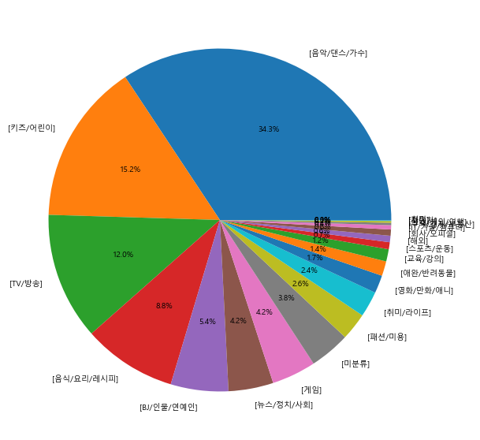
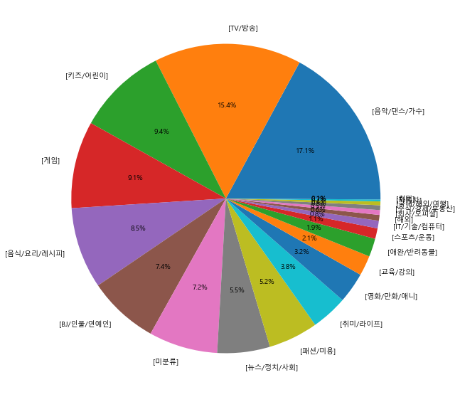

멜론, 벅스, 지니에서 제공하는 인기차트의 상위 곡 정보를 크롤링해보고 그 결과를 엑셀로 저장한 다음, 각 음원 서비스별로 크롤링 결과를 저장한 엑셀 파일들을 통합해서 저장해보겠다.

## 3.1 여러 음원 서비스의 순위 수집/정리하기

#### 1. 멜론 크롤링 결과를 엑셀로 저장


```python
#멜론 사이트 접속하기
from selenium import webdriver
from bs4 import BeautifulSoup

driver = webdriver.Chrome(r'C:\Users\hwn11\Data/chromedriver.exe')
url = 'http://www.melon.com/chart/index.htm'
driver.get(url)

html = driver.page_source
soup = BeautifulSoup(html, 'html.parser')
```


```python
#반복문을 이용해 곡과 가수명을 song_data에 저장
song_data = []
rank = 1
songs = soup.select('table > tbody > tr')
for song in songs:
    title = song.select('div.rank01 > span > a')[0].text
    singer = song.select('div.rank02 > a')[0].text
    song_data.append(['Melon', rank, title, singer])
    rank = rank + 1
```


```python
import pandas as pd
columns = ['서비스', '순위', '타이틀', '가수']
pd_data = pd.DataFrame(song_data, columns = columns)
pd_data.head()
```


<div>
<style scoped>
    .dataframe tbody tr th:only-of-type {
        vertical-align: middle;
    }

    .dataframe tbody tr th {
        vertical-align: top;
    }

    .dataframe thead th {
        text-align: right;
    }
</style>
<table border="1" class="dataframe">
  <thead>
    <tr style="text-align: right;">
      <th></th>
      <th>서비스</th>
      <th>순위</th>
      <th>타이틀</th>
      <th>가수</th>
    </tr>
  </thead>
  <tbody>
    <tr>
      <th>0</th>
      <td>Melon</td>
      <td>1</td>
      <td>Celebrity</td>
      <td>아이유</td>
    </tr>
    <tr>
      <th>1</th>
      <td>Melon</td>
      <td>2</td>
      <td>밤하늘의 별을(2020)</td>
      <td>경서</td>
    </tr>
    <tr>
      <th>2</th>
      <td>Melon</td>
      <td>3</td>
      <td>VVS (Feat. JUSTHIS) (Prod. GroovyRoom)</td>
      <td>미란이 (Mirani)</td>
    </tr>
    <tr>
      <th>3</th>
      <td>Melon</td>
      <td>4</td>
      <td>Dynamite</td>
      <td>방탄소년단</td>
    </tr>
    <tr>
      <th>4</th>
      <td>Melon</td>
      <td>5</td>
      <td>잠이 오질 않네요</td>
      <td>장범준</td>
    </tr>
  </tbody>
</table>
</div>


```python
pd_data.to_excel('melon.xlsx', index = False)
```

#### 2. 벅스 크롤링 결과를 엑셀 바일로 저장


```python
#벅스 사이트 접속하기
from selenium import webdriver
from bs4 import BeautifulSoup

driver = webdriver.Chrome(r'C:\Users\hwn11\Data/chromedriver.exe')
url = 'https://music.bugs.co.kr/chart'
driver.get(url)

html = driver.page_source
soup = BeautifulSoup(html, 'html.parser')
```


```python
#tr 태그로 곡 정보 찾기
songs = soup.select('tr')
print(len(songs))
```

    104
    


```python
songs = soup.select('tbody > tr')
print(len(songs))
```

    103
    


```python
songs = soup.select('table > tbody > tr')
print(len(songs))
```

    103
    


```python
#100개기 안나와서 table 태그에 있는 byChart라는 class 이름을 지정해 출력
songs = soup.select('table.byChart > tbody > tr')
print(len(songs))
```

    100
    


```python
songs[0]
```


    <tr albumid="4027185" artistid="80049126" multiartist="N" mvid="585654" rowtype="track" trackid="6065263">
    <input name="_isStream" type="hidden" value="6065263"/>
    <input name="_isDown" type="hidden" value="6065263"/>
    <td class="check"><input buyminquality="T" disc_id="1" name="check" title="Celebrity" type="checkbox" value="6065263"/></td>
    <td>
    <div class="ranking">
    <strong>1</strong>
    <p class="change none"><em>0</em><span>변동없음</span></p>
    </div>
    </td>
    <td>
    <a class="thumbnail" href="https://music.bugs.co.kr/album/4027185?wl_ref=list_tr_07_chart" onclick="
    ">
    <span class="mask"></span>
    
    </a>
    </td>
    <td>
    <a class="trackInfo" href="https://music.bugs.co.kr/track/6065263?wl_ref=list_tr_08_chart" onclick="
    ">곡정보</a>
    </td>
    <th scope="row">
    <p adult_yn="N" class="title">
    <a adultcheckval="1" aria-label="새창" href="javascript:;" onclick="bugs.wiselog.area('list_tr_09_chart');bugs.music.listen('6065263',true);
    " title="Celebrity">Celebrity</a>
    </p>
    </th>
    <td class="left">
    <p class="artist">
    <a href="https://music.bugs.co.kr/artist/80049126?wl_ref=list_tr_10_chart" onclick="
    " title="아이유(IU)">아이유(IU)</a>
    </p>
    </td>
    <td class="left">
    <a class="album" href="https://music.bugs.co.kr/album/4027185?wl_ref=list_tr_11_chart" onclick="
    " title="Celebrity">Celebrity</a>
    </td>
    <td>
    <a adultcheckval="1" aria-label="새창" class="btn play" href="javascript:;" onclick="bugs.wiselog.area('list_tr_12_chart');bugs.music.listen('6065263',true);
    ">듣기</a>
    </td>
    <td>
    <a adultcheckval="1" aria-label="새창" class="btn addPlaylist" href="javascript:;" onclick="bugs.wiselog.area('list_tr_13_chart');bugs.music.listen('6065263');
    ">재생목록에 추가</a>
    </td>
    <td>
    <a class="btn addAlbum" href="javascript:;" onclick="bugs.wiselog.area('list_tr_14_chart');bugs.music.addTrackToMyAlbum(this,'6065263');
    " track_title="Celebrity">내 앨범에 담기</a>
    </td>
    <td>
    <a adultcheckval="1" aria-label="새창" class="btn download flac" href="javascript:;" onclick="bugs.wiselog.area('list_tr_15_chart');bugs.layermenu.down(this,'6065263','true','true','44.1','true','48', null );
    "><em class="flac">flac </em>다운로드</a>
    </td>
    <td>
    <a aria-label="새창" class="btn viewMV" href="javascript:;" onclick="bugs.wiselog.area('list_tr_16_chart');
    bugs.layermenu.mv(this,6065263, 585654, 'Y', 'Y', 'Y', 'Y', 6065263, 'N','OVER_12', 'Y');
    ">영상 재생</a>
    </td>
    <td>
    <a artist_disp_nm="아이유(IU)" artist_id="80049126" class="btnActions" href="javascript:;" layer_type="CHART" layerpositiontarget="td" onclick="bugs.wiselog.area('list_tr_17_chart');
    bugs.layermenu.trackMoreAction(this,'6065263','0','4027185','bugs.music.listenRadioFromSeed(\'6065263\',\'track\');','N', 'Y', '_chart');
    " track_title="Celebrity">기타 기능</a>
    </td>
    </tr>


```python
#song 태그 안에서 'title' 찾아내기
song = songs[0]
title = song.select('p.title > a')[0].text
title
```


    'Celebrity'


```python
#가수 이름 찾아내기 
artist = song.select('p.artist > a')[0].text.strip()
artist
```


    '아이유(IU)'


```python
#반복문을 이용해 곡과 가수명을 song_data에 저장
song_data = []
rank = 1
songs = soup.select('table.byChart > tbody > tr')
for song in songs:
    title = song.select('p.title > a')[0].text
    singer = song.select('p.artist > a')[0].text
    song_data.append(['Bugs', rank, title, singer])
    rank = rank + 1
```


```python
import pandas as pd
columns = ['서비스', '순위', '타이틀', '가수']
pd_data = pd.DataFrame(song_data, columns = columns)
pd_data.to_excel('bugs.xlsx', index = False)
```

#### 3.지니 크롤링 결과 엑셀 파일로 저장


```python
#지니 사이트 접속
from selenium import webdriver
from bs4 import BeautifulSoup

driver = webdriver.Chrome(r'C:\Users/hwn11/Data/chromedriver.exe')
url = 'https://www.genie.co.kr/chart/top200'
driver.get(url)

html = driver.page_source
soup = BeautifulSoup(html, 'html.parser')
```


```python
songs = soup.select('tbody > tr')
len(songs)
```


    50


```python
song = songs[0]
title = song.select('a.title')[0].text.strip()
title
```


    'Celebrity'


```python
artist = song.select('a.artist')[0].text.strip()
artist
```


    '아이유 (IU)'


```python
song_data = []
rank = 1
songs = soup.select('tbody > tr')
for song in songs:
    title = song.select('a.title')[0].text.strip()
    artist = song.select('a.artist')[0].text.strip()
    song_data.append(['Genie', rank, title, singer])
    rank = rank + 1
```


```python
import pandas as pd

columns = ['서비스', '순위', '타이틀', '가수']
pd_data = pd.DataFrame(song_data, columns = columns)
pd_data.to_excel('genie.xlsx', index = False)
```

#### 4. 멜론, 벅스, 지니 크롤링 엑셀 파일 통합


```python
excel_names = ['melon.xlsx', 'bugs.xlsx', 'genie.xlsx']
appended_data = pd.DataFrame()
for name in excel_names:
    pd_data = pd.read_excel(name)
    appended_data = appended_data.append(pd_data)
```


```python
appended_data.info()
```

    <class 'pandas.core.frame.DataFrame'>
    Int64Index: 250 entries, 0 to 49
    Data columns (total 4 columns):
     #   Column  Non-Null Count  Dtype 
    ---  ------  --------------  ----- 
     0   서비스     250 non-null    object
     1   순위      250 non-null    int64 
     2   타이틀     250 non-null    object
     3   가수      250 non-null    object
    dtypes: int64(1), object(3)
    memory usage: 9.8+ KB
    


```python
appended_data
```


<div>
<style scoped>
    .dataframe tbody tr th:only-of-type {
        vertical-align: middle;
    }

    .dataframe tbody tr th {
        vertical-align: top;
    }

    .dataframe thead th {
        text-align: right;
    }
</style>
<table border="1" class="dataframe">
  <thead>
    <tr style="text-align: right;">
      <th></th>
      <th>서비스</th>
      <th>순위</th>
      <th>타이틀</th>
      <th>가수</th>
    </tr>
  </thead>
  <tbody>
    <tr>
      <th>0</th>
      <td>Melon</td>
      <td>1</td>
      <td>Celebrity</td>
      <td>아이유</td>
    </tr>
    <tr>
      <th>1</th>
      <td>Melon</td>
      <td>2</td>
      <td>밤하늘의 별을(2020)</td>
      <td>경서</td>
    </tr>
    <tr>
      <th>2</th>
      <td>Melon</td>
      <td>3</td>
      <td>VVS (Feat. JUSTHIS) (Prod. GroovyRoom)</td>
      <td>미란이 (Mirani)</td>
    </tr>
    <tr>
      <th>3</th>
      <td>Melon</td>
      <td>4</td>
      <td>Dynamite</td>
      <td>방탄소년단</td>
    </tr>
    <tr>
      <th>4</th>
      <td>Melon</td>
      <td>5</td>
      <td>잠이 오질 않네요</td>
      <td>장범준</td>
    </tr>
    <tr>
      <th>...</th>
      <td>...</td>
      <td>...</td>
      <td>...</td>
      <td>...</td>
    </tr>
    <tr>
      <th>45</th>
      <td>Genie</td>
      <td>46</td>
      <td>살았소</td>
      <td>에픽하이 (EPIK HIGH)</td>
    </tr>
    <tr>
      <th>46</th>
      <td>Genie</td>
      <td>47</td>
      <td>내 손을 잡아</td>
      <td>에픽하이 (EPIK HIGH)</td>
    </tr>
    <tr>
      <th>47</th>
      <td>Genie</td>
      <td>48</td>
      <td>나보다 더 사랑해요</td>
      <td>에픽하이 (EPIK HIGH)</td>
    </tr>
    <tr>
      <th>48</th>
      <td>Genie</td>
      <td>49</td>
      <td>2002</td>
      <td>에픽하이 (EPIK HIGH)</td>
    </tr>
    <tr>
      <th>49</th>
      <td>Genie</td>
      <td>50</td>
      <td>Panorama</td>
      <td>에픽하이 (EPIK HIGH)</td>
    </tr>
  </tbody>
</table>
<p>250 rows × 4 columns</p>
</div>


```python
appended_data.to_excel('total.xlsx', index = False)
```

## 3.2 유튜브 랭킹 데이터 수집과 시각화


```python
#유튜브 랭킹 데이터 수집하기
from selenium import webdriver
from bs4 import BeautifulSoup
import time
import pandas as pd

driver = webdriver.Chrome(r'C:\Users/hwn11/Data/chromedriver.exe')
url = 'https://youtube-rank.com/board/bbs/board.php?bo_table=youtube'
driver.get(url)

html = driver.page_source
soup = BeautifulSoup(html, 'html.parser')
```


```python
#BeautifulSoup으로 tr 태그 추출하기
channel_list = soup.select('form > table > tbody > tr')
len(channel_list)
```


    100


```python
channel = channel_list[0]
category = channel.select('p.category')[0].text.strip()
category
```


    '[음악/댄스/가수]'


```python
title = channel.select('h1 > a')[0].text.strip()
title
```


    'BLACKPINK'


```python
subscriber = channel.select('.subscriber_cnt')[0].text
view = channel.select('.view_cnt')[0].text
video = channel.select('.video_cnt')[0].text

print(subscriber)
print(view)
print(video)
```

    5570만
    145억5624만
    335개
    


```python
#페이지별 URL 만들기
results = []
for page in range(1, 11):
    url = f'https://youtube-rank.com/board/bbs/board.php?bo_table=youtube&page={page}'
    driver.get(url)
    html = driver.page_source
    soup = BeautifulSoup(html, 'html.parser')
    channel_list = soup.select('form > table > tbody > tr')
    for channel in channel_list:
        title = channel.select('h1 > a')[0].text.strip()
        category = channel.select('p.category')[0].text.strip()
        subscriber = channel.select('.subscriber_cnt')[0].text
        view = channel.select('.view_cnt')[0].text
        video = channel.select('.video_cnt')[0].text
        data = [title, category, subscriber, view, video]
        results.append(data)
```


```python
df = pd.DataFrame(results)
df.columns = ['title', 'category', 'subscriber', 'view', 'video']
df.to_excel('youtube_rank.xlsx', index = False)
```


```python
pd.read_excel('youtube_rank.xlsx')
```


<div>
<style scoped>
    .dataframe tbody tr th:only-of-type {
        vertical-align: middle;
    }

    .dataframe tbody tr th {
        vertical-align: top;
    }

    .dataframe thead th {
        text-align: right;
    }
</style>
<table border="1" class="dataframe">
  <thead>
    <tr style="text-align: right;">
      <th></th>
      <th>title</th>
      <th>category</th>
      <th>subscriber</th>
      <th>view</th>
      <th>video</th>
    </tr>
  </thead>
  <tbody>
    <tr>
      <th>0</th>
      <td>BLACKPINK</td>
      <td>[음악/댄스/가수]</td>
      <td>5570만</td>
      <td>145억5624만</td>
      <td>335개</td>
    </tr>
    <tr>
      <th>1</th>
      <td>Big Hit Labels</td>
      <td>[음악/댄스/가수]</td>
      <td>5010만</td>
      <td>140억5499만</td>
      <td>524개</td>
    </tr>
    <tr>
      <th>2</th>
      <td>BANGTANTV</td>
      <td>[음악/댄스/가수]</td>
      <td>4350만</td>
      <td>64억9519만</td>
      <td>1,400개</td>
    </tr>
    <tr>
      <th>3</th>
      <td>Boram Tube Vlog [보람튜브 브이로그]</td>
      <td>[키즈/어린이]</td>
      <td>2650만</td>
      <td>110억5288만</td>
      <td>223개</td>
    </tr>
    <tr>
      <th>4</th>
      <td>SMTOWN</td>
      <td>[음악/댄스/가수]</td>
      <td>2590만</td>
      <td>193억0254만</td>
      <td>3,642개</td>
    </tr>
    <tr>
      <th>...</th>
      <td>...</td>
      <td>...</td>
      <td>...</td>
      <td>...</td>
      <td>...</td>
    </tr>
    <tr>
      <th>995</th>
      <td>푸들커플</td>
      <td>[TV/방송]</td>
      <td>44만</td>
      <td>1억1237만</td>
      <td>260개</td>
    </tr>
    <tr>
      <th>996</th>
      <td>단하나 DANHANA</td>
      <td>[미분류]</td>
      <td>44만</td>
      <td>6225만</td>
      <td>74개</td>
    </tr>
    <tr>
      <th>997</th>
      <td>재민TV</td>
      <td>[게임]</td>
      <td>44만</td>
      <td>8473만</td>
      <td>576개</td>
    </tr>
    <tr>
      <th>998</th>
      <td>비됴클래스</td>
      <td>[교육/강의]</td>
      <td>44만</td>
      <td>3973만</td>
      <td>323개</td>
    </tr>
    <tr>
      <th>999</th>
      <td>앙 작비띠</td>
      <td>[음식/요리/레시피]</td>
      <td>44만</td>
      <td>1억3540만</td>
      <td>432개</td>
    </tr>
  </tbody>
</table>
<p>1000 rows × 5 columns</p>
</div>


#### 2. 유튜브 랭킹 데이터 시각화하기


```python
import pandas as pd
import matplotlib.pyplot as plt

from matplotlib import font_manager, rc
import platform
if platform.system() == 'Windows':
    path = r'C:\Windows\Fonts\malgun.ttf'
    font_name = font_manager.FontProperties(fname = path).get_name()
    rc('font', family = font_name)
elif platform.system() == 'Darwin':
    rc('font', family = 'AppleGothic')
else:
    print('Check your OS system')
```


```python
df = pd.read_excel('youtube_rank.xlsx')
df.head()
```


<div>
<style scoped>
    .dataframe tbody tr th:only-of-type {
        vertical-align: middle;
    }

    .dataframe tbody tr th {
        vertical-align: top;
    }

    .dataframe thead th {
        text-align: right;
    }
</style>
<table border="1" class="dataframe">
  <thead>
    <tr style="text-align: right;">
      <th></th>
      <th>title</th>
      <th>category</th>
      <th>subscriber</th>
      <th>view</th>
      <th>video</th>
    </tr>
  </thead>
  <tbody>
    <tr>
      <th>0</th>
      <td>BLACKPINK</td>
      <td>[음악/댄스/가수]</td>
      <td>5570만</td>
      <td>145억5624만</td>
      <td>335개</td>
    </tr>
    <tr>
      <th>1</th>
      <td>Big Hit Labels</td>
      <td>[음악/댄스/가수]</td>
      <td>5010만</td>
      <td>140억5499만</td>
      <td>524개</td>
    </tr>
    <tr>
      <th>2</th>
      <td>BANGTANTV</td>
      <td>[음악/댄스/가수]</td>
      <td>4350만</td>
      <td>64억9519만</td>
      <td>1,400개</td>
    </tr>
    <tr>
      <th>3</th>
      <td>Boram Tube Vlog [보람튜브 브이로그]</td>
      <td>[키즈/어린이]</td>
      <td>2650만</td>
      <td>110억5288만</td>
      <td>223개</td>
    </tr>
    <tr>
      <th>4</th>
      <td>SMTOWN</td>
      <td>[음악/댄스/가수]</td>
      <td>2590만</td>
      <td>193억0254만</td>
      <td>3,642개</td>
    </tr>
  </tbody>
</table>
</div>


```python
df['subscriber'][0:10]
```


    0    5570만
    1    5010만
    2    4350만
    3    2650만
    4    2590만
    5    2300만
    6    2160만
    7    1970만
    8    1810만
    9    1690만
    Name: subscriber, dtype: object


```python
df['replaced_subscriber'] = df['subscriber'].str.replace('만', '0000')
df.head()
```


<div>
<style scoped>
    .dataframe tbody tr th:only-of-type {
        vertical-align: middle;
    }

    .dataframe tbody tr th {
        vertical-align: top;
    }

    .dataframe thead th {
        text-align: right;
    }
</style>
<table border="1" class="dataframe">
  <thead>
    <tr style="text-align: right;">
      <th></th>
      <th>title</th>
      <th>category</th>
      <th>subscriber</th>
      <th>view</th>
      <th>video</th>
      <th>replaced_subscriber</th>
    </tr>
  </thead>
  <tbody>
    <tr>
      <th>0</th>
      <td>BLACKPINK</td>
      <td>[음악/댄스/가수]</td>
      <td>5570만</td>
      <td>145억5624만</td>
      <td>335개</td>
      <td>55700000</td>
    </tr>
    <tr>
      <th>1</th>
      <td>Big Hit Labels</td>
      <td>[음악/댄스/가수]</td>
      <td>5010만</td>
      <td>140억5499만</td>
      <td>524개</td>
      <td>50100000</td>
    </tr>
    <tr>
      <th>2</th>
      <td>BANGTANTV</td>
      <td>[음악/댄스/가수]</td>
      <td>4350만</td>
      <td>64억9519만</td>
      <td>1,400개</td>
      <td>43500000</td>
    </tr>
    <tr>
      <th>3</th>
      <td>Boram Tube Vlog [보람튜브 브이로그]</td>
      <td>[키즈/어린이]</td>
      <td>2650만</td>
      <td>110억5288만</td>
      <td>223개</td>
      <td>26500000</td>
    </tr>
    <tr>
      <th>4</th>
      <td>SMTOWN</td>
      <td>[음악/댄스/가수]</td>
      <td>2590만</td>
      <td>193억0254만</td>
      <td>3,642개</td>
      <td>25900000</td>
    </tr>
  </tbody>
</table>
</div>


```python
df['replaced_subscriber'] = df['replaced_subscriber'].astype('int')
df.info()
```

    <class 'pandas.core.frame.DataFrame'>
    RangeIndex: 1000 entries, 0 to 999
    Data columns (total 6 columns):
     #   Column               Non-Null Count  Dtype 
    ---  ------               --------------  ----- 
     0   title                1000 non-null   object
     1   category             1000 non-null   object
     2   subscriber           1000 non-null   object
     3   view                 1000 non-null   object
     4   video                1000 non-null   object
     5   replaced_subscriber  1000 non-null   int32 
    dtypes: int32(1), object(5)
    memory usage: 43.1+ KB
    


```python
#카테고리별 구독자 수, 채널 수 피봇 테이블 생성
pivot_df = df.pivot_table(index = 'category', values = 'replaced_subscriber', aggfunc = ['sum', 'count'])
pivot_df.head()
                                                                                        
```


<div>
<style scoped>
    .dataframe tbody tr th:only-of-type {
        vertical-align: middle;
    }

    .dataframe tbody tr th {
        vertical-align: top;
    }

    .dataframe thead tr th {
        text-align: left;
    }

    .dataframe thead tr:last-of-type th {
        text-align: right;
    }
</style>
<table border="1" class="dataframe">
  <thead>
    <tr>
      <th></th>
      <th>sum</th>
      <th>count</th>
    </tr>
    <tr>
      <th></th>
      <th>replaced_subscriber</th>
      <th>replaced_subscriber</th>
    </tr>
    <tr>
      <th>category</th>
      <th></th>
      <th></th>
    </tr>
  </thead>
  <tbody>
    <tr>
      <th>[BJ/인물/연예인]</th>
      <td>95570000</td>
      <td>74</td>
    </tr>
    <tr>
      <th>[IT/기술/컴퓨터]</th>
      <td>7130000</td>
      <td>8</td>
    </tr>
    <tr>
      <th>[TV/방송]</th>
      <td>211090000</td>
      <td>154</td>
    </tr>
    <tr>
      <th>[게임]</th>
      <td>73390000</td>
      <td>91</td>
    </tr>
    <tr>
      <th>[교육/강의]</th>
      <td>20250000</td>
      <td>21</td>
    </tr>
  </tbody>
</table>
</div>


```python
pivot_df.columns = ['subscriber_sum', 'category_count']
pivot_df.head()
```


<div>
<style scoped>
    .dataframe tbody tr th:only-of-type {
        vertical-align: middle;
    }

    .dataframe tbody tr th {
        vertical-align: top;
    }

    .dataframe thead th {
        text-align: right;
    }
</style>
<table border="1" class="dataframe">
  <thead>
    <tr style="text-align: right;">
      <th></th>
      <th>subscriber_sum</th>
      <th>category_count</th>
    </tr>
    <tr>
      <th>category</th>
      <th></th>
      <th></th>
    </tr>
  </thead>
  <tbody>
    <tr>
      <th>[BJ/인물/연예인]</th>
      <td>95570000</td>
      <td>74</td>
    </tr>
    <tr>
      <th>[IT/기술/컴퓨터]</th>
      <td>7130000</td>
      <td>8</td>
    </tr>
    <tr>
      <th>[TV/방송]</th>
      <td>211090000</td>
      <td>154</td>
    </tr>
    <tr>
      <th>[게임]</th>
      <td>73390000</td>
      <td>91</td>
    </tr>
    <tr>
      <th>[교육/강의]</th>
      <td>20250000</td>
      <td>21</td>
    </tr>
  </tbody>
</table>
</div>


```python
pivot_df = pivot_df.reset_index()
pivot_df.head()
```


<div>
<style scoped>
    .dataframe tbody tr th:only-of-type {
        vertical-align: middle;
    }

    .dataframe tbody tr th {
        vertical-align: top;
    }

    .dataframe thead th {
        text-align: right;
    }
</style>
<table border="1" class="dataframe">
  <thead>
    <tr style="text-align: right;">
      <th></th>
      <th>category</th>
      <th>subscriber_sum</th>
      <th>category_count</th>
    </tr>
  </thead>
  <tbody>
    <tr>
      <th>0</th>
      <td>[BJ/인물/연예인]</td>
      <td>95570000</td>
      <td>74</td>
    </tr>
    <tr>
      <th>1</th>
      <td>[IT/기술/컴퓨터]</td>
      <td>7130000</td>
      <td>8</td>
    </tr>
    <tr>
      <th>2</th>
      <td>[TV/방송]</td>
      <td>211090000</td>
      <td>154</td>
    </tr>
    <tr>
      <th>3</th>
      <td>[게임]</td>
      <td>73390000</td>
      <td>91</td>
    </tr>
    <tr>
      <th>4</th>
      <td>[교육/강의]</td>
      <td>20250000</td>
      <td>21</td>
    </tr>
  </tbody>
</table>
</div>


```python
pivot_df = pivot_df.sort_values(by = 'subscriber_sum', ascending = False)
pivot_df.head()
```


<div>
<style scoped>
    .dataframe tbody tr th:only-of-type {
        vertical-align: middle;
    }

    .dataframe tbody tr th {
        vertical-align: top;
    }

    .dataframe thead th {
        text-align: right;
    }
</style>
<table border="1" class="dataframe">
  <thead>
    <tr style="text-align: right;">
      <th></th>
      <th>category</th>
      <th>subscriber_sum</th>
      <th>category_count</th>
    </tr>
  </thead>
  <tbody>
    <tr>
      <th>12</th>
      <td>[음악/댄스/가수]</td>
      <td>603590000</td>
      <td>171</td>
    </tr>
    <tr>
      <th>17</th>
      <td>[키즈/어린이]</td>
      <td>267330000</td>
      <td>94</td>
    </tr>
    <tr>
      <th>2</th>
      <td>[TV/방송]</td>
      <td>211090000</td>
      <td>154</td>
    </tr>
    <tr>
      <th>11</th>
      <td>[음식/요리/레시피]</td>
      <td>155570000</td>
      <td>85</td>
    </tr>
    <tr>
      <th>0</th>
      <td>[BJ/인물/연예인]</td>
      <td>95570000</td>
      <td>74</td>
    </tr>
  </tbody>
</table>
</div>


```python
plt.figure(figsize = (30, 10))
plt.pie(pivot_df['subscriber_sum'], labels = pivot_df['category'], autopct = '%1.1f%%')
plt.show
```


    <function matplotlib.pyplot.show(*args, **kw)>





```python
pivot_df = pivot_df.sort_values(by = 'category_count', ascending = False)
pivot_df.head()
plt.figure(figsize = (30, 10))
plt.pie(pivot_df['category_count'], labels = pivot_df['category'], autopct = '%1.1f%%')
plt.show()
```





```python

```
